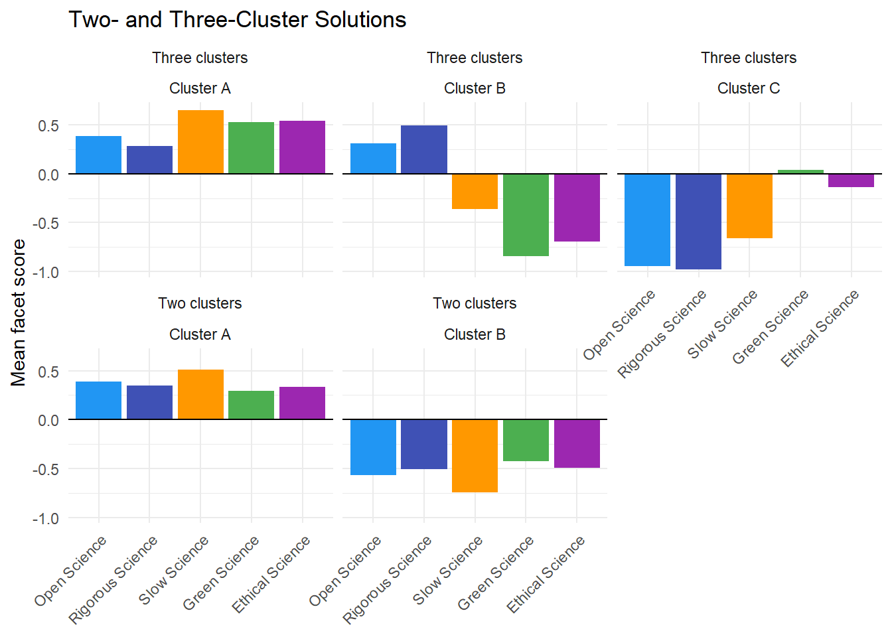
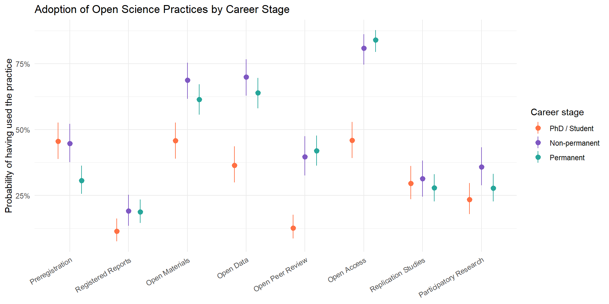
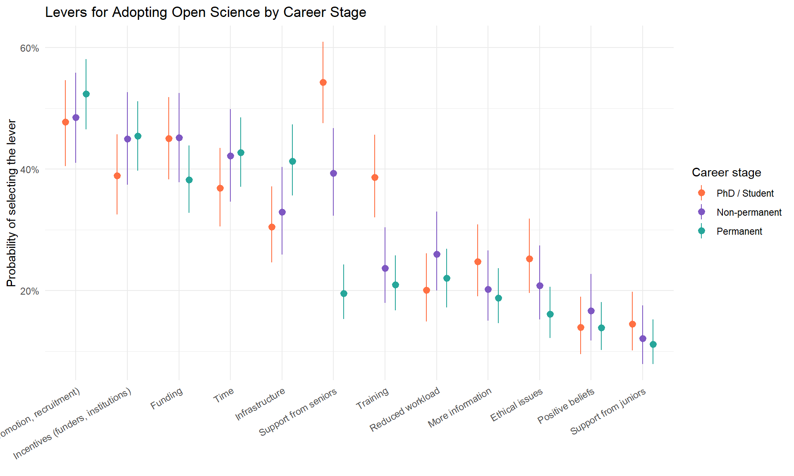
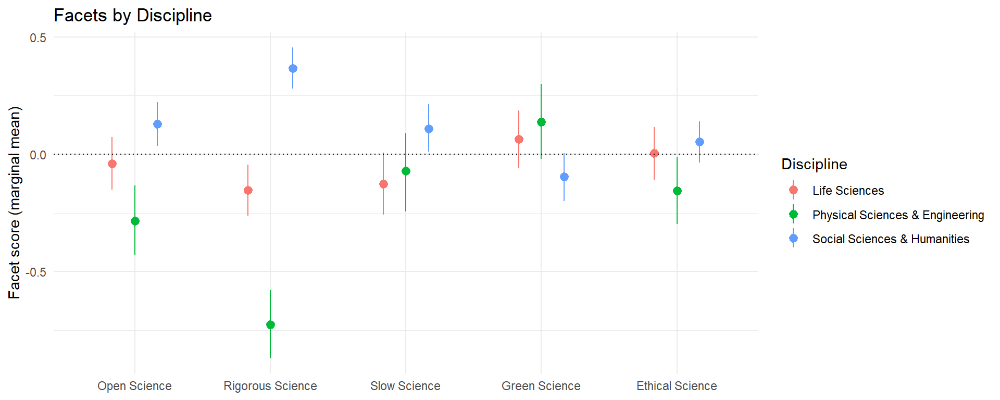
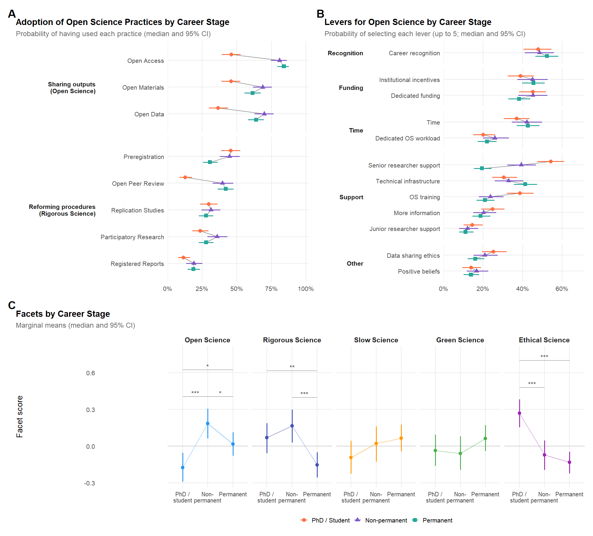
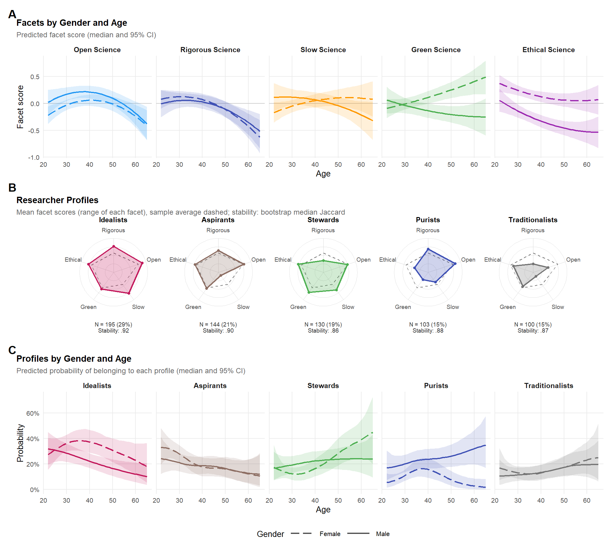

## Headline Findings

<!-- Written from the N = 672 data (MapResPrac-130726-N682.csv without the 10 respondents working outside Europe, 2026-10-02), open science practices scored as engagement ("not familiar" lowest), facet scores from the CFA with the two green beliefs also on Ethical Science, profiles from k-means (best of 200 starts, 2026-10-03): update when the data, scoring, CFA or clustering change. -->

Researchers working in Europe (N = 672, after excluding the 10 respondents working outside Europe; 57% women; 73% working in France; 44% on permanent contracts). Model estimates are posterior medians [95% CI], in factor-score units.

- **Rigour is the consensus criterion of quality, prestige is not.** Asked for the three most important criteria of scientific quality, 83% chose rigorous methodology, against 46% transparency / open science, 42% originality and 40% impact; only 7% chose publication in high impact factor journals, as few as chose inclusivity or environmental impact.
- **Novelty and rigour are traded off, and the balance shifts with age.** Choices oppose novelty and impact to rigour and transparency (e.g., originality vs. transparency, r = -.41). The novelty end gains ground with age (women: -0.70 [-0.92, -0.48] at 25, +0.49 [0.25, 0.74] at 55) and is stronger in men (+0.43 [0.16, 0.70] at the mean age). Part of this opposition is built into the forced choice of three criteria.
- **Barriers to open science are seen as structural.** Career recognition (51%), institutional incentives (44%), dedicated funding (42%) and time (40%) come well ahead of information (21%) or training (28%); 4% say nothing would help.
- **Slow science means quality over quantity, and is a job for institutions.** 87% of the participants familiar with it define it as quality over quantity (chunk `slow_science_ratings`: unfamiliar participants had to answer the mandatory questions, so definitions and importance are described among the familiar). Its measures are assigned to institutions far more than to individuals (assessing quality rather than quantity: 87% vs. 44%), and hard caps (one article, or one grant, per year) are judged not feasible by 28%.
- **Research values are multidimensional.** Five weakly to moderately correlated factors (largest: green-ethical, .43) separate green, slow and ethical science, and split open science into open outputs (Open Science: open data, materials, access) and procedural reforms (Rigorous Science: preregistration, registered reports, replication, participatory research). Two green items (link between research and sustainability, willingness to change) load on both Green and Ethical, so Ethical Science is a broader sense of responsibility that includes environmental beliefs. The CFA retained lets these two items load on both factors: it fits acceptably (CFI = .92, RMSEA = .054, SRMR = .053), better than the movement-based model with all green items on Green only (CFI = .89, AIC 97 points higher). The EFA split of open science holds under three other scorings of the practices, and the facet scores barely change (r ≥ .86), except Open and Rigorous Science when not knowing a practice is treated as missing (r = .70 and .59).
- **Gender and career stage split these dimensions differently.** At the mean age, men score lower than women on Ethical (-0.44 [-0.57, -0.31]) and Green Science (-0.20 [-0.36, -0.05]), slightly higher on Open Science (+0.16 [0.02, 0.30]), and similar on Rigorous and Slow Science; the green and ethical gaps widen with age. Rigorous Science declines after 45 and is lowest among permanent staff (-0.31 [-0.52, -0.11] vs. non-permanent), Open Science peaks among non-permanent researchers (+0.30 [0.09, 0.53] vs. PhD students), whereas permanent staff value Slow Science more (+0.25 [0.02, 0.47] vs. PhD students), and Ethical Science is highest among PhD students (permanent staff: -0.32 [-0.51, -0.13]); career worry adds nothing within career stages: reforming *how* research is done is carried by early-career researchers, slowing it down by those in secure positions.
- **Five researcher profiles, all stable.** Five profiles can be described, named after their pattern (chunk `profile_names`): *Idealists* (A, 29%: high on Open, Rigorous, Slow and Ethical, slightly on Green), *Aspirants* (B, 21%: near average, low on Slow, which 72% have never heard of; the youngest profile, with the most plans to preregister and the most requests for senior support; chunk `profile_correlates`), *Stewards* (C, 19%: high on Green, Slow and Ethical, low on Rigorous), *Purists* (D, 15%: high on Open and Rigorous, low on Green and Ethical) and *Traditionalists* (E, 15%: low on Open, Rigorous, Slow and Ethical). The partition is reproducible (bootstrap median ARI = .86, 95% range .56-.96; two clusters: .88, three: .81) and so is every profile (median Jaccard .86-.92, dissolved in 0-7% of resamples). The indices favour two or three clusters (6 of 24 each, 5 clusters: 4), but they do so as much in data simulated without groups (2: 5.7, 3: 8.6, 5: 0.9 on average, at most 2), and the facet scores are no more clustered than such data (silhouette with five clusters .24 vs. .24; the five-cluster partition is more reproducible, .86 vs. .70, the three-cluster one less, .81 vs. .88; chunk `cluster_null`): attitudes vary along a continuum, and five is a choice of resolution, the smallest at which each combination of the epistemic and societal sides forms a profile (with four clusters, the Stewards are split between the all-round reformers and the non-adopters; chunk `profile_nesting`). Hierarchical k-means, used until 2026-10-03, stopped on a partition 5.6% worse in within-cluster sum of squares than k-means with 200 random starts: this made the profiles look unstable (ARI .50) and reshuffled them when the 10 respondents working outside Europe were excluded, whereas k-means finds nearly the same five profiles at N = 682 and N = 672 (ARI .90). Between 25 and 55, women move towards the Stewards (+19 percentage points [6, 33]) and away from the Aspirants (-18 [-30, -5]), men away from the Idealists (-17 [-30, -3]); men are more often Purists (+11 [2, 21] at 25, +24 [13, 36] at 55) and less often Idealists (35-55 years; -15 [-26, -5] at 45). These trajectories mirror those of the facets (Green Science rising with age among women only; gender gaps on Green and Ethical Science).

*Robustness checks and additional analyses (2026-09-30, section "Career Stage, Training, Discipline and Country" and the sensitivity subsections of the CFA). Integrated in the manuscript on 2026-09-30 (chunk `export_career` feeds its numbers): H1-H4, training, discipline, precariousness, well-being and France in the Results, the slow science sensitivity in the "bridge" subsection, the criteria validity check and the two/three-cluster solutions as one sentence each, invariance in the Limitations. Left in the notebook only: the ordinal CFA (one pointer sentence in the Methods).*

- **The facet structure is not an artefact of the ordinal practice items or of ceiling effects.** On polychoric/polyserial correlations, the EFA puts every open science item on the same facet as with Pearson correlations (loadings slightly higher). Declaring the practice items ordinal (WLSMV) fits a little worse (CFI = .89 vs. .92, RMSEA .055 vs. .054), moves no latent correlation by more than .06, and gives facet scores correlating ≥ .97 with the retained ones. Three sliders have a third of answers at the ceiling (societal consequences 33%, open science importance 32%, willingness to change 22%).
- **Slow Science is partly knowledge, and this matters for its "bridge".** With the importance rating of unfamiliar participants set to missing, its correlations with Open (.35) and Green Science (.21) barely move, and those with Rigorous (.17) and Ethical Science (.34) change by at most .09. Among the 453 participants familiar with the movement, however, its link with Rigorous Science vanishes (.01 vs. .20) and with Open Science halves (.16 vs. .34), whereas its links with Ethical (.31) and Green Science (.14) hold. The bridge towards the epistemic side is thus mostly exposure to meta-science debates; the link with the societal side is endorsement. *(2026-10-03, chunks `slow_science_ratings` and `slow_science_profiles`)* The importance ratings of the unfamiliar participants are not judgements: 89.5% are exactly 0 and 5% exactly 50, vs. 10% exact zeros among the familiar and 1-8% on the other attitude sliders. Among the familiar, importance is *M* = 64.3. The facet is kept as is and read as engagement (knowing and valuing): with these ratings missing, unfamiliar participants still score low (-0.79 vs. -1.07 SD), scores correlate .92, CFI drops (.902 vs. .920), and the profiles change little (ARI .74; 87% of the Aspirants stay together). Without Slow Science, 61% of the Aspirants join the Idealists (four clusters, bootstrap ARI .66 vs. .86).
- **Two clusters split the sample into more and less reform-minded (399 vs. 273); three clusters recover the two sides.** Cluster A (296, 62% women) is high on everything, most on Slow, Green and Ethical Science (Idealists + most of the Stewards); B (193, 46% women) is high on Rigorous and Open Science and low on Green and Ethical (Purists + part of the Aspirants); C (183, 61% women) is low on Open and Rigorous Science and average on the societal facets (Traditionalists + part of the Stewards and of the Aspirants). The three-cluster solution is thus "all-round reformers", "procedural reformers who set the societal side aside" and "non-adopters" (the cluster letters follow size and change with the data).
- **H1, knowledge and training by career stage: training differs, familiarity does not.** Familiarity with open science is the same at every stage (.73-.74), its importance slightly higher among PhD students (+0.05 vs. permanent). Training is graded: 64% of PhD students, 56% of non-permanent and 44% of permanent researchers (permanent - PhD: -0.20 [-0.28, -0.11]). Familiarity with slow science is instead higher among permanent staff (+0.10 [0.04, 0.16] vs. PhD students).
- **H2, adoption: sharing outputs comes with career progress, preregistration goes the other way.** Open access, open data, open materials and open peer review are used far more by non-permanent and permanent researchers than by PhD students (open access: 46% vs. 81-84%; +0.35 [0.26, 0.44]), even among PhD students with publications (66%). Preregistration is the exception: 46% of PhD students and 45% of non-permanent researchers vs. 31% of permanent staff (-0.15 [-0.24, -0.06]); registered reports are slightly more used by the two later stages, and replication studies do not differ. Unfamiliarity with preregistration and registered reports rises to a third among permanent staff.
- **H3-H4, levers: structural at every stage; time and recognition are not more selected by non-permanent researchers.** Recognition (48-52%), incentives, funding and time top the list at every stage; time (42% vs. 43%) and recognition (49% vs. 52%) do not differ between non-permanent and permanent researchers (H4 not supported). What differs is support from seniors (54% of PhD students, 39% of non-permanent, 19% of permanent; permanent - PhD: -0.35 [-0.43, -0.27]) and training (39% vs. 21%), whereas permanent staff ask more for infrastructure (+0.11).
- **Training accounts for part of the career stage effect on Rigorous Science.** Open science training goes with higher Open (+0.60 [0.47, 0.73]), Rigorous (+0.71 [0.58, 0.83]) and Slow Science (+0.34); slow science training (5% of participants) with Slow Science (+1.00) and the societal facets (+0.4). Adjusting for training shrinks the permanent - PhD gap on Rigorous Science from -0.22 to -0.09 and the permanent - non-permanent gap from -0.32 to -0.24; the stage gaps on Open and Ethical Science are unchanged.
- **Discipline shapes procedural reform, not the gender gaps.** The social sciences are far higher on Rigorous Science (+1.09 [0.92, 1.26] vs. physical sciences, +0.52 vs. life sciences; preregistration used by 57%, 28% and 8%) and higher on Open Science, and slightly lower on Green Science (-0.16 to -0.23). With discipline as a covariate, the gender gaps on Ethical (-0.43) and Green Science (-0.25) are unchanged, and the null gap on Rigorous Science becomes slightly positive (+0.10 [-0.04, 0.24]).
- **Precariousness proper adds nothing.** Among non-permanent researchers (mean perceived probability of a permanent position .41), the probability has no clear effect on any facet (Open: +0.28 [-0.12, 0.67]; Rigorous: +0.28 [-0.12, 0.67]; societal facets negative and uncertain). Those intending to pursue an academic career score higher on Rigorous Science (0.27 vs. -0.28 for those who do not).
- **Reformers are not less aligned or worse off.** Rigorous Science goes with feeling more aligned with one's principles (+0.05 [0.02, 0.07] per unit) and, more tentatively, more fulfilled (+0.02 [-0.00, 0.05]), Green Science with fulfilment (+0.03 [-0.00, 0.05]); no facet relates to time for research, career worry, work-life balance or satisfaction with the number of publications (Open Science: +0.04 [0.01, 0.06] on publication quality).
- **France vs. the rest of Europe: less open, greener, but confounded.** French respondents score lower on Open (-0.44 [-0.58, -0.30]) and Rigorous Science (-0.78 [-0.92, -0.64]; preregistration 28% vs. 68%, open science training 47% vs. 69%) and higher on Green Science (+0.33). The other European respondents are mostly non-permanent (77%) and presumably more often psychologists, so this is descriptive.
- **Measurement invariance: metric holds by career stage, is borderline by gender and discipline, scalar fails.** Delta CFI for equal loadings: -.004 (stage), -.013 (discipline), -.016 (gender); for equal intercepts: -.016 to -.049. Latent mean comparisons across gender and discipline should be read with this caveat.
- **The criteria of quality validate the facets.** Choosing environmental impact goes with Green (d = 1.18) and Ethical Science (.80), inclusivity with Ethical Science (.43), transparency with Open (.35) and Ethical Science (.33), high impact factor journals with low Open Science (-.63), and originality and significance with lower scores on all facets.
- **No sign of careless responding.** Median completion 11.6 min (IQR 9.2-15.5), 0.6% under 5 min, no participant straightlining the sliders.

## Data Preparation


::: {.cell}

```{.r .cell-code}
# Uncached: knitr does not re-attach packages when cached chunks are loaded
library(tidyverse)
library(easystats)
library(patchwork)
library(ggside)
library(ggdist)
library(ggraph)
library(tidygraph)
library(brms)
```
:::


::: {.cell}

```{.r .cell-code  code-fold="true"}
question_labels <- readxl::read_xlsx("../data/MapResPrac_correspondance.xlsx")
# names(question_labels)  # Question long names

df <- read.csv("../data/MapResPrac-130726-N682.csv")
names(df) <- as.character(as.vector(question_labels[1,])) |>
  str_replace_all(fixed(".  "), "_") |>
  str_replace_all(fixed(". "), "_") |>
  str_replace_all(fixed("."), "_") |>
  str_replace_all(fixed(" "), "_") |>
  str_replace_all(fixed("/"), "_")
dictionary <- data.frame(Variable = names(df), Question = names(question_labels))

# Inclusion criterion: researchers working in Europe (country rule shared with the manuscript)
source("inclusion.R")
n_raw <- nrow(df)
df_excluded <- filter(df, works_outside_europe(Work_Country))
df <- filter(df, !works_outside_europe(Work_Country))

format_binary <- function(x) {
  case_when(x == "Yes" ~ 1, x == "No" ~ 0, .default = NA)
}
# Engagement with an open science practice: not knowing it is the lowest level,
# below knowing it and not planning to use it (those answering "not familiar"
# are the least familiar with, and trained in, open science overall)
format_use <- function(x) {
  case_when(x == "I know it and I used it" ~ 3/3,
            x == "I haven't used it yet, but I plan to do it in the future" ~ 2/3,
            x == "I haven't used it yet, and I don't plan to do it in the future" ~ 1/3,
            x == "I am not familiar with it" ~ 0,
            .default = NA)
}


df <- df |>
  select(-contains(" time: ")) |>
  mutate(Dem_Gender = ifelse(Dem_Gender == "Non-binary", "Other", Dem_Gender),
         Dem_Age = ifelse(Dem_Age < 18, NA, Dem_Age),
         OS_Familiar = OS_Familiar / 100,
         OS_Importance = OS_Importance / 100,
         OS_Workshops = format_binary(OS_Workshops),
         OS_Study_Preregistration = format_use(OS_Study_Preregistration),
         OS_Registered_Reports = format_use(OS_Registered_Reports),
         OS_Open_Materials = format_use(OS_Open_Materials),
         OS_Open_Data = format_use(OS_Open_Data),
         OS_Open_Peer_Review = format_use(OS_Open_Peer_Review),
         OS_Open_Access_Publication = format_use(OS_Open_Access_Publication),
         OS_Replication_Studies = format_use(OS_Replication_Studies),
         OS_Participatory_Research = format_use(OS_Participatory_Research),
         OS_Help_More_Information = format_binary(OS_Help_More_information),
         OS_Help_Training = format_binary(OS_Help__training),
         OS_Help_Ethical_Issues = format_binary(OS_Help_ethical_issues),
         OS_Help_Infrastructure = format_binary(OS_Help_infrastructure),
         OS_Help_Time = format_binary(OS_Help_time),
         OS_Help_Workload = format_binary(OS_Help_Workload),
         OS_Help_Funding = format_binary(OS_Help_Funding),
         OS_Help_Incentives_Fund_Institutions = format_binary(OS_Help_Incentives_fund_institutions),
         OS_Help_Recognition_Promotion_Recruitment = format_binary(OS_Help_Recognition_promotion_recruitment),
         OS_Help_Support_Seniors = format_binary(OS_Help_Support_seniors),
         OS_Help_Support_Juniors = format_binary(OS_Help_Support_juniors),
         OS_Help_Positive_Beliefs = format_binary(OS_Help_Positive_beliefs),
         OS_Help_No_Plan_Use_OS = format_binary(OS_Help_No_plan_Use_OS),
         OS_Help_Nothing = format_binary(OS_Help_Nothing),
         # Slow Science
         SS_Familiar = SS_Familiar / 100,
         SS_Importance = SS_Importance / 100,
         SS_Workshops = format_binary(SS_Workshops),
         SS_Definition_Quality_over_quantity = format_binary(SS_Definition_Quality_over_quantity),
         SS_Definition_Slow_Process = format_binary(`SS_Definition__slow_process_over_short-term`),
         SS_Definition_Changing_Metrics = format_binary(SS_Definition_Changing_metrics),
         SS_Definition_Increase_Research_Time = format_binary(SS_Definition_Increase_research_time),
         SS_Definition_Diminishing_Publications = format_binary(SS_Definition_Diminishing_publications),
         SS_Definition_Work_Life_Balance = format_binary(`SS_Definition_work-life_balance`),
         across(starts_with("SS_") & matches("Feasible|Not_Feasible"), ~replace_na(.x, 0)),
         # Green Science
         GS_Importance_conducting = GS_Importance_conducting / 100,
         GS_Importance_topic = GS_Importance_topic / 100,
         GS_Changes_practices = GS_Changes_practices / 100,
         GS_Changes_communication_practices = GS_Changes_communication_practices / 100,
         GS_Relation_Research_Sustainability = GS_Relation_research_sustanability / 100,
         GS_Change_practices_agreeing = GS_Change_practices_agreeing / 100,
         # Ethical Science
         ES_Importance_research_team = ES_Importance_research_team / 100,
         ES_Consequences_society = ES_Consequences_society / 100,
         # Well-being (0-100 sliders → 0-1)
         WB_Fulfilled              = WB_Fulfilled / 100,
         WB_Alignment              = WB_Alignment / 100,
         WB_Time_research          = WB_Time_research / 100,
         WB_Satisfaction_work_personal = WB_Satisfaction_work_personal / 100,
         WB_Carrer_worry           = WB_Carrer_worry / 100,
         # Career stage (ordered: PhD/Student < Non-permanent < Permanent)
         Work_Career_Stage = fct_relevel(case_when(
           Work_Position %in% c("Master student/Research assistant",
                                "PhD candidate (scholarship, other funding)",
                                "PhD candidate (no funding/self funded)") ~ "PhD / Student",
           Work_Position %in% c("Postdoc (fixed term)",
                                "Researcher/lecturer (fixed term)",
                                "Engineer (fixed term)")                      ~ "Non-permanent",
           Work_Position == "Permanent position"                              ~ "Permanent",
           .default = NA_character_
         ), "PhD / Student", "Non-permanent", "Permanent"),
         # Does the researcher value impact-factor journals as a quality criterion?
         Work_IF_Values = as.numeric(`Work_Criteria_quality_science_high-IF` == "Yes"),
         Work_Time_Research = Work_Time_Research / 100,
         Work_Time_Teaching = Work_Time_Teaching / 100,
         Work_Time_Administration = Work_Time_Administration / 100,
         Work_Time_Popularization = Work_Time_Popularization / 100,
         Work_Time_Other = Work_Time_Other / 100,
         Work_Satisfaction_numb_publications = Work_Satisfaction_numb_publications / 100,
         Work_Satisfaction_quality_publications = Work_Satisfaction_quality_publications / 100,
         Work_Probability_permanent_position = Work_Probability_permanent_position / 100
         ) |>
  select(-OS_Help__training,
         -OS_Help_More_information,
         -OS_Help_ethical_issues,
         -OS_Help_infrastructure,
         -OS_Help_time,
         -OS_Help_Incentives_fund_institutions,
         -OS_Help_Recognition_promotion_recruitment,
         -OS_Help_Support_seniors,
         -OS_Help_Support_juniors,
         -OS_Help_Positive_beliefs,
         -OS_Help_No_plan_Use_OS,
         -`SS_Definition__slow_process_over_short-term`,
         -`SS_Definition_work-life_balance`,
         -SS_Definition_Changing_metrics,
         -SS_Definition_Increase_research_time,
         -SS_Definition_Diminishing_publications,
         -GS_Relation_research_sustanability)


# head(df)
# names(df)
```
:::


::: {.cell}

```{.r .cell-code}
# Respondents working outside Europe are excluded (inclusion criterion). The rule
# is in inclusion.R; check the countries kept (Descriptive Statistics) when the data change
df_excluded |>
  mutate(Country = clean_country(Work_Country),
         Position = Work_Position) |>
  count(Country, Position, name = "N") |>
  knitr::kable(format = "pipe",
               caption = sprintf("Respondents working outside Europe, excluded: %i of %i (%.1f%%); %i analysed",
                                 nrow(df_excluded), n_raw, 100 * nrow(df_excluded) / n_raw, nrow(df)))
```

::: {.cell-output-display}


Table: Respondents working outside Europe, excluded: 10 of 682 (1.5%); 672 analysed

|Country       |Position                                   |  N|
|:-------------|:------------------------------------------|--:|
|Australia     |Permanent position                         |  1|
|Brazil        |Master student/Research assistant          |  1|
|Canada        |Postdoc (fixed term)                       |  2|
|China         |PhD candidate (scholarship, other funding) |  1|
|Puerto Rico   |Permanent position                         |  1|
|United States |Permanent position                         |  1|
|United States |Postdoc (fixed term)                       |  2|
|United States |Researcher/lecturer (fixed term)           |  1|


:::
:::


::: {.cell}

```{.r .cell-code}
plot_graph <- function(fa_res, 
                       threshold = 0.3, 
                       loading_text_size = 2.8,
                       arrow_end_gap = 0.10,         
                       factor_node_size = c(22, 35),
                       expand = c(0.5, 0.5),
                       names_factors = NULL,
                       color_variables = "#95A5A6",
                       color_factors = "#2C3E50"
) {
  
  meta_cols <- c("Complexity", "Uniqueness", "MSA", "Mean", "SD")
  
  # Helper function to process colors and reorder nodes
  process_colors_and_order <- function(items, color_input, default_color) {
    if (is.null(color_input)) {
      return(list(items = items, colors = rep(default_color, length(items))))
    }
    
    if (is.list(color_input)) color_input <- unlist(color_input)
    
    # 1. Handle named list/vector (e.g., c("Var3" = "red", "Var1" = "blue"))
    if (!is.null(names(color_input))) {
      input_names <- names(color_input)
      
      # Match against existing nodes
      valid_names <- input_names[input_names %in% items]
      missing_items <- setdiff(items, valid_names)
      
      # Reorder: Listed items first, missing items follow
      ordered_items <- c(valid_names, missing_items)
      
      # Assign colors based on new order
      mapped_colors <- color_input[ordered_items]
      mapped_colors[is.na(mapped_colors)] <- default_color # Fallback for missing
      
      return(list(items = ordered_items, colors = unname(mapped_colors)))
    }
    
    # 2. Handle single color value
    if (length(color_input) == 1) {
      return(list(items = items, colors = rep(color_input, length(items))))
    }
    
    # 3. Handle unnamed vector of matching length
    if (length(color_input) == length(items)) {
      return(list(items = items, colors = color_input))
    }
    
    # Fallback
    warning("Color vector length does not match number of nodes. Using default color.")
    return(list(items = items, colors = rep(default_color, length(items))))
  }
  
  
  # 1. Extract ALL loadings first
  df_all <- fa_res |>
    as.data.frame() |>
    data_remove(meta_cols) |>
    data_to_long(
      select = -Variable,
      names_to = "Factor",
      values_to = "Loading"
    )
  
  # Process Variables (Color & Order)
  var_processed <- process_colors_and_order(unique(df_all$Variable), color_variables, "#95A5A6")
  variables <- var_processed$items
  var_colors <- var_processed$colors
  n_var <- length(variables)
  
  # Process Factors (Color & Order)
  fac_processed <- process_colors_and_order(unique(df_all$Factor), color_factors, "#2C3E50")
  original_factors <- fac_processed$items
  fac_colors <- fac_processed$colors
  n_fac <- length(original_factors)
  
  # Process Custom Factor Names for Labels
  display_factors <- original_factors
  
  if (!is.null(names_factors)) {
    if (!is.null(names(names_factors))) {
      if (any(unlist(names_factors) %in% original_factors)) {
        lookup <- setNames(names(names_factors), unlist(names_factors))
      } else {
        lookup <- setNames(unlist(names_factors), names(names_factors))
      }
      matched <- original_factors %in% names(lookup)
      display_factors[matched] <- lookup[original_factors[matched]]
      
    } else if (length(names_factors) == n_fac) {
      display_factors <- unlist(names_factors)
    } else {
      warning("`names_factors` must be named, or match the exact number of factors. Ignoring custom names.")
    }
  }
  
  # 2. Extract Variance Explained
  var_attr <- attributes(fa_res)$variance
  
  if (!is.null(var_attr)) {
    if (is.numeric(var_attr)) {
      prop_var <- var_attr
    } else if (is.data.frame(var_attr) && "Variance" %in% names(var_attr)) {
      prop_var <- var_attr$Variance
    }
    
    if (is.null(names(prop_var)) && length(prop_var) >= n_fac) {
      # Names map to the reordered list
      names(prop_var) <- original_factors 
    }
  } else {
    ss_loadings <- tapply(df_all$Loading^2, df_all$Factor, sum)
    prop_var <- as.numeric(ss_loadings / n_var)
    names(prop_var) <- names(ss_loadings)
  }
  
  if (max(prop_var, na.rm = TRUE) > 1) {
    prop_var <- prop_var / 100
  }
  
  # 3. Filter by threshold and reshape
  edges <- df_all |>
    subset(abs(Loading) >= threshold) |>
    data_rename(
      pattern = c("Variable", "Factor", "Loading"),
      replacement = c("from", "to", "weight")
    )
  
  # 4. Build a Manual Layout
  # Variables map to coordinates decreasing from n_var -> 1 (Places first item at the top)
  y_var <- seq(n_var, 1)
  
  y_fac <- seq(
    from = n_var - 0.5, 
    to = 1.5, 
    length.out = n_fac
  )
  
  nodes <- data.frame(
    name = c(original_factors, variables),
    type = c(rep("Factor", n_fac), rep("Variable", n_var)),
    x = c(rep(1, n_fac), rep(0, n_var)),
    y = c(y_fac, y_var),
    variance = c(prop_var[original_factors], rep(NA, n_var)),
    label_text = c(
      sprintf("%s\n(%.1f%%)", display_factors, prop_var[original_factors] * 100), 
      variables
    ),
    node_color = c(fac_colors, var_colors) # Append our mapped colors
  )
  
  # 5. Build the tidygraph object
  graph <- tbl_graph(nodes = nodes, edges = edges, directed = TRUE)
  
  # 6. Plot using ggraph
  ggraph(graph, layout = "manual", x = x, y = y) + 
    
    # -- EDGES --
    geom_edge_link(
      aes(
        edge_width = abs(weight),
        edge_alpha = abs(weight),
        color = weight,
        label = sub("^(-?)0\\.", "\\1.", sprintf("%.2f", weight))
      ),
      arrow = arrow(length = unit(4, 'mm'), type = "closed"),
      start_cap = circle(0, 'mm'),    
      end_cap = circle(arrow_end_gap, 'snpc'), 
      angle_calc = 'along',
      label_dodge = unit(2.5, 'mm'),  
      label_size = loading_text_size
    ) +
    
    # -- FACTOR NODES --
    geom_node_point(
      aes(filter = type == "Factor", size = variance, fill = node_color),
      shape = 21,
      color = "white",
      stroke = 1.5,
      show.legend = FALSE
    ) +
    
    # -- FACTOR TEXT --
    geom_node_text(
      aes(filter = type == "Factor", label = label_text),
      color = "white",
      fontface = "bold",
      size = 3.5,
      lineheight = 0.9 
    ) +
    
    # -- VARIABLE NODES --
    geom_node_label(
      aes(filter = type == "Variable", label = label_text, fill = node_color),
      color = "white",
      fontface = "bold",
      size = 3.5,
      hjust = 1, 
      label.padding = unit(0.5, "lines"),
      show.legend = FALSE
    ) +
    
    # -- SCALES & AESTHETICS --
    scale_fill_identity() + # Evaluates our hex colors natively
    scale_size_continuous(range = factor_node_size, guide = "none") +
    scale_edge_color_gradient2(
      low = "#E74C3C", mid = "grey85", high = "#2ECC71",
      midpoint = 0, guide = "none" 
    ) +
    scale_edge_width_continuous(range = c(0.5, 2.5), guide = "none") +
    scale_edge_alpha_continuous(range = c(0.4, 1), guide = "none") +
    
    # -- CANVAS EXPANSION & THEME --
    scale_x_continuous(expand = expansion(add = expand)) +
    coord_cartesian(clip = "off") + 
    
    theme_graph(base_family = "sans") +  # Default "Arial Narrow" is often not installed
    theme(
      plot.title = element_text(size = 14, face = "bold", hjust = 0.5),
      plot.margin = margin(20, 20, 20, 20) 
    ) +
    labs(title = "Factor Analysis Loadings")
}
```
:::


::: {.cell}

:::


### Data Dictionary


::: {.cell}
::: {.cell-output-display}
::: {.callout-note collapse="true" title="Data dictionary (Markdown table, for text readers)"}

|Variable |Question |
|:-----------------------------------------------------|:--------------------------------------------------------------------------------------------------------------------------------------------------------------------------------------------------------------------------------------------------------------------------------------------------------------------|
|id_Response_ID |id. Response ID |
|submitdate_Date_submitted |submitdate. Date submitted |
|lastpage_Last_page |lastpage. Last page |
|startlanguage_Start_language |startlanguage. Start language |
|seed_Seed |seed. Seed |
|startdate_Date_started |startdate. Date started |
|datestamp_Date_last_action |datestamp. Date last action |
|Dem_Age |Q01[SQ001]. Your age: [] |
|Dem_Gender |Q02. Your gender: |
|Dem_Gender_other |Q02[other]. Your gender: [Other] |
|Dem_Child_numb |G02Q40. How many children do you have? |
|Dem_Parental_leave |G02Q41. How long have you been on parental leave overall (for all your children)? |
|Work_Country |Q03. Country of workplace |
|Work_Affiliation |Q04. Academic affiliation (e.g. Sorbonne University, Karolinska Institute, University College London, CNRS...) |
|Work_Discipline |Q05. Your discipline (select the most appropriate answer): |
|Work_Subdiscipline |Q06. Specify your subdiscipline (e.g., ERC panel): |
|Work_Diploma |Q07. Last diploma obtained: |
|Work_Diploma_other |Q07[other]. Last diploma obtained: [Other] |
|Work_PhD_enter_year |Q08. Starting year of the PhD (Enter year): |
|Work_Position |Q09. Current position contract: |
|Work_Position_other |Q09[other]. Current position contract: [Other] |
|Work_Job |Q010p. What is your job title? |
|Work_Job_other |Q010p[other]. What is your job title? [Other] |
|Work_Clinical_activity |Q010[SQ001]. Do you have additional activities? [Tick all that apply - multiple responses are possible] [Clinical] |
|Work_Committees |Q010[SQ002]. Do you have additional activities? [Tick all that apply - multiple responses are possible] [Committees] |
|Work_No_activities |Q010[SQ003]. Do you have additional activities? [Tick all that apply - multiple responses are possible] [No other activities] |
|Work_Other_activity |Q010[other]. Do you have additional activities? [Tick all that apply - multiple responses are possible] [Other] |
|Work_Time_Research |Q011[SQ002]. Please allocate the approximate percentage of your working time that you dedicate to each of the following activities: [Research ] |
|Work_Time_Teaching |Q011[SQ003]. Please allocate the approximate percentage of your working time that you dedicate to each of the following activities: [Teaching ] |
|Work_Time_Administration |Q011[SQ004]. Please allocate the approximate percentage of your working time that you dedicate to each of the following activities: [Administration ] |
|Work_Time_Popularization |Q011[SQ005]. Please allocate the approximate percentage of your working time that you dedicate to each of the following activities: [Popularization/Communication] |
|Work_Time_Other |Q011[SQ006]. Please allocate the approximate percentage of your working time that you dedicate to each of the following activities: [Other (training, job search, …)] |
|Work_Pursue_career |Q010np. Would you like to pursue an academic career? |
|Work_Probability_permanent_position |Q011np[SQ001]. Estimate the probability to obtain a tenure track/permanent position in what you consider to be an acceptable timeframe: [0-100 slider: Not at all likely to Extremely likely] |
|Work_Publication |Q012np. Have you already published (article, patent or any other publication related to your career)? |
|Work_Pursue_career_prog |Q013p[SQ001]. Estimate the likelihood of your future career progression in what you consider to be an acceptable timeframe: [0-100 slider: Not at all likely to Extremely likely] |
|Work_Satisfaction_numb_publications |Q014[SQ001]. To what extent are you satisfied by: [The number of your scientific publications? ] |
|Work_Satisfaction_quality_publications |Q014[SQ002]. To what extent are you satisfied by: [The quality of your scientific publications?] |
|Work_Criteria_quality_science_Originality |Q015[SQ002]. For you, what are the three most important criteria for assessing the quality of scientific works? [Innovation/Originality] |
|Work_Criteria_quality_science_Significance |Q015[SQ003]. For you, what are the three most important criteria for assessing the quality of scientific works? [Significance (e.g. impact)] |
|Work_Criteria_quality_science_Rigorous_meth |Q015[SQ004]. For you, what are the three most important criteria for assessing the quality of scientific works? [Rigorous methodology (e.g. paradigm, participants)] |
|Work_Criteria_quality_science_Relevance-data-analyses |Q015[SQ005]. For you, what are the three most important criteria for assessing the quality of scientific works? [Relevance of data analyses methods (e.g. statistical analyses)] |
|Work_Criteria_quality_science_high-IF |Q015[SQ006]. For you, what are the three most important criteria for assessing the quality of scientific works? [Publication in high impact factor journals] |
|Work_Criteria_quality_science_Transparence |Q015[SQ007]. For you, what are the three most important criteria for assessing the quality of scientific works? [Transparence (e.g. pre-registration, access to data, scripts and material)] |
|Work_Criteria_quality_science_Replication |Q015[SQ008]. For you, what are the three most important criteria for assessing the quality of scientific works? [Replication] |
|Work_Criteria_quality_science_Environmental-impact |Q015[SQ009]. For you, what are the three most important criteria for assessing the quality of scientific works? [Environmental impact] |
|Work_Criteria_quality_science_Inclusivity |Q015[SQ010]. For you, what are the three most important criteria for assessing the quality of scientific works? [Inclusivity (diversity, gender equality)] |
|OS_Familiar |OSQ01[SQ001]. How familiar are you with the Open Science movement? [0-100 slider: Not at all familiar to Extremely familiar] |
|OS_Importance |OSQ03[SQ001]. How important do you consider Open Science for scientific practice? [0-100 slider: Not at all important to Extremely important] |
|OS_Workshops |OSQ02. Have you already participated in training and/or workshops concerning Open Science? |
|OS_Study_Preregistration |OSQ04[SQ001]. What is your attitude about the following practices: [Study Preregistration (e.g., pre-analysis plan, prospective registration)] |
|OS_Registered_Reports |OSQ04[SQ002]. What is your attitude about the following practices: [Registered Reports (format of empirical article where a study proposal is reviewed before the research is undertaken)] |
|OS_Open_Materials |OSQ04[SQ003]. What is your attitude about the following practices: [Open Materials (making research materials publicly available e.g., experiments, questionnaires, analysis code, intervention materials)] |
|OS_Open_Data |OSQ04[SQ004]. What is your attitude about the following practices: [Open Data (making research data publicly available, e.g., FAIR data)] |
|OS_Open_Peer_Review |OSQ04[SQ005]. What is your attitude about the following practices: [Open Peer Review (journal or grant peer review where authors and reviewers are aware of each other's identity)] |
|OS_Open_Access_Publication |OSQ04[SQ006]. What is your attitude about the following practices: [Open Access Publication (making peer-reviewed papers or other publications publicly available, e.g., via preprints)] |
|OS_Replication_Studies |OSQ04[SQ007]. What is your attitude about the following practices: [Replication Studies (research attempting to reproduce the methods and findings of prior research)] |
|OS_Participatory_Research |OSQ04[SQ008]. What is your attitude about the following practices: [Participatory Research (researchers, public and practitioners working together in research, sharing responsibility throughout a project)] |
|OS_Help_More_information |OSQ05[SQ001]. What would help you to use more Open Research practices? Please select up to 5: [More information on Open Research practices] |
|OS_Help__training |OSQ05[SQ002]. What would help you to use more Open Research practices? Please select up to 5: [More training using Open Research practices] |
|OS_Help_ethical_issues |OSQ05[SQ003]. What would help you to use more Open Research practices? Please select up to 5: [Understanding ethical issues (e.g., issues around data sharing)] |
|OS_Help_infrastructure |OSQ05[SQ004]. What would help you to use more Open Research practices? Please select up to 5: [Supporting infrastructure (e.g., sufficient storage for open data)] |
|OS_Help_time |OSQ05[SQ005]. What would help you to use more Open Research practices? Please select up to 5: [More time] |
|OS_Help_Workload |OSQ05[SQ006]. What would help you to use more Open Research practices? Please select up to 5: [Workload dedicated to Open Research] |
|OS_Help_Funding |OSQ05[SQ007]. What would help you to use more Open Research practices? Please select up to 5: [Dedicated funding for Open Research] |
|OS_Help_Incentives_fund_institutions |OSQ05[SQ008]. What would help you to use more Open Research practices? Please select up to 5: [Incentives from funders, institutions or other regulators] |
|OS_Help_Recognition_promotion_recruitment |OSQ05[SQ009]. What would help you to use more Open Research practices? Please select up to 5: [Recognition of Open Research in promotion and recruitment criteria] |
|OS_Help_Support_seniors |OSQ05[SQ010]. What would help you to use more Open Research practices? Please select up to 5: [Support from senior researchers (e.g., supervisors and principal investigators)] |
|OS_Help_Support_juniors |OSQ05[SQ011]. What would help you to use more Open Research practices? Please select up to 5: [Support from junior researchers (e.g., PhD students, early career researchers)] |
|OS_Help_Positive_beliefs |OSQ05[SQ012]. What would help you to use more Open Research practices? Please select up to 5: [Need for more positive beliefs about Open Research] |
|OS_Help_No_plan_Use_OS |OSQ05[SQ013]. What would help you to use more Open Research practices? Please select up to 5: [I do not plan to take up Open Research practices] |
|OS_Help_Nothing |OSQ05[SQ014]. What would help you to use more Open Research practices? Please select up to 5: [Nothing] |
|OS_Help_Other |OSQ05[other]. What would help you to use more Open Research practices? Please select up to 5: [Other] |
|SS_Familiar |SSQ01[SQ001]. How familiar are you with the Slow Science movement? [0-100 slider: Not at all familiar to Extremely familiar] |
|SS_Importance |SSQ03[SQ001]. How important do you consider Slow Science for scientific practice? [0-100 slider: Not at all important to Extremely important] |
|SS_Workshops |SSQ02. Have you already participated in training and/or workshops concerning Slow Science? |
|SS_Definition_Quality_over_quantity |SSQ04[SQ002]. How would you define Slow Science? Please select up to 3 [Improving quality over quantity] |
|SS_Definition__slow_process_over_short-term |SSQ04[SQ003]. How would you define Slow Science? Please select up to 3 [Adopting slow process rather than short-term goals] |
|SS_Definition_Changing_metrics |SSQ04[SQ004]. How would you define Slow Science? Please select up to 3 [Changing metrics for assessing scientific practices] |
|SS_Definition_Increase_research_time |SSQ04[SQ005]. How would you define Slow Science? Please select up to 3 [Increase time allocated for research practices] |
|SS_Definition_Diminishing_publications |SSQ04[SQ006]. How would you define Slow Science? Please select up to 3 [Diminishing the number of publications] |
|SS_Definition_work-life_balance |SSQ04[SQ007]. How would you define Slow Science? Please select up to 3 [Improving work/life balance] |
|SS_Definition_Other |SSQ04[other]. How would you define Slow Science? Please select up to 3 [Other] |
|SS_Limit_publication_Feasible_individual |SSQ05[SQ001_SQ002]. To what extent do you consider these measures to be feasible? [Tick all that apply - multiple responses are possible, e.g., Feasible changes at the individual and institutional levels] [Limit the number of articles sent for publication][Feasible with changes at the individual level] |
|SS_Limit_publication_Feasible_institution |SSQ05[SQ001_SQ003]. To what extent do you consider these measures to be feasible? [Tick all that apply - multiple responses are possible, e.g., Feasible changes at the individual and institutional levels] [Limit the number of articles sent for publication][Feasible with changes at the institution level] |
|SS_Limit_publication_Not_Feasible |SSQ05[SQ001_SQ004]. To what extent do you consider these measures to be feasible? [Tick all that apply - multiple responses are possible, e.g., Feasible changes at the individual and institutional levels] [Limit the number of articles sent for publication][Not Feasible] |
|SS_Replicate_Feasible_individual |SSQ05[SQ002_SQ002]. To what extent do you consider these measures to be feasible? [Tick all that apply - multiple responses are possible, e.g., Feasible changes at the individual and institutional levels] [Replicate before publishing ][Feasible with changes at the individual level] |
|SS_Replicate_Feasible_institution |SSQ05[SQ002_SQ003]. To what extent do you consider these measures to be feasible? [Tick all that apply - multiple responses are possible, e.g., Feasible changes at the individual and institutional levels] [Replicate before publishing ][Feasible with changes at the institution level] |
|SS_Replicate_Not_Feasible |SSQ05[SQ002_SQ004]. To what extent do you consider these measures to be feasible? [Tick all that apply - multiple responses are possible, e.g., Feasible changes at the individual and institutional levels] [Replicate before publishing ][Not Feasible] |
|SS_Longertime_Feasible_individual |SSQ05[SQ003_SQ002]. To what extent do you consider these measures to be feasible? [Tick all that apply - multiple responses are possible, e.g., Feasible changes at the individual and institutional levels] [Think in longer timescales and survey larger horizons][Feasible with changes at the individual level] |
|SS_Longertime_Feasible_institution |SSQ05[SQ003_SQ003]. To what extent do you consider these measures to be feasible? [Tick all that apply - multiple responses are possible, e.g., Feasible changes at the individual and institutional levels] [Think in longer timescales and survey larger horizons][Feasible with changes at the institution level] |
|SS_Longertime_Not_Feasible |SSQ05[SQ003_SQ004]. To what extent do you consider these measures to be feasible? [Tick all that apply - multiple responses are possible, e.g., Feasible changes at the individual and institutional levels] [Think in longer timescales and survey larger horizons][Not Feasible] |
|SS_Models_Feasible_individual |SSQ05[SQ004_SQ002]. To what extent do you consider these measures to be feasible? [Tick all that apply - multiple responses are possible, e.g., Feasible changes at the individual and institutional levels] [Provide models for the next generation of scientists][Feasible with changes at the individual level] |
|SS_Models_Feasible_institution |SSQ05[SQ004_SQ003]. To what extent do you consider these measures to be feasible? [Tick all that apply - multiple responses are possible, e.g., Feasible changes at the individual and institutional levels] [Provide models for the next generation of scientists][Feasible with changes at the institution level] |
|SS_Models_Not_Feasible |SSQ05[SQ004_SQ004]. To what extent do you consider these measures to be feasible? [Tick all that apply - multiple responses are possible, e.g., Feasible changes at the individual and institutional levels] [Provide models for the next generation of scientists][Not Feasible] |
|SS_Quality_Feasible_individual |SSQ05[SQ005_SQ002]. To what extent do you consider these measures to be feasible? [Tick all that apply - multiple responses are possible, e.g., Feasible changes at the individual and institutional levels] [Assess quality, not quantity][Feasible with changes at the individual level] |
|SS_Quality_Feasible_institution |SSQ05[SQ005_SQ003]. To what extent do you consider these measures to be feasible? [Tick all that apply - multiple responses are possible, e.g., Feasible changes at the individual and institutional levels] [Assess quality, not quantity][Feasible with changes at the institution level] |
|SS_Quality_Not_Feasible |SSQ05[SQ005_SQ004]. To what extent do you consider these measures to be feasible? [Tick all that apply - multiple responses are possible, e.g., Feasible changes at the individual and institutional levels] [Assess quality, not quantity][Not Feasible] |
|SS_Teamwork_Feasible_individual |SSQ05[SQ006_SQ002]. To what extent do you consider these measures to be feasible? [Tick all that apply - multiple responses are possible, e.g., Feasible changes at the individual and institutional levels] [Value teamwork and not individual work][Feasible with changes at the individual level] |
|SS_Teamwork_Feasible_institution |SSQ05[SQ006_SQ003]. To what extent do you consider these measures to be feasible? [Tick all that apply - multiple responses are possible, e.g., Feasible changes at the individual and institutional levels] [Value teamwork and not individual work][Feasible with changes at the institution level] |
|SS_Teamwork_Not_Feasible |SSQ05[SQ006_SQ004]. To what extent do you consider these measures to be feasible? [Tick all that apply - multiple responses are possible, e.g., Feasible changes at the individual and institutional levels] [Value teamwork and not individual work][Not Feasible] |
|SS_Onepublication_Feasible_individual |SSQ05[SQ007_SQ002]. To what extent do you consider these measures to be feasible? [Tick all that apply - multiple responses are possible, e.g., Feasible changes at the individual and institutional levels] [Publish only one article per year][Feasible with changes at the individual level] |
|SS_Onepublication_Feasible_institution |SSQ05[SQ007_SQ003]. To what extent do you consider these measures to be feasible? [Tick all that apply - multiple responses are possible, e.g., Feasible changes at the individual and institutional levels] [Publish only one article per year][Feasible with changes at the institution level] |
|SS_Onepublication_Not_Feasible |SSQ05[SQ007_SQ004]. To what extent do you consider these measures to be feasible? [Tick all that apply - multiple responses are possible, e.g., Feasible changes at the individual and institutional levels] [Publish only one article per year][Not Feasible] |
|SS_Onegrant_Feasible_individual |SSQ05[SQ008_SQ002]. To what extent do you consider these measures to be feasible? [Tick all that apply - multiple responses are possible, e.g., Feasible changes at the individual and institutional levels] [Having only one grant per year][Feasible with changes at the individual level] |
|SS_Onegrant_Feasible_institution |SSQ05[SQ008_SQ003]. To what extent do you consider these measures to be feasible? [Tick all that apply - multiple responses are possible, e.g., Feasible changes at the individual and institutional levels] [Having only one grant per year][Feasible with changes at the institution level] |
|SS_Onegrant_Not_Feasible |SSQ05[SQ008_SQ004]. To what extent do you consider these measures to be feasible? [Tick all that apply - multiple responses are possible, e.g., Feasible changes at the individual and institutional levels] [Having only one grant per year][Not Feasible] |
|GS_Importance_conducting |GSQ01[SQ001]. How important is environmental sustainability in how you conduct your research? [0-100 slider: Not at all important to Extremely important] |
|GS_Importance_topic |GSQ02[SQ001]. How important is environmental sustainability in choosing research topics? [0-100 slider: Not at all important to Extremely important] |
|GS_Changes_practices |GSQ03[SQ001]. Have you changed your research practices (e.g., experimental design, topic, material) for environmental sustainability reasons? [0-100 slider: Not at all to Extremely] |
|GS_Changes_communication_practices |GSQ04[SQ001]. Have you changed your research communication practices (e.g., professional travels) for environmental sustainability reasons? [0-100 slider: Not at all to Extremely] |
|GS_Relation_research_sustanability |GSQ05[SQ001]. Do you think there is a link between scientific production and environmental sustainability? [0-100 slider: Not at all to Extremely] |
|GS_Change_practices_agreeing |GSQ06[SQ001]. Would you agree to change your research practices for environmental reasons? [0-100 slider: Not at all agreeing to Extremely agreeing ] |
|ES_Importance_research_team |ESQ01[SQ001]. How important do you consider the diversity of the research team (in terms of neurodiversity, disability, ethnicity, gender, etc.)? [0-100 slider: Not at all important to Extremely important] |
|ES_Consequences_society |ESQ02[SQ001]. How important is it to be careful regarding the direct consequences of your research (e.g. benefits or harms) for the participants or society ? [0-100 slider: Not at all important to Extremely important] |
|WB_Fulfilled |WBQ01[SQ001]. Almost done! For each statement estimate your overall agreement: [Are you fulfilled in your work?] |
|WB_Alignment |WBQ01[SQ003]. Almost done! For each statement estimate your overall agreement: [Are your research practices in line with your principles? ] |
|WB_Time_research |WBQ01[SQ004]. Almost done! For each statement estimate your overall agreement: [Do you have enough time to conduct your research?] |
|WB_Satisfaction_work_personal |WBQ01[SQ005]. Almost done! For each statement estimate your overall agreement: [How satisfied are you with your work/personal life balance?] |
|WB_Carrer_worry |WBQ01[SQ006]. Almost done! For each statement estimate your overall agreement: [How worried are you about your career?] |
|Time |interviewtime. Total time |

:::

:::
:::


## Descriptive

TODO: Add "Sussex" group of Sussex vs. rest to make alternative plots for Sussex presentation

### Demographics

#### Age and Gender 


::: {.cell}

```{.r .cell-code}
gender_colors <- c("Female" = "#E91E63", "Male" = "#1976D2", "Other" = "#4CAF50")

df_age <- df |> filter(!is.na(Dem_Age), !is.na(Dem_Gender))
age_breaks <- seq(min(df_age$Dem_Age), max(df_age$Dem_Age), length.out = 51)
box_widths <- df_age |>
  group_by(Dem_Gender) |>
  summarise(max_count = max(hist(Dem_Age, breaks = age_breaks, plot = FALSE)$counts),
            .groups = "drop") |>
  mutate(box_width = max_count * 0.15)

p_age <- df_age |>
  left_join(box_widths, by = "Dem_Gender") |>
  ggplot(aes(y = after_stat(count), x = Dem_Age, fill = Dem_Gender, color = Dem_Gender)) +
  geom_histogram(aes(y = after_stat(count)), bins = 50, alpha = 0.4, color = NA) +
  geom_density(linewidth = 0.9, alpha = 0) +
  geom_boxplot(aes(y = 0, width = box_width), alpha = 0.5, outlier.size = 0, position = "identity") +
  facet_wrap(~Dem_Gender, ncol = 1, scales = "free_y") +
  scale_fill_manual(values = gender_colors, guide = "none") +
  scale_color_manual(values = gender_colors, guide = "none") +
  theme_minimal() +
  theme(strip.text = element_text(face = "bold", size = 11, hjust = 1),
        panel.grid.minor = element_blank()) +
  labs(title = "Age Distribution", x = "Age", y = "Count")
p_age
```

::: {.cell-output-display}
{width=672}
:::
:::


#### Children


::: {.cell}

```{.r .cell-code}
# Number of children
p_children <- df |>
  filter(!is.na(Dem_Child_numb), Dem_Child_numb != "") |>
  count(Dem_Child_numb) |>
  mutate(Dem_Child_numb = factor(Dem_Child_numb,
    levels = c("I have no children", "1", "2", "3", "More than 3"))) |>
  ggplot(aes(x = Dem_Child_numb, y = n, fill = Dem_Child_numb)) +
  geom_bar(stat = "identity", show.legend = FALSE) +
  scale_fill_brewer(palette = "Greens") +
  theme_minimal() +
  labs(title = "Number of Children", x = "", y = "Count")

# Parental leave
leave_levels <- c("Less than 2 weeks", "Between 2 weeks and 1 month",
                  "Between 1 month and 3 months", "Between 3 months and 6 months",
                  "Between 6 months and 1 year", "Between 1 year and 2 years",
                  "More than 2 years", "I did not take any parental leave")
p_parental <- df |>
  filter(!is.na(Dem_Parental_leave), Dem_Parental_leave != "") |>
  count(Dem_Parental_leave) |>
  mutate(Dem_Parental_leave = factor(Dem_Parental_leave, levels = leave_levels)) |>
  ggplot(aes(x = Dem_Parental_leave, y = n, fill = Dem_Parental_leave)) +
  geom_bar(stat = "identity", show.legend = FALSE) +
  scale_fill_brewer(palette = "Blues") +
  coord_flip() +
  theme_minimal() +
  labs(title = "Parental Leave", x = "", y = "Count")

p_children + p_parental
```

::: {.cell-output-display}
{width=672}
:::
:::


#### Research Discipline


::: {.cell}

```{.r .cell-code}
# Research discipline — pie chart
p_discipline <- df |>
  filter(!is.na(Work_Discipline), Work_Discipline != "") |>
  count(Work_Discipline) |>
  mutate(pct = n / sum(n),
         label = str_replace(Work_Discipline, " & ", "\n&"),
         label = paste0(label, "\n\n", n, " (", round(pct * 100), "%)")) |>
  ggplot(aes(x = "", y = n, fill = Work_Discipline)) +
  geom_bar(stat = "identity", width = 1, color = "white") +
  coord_polar(theta = "y") +
  geom_text(aes(label = label), position = position_stack(vjust = 0.5),
            size = 2.5, color = "white", fontface = "bold") +
  scale_fill_brewer(palette = "Set2") +
  theme_void() +
  theme(legend.position = "none",
        plot.title = element_text(hjust = 0.5)) +
  labs(title = "Research Discipline")

# Highest diploma
p_diploma <- df |>
  filter(!is.na(Work_Diploma), Work_Diploma != "") |>
  count(Work_Diploma) |>
  mutate(Work_Diploma = factor(Work_Diploma,
    levels = c("Bachelor", "Master", "PhD", "Other"))) |>
  ggplot(aes(x = Work_Diploma, y = n, fill = Work_Diploma)) +
  geom_bar(stat = "identity", show.legend = FALSE) +
  scale_fill_brewer(palette = "Purples") +
  theme_minimal() +
  labs(title = "Highest Diploma", x = "", y = "Count")

p_discipline + p_diploma
```

::: {.cell-output-display}
{width=672}
:::
:::


#### Affiliation


::: {.cell}

```{.r .cell-code}
# Academic position
p_position <- df |>
  filter(!is.na(Work_Position), Work_Position != "") |>
  count(Work_Position) |>
  mutate(pct = n / sum(n) * 100) |>
  ggplot(aes(x = reorder(Work_Position, pct), y = n, fill = pct)) +
  geom_bar(stat = "identity", show.legend = FALSE) +
  geom_text(aes(label = sprintf("%.1f%%", pct)), hjust = -0.15, size = 3, color = "grey30") +
  scale_y_continuous(expand = expansion(add = c(0, 50))) +
  scale_fill_gradient(low = "#b3cde3", high = "#084594") +
  coord_flip() +
  theme_minimal() +
  theme(axis.text.y = element_text(size = 8)) +
  labs(title = "Academic Position", x = "", y = "Count")

# Country of work + specific affiliations (dodged); clean_country() is in inclusion.R
normalize_affil <- function(x) {
  x <- stringr::str_squish(x)

  dplyr::case_when(
    is.na(x) | x == "" ~ "Missing",

    # National research organisations
    stringr::str_detect(x, stringr::regex("^c\\.?n\\.?r\\.?s\\.?", ignore_case = TRUE)) ~ "CNRS",
    stringr::str_detect(x, stringr::regex("^inserm", ignore_case = TRUE)) ~ "INSERM",
    stringr::str_detect(x, stringr::regex("inrae", ignore_case = TRUE)) ~ "INRAE",
    stringr::str_detect(x, stringr::regex("^cea\\b", ignore_case = TRUE)) ~ "CEA",
    stringr::str_detect(x, stringr::regex("^inria\\b", ignore_case = TRUE)) ~ "Inria",
    stringr::str_detect(x, stringr::regex("^igbmc", ignore_case = TRUE)) ~ "IGBMC",

    # Grandes écoles / institutes
    stringr::str_detect(x, stringr::regex("^ens\\b|ecole normale sup|école normale sup", ignore_case = TRUE)) ~ "ENS",
    stringr::str_detect(x, stringr::regex("^psl\\b|psl research|psl univ", ignore_case = TRUE)) ~ "PSL",

    # UK
    stringr::str_detect(x, stringr::regex("^ucl$|university college london", ignore_case = TRUE)) ~ "UCL",
    stringr::str_detect(x, stringr::regex("university of sussex|^sussex$", ignore_case = TRUE)) ~ "Univ. of Sussex",

    # Belgium / Netherlands / Switzerland
    stringr::str_detect(x, stringr::regex("^ghent|universiteit gent", ignore_case = TRUE)) ~ "Ghent University",
    stringr::str_detect(x, stringr::regex("^ulb$|ulb,|libre de bruxelles", ignore_case = TRUE)) ~ "ULB",
    stringr::str_detect(x, stringr::regex("leiden", ignore_case = TRUE)) ~ "Leiden University",
    stringr::str_detect(x, stringr::regex("groningen", ignore_case = TRUE)) ~ "University of Groningen",
    stringr::str_detect(x, stringr::regex("eth zurich|eth zürich|^eth$", ignore_case = TRUE)) ~ "ETH Zurich",

    # France
    stringr::str_detect(x, stringr::regex("sorbonne univ|sorbonne universit|sorbone", ignore_case = TRUE)) ~ "Sorbonne Univ.",
    stringr::str_detect(x, stringr::regex("paris cit|upcit", ignore_case = TRUE)) ~ "Univ. Paris Cité",
    stringr::str_detect(x, stringr::regex("paris nanterre", ignore_case = TRUE)) ~ "Univ. Paris Nanterre",
    stringr::str_detect(x, stringr::regex("paris.?saclay", ignore_case = TRUE)) ~ "Univ. Paris-Saclay",
    stringr::str_detect(x, stringr::regex("paris 8", ignore_case = TRUE)) ~ "Univ. Paris 8",

    stringr::str_detect(x, stringr::regex("aix.?marseille|^amu$", ignore_case = TRUE)) ~ "Aix-Marseille Univ.",
    stringr::str_detect(x, stringr::regex("bordeaux", ignore_case = TRUE)) ~ "Univ. de Bordeaux",
    stringr::str_detect(x, stringr::regex("grenoble|^uga$", ignore_case = TRUE)) ~ "Univ. Grenoble Alpes",
    stringr::str_detect(x, stringr::regex("lyon", ignore_case = TRUE)) ~ "Univ. de Lyon",
    stringr::str_detect(x, stringr::regex("strasbourg|louis pasteur", ignore_case = TRUE)) ~ "Univ. de Strasbourg",
    stringr::str_detect(x, stringr::regex("toulouse", ignore_case = TRUE)) ~ "Univ. de Toulouse",
    stringr::str_detect(x, stringr::regex("lille", ignore_case = TRUE)) ~ "Univ. de Lille",
    stringr::str_detect(x, stringr::regex("clermont", ignore_case = TRUE)) ~ "Univ. Clermont",
    stringr::str_detect(x, stringr::regex("montpellier", ignore_case = TRUE)) ~ "Univ. de Montpellier",
    stringr::str_detect(x, stringr::regex("picardie|^upjv$", ignore_case = TRUE)) ~ "Univ. Picardie",
    stringr::str_detect(x, stringr::regex("côte d.?azur|cote d.?azur", ignore_case = TRUE)) ~ "Univ. Côte d'Azur",
    stringr::str_detect(x, stringr::regex("rennes", ignore_case = TRUE)) ~ "Univ. de Rennes",
    stringr::str_detect(x, stringr::regex("caen", ignore_case = TRUE)) ~ "Univ. de Caen",
    stringr::str_detect(x, stringr::regex("poitiers", ignore_case = TRUE)) ~ "Univ. de Poitiers",
    stringr::str_detect(x, stringr::regex("reims", ignore_case = TRUE)) ~ "Univ. de Reims",
    stringr::str_detect(x, stringr::regex("rouen", ignore_case = TRUE)) ~ "Univ. de Rouen",
    stringr::str_detect(x, stringr::regex("tours", ignore_case = TRUE)) ~ "Univ. de Tours",
    stringr::str_detect(x, stringr::regex("nantes", ignore_case = TRUE)) ~ "Université de Nantes",

    # Germany
    stringr::str_detect(x, stringr::regex("darmstadt|tuda", ignore_case = TRUE)) ~ "TU Darmstadt",
    stringr::str_detect(x, stringr::regex("jena", ignore_case = TRUE)) ~ "Friedrich Schiller University Jena",

    # Italy
    stringr::str_detect(x, stringr::regex("sapienza", ignore_case = TRUE)) ~ "La Sapienza",
    stringr::str_detect(x, stringr::regex("tor vergata", ignore_case = TRUE)) ~ "Tor Vergata",
    stringr::str_detect(x, stringr::regex("genoa|genova", ignore_case = TRUE)) ~ "University of Genoa",
    stringr::str_detect(x, stringr::regex("turin", ignore_case = TRUE)) ~ "University of Turin",
    stringr::str_detect(x, stringr::regex("milano.?bicocca", ignore_case = TRUE)) ~ "University of Milano-Bicocca",

    # Portugal
    stringr::str_detect(x, stringr::regex("minho", ignore_case = TRUE)) ~ "University of Minho",

    # Austria
    stringr::str_detect(x, stringr::regex("vienna", ignore_case = TRUE)) ~ "University of Vienna",

    # Spain
    stringr::str_detect(x, stringr::regex("^bcbl$|basque center on cognition", ignore_case = TRUE)) ~ "BCBL",

    .default = x
  )
}

# Include ALL rows; normalize_affil returns "Missing" for empty/NA
df_country_aff_all <- df |>
  filter(!is.na(Work_Country), Work_Country != "") |>
  mutate(
    Country = clean_country(Work_Country),
    Affiliation = normalize_affil(Work_Affiliation)
  )

country_palette_ext <- c(
  "France"         = "#1976D2",
  "United Kingdom" = "#E91E63",
  "Germany"        = "#FF9800",
  "Spain"          = "#8BC34A",
  "Belgium"        = "#9C27B0",
  "Italy"          = "#00BCD4",
  "Netherlands"    = "#F44336",
  "Switzerland"    = "#795548",
  "United States"  = "#607D8B",
  "Other country"  = "#C8E6C9",
  "—"              = "#BDBDBD"   # for Missing / Other affiliation buckets
)

# Named affiliations = those with n >= 3 after normalisation
named_affils <- df_country_aff_all |>
  filter(Affiliation != "Missing") |>
  count(Affiliation, sort = TRUE) |>
  filter(n >= 3) |>
  pull(Affiliation)

df_plot_affil <- df_country_aff_all |>
  mutate(
    Affiliation_cat = case_when(
      Affiliation == "Missing"          ~ "Missing",
      Affiliation %in% named_affils     ~ Affiliation,
      .default                          = "Other"
    ),
    Country_fill = case_when(
  Affiliation_cat == "Missing" ~ "—",
  Country %in% names(country_palette_ext) ~ Country,
  .default = "Other country"
)
  ) |>
  count(Affiliation_cat, Country_fill)

# Order: by total count, with Other/Missing pinned at the bottom
affil_totals <- df_plot_affil |>
  group_by(Affiliation_cat) |>
  summarise(total = sum(n), .groups = "drop") |>
  mutate(rank = case_when(
    Affiliation_cat == "Missing" ~ -2L,
    Affiliation_cat == "Other"   ~ -1L,
    .default = as.integer(total)
  )) |>
  arrange(rank)

affil_level_order <- affil_totals$Affiliation_cat

affil_label_df <- affil_totals |>
  mutate(Affiliation_cat = factor(Affiliation_cat, levels = rev(affil_level_order)))

p_country <- df_plot_affil |>
  mutate(Affiliation_cat = factor(Affiliation_cat, levels = affil_level_order)) |>
  ggplot(aes(x = Affiliation_cat, y = n, fill = Country_fill)) +
  geom_bar(stat = "identity", position = "stack", width = 0.7) +
  geom_text(data = affil_label_df,
            aes(x = Affiliation_cat, y = total, label = total),
            inherit.aes = FALSE,
            hjust = -0.2, size = 3, color = "grey30") +
  scale_fill_manual(values = country_palette_ext, name = "Country") +
  scale_y_continuous(expand = expansion(mult = c(0, 0.12))) +
  coord_flip() +
  theme_minimal() +
  theme(legend.position = "right",
        legend.text = element_text(size = 7.5),
        legend.key.size = unit(0.4, "cm"),
        axis.text.y = element_text(size = 8)) +
  labs(title = "Affiliations",
       x = "", y = "Count")

p_position + p_country
```

::: {.cell-output-display}
{width=672}
:::
:::


::: {.cell}

```{.r .cell-code}
p_map <- df_plot_affil |>
  mutate(region = Country_fill) |>
  group_by(region) |>
  summarize(N = sum(n)) |>
  filter(!region %in% c("—", "Other country")) |>
  mutate(region = ifelse(region == "United Kingdom", "UK", region)) |>
  right_join(map_data("world"), by = "region") 

p_map |>
  # mutate(n = replace_na(n, 0)) |>
  ggplot(aes(long, lat)) +
  geom_polygon(aes(fill = N, group = group)) +
  geom_text(data = p_map |>
              summarize(lat = mean(lat, na.rm = TRUE),
                 long = mean(long, na.rm = TRUE),
                 label = paste0("N=", mean(N, na.rm = TRUE), " (", format_percent(mean(N, na.rm = TRUE) / nrow(df)), ")"), 
                 .by = "region") |> 
              mutate(label = str_replace(label, fixed("N=NaN ()"), "")), aes(label = label), size = 2) +
  scale_fill_gradientn(colors = c("#FFF8E1", "#FFB74D", "#FF9800", "#FF5722", "#F44336", "#E91E63", "#C2185B", "#cc66cc")) +
  labs(fill = "N") +
  theme_void() +
  labs(title = "Number of participants by country")  +
  theme(
    plot.title = element_text(size = rel(1.2), face = "bold", hjust = 0),
    plot.subtitle = element_text(size = rel(1.2))
  ) + 
  coord_fixed(xlim = c(-9, 60), ylim = c(35, 69)) # Focus on Europe
```

::: {.cell-output-display}
{width=864}
:::
:::


#### Careers 


::: {.cell}

```{.r .cell-code}
# Time allocation across research activities
p_activities <- df |>
  select(Work_Time_Research, Work_Time_Teaching, Work_Time_Administration,
         Work_Time_Popularization, Work_Time_Other) |>
  rename(Research = Work_Time_Research,
         Teaching = Work_Time_Teaching,
         Administration = Work_Time_Administration,
         Popularization = Work_Time_Popularization,
         Other = Work_Time_Other) |>
  pivot_longer(everything(), names_to = "Activity", values_to = "Percentage") |>
  filter(!is.na(Percentage)) |>
  mutate(Activity = factor(Activity,
    levels = c("Research", "Teaching", "Administration", "Popularization", "Other"))) |>
  ggplot(aes(x = Activity, y = Percentage, fill = Activity)) +
  geom_violin(alpha = 0.6, trim = TRUE) +
  geom_boxplot(width = 0.1, fill = "white", outlier.size = 0.5) +
  scale_fill_brewer(palette = "Set1") +
  scale_y_continuous(labels = scales::percent_format()) +
  theme_minimal() +
  theme(legend.position = "none") +
  labs(title = "Time Allocation Across Activities", x = "", y = "Proportion of Work Time")
p_activities
```

::: {.cell-output-display}
{width=672}
:::
:::


::: {.cell}

```{.r .cell-code}
# Career perceptions: scatterplot matrix with ggside marginals
pub_colors <- c("Yes" = "#1976D2", "No" = "#E91E63")

df_career <- df |>
  filter(!is.na(Work_Publication)) |>
  transmute(
    Published = Work_Publication,
    Prob_Perm = Work_Probability_permanent_position,
    Sat_Numb  = Work_Satisfaction_numb_publications,
    Sat_Qual  = Work_Satisfaction_quality_publications
  )

make_scatter_side <- function(data, xv, yv, xl, yl) {
  ggplot(data |> filter(!is.na(.data[[xv]]), !is.na(.data[[yv]])),
         aes(x = .data[[xv]], y = .data[[yv]])) +
    geom_point(alpha = 0.3, size = 2, color = "#1976D2") +
    geom_smooth(method = "lm", se = TRUE, alpha = 0.12, linewidth = 0.8,
                color = "#1976D2", fill = "#1976D2") +
    geom_xsidehistogram(bins = 15, alpha = 0.5, fill = "#1976D2") +
    geom_ysidehistogram(bins = 15, alpha = 0.5, fill = "#1976D2") +
    scale_x_continuous(labels = scales::percent_format()) +
    scale_y_continuous(labels = scales::percent_format()) +
    theme_bw() +
    theme(ggside.panel.scale = 0.25,
          ggside.panel.border = element_blank(),
          ggside.panel.background = element_blank(),
          ggside.axis.ticks.x = element_blank(),
          ggside.axis.ticks.y = element_blank()) +
    labs(x = xl, y = yl)
}

p_ab <- make_scatter_side(df_career, "Prob_Perm", "Sat_Numb",
                          "P(Permanent Position)", "Sat. No. Publications")
p_ac <- make_scatter_side(df_career, "Prob_Perm", "Sat_Qual",
                          "P(Permanent Position)", "Sat. Quality Publications")
p_bc <- make_scatter_side(df_career, "Sat_Numb", "Sat_Qual",
                          "Sat. No. Publications", "Sat. Quality Publications")

p_pub_bar <- df |>
  filter(!is.na(Work_Publication), Work_Publication != "") |>
  count(Work_Publication) |>
  ggplot(aes(x = Work_Publication, y = n, fill = Work_Publication)) +
  geom_bar(stat = "identity", width = 0.5, show.legend = FALSE) +
  scale_fill_manual(values = pub_colors) +
  theme_bw() +
  labs(title = "Has Published?", x = "", y = "Count")

(p_ab | p_ac) / (p_bc | p_pub_bar) +
  plot_annotation(
    title = "Career Perceptions — Pairwise Relationships",
    theme = theme(plot.title = element_text(size = 13, face = "bold", hjust = 0.5))
  )
```

::: {.cell-output .cell-output-stderr}

```
`geom_smooth()` using formula = 'y ~ x'
`geom_smooth()` using formula = 'y ~ x'
`geom_smooth()` using formula = 'y ~ x'
```


:::

::: {.cell-output-display}
{width=672}
:::
:::


::: {.cell}

```{.r .cell-code}
# Committee/service involvement and clinical activity
p_commit <- df |>
  filter(!is.na(Work_Committees), Work_Committees != "") |>
  count(Work_Committees) |>
  ggplot(aes(x = Work_Committees, y = n, fill = Work_Committees)) +
  geom_bar(stat = "identity", show.legend = FALSE) +
  scale_fill_manual(values = c("Yes" = "#4dac26", "No" = "#d01c8b")) +
  theme_minimal() +
  labs(title = "Member of Committees", x = "", y = "Count")

p_clinical <- df |>
  filter(!is.na(Work_Clinical_activity), Work_Clinical_activity != "") |>
  count(Work_Clinical_activity) |>
  ggplot(aes(x = Work_Clinical_activity, y = n, fill = Work_Clinical_activity)) +
  geom_bar(stat = "identity", show.legend = FALSE) +
  scale_fill_manual(values = c("Yes" = "#4dac26", "No" = "#d01c8b")) +
  theme_minimal() +
  labs(title = "Clinical Activity", x = "", y = "Count")


(p_commit + p_clinical)
```

::: {.cell-output-display}
{width=672}
:::
:::


::: {.cell}
::: {.cell-output-display}
::: {.callout-note collapse="true" title="Sample (Markdown table, for text readers)"}

Table: Categorical variables

|Variable |Level | N|Percentage |
|:----------------------|:------------------------------------------|---:|:----------|
|Dem_Gender |Female | 384|57.14% |
|Dem_Gender |Male | 278|41.37% |
|Dem_Gender |Other | 10|1.49% |
|Dem_Child_numb |I have no children | 430|63.99% |
|Dem_Child_numb |2 | 110|16.37% |
|Dem_Child_numb |1 | 81|12.05% |
|Dem_Child_numb |3 | 38|5.65% |
|Dem_Child_numb |More than 3 | 13|1.93% |
|Dem_Parental_leave |I did not take any parental leave | 50|20.66% |
|Dem_Parental_leave |Between 6 months and 1 year | 40|16.53% |
|Dem_Parental_leave |Between 3 months and 6 months | 39|16.12% |
|Dem_Parental_leave |Between 1 month and 3 months | 38|15.70% |
|Dem_Parental_leave |Between 2 weeks and 1 month | 35|14.46% |
|Dem_Parental_leave |Less than 2 weeks | 31|12.81% |
|Dem_Parental_leave |Between 1 year and 2 years | 6|2.48% |
|Dem_Parental_leave |More than 2 years | 3|1.24% |
|Work_Discipline |Social Sciences & Humanities | 331|49.26% |
|Work_Discipline |Life Sciences | 219|32.59% |
|Work_Discipline |Physical Sciences & Engineering | 122|18.15% |
|Work_Diploma |PhD | 377|56.10% |
|Work_Diploma |Master | 191|28.42% |
|Work_Diploma |Other | 91|13.54% |
|Work_Diploma |Bachelor | 13|1.93% |
|Work_Position |Permanent position | 288|42.86% |
|Work_Position |PhD candidate (scholarship, other funding) | 170|25.30% |
|Work_Position |Postdoc (fixed term) | 84|12.50% |
|Work_Position |Researcher/lecturer (fixed term) | 63|9.38% |
|Work_Position |Engineer (fixed term) | 26|3.87% |
|Work_Position |Master student/Research assistant | 20|2.98% |
|Work_Position |Other | 18|2.68% |
|Work_Position |PhD candidate (no funding/self funded) | 3|0.45% |
|Work_Career_Stage |Permanent | 288|44.04% |
|Work_Career_Stage |PhD / Student | 193|29.51% |
|Work_Career_Stage |Non-permanent | 173|26.45% |
|Work_Publication |Yes | 569|84.67% |
|Work_Publication |No | 103|15.33% |
|Work_Committees |No | 529|78.72% |
|Work_Committees |Yes | 143|21.28% |
|Work_Clinical_activity |No | 652|97.02% |
|Work_Clinical_activity |Yes | 20|2.98% |

Table: Age by gender

|Dem_Gender | n| Mean| SD| Median| Min| Max|
|:----------|---:|-----:|-----:|------:|---:|---:|
|Female | 383| 36.83| 11.48| 34| 22| 73|
|Male | 278| 40.19| 12.12| 38| 22| 84|
|Other | 9| 27.89| 5.06| 27| 22| 40|

Table: Country of workplace (fewer than 3 pooled into Other)

|Variable |Level | N|Percentage |
|:--------|:--------------|---:|:----------|
|Country |France | 489|72.88% |
|Country |United Kingdom | 57|8.49% |
|Country |Italy | 34|5.07% |
|Country |Germany | 21|3.13% |
|Country |Spain | 16|2.38% |
|Country |Belgium | 13|1.94% |
|Country |Switzerland | 11|1.64% |
|Country |Netherlands | 9|1.34% |
|Country |Austria | 7|1.04% |
|Country |Other | 7|1.04% |
|Country |Portugal | 4|0.60% |
|Country |Ireland | 3|0.45% |

Table: Affiliations

|Affiliation | N|
|:-----------------------|---:|
|CNRS | 124|
|Univ. Paris Cité | 43|
|Sorbonne Univ. | 37|
|Univ. of Sussex | 30|
|INSERM | 19|
|Univ. de Lyon | 19|
|Univ. de Toulouse | 19|
|Univ. de Lille | 15|
|Univ. Grenoble Alpes | 12|
|Univ. de Bordeaux | 12|
|INRAE | 11|
|Univ. de Strasbourg | 9|
|Univ. de Rennes | 7|
|Aix-Marseille Univ. | 6|
|BCBL | 6|
|ENS | 6|
|ULB | 6|
|Univ. Clermont | 6|
|Univ. Côte d'Azur | 6|
|Univ. Paris 8 | 6|
|Univ. Picardie | 6|
|Univ. de Montpellier | 6|
|University of Vienna | 6|
|TU Darmstadt | 5|
|Univ. de Caen | 5|
|PSL | 4|
|Univ. Paris Nanterre | 4|
|Univ. de Poitiers | 4|
|ETH Zurich | 3|
|IGBMC | 3|
|UCL | 3|
|Univ. de Reims | 3|
|University of Groningen | 3|
|University of Trento | 3|
|Other | 129|
|Missing | 86|

Table: Time allocation

|Activity | n| Mean| SD| Median|
|:--------------|---:|----:|----:|------:|
|Research | 672| 0.56| 0.24| 0.60|
|Teaching | 672| 0.16| 0.17| 0.10|
|Administration | 672| 0.15| 0.14| 0.10|
|Popularization | 672| 0.06| 0.06| 0.05|
|Other | 672| 0.07| 0.11| 0.05|

Table: Career perceptions

|Variable | Mean| SD| Min| Max| n| n_Missing|
|:---------|----:|----:|---:|----:|---:|---------:|
|Prob_Perm | 0.41| 0.24| 0.0| 0.96| 248| 424|
|Sat_Numb | 0.55| 0.28| 0.0| 1.00| 569| 103|
|Sat_Qual | 0.70| 0.20| 0.1| 1.00| 569| 103|

Table: Career perceptions: correlations

|Variable1 |Variable2 | r|95% CI |p | n|
|:---------|:---------|-----:|:-------------|:---------|---:|
|Prob_Perm |Sat_Numb | -0.02|[-0.17, 0.14] |p = 0.828 | 162|
|Prob_Perm |Sat_Qual | 0.13|[-0.03, 0.28] |p = 0.207 | 162|
|Sat_Numb |Sat_Qual | 0.34|[0.27, 0.41] |p < .001 | 569|

:::

:::
:::


### Science Quality Criteria

#### Overview


::: {.cell}

```{.r .cell-code}
# Quality criteria importance (binary endorsement rates)
df_quality <- df |>
  select(starts_with("Work_Criteria_quality_science_")) |>
  rename_with(~str_remove(., "Work_Criteria_quality_science_")) |>
  rename_with(~recode(.,
    "Originality"               = "Originality / Innovation",
    "Significance"              = "Significance / Impact",
    "Rigorous_meth"             = "Rigorous Methodology",
    "Relevance-data-analyses"   = "Appropriate Statistics",
    "high-IF"                   = "High Impact Factor Journal",
    "Transparence"              = "Transparency / Open Science",
    "Replication"               = "Replication",
    "Environmental-impact"      = "Environmental Impact",
    "Inclusivity"               = "Inclusivity / Diversity"
  ))

p_criteria <- df_quality |>
  pivot_longer(everything(), names_to = "Criterion", values_to = "Endorsed") |>
  filter(!is.na(Endorsed)) |>
  group_by(Criterion) |>
  summarise(pct = mean(Endorsed == "Yes"), .groups = "drop") |>
  ggplot(aes(x = reorder(Criterion, pct), y = pct, fill = pct)) +
  geom_bar(stat = "identity") +
  scale_fill_gradient(low = "#fee8c8", high = "#b30000", guide = "none") +
  scale_y_continuous(labels = scales::percent_format()) +
  coord_flip() +
  theme_minimal() +
  labs(title = "Endorsement of Quality Criteria for Science",
       x = "", y = "% endorsing")

p_criteria
```

::: {.cell-output-display}
{width=672}
:::
:::


::: {.cell}
::: {.cell-output-display}
::: {.callout-note collapse="true" title="Endorsement of quality criteria (Markdown table, for text readers)"}

|Criterion |Endorsed |
|:---------------------------|:--------|
|Rigorous Methodology |83.04% |
|Transparency / Open Science |45.98% |
|Appropriate Statistics |43.15% |
|Originality / Innovation |41.52% |
|Significance / Impact |40.03% |
|Replication |24.26% |
|High Impact Factor Journal |7.14% |
|Inclusivity / Diversity |6.85% |
|Environmental Impact |6.70% |

:::

:::
:::


::: {.cell}

```{.r .cell-code}
df_quality_num <- df_quality |>
  mutate(across(everything(), ~as.numeric(. == "Yes")))

p_criteria_cor <- correlation(df_quality_num, method = "pearson", redundant = TRUE) |>
  correlation::cor_sort() |>
  as.data.frame() |>
  mutate(label = ifelse(p < .001, format_value(r, digits = 2), "")) |>
  ggplot(aes(x = Parameter1, y = Parameter2, fill = r)) +
  geom_tile() +
  geom_text(aes(label = label), color = "black", size = 3) +
  scale_fill_gradientn(colours = c("darkblue", "blue", "#2196F3", "white", "#FFC107", "#F44336", "darkred"), limits = c(-1, 1)) +
  theme_minimal() +
  labs(title = "Co-endorsement of Science Quality Criteria",
       x = "", y = "") +
  theme(axis.text.x = element_text(angle = 45, hjust = 1),
        plot.title = element_text(size = 16, face = "bold", hjust = 0.5))
p_criteria_cor
```

::: {.cell-output-display}
{width=672}
:::

```{.r .cell-code}
rez_criteria <- n_components(df_quality_num)
plot(rez_criteria)
```

::: {.cell-output-display}
{width=672}
:::

```{.r .cell-code}
pca_criteria <- principal_components(df_quality_num, n = 2)
plot(pca_criteria)
```

::: {.cell-output-display}
{width=672}
:::

```{.r .cell-code}
# Extract loadings
as.data.frame(pca_criteria) |> 
  select(Variable, PC1, PC2) |> 
  data_rename(c("Novel and Impactful vs. Rigourous and Transparent" = "PC1", 
                "Rigorous and Innovative vs. Virtuous" = "PC2")) |> 
  pivot_longer(-Variable, names_to = "Component", values_to = "Loading") 
```

::: {.cell-output .cell-output-stdout}

```
# A tibble: 18 × 3
   Variable                    Component                                 Loading
   <chr>                       <chr>                                       <dbl>
 1 Originality / Innovation    Novel and Impactful vs. Rigourous and Tr…  0.577 
 2 Originality / Innovation    Rigorous and Innovative vs. Virtuous       0.489 
 3 Significance / Impact       Novel and Impactful vs. Rigourous and Tr…  0.604 
 4 Significance / Impact       Rigorous and Innovative vs. Virtuous      -0.0579
 5 Rigorous Methodology        Novel and Impactful vs. Rigourous and Tr… -0.438 
 6 Rigorous Methodology        Rigorous and Innovative vs. Virtuous       0.458 
 7 Appropriate Statistics      Novel and Impactful vs. Rigourous and Tr… -0.579 
 8 Appropriate Statistics      Rigorous and Innovative vs. Virtuous       0.375 
 9 High Impact Factor Journal  Novel and Impactful vs. Rigourous and Tr…  0.395 
10 High Impact Factor Journal  Rigorous and Innovative vs. Virtuous      -0.0554
11 Transparency / Open Science Novel and Impactful vs. Rigourous and Tr… -0.600 
12 Transparency / Open Science Rigorous and Innovative vs. Virtuous      -0.499 
13 Replication                 Novel and Impactful vs. Rigourous and Tr… -0.0583
14 Replication                 Rigorous and Innovative vs. Virtuous      -0.234 
15 Environmental Impact        Novel and Impactful vs. Rigourous and Tr…  0.202 
16 Environmental Impact        Rigorous and Innovative vs. Virtuous      -0.304 
17 Inclusivity / Diversity     Novel and Impactful vs. Rigourous and Tr…  0.125 
18 Inclusivity / Diversity     Rigorous and Innovative vs. Virtuous      -0.472 
```


:::

```{.r .cell-code}
 # TODO: Make loading plot
```
:::


::: {.cell}
::: {.cell-output-display}
::: {.callout-note collapse="true" title="Structure of quality criteria (Markdown table, for text readers)"}

Table: Co-endorsement (phi correlations)

|Variable1 |Variable2 | r|95% CI |
|:--------------------------|:---------------------------|-----:|:--------------|
|Originality / Innovation |Transparency / Open Science | -0.41|[-0.47, -0.34] |
|Significance / Impact |Appropriate Statistics | -0.36|[-0.43, -0.29] |
|Significance / Impact |Transparency / Open Science | -0.28|[-0.35, -0.21] |
|Originality / Innovation |Appropriate Statistics | -0.25|[-0.32, -0.18] |
|Rigorous Methodology |High Impact Factor Journal | -0.20|[-0.27, -0.12] |
|Significance / Impact |Rigorous Methodology | -0.20|[-0.27, -0.12] |
|Appropriate Statistics |Replication | -0.18|[-0.26, -0.11] |
|Originality / Innovation |Rigorous Methodology | -0.18|[-0.25, -0.11] |
|Significance / Impact |Replication | -0.18|[-0.25, -0.10] |
|High Impact Factor Journal |Transparency / Open Science | -0.17|[-0.25, -0.10] |
|Appropriate Statistics |Environmental Impact | -0.16|[-0.23, -0.09] |
|Rigorous Methodology |Inclusivity / Diversity | -0.16|[-0.23, -0.09] |

Table: Number of components: agreement between methods

| n_Factors| n_Methods| Variance_Cumulative|
|---------:|---------:|-------------------:|
| 1| 5| 0.20|
| 3| 1| 0.46|
| 4| 1| 0.58|
| 5| 3| 0.69|
| 6| 1| 0.79|
| 7| 1| 0.89|
| 8| 5| 0.97|

Table: Loadings

|Variable | PC1| PC2| Complexity|
|:---------------------------|-----:|-----:|----------:|
|Originality / Innovation | 0.58| 0.49| 1.95|
|Significance / Impact | 0.60| -0.06| 1.02|
|Rigorous Methodology | -0.44| 0.46| 2.00|
|Appropriate Statistics | -0.58| 0.38| 1.71|
|High Impact Factor Journal | 0.40| -0.06| 1.04|
|Transparency / Open Science | -0.60| -0.50| 1.94|
|Replication | -0.06| -0.23| 1.12|
|Environmental Impact | 0.20| -0.30| 1.74|
|Inclusivity / Diversity | 0.13| -0.47| 1.14|

Table: Explained variance

|Parameter | PC1| PC2|
|:-------------------|---:|----:|
|Eigenvalues | 1.8| 1.22|
|Variance | 0.2| 0.14|
|Variance_Cumulative | 0.2| 0.33|
|Variance_Proportion | 0.2| 0.14|

:::

:::
:::


#### Predictors


::: {.cell}

```{.r .cell-code}
df_quality2 <- predict(pca_criteria, names = c("Criteria1", "Criteria2")) |> 
  cbind(df)


df_quality_age <- df_quality2 |>
  mutate(Dem_Age = ifelse(is.na(Dem_Age), mean(df$Dem_Age, na.rm = TRUE), Dem_Age)) |>
  filter(Dem_Gender %in% c("Female", "Male"), Dem_Age <= 70)
m_criteria1 <- fit_brm(Criteria1 ~ Dem_Gender * poly(Dem_Age, 2), data = df_quality_age)
```

::: {.cell-output .cell-output-stderr}

```
Loading required namespace: rstan
```


:::

```{.r .cell-code}
m_criteria2 <- fit_brm(Criteria2 ~ Dem_Gender * poly(Dem_Age, 2), data = df_quality_age)


p_criteria_pred1 <- rbind(
  mutate(estimate_relation(m_criteria1, length = 40), Outcome = "Novel and Impactful vs. Rigourous and Transparent"),
  mutate(estimate_relation(m_criteria2, length = 40), Outcome = "Rigorous and Innovative vs. Virtuous")
) |>
  ggplot(aes(x = Dem_Age, y = Predicted)) +
  geom_ribbon(aes(ymin = CI_low, ymax = CI_high, fill=Outcome, 
                  group = interaction(Dem_Gender, Outcome)), alpha = 0.1) +
  geom_line(aes(color=Outcome, linetype = Dem_Gender), linewidth = 1) +
  scale_linetype_manual(values = c("longdash", "solid")) +
  scale_colour_discrete(palette="Set1") +
  scale_fill_discrete(palette="Set1") +
  guides(linetype = guide_legend(override.aes = list(linewidth = 0.3))) +
  labs(y = "Score", x = "Age",
       fill = "Outcome", color = "Outcome", linetype = "Gender",
       title = "Research Quality Criteria") +
  theme_minimal() +
  theme(plot.title = element_text(size = 16, face = "bold", hjust = 0.5))
p_criteria_pred1
```

::: {.cell-output-display}
{width=672}
:::
:::


::: {.cell}
::: {.cell-output .cell-output-stderr}

```
Loading required namespace: rstan
```


:::

::: {.cell-output-display}
::: {.callout-note collapse="true" title="Quality criteria by gender and age (Markdown table, for text readers)"}

Table: MCMC diagnostics

|Outcome | Chains| Draws| Divergent|Max Rhat | Min ESS|
|:------------------------------------------------------------|------:|-----:|---------:|:--------|-------:|
|Criteria1: Novel and Impactful vs. Rigourous and Transparent | 4| 4000| 0|1.002 | 1954|
|Criteria2: Rigorous and Innovative vs. Virtuous | 4| 4000| 0|1.001 | 1689|

Table: Marginal means (continuous predictor at its mean)

|Outcome |Dem_Gender |Median [95% CI] |pd |
|:------------------------------------------------------------|:----------|:-------------------|:------|
|Criteria1: Novel and Impactful vs. Rigourous and Transparent |Female |-0.08 [-0.26, 0.11] |80.27% |
|Criteria1: Novel and Impactful vs. Rigourous and Transparent |Male |0.35 [0.15, 0.55] |99.98% |
|Criteria2: Rigorous and Innovative vs. Virtuous |Female |0.15 [-0.01, 0.30] |97.00% |
|Criteria2: Rigorous and Innovative vs. Virtuous |Male |0.03 [-0.13, 0.20] |63.60% |

Table: Contrasts between groups (continuous predictor at its mean)

|Outcome |Contrast |Median [95% CI] |pd |
|:------------------------------------------------------------|:-------------|:-------------------|:------|
|Criteria1: Novel and Impactful vs. Rigourous and Transparent |Male - Female |0.43 [0.16, 0.70] |99.92% |
|Criteria2: Rigorous and Innovative vs. Virtuous |Male - Female |-0.12 [-0.36, 0.11] |83.67% |

Table: Contrasts between groups at values of the continuous predictor

|Outcome |Contrast | Dem_Age|Median [95% CI] |pd |
|:------------------------------------------------------------|:-------------|-------:|:-------------------|:-------|
|Criteria1: Novel and Impactful vs. Rigourous and Transparent |Male - Female | 25|0.35 [-0.02, 0.74] |96.67% |
|Criteria1: Novel and Impactful vs. Rigourous and Transparent |Male - Female | 35|0.44 [0.19, 0.68] |100.00% |
|Criteria1: Novel and Impactful vs. Rigourous and Transparent |Male - Female | 45|0.37 [0.06, 0.67] |99.00% |
|Criteria1: Novel and Impactful vs. Rigourous and Transparent |Male - Female | 55|0.15 [-0.18, 0.50] |81.00% |
|Criteria1: Novel and Impactful vs. Rigourous and Transparent |Male - Female | 65|-0.22 [-0.93, 0.50] |71.53% |
|Criteria2: Rigorous and Innovative vs. Virtuous |Male - Female | 25|0.13 [-0.19, 0.45] |78.00% |
|Criteria2: Rigorous and Innovative vs. Virtuous |Male - Female | 35|-0.09 [-0.31, 0.12] |80.70% |
|Criteria2: Rigorous and Innovative vs. Virtuous |Male - Female | 45|-0.09 [-0.34, 0.17] |75.75% |
|Criteria2: Rigorous and Innovative vs. Virtuous |Male - Female | 55|0.14 [-0.15, 0.43] |82.40% |
|Criteria2: Rigorous and Innovative vs. Virtuous |Male - Female | 65|0.61 [-0.05, 1.21] |96.35% |

Table: Average slope of the continuous predictor (per unit)

|Outcome |Dem_Gender |Median [95% CI] |pd |
|:------------------------------------------------------------|:----------|:-----------------|:-------|
|Criteria1: Novel and Impactful vs. Rigourous and Transparent |Female |0.04 [0.03, 0.05] |100.00% |
|Criteria1: Novel and Impactful vs. Rigourous and Transparent |Male |0.04 [0.02, 0.05] |100.00% |
|Criteria2: Rigorous and Innovative vs. Virtuous |Female |0.02 [0.01, 0.03] |99.98% |
|Criteria2: Rigorous and Innovative vs. Virtuous |Male |0.02 [0.00, 0.03] |98.67% |

Table: Predictions (Median [95% CI])

|Outcome |Dem_Gender |Dem_Age = 25 |Dem_Age = 35 |Dem_Age = 45 |Dem_Age = 55 |Dem_Age = 65 |
|:------------------------------------------------------------|:----------|:--------------------|:--------------------|:------------------|:------------------|:-------------------|
|Criteria1: Novel and Impactful vs. Rigourous and Transparent |Female |-0.70 [-0.92, -0.48] |-0.21 [-0.37, -0.04] |0.19 [-0.01, 0.40] |0.49 [0.25, 0.74] |0.71 [0.16, 1.25] |
|Criteria1: Novel and Impactful vs. Rigourous and Transparent |Male |-0.34 [-0.65, -0.05] |0.22 [0.04, 0.41] |0.55 [0.34, 0.78] |0.65 [0.42, 0.88] |0.50 [0.02, 0.99] |
|Criteria2: Rigorous and Innovative vs. Virtuous |Female |-0.31 [-0.49, -0.12] |0.08 [-0.06, 0.22] |0.23 [0.06, 0.41] |0.16 [-0.04, 0.38] |-0.13 [-0.60, 0.35] |
|Criteria2: Rigorous and Innovative vs. Virtuous |Male |-0.18 [-0.44, 0.09] |-0.02 [-0.17, 0.14] |0.14 [-0.04, 0.33] |0.31 [0.10, 0.52] |0.47 [0.05, 0.89] |

Table: Parameters

|Outcome |Parameter |Median [95% CI] |pd |
|:------------------------------------------------------------|:----------------------------|:--------------------|:-------|
|Criteria1: Novel and Impactful vs. Rigourous and Transparent |Intercept |-0.14 [-0.26, -0.02] |98.90% |
|Criteria1: Novel and Impactful vs. Rigourous and Transparent |Dem_GenderMale |0.33 [0.14, 0.53] |100.00% |
|Criteria1: Novel and Impactful vs. Rigourous and Transparent |polyDem_Age21 |11.28 [7.88, 14.72] |100.00% |
|Criteria1: Novel and Impactful vs. Rigourous and Transparent |polyDem_Age22 |-1.49 [-5.04, 1.87] |81.30% |
|Criteria1: Novel and Impactful vs. Rigourous and Transparent |Dem_GenderMale:polyDem_Age21 |-2.88 [-8.01, 2.20] |87.22% |
|Criteria1: Novel and Impactful vs. Rigourous and Transparent |Dem_GenderMale:polyDem_Age22 |-2.56 [-7.43, 2.44] |83.75% |
|Criteria2: Rigorous and Innovative vs. Virtuous |Intercept |0.00 [-0.11, 0.11] |51.85% |
|Criteria2: Rigorous and Innovative vs. Virtuous |Dem_GenderMale |0.04 [-0.13, 0.21] |66.33% |
|Criteria2: Rigorous and Innovative vs. Virtuous |polyDem_Age21 |3.29 [0.40, 6.22] |98.72% |
|Criteria2: Rigorous and Innovative vs. Virtuous |polyDem_Age22 |-3.87 [-6.78, -0.80] |99.28% |
|Criteria2: Rigorous and Innovative vs. Virtuous |Dem_GenderMale:polyDem_Age21 |1.55 [-2.60, 5.74] |74.58% |
|Criteria2: Rigorous and Innovative vs. Virtuous |Dem_GenderMale:polyDem_Age22 |3.93 [-0.39, 8.03] |96.30% |

:::

:::
:::


### Open Science

TODO: If OS_Familiar == 0, Then NA to OS_Importance

#### Overview


::: {.cell}

```{.r .cell-code}
df_os_practices <- select(df, starts_with("OS_"), -starts_with("OS_Help")) |>
  rename(
    "OS Familiarity" = OS_Familiar,
    "OS Importance" = OS_Importance,
    "OS Training" = OS_Workshops,
    "View on Preregistration" = OS_Study_Preregistration,
    "View on Registered Reports" = OS_Registered_Reports,
    "View on Open Materials" = OS_Open_Materials,
    "View on Open Data" = OS_Open_Data,
    "View on Open Peer Review" = OS_Open_Peer_Review,
    "View on Open Access" = OS_Open_Access_Publication,
    "View on Replication Studies" = OS_Replication_Studies,
    "View on Participatory Research" = OS_Participatory_Research
  )

p_os_prac1 <- correlation(df_os_practices, redundant = TRUE) |>
  correlation::cor_sort() |>
  as.data.frame() |>
  mutate(label = ifelse(p < .001, format_value(r, digits = 2), "")) |>
  ggplot(aes(x=Parameter1, y=Parameter2, fill=r)) +
  geom_tile() +
  geom_text(aes(label=label), color="black", size=3) +
  scale_fill_gradientn(colours = c("darkblue", "blue", "#2196F3","white", "#FFC107", "#F44336", "darkred"), limits = c(-1, 1)) +
  theme_minimal() +
  labs(title = "Co-occurrence of Open Science Practice Engagement",
       x = "",
       y = "") +
  theme(axis.text.x = element_text(angle = 45, hjust = 1),
        plot.title = element_text(size = 12, face = "bold", hjust = 0.5))
p_os_prac1
```

::: {.cell-output-display}
{width=672}
:::

```{.r .cell-code}
rez <- n_factors(df_os_practices)
plot(rez)
```

::: {.cell-output-display}
{width=672}
:::

```{.r .cell-code}
f <- factor_analysis(df_os_practices, n=3)
```

::: {.cell-output .cell-output-stderr}

```
Loading required namespace: GPArotation
```


:::

```{.r .cell-code}
plot(f)
```

::: {.cell-output-display}
{width=672}
:::

```{.r .cell-code}
p_os_prac2 <- plot_graph(f, threshold = 0.2, arrow_end_gap = 0.12, expand = c(1.5, 0.5))
p_os_prac2
```

::: {.cell-output-display}
{width=672}
:::
:::


::: {.cell}
::: {.cell-output-display}
::: {.callout-note collapse="true" title="Open science practices (Markdown table, for text readers)"}

Table: Descriptive statistics

|Variable | Mean| SD| Min| Max| n| n_Missing|
|:------------------------------|----:|----:|---:|---:|---:|---------:|
|OS Familiarity | 0.73| 0.24| 0| 1| 672| 0|
|OS Importance | 0.82| 0.23| 0| 1| 672| 0|
|OS Training | 0.53| 0.50| 0| 1| 672| 0|
|View on Preregistration | 0.57| 0.41| 0| 1| 672| 0|
|View on Registered Reports | 0.47| 0.36| 0| 1| 672| 0|
|View on Open Materials | 0.79| 0.30| 0| 1| 672| 0|
|View on Open Data | 0.80| 0.28| 0| 1| 672| 0|
|View on Open Peer Review | 0.59| 0.37| 0| 1| 672| 0|
|View on Open Access | 0.87| 0.23| 0| 1| 672| 0|
|View on Replication Studies | 0.60| 0.34| 0| 1| 672| 0|
|View on Participatory Research | 0.56| 0.38| 0| 1| 672| 0|

Table: Correlations

|Variable1 |Variable2 | r|95% CI |
|:---------------------------|:------------------------------|----:|:------------|
|OS Familiarity |OS Importance | 0.64|[0.59, 0.68] |
|View on Preregistration |View on Registered Reports | 0.61|[0.56, 0.65] |
|View on Open Materials |View on Open Data | 0.46|[0.40, 0.52] |
|OS Familiarity |OS Training | 0.44|[0.38, 0.50] |
|View on Preregistration |View on Replication Studies | 0.41|[0.34, 0.47] |
|View on Registered Reports |View on Replication Studies | 0.40|[0.34, 0.47] |
|OS Training |View on Preregistration | 0.39|[0.33, 0.46] |
|View on Open Data |View on Open Access | 0.39|[0.32, 0.45] |
|View on Open Materials |View on Open Access | 0.37|[0.31, 0.44] |
|OS Familiarity |View on Open Data | 0.37|[0.30, 0.43] |
|OS Familiarity |View on Preregistration | 0.36|[0.29, 0.42] |
|View on Preregistration |View on Open Materials | 0.33|[0.26, 0.39] |
|OS Training |View on Registered Reports | 0.32|[0.25, 0.39] |
|OS Familiarity |View on Open Access | 0.32|[0.25, 0.38] |
|OS Importance |OS Training | 0.32|[0.25, 0.38] |
|View on Registered Reports |View on Open Materials | 0.31|[0.24, 0.38] |
|OS Familiarity |View on Open Materials | 0.31|[0.24, 0.37] |
|OS Familiarity |View on Registered Reports | 0.29|[0.22, 0.36] |
|OS Importance |View on Open Data | 0.29|[0.22, 0.36] |
|View on Open Materials |View on Replication Studies | 0.29|[0.22, 0.36] |
|View on Registered Reports |View on Open Peer Review | 0.29|[0.22, 0.36] |
|View on Preregistration |View on Participatory Research | 0.29|[0.22, 0.36] |
|View on Open Peer Review |View on Open Access | 0.28|[0.21, 0.35] |
|View on Registered Reports |View on Participatory Research | 0.27|[0.20, 0.34] |
|View on Open Data |View on Open Peer Review | 0.25|[0.18, 0.32] |
|OS Training |View on Open Data | 0.25|[0.18, 0.32] |
|OS Importance |View on Open Access | 0.25|[0.17, 0.32] |
|View on Preregistration |View on Open Data | 0.24|[0.17, 0.31] |
|OS Familiarity |View on Open Peer Review | 0.24|[0.16, 0.31] |
|View on Preregistration |View on Open Peer Review | 0.23|[0.16, 0.31] |
|View on Open Materials |View on Open Peer Review | 0.23|[0.16, 0.30] |
|OS Familiarity |View on Replication Studies | 0.23|[0.15, 0.30] |
|View on Open Peer Review |View on Replication Studies | 0.22|[0.14, 0.29] |
|View on Open Data |View on Replication Studies | 0.22|[0.14, 0.29] |
|View on Registered Reports |View on Open Data | 0.21|[0.13, 0.28] |
|OS Training |View on Replication Studies | 0.20|[0.13, 0.28] |
|OS Training |View on Open Materials | 0.20|[0.13, 0.27] |
|OS Importance |View on Open Materials | 0.20|[0.12, 0.27] |
|View on Replication Studies |View on Participatory Research | 0.19|[0.12, 0.26] |
|View on Open Peer Review |View on Participatory Research | 0.18|[0.11, 0.26] |
|OS Importance |View on Preregistration | 0.18|[0.10, 0.25] |
|OS Familiarity |View on Participatory Research | 0.16|[0.09, 0.24] |
|OS Training |View on Open Access | 0.16|[0.09, 0.24] |
|View on Registered Reports |View on Open Access | 0.16|[0.08, 0.23] |

Table: Number of factors: agreement between methods

| n_Factors| n_Methods| Variance_Cumulative|
|---------:|---------:|-------------------:|
| 1| 4| 0.29|
| 2| 2| 0.38|
| 3| 7| 0.45|
| 4| 2| 0.48|
| 5| 1| 0.50|
| 9| 2| 0.52|
| 10| 1| 0.52|

Table: Loadings

|Variable | MR1| MR2| MR3| Complexity| Uniqueness|
|:------------------------------|-----:|-----:|-----:|----------:|----------:|
|OS Familiarity | 0.09| 0.82| 0.04| 1.03| 0.23|
|OS Importance | -0.10| 0.76| 0.01| 1.03| 0.46|
|OS Training | 0.29| 0.39| -0.04| 1.87| 0.70|
|View on Preregistration | 0.79| 0.08| -0.03| 1.02| 0.36|
|View on Registered Reports | 0.76| -0.03| 0.04| 1.01| 0.41|
|View on Open Materials | 0.15| -0.06| 0.62| 1.13| 0.56|
|View on Open Data | -0.05| 0.10| 0.65| 1.06| 0.53|
|View on Open Peer Review | 0.21| -0.06| 0.34| 1.76| 0.80|
|View on Open Access | -0.09| 0.06| 0.60| 1.06| 0.64|
|View on Replication Studies | 0.47| -0.04| 0.15| 1.22| 0.72|
|View on Participatory Research | 0.36| 0.01| -0.03| 1.01| 0.87|

Table: Explained variance

|Parameter | MR1| MR2| MR3|
|:-------------------|----:|----:|----:|
|Eigenvalues | 3.14| 0.96| 0.63|
|Variance | 0.17| 0.14| 0.13|
|Variance_Cumulative | 0.17| 0.30| 0.43|
|Variance_Proportion | 0.39| 0.32| 0.30|

Table: Factor correlations

|Factor | MR1| MR2| MR3|
|:------|----:|----:|----:|
|MR1 | 1.00| 0.36| 0.43|
|MR2 | 0.36| 1.00| 0.50|
|MR3 | 0.43| 0.50| 1.00|

:::

:::
:::


#### Adoption


::: {.cell}

```{.r .cell-code}
# The four answers, in the order of the 0-1 engagement score (format_use())
os_use_levels <- c("Used" = 3, "Plan to use" = 2, "Do not plan to use" = 1, "Not familiar" = 0)
os_use_colors <- c("Used" = "#1565C0", "Plan to use" = "#90CAF9", "Do not plan to use" = "#E57373", "Not familiar" = "#BDBDBD")

df_os_adoption <- df |>
  select(Preregistration = OS_Study_Preregistration, `Registered reports` = OS_Registered_Reports,
         `Open materials` = OS_Open_Materials, `Open data` = OS_Open_Data,
         `Open peer review` = OS_Open_Peer_Review, `Open access` = OS_Open_Access_Publication,
         `Replication studies` = OS_Replication_Studies, `Participatory research` = OS_Participatory_Research) |>
  pivot_longer(everything(), names_to = "Practice", values_to = "Use") |>
  filter(!is.na(Use)) |>
  mutate(Response = factor(names(os_use_levels)[match(round(Use * 3), os_use_levels)], levels = names(os_use_levels))) |>
  count(Practice, Response, .drop = FALSE) |>
  mutate(Proportion = n / sum(n), .by = Practice) |>
  mutate(Practice = fct_reorder(Practice, ifelse(Response == "Used", Proportion, 0), .fun = sum))

p_os_adoption <- df_os_adoption |>
  ggplot(aes(x = Proportion, y = Practice, fill = Response)) +
  geom_col(position = position_stack(reverse = TRUE), width = 0.75, color = "white", linewidth = 0.5) +
  geom_text(aes(label = ifelse(Proportion >= 0.08, scales::percent(Proportion, accuracy = 1), ""),
                color = Response == "Used", group = Response),
            position = position_stack(vjust = 0.5, reverse = TRUE), size = 2.8, show.legend = FALSE) +
  scale_x_continuous(labels = scales::percent_format(), expand = c(0, 0)) +
  scale_fill_manual(values = os_use_colors) +
  scale_color_manual(values = c("TRUE" = "white", "FALSE" = "grey15"), guide = "none") +
  theme_minimal() +
  theme(legend.position = "bottom", panel.grid = element_blank()) +
  labs(title = "Adoption of Open Science Practices", x = NULL, y = NULL, fill = NULL)
p_os_adoption
```

::: {.cell-output-display}
{width=672}
:::
:::


::: {.cell}
::: {.cell-output-display}
::: {.callout-note collapse="true" title="Adoption of open science practices (Markdown table, for text readers)"}

|Practice |Used |Plan to use |Do not plan to use |Not familiar |
|:----------------------|:------|:-----------|:------------------|:------------|
|Open access |71.28% |22.77% |2.68% |3.27% |
|Open materials |58.93% |28.27% |4.32% |8.48% |
|Open data |57.29% |31.85% |4.61% |6.25% |
|Preregistration |38.69% |21.88% |11.16% |28.27% |
|Open peer review |32.44% |31.99% |16.37% |19.20% |
|Replication studies |29.32% |34.97% |21.43% |14.29% |
|Participatory research |29.02% |31.85% |15.92% |23.21% |
|Registered reports |16.67% |36.31% |17.26% |29.76% |

:::

:::
:::


#### Open Science Help


::: {.cell}

```{.r .cell-code}
# TODO: Add subtitlte "Select up to 5" 
df_os_help <- select(df, starts_with("OS_Help"), -OS_Help_Other)
names(df_os_help) <- str_replace(names(df_os_help), "OS_Help_", "") |>
  str_replace_all(fixed("_"), " ") |>
  recode(
    "Data sharing"                  = "Data sharing\nethics",   # Knowledge about ethical considerations
    "Workload"                         = "Dedicated OS\nworkload",
    "Infrastructure"                   = "Technical\ninfrastructure",
    "Funding"                          = "Dedicated\nfunding",
    "Incentives Fund Institutions"     = "Institutional\nincentives",  
    "Recognition Promotion Recruitment" = "Career\nrecognition",
    "Support Seniors"                  = "Senior researcher\nsupport",
    "Support Juniors"                  = "Junior researcher\nsupport",
    "Training"                         = "OS training"
  )

correlation(df_os_help, redundant = TRUE) |>
  correlation::cor_sort() |>
  as.data.frame() |>
  mutate(label = ifelse(p < .001, format_value(r, digits = 2), "")) |>
  ggplot(aes(x=Parameter1, y=Parameter2, fill=r)) +
  geom_tile() +
  geom_text(aes(label=label), color="black", size=3) +
  scale_fill_gradientn(colours = c("darkblue", "blue", "#2196F3","white", "#FFC107", "#F44336", "darkred"), limits = c(-1, 1)) +
  theme_minimal() +
  labs(title = "Correlation Matrix of Open Science Help Avenues",
       x = "",
       y = "") +
  theme(axis.text.x = element_text(angle = 45, hjust = 1))
```

::: {.cell-output-display}
{width=672}
:::

```{.r .cell-code}
p_os_help <- df_os_help |>
  mutate(participant = paste0("S", 1:nrow(df_os_help))) |>
  pivot_longer(-participant) |>
  summarize(Total = sum(value) / nrow(df_os_help), .by="name") |>
  mutate(Type = case_when(
           name %in% c("Career\nrecognition") ~ "Recognition",
           name %in% c("Institutional\nincentives", "Dedicated\nfunding") ~ "Money",
           name %in% c("Time", "Dedicated OS\nworkload") ~ "Time",
           name %in% c("Technical\ninfrastructure", "Senior researcher\nsupport", "OS training", "Junior researcher\nsupport", "More Information") ~ "Support",
           .default = "Other"),
         Type = fct_relevel(Type, "Recognition", "Money", "Time", "Support"),
         name = fct_reorder(name, desc(Total))) |>
  ggplot(aes(x = name, y = Total, fill = Type)) +
  geom_bar(stat = "identity") +
  scale_y_continuous(labels = scales::percent_format()) +
  scale_fill_manual(values = c("Recognition" = "#E91E63", "Money" = "gold", "Time" = "#4CAF50", "Support" = "#1E88E5", "Other" = "grey")) +
  theme_minimal() +
  labs(title = "What would you need to further adopt open science practices?",
       x = "",
       y = "") +
  theme(axis.text.x = element_text(angle = 50, hjust = 1),
        plot.title = element_text(size = 12, face = "bold", hjust = 0))
p_os_help
```

::: {.cell-output-display}
{width=672}
:::
:::


::: {.cell}
::: {.cell-output-display}
::: {.callout-note collapse="true" title="Open science help (Markdown table, for text readers)"}

Table: Proportion selecting each avenue

|Avenue |Type |Selected |
|:-------------------------|:-----------|:--------|
|Career recognition |Recognition |50.74% |
|Institutional incentives |Money |43.75% |
|Dedicated funding |Money |41.82% |
|Time |Time |40.48% |
|Technical infrastructure |Support |35.57% |
|Senior researcher support |Support |34.97% |
|OS training |Support |27.68% |
|Dedicated OS workload |Time |22.32% |
|More Information |Support |20.98% |
|Ethical Issues |Other |19.94% |
|Positive Beliefs |Other |15.03% |
|Junior researcher support |Support |12.35% |
|Nothing |Other |4.32% |
|No Plan Use OS |Other |1.93% |

Table: Co-selection (phi correlations)

|Variable1 |Variable2 | r|95% CI |
|:------------------------|:------------------------|-----:|:--------------|
|Nothing |Career recognition | -0.22|[-0.29, -0.14] |
|Institutional incentives |Career recognition | 0.21|[0.14, 0.29] |
|More Information |OS training | 0.20|[0.12, 0.27] |
|Dedicated OS workload |Time | 0.19|[0.12, 0.26] |
|Dedicated funding |Institutional incentives | 0.19|[0.11, 0.26] |
|Nothing |Institutional incentives | -0.19|[-0.26, -0.11] |

:::

:::
:::


### Slow Science


::: {.cell}

```{.r .cell-code}
df_ss_scales <- select(df, SS_Familiar, SS_Importance, SS_Workshops)

df_ss_scales |>
  rename(
    "SS Familiarity" = SS_Familiar,
    "SS Importance" = SS_Importance,
    "SS Training\n(Workshops)" = SS_Workshops
  ) |>
  correlation(redundant = TRUE) |>
  correlation::cor_sort() |>
  as.data.frame() |>
  mutate(label = ifelse(p < .001, format_value(r, digits = 2), "")) |>
  ggplot(aes(x=Parameter1, y=Parameter2, fill=r)) +
  geom_tile() +
  geom_text(aes(label=label), color="black", size=3) +
  scale_fill_gradientn(colours = c("darkblue", "blue", "#2196F3","white", "#FFC107", "#F44336", "darkred"), limits = c(-1, 1)) +
  theme_minimal() +
  labs(title = "Correlation Matrix of Slow Science Scales",
       x = "",
       y = "") +
  theme(axis.text.x = element_text(angle = 45, hjust = 1))
```

::: {.cell-output-display}
{width=672}
:::
:::


::: {.cell}
::: {.cell-output-display}
::: {.callout-note collapse="true" title="Slow science scales (Markdown table, for text readers)"}

Table: Descriptive statistics

|Variable | Mean| SD| Min| Max| n| n_Missing|
|:-------------|----:|----:|---:|---:|---:|---------:|
|SS_Familiar | 0.34| 0.33| 0| 1| 672| 0|
|SS_Importance | 0.45| 0.39| 0| 1| 672| 0|
|SS_Workshops | 0.05| 0.23| 0| 1| 672| 0|

Table: Correlations

|Variable1 |Variable2 | r|95% CI |
|:-------------|:-------------|----:|:------------|
|SS_Familiar |SS_Importance | 0.79|[0.76, 0.81] |
|SS_Familiar |SS_Workshops | 0.29|[0.22, 0.36] |
|SS_Importance |SS_Workshops | 0.24|[0.16, 0.31] |

:::

:::
:::


### Slow Science Definition


::: {.cell}

```{.r .cell-code}
# TODO: Add subtitle: "Select up to 3"
# Among the participants familiar with slow science: the question was mandatory,
# and those who did not know the movement could only guess (chunk slow_science_ratings)
df_ss_def <- select(filter(df, SS_Familiar > 0), starts_with("SS_Definition_"), -SS_Definition_Other)
names(df_ss_def) <- str_replace(names(df_ss_def), "SS_Definition_", "") |>
  str_replace_all(fixed("_"), " ")

ss_def <- df_ss_def |>
  mutate(participant = paste0("S", 1:nrow(df_ss_def))) |>
  pivot_longer(-participant) |>
  mutate(name = recode(name,
    "Quality over quantity"    = "Quality over\nquantity",
    "Slow Process"             = "Slow process over\nshort-term goals",
    "Work Life Balance"        = "Better work/life\nbalance",
    "Changing Metrics"         = "Changing assessment\nmetrics",
    "Increase Research Time"   = "Increase time\nfor research",
    "Diminishing Publications" = "Fewer\npublications"
  )) |>
  summarize(Total = sum(value, na.rm = TRUE) / nrow(df_ss_def), .by = "name") |>
  mutate(name = fct_reorder(name, desc(Total))) |>
  ggplot(aes(x = name, y = Total, fill=Total)) +
  geom_bar(stat = "identity") +
  scale_y_continuous(labels = scales::percent_format()) +
  scale_fill_gradient(low = "lightblue", high = "steelblue", guide = "none") +
  theme_minimal() +
  labs(title = "Which of these best describes Slow Science for you?",
       x = "",
       y = "") +
  theme(axis.text.x = element_text(angle = 40, hjust = 1),
        plot.title = element_text(size = 12, face = "bold", hjust = 0))
ss_def
```

::: {.cell-output-display}
{width=672}
:::
:::


::: {.cell}
::: {.cell-output-display}
::: {.callout-note collapse="true" title="Slow science definition (Markdown table, for text readers)"}

|Definition |Selected |
|:----------------------------------|:--------|
|Quality over quantity |87.20% |
|Slow process over short-term goals |51.66% |
|Changing assessment metrics |50.33% |
|Increase time for research |37.09% |
|Better work/life balance |20.75% |
|Fewer publications |20.31% |

:::

:::
:::


### Slow Science Feasibility


::: {.cell}

```{.r .cell-code}
# TODO: If Not_Feasible, then remove "Feasible_individual" and "Feasible_institution" for that practice for that participant
# TODO: Add "Both" column for joint Individual & Institutional
ss_feas <- select(df, matches("^SS_.*Feasible_individual$|^SS_.*Feasible_institution$|^SS_.*Not_Feasible$")) |>
  mutate(participant = paste0("S", seq_len(n()))) |>
  pivot_longer(-participant, names_to = "Variable", values_to = "value") |>
  mutate(
    Practice = case_when(
      str_detect(Variable, "_Limit_publication_") ~ "Limit nr. of articles\nsubmitted for publication",
      str_detect(Variable, "_Replicate_")         ~ "Replicate before\npublishing",
      str_detect(Variable, "_Longertime_")        ~ "Think in longer\ntimescales",
      str_detect(Variable, "_Models_")            ~ "Provide models for\nthe next generation",
      str_detect(Variable, "_Quality_")           ~ "Assess quality,\nnot quantity",
      str_detect(Variable, "_Teamwork_")          ~ "Value teamwork over\nindividual work",
      str_detect(Variable, "_Onepublication_")    ~ "Publish only 1\narticle per year",
      str_detect(Variable, "_Onegrant_")          ~ "Only 1 grant\nper year"
    ),
    Level = case_when(
      str_detect(Variable, "_Feasible_individual$") ~ "Individual",
      str_detect(Variable, "_Feasible_institution$") ~ "Institution",
      str_detect(Variable, "_Not_Feasible$") ~ "Not Feasible"
    ),
    Level = fct_relevel(Level, "Individual", "Institution", "Not Feasible")
  ) |>
  summarize(Proportion = sum(value, na.rm = TRUE) / n_distinct(participant),
            .by = c(Practice, Level)) |> 
  mutate(Practice = fct_reorder(Practice, ifelse(Level == "Institution", Proportion, 0), .fun = \(x) sum(x, na.rm = TRUE), .desc = TRUE)) |>
  ggplot(aes(x = Practice, y = Proportion, fill = Level)) +
  geom_bar(stat = "identity", position = "dodge") +
  scale_y_continuous(labels = scales::percent_format()) +
  scale_fill_manual(values = c("Individual" = "#4CAF50", "Institution" = "#1E88E5", "Not Feasible" = "#E53935")) +
  theme_minimal() +
  labs(title = "What Can Help Slow Science and Who's Responsability is it?",
       x = "", y = "", fill = NULL) +
  theme(axis.text.x = element_text(angle = 40, hjust = 1),
        plot.title = element_text(size = 12, face = "bold", hjust = 0))
ss_feas
```

::: {.cell-output-display}
{width=672}
:::
:::


::: {.cell}
::: {.cell-output-display}
::: {.callout-note collapse="true" title="Slow science feasibility (Markdown table, for text readers)"}

|Practice |Individual |Institution |Not Feasible |
|:-----------------------------------------------|:----------|:-----------|:------------|
|Assess quality, not quantity |44.49% |87.35% |4.02% |
|Think in longer timescales |44.05% |80.51% |5.65% |
|Provide models for the next generation |57.44% |73.66% |4.46% |
|Value teamwork over individual work |60.86% |73.21% |5.95% |
|Limit nr. of articles submitted for publication |33.04% |62.80% |25.60% |
|Only 1 grant per year |27.98% |61.90% |28.27% |
|Publish only 1 article per year |38.69% |59.38% |27.98% |
|Replicate before publishing |49.70% |52.83% |23.36% |

:::

:::
:::


### Ratings Across Movements


::: {.cell}

```{.r .cell-code}
domain_colors <- c("Open Science" = "#2196F3", "Slow Science" = "#FF9800",
                   "Green Science" = "#4CAF50", "Ethical Science" = "#9C27B0")
slider_items <- c(
  "OS_Familiar"                         = "Familiarity with the movement",
  "OS_Importance"                       = "Importance of the movement",
  "SS_Familiar"                         = "Familiarity with the movement",
  "SS_Importance"                       = "Importance (if familiar)",
  "GS_Importance_conducting"            = "Importance in conducting research",
  "GS_Importance_topic"                 = "Importance in choosing topics",
  "GS_Relation_Research_Sustainability" = "Link between research and environment",
  "GS_Change_practices_agreeing"        = "Willing to change practices",
  "GS_Changes_communication_practices"  = "Changed communication (e.g., travel)",
  "GS_Changes_practices"                = "Changed research practices",
  "ES_Consequences_society"             = "Care for societal consequences",
  "ES_Importance_research_team"         = "Importance of team diversity"
)

# The importance of slow science was mandatory, also for the participants not at
# all familiar with it, who nearly all answered 0 ("cannot rate" rather than a
# judgement, chunk slow_science_ratings): it is shown among the familiar only
df_sliders <- df |>
  mutate(SS_Importance = ifelse(SS_Familiar == 0, NA, SS_Importance)) |>
  select(all_of(names(slider_items))) |>
  pivot_longer(everything(), names_to = "Variable", values_to = "Score") |>
  filter(!is.na(Score)) |>
  mutate(Domain = case_when(str_starts(Variable, "OS_") ~ "Open Science", str_starts(Variable, "SS_") ~ "Slow Science",
                            str_starts(Variable, "GS_") ~ "Green Science", str_starts(Variable, "ES_") ~ "Ethical Science"),
         Domain = factor(Domain, levels = names(domain_colors)),
         Domain_label = fct_relabel(Domain, \(x) str_replace(x, " ", "\n")),
         Item = factor(slider_items[Variable], levels = rev(unique(slider_items))))

p_sliders <- df_sliders |>
  ggplot(aes(x = Score, y = Item, fill = Domain)) +
  ggdist::stat_histinterval(breaks = ggdist::breaks_fixed(width = 0.05), align = ggdist::align_boundary(at = 0),
                            outline_bars = FALSE, slab_alpha = 0.6, height = 0.9, normalize = "xy",
                            point_interval = "mean_qi", .width = 0.5, point_size = 1.5,
                            interval_size_range = c(0.8, 0.8), justification = -0.05, show.legend = FALSE) +
  scale_x_continuous(limits = c(0, 1), labels = \(x) x * 100, expand = c(0.01, 0)) +
  scale_fill_manual(values = domain_colors) +
  facet_grid(Domain_label ~ ., scales = "free_y", space = "free_y", switch = "y") +
  theme_minimal() +
  theme(strip.placement = "outside", strip.text.y.left = element_text(angle = 0, face = "bold", hjust = 1),
        panel.grid.minor = element_blank(), panel.grid.major.y = element_blank()) +
  labs(title = "Familiarity, Importance and Engagement", x = "Rating (0-100)", y = NULL)
p_sliders
```

::: {.cell-output-display}
{width=672}
:::
:::


::: {.cell}
::: {.cell-output-display}
::: {.callout-note collapse="true" title="Ratings across movements (0-100 sliders) (Markdown table, for text readers)"}

|Domain |Item | Mean| SD| Median|At 0 |At 100 | n|
|:---------------|:-------------------------------------|-----:|-----:|------:|:------|:------|---:|
|Open Science |Familiarity with the movement | 73.47| 24.19| 80.0|2.83% |13.99% | 672|
|Open Science |Importance of the movement | 82.12| 22.60| 90.0|3.42% |31.70% | 672|
|Slow Science |Familiarity with the movement | 33.99| 32.70| 25.5|32.59% |2.23% | 672|
|Slow Science |Importance (if familiar) | 64.26| 30.54| 70.0|10.15% |14.13% | 453|
|Green Science |Importance in conducting research | 59.28| 27.39| 60.0|4.02% |7.59% | 672|
|Green Science |Importance in choosing topics | 49.67| 30.32| 50.0|8.04% |6.55% | 672|
|Green Science |Link between research and environment | 60.89| 29.17| 65.0|5.80% |11.61% | 672|
|Green Science |Willing to change practices | 72.69| 25.01| 76.0|2.23% |22.17% | 672|
|Green Science |Changed communication (e.g., travel) | 54.69| 33.66| 60.0|12.35% |11.76% | 672|
|Green Science |Changed research practices | 36.42| 30.51| 30.0|22.02% |2.68% | 672|
|Ethical Science |Care for societal consequences | 82.68| 20.12| 90.0|0.60% |32.74% | 672|
|Ethical Science |Importance of team diversity | 70.12| 26.57| 75.0|3.12% |18.30% | 672|

:::

:::
:::


## Science Attitudes

Alternative names:
- Agathic Science
- Honest Science
- New Science

### Correlation


::: {.cell}

```{.r .cell-code}
df_resprac <- select(df, starts_with("OS_"), starts_with("GS_"), -starts_with("OS_Help"),
                     -OS_Workshops,
                     -OS_Familiar,
                     SS_Importance, SS_Familiar,
                     ES_Importance_research_team, ES_Consequences_society) |> 
  rename("Open Science - Importance" = OS_Importance,
         # "Open Science - Familiarity" = OS_Familiar,
         "Slow Science - Importance" = SS_Importance,
         "Slow Science - Familiarity" = SS_Familiar,
         # How important do you consider the diversity of the research team (in terms 
         # of neurodiversity, disability, ethnicity, gender, etc.)?
         "Ethical Science - Team Diversity" = ES_Importance_research_team,
         # How important is it to be careful regarding the direct consequences (e.g.
         # benefits or harms) for the participants or society of your research?
         "Ethical Science - Societal Consequences" = ES_Consequences_society,
         # Green Science
         # How important is environmental sustainability in how you conduct your research?
         "Green Science - Ecofriendly Practices" = GS_Importance_conducting,
         # How important is environmental sustainability in choosing research topics?
         "Green Science - Ecofriendly Topics" = GS_Importance_topic,
         # Have you changed your research practices (e.g., experimental design, topic, material)
         # for environmental sustainability reasons?
         "Green Science - Changed Practices" = GS_Changes_practices,
         # Have you changed your research communication practices (e.g., professional travels)
         # for environmental sustainability reasons?
         "Green Science - Changed Communication" = GS_Changes_communication_practices,
         # Do you think there is a link between scientific production and environmental sustainability? 
         "Green Science - Belief Relation" = GS_Relation_Research_Sustainability,
         # Would you agree to change your research practices for environmental reasons?
         "Green Science - Change Willingness" = GS_Change_practices_agreeing,
         "Endorsement - Participatory Research" = OS_Participatory_Research,
         "Endorsement - Replication Studies" = OS_Replication_Studies,
         "Endorsement - Open Access" = OS_Open_Access_Publication,
         "Endorsement - Open Peer Review" = OS_Open_Peer_Review,
         "Endorsement - Open Data" = OS_Open_Data,
         "Endorsement - Open Materials" = OS_Open_Materials,
         "Endorsement - Registered Reports" = OS_Registered_Reports,
         "Endorsement - Preregistration" = OS_Study_Preregistration)


# The facets are framed once the EFA is fitted (next section)
p_cor <- df_resprac |>
  correlation(redundant = TRUE) |>
  correlation::cor_sort() |>
  as.data.frame() |>
  mutate(label = ifelse(p < .001, format_value(r, digits = 2), "")) |>
  ggplot(aes(x=Parameter1, y=Parameter2, fill=r)) +
  geom_tile() +
  geom_text(aes(label=label), color="black", size=1.5) +
  scale_fill_gradientn(colours = c("darkblue", "blue", "#2196F3","white", "#FFC107", "#F44336", "darkred"), limits = c(-1, 1)) +
  theme_minimal() +
  labs(title = "Correlation Matrix of Research Values",
       x = "",
       y = "") +
  theme(axis.text.x = element_text(angle = 35, hjust = 1),
        plot.title = element_text(size = 14, face = "bold", hjust = 0.5),
        legend.position = "none")
p_cor
```

::: {.cell-output-display}
{width=672}
:::
:::


::: {.cell}
::: {.cell-output-display}
::: {.callout-note collapse="true" title="Research values (Markdown table, for text readers)"}

Table: Descriptive statistics

|Variable | Mean| SD| Min| Max| n| n_Missing|
|:---------------------------------------|----:|----:|---:|---:|---:|---------:|
|Open Science - Importance | 0.82| 0.23| 0| 1| 672| 0|
|Endorsement - Preregistration | 0.57| 0.41| 0| 1| 672| 0|
|Endorsement - Registered Reports | 0.47| 0.36| 0| 1| 672| 0|
|Endorsement - Open Materials | 0.79| 0.30| 0| 1| 672| 0|
|Endorsement - Open Data | 0.80| 0.28| 0| 1| 672| 0|
|Endorsement - Open Peer Review | 0.59| 0.37| 0| 1| 672| 0|
|Endorsement - Open Access | 0.87| 0.23| 0| 1| 672| 0|
|Endorsement - Replication Studies | 0.60| 0.34| 0| 1| 672| 0|
|Endorsement - Participatory Research | 0.56| 0.38| 0| 1| 672| 0|
|Green Science - Ecofriendly Practices | 0.59| 0.27| 0| 1| 672| 0|
|Green Science - Ecofriendly Topics | 0.50| 0.30| 0| 1| 672| 0|
|Green Science - Changed Practices | 0.36| 0.31| 0| 1| 672| 0|
|Green Science - Changed Communication | 0.55| 0.34| 0| 1| 672| 0|
|Green Science - Change Willingness | 0.73| 0.25| 0| 1| 672| 0|
|Green Science - Belief Relation | 0.61| 0.29| 0| 1| 672| 0|
|Slow Science - Importance | 0.45| 0.39| 0| 1| 672| 0|
|Slow Science - Familiarity | 0.34| 0.33| 0| 1| 672| 0|
|Ethical Science - Team Diversity | 0.70| 0.27| 0| 1| 672| 0|
|Ethical Science - Societal Consequences | 0.83| 0.20| 0| 1| 672| 0|

Table: Correlations

|Variable1 |Variable2 | r|95% CI |
|:-------------------------------------|:---------------------------------------|-----:|:--------------|
|Slow Science - Importance |Slow Science - Familiarity | 0.79|[0.76, 0.81] |
|Green Science - Ecofriendly Practices |Green Science - Ecofriendly Topics | 0.65|[0.60, 0.69] |
|Endorsement - Preregistration |Endorsement - Registered Reports | 0.61|[0.56, 0.65] |
|Green Science - Ecofriendly Practices |Green Science - Change Willingness | 0.52|[0.46, 0.57] |
|Green Science - Ecofriendly Practices |Green Science - Changed Practices | 0.48|[0.42, 0.53] |
|Green Science - Change Willingness |Green Science - Belief Relation | 0.47|[0.41, 0.53] |
|Endorsement - Open Materials |Endorsement - Open Data | 0.46|[0.40, 0.52] |
|Green Science - Changed Communication |Green Science - Change Willingness | 0.44|[0.38, 0.50] |
|Green Science - Ecofriendly Topics |Green Science - Changed Practices | 0.44|[0.37, 0.50] |
|Green Science - Ecofriendly Topics |Green Science - Change Willingness | 0.42|[0.35, 0.48] |
|Green Science - Ecofriendly Practices |Green Science - Changed Communication | 0.42|[0.35, 0.48] |
|Green Science - Changed Practices |Green Science - Changed Communication | 0.41|[0.35, 0.47] |
|Endorsement - Preregistration |Endorsement - Replication Studies | 0.41|[0.34, 0.47] |
|Endorsement - Registered Reports |Endorsement - Replication Studies | 0.40|[0.34, 0.47] |
|Endorsement - Open Data |Endorsement - Open Access | 0.39|[0.32, 0.45] |
|Green Science - Ecofriendly Practices |Green Science - Belief Relation | 0.38|[0.31, 0.44] |
|Endorsement - Open Materials |Endorsement - Open Access | 0.37|[0.31, 0.44] |
|Green Science - Change Willingness |Ethical Science - Team Diversity | 0.36|[0.30, 0.43] |
|Green Science - Ecofriendly Topics |Green Science - Belief Relation | 0.36|[0.29, 0.43] |
|Green Science - Changed Practices |Green Science - Change Willingness | 0.35|[0.28, 0.41] |
|Green Science - Belief Relation |Ethical Science - Team Diversity | 0.34|[0.27, 0.40] |
|Endorsement - Preregistration |Endorsement - Open Materials | 0.33|[0.26, 0.39] |
|Endorsement - Registered Reports |Endorsement - Open Materials | 0.31|[0.24, 0.38] |
|Ethical Science - Team Diversity |Ethical Science - Societal Consequences | 0.31|[0.24, 0.37] |
|Green Science - Ecofriendly Topics |Green Science - Changed Communication | 0.30|[0.23, 0.37] |
|Green Science - Belief Relation |Ethical Science - Societal Consequences | 0.30|[0.23, 0.36] |
|Open Science - Importance |Endorsement - Open Data | 0.29|[0.22, 0.36] |
|Endorsement - Open Materials |Endorsement - Replication Studies | 0.29|[0.22, 0.36] |
|Endorsement - Registered Reports |Endorsement - Open Peer Review | 0.29|[0.22, 0.36] |
|Endorsement - Preregistration |Endorsement - Participatory Research | 0.29|[0.22, 0.36] |
|Endorsement - Open Peer Review |Endorsement - Open Access | 0.28|[0.21, 0.35] |
|Green Science - Changed Practices |Green Science - Belief Relation | 0.27|[0.20, 0.34] |
|Green Science - Changed Communication |Green Science - Belief Relation | 0.27|[0.20, 0.34] |
|Endorsement - Registered Reports |Endorsement - Participatory Research | 0.27|[0.20, 0.34] |
|Green Science - Change Willingness |Ethical Science - Societal Consequences | 0.27|[0.19, 0.34] |
|Open Science - Importance |Slow Science - Importance | 0.26|[0.19, 0.33] |
|Green Science - Ecofriendly Practices |Ethical Science - Team Diversity | 0.26|[0.19, 0.33] |
|Endorsement - Open Data |Endorsement - Open Peer Review | 0.25|[0.18, 0.32] |
|Open Science - Importance |Endorsement - Open Access | 0.25|[0.17, 0.32] |
|Endorsement - Preregistration |Endorsement - Open Data | 0.24|[0.17, 0.31] |
|Green Science - Changed Communication |Slow Science - Importance | 0.24|[0.16, 0.31] |
|Endorsement - Preregistration |Endorsement - Open Peer Review | 0.23|[0.16, 0.31] |
|Endorsement - Open Materials |Endorsement - Open Peer Review | 0.23|[0.16, 0.30] |
|Green Science - Ecofriendly Practices |Ethical Science - Societal Consequences | 0.23|[0.16, 0.30] |
|Green Science - Changed Communication |Slow Science - Familiarity | 0.23|[0.15, 0.30] |
|Endorsement - Open Peer Review |Endorsement - Replication Studies | 0.22|[0.14, 0.29] |
|Endorsement - Open Data |Endorsement - Replication Studies | 0.22|[0.14, 0.29] |
|Endorsement - Open Materials |Slow Science - Familiarity | 0.21|[0.14, 0.29] |
|Green Science - Ecofriendly Topics |Ethical Science - Team Diversity | 0.21|[0.13, 0.28] |
|Endorsement - Registered Reports |Endorsement - Open Data | 0.21|[0.13, 0.28] |
|Open Science - Importance |Slow Science - Familiarity | 0.21|[0.13, 0.28] |
|Green Science - Ecofriendly Topics |Ethical Science - Societal Consequences | 0.20|[0.13, 0.27] |
|Endorsement - Open Materials |Slow Science - Importance | 0.20|[0.12, 0.27] |
|Open Science - Importance |Endorsement - Open Materials | 0.20|[0.12, 0.27] |
|Endorsement - Preregistration |Green Science - Changed Practices | -0.20|[-0.27, -0.12] |
|Endorsement - Open Data |Slow Science - Familiarity | 0.20|[0.12, 0.27] |
|Endorsement - Replication Studies |Endorsement - Participatory Research | 0.19|[0.12, 0.26] |
|Green Science - Belief Relation |Slow Science - Importance | 0.18|[0.11, 0.26] |
|Endorsement - Registered Reports |Slow Science - Familiarity | 0.18|[0.11, 0.26] |
|Green Science - Change Willingness |Slow Science - Importance | 0.18|[0.11, 0.26] |
|Endorsement - Open Peer Review |Endorsement - Participatory Research | 0.18|[0.11, 0.26] |
|Green Science - Changed Practices |Ethical Science - Team Diversity | 0.18|[0.10, 0.25] |
|Open Science - Importance |Endorsement - Preregistration | 0.18|[0.10, 0.25] |
|Open Science - Importance |Green Science - Change Willingness | 0.18|[0.10, 0.25] |
|Green Science - Changed Communication |Ethical Science - Team Diversity | 0.17|[0.10, 0.25] |
|Endorsement - Open Peer Review |Slow Science - Familiarity | 0.17|[0.10, 0.25] |
|Endorsement - Open Data |Slow Science - Importance | 0.17|[0.10, 0.25] |

:::

:::
:::


### EFA


::: {.cell}

```{.r .cell-code}
rez_resprac <- n_factors(df_resprac)
plot(rez_resprac)
```

::: {.cell-output-display}
{width=672}
:::

```{.r .cell-code}
f <- factor_analysis(df_resprac, n=5, rotation = "oblimin")
plot(f)
```

::: {.cell-output-display}
{width=672}
:::

```{.r .cell-code}
color_vars_resprac <- c(
  # GS variables (green)
  "Green Science - Ecofriendly Practices" = "#4CAF50",
  "Green Science - Ecofriendly Topics" = "#4CAF50",
  "Green Science - Changed Practices" = "#4CAF50",
  "Green Science - Changed Communication" = "#4CAF50",
  "Green Science - Belief Relation" = "#4CAF50",
  "Green Science - Change Willingness" =  "#4CAF50",
  
  # ES variables (purple)
  "Ethical Science - Team Diversity"        = "#9C27B0",
  "Ethical Science - Societal Consequences" = "#9C27B0",
  
  # OS variables (blue)
  "Endorsement - Open Data"                 = "#2196F3",
  "Endorsement - Open Materials"            = "#2196F3",
  "Endorsement - Open Access"               = "#2196F3",
  "Open Science - Importance"               = "#2196F3",
  
  "Endorsement - Open Peer Review"          = "#3F51B5",
  "Endorsement - Preregistration"           = "#3F51B5",
  "Endorsement - Registered Reports"        = "#3F51B5",
  "Endorsement - Replication Studies"       = "#3F51B5",
  "Endorsement - Participatory Research"    = "#3F51B5",
  
  
  # SS variable (teal)
  "Slow Science - Importance"               = "#FF9800",
  "Slow Science - Familiarity"              = "#FF9800"
  
  
)

# Each factor is named after its marker item (psych's MR numbering changes with the data)
efa_markers <- c("Green Science" = "Green Science - Ecofriendly Practices",
                 "Ethical\nScience" = "Ethical Science - Team Diversity",
                 "Open\nScience" = "Endorsement - Open Data",
                 "Rigorous\nScience" = "Endorsement - Registered Reports",
                 "Slow Science" = "Slow Science - Familiarity")
efa_loadings <- as.data.frame(f) |> select(Variable, starts_with("MR"))
efa_ids <- sapply(efa_markers, \(v) {
  l <- unlist(efa_loadings[efa_loadings$Variable == v, -1])
  names(l)[which.max(abs(l))]
})
stopifnot(!anyDuplicated(efa_ids))  # One marker per factor
efa_colors <- setNames(c("#4CAF50", "#9C27B0", "#2196F3", "#3F51B5", "#FF9800"), efa_ids)

# Frame the items of each factor (the one they load most on) in the correlation
# matrix above: one frame per run of adjacent items, in the order of cor_sort()
efa_main_factor <- efa_loadings |>
  pivot_longer(-Variable, names_to = "Factor", values_to = "Loading") |>
  slice_max(abs(Loading), by = Variable, with_ties = FALSE)
cor_frames <- tibble(Variable = levels(p_cor$data$Parameter1)) |>
  mutate(k = row_number(),
         Factor = efa_main_factor$Factor[match(Variable, efa_main_factor$Variable)],
         run = cumsum(Factor != lag(Factor, default = ""))) |>
  summarise(min = min(k) - 0.5, max = max(k) + 0.5, .by = c(Factor, run)) |>
  mutate(color = efa_colors[Factor])
p_cor <- p_cor +
  geom_rect(data = cor_frames, aes(xmin = min, xmax = max, ymin = min, ymax = max, color = color),
            inherit.aes = FALSE, fill = NA, linewidth = 1.5) +
  scale_color_identity()

p_resprac <- plot_graph(f, threshold = 0.2, arrow_end_gap = 0.12, expand = c(1, 0.5),
                        names_factors = as.list(efa_ids),
                        color_factors = efa_colors,
                        color_variables = color_vars_resprac)
p_resprac
```

::: {.cell-output-display}
{width=672}
:::
:::


::: {.cell}
::: {.cell-output-display}
::: {.callout-note collapse="true" title="EFA of research values (Markdown table, for text readers)"}

Table: Number of factors: agreement between methods

| n_Factors| n_Methods| Variance_Cumulative|
|---------:|---------:|-------------------:|
| 2| 3| 0.32|
| 3| 2| 0.39|
| 4| 3| 0.44|
| 5| 5| 0.48|
| 6| 1| 0.50|
| 9| 1| 0.54|
| 16| 1| 0.58|
| 18| 3| 0.58|

Table: Loadings

|Variable | Green Science| Rigorous Science| Slow Science| Open Science| Ethical Science| Complexity| Uniqueness|
|:---------------------------------------|-------------:|----------------:|------------:|------------:|---------------:|----------:|----------:|
|Open Science - Importance | -0.07| 0.01| 0.12| 0.34| 0.26| 2.31| 0.78|
|Endorsement - Preregistration | -0.11| 0.73| 0.02| 0.05| 0.08| 1.07| 0.40|
|Endorsement - Registered Reports | 0.07| 0.77| 0.03| 0.00| -0.06| 1.03| 0.40|
|Endorsement - Open Materials | -0.03| 0.19| 0.02| 0.54| 0.01| 1.26| 0.58|
|Endorsement - Open Data | 0.00| 0.00| -0.01| 0.71| 0.00| 1.00| 0.50|
|Endorsement - Open Peer Review | 0.11| 0.27| 0.03| 0.26| -0.20| 3.23| 0.78|
|Endorsement - Open Access | 0.04| -0.01| -0.01| 0.59| 0.00| 1.01| 0.65|
|Endorsement - Replication Studies | -0.04| 0.46| -0.02| 0.15| 0.01| 1.22| 0.71|
|Endorsement - Participatory Research | 0.12| 0.43| -0.01| -0.06| 0.03| 1.21| 0.83|
|Green Science - Ecofriendly Practices | 0.77| 0.04| -0.02| -0.02| 0.09| 1.04| 0.35|
|Green Science - Ecofriendly Topics | 0.71| 0.07| -0.05| -0.07| 0.05| 1.06| 0.49|
|Green Science - Changed Practices | 0.68| -0.12| 0.02| 0.07| -0.12| 1.14| 0.55|
|Green Science - Changed Communication | 0.50| -0.15| 0.16| 0.19| 0.00| 1.74| 0.63|
|Green Science - Change Willingness | 0.43| -0.06| 0.06| 0.00| 0.41| 2.07| 0.47|
|Green Science - Belief Relation | 0.30| 0.08| 0.06| -0.08| 0.43| 2.00| 0.59|
|Slow Science - Importance | -0.04| -0.03| 0.84| 0.02| 0.13| 1.05| 0.25|
|Slow Science - Familiarity | 0.02| 0.04| 0.94| -0.02| -0.10| 1.03| 0.13|
|Ethical Science - Team Diversity | 0.06| -0.02| -0.01| 0.08| 0.54| 1.07| 0.67|
|Ethical Science - Societal Consequences | 0.01| 0.06| -0.01| -0.02| 0.50| 1.03| 0.75|

Table: Explained variance

|Parameter | Green Science| Rigorous Science| Slow Science| Open Science| Ethical Science|
|:-------------------|-------------:|----------------:|------------:|------------:|---------------:|
|Eigenvalues | 3.16| 2.68| 1.23| 0.86| 0.56|
|Variance | 0.12| 0.09| 0.09| 0.08| 0.06|
|Variance_Cumulative | 0.12| 0.21| 0.30| 0.38| 0.45|
|Variance_Proportion | 0.27| 0.21| 0.20| 0.18| 0.14|

Table: Factor correlations

|Factor | Green Science| Rigorous Science| Slow Science| Open Science| Ethical Science|
|:----------------|-------------:|----------------:|------------:|------------:|---------------:|
|Green Science | 1.00| -0.13| 0.16| 0.04| 0.43|
|Rigorous Science | -0.13| 1.00| 0.18| 0.36| 0.05|
|Slow Science | 0.16| 0.18| 1.00| 0.31| 0.14|
|Open Science | 0.04| 0.36| 0.31| 1.00| 0.00|
|Ethical Science | 0.43| 0.05| 0.14| 0.00| 1.00|

:::

:::
:::


### CFA


::: {.cell}

```{.r .cell-code}
# Raw-name to display-name mapping (matches df_resprac rename calls)
cfa_labels <- c(
  "Open_Science"                  = "Open\nScience",
  "Rigorous_Science"              = "Rigorous\nScience",
  "Green_Science"                 = "Green\nScience",
  "Slow_Science"                  = "Slow\nScience",
  "Ethical_Science"               = "Ethical\nScience",
  "OS_Importance"                 = "OS\nImportance",
  "OS_Open_Data"                  = "Open\nData",
  "OS_Open_Materials"             = "Open\nMaterials",
  "OS_Open_Access_Publication"    = "Open\nAccess",
  "OS_Open_Peer_Review"           = "Open\nPeer Review",
  "OS_Study_Preregistration"      = "Prereg.",
  "OS_Registered_Reports"         = "Reg.\nReports",
  "OS_Replication_Studies"        = "Replication\nStudies",
  "OS_Participatory_Research"     = "Participatory\nResearch",
  "GS_Importance_conducting"       = "Importance\n(Conducting)",
  "GS_Importance_topic"            = "Importance\n(Topic)",
  "GS_Changes_practices"           = "Changed\nPractices",
  "GS_Changes_communication_practices" = "Changed\nCommunication",
  "GS_Relation_Research_Sustainability" = "Belief\nin Link",
  "GS_Change_practices_agreeing"  = "Change\nWillingness",
  "SS_Importance"                 = "SS\nImportance",
  "SS_Familiar"                   = "SS\nFamiliarity",
  "ES_Importance_research_team"   = "Team\nDiversity",
  "ES_Consequences_society"       = "Societal\nConseq."
)

cfa_node_colors <- c(
  "Open_Science"               = "#2196F3",
  "Rigorous_Science"           = "#3F51B5",
  "Green_Science"              = "#4CAF50",
  "Slow_Science"               = "#FF9800",
  "Ethical_Science"            = "#9C27B0",
  "OS_Importance"              = "#2196F3",
  "OS_Open_Data"               = "#2196F3",
  "OS_Open_Materials"          = "#2196F3",
  "OS_Open_Access_Publication" = "#2196F3",
  "OS_Open_Peer_Review"        = "#3F51B5",
  "OS_Study_Preregistration"   = "#3F51B5",
  "OS_Registered_Reports"      = "#3F51B5",
  "OS_Replication_Studies"     = "#3F51B5",
  "OS_Participatory_Research"  = "#3F51B5",
  "GS_Importance_conducting"   = "#4CAF50",
  "GS_Importance_topic"        = "#4CAF50",
  "GS_Changes_practices"       = "#4CAF50",
  "GS_Changes_communication_practices" = "#4CAF50",
  "GS_Relation_Research_Sustainability" = "#4CAF50",
  "GS_Change_practices_agreeing" = "#4CAF50",
  "SS_Importance"              = "#FF9800",
  "SS_Familiar"                = "#FF9800",
  "ES_Importance_research_team"= "#9C27B0",
  "ES_Consequences_society"    = "#9C27B0"
)

# Manual CFA model using raw df column names. Items are assigned to the facet of
# their movement (open science split as in the EFA), and the two green beliefs
# (link between research and sustainability, willingness to change) also load on
# Ethical Science, as in the EFA (a priori model without them: cfa_alternatives)
cfa_model <- "
  Open_Science     =~ OS_Importance +
                      OS_Open_Data +
                      OS_Open_Materials +
                      OS_Open_Access_Publication 
  Rigorous_Science =~ OS_Study_Preregistration +
                      OS_Registered_Reports +
                      OS_Replication_Studies +
                      OS_Participatory_Research +
                      OS_Open_Peer_Review
  Green_Science    =~ GS_Importance_conducting +
                      GS_Importance_topic +
                      GS_Changes_practices +
                      GS_Changes_communication_practices +
                      GS_Relation_Research_Sustainability +
                      GS_Change_practices_agreeing
  Slow_Science     =~ SS_Importance +
                      SS_Familiar
  Ethical_Science  =~ ES_Importance_research_team +
                      ES_Consequences_society +
                      GS_Relation_Research_Sustainability +
                      GS_Change_practices_agreeing
"

library(lavaan)
```

::: {.cell-output .cell-output-stderr}

```
This is lavaan 0.6-21
lavaan is FREE software! Please report any bugs.
```


:::

```{.r .cell-code}
fit_cfa <- cfa(cfa_model, data = df, std.lv = TRUE)

# modificationIndices(fit_cfa, standardized = TRUE, sort = TRUE) |>
#   dplyr::filter(mi > 10) |>
#   dplyr::arrange(desc(mi))

model_parameters(fit_cfa, standardize = TRUE) 
```

::: {.cell-output .cell-output-stdout}

```
# Loading

Link                                                   | Coefficient |   SE
---------------------------------------------------------------------------
Open_Science =~ OS_Importance                          |        0.40 | 0.04
Open_Science =~ OS_Open_Data                           |        0.67 | 0.03
Open_Science =~ OS_Open_Materials                      |        0.68 | 0.03
Open_Science =~ OS_Open_Access_Publication             |        0.55 | 0.04
Rigorous_Science =~ OS_Study_Preregistration           |        0.78 | 0.03
Rigorous_Science =~ OS_Registered_Reports              |        0.76 | 0.03
Rigorous_Science =~ OS_Replication_Studies             |        0.54 | 0.03
Rigorous_Science =~ OS_Participatory_Research          |        0.35 | 0.04
Rigorous_Science =~ OS_Open_Peer_Review                |        0.37 | 0.04
Green_Science =~ GS_Importance_conducting              |        0.83 | 0.02
Green_Science =~ GS_Importance_topic                   |        0.73 | 0.02
Green_Science =~ GS_Changes_practices                  |        0.60 | 0.03
Green_Science =~ GS_Changes_communication_practices    |        0.53 | 0.03
Green_Science =~ GS_Relation_Research_Sustainability   |        0.19 | 0.06
Green_Science =~ GS_Change_practices_agreeing          |        0.41 | 0.05
Slow_Science =~ SS_Importance                          |        0.95 | 0.04
Slow_Science =~ SS_Familiar                            |        0.83 | 0.03
Ethical_Science =~ ES_Importance_research_team         |        0.57 | 0.04
Ethical_Science =~ ES_Consequences_society             |        0.47 | 0.04
Ethical_Science =~ GS_Relation_Research_Sustainability |        0.54 | 0.06
Ethical_Science =~ GS_Change_practices_agreeing        |        0.42 | 0.05

Link                                                   |       95% CI |     z |      p
--------------------------------------------------------------------------------------
Open_Science =~ OS_Importance                          | [0.32, 0.47] |  9.96 | < .001
Open_Science =~ OS_Open_Data                           | [0.61, 0.73] | 20.73 | < .001
Open_Science =~ OS_Open_Materials                      | [0.62, 0.75] | 21.40 | < .001
Open_Science =~ OS_Open_Access_Publication             | [0.48, 0.62] | 15.55 | < .001
Rigorous_Science =~ OS_Study_Preregistration           | [0.73, 0.83] | 30.93 | < .001
Rigorous_Science =~ OS_Registered_Reports              | [0.71, 0.81] | 29.76 | < .001
Rigorous_Science =~ OS_Replication_Studies             | [0.48, 0.60] | 16.44 | < .001
Rigorous_Science =~ OS_Participatory_Research          | [0.28, 0.43] |  9.18 | < .001
Rigorous_Science =~ OS_Open_Peer_Review                | [0.30, 0.45] |  9.83 | < .001
Green_Science =~ GS_Importance_conducting              | [0.79, 0.87] | 42.52 | < .001
Green_Science =~ GS_Importance_topic                   | [0.68, 0.77] | 31.11 | < .001
Green_Science =~ GS_Changes_practices                  | [0.54, 0.66] | 20.66 | < .001
Green_Science =~ GS_Changes_communication_practices    | [0.47, 0.60] | 16.93 | < .001
Green_Science =~ GS_Relation_Research_Sustainability   | [0.07, 0.31] |  3.16 | 0.002 
Green_Science =~ GS_Change_practices_agreeing          | [0.31, 0.51] |  8.25 | < .001
Slow_Science =~ SS_Importance                          | [0.88, 1.03] | 26.01 | < .001
Slow_Science =~ SS_Familiar                            | [0.76, 0.89] | 24.35 | < .001
Ethical_Science =~ ES_Importance_research_team         | [0.49, 0.65] | 14.09 | < .001
Ethical_Science =~ ES_Consequences_society             | [0.39, 0.55] | 11.52 | < .001
Ethical_Science =~ GS_Relation_Research_Sustainability | [0.42, 0.65] |  9.03 | < .001
Ethical_Science =~ GS_Change_practices_agreeing        | [0.32, 0.52] |  8.13 | < .001

# Correlation

Link                                | Coefficient |   SE |         95% CI
-------------------------------------------------------------------------
Open_Science ~~ Rigorous_Science    |        0.53 | 0.04 | [ 0.44,  0.61]
Open_Science ~~ Green_Science       |        0.05 | 0.05 | [-0.05,  0.15]
Open_Science ~~ Slow_Science        |        0.34 | 0.04 | [ 0.25,  0.42]
Open_Science ~~ Ethical_Science     |        0.06 | 0.06 | [-0.05,  0.18]
Rigorous_Science ~~ Green_Science   |       -0.12 | 0.05 | [-0.22, -0.03]
Rigorous_Science ~~ Slow_Science    |        0.20 | 0.04 | [ 0.11,  0.28]
Rigorous_Science ~~ Ethical_Science |        0.06 | 0.06 | [-0.05,  0.17]
Green_Science ~~ Slow_Science       |        0.18 | 0.04 | [ 0.09,  0.26]
Green_Science ~~ Ethical_Science    |        0.52 | 0.06 | [ 0.40,  0.63]
Slow_Science ~~ Ethical_Science     |        0.25 | 0.05 | [ 0.15,  0.34]

Link                                |     z |      p
----------------------------------------------------
Open_Science ~~ Rigorous_Science    | 12.40 | < .001
Open_Science ~~ Green_Science       |  1.06 | 0.287 
Open_Science ~~ Slow_Science        |  7.50 | < .001
Open_Science ~~ Ethical_Science     |  1.04 | 0.296 
Rigorous_Science ~~ Green_Science   | -2.58 | 0.010 
Rigorous_Science ~~ Slow_Science    |  4.48 | < .001
Rigorous_Science ~~ Ethical_Science |  1.13 | 0.259 
Green_Science ~~ Slow_Science       |  4.10 | < .001
Green_Science ~~ Ethical_Science    |  8.76 | < .001
Slow_Science ~~ Ethical_Science     |  4.95 | < .001
```


:::

```{.r .cell-code}
model_performance(fit_cfa)
```

::: {.cell-output .cell-output-stdout}

```
# Indices of model performance

Chi2(140) | p (Chi2) | Baseline(171) | p (Baseline) |   GFI |  AGFI |   NFI
---------------------------------------------------------------------------
417.889   |   < .001 |      3636.795 |       < .001 | 0.935 | 0.911 | 0.885

Chi2(140) |  NNFI |   CFI | RMSEA |      RMSEA  CI | p (RMSEA) |   RMR |  SRMR
------------------------------------------------------------------------------
417.889   | 0.902 | 0.920 | 0.054 | [0.048, 0.060] |     0.113 | 0.005 | 0.053

Chi2(140) |   RFI |  PNFI |   IFI |   RNI | Loglikelihood |    AIC |    BIC | BIC_adjusted
------------------------------------------------------------------------------------------
417.889   | 0.860 | 0.725 | 0.921 | 0.920 |     -1208.959 | 2517.9 | 2743.4 |     2584.676
```


:::

```{.r .cell-code}
# ── Manual ggraph/tidygraph CFA plot ─────────────────────────────────────────

# 1. Node positions (manual x/y grid matching the layout intent)
cfa_pos <- tribble(
  ~name,                        ~x,   ~y,
  # Rigorous Science factor + vars (left, top half)
  "OS_Study_Preregistration",    0,   9,
  "OS_Registered_Reports",       1,   10,
  "OS_Replication_Studies",      2,   10,
  "OS_Participatory_Research",   3,   9,
  "Rigorous_Science",            1,   8,
  "OS_Open_Peer_Review",         3.3,    8,
  # Open Science factor + vars (left, bottom half)
  "Open_Science",                1,    2.5,
  "OS_Open_Materials",           0,    1,
  "OS_Open_Data",                1,    0,
  "OS_Open_Access_Publication",  2,    0,
  "OS_Importance",               3,    1,
  # Slow Science factor + vars (centre)
  "SS_Importance",               6,   10,
  "Slow_Science",                6,    5,
  "SS_Familiar",                 6,    0,
  # Green Science factor + vars (right, top half)
  "Green_Science",              11,    7.5,
  "GS_Importance_conducting",              12.5,   9,
  "GS_Importance_topic",                  11.5,   10,
  "GS_Changes_practices",                 10.5,   10,
  "GS_Changes_communication_practices",   9.5,   9,
  # Green beliefs, loading on both Green and Ethical Science (between them, on
  # the right: the factor correlations run on the left)
  "GS_Relation_Research_Sustainability",  12.4,   5,
  "GS_Change_practices_agreeing",         13.8,   5,

  # Ethical Science factor + vars (right, bottom half)
  "Ethical_Science",            11,    2.5,
  "ES_Importance_research_team",10,    0,
  "ES_Consequences_society",    12,    0
)

# 2. Extract edges from lavaan (loadings + significant factor correlations)
cfa_params <- lavaan::parameterEstimates(fit_cfa, standardized = TRUE) |>
  filter(op %in% c("=~", "~~"),
         !(op == "~~" & lhs == rhs),          # drop self-variances
         !(op == "~~" & pvalue >= 0.05)) |>   # drop non-sig correlations
  mutate(est_std = ifelse(is.na(std.all), est, std.all))

# 3. Build tidygraph object
all_nodes <- cfa_pos |>
  mutate(
    fill       = cfa_node_colors[name],
    node_label = cfa_labels[name],
    shape      = ifelse(name %in% c("Open_Science","Rigorous_Science",
                                    "Green_Science","Slow_Science","Ethical_Science"),
                        "factor", "indicator")
  )

edge_df <- cfa_params |>
  transmute(
    from      = lhs,
    to        = rhs,
    op        = op,
    est_std   = est_std,
    edge_col  = ifelse(op == "~~", "#4CAF50", "grey50"),
    edge_lwd  = ifelse(op == "~~", abs(est_std) * 3, 0.6),
    edge_type = ifelse(op == "~~", "dashed", "solid"),
    edge_label = sub("^0\\.", ".", sub("^-0\\.", "-.", sprintf("%.2f", est_std)))
  )

g_tidy <- tbl_graph(nodes = all_nodes, edges = edge_df, directed = TRUE,
                    node_key = "name")

# 4. Plot
p_cfa <- ggraph(g_tidy, layout = "manual", x = x, y = y) +
  # Loading arrows (=~)
  geom_edge_link(
    aes(filter = op == "=~", label = edge_label, edge_colour = edge_col, edge_width = edge_lwd),
    arrow = arrow(length = unit(2.5, "mm"), type = "closed"),
    label_size = 2.5, label_colour = "grey30", angle_calc = "along", label_dodge = unit(2, "mm"),
    end_cap = circle(5, "mm"),
    show.legend = FALSE
  ) +
  # Factor-correlation arcs (~~)
  geom_edge_bend(
    aes(filter = op == "~~", edge_colour = edge_col, edge_width = edge_lwd, label = edge_label),
    strength = 0.3,
    # arrow = arrow(length = unit(2.5, "mm"), ends = "both", type = "open"),
    label_size = 2.5, label_colour = "grey30", angle_calc = "along", label_dodge = unit(2.5, "mm"),
    show.legend = FALSE
  ) +
  scale_edge_colour_identity() +
  scale_edge_width_continuous(range = c(0.6, 2.5)) +
  # Indicator nodes (rectangles → points with shape 22)
  geom_node_point(
    aes(filter = shape == "indicator", fill = fill),
    shape = 22, size = 12, colour = "white", show.legend = FALSE, stroke = NA
  ) +
  # Factor nodes (circles)
  geom_node_point(
    aes(filter = shape == "factor", fill = fill),
    shape = 21, size = 30, show.legend = FALSE, stroke = NA
  ) +
  scale_fill_identity() +
  geom_node_text(aes(filter = shape == "factor", label = node_label), size = 3, lineheight = 0.85, color = "white", fontface = "bold") +
  geom_node_text(aes(filter = shape == "indicator", label = node_label), size = 2.8, lineheight = 0.85) +
  labs(title = "Structural Model") +
  theme_void() +
  theme(plot.title = element_text(size = 14, face = "bold", hjust = 0.5))

p_cfa
```

::: {.cell-output-display}
{width=672}
:::
:::


::: {.cell}

```{.r .cell-code}
# The EFA puts two green items (link between research and sustainability,
# willingness to change) on both the Green and the Ethical factors. The model used
# above lets them load on both; it is compared with the a priori, movement-based
# model (all green items on Green only) and with moving them to Ethical only
green_core <- "GS_Importance_conducting + GS_Importance_topic + GS_Changes_practices + GS_Changes_communication_practices"
green_beliefs <- "GS_Relation_Research_Sustainability + GS_Change_practices_agreeing"
# The Open, Rigorous and Slow factors of cfa_model (each factor's definition runs to the next one)
cfa_common <- str_extract_all(cfa_model, "(?s)(Open|Rigorous|Slow)_Science\\s*=~.*?(?=\\n\\s*\\w+_Science\\s*=~|\\s*$)")[[1]] |>
  paste(collapse = "\n") |>
  paste0("\n")
cfa_models <- list(
  "Movement-based" = paste0(cfa_common, "Green_Science =~ ", green_core, " + ", green_beliefs, "\n",
                            "Ethical_Science =~ ES_Importance_research_team + ES_Consequences_society"),
  "Green beliefs on Ethical" = paste0(cfa_common, "Green_Science =~ ", green_core, "\n",
                       "Ethical_Science =~ ES_Importance_research_team + ES_Consequences_society + ", green_beliefs),
  "Cross-loadings (used)" = cfa_model
)
cfa_fits <- map(cfa_models, \(model) cfa(model, data = df, std.lv = TRUE))
cfa_comparison <- imap_dfr(cfa_fits, \(fit, name) {
  tibble(Model = name, r_Green_Ethical = lavInspect(fit, "cor.lv")["Green_Science", "Ethical_Science"],
         !!!as.list(unclass(fitMeasures(fit, c("chisq", "df", "cfi", "tli", "rmsea", "srmr", "aic", "bic")))))
})
knitr::kable(cfa_comparison, format = "pipe", digits = 3, caption = "Alternative CFA specifications")
```

::: {.cell-output-display}


Table: Alternative CFA specifications

|Model                    | r_Green_Ethical|   chisq|  df|   cfi|   tli| rmsea|  srmr|      aic|      bic|
|:------------------------|---------------:|-------:|---:|-----:|-----:|-----:|-----:|--------:|--------:|
|Movement-based           |           0.599| 518.404| 142| 0.891| 0.869| 0.063| 0.057| 2614.432| 2830.924|
|Green beliefs on Ethical |           0.752| 446.818| 142| 0.912| 0.894| 0.057| 0.055| 2542.847| 2759.339|
|Cross-loadings (used)    |           0.517| 417.889| 140| 0.920| 0.902| 0.054| 0.053| 2517.918| 2743.431|


:::

```{.r .cell-code}
# The two other models are nested in the cross-loadings one (two loadings fixed to 0)
cfa_lrt <- map_dfr(names(cfa_models)[1:2], \(name) {
  lrt <- lavTestLRT(cfa_fits[[name]], cfa_fits[["Cross-loadings (used)"]])
  tibble(Model = name, Chisq_diff = lrt$`Chisq diff`[2], Df_diff = lrt$`Df diff`[2], p = lrt$`Pr(>Chisq)`[2])
})
knitr::kable(cfa_lrt, format = "pipe", digits = 3, caption = "Likelihood ratio tests against the cross-loadings model")
```

::: {.cell-output-display}


Table: Likelihood ratio tests against the cross-loadings model

|Model                    | Chisq_diff| Df_diff|  p|
|:------------------------|----------:|-------:|--:|
|Movement-based           |    100.514|       2|  0|
|Green beliefs on Ethical |     28.929|       2|  0|


:::
:::


#### Scoring Sensitivity


::: {.cell}

```{.r .cell-code}
# Do the facets depend on how the open science practices are scored? The EFA and
# the CFA used above are refitted under other scorings of the four answers (not
# familiar, don't plan to use, plan to use, used), and their facet scores
# correlated with those of the retained (engagement) scoring, in all participants
# and in those familiar with all eight practices (the only ones whose answers are
# all observed when unfamiliarity is missing; with a two-item Slow Science, this
# scoring gives a slightly negative residual variance of SS_Importance)
scorings <- list(
  "Engagement (retained)" = c(0, 1/3, 2/3, 1),
  "Former" = c(1/3, 0, 2/3, 1),
  "Non-engagement pooled" = c(0, 0, 1/2, 1),
  "Unfamiliarity missing" = c(NA, 0, 1/2, 1)
)
practice_items <- c("Endorsement - Preregistration" = "OS_Study_Preregistration",
                    "Endorsement - Registered Reports" = "OS_Registered_Reports",
                    "Endorsement - Open Materials" = "OS_Open_Materials",
                    "Endorsement - Open Data" = "OS_Open_Data",
                    "Endorsement - Open Peer Review" = "OS_Open_Peer_Review",
                    "Endorsement - Open Access" = "OS_Open_Access_Publication",
                    "Endorsement - Replication Studies" = "OS_Replication_Studies",
                    "Endorsement - Participatory Research" = "OS_Participatory_Research")
rescore <- \(x, scores) scores[round(x * 3) + 1]  # The answer is recovered from the engagement score
facet_scores <- as.data.frame(predict(fit_cfa))
familiar_all <- rowSums(df[unname(practice_items)] == 0) == 0

sensitivity <- imap(scorings, \(scores, scoring) {
  d <- mutate(df, across(all_of(unname(practice_items)), \(x) rescore(x, scores)))
  d_resprac <- df_resprac
  d_resprac[names(practice_items)] <- d[unname(practice_items)]
  efa <- factor_analysis(d_resprac, n = 5, rotation = "oblimin")
  fit <- cfa(cfa_model, data = d, std.lv = TRUE, missing = if (anyNA(scores)) "ml" else "listwise")  # FIML if missing answers
  # EFA factors named after the same marker items as above
  l <- as.data.frame(efa) |> select(Variable, starts_with("MR"))
  ids <- sapply(efa_markers, \(v) names(which.max(abs(unlist(l[l$Variable == v, -1])))))
  names(ids) <- str_replace_all(names(ids), "\n", " ")
  loadings <- l |>
    filter(str_starts(Variable, "Endorsement|Open Science")) |>
    transmute(Scoring = scoring, Item = Variable,
              Open = .data[[ids[["Open Science"]]]], Rigorous = .data[[ids[["Rigorous Science"]]]])
  scores_s <- as.data.frame(predict(fit))
  agreement <- map_dfr(list("All" = TRUE, "Familiar with all practices" = familiar_all), \(rows) {
    tibble(N = sum(rep_len(rows, nrow(df))),
           !!!map(setNames(names(facet_scores), names(facet_scores)), \(v) cor(scores_s[[v]][rows], facet_scores[[v]][rows])))
  }, .id = "Participants")
  fit_row <- tibble(Scoring = scoring, `Distinct EFA factors` = !anyDuplicated(ids),
                    !!!as.list(unclass(fitMeasures(fit, c("cfi", "tli", "rmsea", "srmr")))))
  list(fit = fit_row, agreement = mutate(agreement, Scoring = scoring, .before = 1), loadings = loadings)
})
```

::: {.cell-output .cell-output-stderr}

```
Warning: lavaan->lav_object_post_check():  
   some estimated ov variances are negative
```


:::

```{.r .cell-code}
scoring_fit <- map_dfr(sensitivity, "fit")
scoring_agreement <- map_dfr(sensitivity, "agreement")
scoring_loadings <- map_dfr(sensitivity, "loadings")
knitr::kable(scoring_fit, format = "pipe", digits = 3, caption = "EFA factors and CFA fit, by scoring")
```

::: {.cell-output-display}


Table: EFA factors and CFA fit, by scoring

|Scoring               |Distinct EFA factors |   cfi|   tli| rmsea|  srmr|
|:---------------------|:--------------------|-----:|-----:|-----:|-----:|
|Engagement (retained) |TRUE                 | 0.920| 0.902| 0.054| 0.053|
|Former                |TRUE                 | 0.916| 0.898| 0.053| 0.051|
|Non-engagement pooled |TRUE                 | 0.912| 0.892| 0.055| 0.054|
|Unfamiliarity missing |TRUE                 | 0.911| 0.892| 0.052| 0.054|


:::

```{.r .cell-code}
knitr::kable(scoring_agreement, format = "pipe", digits = 3,
             caption = "Correlation of each facet score with the retained scoring, by scoring")
```

::: {.cell-output-display}


Table: Correlation of each facet score with the retained scoring, by scoring

|Scoring               |Participants                |   N| Open_Science| Rigorous_Science| Green_Science| Slow_Science| Ethical_Science|
|:---------------------|:---------------------------|---:|------------:|----------------:|-------------:|------------:|---------------:|
|Engagement (retained) |All                         | 672|        1.000|            1.000|         1.000|        1.000|           1.000|
|Engagement (retained) |Familiar with all practices | 320|        1.000|            1.000|         1.000|        1.000|           1.000|
|Former                |All                         | 672|        0.940|            0.859|         1.000|        0.996|           0.999|
|Former                |Familiar with all practices | 320|        0.974|            0.966|         1.000|        0.996|           0.999|
|Non-engagement pooled |All                         | 672|        0.975|            0.965|         1.000|        1.000|           1.000|
|Non-engagement pooled |Familiar with all practices | 320|        0.994|            0.998|         1.000|        1.000|           1.000|
|Unfamiliarity missing |All                         | 672|        0.701|            0.585|         0.999|        0.973|           0.996|
|Unfamiliarity missing |Familiar with all practices | 320|        0.962|            0.990|         1.000|        0.969|           0.997|


:::

```{.r .cell-code}
scoring_loadings |>
  pivot_wider(names_from = Scoring, values_from = c(Open, Rigorous), names_glue = "{Scoring}: {.value}") |>
  select(Item, starts_with(names(scorings))) |>
  knitr::kable(format = "pipe", digits = 2, caption = "EFA loadings of the open science items on Open and Rigorous Science, by scoring")
```

::: {.cell-output-display}


Table: EFA loadings of the open science items on Open and Rigorous Science, by scoring

|Item                                 | Engagement (retained): Open| Engagement (retained): Rigorous| Former: Open| Former: Rigorous| Non-engagement pooled: Open| Non-engagement pooled: Rigorous| Unfamiliarity missing: Open| Unfamiliarity missing: Rigorous|
|:------------------------------------|---------------------------:|-------------------------------:|------------:|----------------:|---------------------------:|-------------------------------:|---------------------------:|-------------------------------:|
|Open Science - Importance            |                        0.34|                            0.01|         0.31|             0.05|                        0.29|                            0.04|                        0.15|                            0.07|
|Endorsement - Preregistration        |                        0.05|                            0.73|         0.09|             0.67|                        0.09|                            0.67|                        0.11|                            0.60|
|Endorsement - Registered Reports     |                        0.00|                            0.77|         0.01|             0.70|                        0.02|                            0.72|                        0.02|                            0.70|
|Endorsement - Open Materials         |                        0.54|                            0.19|         0.60|             0.14|                        0.58|                            0.17|                        0.67|                            0.09|
|Endorsement - Open Data              |                        0.71|                            0.00|         0.73|            -0.01|                        0.74|                            0.00|                        0.79|                           -0.01|
|Endorsement - Open Peer Review       |                        0.26|                            0.27|         0.16|             0.20|                        0.21|                            0.24|                        0.11|                            0.21|
|Endorsement - Open Access            |                        0.59|                           -0.01|         0.48|            -0.02|                        0.53|                           -0.01|                        0.40|                           -0.04|
|Endorsement - Replication Studies    |                        0.15|                            0.46|         0.15|             0.31|                        0.14|                            0.36|                        0.11|                            0.28|
|Endorsement - Participatory Research |                       -0.06|                            0.43|        -0.05|             0.37|                       -0.08|                            0.41|                       -0.02|                            0.34|


:::
:::


#### Ordinal Items and Ceiling Effects


::: {.cell}

```{.r .cell-code}
# The eight practice items have four ordered levels, and several sliders pile up
# at their maximum, which Pearson correlations understate. Factors could then
# split by item difficulty: the Open Science items are the widely used practices
# and the Rigorous Science items the rarely used ones. Two checks: (1) an EFA on
# polychoric / polyserial correlations (practice items ordinal, sliders
# continuous), to see whether open science still splits along the same line;
# (2) the retained CFA refitted with the practice items declared ordered (WLSMV),
# compared on fit, loadings, latent correlations and facet scores

# Share of answers at the ceiling of each slider (and at the floor)
slider_items <- setdiff(names(df_resprac), names(practice_items))
ceiling_table <- df_resprac |>
  summarise(across(all_of(slider_items), list(Floor = \(x) 100 * mean(x == 0, na.rm = TRUE),
                                               Ceiling = \(x) 100 * mean(x == 1, na.rm = TRUE)))) |>
  pivot_longer(everything(), names_to = c("Item", ".value"), names_sep = "_(?=Floor|Ceiling)") |>
  arrange(desc(Ceiling))
knitr::kable(ceiling_table, format = "pipe", digits = 1, caption = "Percentage of slider ratings at the floor (0) and at the ceiling (100)")
```

::: {.cell-output-display}


Table: Percentage of slider ratings at the floor (0) and at the ceiling (100)

|Item                                    | Floor| Ceiling|
|:---------------------------------------|-----:|-------:|
|Ethical Science - Societal Consequences |   0.6|    32.7|
|Open Science - Importance               |   3.4|    31.7|
|Green Science - Change Willingness      |   2.2|    22.2|
|Ethical Science - Team Diversity        |   3.1|    18.3|
|Green Science - Changed Communication   |  12.4|    11.8|
|Green Science - Belief Relation         |   5.8|    11.6|
|Slow Science - Importance               |  36.0|     9.7|
|Green Science - Ecofriendly Practices   |   4.0|     7.6|
|Green Science - Ecofriendly Topics      |   8.0|     6.5|
|Green Science - Changed Practices       |  22.0|     2.7|
|Slow Science - Familiarity              |  32.6|     2.2|


:::

```{.r .cell-code}
# (1) Mixed correlations (psych::mixedCor): the practice items as 1-4 integers
d_mixed <- mutate(df_resprac, across(all_of(names(practice_items)), \(x) round(x * 3) + 1))
cor_mixed <- psych::mixedCor(d_mixed, p = which(names(d_mixed) %in% names(practice_items)),
                             c = which(!names(d_mixed) %in% names(practice_items)))$rho
efa_by_cor <- list(
  "Pearson" = psych::fa(cor(df_resprac, use = "pairwise.complete.obs"), nfactors = 5, n.obs = nrow(df), rotate = "oblimin", fm = "minres"),
  "Polychoric" = psych::fa(cor_mixed, nfactors = 5, n.obs = nrow(df), rotate = "oblimin", fm = "minres")
)
# Factors named after the same marker items as the EFA above; the facet each item
# loads most on, with that loading
name_fa_factors <- \(fa) {
  l <- unclass(fa$loadings)
  ids <- sapply(efa_markers, \(v) colnames(l)[which.max(abs(l[v, ]))])
  setNames(str_replace_all(names(ids), "\n", " "), ids)
}
primary_facet <- \(fa, label) {
  l <- unclass(fa$loadings)
  nm <- name_fa_factors(fa)
  tibble(Item = rownames(l),
         !!paste0(label, ": facet") := unname(nm[colnames(l)[apply(abs(l), 1, which.max)]]),
         !!paste0(label, ": loading") := apply(l, 1, \(r) r[which.max(abs(r))]))
}
ordinal_efa <- reduce(imap(efa_by_cor, \(fa, label) primary_facet(fa, label)), left_join, by = "Item") |>
  filter(str_starts(Item, "Endorsement|Open Science")) |>
  mutate(`Same facet` = .data[["Pearson: facet"]] == .data[["Polychoric: facet"]])
knitr::kable(ordinal_efa, format = "pipe", digits = 2,
             caption = "EFA (5 factors, oblimin) on Pearson vs. polychoric/polyserial correlations: facet each open science item loads most on")
```

::: {.cell-output-display}


Table: EFA (5 factors, oblimin) on Pearson vs. polychoric/polyserial correlations: facet each open science item loads most on

|Item                                 |Pearson: facet   | Pearson: loading|Polychoric: facet | Polychoric: loading|Same facet |
|:------------------------------------|:----------------|----------------:|:-----------------|-------------------:|:----------|
|Open Science - Importance            |Open Science     |             0.34|Open Science      |                0.37|TRUE       |
|Endorsement - Preregistration        |Rigorous Science |             0.73|Rigorous Science  |                0.79|TRUE       |
|Endorsement - Registered Reports     |Rigorous Science |             0.77|Rigorous Science  |                0.82|TRUE       |
|Endorsement - Open Materials         |Open Science     |             0.54|Open Science      |                0.62|TRUE       |
|Endorsement - Open Data              |Open Science     |             0.71|Open Science      |                0.83|TRUE       |
|Endorsement - Open Peer Review       |Rigorous Science |             0.27|Rigorous Science  |                0.30|TRUE       |
|Endorsement - Open Access            |Open Science     |             0.59|Open Science      |                0.68|TRUE       |
|Endorsement - Replication Studies    |Rigorous Science |             0.46|Rigorous Science  |                0.51|TRUE       |
|Endorsement - Participatory Research |Rigorous Science |             0.43|Rigorous Science  |                0.47|TRUE       |


:::

```{.r .cell-code}
stopifnot(all(sapply(efa_by_cor, \(fa) !anyDuplicated(name_fa_factors(fa)))))  # Five distinct facets in both

# (2) Ordinal CFA: practice items as ordered factors, WLSMV (diagonally weighted
# least squares, robust fit indices; the scaled indices are reported)
d_ord <- mutate(df, across(all_of(unname(practice_items)), \(x) factor(round(x * 3), levels = 0:3, ordered = TRUE)))
fit_cfa_ord <- cfa(cfa_model, data = d_ord, std.lv = TRUE, ordered = unname(practice_items), estimator = "WLSMV")
ordinal_fit <- bind_rows(
  tibble(Estimator = "ML (retained)", !!!as.list(unclass(fitMeasures(fit_cfa, c("cfi", "tli", "rmsea", "srmr"))))),
  tibble(Estimator = "WLSMV (practice items ordinal)",
         !!!setNames(as.list(unclass(fitMeasures(fit_cfa_ord, c("cfi.scaled", "tli.scaled", "rmsea.scaled", "srmr")))), c("cfi", "tli", "rmsea", "srmr")))
)
knitr::kable(ordinal_fit, format = "pipe", digits = 3, caption = "CFA fit with the practice items treated as continuous (ML) or ordinal (WLSMV)")
```

::: {.cell-output-display}


Table: CFA fit with the practice items treated as continuous (ML) or ordinal (WLSMV)

|Estimator                      |   cfi|   tli| rmsea|  srmr|
|:------------------------------|-----:|-----:|-----:|-----:|
|ML (retained)                  | 0.920| 0.902| 0.054| 0.053|
|WLSMV (practice items ordinal) | 0.888| 0.863| 0.055| 0.059|


:::

```{.r .cell-code}
std_loadings <- \(fit, label) {
  parameterEstimates(fit, standardized = TRUE) |>
    filter(op == "=~", rhs %in% unname(practice_items)) |>
    transmute(Facet = lhs, Item = cfa_labels[rhs] |> str_replace_all("\n", " "), !!label := std.all)
}
ordinal_loadings <- left_join(std_loadings(fit_cfa, "ML"), std_loadings(fit_cfa_ord, "WLSMV"), by = c("Facet", "Item"))
knitr::kable(ordinal_loadings, format = "pipe", digits = 2, caption = "Standardised loadings of the practice items, ML vs. WLSMV")
```

::: {.cell-output-display}


Table: Standardised loadings of the practice items, ML vs. WLSMV

|Facet            |Item                   |   ML| WLSMV|
|:----------------|:----------------------|----:|-----:|
|Open_Science     |Open Data              | 0.67|  0.75|
|Open_Science     |Open Materials         | 0.68|  0.81|
|Open_Science     |Open Access            | 0.55|  0.62|
|Rigorous_Science |Prereg.                | 0.78|  0.83|
|Rigorous_Science |Reg. Reports           | 0.76|  0.80|
|Rigorous_Science |Replication Studies    | 0.54|  0.57|
|Rigorous_Science |Participatory Research | 0.35|  0.34|
|Rigorous_Science |Open Peer Review       | 0.37|  0.47|


:::

```{.r .cell-code}
lv_cor_long <- \(fit, label) {
  r <- lavInspect(fit, "cor.lv")
  as.data.frame(as.table(r)) |>
    filter(as.integer(Var1) < as.integer(Var2)) |>
    transmute(Facet1 = as.character(Var1), Facet2 = as.character(Var2), !!label := Freq)
}
ordinal_cor <- left_join(lv_cor_long(fit_cfa, "ML"), lv_cor_long(fit_cfa_ord, "WLSMV"), by = c("Facet1", "Facet2"))
knitr::kable(ordinal_cor, format = "pipe", digits = 2, caption = "Latent correlations between the facets, ML vs. WLSMV")
```

::: {.cell-output-display}


Table: Latent correlations between the facets, ML vs. WLSMV

|Facet1           |Facet2           |    ML| WLSMV|
|:----------------|:----------------|-----:|-----:|
|Open_Science     |Rigorous_Science |  0.53|  0.57|
|Open_Science     |Green_Science    |  0.05|  0.09|
|Rigorous_Science |Green_Science    | -0.12| -0.13|
|Open_Science     |Slow_Science     |  0.34|  0.35|
|Rigorous_Science |Slow_Science     |  0.20|  0.24|
|Green_Science    |Slow_Science     |  0.18|  0.18|
|Open_Science     |Ethical_Science  |  0.06|  0.05|
|Rigorous_Science |Ethical_Science  |  0.06|  0.05|
|Green_Science    |Ethical_Science  |  0.52|  0.49|
|Slow_Science     |Ethical_Science  |  0.25|  0.18|


:::

```{.r .cell-code}
scores_ord <- as.data.frame(lavPredict(fit_cfa_ord))
ordinal_scores <- tibble(Facet = names(facet_scores),
                         `r (ML scores, WLSMV scores)` = map_dbl(names(facet_scores), \(v) cor(facet_scores[[v]], scores_ord[[v]])))
knitr::kable(ordinal_scores, format = "pipe", digits = 3, caption = "Agreement of the facet scores between the ML and the WLSMV CFA")
```

::: {.cell-output-display}


Table: Agreement of the facet scores between the ML and the WLSMV CFA

|Facet            | r (ML scores, WLSMV scores)|
|:----------------|---------------------------:|
|Open_Science     |                       0.971|
|Rigorous_Science |                       0.988|
|Green_Science    |                       0.997|
|Slow_Science     |                       0.991|
|Ethical_Science  |                       0.996|


:::
:::


#### Slow Science: Knowledge or Endorsement?


::: {.cell}

```{.r .cell-code}
# A third of participants were not at all familiar with slow science and rated
# its importance near zero, so the Slow Science facet may index exposure to
# meta-science debates rather than endorsement of its values. Its correlations
# with the other facets are re-estimated (a) with the importance rating of
# participants not familiar with the movement treated as missing (FIML), (b)
# among participants familiar with the movement only, and (c) item by item
# (familiarity and importance ratings correlated with the other facets' scores)
ss_familiar <- df$SS_Familiar > 0
lv_cor_slow <- \(fit, label) {
  r <- lavInspect(fit, "cor.lv")["Slow_Science", ]
  tibble(Variant = label, !!!as.list(r[names(r) != "Slow_Science"]))
}
item_cor_slow <- \(item, rows, label) {
  tibble(Variant = label, !!!map(select(facet_scores, -Slow_Science), \(s) cor(s[rows], df[[item]][rows])))
}
fit_ss_missing <- cfa(cfa_model, data = mutate(df, SS_Importance = ifelse(SS_Familiar == 0, NA, SS_Importance)),
                      std.lv = TRUE, missing = "ml")
fit_ss_familiar <- cfa(cfa_model, data = filter(df, ss_familiar), std.lv = TRUE)
slow_sensitivity <- bind_rows(
  lv_cor_slow(fit_cfa, "Retained CFA (all participants)"),
  lv_cor_slow(fit_ss_missing, "CFA, importance missing when unfamiliar (FIML)"),
  lv_cor_slow(fit_ss_familiar, paste0("CFA, familiar with slow science only (N = ", sum(ss_familiar), ")")),
  item_cor_slow("SS_Familiar", TRUE, "Familiarity item, all participants"),
  item_cor_slow("SS_Importance", TRUE, "Importance item, all participants"),
  item_cor_slow("SS_Familiar", ss_familiar, "Familiarity item, familiar only"),
  item_cor_slow("SS_Importance", ss_familiar, "Importance item, familiar only")
)
knitr::kable(slow_sensitivity, format = "pipe", digits = 2,
             caption = "Correlations of Slow Science (latent, or its two items) with the other facets, by variant")
```

::: {.cell-output-display}


Table: Correlations of Slow Science (latent, or its two items) with the other facets, by variant

|Variant                                        | Open_Science| Rigorous_Science| Green_Science| Ethical_Science|
|:----------------------------------------------|------------:|----------------:|-------------:|---------------:|
|Retained CFA (all participants)                |         0.34|             0.20|          0.18|            0.25|
|CFA, importance missing when unfamiliar (FIML) |         0.35|             0.17|          0.21|            0.34|
|CFA, familiar with slow science only (N = 453) |         0.16|             0.01|          0.14|            0.31|
|Familiarity item, all participants             |         0.36|             0.24|          0.13|            0.18|
|Importance item, all participants              |         0.36|             0.20|          0.19|            0.30|
|Familiarity item, familiar only                |         0.29|             0.17|          0.07|            0.12|
|Importance item, familiar only                 |         0.27|             0.09|          0.20|            0.35|


:::

```{.r .cell-code}
slow_fit <- bind_rows(
  tibble(Variant = "Importance missing when unfamiliar", !!!as.list(unclass(fitMeasures(fit_ss_missing, c("cfi", "tli", "rmsea", "srmr"))))),
  tibble(Variant = "Familiar only", !!!as.list(unclass(fitMeasures(fit_ss_familiar, c("cfi", "tli", "rmsea", "srmr")))))
)
knitr::kable(slow_fit, format = "pipe", digits = 3, caption = "Fit of the two alternative CFAs")
```

::: {.cell-output-display}


Table: Fit of the two alternative CFAs

|Variant                            |   cfi|   tli| rmsea|  srmr|
|:----------------------------------|-----:|-----:|-----:|-----:|
|Importance missing when unfamiliar | 0.902| 0.881| 0.056| 0.053|
|Familiar only                      | 0.879| 0.853| 0.064| 0.065|


:::
:::


::: {.cell}

```{.r .cell-code}
# The importance question was mandatory, also for the participants who had just
# reported no familiarity with slow science. Are their ratings judgements, or a
# way of saying "cannot rate"? (1) Exact 0 and 50 answers by familiarity, against
# the other attitude sliders (the two "changed practices" sliders are left out:
# 0 is a substantive answer there, no change); (2) the facet scores when these
# ratings are treated as missing (fit_ss_missing above): setting them to missing
# does not remove the knowledge component, as the familiarity item stays at 0
ss_unfamiliar <- df$SS_Familiar == 0
attitude_sliders <- c("OS_Familiar", "OS_Importance", "GS_Importance_conducting", "GS_Importance_topic",
                      "GS_Relation_Research_Sustainability", "GS_Change_practices_agreeing",
                      "ES_Importance_research_team", "ES_Consequences_society")
ss_ratings <- bind_rows(
  tibble(Item = "SS_Importance (not familiar)", x = df$SS_Importance[ss_unfamiliar]),
  tibble(Item = "SS_Importance (familiar)", x = df$SS_Importance[!ss_unfamiliar]),
  map_dfr(attitude_sliders, \(v) tibble(Item = v, x = df[[v]]))
) |>
  summarise(n = sum(!is.na(x)), `At 0 (%)` = 100 * mean(round(x * 100) == 0, na.rm = TRUE),
            `At 50 (%)` = 100 * mean(round(x * 100) == 50, na.rm = TRUE),
            Mean = 100 * mean(x, na.rm = TRUE), SD = 100 * sd(x, na.rm = TRUE), .by = Item)
knitr::kable(ss_ratings, format = "pipe", digits = 1,
             caption = "Exact 0 and 50 answers to the importance of slow science, by familiarity, and to the other attitude sliders")
```

::: {.cell-output-display}


Table: Exact 0 and 50 answers to the importance of slow science, by familiarity, and to the other attitude sliders

|Item                                |   n| At 0 (%)| At 50 (%)| Mean|   SD|
|:-----------------------------------|---:|--------:|---------:|----:|----:|
|SS_Importance (not familiar)        | 219|     89.5|       5.0|  5.1| 17.3|
|SS_Importance (familiar)            | 453|     10.2|      11.0| 64.3| 30.5|
|OS_Familiar                         | 672|      2.8|       6.5| 73.5| 24.2|
|OS_Importance                       | 672|      3.4|       3.4| 82.1| 22.6|
|GS_Importance_conducting            | 672|      4.0|       8.5| 59.3| 27.4|
|GS_Importance_topic                 | 672|      8.0|      10.4| 49.7| 30.3|
|GS_Relation_Research_Sustainability | 672|      5.8|      12.1| 60.9| 29.2|
|GS_Change_practices_agreeing        | 672|      2.2|       7.9| 72.7| 25.0|
|ES_Importance_research_team         | 672|      3.1|       8.6| 70.1| 26.6|
|ES_Consequences_society             | 672|      0.6|       3.9| 82.7| 20.1|


:::

```{.r .cell-code}
scores_ss_missing <- as.data.frame(lavPredict(fit_ss_missing))
std <- \(x) (x - mean(x)) / sd(x)
ss_missing_check <- tibble(
  `r with retained scores` = cor(facet_scores$Slow_Science, scores_ss_missing$Slow_Science),
  `Not familiar, retained (SD)` = mean(std(facet_scores$Slow_Science)[ss_unfamiliar]),
  `Not familiar, importance missing (SD)` = mean(std(scores_ss_missing$Slow_Science)[ss_unfamiliar]),
  `Familiar, retained (SD)` = mean(std(facet_scores$Slow_Science)[!ss_unfamiliar]),
  `Familiar, importance missing (SD)` = mean(std(scores_ss_missing$Slow_Science)[!ss_unfamiliar]),
  `CFI retained` = unname(fitMeasures(fit_cfa, "cfi")),
  `CFI importance missing` = unname(fitMeasures(fit_ss_missing, "cfi")),
  `Negative residual variances (importance missing)` = sum(diag(lavInspect(fit_ss_missing, "est")$theta) < 0)
)
knitr::kable(ss_missing_check, format = "pipe", digits = 3,
             caption = "Slow Science scores with the importance of unfamiliar participants treated as missing (FIML) vs. retained")
```

::: {.cell-output-display}


Table: Slow Science scores with the importance of unfamiliar participants treated as missing (FIML) vs. retained

| r with retained scores| Not familiar, retained (SD)| Not familiar, importance missing (SD)| Familiar, retained (SD)| Familiar, importance missing (SD)| CFI retained| CFI importance missing| Negative residual variances (importance missing)|
|----------------------:|---------------------------:|-------------------------------------:|-----------------------:|---------------------------------:|------------:|----------------------:|------------------------------------------------:|
|                  0.924|                      -1.069|                                -0.785|                   0.517|                              0.38|    0.9198195|              0.9022988|                                                0|


:::
:::


### Clustering


::: {.cell}

```{.r .cell-code}
df_resprac_fac <- as.data.frame(predict(fit_cfa))

rez_nclust <- n_clusters(df_resprac_fac, package = c("NbClust"))
plot(rez_nclust)
```

::: {.cell-output-display}
{width=672}
:::

```{.r .cell-code}
# k-means, best of 200 random starts. Hierarchical k-means (used before
# 2026-10-03) runs k-means once, from the centres of a complete-linkage tree,
# which changes with a few participants: at N = 672 it stopped on a partition
# 5.6% worse (within-cluster sum of squares) than the best, which most single
# random starts reach, and reshuffled the five profiles
set.seed(123)
rez <- cluster_analysis(df_resprac_fac, n = 5, method = "kmeans", nstart = 200)
plot(rez)
```

::: {.cell-output-display}
{width=672}
:::

```{.r .cell-code}
rez
```

::: {.cell-output .cell-output-stdout}

```
# Clustering Solution

The 5 clusters accounted for 56.13% of the total variance of the original data.

Cluster | n_Obs | Sum_Squares | Open_Science | Rigorous_Science | Green_Science
-------------------------------------------------------------------------------
1       |   103 |      311.26 |         0.36 |             0.46 |         -1.39
2       |   195 |      307.02 |         0.66 |             0.79 |          0.22
3       |   100 |      312.28 |        -1.64 |            -1.29 |         -0.24
4       |   130 |      289.38 |        -0.13 |            -0.90 |          0.80
5       |   144 |      251.87 |         0.10 |             0.31 |          0.14

Cluster | Slow_Science | Ethical_Science
----------------------------------------
1       |        -0.27 |           -1.47
2       |         0.94 |            0.52
3       |        -0.91 |           -0.47
4       |         0.59 |            0.49
5       |        -0.98 |            0.23

# Indices of model performance

Sum_Squares_Total | Sum_Squares_Between | Sum_Squares_Within |    R2
--------------------------------------------------------------------
3355              |            1883.187 |           1471.813 | 0.561

# You can access the predicted clusters via `predict()`.
```


:::

```{.r .cell-code}
# Cluster numbers (and so hand-given names) change with the sample: profiles are
# lettered by size and labelled by the factors on which their mean is above (+)
# or below (-) 0.3 SD
profile_labels <- df_resprac_fac |>
  mutate(Cluster = predict(rez)) |>
  summarise(across(everything(), mean), n = n(), .by = Cluster) |>
  arrange(desc(n)) |>
  pivot_longer(-c(Cluster, n), names_to = "Factor", values_to = "Mean") |>
  mutate(Factor = str_remove(Factor, "_Science"),
         Sign = case_when(Mean > 0.3 ~ "+", Mean < -0.3 ~ "-", .default = NA)) |>
  summarise(Pattern = paste0(Sign[!is.na(Sign)], Factor[!is.na(Sign)], collapse = " "), .by = c(Cluster, n)) |>
  mutate(Label = paste0("Profile ", LETTERS[row_number()], "\n", ifelse(Pattern == "", "Average", Pattern)))
df_resprac_fac$Profile <- profile_labels$Label[match(predict(rez), profile_labels$Cluster)]
```
:::


::: {.cell}

```{.r .cell-code}
# Descriptive names and colours of the profiles (paper figure and text), matched
# by their pattern of facets: the letters follow the profiles' size, and the
# patterns can change with the data (an unnamed pattern stops the render). The
# modelled `Profile` keeps the letter labels. A profile takes the colour of its
# highest facet when that facet defines it, and a colour outside the facets'
# palette when a single facet would be misleading
profile_key <- tribble(
  ~Pattern,                           ~Name,                 ~Color,
  "+Open +Rigorous +Slow +Ethical",        "Idealists",        "#C2185B",  # High on all facets (Green: slightly)
  "-Slow",                                 "Aspirants",        "#8D6E63",  # Near average, low Slow Science (mostly unknown to them); the youngest, with the most plans to adopt (profile_correlates)
  "-Rigorous +Green +Slow +Ethical",       "Stewards",         "#4CAF50",  # Green Science
  "+Open +Rigorous -Green -Ethical",       "Purists",          "#3F51B5",  # Procedural reform, not the societal facets
  "-Open -Rigorous -Slow -Ethical",        "Traditionalists",  "#757575"   # Below average on all but Green
) |>
  right_join(select(profile_labels, Pattern, Profile = Label), by = "Pattern") |>
  mutate(Letter = str_extract(Profile, "^Profile \\w")) |>
  arrange(Profile)
stopifnot(!anyNA(profile_key$Name), !anyDuplicated(profile_key$Name))
# Name of a profile label (with "\n" or a space) or letter ("Profile A")
profile_name <- \(x) {
  squish <- \(s) str_replace_all(s, "\\s+", " ")
  i <- match(squish(x), squish(profile_key$Profile))
  i[is.na(i)] <- match(x[is.na(i)], profile_key$Letter)
  profile_key$Name[i]
}
```
:::


::: {.cell}
::: {.cell-output-display}
::: {.callout-note collapse="true" title="Number of clusters: agreement between methods (Markdown table, for text readers)"}

| n_Clusters| n_Methods|
|----------:|---------:|
| 1| 1|
| 2| 6|
| 3| 6|
| 5| 4|
| 6| 1|
| 8| 1|
| 9| 2|
| 10| 3|

:::

:::
:::


::: {.cell}

```{.r .cell-code}
# cluster_vars <- names(as.data.frame(predict(fit_cfa)))
cluster_vars <- c("Rigorous_Science", "Open_Science", "Slow_Science", "Green_Science", "Ethical_Science")
labels <- tibble(Variable = cluster_vars, label = str_replace(cluster_vars, "_", "\n")) 


n_vars  <- length(cluster_vars)
angles  <- seq(0, 2 * pi, length.out = n_vars + 1)[seq_len(n_vars)]

# Cluster means, normalised to [0,1] using full-data range per variable
var_mins <- sapply(cluster_vars, \(v) min(df_resprac_fac[[v]], na.rm = TRUE))
var_maxs <- sapply(cluster_vars, \(v) max(df_resprac_fac[[v]], na.rm = TRUE))

radar_means <- df_resprac_fac |>
  group_by(Profile) |>
  summarise(across(all_of(cluster_vars), \(x) mean(x, na.rm = TRUE)), .groups = "drop")

for (v in cluster_vars) {
  radar_means[[v]] <- (radar_means[[v]] - var_mins[v]) / (var_maxs[v] - var_mins[v])
}

# Long format with (x, y) cartesian coords
radar_long <- radar_means |>
  pivot_longer(-Profile, names_to = "Variable", values_to = "r") |>
  left_join(tibble(Variable = cluster_vars, angle = angles), by = "Variable") |>
  mutate(x = r * sin(angle), y = r * cos(angle))

# Close each polygon by appending the first point again
radar_closed <- radar_long |>
  group_by(Profile) |>
  group_modify(\(d, .y) bind_rows(d, d[1, ])) |>
  ungroup()

# Background grid (concentric circles + spokes)
grid_circles <- expand.grid(r = c(.25, .5, .75, 1), theta = seq(0, 2 * pi, length.out = 200)) |>
  mutate(x = r * sin(theta), y = r * cos(theta), r = factor(r))

spokes <- tibble(Variable = cluster_vars, angle = angles) |>
  mutate(x1 = sin(angle), y1 = cos(angle))

# Use left_join instead of named-vector indexing to avoid NA from tibble column lookup
axis_labels <- spokes |>
  left_join(labels, by = "Variable") |>
  mutate(lx = 1.25 * sin(angle), ly = 1.25 * cos(angle))  

# Profile counts and percentages for annotation
profile_counts <- df_resprac_fac |>
  count(Profile) |>
  mutate(pct   = n / sum(n) * 100,
         label = paste0("N = ", n, " (", round(pct), "%)"))

all_profiles <- unique(radar_closed$Profile)

# Retrieve the Set1 colours for profile labelling
set1_cols <- RColorBrewer::brewer.pal(max(3, length(all_profiles)), "Set1")[seq_along(all_profiles)]
profile_col_map <- setNames(set1_cols, all_profiles)

# Build one radar panel per profile using facet_wrap on a "Facet" column
# Each panel: all profiles with their own colour; focal = bold+filled, others = thin+faint
radar_closed_facets <- purrr::map_dfr(all_profiles, \(focal) {
  radar_closed |>
    mutate(Facet     = focal,
           is_focal  = Profile == focal,
           lwd       = ifelse(is_focal, 1.2, 0.3),
           line_col  = profile_col_map[Profile],
           fill_col  = ifelse(is_focal, profile_col_map[Profile], NA_character_),
           poly_alpha = ifelse(is_focal, 0.18, 0.0))
})

radar_long_facets <- purrr::map_dfr(all_profiles, \(focal) {
  radar_long |>
    mutate(Facet    = focal,
           is_focal = Profile == focal,
           pt_col   = profile_col_map[Profile],
           pt_size  = ifelse(is_focal, 2.5, 0.8))
})

# Annotation label placed at centre-bottom of each facet
label_df <- profile_counts |>
  left_join(tibble(Profile = all_profiles, col = set1_cols), by = "Profile") |>
  rename(Facet = Profile)

p_radar <- ggplot() +
  # Grid circles
  geom_path(data = mutate(grid_circles, Facet = list(all_profiles)) |> tidyr::unnest(Facet),
            aes(x = x, y = y, group = r),
            colour = "grey88", linewidth = 0.25) +
  # Spokes
  geom_segment(data = mutate(spokes, Facet = list(all_profiles)) |> tidyr::unnest(Facet),
               aes(x = 0, y = 0, xend = x1, yend = y1),
               colour = "grey80", linewidth = 0.3) +
  # Axis labels
  geom_text(data = mutate(axis_labels, Facet = list(all_profiles)) |> tidyr::unnest(Facet),
            aes(x = lx, y = ly, label = label),
            size = 2.5, lineheight = 0.85, fontface = "bold", colour = "grey30") +
  # Background profiles (thin, own colour, no fill)
  geom_polygon(data = filter(radar_closed_facets, !is_focal),
               aes(x = x, y = y, group = Profile, colour = line_col),
               fill = NA, linewidth = 0.3, alpha = 0.5, show.legend = FALSE) +
  # Focal profile (coloured, filled)
  geom_polygon(data = filter(radar_closed_facets, is_focal),
               aes(x = x, y = y, group = Profile, colour = line_col, fill = fill_col),
               alpha = 0.18, linewidth = 1.2, show.legend = FALSE) +
  # Points — background
  geom_point(data = filter(radar_long_facets, !is_focal),
             aes(x = x, y = y, colour = pt_col), size = 0.8, alpha = 0.5, show.legend = FALSE) +
  # Points — focal
  geom_point(data = filter(radar_long_facets, is_focal),
             aes(x = x, y = y, colour = pt_col), size = 2.5, show.legend = FALSE) +
  # N (%) label per facet
  geom_text(data = label_df,
            aes(x = 0, y = -1.5, label = label, colour = col),
            size = 3, fontface = "bold", show.legend = FALSE) +
  scale_colour_identity() +
  scale_x_continuous(expand = expansion(mult = 0.15)) +
  scale_fill_identity() +
  facet_wrap(~Facet, ncol = 5) +
  # coord_equal(xlim = c(-1.75, 1.75), ylim = c(-1.75, 1.75)) +
  theme_void() +
  theme(plot.margin = margin(10, 10, 10, 10),
        plot.title  = element_text(size = 14, face = "bold", hjust = 0.5),
        strip.text  = element_text(face = "bold", size = 9, colour = "grey20")) +
  labs(title = "Researcher Profiles")

p_radar
```

::: {.cell-output-display}
{width=672}
:::
:::


::: {.cell}
::: {.cell-output-display}
::: {.callout-note collapse="true" title="Researcher profiles (Markdown table, for text readers)"}

Table: Mean CFA factor score per profile

|Profile |Name | N|Percentage | Rigorous_Science| Open_Science| Slow_Science| Green_Science| Ethical_Science|
|:-----------------------------------------|:---------------|---:|:----------|----------------:|------------:|------------:|-------------:|---------------:|
|Profile A +Open +Rigorous +Slow +Ethical |Idealists | 195|29.02% | 0.71| 0.56| 0.91| 0.20| 0.43|
|Profile B -Slow |Aspirants | 144|21.43% | 0.28| 0.09| -0.95| 0.13| 0.19|
|Profile C -Rigorous +Green +Slow +Ethical |Stewards | 130|19.35% | -0.80| -0.11| 0.57| 0.73| 0.40|
|Profile D +Open +Rigorous -Green -Ethical |Purists | 103|15.33% | 0.41| 0.31| -0.26| -1.27| -1.20|
|Profile E -Open -Rigorous -Slow -Ethical |Traditionalists | 100|14.88% | -1.16| -1.40| -0.87| -0.22| -0.39|

:::

:::
:::


#### Stability


::: {.cell}

```{.r .cell-code}
# Bootstrap: cluster resampled respondents (k-means, best of 50 random starts),
# assign everyone to the nearest resampled centroid, and compare with the
# full-sample solution (adjusted Rand index; 1 = same partition)
cluster_data <- select(df_resprac_fac, -Profile)
z <- as.matrix(standardize(cluster_data))  # The space cluster_analysis() clusters in
nearest <- \(x, centers) apply(x, 1, \(r) which.min(colSums((t(centers) - r)^2)))
kmeans_boot <- \(k) kmeans(z[sample(nrow(z), replace = TRUE), ], k, nstart = 50, iter.max = 100)

set.seed(123)
cluster_stability <- map_dfr(2:6, \(k) {
  full <- predict(cluster_analysis(cluster_data, n = k, method = "kmeans", nstart = 200))
  ari <- replicate(100, mclust::adjustedRandIndex(full, nearest(z, kmeans_boot(k)$centers)))
  tibble(Clusters = k, `Median ARI` = median(ari), `2.5%` = quantile(ari, 0.025), `97.5%` = quantile(ari, 0.975))
})
knitr::kable(cluster_stability, format = "pipe", digits = 2,
             caption = "Bootstrap stability of the k-means solutions (100 resamples each)")
```

::: {.cell-output-display}


Table: Bootstrap stability of the k-means solutions (100 resamples each)

| Clusters| Median ARI| 2.5%| 97.5%|
|--------:|----------:|----:|-----:|
|        2|       0.88| 0.60|  0.97|
|        3|       0.81| 0.67|  0.93|
|        4|       0.85| 0.35|  0.96|
|        5|       0.86| 0.56|  0.96|
|        6|       0.55| 0.45|  0.92|


:::

```{.r .cell-code}
# Hierarchical k-means (used before 2026-10-03) against k-means: within-cluster
# sum of squares (the criterion both minimise; lower is better) and agreement
wss <- \(cl) sum(sapply(unique(cl), \(k) sum(scale(z[cl == k, , drop = FALSE], scale = FALSE)^2)))
kmeans_vs_hkmeans <- map_dfr(2:6, \(k) {
  set.seed(123)
  km <- predict(cluster_analysis(cluster_data, n = k, method = "kmeans", nstart = 200))
  hk <- predict(cluster_analysis(cluster_data, n = k, method = "hkmeans"))
  tibble(Clusters = k, `WSS k-means` = wss(km), `WSS hkmeans` = wss(hk),
         `hkmeans worse by (%)` = 100 * (wss(hk) / wss(km) - 1), ARI = mclust::adjustedRandIndex(km, hk))
})
knitr::kable(kmeans_vs_hkmeans, format = "pipe", digits = 2,
             caption = "k-means (best of 200 starts) vs. hierarchical k-means: within-cluster sum of squares and agreement")
```

::: {.cell-output-display}


Table: k-means (best of 200 starts) vs. hierarchical k-means: within-cluster sum of squares and agreement

| Clusters| WSS k-means| WSS hkmeans| hkmeans worse by (%)|  ARI|
|--------:|-----------:|-----------:|--------------------:|----:|
|        2|     2461.34|     2461.34|                 0.00| 1.00|
|        3|     1955.98|     1956.04|                 0.00| 0.99|
|        4|     1695.68|     1715.09|                 1.15| 0.42|
|        5|     1471.81|     1553.65|                 5.56| 0.58|
|        6|     1340.21|     1349.80|                 0.72| 0.56|


:::

```{.r .cell-code}
# Stability of each profile (Hennig, 2007): Jaccard similarity between its members
# and the most similar resampled cluster (below .5 the profile is "dissolved";
# above .75 it is stable), and the profile it is most often pooled with when
# dissolved (the other profile most present in the resampled cluster that holds
# most of its members)
jaccard_best <- \(members, assigned) {
  max(sapply(unique(assigned), \(b) {
    in_b <- which(assigned == b)
    length(intersect(members, in_b)) / length(union(members, in_b))
  }))
}
profile_members <- split(seq_len(nrow(z)), df_resprac_fac$Profile)
profile_boot <- map_dfr(1:100, \(i) {
  assigned <- nearest(z, kmeans_boot(length(profile_members))$centers)
  imap_dfr(profile_members, \(members, p) {
    main <- as.integer(names(which.max(table(assigned[members]))))
    others <- df_resprac_fac$Profile[assigned == main & df_resprac_fac$Profile != p]
    tibble(Profile = p, Jaccard = jaccard_best(members, assigned),
           Partner = if (length(others)) names(which.max(table(others))) else NA_character_)
  })
})
profile_stability <- profile_boot |>
  summarise(`Median Jaccard` = median(Jaccard), `2.5%` = quantile(Jaccard, 0.025), `97.5%` = quantile(Jaccard, 0.975),
            `Dissolved (%)` = 100 * mean(Jaccard < 0.5),
            `Pooled most often with (when dissolved)` = {
              partners <- table(Partner[Jaccard < 0.5])
              if (length(partners)) str_extract(names(which.max(partners)), "^Profile \\w") else NA_character_
            },
            .by = Profile) |>
  mutate(Profile = str_replace(Profile, "\n", " "))
knitr::kable(profile_stability, format = "pipe", digits = 2,
             caption = "Bootstrap stability of each profile (100 resamples)")
```

::: {.cell-output-display}


Table: Bootstrap stability of each profile (100 resamples)

|Profile                                   | Median Jaccard| 2.5%| 97.5%| Dissolved (%)|Pooled most often with (when dissolved) |
|:-----------------------------------------|--------------:|----:|-----:|-------------:|:---------------------------------------|
|Profile A +Open +Rigorous +Slow +Ethical  |           0.92| 0.46|  0.98|             4|Profile C                               |
|Profile B -Slow                           |           0.90| 0.75|  0.96|             0|NA                                      |
|Profile C -Rigorous +Green +Slow +Ethical |           0.86| 0.40|  0.98|             7|Profile A                               |
|Profile D +Open +Rigorous -Green -Ethical |           0.88| 0.57|  0.97|             0|NA                                      |
|Profile E -Open -Rigorous -Slow -Ethical  |           0.87| 0.67|  0.96|             1|NA                                      |


:::
:::


::: {.cell}

```{.r .cell-code}
# Do the profiles depend on how slow science is scored? Slow Science mixes knowing
# the movement with valuing it (chunk slow_science_ratings). The clustering is
# redone (1) on the facet scores of the CFA with the importance of unfamiliar
# participants missing, with five clusters, and (2) without Slow Science, on the
# four other facets, with four and five clusters. Each is compared with the
# retained profiles (ARI), with where the Aspirants go, and with its bootstrap
# stability (as in cluster_stability)
cluster_by <- \(x, k) { set.seed(123); predict(cluster_analysis(x, n = k, method = "kmeans", nstart = 200)) }
boot_ari <- \(zz, full, k) replicate(100, mclust::adjustedRandIndex(
  full, nearest(zz, kmeans(zz[sample(nrow(zz), replace = TRUE), ], k, nstart = 50, iter.max = 100)$centers)))
retained_names <- profile_name(df_resprac_fac$Profile)
share_in <- \(cl, members, host) 100 * mean(cl[members] == names(which.max(table(cl[host]))))
compare_variant <- \(label, x, k) {
  set.seed(123)
  cl <- cluster_by(x, k)
  ari <- boot_ari(as.matrix(standardize(x)), cl, k)
  tibble(Variant = label, Clusters = k,
         `ARI with retained profiles` = mclust::adjustedRandIndex(cl, retained_names),
         `Bootstrap ARI (median)` = median(ari), `2.5%` = quantile(ari, 0.025), `97.5%` = quantile(ari, 0.975),
         `Aspirants in their main cluster (%)` = share_in(cl, retained_names == "Aspirants", retained_names == "Aspirants"),
         `Aspirants with most Idealists (%)` = share_in(cl, retained_names == "Aspirants", retained_names == "Idealists"))
}
slow_profiles <- bind_rows(
  compare_variant("Retained (five facets)", cluster_data, 5),
  compare_variant("Importance of unfamiliar participants missing", scores_ss_missing, 5),
  compare_variant("Without Slow Science", select(cluster_data, -Slow_Science), 4),
  compare_variant("Without Slow Science", select(cluster_data, -Slow_Science), 5)
)
knitr::kable(slow_profiles, format = "pipe", digits = 2,
             caption = "Profiles under alternative treatments of Slow Science: agreement with the retained profiles, fate of the Aspirants, and bootstrap stability (100 resamples)")
```

::: {.cell-output-display}


Table: Profiles under alternative treatments of Slow Science: agreement with the retained profiles, fate of the Aspirants, and bootstrap stability (100 resamples)

|Variant                                       | Clusters| ARI with retained profiles| Bootstrap ARI (median)| 2.5%| 97.5%| Aspirants in their main cluster (%)| Aspirants with most Idealists (%)|
|:---------------------------------------------|--------:|--------------------------:|----------------------:|----:|-----:|-----------------------------------:|---------------------------------:|
|Retained (five facets)                        |        5|                       1.00|                   0.86| 0.47|  0.96|                              100.00|                              0.00|
|Importance of unfamiliar participants missing |        5|                       0.74|                   0.68| 0.30|  0.91|                               86.81|                              3.47|
|Without Slow Science                          |        4|                       0.53|                   0.66| 0.33|  0.94|                               61.11|                             61.11|
|Without Slow Science                          |        5|                       0.36|                   0.47| 0.32|  0.91|                               45.83|                             36.81|


:::
:::


::: {.cell}

```{.r .cell-code}
# Model-based check on the number of profiles: Gaussian mixtures (mclust) of the
# standardised facet scores, all covariance structures, 1 to 9 components, chosen
# by BIC (and ICL). The best model and the classic latent profile parameterisation
# (VVI: diagonal covariances, free variances) with five components are compared
# with the retained k-means profiles
# mclust is not attached (its map() would mask purrr's), but Mclust() looks up
# mclustBIC() in the calling environment
mclustBIC <- mclust::mclustBIC
set.seed(123)
gmm_bic <- mclust::mclustBIC(z, G = 1:9, verbose = FALSE)
gmm_icl <- mclust::mclustICL(z, G = 1:9, verbose = FALSE)
tidy_ic <- \(x, name) { m <- matrix(x, nrow = nrow(x), dimnames = dimnames(x))
  as.data.frame(as.table(m)) |> setNames(c("G", "Model", name)) |> filter(!is.na(.data[[name]])) |> mutate(G = as.integer(as.character(G)), Model = as.character(Model)) }
gmm_fit <- full_join(tidy_ic(gmm_bic, "BIC"), tidy_ic(gmm_icl, "ICL"), by = c("G", "Model")) |> arrange(desc(BIC))
knitr::kable(head(gmm_fit, 10), format = "pipe", digits = 1, caption = "Gaussian mixtures: the ten best models by BIC")
```

::: {.cell-output-display}


Table: Gaussian mixtures: the ten best models by BIC

|  G|Model |     BIC|     ICL|
|--:|:-----|-------:|-------:|
|  4|EVE   | -7465.2| -7532.2|
|  4|EVV   | -7537.3| -7603.2|
|  3|EVV   | -7570.1| -7615.1|
|  9|VVI   | -7574.8| -7757.9|
|  3|EVE   | -7623.7| -7675.6|
|  6|VEV   | -7728.4| -7854.1|
|  8|VVI   | -7729.5| -7895.3|
|  7|VEV   | -7738.0| -7834.6|
|  7|VVI   | -7745.1| -7899.7|
|  6|VVI   | -7757.7| -7916.3|


:::

```{.r .cell-code}
gmm_best <- mclust::Mclust(z, x = gmm_bic, verbose = FALSE)
gmm_vvi5 <- mclust::Mclust(z, G = 5, modelNames = "VVI", verbose = FALSE)
gmm_components <- \(g, label) {
  tibble(Model = label, Component = seq_len(g$G), N = as.vector(table(factor(g$classification, levels = seq_len(g$G)))),
         !!!as.data.frame(t(g$parameters$mean)),
         `Main profile` = sapply(seq_len(g$G), \(k) names(which.max(table(retained_names[g$classification == k])))),
         `Profiles (n)` = sapply(seq_len(g$G), \(k) { t <- sort(table(retained_names[g$classification == k]), decreasing = TRUE); paste0(names(t), " (", t, ")", collapse = ", ") }))
}
gmm_profiles <- bind_rows(gmm_components(gmm_best, paste0(gmm_best$modelName, ", ", gmm_best$G, " components (best BIC)")),
                          gmm_components(gmm_vvi5, "VVI, 5 components"))
knitr::kable(gmm_profiles, format = "pipe", digits = 2, caption = "Components of the best mixture and of the five-component VVI mixture, with the retained profiles they hold")
```

::: {.cell-output-display}


Table: Components of the best mixture and of the five-component VVI mixture, with the retained profiles they hold

|Model                        | Component|   N| Open_Science| Rigorous_Science| Green_Science| Slow_Science| Ethical_Science|Main profile    |Profiles (n)                                                                      |
|:----------------------------|---------:|---:|------------:|----------------:|-------------:|------------:|---------------:|:---------------|:---------------------------------------------------------------------------------|
|EVE, 4 components (best BIC) |         1| 245|         0.59|             0.80|          0.03|         0.83|            0.27|Idealists       |Idealists (187), Purists (33), Stewards (14), Aspirants (11)                      |
|EVE, 4 components (best BIC) |         2|  60|        -0.49|             0.23|         -0.48|        -0.65|           -0.59|Aspirants       |Aspirants (23), Purists (19), Traditionalists (15), Stewards (3)                  |
|EVE, 4 components (best BIC) |         3| 153|        -0.07|            -0.94|          0.38|         0.58|            0.12|Stewards        |Stewards (107), Traditionalists (18), Purists (14), Idealists (8), Aspirants (6)  |
|EVE, 4 components (best BIC) |         4| 214|        -0.48|            -0.31|         -0.15|        -1.18|           -0.22|Aspirants       |Aspirants (104), Traditionalists (67), Purists (37), Stewards (6)                 |
|VVI, 5 components            |         1| 185|         0.65|             0.74|          0.39|         0.95|            0.61|Idealists       |Idealists (175), Stewards (9), Aspirants (1)                                      |
|VVI, 5 components            |         2|  69|         0.83|             1.03|         -1.03|         0.16|           -0.93|Purists         |Purists (46), Idealists (13), Aspirants (10)                                      |
|VVI, 5 components            |         3|  80|        -1.50|            -1.05|         -0.52|        -1.21|           -0.78|Traditionalists |Traditionalists (61), Purists (15), Aspirants (4)                                 |
|VVI, 5 components            |         4| 143|         0.06|             0.10|          0.10|        -1.15|            0.13|Aspirants       |Aspirants (105), Purists (19), Traditionalists (13), Stewards (6)                 |
|VVI, 5 components            |         5| 195|        -0.28|            -0.65|          0.19|         0.42|            0.06|Stewards        |Stewards (115), Traditionalists (26), Aspirants (24), Purists (23), Idealists (7) |


:::

```{.r .cell-code}
# Share of each retained profile in its main VVI component
gmm_summary <- tibble(
  `Best model` = gmm_best$modelName, `Best G` = gmm_best$G,
  `ARI best with profiles` = mclust::adjustedRandIndex(retained_names, gmm_best$classification),
  `Mean posterior (best)` = mean(apply(gmm_best$z, 1, max)),
  `ARI VVI-5 with profiles` = mclust::adjustedRandIndex(retained_names, gmm_vvi5$classification),
  `Best G within VVI` = with(filter(gmm_fit, Model == "VVI"), G[which.max(BIC)]),
  `Profiles recovered by VVI-5` = sum(sapply(unique(retained_names), \(p) {
    main <- names(which.max(table(gmm_vvi5$classification[retained_names == p])))
    mean(gmm_vvi5$classification[retained_names == p] == main) > 0.5 &&
      names(which.max(table(retained_names[gmm_vvi5$classification == as.integer(main)]))) == p
  }))
)
knitr::kable(gmm_summary, format = "pipe", digits = 2, caption = "Gaussian mixtures against the retained profiles")
```

::: {.cell-output-display}


Table: Gaussian mixtures against the retained profiles

|Best model | Best G| ARI best with profiles| Mean posterior (best)| ARI VVI-5 with profiles| Best G within VVI| Profiles recovered by VVI-5|
|:----------|------:|----------------------:|---------------------:|-----------------------:|-----------------:|---------------------------:|
|EVE        |      4|                   0.44|                  0.96|                    0.53|                 9|                           4|


:::
:::


#### Groups or a Continuum?


::: {.cell}

```{.r .cell-code}
# Do the facet scores fall into groups, or vary along a continuum? The same
# diagnostics on data without groups: 10 datasets simulated from a Gaussian
# copula with the facet scores' marginal distributions (empirical quantiles,
# including the floor of Slow Science) and rank correlations, i.e., a single
# continuous cloud. Compared with the observed data: the votes of the indices for
# the number of clusters (as in rez_nclust), the average silhouette width and
# the bootstrap stability (as in cluster_stability, 30 resamples) of the k-means
# solutions
null_cloud <- \(seed) {
  set.seed(seed)
  normal_scores <- apply(z, 2, \(x) qnorm(rank(x, ties.method = "random") / (nrow(z) + 1)))
  sim <- MASS::mvrnorm(nrow(z), rep(0, ncol(z)), cor(normal_scores))
  out <- sapply(seq_len(ncol(z)), \(j) quantile(z[, j], pnorm(sim[, j]), type = 1, names = FALSE))
  `colnames<-`(out, colnames(z))
}
null_sets <- lapply(1:10, \(i) null_cloud(100 + i))
best_kmeans <- \(x, k, nstart = 50) { set.seed(123); kmeans(x, k, nstart = nstart, iter.max = 100)$cluster }
silhouette_width <- \(x, cl) mean(cluster::silhouette(cl, dist(x))[, 3])
boot_ari <- \(x, k, B = 30) {
  full <- best_kmeans(x, k)
  median(replicate(B, mclust::adjustedRandIndex(
    full, nearest(x, kmeans(x[sample(nrow(x), replace = TRUE), ], k, nstart = 20, iter.max = 100)$centers))))
}

count_votes <- \(r) as.integer(table(factor(as.data.frame(r)$n_Clusters, levels = 1:10)))
null_votes <- sapply(null_sets, \(x) { set.seed(123); count_votes(suppressWarnings(n_clusters(as.data.frame(x), package = "NbClust"))) })
cluster_null_votes <- tibble(Clusters = 1:10, Observed = count_votes(rez_nclust),
                             `Without groups (mean)` = rowMeans(null_votes),
                             `Without groups (min)` = apply(null_votes, 1, min),
                             `Without groups (max)` = apply(null_votes, 1, max))
knitr::kable(cluster_null_votes, format = "pipe", digits = 1,
             caption = "Number of indices favouring each number of clusters: observed vs. 10 simulated datasets without groups")
```

::: {.cell-output-display}


Table: Number of indices favouring each number of clusters: observed vs. 10 simulated datasets without groups

| Clusters| Observed| Without groups (mean)| Without groups (min)| Without groups (max)|
|--------:|--------:|---------------------:|--------------------:|--------------------:|
|        1|        1|                   1.0|                    1|                    1|
|        2|        6|                   5.7|                    4|                    7|
|        3|        6|                   8.6|                    6|                   12|
|        4|        0|                   0.4|                    0|                    3|
|        5|        4|                   0.9|                    0|                    2|
|        6|        1|                   2.5|                    0|                    6|
|        7|        0|                   1.4|                    0|                    3|
|        8|        1|                   0.4|                    0|                    2|
|        9|        2|                   1.1|                    0|                    4|
|       10|        3|                   2.0|                    0|                    3|


:::

```{.r .cell-code}
cluster_null_fit <- map_dfr(2:6, \(k) {
  sil_null <- sapply(null_sets, \(x) silhouette_width(x, best_kmeans(x, k)))
  ari_null <- sapply(null_sets, \(x) boot_ari(x, k))
  tibble(Clusters = k,
         `Silhouette (observed)` = silhouette_width(z, best_kmeans(z, k, nstart = 200)),
         `Silhouette (without groups, mean)` = mean(sil_null),
         `Silhouette (without groups, max)` = max(sil_null),
         `Bootstrap ARI (observed)` = cluster_stability$`Median ARI`[cluster_stability$Clusters == k],
         `Bootstrap ARI (without groups, median)` = median(ari_null),
         `Bootstrap ARI (without groups, min)` = min(ari_null),
         `Bootstrap ARI (without groups, max)` = max(ari_null))
})
knitr::kable(cluster_null_fit, format = "pipe", digits = 2,
             caption = "Average silhouette width and bootstrap stability (median ARI) of the k-means solutions: observed vs. 10 simulated datasets without groups")
```

::: {.cell-output-display}


Table: Average silhouette width and bootstrap stability (median ARI) of the k-means solutions: observed vs. 10 simulated datasets without groups

| Clusters| Silhouette (observed)| Silhouette (without groups, mean)| Silhouette (without groups, max)| Bootstrap ARI (observed)| Bootstrap ARI (without groups, median)| Bootstrap ARI (without groups, min)| Bootstrap ARI (without groups, max)|
|--------:|---------------------:|---------------------------------:|--------------------------------:|------------------------:|--------------------------------------:|-----------------------------------:|-----------------------------------:|
|        2|                  0.26|                              0.27|                             0.29|                     0.88|                                   0.87|                                0.69|                                0.92|
|        3|                  0.24|                              0.27|                             0.28|                     0.81|                                   0.88|                                0.83|                                0.93|
|        4|                  0.23|                              0.23|                             0.25|                     0.85|                                   0.68|                                0.45|                                0.91|
|        5|                  0.24|                              0.24|                             0.25|                     0.86|                                   0.70|                                0.56|                                0.92|
|        6|                  0.23|                              0.24|                             0.25|                     0.55|                                   0.80|                                0.68|                                0.90|


:::
:::


#### Nested Solutions


::: {.cell}

```{.r .cell-code}
# Which profiles do the k-means solutions with 2 to 6 clusters separate? Number
# of participants of each profile in each cluster (clusters lettered by size).
# Uncached: the profile names come from profile_key
profile_nesting <- map_dfr(2:6, \(k) {
  set.seed(123)
  cl <- predict(cluster_analysis(cluster_data, n = k, method = "kmeans", nstart = 200))
  tibble(Clusters = k, Cluster = LETTERS[match(cl, names(sort(table(cl), decreasing = TRUE)))],
         Profile = factor(profile_name(df_resprac_fac$Profile), levels = profile_key$Name)) |>
    count(Clusters, Cluster, Profile) |>
    pivot_wider(names_from = Profile, values_from = n, values_fill = 0, names_sort = TRUE) |>
    mutate(N = rowSums(pick(any_of(profile_key$Name))), .after = Cluster)
})
knitr::kable(profile_nesting, format = "pipe", caption = "Five profiles (columns) within the k-means solutions with 2 to 6 clusters")
```

::: {.cell-output-display}


Table: Five profiles (columns) within the k-means solutions with 2 to 6 clusters

| Clusters|Cluster |   N| Idealists| Aspirants| Stewards| Purists| Traditionalists|
|--------:|:-------|---:|---------:|---------:|--------:|-------:|---------------:|
|        2|A       | 399|       195|        73|       99|      32|               0|
|        2|B       | 273|         0|        71|       31|      71|             100|
|        3|A       | 296|       173|        38|       85|       0|               0|
|        3|B       | 193|        22|        66|        3|     102|               0|
|        3|C       | 183|         0|        40|       42|       1|             100|
|        4|A       | 268|       176|         2|       90|       0|               0|
|        4|B       | 154|         2|       141|       10|       0|               1|
|        4|C       | 131|         0|         1|       30|       1|              99|
|        4|D       | 119|        17|         0|        0|     102|               0|
|        5|A       | 195|       195|         0|        0|       0|               0|
|        5|B       | 144|         0|       144|        0|       0|               0|
|        5|C       | 130|         0|         0|      130|       0|               0|
|        5|D       | 103|         0|         0|        0|     103|               0|
|        5|E       | 100|         0|         0|        0|       0|             100|
|        6|A       | 142|         2|       137|        0|       3|               0|
|        6|B       | 139|       128|         1|       10|       0|               0|
|        6|C       | 120|         2|         1|      117|       0|               0|
|        6|D       | 108|        63|         5|        3|      36|               1|
|        6|E       |  94|         0|         0|        0|       0|              94|
|        6|F       |  69|         0|         0|        0|      64|               5|


:::
:::


#### Two and Three Clusters


::: {.cell}

```{.r .cell-code}
# The methods for choosing the number of clusters favoured two or three. What do
# they correspond to? Means of the facets in the two- and three-cluster k-means
# solutions (clusters lettered by size), how they regroup the five profiles, and
# their composition by gender and career stage
alt_clusters <- map(c("Two clusters" = 2, "Three clusters" = 3), \(k) {
  set.seed(123)
  cl <- predict(cluster_analysis(cluster_data, n = k, method = "kmeans", nstart = 200))
  LETTERS[match(cl, names(sort(table(cl), decreasing = TRUE)))]
})
alt_means <- imap_dfr(alt_clusters, \(cl, solution) {
  cluster_data |>
    mutate(Cluster = cl) |>
    summarise(N = n(), across(all_of(cluster_vars), mean), .by = Cluster) |>
    arrange(Cluster) |>
    mutate(Solution = solution, .before = 1)
})
knitr::kable(alt_means, format = "pipe", digits = 2, caption = "Mean facet scores of the two- and three-cluster solutions")
```

::: {.cell-output-display}


Table: Mean facet scores of the two- and three-cluster solutions

|Solution       |Cluster |   N| Rigorous_Science| Open_Science| Slow_Science| Green_Science| Ethical_Science|
|:--------------|:-------|---:|----------------:|------------:|------------:|-------------:|---------------:|
|Two clusters   |A       | 399|             0.35|         0.39|         0.51|          0.29|            0.34|
|Two clusters   |B       | 273|            -0.51|        -0.57|        -0.74|         -0.43|           -0.49|
|Three clusters |A       | 296|             0.28|         0.38|         0.65|          0.53|            0.54|
|Three clusters |B       | 193|             0.49|         0.31|        -0.36|         -0.84|           -0.70|
|Three clusters |C       | 183|            -0.98|        -0.95|        -0.66|          0.04|           -0.14|


:::

```{.r .cell-code}
alt_profiles <- imap_dfr(alt_clusters, \(cl, solution) {
  tibble(Solution = solution, Cluster = cl, Profile = profile_name(df_resprac_fac$Profile)) |>
    count(Solution, Cluster, Profile) |>
    pivot_wider(names_from = Profile, values_from = n, values_fill = 0)
})
knitr::kable(alt_profiles, format = "pipe", caption = "Five profiles (columns) within the two- and three-cluster solutions")
```

::: {.cell-output-display}


Table: Five profiles (columns) within the two- and three-cluster solutions

|Solution       |Cluster | Aspirants| Idealists| Purists| Stewards| Traditionalists|
|:--------------|:-------|---------:|---------:|-------:|--------:|---------------:|
|Two clusters   |A       |        73|       195|      32|       99|               0|
|Two clusters   |B       |        71|         0|      71|       31|             100|
|Three clusters |A       |        38|       173|       0|       85|               0|
|Three clusters |B       |        66|        22|     102|        3|               0|
|Three clusters |C       |        40|         0|       1|       42|             100|


:::

```{.r .cell-code}
alt_composition <- imap_dfr(alt_clusters, \(cl, solution) {
  tibble(Solution = solution, Cluster = cl, Gender = df$Dem_Gender, Stage = as.character(df$Work_Career_Stage), Age = df$Dem_Age) |>
    summarise(N = n(), `Women (%)` = 100 * mean(Gender == "Female"), `Mean age` = mean(Age, na.rm = TRUE),
              `PhD / Student (%)` = 100 * mean(Stage == "PhD / Student", na.rm = TRUE),
              `Non-permanent (%)` = 100 * mean(Stage == "Non-permanent", na.rm = TRUE),
              `Permanent (%)` = 100 * mean(Stage == "Permanent", na.rm = TRUE), .by = c(Solution, Cluster)) |>
    arrange(Cluster)
})
knitr::kable(alt_composition, format = "pipe", digits = 1, caption = "Composition of the two- and three-cluster solutions")
```

::: {.cell-output-display}


Table: Composition of the two- and three-cluster solutions

|Solution       |Cluster |   N| Women (%)| Mean age| PhD / Student (%)| Non-permanent (%)| Permanent (%)|
|:--------------|:-------|---:|---------:|--------:|-----------------:|-----------------:|-------------:|
|Two clusters   |A       | 399|      59.1|     37.4|              29.6|              27.2|          43.2|
|Two clusters   |B       | 273|      54.2|     39.1|              29.4|              25.3|          45.3|
|Three clusters |A       | 296|      62.2|     37.1|              31.4|              27.6|          41.0|
|Three clusters |B       | 193|      45.6|     37.7|              26.9|              30.6|          42.5|
|Three clusters |C       | 183|      61.2|     40.2|              29.2|              20.2|          50.6|


:::

```{.r .cell-code}
p_alt_clusters <- alt_means |>
  pivot_longer(all_of(cluster_vars), names_to = "Facet", values_to = "Mean") |>
  mutate(Facet = factor(str_replace(Facet, "_", " "), levels = c("Open Science", "Rigorous Science", "Slow Science", "Green Science", "Ethical Science"))) |>
  ggplot(aes(x = Facet, y = Mean, fill = Facet)) +
  geom_col() +
  geom_hline(yintercept = 0) +
  facet_wrap(~ Solution + Cluster, nrow = 2, labeller = labeller(Cluster = \(x) paste("Cluster", x))) +  # No empty panel (no cluster C in the two-cluster solution)
  scale_fill_manual(values = c("Open Science" = "#2196F3", "Rigorous Science" = "#3F51B5", "Green Science" = "#4CAF50",
                               "Slow Science" = "#FF9800", "Ethical Science" = "#9C27B0"), guide = "none") +
  labs(y = "Mean facet score", x = NULL, title = "Two- and Three-Cluster Solutions") +
  theme_minimal() +
  theme(axis.text.x = element_text(angle = 45, hjust = 1))
p_alt_clusters
```

::: {.cell-output-display}
{width=672}
:::
:::


#### Profile Characteristics


::: {.cell}

```{.r .cell-code}
# Who belongs to each profile, beyond the facets that define it: demographics,
# career, training, use of and plans for the practices, levers, quality criteria
# and slow science measures. The basis of the profile names, and of hypotheses
# in the Discussion (descriptive, not modelled). Uncached: the names come from
# profile_key. Percentages are of each profile; ratings on 0-100
pct_of <- \(x) 100 * mean(x, na.rm = TRUE)
profile_correlates <- df |>
  mutate(Name = factor(profile_name(df_resprac_fac$Profile), levels = profile_key$Name)) |>
  summarise(
    N = n(),
    `Median age` = median(Dem_Age, na.rm = TRUE),
    `Women (%)` = pct_of(Dem_Gender == "Female"),
    `Men (%)` = pct_of(Dem_Gender == "Male"),
    `PhD / Student (%)` = pct_of(Work_Career_Stage == "PhD / Student"),
    `Permanent (%)` = pct_of(Work_Career_Stage == "Permanent"),
    `No publication (%)` = pct_of(Work_Publication == "No"),
    `Social sciences (%)` = pct_of(Work_Discipline == "Social Sciences & Humanities"),
    `Life sciences (%)` = pct_of(Work_Discipline == "Life Sciences"),
    `Physical sciences (%)` = pct_of(Work_Discipline == "Physical Sciences & Engineering"),
    `France (%)` = pct_of(clean_country(Work_Country) %in% "France"),
    `OS training (%)` = pct_of(OS_Workshops == 1),
    `SS training (%)` = pct_of(SS_Workshops == 1),
    `Not familiar with slow science (%)` = pct_of(SS_Familiar == 0),
    `Preregistration used (%)` = pct_of(OS_Study_Preregistration == 1),
    `Preregistration planned (%)` = pct_of(round(OS_Study_Preregistration * 3) == 2),
    `Registered reports planned (%)` = pct_of(round(OS_Registered_Reports * 3) == 2),
    `Preregistration or registered reports unknown (%)` = pct_of(OS_Study_Preregistration == 0 | OS_Registered_Reports == 0),
    `Lever: support from seniors (%)` = pct_of(OS_Help_Support_Seniors == 1),
    `Lever: training (%)` = pct_of(OS_Help_Training == 1),
    `Criterion: high impact factor (%)` = pct_of(`Work_Criteria_quality_science_high-IF` == "Yes"),
    `Criterion: originality (%)` = pct_of(Work_Criteria_quality_science_Originality == "Yes"),
    `Criterion: significance (%)` = pct_of(Work_Criteria_quality_science_Significance == "Yes"),
    `Criterion: environmental impact (%)` = pct_of(`Work_Criteria_quality_science_Environmental-impact` == "Yes"),
    `Limiting publications not feasible (%)` = pct_of(SS_Limit_publication_Not_Feasible == 1),
    `One publication per year not feasible (%)` = pct_of(SS_Onepublication_Not_Feasible == 1),
    `Changed research practices (green)` = 100 * mean(GS_Changes_practices, na.rm = TRUE),
    `Willing to change practices (green)` = 100 * mean(GS_Change_practices_agreeing, na.rm = TRUE),
    `Importance of team diversity` = 100 * mean(ES_Importance_research_team, na.rm = TRUE),
    .by = Name) |>
  arrange(Name) |>
  pivot_longer(-Name, names_to = "Characteristic", values_to = "Value")
profile_correlates |>
  pivot_wider(names_from = Name, values_from = Value) |>
  knitr::kable(format = "pipe", digits = 0, caption = "Characteristics of the profiles (not used to define them)")
```

::: {.cell-output-display}


Table: Characteristics of the profiles (not used to define them)

|Characteristic                                    | Idealists| Aspirants| Stewards| Purists| Traditionalists|
|:-------------------------------------------------|---------:|---------:|--------:|-------:|---------------:|
|N                                                 |       195|       144|      130|     103|             100|
|Median age                                        |        33|        31|       40|      38|              40|
|Women (%)                                         |        66|        62|       54|      37|              59|
|Men (%)                                           |        32|        35|       46|      62|              40|
|PhD / Student (%)                                 |        31|        44|       21|      19|              27|
|Permanent (%)                                     |        37|        29|       62|      49|              51|
|No publication (%)                                |        15|        22|       10|      11|              18|
|Social sciences (%)                               |        70|        54|       28|      55|              23|
|Life sciences (%)                                 |        26|        38|       35|      30|              37|
|Physical sciences (%)                             |         5|         8|       36|      15|              40|
|France (%)                                        |        64|        62|       93|      59|              93|
|OS training (%)                                   |        75|        54|       37|      59|              23|
|SS training (%)                                   |        12|         1|        5|       4|               0|
|Not familiar with slow science (%)                |         1|        72|        8|      39|              64|
|Preregistration used (%)                          |        69|        47|        2|      50|               5|
|Preregistration planned (%)                       |        25|        35|       15|      21|               7|
|Registered reports planned (%)                    |        55|        53|       11|      39|               7|
|Preregistration or registered reports unknown (%) |         7|        23|       73|      20|              84|
|Lever: support from seniors (%)                   |        35|        49|       26|      28|              33|
|Lever: training (%)                               |        24|        31|       27|      21|              37|
|Criterion: high impact factor (%)                 |         5|         6|        4|       9|              17|
|Criterion: originality (%)                        |        30|        42|       46|      48|              51|
|Criterion: significance (%)                       |        35|        32|       38|      51|              53|
|Criterion: environmental impact (%)               |         6|         6|       16|       2|               3|
|Limiting publications not feasible (%)            |        22|        26|       15|      44|              28|
|One publication per year not feasible (%)         |        22|        28|       20|      44|              34|
|Changed research practices (green)                |        36|        37|       55|      13|              35|
|Willing to change practices (green)               |        79|        80|       86|      39|              67|
|Importance of team diversity                      |        79|        77|       76|      45|              62|


:::

```{.r .cell-code}
# Is a profile's unfamiliarity with slow science only a matter of career stage?
profile_ss_stage <- df |>
  mutate(Name = factor(profile_name(df_resprac_fac$Profile), levels = profile_key$Name)) |>
  filter(!is.na(Work_Career_Stage)) |>
  summarise(N = n(), `Not familiar with slow science (%)` = pct_of(SS_Familiar == 0), .by = c(Name, Work_Career_Stage)) |>
  arrange(Name, Work_Career_Stage)
profile_ss_stage |>
  pivot_wider(names_from = Work_Career_Stage, values_from = c(N, `Not familiar with slow science (%)`), names_glue = "{Work_Career_Stage}: {.value}") |>
  knitr::kable(format = "pipe", digits = 0, caption = "Unfamiliarity with slow science by profile and career stage")
```

::: {.cell-output-display}


Table: Unfamiliarity with slow science by profile and career stage

|Name            | PhD / Student: N| Non-permanent: N| Permanent: N| PhD / Student: Not familiar with slow science (%)| Non-permanent: Not familiar with slow science (%)| Permanent: Not familiar with slow science (%)|
|:---------------|----------------:|----------------:|------------:|-------------------------------------------------:|-------------------------------------------------:|---------------------------------------------:|
|Idealists       |               60|               61|           70|                                                 2|                                                 2|                                             0|
|Aspirants       |               62|               37|           41|                                                69|                                                68|                                            76|
|Stewards        |               26|               22|           78|                                                12|                                                 5|                                             8|
|Purists         |               19|               31|           49|                                                42|                                                45|                                            33|
|Traditionalists |               26|               22|           50|                                                81|                                                68|                                            54|


:::
:::


### Predictors


::: {.cell}

```{.r .cell-code}
data <- cbind(df, df_resprac_fac)

# Fitted with MCMC on the cluster (model "Profile" in server/models.R): this chunk
# writes its data; `./hpc push && ./hpc fit Profile`, then `./hpc pull`, in
# analysis/server/ bring back the fit
data_profile <- data |>
  mutate(Dem_Age = ifelse(is.na(Dem_Age), mean(df$Dem_Age, na.rm = TRUE), Dem_Age)) |>
  filter(Dem_Gender %in% c("Female", "Male"), Dem_Age <= 65) |>
  select(Profile, Dem_Age, Dem_Gender)
dir.create("models", showWarnings = FALSE)
write.csv(data_profile, "models/data_Profile.csv", row.names = FALSE)

m <- if (file.exists("models/Profile.rds")) readRDS("models/Profile.rds")
if (!is.null(m)) attr(m$data, "data_name") <- NULL  # Else insight takes this notebook's `data` for the fit's
as_compared <- \(d) mutate(as.data.frame(d)[names(data_profile)], across(!Dem_Age, as.character))
if (!is.null(m) && !isTRUE(all.equal(as_compared(m$data), as_compared(data_profile), check.attributes = FALSE))) {
  m <- NULL  # Fitted on other data
}

if (is.null(m)) {
  knitr::asis_output("**Profile model pending**: not fitted on the current data.")
} else {
p_archetypes_pred1 <- estimate_relation(m, length = 40) |>
  ggplot(aes(x = Dem_Age, y = Predicted)) +
  geom_ribbon(aes(ymin = CI_low, ymax = CI_high, fill=Response,
                  group = interaction(Dem_Gender, Response)), alpha = 0.1) +
  geom_line(aes(color=Response, linetype = Dem_Gender), linewidth = 1) +
  scale_y_continuous(labels = scales::percent_format()) +
  scale_linetype_manual(values = c("longdash", "solid")) +
  scale_colour_brewer(palette = "Set1") +
  scale_fill_brewer(palette = "Set1") +
  guides(linetype = guide_legend(override.aes = list(linewidth = 0.3))) +
  labs(y = "Probability of Belonging to Each Profile", x = "Age",
       fill = "Profile", color = "Profile", linetype = "Gender",
       title = "Proportion of Profiles as a function of Gender and Age") +
  theme_minimal() +
  theme(plot.title = element_text(size = 16, face = "bold", hjust = 0.5)) +
  facet_wrap(~Response)
p_archetypes_pred1
}
```

::: {.cell-output-display}
{width=672}
:::
:::


::: {.cell}
::: {.cell-output-display}
::: {.callout-note collapse="true" title="Profiles by gender and age (Markdown table, for text readers)"}

Table: MCMC diagnostics

| Chains| Draws| Divergent|Max Rhat | Min ESS|
|------:|-----:|---------:|:--------|-------:|
| 4| 4000| 0|1.004 | 1142|

Table: Predicted probability (Median [95% CI])

|Profile |Dem_Gender |Dem_Age = 25 |Dem_Age = 35 |Dem_Age = 45 |Dem_Age = 55 |Dem_Age = 65 |
|:-----------------------------------------|:----------|:-----------------|:-----------------|:-----------------|:-----------------|:-----------------|
|Profile A +Open +Rigorous +Slow +Ethical |Female |0.31 [0.22, 0.40] |0.38 [0.30, 0.47] |0.34 [0.26, 0.44] |0.27 [0.17, 0.38] |0.18 [0.05, 0.36] |
|Profile A +Open +Rigorous +Slow +Ethical |Male |0.31 [0.22, 0.41] |0.25 [0.20, 0.32] |0.19 [0.14, 0.26] |0.14 [0.08, 0.22] |0.10 [0.04, 0.20] |
|Profile B -Slow |Female |0.32 [0.24, 0.41] |0.22 [0.15, 0.28] |0.17 [0.10, 0.24] |0.14 [0.07, 0.24] |0.11 [0.02, 0.29] |
|Profile B -Slow |Male |0.23 [0.14, 0.34] |0.19 [0.12, 0.26] |0.18 [0.12, 0.26] |0.14 [0.07, 0.23] |0.12 [0.03, 0.28] |
|Profile C -Rigorous +Green +Slow +Ethical |Female |0.15 [0.09, 0.22] |0.13 [0.07, 0.19] |0.22 [0.14, 0.31] |0.34 [0.23, 0.47] |0.45 [0.20, 0.73] |
|Profile C -Rigorous +Green +Slow +Ethical |Male |0.18 [0.10, 0.27] |0.21 [0.15, 0.28] |0.23 [0.16, 0.31] |0.24 [0.15, 0.34] |0.24 [0.09, 0.43] |
|Profile D +Open +Rigorous -Green -Ethical |Female |0.07 [0.03, 0.12] |0.16 [0.10, 0.23] |0.12 [0.06, 0.20] |0.04 [0.01, 0.11] |0.02 [0.00, 0.08] |
|Profile D +Open +Rigorous -Green -Ethical |Male |0.18 [0.10, 0.27] |0.23 [0.16, 0.31] |0.25 [0.17, 0.33] |0.29 [0.19, 0.40] |0.35 [0.17, 0.57] |
|Profile E -Open -Rigorous -Slow -Ethical |Female |0.15 [0.09, 0.23] |0.12 [0.07, 0.18] |0.15 [0.09, 0.23] |0.20 [0.12, 0.31] |0.25 [0.08, 0.52] |
|Profile E -Open -Rigorous -Slow -Ethical |Male |0.11 [0.05, 0.19] |0.12 [0.07, 0.18] |0.15 [0.09, 0.22] |0.19 [0.11, 0.29] |0.20 [0.06, 0.39] |

:::

:::
:::


#### Age and Gender


::: {.cell}

```{.r .cell-code}
# `at`: values of the continuous predictor for the Markdown tables (summarize_model())
run_models <- function(dat = data, f = "~ Dem_Gender * poly(Dem_Age, 2)", means="Dem_Gender",
                       at = "Dem_Age=c(25, 35, 45, 55, 65)") {
  models <- list()
  pred <- data.frame()
  mmeans <- data.frame()
  tables <- list()
  for(outcome in c("Open_Science", "Rigorous_Science", "Green_Science", "Slow_Science", "Ethical_Science")) {
    m_f <- brms::bf(as.formula(paste0(outcome, f)))
    dat_m <- drop_na(dat, all_of(all.vars(m_f$formula)))  # E.g., no career stage (brms would drop them with a warning)
    
    params <- get_prior(m_f, data = dat_m)$coef
    params <- params[str_ends(params, "22")]
    
    priors <- brms::set_prior("normal(0, 1)", class = "b", coef = params) |>
      brms::validate_prior(m_f, data = dat_m)
    
    m <- fit_brm(m_f, data = dat_m, prior = priors)
    models[[outcome]] <- m
    
    pred <- rbind(pred, mutate(estimate_relation(m, length = 40), Outcome = str_replace(outcome, "_", " ")))
    mmeans <- rbind(mmeans, mutate(estimate_means(m, by=means), Outcome = str_replace(outcome, "_", " ")))
    tables[[outcome]] <- summarize_model(m, group = means, at = at, outcome = str_replace(outcome, "_", " "))
  }
  pred <- mutate(pred, Outcome = factor(Outcome, levels = c("Open Science", "Rigorous Science", "Slow Science", "Green Science", "Ethical Science")))
  mmeans <- mutate(mmeans, Outcome = factor(Outcome, levels = c("Open Science", "Rigorous Science", "Slow Science", "Green Science", "Ethical Science")))
  list(pred=pred, mmeans=mmeans, tables=tables)
}
 

rez_age <- data |>
  mutate(Dem_Age = ifelse(is.na(Dem_Age), mean(df$Dem_Age, na.rm = TRUE), Dem_Age)) |>
  filter(Dem_Gender %in% c("Female", "Male"), Dem_Age <= 65) |> 
  run_models(f = "~ Dem_Gender * poly(Dem_Age, 2)", means="Dem_Gender")


p_resval_pred1 <- rez_age$pred |>
  ggplot(aes(x = Dem_Age, y = Predicted)) +
  geom_ribbon(aes(ymin = CI_low, ymax = CI_high, fill=Outcome,
                  group = interaction(Dem_Gender, Outcome)), alpha = 0.1) +
  geom_line(aes(color=Outcome, linetype = Dem_Gender), linewidth = 1) +
  ggside::geom_xsidedensity(data = data |>
    mutate(Dem_Age = ifelse(is.na(Dem_Age), mean(df$Dem_Age, na.rm = TRUE), Dem_Age)) |>
    filter(Dem_Gender %in% c("Female", "Male"), Dem_Age <= 65), aes(linetype = Dem_Gender),
    show.legend = FALSE) +
  ggside::geom_ysidesegment(data=rez_age$mmeans, aes(x = Dem_Gender, xend = Dem_Gender, 
                                                 y = CI_low, yend = CI_high, color = Outcome,
                                                 linetype = Dem_Gender), linewidth = 0.5) +
  ggside::geom_ysidepoint(data = rez_age$mmeans, 
                            aes(x = Dem_Gender, y = Median, color = Outcome)) +
  scale_linetype_manual(values = c("longdash", "solid")) +
  scale_colour_manual(values = c("Open Science" = "#2196F3", "Rigorous Science" = "#3F51B5", "Green Science" = "#4CAF50",
                      "Slow Science" = "#FF9800", "Ethical Science" = "#9C27B0"), guide = "none") +
  scale_fill_manual(values = c("Open Science" = "#2196F3", "Rigorous Science" = "#3F51B5", "Green Science" = "#4CAF50",
                      "Slow Science" = "#FF9800", "Ethical Science" = "#9C27B0"), guide = "none") +
  guides(linetype = guide_legend(override.aes = list(linewidth = 0.3))) +
  labs(y = "Research Value", x = "Age",
       fill = "Profile", color = "Profile", linetype = "Gender",
       title = "Age and Gender") +
  theme_minimal() +
  theme(plot.title = element_text(size = 12, face = "bold", hjust = 0)) +
  ggside::theme_ggside_void() +
  facet_wrap(~Outcome, ncol = 5) 
p_resval_pred1
```

::: {.cell-output-display}
{width=672}
:::
:::


::: {.cell}
::: {.cell-output-display}
::: {.callout-note collapse="true" title="Research values by gender and age (Markdown table, for text readers)"}

Table: MCMC diagnostics

|Outcome | Chains| Draws| Divergent|Max Rhat | Min ESS|
|:----------------|------:|-----:|---------:|:--------|-------:|
|Open Science | 4| 4000| 0|1.002 | 1475|
|Rigorous Science | 4| 4000| 0|1.002 | 1954|
|Green Science | 4| 4000| 0|1.004 | 1877|
|Slow Science | 4| 4000| 0|1.002 | 1823|
|Ethical Science | 4| 4000| 0|1.002 | 1812|

Table: Marginal means (continuous predictor at its mean)

|Outcome |Dem_Gender |Median [95% CI] |pd |
|:----------------|:----------|:--------------------|:-------|
|Open Science |Female |0.05 [-0.05, 0.16] |85.72% |
|Open Science |Male |0.22 [0.10, 0.33] |99.98% |
|Rigorous Science |Female |0.09 [-0.01, 0.20] |96.23% |
|Rigorous Science |Male |0.05 [-0.08, 0.17] |74.92% |
|Green Science |Female |0.09 [-0.02, 0.20] |93.73% |
|Green Science |Male |-0.12 [-0.25, 0.01] |96.25% |
|Slow Science |Female |0.04 [-0.08, 0.15] |72.78% |
|Slow Science |Male |0.08 [-0.05, 0.22] |88.30% |
|Ethical Science |Female |0.14 [0.05, 0.23] |99.83% |
|Ethical Science |Male |-0.29 [-0.40, -0.18] |100.00% |

Table: Contrasts between groups (continuous predictor at its mean)

|Outcome |Contrast |Median [95% CI] |pd |
|:----------------|:-------------|:--------------------|:-------|
|Open Science |Male - Female |0.16 [0.02, 0.30] |98.70% |
|Rigorous Science |Male - Female |-0.05 [-0.20, 0.10] |74.48% |
|Green Science |Male - Female |-0.20 [-0.36, -0.05] |99.45% |
|Slow Science |Male - Female |0.05 [-0.12, 0.22] |70.75% |
|Ethical Science |Male - Female |-0.44 [-0.57, -0.31] |100.00% |

Table: Contrasts between groups at values of the continuous predictor

|Outcome |Contrast | Dem_Age|Median [95% CI] |pd |
|:----------------|:-------------|-------:|:--------------------|:-------|
|Open Science |Male - Female | 25|0.22 [0.01, 0.43] |98.22% |
|Open Science |Male - Female | 35|0.18 [0.04, 0.32] |99.22% |
|Open Science |Male - Female | 45|0.13 [-0.04, 0.29] |93.62% |
|Open Science |Male - Female | 55|0.08 [-0.15, 0.31] |75.95% |
|Open Science |Male - Female | 65|0.04 [-0.36, 0.41] |57.35% |
|Rigorous Science |Male - Female | 25|-0.08 [-0.31, 0.14] |76.08% |
|Rigorous Science |Male - Female | 35|-0.06 [-0.21, 0.09] |78.57% |
|Rigorous Science |Male - Female | 45|-0.02 [-0.20, 0.15] |58.90% |
|Rigorous Science |Male - Female | 55|0.03 [-0.22, 0.28] |61.05% |
|Rigorous Science |Male - Female | 65|0.11 [-0.29, 0.51] |69.23% |
|Green Science |Male - Female | 25|0.09 [-0.14, 0.31] |76.38% |
|Green Science |Male - Female | 35|-0.14 [-0.29, 0.01] |95.97% |
|Green Science |Male - Female | 45|-0.36 [-0.53, -0.18] |100.00% |
|Green Science |Male - Female | 55|-0.55 [-0.81, -0.30] |100.00% |
|Green Science |Male - Female | 65|-0.74 [-1.16, -0.32] |99.98% |
|Slow Science |Male - Female | 25|0.24 [-0.01, 0.48] |96.83% |
|Slow Science |Male - Female | 35|0.09 [-0.08, 0.26] |85.25% |
|Slow Science |Male - Female | 45|-0.06 [-0.26, 0.13] |74.42% |
|Slow Science |Male - Female | 55|-0.22 [-0.50, 0.05] |94.97% |
|Slow Science |Male - Female | 65|-0.39 [-0.84, 0.03] |96.65% |
|Ethical Science |Male - Female | 25|-0.34 [-0.54, -0.15] |99.98% |
|Ethical Science |Male - Female | 35|-0.42 [-0.55, -0.29] |100.00% |
|Ethical Science |Male - Female | 45|-0.49 [-0.64, -0.33] |100.00% |
|Ethical Science |Male - Female | 55|-0.55 [-0.76, -0.33] |100.00% |
|Ethical Science |Male - Female | 65|-0.61 [-0.96, -0.24] |99.90% |

Table: Average slope of the continuous predictor (per unit)

|Outcome |Dem_Gender |Median [95% CI] |pd |
|:----------------|:----------|:--------------------|:-------|
|Open Science |Female |0.00 [0.00, 0.01] |87.22% |
|Open Science |Male |0.00 [-0.01, 0.01] |51.18% |
|Rigorous Science |Female |-0.01 [-0.02, 0.00] |98.00% |
|Rigorous Science |Male |-0.01 [-0.02, 0.00] |85.85% |
|Green Science |Female |0.01 [0.00, 0.02] |99.75% |
|Green Science |Male |-0.01 [-0.02, 0.00] |94.88% |
|Slow Science |Female |0.01 [0.00, 0.02] |96.92% |
|Slow Science |Male |-0.01 [-0.02, 0.00] |87.48% |
|Ethical Science |Female |-0.01 [-0.02, 0.00] |99.62% |
|Ethical Science |Male |-0.02 [-0.03, -0.01] |100.00% |

Table: Predictions (Median [95% CI])

|Outcome |Dem_Gender |Dem_Age = 25 |Dem_Age = 35 |Dem_Age = 45 |Dem_Age = 55 |Dem_Age = 65 |
|:----------------|:----------|:--------------------|:--------------------|:--------------------|:--------------------|:--------------------|
|Open Science |Female |-0.14 [-0.26, -0.01] |0.03 [-0.06, 0.13] |0.05 [-0.07, 0.16] |-0.10 [-0.26, 0.06] |-0.41 [-0.69, -0.13] |
|Open Science |Male |0.09 [-0.09, 0.27] |0.21 [0.10, 0.32] |0.17 [0.05, 0.30] |-0.02 [-0.19, 0.14] |-0.38 [-0.68, -0.06] |
|Rigorous Science |Female |0.10 [-0.03, 0.24] |0.11 [0.02, 0.21] |0.00 [-0.12, 0.12] |-0.25 [-0.42, -0.07] |-0.63 [-0.93, -0.31] |
|Rigorous Science |Male |0.02 [-0.17, 0.22] |0.06 [-0.07, 0.18] |-0.03 [-0.16, 0.11] |-0.22 [-0.39, -0.05] |-0.52 [-0.84, -0.20] |
|Green Science |Female |-0.06 [-0.20, 0.08] |0.05 [-0.05, 0.16] |0.18 [0.05, 0.31] |0.33 [0.14, 0.50] |0.49 [0.17, 0.80] |
|Green Science |Male |0.02 [-0.18, 0.22] |-0.09 [-0.22, 0.04] |-0.17 [-0.31, -0.03] |-0.23 [-0.41, -0.05] |-0.25 [-0.60, 0.09] |
|Slow Science |Female |-0.12 [-0.27, 0.03] |0.01 [-0.10, 0.12] |0.08 [-0.05, 0.22] |0.11 [-0.08, 0.30] |0.08 [-0.25, 0.41] |
|Slow Science |Male |0.12 [-0.09, 0.32] |0.10 [-0.04, 0.24] |0.02 [-0.13, 0.17] |-0.12 [-0.31, 0.07] |-0.32 [-0.68, 0.03] |
|Ethical Science |Female |0.32 [0.20, 0.44] |0.18 [0.09, 0.26] |0.09 [-0.02, 0.20] |0.05 [-0.10, 0.20] |0.07 [-0.21, 0.34] |
|Ethical Science |Male |-0.02 [-0.19, 0.14] |-0.24 [-0.35, -0.13] |-0.40 [-0.52, -0.28] |-0.50 [-0.66, -0.34] |-0.54 [-0.83, -0.24] |

Table: Parameters

|Outcome |Parameter |Median [95% CI] |pd |
|:----------------|:----------------------------|:--------------------|:-------|
|Open Science |Intercept |-0.05 [-0.13, 0.03] |87.20% |
|Open Science |Dem_GenderMale |0.16 [0.03, 0.29] |99.45% |
|Open Science |polyDem_Age21 |-0.41 [-2.61, 1.76] |65.80% |
|Open Science |polyDem_Age22 |-2.56 [-3.89, -1.27] |100.00% |
|Open Science |Dem_GenderMale:polyDem_Age21 |-1.39 [-4.82, 1.94] |79.40% |
|Open Science |Dem_GenderMale:polyDem_Age22 |0.02 [-1.59, 1.58] |51.05% |
|Rigorous Science |Intercept |0.01 [-0.08, 0.10] |60.08% |
|Rigorous Science |Dem_GenderMale |-0.04 [-0.18, 0.10] |71.28% |
|Rigorous Science |polyDem_Age21 |-4.04 [-6.39, -1.72] |99.92% |
|Rigorous Science |polyDem_Age22 |-2.08 [-3.47, -0.70] |99.83% |
|Rigorous Science |Dem_GenderMale:polyDem_Age21 |1.21 [-2.37, 4.86] |73.95% |
|Rigorous Science |Dem_GenderMale:polyDem_Age22 |0.28 [-1.37, 1.89] |62.70% |
|Green Science |Intercept |0.10 [0.01, 0.19] |98.17% |
|Green Science |Dem_GenderMale |-0.19 [-0.33, -0.05] |99.75% |
|Green Science |polyDem_Age21 |3.85 [1.36, 6.19] |99.95% |
|Green Science |polyDem_Age22 |0.27 [-1.14, 1.67] |64.72% |
|Green Science |Dem_GenderMale:polyDem_Age21 |-6.14 [-9.73, -2.51] |99.92% |
|Green Science |Dem_GenderMale:polyDem_Age22 |0.21 [-1.43, 1.82] |59.05% |
|Slow Science |Intercept |0.00 [-0.10, 0.10] |50.55% |
|Slow Science |Dem_GenderMale |0.04 [-0.11, 0.20] |69.90% |
|Slow Science |polyDem_Age21 |1.93 [-0.51, 4.49] |93.53% |
|Slow Science |polyDem_Age22 |-0.85 [-2.33, 0.57] |87.80% |
|Slow Science |Dem_GenderMale:polyDem_Age21 |-4.51 [-8.35, -0.61] |99.02% |
|Slow Science |Dem_GenderMale:polyDem_Age22 |-0.13 [-1.75, 1.57] |56.03% |
|Ethical Science |Intercept |0.18 [0.10, 0.26] |100.00% |
|Ethical Science |Dem_GenderMale |-0.43 [-0.55, -0.31] |100.00% |
|Ethical Science |polyDem_Age21 |-2.37 [-4.37, -0.27] |98.78% |
|Ethical Science |polyDem_Age22 |0.88 [-0.43, 2.11] |90.60% |
|Ethical Science |Dem_GenderMale:polyDem_Age21 |-1.97 [-5.04, 1.23] |88.85% |
|Ethical Science |Dem_GenderMale:polyDem_Age22 |0.10 [-1.50, 1.66] |54.43% |

:::

:::
:::


#### Carrer worry


::: {.cell}

```{.r .cell-code}
rez_worry <- data |>
  run_models(f = "~ Work_Career_Stage * poly(WB_Carrer_worry, 2)", means="Work_Career_Stage",
             at = "WB_Carrer_worry=c(0, 0.25, 0.5, 0.75, 1)")

p_resval_pred2 <- rez_worry$pred |>
  ggplot(aes(x = WB_Carrer_worry, y = Predicted)) +
  geom_ribbon(aes(ymin = CI_low, ymax = CI_high, fill=Outcome,
                  group = interaction(Work_Career_Stage, Outcome)), alpha = 0.1) +
  geom_line(aes(color=Outcome, linetype = Work_Career_Stage), linewidth = 1) +
  ggside::geom_xsidedensity(data = filter(data, !is.na(Work_Career_Stage)), aes(linetype = Work_Career_Stage),
    show.legend = FALSE) +
  ggside::geom_ysidesegment(data=rez_worry$mmeans, aes(x = Work_Career_Stage, xend = Work_Career_Stage, 
                                                 y = CI_low, yend = CI_high, color = Outcome,
                                                 linetype = Work_Career_Stage), linewidth = 0.5) +
  ggside::geom_ysidepoint(data = rez_worry$mmeans, 
                            aes(x = Work_Career_Stage, y = Median, color = Outcome)) +
  scale_linetype_manual(values = c("dotted", "longdash", "solid")) +
  scale_colour_manual(values = c("Open Science" = "#2196F3", "Rigorous Science" = "#3F51B5", "Green Science" = "#4CAF50",
                      "Slow Science" = "#FF9800", "Ethical Science" = "#9C27B0"), guide = "none") +
  scale_fill_manual(values = c("Open Science" = "#2196F3", "Rigorous Science" = "#3F51B5", "Green Science" = "#4CAF50",
                      "Slow Science" = "#FF9800", "Ethical Science" = "#9C27B0"), guide = "none") +
  scale_x_continuous(labels = scales::percent_format()) +
  guides(linetype = guide_legend(override.aes = list(linewidth = 0.3))) +
  labs(y = "Research Value", x = "Career Worry",
       fill = "Profile", color = "Profile", linetype = "Career Stage",
       title = "Career Stage and Career Worry") +
  theme_minimal() +
  theme(plot.title = element_text(size = 12, face = "bold", hjust = 0)) +
  ggside::theme_ggside_void() + 
  facet_wrap(~Outcome, ncol = 5) 
p_resval_pred2
```

::: {.cell-output-display}
{width=672}
:::
:::


::: {.cell}
::: {.cell-output-display}
::: {.callout-note collapse="true" title="Research values by career stage and career worry (Markdown table, for text readers)"}

Table: MCMC diagnostics

|Outcome | Chains| Draws| Divergent|Max Rhat | Min ESS|
|:----------------|------:|-----:|---------:|:--------|-------:|
|Open Science | 4| 4000| 0|1.003 | 1751|
|Rigorous Science | 4| 4000| 0|1.003 | 1926|
|Green Science | 4| 4000| 0|1.002 | 1995|
|Slow Science | 4| 4000| 0|1.003 | 1353|
|Ethical Science | 4| 4000| 0|1.003 | 1766|

Table: Marginal means (continuous predictor at its mean)

|Outcome |Work_Career_Stage |Median [95% CI] |pd |
|:----------------|:-----------------|:--------------------|:------|
|Open Science |PhD / Student |-0.13 [-0.29, 0.02] |95.30% |
|Open Science |Non-permanent |0.17 [0.01, 0.32] |98.10% |
|Open Science |Permanent |0.01 [-0.13, 0.14] |55.40% |
|Rigorous Science |PhD / Student |0.02 [-0.14, 0.19] |62.12% |
|Rigorous Science |Non-permanent |0.15 [-0.02, 0.31] |95.23% |
|Rigorous Science |Permanent |-0.17 [-0.30, -0.03] |98.85% |
|Green Science |PhD / Student |-0.10 [-0.27, 0.06] |88.22% |
|Green Science |Non-permanent |-0.04 [-0.21, 0.12] |69.55% |
|Green Science |Permanent |0.06 [-0.07, 0.21] |81.38% |
|Slow Science |PhD / Student |-0.18 [-0.36, -0.01] |98.12% |
|Slow Science |Non-permanent |-0.05 [-0.22, 0.12] |69.33% |
|Slow Science |Permanent |0.06 [-0.09, 0.21] |79.75% |
|Ethical Science |PhD / Student |0.19 [0.04, 0.34] |99.20% |
|Ethical Science |Non-permanent |-0.08 [-0.24, 0.07] |86.25% |
|Ethical Science |Permanent |-0.13 [-0.25, 0.00] |97.55% |

Table: Contrasts between groups (continuous predictor at its mean)

|Outcome |Contrast |Median [95% CI] |pd |
|:----------------|:-----------------------------|:--------------------|:------|
|Open Science |Non-permanent - PhD / Student |0.30 [0.09, 0.53] |99.78% |
|Open Science |Permanent - PhD / Student |0.14 [-0.05, 0.34] |92.27% |
|Open Science |Permanent - Non-permanent |-0.16 [-0.36, 0.04] |94.60% |
|Rigorous Science |Non-permanent - PhD / Student |0.12 [-0.11, 0.35] |85.92% |
|Rigorous Science |Permanent - PhD / Student |-0.19 [-0.40, 0.01] |96.80% |
|Rigorous Science |Permanent - Non-permanent |-0.31 [-0.52, -0.11] |99.85% |
|Green Science |Non-permanent - PhD / Student |0.06 [-0.17, 0.29] |69.00% |
|Green Science |Permanent - PhD / Student |0.17 [-0.04, 0.37] |93.85% |
|Green Science |Permanent - Non-permanent |0.11 [-0.09, 0.31] |83.73% |
|Slow Science |Non-permanent - PhD / Student |0.14 [-0.11, 0.38] |86.72% |
|Slow Science |Permanent - PhD / Student |0.25 [0.02, 0.47] |98.45% |
|Slow Science |Permanent - Non-permanent |0.11 [-0.10, 0.34] |83.30% |
|Ethical Science |Non-permanent - PhD / Student |-0.27 [-0.48, -0.07] |99.50% |
|Ethical Science |Permanent - PhD / Student |-0.32 [-0.51, -0.13] |99.95% |
|Ethical Science |Permanent - Non-permanent |-0.05 [-0.23, 0.15] |67.27% |

Table: Contrasts between groups at values of the continuous predictor

|Outcome |Contrast | WB_Carrer_worry|Median [95% CI] |pd |
|:----------------|:-----------------------------|---------------:|:--------------------|:-------|
|Open Science |Non-permanent - PhD / Student | 0.00|0.07 [-0.45, 0.60] |59.35% |
|Open Science |Permanent - PhD / Student | 0.00|0.09 [-0.36, 0.54] |65.45% |
|Open Science |Permanent - Non-permanent | 0.00|0.02 [-0.38, 0.41] |54.35% |
|Open Science |Non-permanent - PhD / Student | 0.25|0.18 [-0.18, 0.53] |83.73% |
|Open Science |Permanent - PhD / Student | 0.25|0.13 [-0.18, 0.43] |79.10% |
|Open Science |Permanent - Non-permanent | 0.25|-0.05 [-0.29, 0.20] |64.48% |
|Open Science |Non-permanent - PhD / Student | 0.50|0.27 [0.03, 0.52] |98.72% |
|Open Science |Permanent - PhD / Student | 0.50|0.14 [-0.07, 0.36] |90.58% |
|Open Science |Permanent - Non-permanent | 0.50|-0.13 [-0.34, 0.07] |89.83% |
|Open Science |Non-permanent - PhD / Student | 0.75|0.37 [0.19, 0.56] |100.00% |
|Open Science |Permanent - PhD / Student | 0.75|0.14 [-0.06, 0.33] |91.45% |
|Open Science |Permanent - Non-permanent | 0.75|-0.23 [-0.44, -0.02] |98.58% |
|Open Science |Non-permanent - PhD / Student | 1.00|0.46 [0.20, 0.72] |100.00% |
|Open Science |Permanent - PhD / Student | 1.00|0.11 [-0.19, 0.42] |75.45% |
|Open Science |Permanent - Non-permanent | 1.00|-0.36 [-0.69, -0.02] |98.22% |
|Rigorous Science |Non-permanent - PhD / Student | 0.00|0.08 [-0.48, 0.69] |61.90% |
|Rigorous Science |Permanent - PhD / Student | 0.00|-0.01 [-0.50, 0.48] |51.20% |
|Rigorous Science |Permanent - Non-permanent | 0.00|-0.10 [-0.52, 0.32] |68.15% |
|Rigorous Science |Non-permanent - PhD / Student | 0.25|0.10 [-0.29, 0.50] |71.28% |
|Rigorous Science |Permanent - PhD / Student | 0.25|-0.09 [-0.41, 0.24] |68.25% |
|Rigorous Science |Permanent - Non-permanent | 0.25|-0.19 [-0.46, 0.07] |92.53% |
|Rigorous Science |Non-permanent - PhD / Student | 0.50|0.12 [-0.14, 0.37] |82.50% |
|Rigorous Science |Permanent - PhD / Student | 0.50|-0.17 [-0.40, 0.06] |92.07% |
|Rigorous Science |Permanent - Non-permanent | 0.50|-0.28 [-0.49, -0.08] |99.62% |
|Rigorous Science |Non-permanent - PhD / Student | 0.75|0.12 [-0.07, 0.32] |89.92% |
|Rigorous Science |Permanent - PhD / Student | 0.75|-0.25 [-0.46, -0.05] |99.30% |
|Rigorous Science |Permanent - Non-permanent | 0.75|-0.38 [-0.59, -0.17] |99.98% |
|Rigorous Science |Non-permanent - PhD / Student | 1.00|0.12 [-0.14, 0.39] |81.38% |
|Rigorous Science |Permanent - PhD / Student | 1.00|-0.35 [-0.69, -0.02] |98.08% |
|Rigorous Science |Permanent - Non-permanent | 1.00|-0.47 [-0.82, -0.13] |99.48% |
|Green Science |Non-permanent - PhD / Student | 0.00|0.45 [-0.11, 1.02] |93.85% |
|Green Science |Permanent - PhD / Student | 0.00|0.34 [-0.14, 0.84] |91.25% |
|Green Science |Permanent - Non-permanent | 0.00|-0.10 [-0.53, 0.32] |68.85% |
|Green Science |Non-permanent - PhD / Student | 0.25|0.28 [-0.10, 0.66] |91.97% |
|Green Science |Permanent - PhD / Student | 0.25|0.25 [-0.08, 0.59] |92.42% |
|Green Science |Permanent - Non-permanent | 0.25|-0.03 [-0.30, 0.25] |57.70% |
|Green Science |Non-permanent - PhD / Student | 0.50|0.11 [-0.14, 0.36] |79.77% |
|Green Science |Permanent - PhD / Student | 0.50|0.18 [-0.05, 0.41] |93.65% |
|Green Science |Permanent - Non-permanent | 0.50|0.07 [-0.14, 0.28] |74.42% |
|Green Science |Non-permanent - PhD / Student | 0.75|-0.05 [-0.24, 0.15] |68.08% |
|Green Science |Permanent - PhD / Student | 0.75|0.14 [-0.06, 0.35] |90.25% |
|Green Science |Permanent - Non-permanent | 0.75|0.19 [-0.03, 0.41] |95.47% |
|Green Science |Non-permanent - PhD / Student | 1.00|-0.19 [-0.47, 0.07] |91.97% |
|Green Science |Permanent - PhD / Student | 1.00|0.13 [-0.22, 0.46] |77.18% |
|Green Science |Permanent - Non-permanent | 1.00|0.32 [-0.02, 0.67] |96.67% |
|Slow Science |Non-permanent - PhD / Student | 0.00|0.37 [-0.27, 0.97] |88.12% |
|Slow Science |Permanent - PhD / Student | 0.00|0.41 [-0.12, 0.94] |93.50% |
|Slow Science |Permanent - Non-permanent | 0.00|0.04 [-0.39, 0.49] |57.50% |
|Slow Science |Non-permanent - PhD / Student | 0.25|0.25 [-0.18, 0.66] |87.35% |
|Slow Science |Permanent - PhD / Student | 0.25|0.36 [0.00, 0.72] |97.50% |
|Slow Science |Permanent - Non-permanent | 0.25|0.12 [-0.16, 0.40] |79.05% |
|Slow Science |Non-permanent - PhD / Student | 0.50|0.15 [-0.12, 0.43] |86.80% |
|Slow Science |Permanent - PhD / Student | 0.50|0.28 [0.03, 0.52] |98.75% |
|Slow Science |Permanent - Non-permanent | 0.50|0.12 [-0.10, 0.35] |85.42% |
|Slow Science |Non-permanent - PhD / Student | 0.75|0.11 [-0.10, 0.32] |85.25% |
|Slow Science |Permanent - PhD / Student | 0.75|0.16 [-0.06, 0.39] |92.70% |
|Slow Science |Permanent - Non-permanent | 0.75|0.06 [-0.17, 0.29] |67.33% |
|Slow Science |Non-permanent - PhD / Student | 1.00|0.10 [-0.20, 0.40] |75.08% |
|Slow Science |Permanent - PhD / Student | 1.00|0.02 [-0.34, 0.39] |54.35% |
|Slow Science |Permanent - Non-permanent | 1.00|-0.08 [-0.44, 0.28] |66.62% |
|Ethical Science |Non-permanent - PhD / Student | 0.00|-0.11 [-0.64, 0.39] |66.80% |
|Ethical Science |Permanent - PhD / Student | 0.00|-0.20 [-0.64, 0.24] |81.00% |
|Ethical Science |Permanent - Non-permanent | 0.00|-0.08 [-0.47, 0.30] |67.07% |
|Ethical Science |Non-permanent - PhD / Student | 0.25|-0.18 [-0.52, 0.17] |84.50% |
|Ethical Science |Permanent - PhD / Student | 0.25|-0.25 [-0.55, 0.05] |95.23% |
|Ethical Science |Permanent - Non-permanent | 0.25|-0.08 [-0.31, 0.15] |74.33% |
|Ethical Science |Non-permanent - PhD / Student | 0.50|-0.25 [-0.48, -0.03] |98.42% |
|Ethical Science |Permanent - PhD / Student | 0.50|-0.30 [-0.51, -0.10] |99.80% |
|Ethical Science |Permanent - Non-permanent | 0.50|-0.06 [-0.25, 0.14] |70.83% |
|Ethical Science |Non-permanent - PhD / Student | 0.75|-0.33 [-0.50, -0.16] |99.98% |
|Ethical Science |Permanent - PhD / Student | 0.75|-0.34 [-0.53, -0.15] |99.95% |
|Ethical Science |Permanent - Non-permanent | 0.75|-0.02 [-0.21, 0.19] |56.83% |
|Ethical Science |Non-permanent - PhD / Student | 1.00|-0.42 [-0.67, -0.17] |99.95% |
|Ethical Science |Permanent - PhD / Student | 1.00|-0.38 [-0.68, -0.07] |99.35% |
|Ethical Science |Permanent - Non-permanent | 1.00|0.04 [-0.27, 0.36] |59.25% |

Table: Average slope of the continuous predictor (per unit)

|Outcome |Work_Career_Stage |Median [95% CI] |pd |
|:----------------|:-----------------|:-------------------|:------|
|Open Science |PhD / Student |-0.18 [-0.68, 0.30] |76.38% |
|Open Science |Non-permanent |0.20 [-0.21, 0.62] |82.55% |
|Open Science |Permanent |-0.19 [-0.58, 0.19] |84.52% |
|Rigorous Science |PhD / Student |0.23 [-0.30, 0.78] |79.92% |
|Rigorous Science |Non-permanent |0.25 [-0.19, 0.69] |86.90% |
|Rigorous Science |Permanent |-0.12 [-0.51, 0.28] |72.20% |
|Green Science |PhD / Student |0.35 [-0.18, 0.90] |90.15% |
|Green Science |Non-permanent |-0.28 [-0.74, 0.17] |89.10% |
|Green Science |Permanent |0.17 [-0.25, 0.58] |79.15% |
|Slow Science |PhD / Student |0.37 [-0.23, 0.96] |89.55% |
|Slow Science |Non-permanent |0.16 [-0.31, 0.64] |74.28% |
|Slow Science |Permanent |-0.06 [-0.48, 0.39] |60.98% |
|Ethical Science |PhD / Student |0.35 [-0.15, 0.82] |92.07% |
|Ethical Science |Non-permanent |0.03 [-0.37, 0.43] |55.85% |
|Ethical Science |Permanent |0.17 [-0.20, 0.54] |81.60% |

Table: Predictions (Median [95% CI])

|Outcome |Work_Career_Stage |WB_Carrer_worry = 0 |WB_Carrer_worry = 0.25 |WB_Carrer_worry = 0.5 |WB_Carrer_worry = 0.75 |WB_Carrer_worry = 1 |
|:----------------|:-----------------|:-------------------|:----------------------|:---------------------|:----------------------|:--------------------|
|Open Science |PhD / Student |-0.04 [-0.48, 0.38] |-0.08 [-0.36, 0.20] |-0.12 [-0.29, 0.06] |-0.17 [-0.30, -0.04] |-0.22 [-0.40, -0.06] |
|Open Science |Non-permanent |0.03 [-0.33, 0.38] |0.10 [-0.12, 0.31] |0.15 [-0.01, 0.32] |0.20 [0.06, 0.34] |0.24 [0.05, 0.44] |
|Open Science |Permanent |0.05 [-0.12, 0.22] |0.05 [-0.07, 0.17] |0.02 [-0.11, 0.15] |-0.03 [-0.18, 0.12] |-0.11 [-0.39, 0.17] |
|Rigorous Science |PhD / Student |-0.12 [-0.58, 0.35] |-0.05 [-0.36, 0.25] |0.01 [-0.19, 0.20] |0.07 [-0.06, 0.20] |0.12 [-0.06, 0.30] |
|Rigorous Science |Non-permanent |-0.03 [-0.42, 0.37] |0.05 [-0.19, 0.28] |0.13 [-0.05, 0.30] |0.19 [0.04, 0.34] |0.24 [0.04, 0.45] |
|Rigorous Science |Permanent |-0.12 [-0.31, 0.06] |-0.14 [-0.26, -0.01] |-0.16 [-0.29, -0.02] |-0.19 [-0.35, -0.03] |-0.23 [-0.52, 0.06] |
|Green Science |PhD / Student |-0.30 [-0.77, 0.20] |-0.21 [-0.52, 0.09] |-0.13 [-0.32, 0.06] |-0.04 [-0.17, 0.09] |0.05 [-0.13, 0.24] |
|Green Science |Non-permanent |0.15 [-0.25, 0.54] |0.06 [-0.18, 0.29] |-0.02 [-0.20, 0.16] |-0.09 [-0.24, 0.06] |-0.14 [-0.35, 0.06] |
|Green Science |Permanent |0.05 [-0.14, 0.24] |0.04 [-0.09, 0.16] |0.05 [-0.08, 0.19] |0.10 [-0.06, 0.26] |0.18 [-0.12, 0.48] |
|Slow Science |PhD / Student |-0.33 [-0.84, 0.19] |-0.28 [-0.61, 0.05] |-0.21 [-0.42, -0.01] |-0.11 [-0.26, 0.03] |0.01 [-0.19, 0.22] |
|Slow Science |Non-permanent |0.04 [-0.38, 0.44] |-0.04 [-0.29, 0.20] |-0.06 [-0.24, 0.13] |0.00 [-0.17, 0.15] |0.11 [-0.11, 0.34] |
|Slow Science |Permanent |0.08 [-0.11, 0.28] |0.08 [-0.06, 0.21] |0.07 [-0.08, 0.21] |0.05 [-0.12, 0.22] |0.03 [-0.28, 0.35] |
|Ethical Science |PhD / Student |0.03 [-0.40, 0.46] |0.09 [-0.18, 0.36] |0.16 [-0.01, 0.34] |0.25 [0.13, 0.37] |0.36 [0.20, 0.53] |
|Ethical Science |Non-permanent |-0.08 [-0.42, 0.27] |-0.09 [-0.29, 0.12] |-0.09 [-0.25, 0.08] |-0.08 [-0.21, 0.06] |-0.06 [-0.25, 0.13] |
|Ethical Science |Permanent |-0.16 [-0.33, 0.00] |-0.16 [-0.27, -0.05] |-0.14 [-0.26, -0.01] |-0.09 [-0.23, 0.05] |-0.02 [-0.28, 0.24] |

Table: Parameters

|Outcome |Parameter |Median [95% CI] |pd |
|:----------------|:----------------------------------------------------|:--------------------|:------|
|Open Science |Intercept |-0.14 [-0.29, 0.01] |96.73% |
|Open Science |Work_Career_StageNonMpermanent |0.30 [0.10, 0.51] |99.92% |
|Open Science |Work_Career_StagePermanent |0.12 [-0.06, 0.32] |90.05% |
|Open Science |polyWB_Carrer_worry21 |-1.48 [-5.91, 2.75] |75.33% |
|Open Science |polyWB_Carrer_worry22 |-0.10 [-1.55, 1.28] |55.73% |
|Open Science |Work_Career_StageNonMpermanent:polyWB_Carrer_worry21 |3.37 [-2.13, 8.86] |87.78% |
|Open Science |Work_Career_StagePermanent:polyWB_Carrer_worry21 |0.07 [-5.33, 5.56] |51.00% |
|Open Science |Work_Career_StageNonMpermanent:polyWB_Carrer_worry22 |-0.05 [-1.86, 1.73] |52.10% |
|Open Science |Work_Career_StagePermanent:polyWB_Carrer_worry22 |-0.38 [-1.99, 1.24] |67.70% |
|Rigorous Science |Intercept |0.02 [-0.14, 0.19] |59.67% |
|Rigorous Science |Work_Career_StageNonMpermanent |0.12 [-0.11, 0.33] |85.40% |
|Rigorous Science |Work_Career_StagePermanent |-0.20 [-0.40, 0.00] |97.75% |
|Rigorous Science |polyWB_Carrer_worry21 |1.99 [-2.69, 6.74] |79.55% |
|Rigorous Science |polyWB_Carrer_worry22 |-0.07 [-1.51, 1.38] |53.83% |
|Rigorous Science |Work_Career_StageNonMpermanent:polyWB_Carrer_worry21 |0.21 [-5.96, 6.20] |53.00% |
|Rigorous Science |Work_Career_StagePermanent:polyWB_Carrer_worry21 |-2.94 [-8.77, 2.87] |84.72% |
|Rigorous Science |Work_Career_StageNonMpermanent:polyWB_Carrer_worry22 |-0.11 [-1.80, 1.62] |54.55% |
|Rigorous Science |Work_Career_StagePermanent:polyWB_Carrer_worry22 |-0.12 [-1.79, 1.60] |55.35% |
|Green Science |Intercept |-0.10 [-0.26, 0.06] |88.02% |
|Green Science |Work_Career_StageNonMpermanent |0.07 [-0.14, 0.28] |73.15% |
|Green Science |Work_Career_StagePermanent |0.19 [-0.01, 0.40] |96.67% |
|Green Science |polyWB_Carrer_worry21 |2.90 [-1.87, 7.79] |89.38% |
|Green Science |polyWB_Carrer_worry22 |0.06 [-1.41, 1.53] |53.40% |
|Green Science |Work_Career_StageNonMpermanent:polyWB_Carrer_worry21 |-5.44 [-11.43, 0.38] |96.38% |
|Green Science |Work_Career_StagePermanent:polyWB_Carrer_worry21 |-1.73 [-7.72, 3.87] |71.70% |
|Green Science |Work_Career_StageNonMpermanent:polyWB_Carrer_worry22 |0.19 [-1.57, 1.95] |57.95% |
|Green Science |Work_Career_StagePermanent:polyWB_Carrer_worry22 |0.52 [-1.18, 2.19] |72.00% |
|Slow Science |Intercept |-0.16 [-0.34, 0.01] |96.78% |
|Slow Science |Work_Career_StageNonMpermanent |0.17 [-0.06, 0.40] |92.05% |
|Slow Science |Work_Career_StagePermanent |0.22 [0.00, 0.43] |97.70% |
|Slow Science |polyWB_Carrer_worry21 |2.96 [-2.42, 8.15] |87.05% |
|Slow Science |polyWB_Carrer_worry22 |0.48 [-1.05, 2.00] |73.55% |
|Slow Science |Work_Career_StageNonMpermanent:polyWB_Carrer_worry21 |-2.13 [-8.61, 4.48] |75.45% |
|Slow Science |Work_Career_StagePermanent:polyWB_Carrer_worry21 |-3.41 [-9.45, 3.14] |85.90% |
|Slow Science |Work_Career_StageNonMpermanent:polyWB_Carrer_worry22 |0.72 [-1.00, 2.47] |78.55% |
|Slow Science |Work_Career_StagePermanent:polyWB_Carrer_worry22 |-0.57 [-2.28, 1.13] |74.92% |
|Ethical Science |Intercept |0.20 [0.06, 0.35] |99.72% |
|Ethical Science |Work_Career_StageNonMpermanent |-0.28 [-0.47, -0.09] |99.90% |
|Ethical Science |Work_Career_StagePermanent |-0.31 [-0.49, -0.14] |99.98% |
|Ethical Science |polyWB_Carrer_worry21 |2.83 [-1.49, 7.07] |90.05% |
|Ethical Science |polyWB_Carrer_worry22 |0.31 [-1.09, 1.73] |66.62% |
|Ethical Science |Work_Career_StageNonMpermanent:polyWB_Carrer_worry21 |-2.62 [-8.08, 2.83] |83.33% |
|Ethical Science |Work_Career_StagePermanent:polyWB_Carrer_worry21 |-1.52 [-6.72, 3.68] |72.25% |
|Ethical Science |Work_Career_StageNonMpermanent:polyWB_Carrer_worry22 |-0.18 [-1.96, 1.56] |58.20% |
|Ethical Science |Work_Career_StagePermanent:polyWB_Carrer_worry22 |0.13 [-1.53, 1.80] |55.10% |

:::

:::
:::


#### Research Time


::: {.cell}

```{.r .cell-code}
rez_time <- data |>
  run_models(f = "~ Work_Career_Stage * poly(WB_Time_research, 2)", means="Work_Career_Stage",
             at = "WB_Time_research=c(0, 0.25, 0.5, 0.75, 1)")

p_resval_pred3 <- rez_time$pred |>
  ggplot(aes(x = WB_Time_research, y = Predicted)) +
  geom_ribbon(aes(ymin = CI_low, ymax = CI_high, fill=Outcome,
                  group = interaction(Work_Career_Stage, Outcome)), alpha = 0.1) +
  geom_line(aes(color=Outcome, linetype = Work_Career_Stage), linewidth = 1) +
  ggside::geom_xsidedensity(data = filter(data, !is.na(Work_Career_Stage)), aes(linetype = Work_Career_Stage),
    show.legend = FALSE) +
  ggside::geom_ysidesegment(data=rez_time$mmeans, aes(x = Work_Career_Stage, xend = Work_Career_Stage, 
                                                 y = CI_low, yend = CI_high, color = Outcome,
                                                 linetype = Work_Career_Stage), linewidth = 0.5) +
  ggside::geom_ysidepoint(data = rez_time$mmeans, 
                            aes(x = Work_Career_Stage, y = Median, color = Outcome)) +
  scale_linetype_manual(values = c("dotted", "longdash", "solid")) +
  scale_colour_manual(values = c("Open Science" = "#2196F3", "Rigorous Science" = "#3F51B5", "Green Science" = "#4CAF50",
                      "Slow Science" = "#FF9800", "Ethical Science" = "#9C27B0"), guide = "none") +
  scale_fill_manual(values = c("Open Science" = "#2196F3", "Rigorous Science" = "#3F51B5", "Green Science" = "#4CAF50",
                      "Slow Science" = "#FF9800", "Ethical Science" = "#9C27B0"), guide = "none") +
  scale_x_continuous(labels = scales::percent_format()) +
  guides(linetype = guide_legend(override.aes = list(linewidth = 0.3))) +
  labs(y = "Research Value", x = "Research Time",
       fill = "Profile", color = "Profile", linetype = "Career Stage",
       title = "Career Stage and Research Time") +
  theme_minimal() +
  theme(plot.title = element_text(size = 12, face = "bold", hjust = 0)) +
  ggside::theme_ggside_void() + 
  facet_wrap(~Outcome, ncol = 5) 
p_resval_pred3
```

::: {.cell-output-display}
{width=672}
:::
:::


::: {.cell}
::: {.cell-output-display}
::: {.callout-note collapse="true" title="Research values by career stage and research time (Markdown table, for text readers)"}

Table: MCMC diagnostics

|Outcome | Chains| Draws| Divergent|Max Rhat | Min ESS|
|:----------------|------:|-----:|---------:|:--------|-------:|
|Open Science | 4| 4000| 0|1.004 | 1872|
|Rigorous Science | 4| 4000| 0|1.001 | 1871|
|Green Science | 4| 4000| 0|1.002 | 2024|
|Slow Science | 4| 4000| 0|1.003 | 2012|
|Ethical Science | 4| 4000| 0|1.005 | 1714|

Table: Marginal means (continuous predictor at its mean)

|Outcome |Work_Career_Stage |Median [95% CI] |pd |
|:----------------|:-----------------|:--------------------|:------|
|Open Science |PhD / Student |-0.16 [-0.30, -0.02] |98.88% |
|Open Science |Non-permanent |0.23 [0.07, 0.39] |99.80% |
|Open Science |Permanent |0.05 [-0.08, 0.17] |78.05% |
|Rigorous Science |PhD / Student |0.11 [-0.04, 0.25] |92.62% |
|Rigorous Science |Non-permanent |0.23 [0.06, 0.39] |99.70% |
|Rigorous Science |Permanent |-0.13 [-0.27, 0.00] |97.65% |
|Green Science |PhD / Student |-0.09 [-0.23, 0.06] |89.05% |
|Green Science |Non-permanent |-0.15 [-0.32, 0.01] |96.43% |
|Green Science |Permanent |0.00 [-0.13, 0.13] |51.38% |
|Slow Science |PhD / Student |-0.06 [-0.21, 0.10] |76.33% |
|Slow Science |Non-permanent |-0.01 [-0.19, 0.16] |55.40% |
|Slow Science |Permanent |0.10 [-0.04, 0.23] |91.12% |
|Ethical Science |PhD / Student |0.23 [0.10, 0.36] |99.98% |
|Ethical Science |Non-permanent |-0.17 [-0.32, -0.02] |98.80% |
|Ethical Science |Permanent |-0.19 [-0.30, -0.07] |99.92% |

Table: Contrasts between groups (continuous predictor at its mean)

|Outcome |Contrast |Median [95% CI] |pd |
|:----------------|:-----------------------------|:--------------------|:-------|
|Open Science |Non-permanent - PhD / Student |0.39 [0.20, 0.59] |99.98% |
|Open Science |Permanent - PhD / Student |0.20 [0.04, 0.38] |99.08% |
|Open Science |Permanent - Non-permanent |-0.18 [-0.38, 0.01] |97.00% |
|Rigorous Science |Non-permanent - PhD / Student |0.12 [-0.07, 0.33] |88.55% |
|Rigorous Science |Permanent - PhD / Student |-0.24 [-0.42, -0.06] |99.52% |
|Rigorous Science |Permanent - Non-permanent |-0.36 [-0.56, -0.16] |100.00% |
|Green Science |Non-permanent - PhD / Student |-0.06 [-0.27, 0.14] |72.35% |
|Green Science |Permanent - PhD / Student |0.09 [-0.10, 0.27] |82.55% |
|Green Science |Permanent - Non-permanent |0.15 [-0.05, 0.35] |92.90% |
|Slow Science |Non-permanent - PhD / Student |0.04 [-0.17, 0.27] |64.95% |
|Slow Science |Permanent - PhD / Student |0.15 [-0.04, 0.35] |93.67% |
|Slow Science |Permanent - Non-permanent |0.11 [-0.11, 0.32] |84.00% |
|Ethical Science |Non-permanent - PhD / Student |-0.40 [-0.59, -0.23] |100.00% |
|Ethical Science |Permanent - PhD / Student |-0.42 [-0.59, -0.26] |100.00% |
|Ethical Science |Permanent - Non-permanent |-0.02 [-0.20, 0.16] |56.93% |

Table: Contrasts between groups at values of the continuous predictor

|Outcome |Contrast | WB_Time_research|Median [95% CI] |pd |
|:----------------|:-----------------------------|----------------:|:--------------------|:-------|
|Open Science |Non-permanent - PhD / Student | 0.00|0.48 [0.08, 0.87] |99.20% |
|Open Science |Permanent - PhD / Student | 0.00|0.12 [-0.22, 0.46] |77.83% |
|Open Science |Permanent - Non-permanent | 0.00|-0.36 [-0.70, 0.00] |97.40% |
|Open Science |Non-permanent - PhD / Student | 0.25|0.44 [0.20, 0.68] |99.98% |
|Open Science |Permanent - PhD / Student | 0.25|0.17 [-0.04, 0.38] |94.47% |
|Open Science |Permanent - Non-permanent | 0.25|-0.27 [-0.48, -0.06] |99.30% |
|Open Science |Non-permanent - PhD / Student | 0.50|0.38 [0.20, 0.58] |99.98% |
|Open Science |Permanent - PhD / Student | 0.50|0.21 [0.04, 0.38] |99.12% |
|Open Science |Permanent - Non-permanent | 0.50|-0.17 [-0.37, 0.02] |96.45% |
|Open Science |Non-permanent - PhD / Student | 0.75|0.30 [0.10, 0.52] |99.72% |
|Open Science |Permanent - PhD / Student | 0.75|0.25 [0.02, 0.46] |98.38% |
|Open Science |Permanent - Non-permanent | 0.75|-0.06 [-0.29, 0.17] |68.92% |
|Open Science |Non-permanent - PhD / Student | 1.00|0.21 [-0.12, 0.55] |88.55% |
|Open Science |Permanent - PhD / Student | 1.00|0.28 [-0.10, 0.64] |93.17% |
|Open Science |Permanent - Non-permanent | 1.00|0.07 [-0.34, 0.46] |63.48% |
|Rigorous Science |Non-permanent - PhD / Student | 0.00|0.19 [-0.23, 0.60] |82.12% |
|Rigorous Science |Permanent - PhD / Student | 0.00|-0.34 [-0.69, 0.01] |97.12% |
|Rigorous Science |Permanent - Non-permanent | 0.00|-0.53 [-0.90, -0.16] |99.83% |
|Rigorous Science |Non-permanent - PhD / Student | 0.25|0.17 [-0.10, 0.43] |90.15% |
|Rigorous Science |Permanent - PhD / Student | 0.25|-0.29 [-0.51, -0.07] |99.72% |
|Rigorous Science |Permanent - Non-permanent | 0.25|-0.46 [-0.67, -0.24] |100.00% |
|Rigorous Science |Non-permanent - PhD / Student | 0.50|0.12 [-0.08, 0.32] |87.78% |
|Rigorous Science |Permanent - PhD / Student | 0.50|-0.23 [-0.41, -0.05] |99.40% |
|Rigorous Science |Permanent - Non-permanent | 0.50|-0.35 [-0.55, -0.15] |99.98% |
|Rigorous Science |Non-permanent - PhD / Student | 0.75|0.04 [-0.18, 0.25] |63.95% |
|Rigorous Science |Permanent - PhD / Student | 0.75|-0.16 [-0.39, 0.07] |91.72% |
|Rigorous Science |Permanent - Non-permanent | 0.75|-0.20 [-0.45, 0.04] |95.25% |
|Rigorous Science |Non-permanent - PhD / Student | 1.00|-0.06 [-0.41, 0.28] |64.18% |
|Rigorous Science |Permanent - PhD / Student | 1.00|-0.09 [-0.46, 0.29] |67.97% |
|Rigorous Science |Permanent - Non-permanent | 1.00|-0.02 [-0.42, 0.39] |54.27% |
|Green Science |Non-permanent - PhD / Student | 0.00|-0.22 [-0.64, 0.19] |85.08% |
|Green Science |Permanent - PhD / Student | 0.00|0.22 [-0.15, 0.57] |87.95% |
|Green Science |Permanent - Non-permanent | 0.00|0.44 [0.06, 0.82] |99.15% |
|Green Science |Non-permanent - PhD / Student | 0.25|-0.15 [-0.42, 0.10] |86.60% |
|Green Science |Permanent - PhD / Student | 0.25|0.14 [-0.09, 0.36] |89.12% |
|Green Science |Permanent - Non-permanent | 0.25|0.29 [0.06, 0.51] |99.42% |
|Green Science |Non-permanent - PhD / Student | 0.50|-0.05 [-0.26, 0.15] |69.30% |
|Green Science |Permanent - PhD / Student | 0.50|0.09 [-0.10, 0.27] |81.67% |
|Green Science |Permanent - Non-permanent | 0.50|0.14 [-0.07, 0.34] |90.42% |
|Green Science |Non-permanent - PhD / Student | 0.75|0.07 [-0.16, 0.30] |71.95% |
|Green Science |Permanent - PhD / Student | 0.75|0.06 [-0.18, 0.29] |68.55% |
|Green Science |Permanent - Non-permanent | 0.75|-0.01 [-0.26, 0.24] |54.05% |
|Green Science |Non-permanent - PhD / Student | 1.00|0.21 [-0.15, 0.57] |87.98% |
|Green Science |Permanent - PhD / Student | 1.00|0.06 [-0.34, 0.44] |61.90% |
|Green Science |Permanent - Non-permanent | 1.00|-0.16 [-0.57, 0.26] |76.72% |
|Slow Science |Non-permanent - PhD / Student | 0.00|-0.18 [-0.62, 0.26] |78.25% |
|Slow Science |Permanent - PhD / Student | 0.00|-0.25 [-0.65, 0.12] |91.35% |
|Slow Science |Permanent - Non-permanent | 0.00|-0.08 [-0.48, 0.30] |66.00% |
|Slow Science |Non-permanent - PhD / Student | 0.25|-0.07 [-0.35, 0.21] |70.35% |
|Slow Science |Permanent - PhD / Student | 0.25|-0.04 [-0.27, 0.20] |62.12% |
|Slow Science |Permanent - Non-permanent | 0.25|0.04 [-0.20, 0.28] |61.32% |
|Slow Science |Non-permanent - PhD / Student | 0.50|0.06 [-0.16, 0.28] |69.77% |
|Slow Science |Permanent - PhD / Student | 0.50|0.17 [-0.02, 0.37] |95.83% |
|Slow Science |Permanent - Non-permanent | 0.50|0.11 [-0.10, 0.33] |84.82% |
|Slow Science |Non-permanent - PhD / Student | 0.75|0.22 [-0.02, 0.45] |96.10% |
|Slow Science |Permanent - PhD / Student | 0.75|0.37 [0.12, 0.62] |99.85% |
|Slow Science |Permanent - Non-permanent | 0.75|0.15 [-0.11, 0.41] |86.90% |
|Slow Science |Non-permanent - PhD / Student | 1.00|0.40 [0.03, 0.78] |98.47% |
|Slow Science |Permanent - PhD / Student | 1.00|0.55 [0.15, 0.98] |99.55% |
|Slow Science |Permanent - Non-permanent | 1.00|0.15 [-0.28, 0.59] |73.75% |
|Ethical Science |Non-permanent - PhD / Student | 0.00|-0.50 [-0.88, -0.11] |99.28% |
|Ethical Science |Permanent - PhD / Student | 0.00|-0.46 [-0.80, -0.14] |99.85% |
|Ethical Science |Permanent - Non-permanent | 0.00|0.03 [-0.32, 0.38] |57.50% |
|Ethical Science |Non-permanent - PhD / Student | 0.25|-0.47 [-0.71, -0.24] |99.95% |
|Ethical Science |Permanent - PhD / Student | 0.25|-0.45 [-0.66, -0.25] |100.00% |
|Ethical Science |Permanent - Non-permanent | 0.25|0.02 [-0.18, 0.22] |58.33% |
|Ethical Science |Non-permanent - PhD / Student | 0.50|-0.39 [-0.58, -0.22] |100.00% |
|Ethical Science |Permanent - PhD / Student | 0.50|-0.42 [-0.58, -0.26] |100.00% |
|Ethical Science |Permanent - Non-permanent | 0.50|-0.02 [-0.20, 0.15] |59.58% |
|Ethical Science |Non-permanent - PhD / Student | 0.75|-0.27 [-0.47, -0.07] |99.62% |
|Ethical Science |Permanent - PhD / Student | 0.75|-0.37 [-0.58, -0.17] |100.00% |
|Ethical Science |Permanent - Non-permanent | 0.75|-0.10 [-0.32, 0.11] |83.47% |
|Ethical Science |Non-permanent - PhD / Student | 1.00|-0.10 [-0.41, 0.23] |72.17% |
|Ethical Science |Permanent - PhD / Student | 1.00|-0.32 [-0.66, 0.03] |96.33% |
|Ethical Science |Permanent - Non-permanent | 1.00|-0.22 [-0.60, 0.15] |87.20% |

Table: Average slope of the continuous predictor (per unit)

|Outcome |Work_Career_Stage |Median [95% CI] |pd |
|:----------------|:-----------------|:--------------------|:------|
|Open Science |PhD / Student |0.00 [-0.42, 0.42] |50.22% |
|Open Science |Non-permanent |-0.26 [-0.69, 0.16] |89.10% |
|Open Science |Permanent |0.16 [-0.22, 0.52] |79.53% |
|Rigorous Science |PhD / Student |-0.15 [-0.58, 0.28] |75.05% |
|Rigorous Science |Non-permanent |-0.40 [-0.83, 0.05] |95.78% |
|Rigorous Science |Permanent |0.10 [-0.28, 0.48] |69.67% |
|Green Science |PhD / Student |0.07 [-0.39, 0.51] |62.65% |
|Green Science |Non-permanent |0.50 [0.06, 0.93] |98.75% |
|Green Science |Permanent |-0.10 [-0.50, 0.29] |69.38% |
|Slow Science |PhD / Student |-0.50 [-0.97, -0.04] |98.17% |
|Slow Science |Non-permanent |0.08 [-0.42, 0.55] |62.88% |
|Slow Science |Permanent |0.32 [-0.10, 0.74] |93.40% |
|Ethical Science |PhD / Student |-0.17 [-0.59, 0.22] |79.95% |
|Ethical Science |Non-permanent |0.20 [-0.20, 0.62] |84.52% |
|Ethical Science |Permanent |-0.04 [-0.37, 0.30] |57.95% |

Table: Predictions (Median [95% CI])

|Outcome |Work_Career_Stage |WB_Time_research = 0 |WB_Time_research = 0.25 |WB_Time_research = 0.5 |WB_Time_research = 0.75 |WB_Time_research = 1 |
|:----------------|:-----------------|:--------------------|:-----------------------|:----------------------|:-----------------------|:--------------------|
|Open Science |PhD / Student |-0.20 [-0.49, 0.12] |-0.17 [-0.35, 0.01] |-0.16 [-0.29, -0.02] |-0.17 [-0.31, -0.03] |-0.20 [-0.43, 0.02] |
|Open Science |Non-permanent |0.28 [-0.02, 0.58] |0.27 [0.10, 0.45] |0.22 [0.07, 0.38] |0.13 [-0.03, 0.29] |0.01 [-0.26, 0.26] |
|Open Science |Permanent |-0.07 [-0.28, 0.14] |0.00 [-0.11, 0.12] |0.05 [-0.08, 0.18] |0.08 [-0.09, 0.24] |0.08 [-0.23, 0.38] |
|Rigorous Science |PhD / Student |0.12 [-0.18, 0.43] |0.13 [-0.06, 0.31] |0.10 [-0.04, 0.24] |0.05 [-0.11, 0.20] |-0.04 [-0.27, 0.19] |
|Rigorous Science |Non-permanent |0.31 [-0.01, 0.62] |0.29 [0.11, 0.47] |0.22 [0.05, 0.38] |0.09 [-0.08, 0.25] |-0.11 [-0.39, 0.17] |
|Rigorous Science |Permanent |-0.22 [-0.44, -0.01] |-0.16 [-0.28, -0.05] |-0.13 [-0.27, 0.00] |-0.12 [-0.29, 0.05] |-0.13 [-0.46, 0.20] |
|Green Science |PhD / Student |-0.01 [-0.32, 0.31] |-0.08 [-0.26, 0.11] |-0.09 [-0.22, 0.06] |-0.03 [-0.18, 0.13] |0.09 [-0.16, 0.32] |
|Green Science |Non-permanent |-0.23 [-0.55, 0.08] |-0.23 [-0.41, -0.05] |-0.14 [-0.30, 0.02] |0.04 [-0.13, 0.20] |0.30 [0.02, 0.58] |
|Green Science |Permanent |0.21 [-0.02, 0.43] |0.06 [-0.06, 0.18] |0.00 [-0.14, 0.13] |0.02 [-0.15, 0.21] |0.14 [-0.19, 0.48] |
|Slow Science |PhD / Student |0.20 [-0.13, 0.54] |0.06 [-0.14, 0.26] |-0.07 [-0.22, 0.09] |-0.19 [-0.35, -0.02] |-0.30 [-0.55, -0.04] |
|Slow Science |Non-permanent |0.02 [-0.31, 0.36] |-0.01 [-0.21, 0.18] |-0.01 [-0.18, 0.16] |0.03 [-0.15, 0.21] |0.11 [-0.19, 0.41] |
|Slow Science |Permanent |-0.06 [-0.29, 0.17] |0.02 [-0.11, 0.15] |0.10 [-0.04, 0.25] |0.18 [0.00, 0.37] |0.25 [-0.08, 0.61] |
|Ethical Science |PhD / Student |0.44 [0.15, 0.74] |0.30 [0.14, 0.48] |0.23 [0.10, 0.36] |0.22 [0.09, 0.36] |0.29 [0.08, 0.51] |
|Ethical Science |Non-permanent |-0.06 [-0.36, 0.23] |-0.17 [-0.34, -0.01] |-0.16 [-0.31, -0.02] |-0.04 [-0.19, 0.10] |0.19 [-0.06, 0.45] |
|Ethical Science |Permanent |-0.02 [-0.22, 0.18] |-0.15 [-0.25, -0.04] |-0.19 [-0.31, -0.07] |-0.15 [-0.30, 0.00] |-0.03 [-0.33, 0.27] |

Table: Parameters

|Outcome |Parameter |Median [95% CI] |pd |
|:----------------|:-----------------------------------------------------|:--------------------|:-------|
|Open Science |Intercept |-0.17 [-0.30, -0.05] |99.72% |
|Open Science |Work_Career_StageNonMpermanent |0.38 [0.20, 0.55] |100.00% |
|Open Science |Work_Career_StagePermanent |0.20 [0.05, 0.36] |99.25% |
|Open Science |polyWB_Time_research21 |-0.05 [-3.22, 3.12] |51.38% |
|Open Science |polyWB_Time_research22 |-0.33 [-1.70, 1.00] |68.58% |
|Open Science |Work_Career_StageNonMpermanent:polyWB_Time_research21 |-2.11 [-6.50, 2.29] |81.70% |
|Open Science |Work_Career_StagePermanent:polyWB_Time_research21 |1.16 [-3.17, 5.36] |70.15% |
|Open Science |Work_Career_StageNonMpermanent:polyWB_Time_research22 |-0.29 [-1.96, 1.34] |64.12% |
|Open Science |Work_Career_StagePermanent:polyWB_Time_research22 |-0.05 [-1.68, 1.59] |52.23% |
|Rigorous Science |Intercept |0.09 [-0.05, 0.22] |89.03% |
|Rigorous Science |Work_Career_StageNonMpermanent |0.10 [-0.08, 0.29] |85.67% |
|Rigorous Science |Work_Career_StagePermanent |-0.23 [-0.40, -0.07] |99.55% |
|Rigorous Science |polyWB_Time_research21 |-1.20 [-4.42, 1.97] |77.50% |
|Rigorous Science |polyWB_Time_research22 |-0.51 [-1.92, 0.92] |75.35% |
|Rigorous Science |Work_Career_StageNonMpermanent:polyWB_Time_research21 |-1.98 [-6.64, 2.77] |80.15% |
|Rigorous Science |Work_Career_StagePermanent:polyWB_Time_research21 |1.90 [-2.45, 6.36] |79.90% |
|Rigorous Science |Work_Career_StageNonMpermanent:polyWB_Time_research22 |-0.45 [-2.18, 1.26] |70.15% |
|Rigorous Science |Work_Career_StagePermanent:polyWB_Time_research22 |0.11 [-1.56, 1.81] |56.05% |
|Green Science |Intercept |-0.05 [-0.17, 0.09] |74.98% |
|Green Science |Work_Career_StageNonMpermanent |-0.05 [-0.24, 0.15] |67.95% |
|Green Science |Work_Career_StagePermanent |0.11 [-0.07, 0.28] |88.72% |
|Green Science |polyWB_Time_research21 |0.78 [-2.68, 3.96] |67.75% |
|Green Science |polyWB_Time_research22 |1.01 [-0.37, 2.45] |91.60% |
|Green Science |Work_Career_StageNonMpermanent:polyWB_Time_research21 |3.30 [-1.38, 7.97] |91.85% |
|Green Science |Work_Career_StagePermanent:polyWB_Time_research21 |-1.19 [-5.77, 3.32] |69.90% |
|Green Science |Work_Career_StageNonMpermanent:polyWB_Time_research22 |0.39 [-1.35, 2.09] |67.75% |
|Green Science |Work_Career_StagePermanent:polyWB_Time_research22 |0.42 [-1.25, 2.10] |69.38% |
|Slow Science |Intercept |-0.05 [-0.19, 0.10] |74.58% |
|Slow Science |Work_Career_StageNonMpermanent |0.06 [-0.14, 0.27] |73.00% |
|Slow Science |Work_Career_StagePermanent |0.14 [-0.03, 0.33] |93.73% |
|Slow Science |polyWB_Time_research21 |-3.77 [-7.30, -0.29] |98.30% |
|Slow Science |polyWB_Time_research22 |0.12 [-1.27, 1.58] |56.25% |
|Slow Science |Work_Career_StageNonMpermanent:polyWB_Time_research21 |4.48 [-0.52, 9.45] |95.93% |
|Slow Science |Work_Career_StagePermanent:polyWB_Time_research21 |6.12 [1.40, 11.03] |99.40% |
|Slow Science |Work_Career_StageNonMpermanent:polyWB_Time_research22 |0.48 [-1.32, 2.22] |70.30% |
|Slow Science |Work_Career_StagePermanent:polyWB_Time_research22 |-0.21 [-1.89, 1.58] |59.23% |
|Ethical Science |Intercept |0.28 [0.17, 0.40] |100.00% |
|Ethical Science |Work_Career_StageNonMpermanent |-0.37 [-0.54, -0.20] |100.00% |
|Ethical Science |Work_Career_StagePermanent |-0.41 [-0.57, -0.26] |100.00% |
|Ethical Science |polyWB_Time_research21 |-1.10 [-4.15, 1.84] |75.78% |
|Ethical Science |polyWB_Time_research22 |1.10 [-0.29, 2.45] |94.20% |
|Ethical Science |Work_Career_StageNonMpermanent:polyWB_Time_research21 |3.04 [-1.29, 7.28] |91.90% |
|Ethical Science |Work_Career_StagePermanent:polyWB_Time_research21 |1.08 [-2.83, 5.25] |69.80% |
|Ethical Science |Work_Career_StageNonMpermanent:polyWB_Time_research22 |0.79 [-1.01, 2.48] |81.12% |
|Ethical Science |Work_Career_StagePermanent:polyWB_Time_research22 |0.21 [-1.46, 1.89] |59.42% |

:::

:::
:::


## Career Stage, Training, Discipline and Country

Analyses added on 2026-09-30 to test the preregistered hypotheses stated in the manuscript's introduction (knowledge, training and adoption of open science by career stage; barriers by career stage and contract) and to check the main confounds of the facet models (discipline, precariousness), the validity of the facets and the comparability of the sample with other countries. All models are Bayesian (brms, MCMC as above); the Bernoulli models take a normal(0, 2.5) prior on the coefficients, the Gaussian ones the brms defaults. Whether these results go in the paper's body or stay here as supporting evidence is decided afterwards.

### Careless Responding


::: {.cell}

```{.r .cell-code}
# Completion time and straightlining, as screens for careless responding. Nobody
# is excluded: the share of suspicious cases is reported
time_min <- df$Time / 60
slider_sd <- apply(select(df_resprac, -all_of(names(practice_items))), 1, sd, na.rm = TRUE)
careless <- tibble(`Median time (min)` = median(time_min),
                   `IQR` = paste(round(quantile(time_min, c(0.25, 0.75)), 1), collapse = "-"),
                   `< 5 min (%)` = 100 * mean(time_min < 5), `< 6 min (%)` = 100 * mean(time_min < 6),
                   `Sliders SD < .05 (%)` = 100 * mean(slider_sd < 0.05, na.rm = TRUE))
knitr::kable(careless, format = "pipe", digits = 1, caption = "Completion time and straightlining on the 11 sliders of the four movements")
```

::: {.cell-output-display}


Table: Completion time and straightlining on the 11 sliders of the four movements

| Median time (min)|IQR      | < 5 min (%)| < 6 min (%)| Sliders SD < .05 (%)|
|-----------------:|:--------|-----------:|-----------:|--------------------:|
|              11.6|9.2-15.5 |         0.6|         2.1|                    0|


:::
:::


### Knowledge and Training by Career Stage (H1)


::: {.cell}

```{.r .cell-code}
# H1: early-career researchers report more knowledge of, and training in, open
# science than senior researchers
data_stage <- filter(data, !is.na(Work_Career_Stage))
stage_levels <- levels(data_stage$Work_Career_Stage)
prior_b <- brms::set_prior("normal(0, 2.5)", class = "b")

h1_desc <- data_stage |>
  summarise(N = n(),
            `OS familiarity` = mean(OS_Familiar), `OS importance` = mean(OS_Importance), `OS training (%)` = 100 * mean(OS_Workshops),
            `SS familiarity` = mean(SS_Familiar), `SS importance` = mean(SS_Importance), `SS training (%)` = 100 * mean(SS_Workshops, na.rm = TRUE),
            .by = Work_Career_Stage) |>
  arrange(Work_Career_Stage)
knitr::kable(h1_desc, format = "pipe", digits = 2, caption = "Familiarity (0-1), importance (0-1) and training, by career stage")
```

::: {.cell-output-display}


Table: Familiarity (0-1), importance (0-1) and training, by career stage

|Work_Career_Stage |   N| OS familiarity| OS importance| OS training (%)| SS familiarity| SS importance| SS training (%)|
|:-----------------|---:|--------------:|-------------:|---------------:|--------------:|-------------:|---------------:|
|PhD / Student     | 193|           0.73|          0.85|           63.73|           0.29|          0.42|            4.15|
|Non-permanent     | 173|           0.73|          0.82|           56.07|           0.33|          0.46|            5.20|
|Permanent         | 288|           0.74|          0.80|           43.75|           0.39|          0.47|            6.25|


:::

```{.r .cell-code}
h1_outcomes <- c("OS familiarity" = "OS_Familiar", "OS importance" = "OS_Importance", "OS training" = "OS_Workshops",
                 "SS familiarity" = "SS_Familiar", "SS training" = "SS_Workshops")
m_h1 <- imap(h1_outcomes, \(v, label) {
  d <- drop_na(data_stage, all_of(v))
  if (all(d[[v]] %in% 0:1)) fit_brm(as.formula(paste(v, "~ Work_Career_Stage")), d, family = bernoulli(), prior = prior_b)
  else fit_brm(as.formula(paste(v, "~ Work_Career_Stage")), d)
})
summarise_stage <- \(models) {
  list(
    means = imap_dfr(models, \(m, label) mutate(as.data.frame(estimate_means(m, by = "Work_Career_Stage")), Outcome = label, .before = 1)),
    contrasts = imap_dfr(models, \(m, label) mutate(as.data.frame(estimate_contrasts(m, contrast = "Work_Career_Stage")), Outcome = label, .before = 1)),
    mcmc = imap_dfr(models, \(m, label) mutate(mcmc_info(m), Outcome = label, .before = 1))
  )
}
format_stage <- \(s) {
  list(
    "Marginal means" = transmute(s$means, Outcome, Work_Career_Stage, `Median [95% CI]` = format_estimate(Median, CI_low, CI_high)),
    "Contrasts" = transmute(s$contrasts, Outcome, Contrast = paste(Level1, "-", Level2),
                            `Median [95% CI]` = format_estimate(Median, CI_low, CI_high), pd = format_percent(pd)),
    "MCMC diagnostics" = s$mcmc
  )
}
h1 <- summarise_stage(m_h1)
knitr::kable(format_stage(h1)$Contrasts, format = "pipe", caption = "H1: differences between career stages (probability or 0-1 scale)")
```

::: {.cell-output-display}


Table: H1: differences between career stages (probability or 0-1 scale)

|Outcome        |Contrast                      |Median [95% CI]      |pd      |
|:--------------|:-----------------------------|:--------------------|:-------|
|OS familiarity |Non-permanent - PhD / Student |0.01 [-0.04, 0.06]   |61.65%  |
|OS familiarity |Permanent - PhD / Student     |0.02 [-0.03, 0.06]   |80.23%  |
|OS familiarity |Permanent - Non-permanent     |0.01 [-0.03, 0.06]   |68.95%  |
|OS importance  |Non-permanent - PhD / Student |-0.03 [-0.07, 0.02]  |87.42%  |
|OS importance  |Permanent - PhD / Student     |-0.05 [-0.09, -0.01] |98.78%  |
|OS importance  |Permanent - Non-permanent     |-0.02 [-0.06, 0.02]  |84.42%  |
|OS training    |Non-permanent - PhD / Student |-0.08 [-0.18, 0.02]  |93.33%  |
|OS training    |Permanent - PhD / Student     |-0.20 [-0.28, -0.11] |100.00% |
|OS training    |Permanent - Non-permanent     |-0.12 [-0.21, -0.03] |99.62%  |
|SS familiarity |Non-permanent - PhD / Student |0.04 [-0.03, 0.11]   |88.90%  |
|SS familiarity |Permanent - PhD / Student     |0.10 [0.04, 0.16]    |99.92%  |
|SS familiarity |Permanent - Non-permanent     |0.06 [0.00, 0.12]    |96.73%  |
|SS training    |Non-permanent - PhD / Student |0.01 [-0.03, 0.05]   |68.88%  |
|SS training    |Permanent - PhD / Student     |0.02 [-0.02, 0.06]   |85.10%  |
|SS training    |Permanent - Non-permanent     |0.01 [-0.04, 0.05]   |69.55%  |


:::
:::


::: {.cell}
::: {.cell-output-display}
::: {.callout-note collapse="true" title="H1: knowledge and training by career stage (Markdown table, for text readers)"}

Table: Marginal means

|Outcome |Work_Career_Stage |Median [95% CI] |
|:--------------|:-----------------|:-----------------|
|OS familiarity |PhD / Student |0.73 [0.69, 0.76] |
|OS familiarity |Non-permanent |0.73 [0.70, 0.77] |
|OS familiarity |Permanent |0.74 [0.72, 0.77] |
|OS importance |PhD / Student |0.85 [0.82, 0.88] |
|OS importance |Non-permanent |0.82 [0.79, 0.86] |
|OS importance |Permanent |0.80 [0.78, 0.83] |
|OS training |PhD / Student |0.64 [0.57, 0.70] |
|OS training |Non-permanent |0.56 [0.49, 0.63] |
|OS training |Permanent |0.44 [0.38, 0.50] |
|SS familiarity |PhD / Student |0.29 [0.24, 0.33] |
|SS familiarity |Non-permanent |0.33 [0.28, 0.38] |
|SS familiarity |Permanent |0.39 [0.35, 0.42] |
|SS training |PhD / Student |0.04 [0.02, 0.07] |
|SS training |Non-permanent |0.05 [0.03, 0.09] |
|SS training |Permanent |0.06 [0.04, 0.09] |

Table: Contrasts

|Outcome |Contrast |Median [95% CI] |pd |
|:--------------|:-----------------------------|:--------------------|:-------|
|OS familiarity |Non-permanent - PhD / Student |0.01 [-0.04, 0.06] |61.65% |
|OS familiarity |Permanent - PhD / Student |0.02 [-0.03, 0.06] |80.23% |
|OS familiarity |Permanent - Non-permanent |0.01 [-0.03, 0.06] |68.95% |
|OS importance |Non-permanent - PhD / Student |-0.03 [-0.07, 0.02] |87.42% |
|OS importance |Permanent - PhD / Student |-0.05 [-0.09, -0.01] |98.78% |
|OS importance |Permanent - Non-permanent |-0.02 [-0.06, 0.02] |84.42% |
|OS training |Non-permanent - PhD / Student |-0.08 [-0.18, 0.02] |93.33% |
|OS training |Permanent - PhD / Student |-0.20 [-0.28, -0.11] |100.00% |
|OS training |Permanent - Non-permanent |-0.12 [-0.21, -0.03] |99.62% |
|SS familiarity |Non-permanent - PhD / Student |0.04 [-0.03, 0.11] |88.90% |
|SS familiarity |Permanent - PhD / Student |0.10 [0.04, 0.16] |99.92% |
|SS familiarity |Permanent - Non-permanent |0.06 [0.00, 0.12] |96.73% |
|SS training |Non-permanent - PhD / Student |0.01 [-0.03, 0.05] |68.88% |
|SS training |Permanent - PhD / Student |0.02 [-0.02, 0.06] |85.10% |
|SS training |Permanent - Non-permanent |0.01 [-0.04, 0.05] |69.55% |

Table: MCMC diagnostics

|Outcome | Chains| Draws| Divergent|Max Rhat | Min ESS|
|:--------------|------:|-----:|---------:|:--------|-------:|
|OS familiarity | 4| 4000| 0|1.001 | 2098|
|OS importance | 4| 4000| 0|1.001 | 2137|
|OS training | 4| 4000| 0|1.002 | 1877|
|SS familiarity | 4| 4000| 0|1.002 | 1958|
|SS training | 4| 4000| 0|1.002 | 1972|

:::

:::
:::


### Adoption by Career Stage (H2)


::: {.cell}

```{.r .cell-code}
# H2: the difference in knowledge and training does not extend to adoption. Use
# of each practice by career stage ("I know it and I used it"), also counting
# planned use, and among participants with publications only (open access and
# open materials/data presuppose something to publish or share)
practice_long <- data_stage |>
  select(id_Response_ID, Work_Career_Stage, Work_Publication, Work_Discipline, all_of(unname(practice_items))) |>
  pivot_longer(all_of(unname(practice_items)), names_to = "Practice", values_to = "Engagement") |>
  mutate(Practice = str_remove(names(practice_items)[match(Practice, practice_items)], "Endorsement - "),
         Used = as.numeric(Engagement == 1), Used_or_planned = as.numeric(Engagement >= 2/3), Unfamiliar = as.numeric(Engagement == 0))
h2_desc <- practice_long |>
  summarise(`Used (%)` = 100 * mean(Used), `Used or planned (%)` = 100 * mean(Used_or_planned), `Unfamiliar (%)` = 100 * mean(Unfamiliar),
            `Used, with publications (%)` = 100 * mean(Used[Work_Publication == "Yes"]),
            .by = c(Practice, Work_Career_Stage)) |>
  arrange(Practice, Work_Career_Stage)
knitr::kable(h2_desc, format = "pipe", digits = 0, caption = "Use of each open science practice by career stage")
```

::: {.cell-output-display}


Table: Use of each open science practice by career stage

|Practice               |Work_Career_Stage | Used (%)| Used or planned (%)| Unfamiliar (%)| Used, with publications (%)|
|:----------------------|:-----------------|--------:|-------------------:|--------------:|---------------------------:|
|Open Access            |PhD / Student     |       46|                  95|              4|                          66|
|Open Access            |Non-permanent     |       81|                  96|              2|                          82|
|Open Access            |Permanent         |       84|                  93|              3|                          84|
|Open Data              |PhD / Student     |       36|                  91|              6|                          45|
|Open Data              |Non-permanent     |       70|                  90|              6|                          70|
|Open Data              |Permanent         |       64|                  88|              6|                          64|
|Open Materials         |PhD / Student     |       46|                  90|              7|                          53|
|Open Materials         |Non-permanent     |       69|                  90|              5|                          70|
|Open Materials         |Permanent         |       61|                  84|             11|                          61|
|Open Peer Review       |PhD / Student     |       12|                  60|             25|                          17|
|Open Peer Review       |Non-permanent     |       40|                  68|             16|                          40|
|Open Peer Review       |Permanent         |       42|                  66|             17|                          42|
|Participatory Research |PhD / Student     |       23|                  66|             21|                          25|
|Participatory Research |Non-permanent     |       36|                  64|             23|                          36|
|Participatory Research |Permanent         |       28|                  55|             26|                          28|
|Preregistration        |PhD / Student     |       46|                  73|             22|                          51|
|Preregistration        |Non-permanent     |       45|                  67|             24|                          45|
|Preregistration        |Permanent         |       31|                  48|             35|                          31|
|Registered Reports     |PhD / Student     |       11|                  58|             27|                           9|
|Registered Reports     |Non-permanent     |       19|                  61|             25|                          20|
|Registered Reports     |Permanent         |       19|                  44|             35|                          19|
|Replication Studies    |PhD / Student     |       30|                  71|              9|                          25|
|Replication Studies    |Non-permanent     |       31|                  70|             12|                          30|
|Replication Studies    |Permanent         |       28|                  56|             20|                          28|


:::

```{.r .cell-code}
practices <- unique(practice_long$Practice)
m_h2 <- map(setNames(practices, practices), \(p) {
  fit_brm(Used ~ Work_Career_Stage, filter(practice_long, Practice == p), family = bernoulli(), prior = prior_b)
})
h2 <- summarise_stage(m_h2)
knitr::kable(format_stage(h2)$Contrasts, format = "pipe", caption = "H2: differences in the probability of having used each practice between career stages")
```

::: {.cell-output-display}


Table: H2: differences in the probability of having used each practice between career stages

|Outcome                |Contrast                      |Median [95% CI]      |pd      |
|:----------------------|:-----------------------------|:--------------------|:-------|
|Preregistration        |Non-permanent - PhD / Student |-0.01 [-0.11, 0.09]  |56.83%  |
|Preregistration        |Permanent - PhD / Student     |-0.15 [-0.24, -0.06] |99.95%  |
|Preregistration        |Permanent - Non-permanent     |-0.14 [-0.23, -0.05] |99.92%  |
|Registered Reports     |Non-permanent - PhD / Student |0.08 [0.00, 0.15]    |98.05%  |
|Registered Reports     |Permanent - PhD / Student     |0.07 [0.01, 0.13]    |98.70%  |
|Registered Reports     |Permanent - Non-permanent     |0.00 [-0.08, 0.07]   |53.73%  |
|Open Materials         |Non-permanent - PhD / Student |0.23 [0.13, 0.32]    |100.00% |
|Open Materials         |Permanent - PhD / Student     |0.16 [0.07, 0.25]    |100.00% |
|Open Materials         |Permanent - Non-permanent     |-0.07 [-0.16, 0.02]  |94.05%  |
|Open Data              |Non-permanent - PhD / Student |0.33 [0.24, 0.43]    |100.00% |
|Open Data              |Permanent - PhD / Student     |0.27 [0.18, 0.36]    |100.00% |
|Open Data              |Permanent - Non-permanent     |-0.06 [-0.15, 0.03]  |90.80%  |
|Open Peer Review       |Non-permanent - PhD / Student |0.27 [0.18, 0.36]    |100.00% |
|Open Peer Review       |Permanent - PhD / Student     |0.29 [0.22, 0.36]    |100.00% |
|Open Peer Review       |Permanent - Non-permanent     |0.02 [-0.07, 0.11]   |67.38%  |
|Open Access            |Non-permanent - PhD / Student |0.35 [0.26, 0.44]    |100.00% |
|Open Access            |Permanent - PhD / Student     |0.38 [0.30, 0.46]    |100.00% |
|Open Access            |Permanent - Non-permanent     |0.03 [-0.04, 0.10]   |80.42%  |
|Replication Studies    |Non-permanent - PhD / Student |0.02 [-0.08, 0.11]   |64.53%  |
|Replication Studies    |Permanent - PhD / Student     |-0.02 [-0.10, 0.06]  |66.15%  |
|Replication Studies    |Permanent - Non-permanent     |-0.03 [-0.12, 0.05]  |77.78%  |
|Participatory Research |Non-permanent - PhD / Student |0.12 [0.03, 0.22]    |99.65%  |
|Participatory Research |Permanent - PhD / Student     |0.04 [-0.04, 0.12]   |86.72%  |
|Participatory Research |Permanent - Non-permanent     |-0.08 [-0.17, 0.01]  |96.15%  |


:::

```{.r .cell-code}
p_h2 <- h2$means |>
  mutate(Outcome = factor(Outcome, levels = practices), Work_Career_Stage = factor(Work_Career_Stage, levels = stage_levels)) |>
  ggplot(aes(x = Outcome, y = Median, colour = Work_Career_Stage)) +
  geom_pointrange(aes(ymin = CI_low, ymax = CI_high), position = position_dodge(width = 0.6)) +
  scale_y_continuous(labels = scales::percent_format()) +
  scale_colour_manual(values = c("PhD / Student" = "#FF7043", "Non-permanent" = "#7E57C2", "Permanent" = "#26A69A")) +
  labs(x = NULL, y = "Probability of having used the practice", colour = "Career stage", title = "Adoption of Open Science Practices by Career Stage") +
  theme_minimal() +
  theme(axis.text.x = element_text(angle = 30, hjust = 1))
p_h2
```

::: {.cell-output-display}
{width=960}
:::
:::


::: {.cell}
::: {.cell-output-display}
::: {.callout-note collapse="true" title="H2: adoption by career stage (Markdown table, for text readers)"}

Table: Marginal means

|Outcome |Work_Career_Stage |Median [95% CI] |
|:----------------------|:-----------------|:-----------------|
|Preregistration |PhD / Student |0.46 [0.39, 0.53] |
|Preregistration |Non-permanent |0.45 [0.38, 0.52] |
|Preregistration |Permanent |0.31 [0.26, 0.36] |
|Registered Reports |PhD / Student |0.11 [0.08, 0.16] |
|Registered Reports |Non-permanent |0.19 [0.13, 0.25] |
|Registered Reports |Permanent |0.19 [0.15, 0.23] |
|Open Materials |PhD / Student |0.46 [0.39, 0.53] |
|Open Materials |Non-permanent |0.69 [0.62, 0.75] |
|Open Materials |Permanent |0.61 [0.56, 0.67] |
|Open Data |PhD / Student |0.36 [0.30, 0.44] |
|Open Data |Non-permanent |0.70 [0.63, 0.77] |
|Open Data |Permanent |0.64 [0.58, 0.70] |
|Open Peer Review |PhD / Student |0.13 [0.09, 0.18] |
|Open Peer Review |Non-permanent |0.40 [0.32, 0.47] |
|Open Peer Review |Permanent |0.42 [0.36, 0.48] |
|Open Access |PhD / Student |0.46 [0.39, 0.53] |
|Open Access |Non-permanent |0.81 [0.75, 0.86] |
|Open Access |Permanent |0.84 [0.79, 0.88] |
|Replication Studies |PhD / Student |0.30 [0.23, 0.36] |
|Replication Studies |Non-permanent |0.31 [0.24, 0.38] |
|Replication Studies |Permanent |0.28 [0.23, 0.33] |
|Participatory Research |PhD / Student |0.23 [0.18, 0.30] |
|Participatory Research |Non-permanent |0.36 [0.29, 0.43] |
|Participatory Research |Permanent |0.28 [0.23, 0.33] |

Table: Contrasts

|Outcome |Contrast |Median [95% CI] |pd |
|:----------------------|:-----------------------------|:--------------------|:-------|
|Preregistration |Non-permanent - PhD / Student |-0.01 [-0.11, 0.09] |56.83% |
|Preregistration |Permanent - PhD / Student |-0.15 [-0.24, -0.06] |99.95% |
|Preregistration |Permanent - Non-permanent |-0.14 [-0.23, -0.05] |99.92% |
|Registered Reports |Non-permanent - PhD / Student |0.08 [0.00, 0.15] |98.05% |
|Registered Reports |Permanent - PhD / Student |0.07 [0.01, 0.13] |98.70% |
|Registered Reports |Permanent - Non-permanent |0.00 [-0.08, 0.07] |53.73% |
|Open Materials |Non-permanent - PhD / Student |0.23 [0.13, 0.32] |100.00% |
|Open Materials |Permanent - PhD / Student |0.16 [0.07, 0.25] |100.00% |
|Open Materials |Permanent - Non-permanent |-0.07 [-0.16, 0.02] |94.05% |
|Open Data |Non-permanent - PhD / Student |0.33 [0.24, 0.43] |100.00% |
|Open Data |Permanent - PhD / Student |0.27 [0.18, 0.36] |100.00% |
|Open Data |Permanent - Non-permanent |-0.06 [-0.15, 0.03] |90.80% |
|Open Peer Review |Non-permanent - PhD / Student |0.27 [0.18, 0.36] |100.00% |
|Open Peer Review |Permanent - PhD / Student |0.29 [0.22, 0.36] |100.00% |
|Open Peer Review |Permanent - Non-permanent |0.02 [-0.07, 0.11] |67.38% |
|Open Access |Non-permanent - PhD / Student |0.35 [0.26, 0.44] |100.00% |
|Open Access |Permanent - PhD / Student |0.38 [0.30, 0.46] |100.00% |
|Open Access |Permanent - Non-permanent |0.03 [-0.04, 0.10] |80.42% |
|Replication Studies |Non-permanent - PhD / Student |0.02 [-0.08, 0.11] |64.53% |
|Replication Studies |Permanent - PhD / Student |-0.02 [-0.10, 0.06] |66.15% |
|Replication Studies |Permanent - Non-permanent |-0.03 [-0.12, 0.05] |77.78% |
|Participatory Research |Non-permanent - PhD / Student |0.12 [0.03, 0.22] |99.65% |
|Participatory Research |Permanent - PhD / Student |0.04 [-0.04, 0.12] |86.72% |
|Participatory Research |Permanent - Non-permanent |-0.08 [-0.17, 0.01] |96.15% |

Table: MCMC diagnostics

|Outcome | Chains| Draws| Divergent|Max Rhat | Min ESS|
|:----------------------|------:|-----:|---------:|:--------|-------:|
|Preregistration | 4| 4000| 0|1.004 | 2060|
|Registered Reports | 4| 4000| 0|1.003 | 1622|
|Open Materials | 4| 4000| 0|1.001 | 2048|
|Open Data | 4| 4000| 0|1.001 | 1891|
|Open Peer Review | 4| 4000| 0|1.002 | 1471|
|Open Access | 4| 4000| 0|1.002 | 1912|
|Replication Studies | 4| 4000| 0|1.002 | 1996|
|Participatory Research | 4| 4000| 0|1.003 | 1942|

:::

:::
:::


### Levers and Barriers by Career Stage (H3, H4)


::: {.cell}

```{.r .cell-code}
# H3: time and institutional support are the most selected levers (see the Open
# Science section for the whole sample). H4: levers related to time and evaluation
# pressure (time, workload, recognition in promotion and recruitment) are more
# selected by non-permanent researchers than by permanent staff. One Bernoulli
# model per lever; the two rarest answers (nothing would help, no plan to use
# open science) are only described
help_items <- c("More information" = "OS_Help_More_Information", "Training" = "OS_Help_Training",
                "Ethical issues" = "OS_Help_Ethical_Issues", "Infrastructure" = "OS_Help_Infrastructure",
                "Time" = "OS_Help_Time", "Reduced workload" = "OS_Help_Workload", "Funding" = "OS_Help_Funding",
                "Incentives (funders, institutions)" = "OS_Help_Incentives_Fund_Institutions",
                "Recognition (promotion, recruitment)" = "OS_Help_Recognition_Promotion_Recruitment",
                "Support from seniors" = "OS_Help_Support_Seniors", "Support from juniors" = "OS_Help_Support_Juniors",
                "Positive beliefs" = "OS_Help_Positive_Beliefs", "No plan to use OS" = "OS_Help_No_Plan_Use_OS", "Nothing" = "OS_Help_Nothing")
help_long <- data_stage |>
  select(id_Response_ID, Work_Career_Stage, all_of(unname(help_items))) |>
  pivot_longer(all_of(unname(help_items)), names_to = "Lever", values_to = "Selected") |>
  mutate(Lever = names(help_items)[match(Lever, help_items)])
h3_desc <- help_long |>
  summarise(`Selected (%)` = 100 * mean(Selected, na.rm = TRUE), .by = c(Lever, Work_Career_Stage)) |>
  pivot_wider(names_from = Work_Career_Stage, values_from = `Selected (%)`) |>
  mutate(All = 100 * colMeans(data_stage[help_items[Lever]], na.rm = TRUE)) |>
  arrange(desc(All))
knitr::kable(h3_desc, format = "pipe", digits = 0, caption = "Levers that would help adopting open science practices (% selecting each), by career stage")
```

::: {.cell-output-display}


Table: Levers that would help adopting open science practices (% selecting each), by career stage

|Lever                                | Non-permanent| PhD / Student| Permanent| All|
|:------------------------------------|-------------:|-------------:|---------:|---:|
|Recognition (promotion, recruitment) |            49|            48|        52|  50|
|Incentives (funders, institutions)   |            45|            39|        45|  43|
|Funding                              |            45|            45|        38|  42|
|Time                                 |            42|            37|        43|  41|
|Infrastructure                       |            33|            31|        41|  36|
|Support from seniors                 |            39|            54|        19|  35|
|Training                             |            24|            39|        21|  27|
|Reduced workload                     |            26|            20|        22|  22|
|More information                     |            20|            25|        19|  21|
|Ethical issues                       |            21|            25|        16|  20|
|Positive beliefs                     |            17|            14|        14|  15|
|Support from juniors                 |            12|            15|        11|  12|
|Nothing                              |             4|             2|         6|   4|
|No plan to use OS                    |             2|             1|         2|   2|


:::

```{.r .cell-code}
levers_modelled <- setdiff(names(help_items), c("No plan to use OS", "Nothing"))
m_h3 <- map(setNames(levers_modelled, levers_modelled), \(l) {
  fit_brm(Selected ~ Work_Career_Stage, drop_na(filter(help_long, Lever == l), Selected), family = bernoulli(), prior = prior_b)
})
h3 <- summarise_stage(m_h3)
knitr::kable(format_stage(h3)$Contrasts |> filter(str_detect(Contrast, "Permanent")), format = "pipe",
             caption = "H4: differences in the probability of selecting each lever, contrasts involving permanent staff")
```

::: {.cell-output-display}


Table: H4: differences in the probability of selecting each lever, contrasts involving permanent staff

|Outcome                              |Contrast                  |Median [95% CI]      |pd      |
|:------------------------------------|:-------------------------|:--------------------|:-------|
|More information                     |Permanent - PhD / Student |-0.06 [-0.13, 0.01]  |94.27%  |
|More information                     |Permanent - Non-permanent |-0.02 [-0.09, 0.06]  |65.05%  |
|Training                             |Permanent - PhD / Student |-0.18 [-0.26, -0.10] |100.00% |
|Training                             |Permanent - Non-permanent |-0.03 [-0.11, 0.05]  |75.80%  |
|Ethical issues                       |Permanent - PhD / Student |-0.09 [-0.17, -0.02] |99.50%  |
|Ethical issues                       |Permanent - Non-permanent |-0.05 [-0.13, 0.03]  |89.60%  |
|Infrastructure                       |Permanent - PhD / Student |0.11 [0.02, 0.19]    |99.17%  |
|Infrastructure                       |Permanent - Non-permanent |0.08 [-0.01, 0.17]   |96.08%  |
|Time                                 |Permanent - PhD / Student |0.06 [-0.03, 0.14]   |90.60%  |
|Time                                 |Permanent - Non-permanent |0.01 [-0.09, 0.10]   |54.00%  |
|Reduced workload                     |Permanent - PhD / Student |0.02 [-0.06, 0.09]   |68.92%  |
|Reduced workload                     |Permanent - Non-permanent |-0.04 [-0.12, 0.04]  |83.75%  |
|Funding                              |Permanent - PhD / Student |-0.07 [-0.15, 0.02]  |93.20%  |
|Funding                              |Permanent - Non-permanent |-0.07 [-0.16, 0.02]  |93.33%  |
|Incentives (funders, institutions)   |Permanent - PhD / Student |0.06 [-0.02, 0.15]   |92.45%  |
|Incentives (funders, institutions)   |Permanent - Non-permanent |0.00 [-0.09, 0.10]   |52.70%  |
|Recognition (promotion, recruitment) |Permanent - PhD / Student |0.05 [-0.05, 0.14]   |83.65%  |
|Recognition (promotion, recruitment) |Permanent - Non-permanent |0.04 [-0.05, 0.13]   |78.92%  |
|Support from seniors                 |Permanent - PhD / Student |-0.35 [-0.43, -0.27] |100.00% |
|Support from seniors                 |Permanent - Non-permanent |-0.20 [-0.29, -0.12] |100.00% |
|Support from juniors                 |Permanent - PhD / Student |-0.03 [-0.10, 0.03]  |86.08%  |
|Support from juniors                 |Permanent - Non-permanent |-0.01 [-0.07, 0.05]  |63.62%  |
|Positive beliefs                     |Permanent - PhD / Student |0.00 [-0.07, 0.06]   |50.12%  |
|Positive beliefs                     |Permanent - Non-permanent |-0.03 [-0.10, 0.04]  |80.12%  |


:::

```{.r .cell-code}
p_h3 <- h3$means |>
  mutate(Outcome = factor(Outcome, levels = h3_desc$Lever), Work_Career_Stage = factor(Work_Career_Stage, levels = stage_levels)) |>
  ggplot(aes(x = Outcome, y = Median, colour = Work_Career_Stage)) +
  geom_pointrange(aes(ymin = CI_low, ymax = CI_high), position = position_dodge(width = 0.6)) +
  scale_y_continuous(labels = scales::percent_format()) +
  scale_colour_manual(values = c("PhD / Student" = "#FF7043", "Non-permanent" = "#7E57C2", "Permanent" = "#26A69A")) +
  labs(x = NULL, y = "Probability of selecting the lever", colour = "Career stage", title = "Levers for Adopting Open Science by Career Stage") +
  theme_minimal() +
  theme(axis.text.x = element_text(angle = 30, hjust = 1))
p_h3
```

::: {.cell-output-display}
{width=960}
:::
:::


::: {.cell}
::: {.cell-output-display}
::: {.callout-note collapse="true" title="H3-H4: levers by career stage (Markdown table, for text readers)"}

Table: Marginal means

|Outcome |Work_Career_Stage |Median [95% CI] |
|:------------------------------------|:-----------------|:-----------------|
|More information |PhD / Student |0.25 [0.19, 0.31] |
|More information |Non-permanent |0.20 [0.15, 0.27] |
|More information |Permanent |0.19 [0.15, 0.24] |
|Training |PhD / Student |0.39 [0.32, 0.46] |
|Training |Non-permanent |0.24 [0.18, 0.30] |
|Training |Permanent |0.21 [0.17, 0.26] |
|Ethical issues |PhD / Student |0.25 [0.20, 0.32] |
|Ethical issues |Non-permanent |0.21 [0.15, 0.27] |
|Ethical issues |Permanent |0.16 [0.12, 0.21] |
|Infrastructure |PhD / Student |0.30 [0.25, 0.37] |
|Infrastructure |Non-permanent |0.33 [0.26, 0.40] |
|Infrastructure |Permanent |0.41 [0.36, 0.47] |
|Time |PhD / Student |0.37 [0.31, 0.43] |
|Time |Non-permanent |0.42 [0.35, 0.50] |
|Time |Permanent |0.43 [0.37, 0.48] |
|Reduced workload |PhD / Student |0.20 [0.15, 0.26] |
|Reduced workload |Non-permanent |0.26 [0.20, 0.33] |
|Reduced workload |Permanent |0.22 [0.17, 0.27] |
|Funding |PhD / Student |0.45 [0.38, 0.52] |
|Funding |Non-permanent |0.45 [0.38, 0.52] |
|Funding |Permanent |0.38 [0.33, 0.44] |
|Incentives (funders, institutions) |PhD / Student |0.39 [0.32, 0.46] |
|Incentives (funders, institutions) |Non-permanent |0.45 [0.37, 0.53] |
|Incentives (funders, institutions) |Permanent |0.45 [0.40, 0.51] |
|Recognition (promotion, recruitment) |PhD / Student |0.48 [0.40, 0.55] |
|Recognition (promotion, recruitment) |Non-permanent |0.48 [0.41, 0.56] |
|Recognition (promotion, recruitment) |Permanent |0.52 [0.46, 0.58] |
|Support from seniors |PhD / Student |0.54 [0.48, 0.61] |
|Support from seniors |Non-permanent |0.39 [0.32, 0.47] |
|Support from seniors |Permanent |0.19 [0.15, 0.24] |
|Support from juniors |PhD / Student |0.14 [0.10, 0.20] |
|Support from juniors |Non-permanent |0.12 [0.08, 0.18] |
|Support from juniors |Permanent |0.11 [0.08, 0.15] |
|Positive beliefs |PhD / Student |0.14 [0.10, 0.19] |
|Positive beliefs |Non-permanent |0.17 [0.12, 0.23] |
|Positive beliefs |Permanent |0.14 [0.10, 0.18] |

Table: Contrasts

|Outcome |Contrast |Median [95% CI] |pd |
|:------------------------------------|:-----------------------------|:--------------------|:-------|
|More information |Non-permanent - PhD / Student |-0.04 [-0.13, 0.04] |85.40% |
|More information |Permanent - PhD / Student |-0.06 [-0.13, 0.01] |94.27% |
|More information |Permanent - Non-permanent |-0.02 [-0.09, 0.06] |65.05% |
|Training |Non-permanent - PhD / Student |-0.15 [-0.24, -0.06] |99.95% |
|Training |Permanent - PhD / Student |-0.18 [-0.26, -0.10] |100.00% |
|Training |Permanent - Non-permanent |-0.03 [-0.11, 0.05] |75.80% |
|Ethical issues |Non-permanent - PhD / Student |-0.04 [-0.13, 0.04] |83.83% |
|Ethical issues |Permanent - PhD / Student |-0.09 [-0.17, -0.02] |99.50% |
|Ethical issues |Permanent - Non-permanent |-0.05 [-0.13, 0.03] |89.60% |
|Infrastructure |Non-permanent - PhD / Student |0.02 [-0.07, 0.12] |68.15% |
|Infrastructure |Permanent - PhD / Student |0.11 [0.02, 0.19] |99.17% |
|Infrastructure |Permanent - Non-permanent |0.08 [-0.01, 0.17] |96.08% |
|Time |Non-permanent - PhD / Student |0.05 [-0.05, 0.15] |85.40% |
|Time |Permanent - PhD / Student |0.06 [-0.03, 0.14] |90.60% |
|Time |Permanent - Non-permanent |0.01 [-0.09, 0.10] |54.00% |
|Reduced workload |Non-permanent - PhD / Student |0.06 [-0.02, 0.14] |91.38% |
|Reduced workload |Permanent - PhD / Student |0.02 [-0.06, 0.09] |68.92% |
|Reduced workload |Permanent - Non-permanent |-0.04 [-0.12, 0.04] |83.75% |
|Funding |Non-permanent - PhD / Student |0.00 [-0.10, 0.10] |51.15% |
|Funding |Permanent - PhD / Student |-0.07 [-0.15, 0.02] |93.20% |
|Funding |Permanent - Non-permanent |-0.07 [-0.16, 0.02] |93.33% |
|Incentives (funders, institutions) |Non-permanent - PhD / Student |0.06 [-0.04, 0.16] |87.50% |
|Incentives (funders, institutions) |Permanent - PhD / Student |0.06 [-0.02, 0.15] |92.45% |
|Incentives (funders, institutions) |Permanent - Non-permanent |0.00 [-0.09, 0.10] |52.70% |
|Recognition (promotion, recruitment) |Non-permanent - PhD / Student |0.01 [-0.10, 0.11] |55.55% |
|Recognition (promotion, recruitment) |Permanent - PhD / Student |0.05 [-0.05, 0.14] |83.65% |
|Recognition (promotion, recruitment) |Permanent - Non-permanent |0.04 [-0.05, 0.13] |78.92% |
|Support from seniors |Non-permanent - PhD / Student |-0.15 [-0.25, -0.05] |99.70% |
|Support from seniors |Permanent - PhD / Student |-0.35 [-0.43, -0.27] |100.00% |
|Support from seniors |Permanent - Non-permanent |-0.20 [-0.29, -0.12] |100.00% |
|Support from juniors |Non-permanent - PhD / Student |-0.02 [-0.09, 0.05] |74.08% |
|Support from juniors |Permanent - PhD / Student |-0.03 [-0.10, 0.03] |86.08% |
|Support from juniors |Permanent - Non-permanent |-0.01 [-0.07, 0.05] |63.62% |
|Positive beliefs |Non-permanent - PhD / Student |0.03 [-0.04, 0.10] |78.10% |
|Positive beliefs |Permanent - PhD / Student |0.00 [-0.07, 0.06] |50.12% |
|Positive beliefs |Permanent - Non-permanent |-0.03 [-0.10, 0.04] |80.12% |

Table: MCMC diagnostics

|Outcome | Chains| Draws| Divergent|Max Rhat | Min ESS|
|:------------------------------------|------:|-----:|---------:|:--------|-------:|
|More information | 4| 4000| 0|1.002 | 2260|
|Training | 4| 4000| 0|1.003 | 2088|
|Ethical issues | 4| 4000| 0|1.002 | 1822|
|Infrastructure | 4| 4000| 0|1.001 | 2031|
|Time | 4| 4000| 0|1.002 | 1988|
|Reduced workload | 4| 4000| 0|1.002 | 1995|
|Funding | 4| 4000| 0|1.003 | 2083|
|Incentives (funders, institutions) | 4| 4000| 0|1.003 | 2030|
|Recognition (promotion, recruitment) | 4| 4000| 0|1.002 | 1970|
|Support from seniors | 4| 4000| 0|1.002 | 1997|
|Support from juniors | 4| 4000| 0|1.002 | 1831|
|Positive beliefs | 4| 4000| 0|1.002 | 1911|

:::

:::
:::


### Training and the Facets


::: {.cell}

```{.r .cell-code}
# Does training account for the career stage differences in the facets? Each facet
# is modelled on career stage, without and with training in open science and in
# slow science; the stage contrasts are compared, and the training effects reported
facet_outcomes <- c("Open_Science", "Rigorous_Science", "Slow_Science", "Green_Science", "Ethical_Science")
facet_label <- \(x) str_replace(x, "_", " ")
data_training <- drop_na(data_stage, OS_Workshops, SS_Workshops)
m_train <- map(setNames(facet_outcomes, facet_label(facet_outcomes)), \(o) list(
  "Career stage" = fit_brm(as.formula(paste(o, "~ Work_Career_Stage")), data_training),
  "Career stage + training" = fit_brm(as.formula(paste(o, "~ Work_Career_Stage + OS_Workshops + SS_Workshops")), data_training)
))
training_contrasts <- imap_dfr(m_train, \(ms, facet) {
  imap_dfr(ms, \(m, model) {
    as.data.frame(estimate_contrasts(m, contrast = "Work_Career_Stage")) |>
      transmute(Facet = facet, Model = model, Contrast = paste(Level1, "-", Level2), `Median [95% CI]` = format_estimate(Median, CI_low, CI_high))
  })
}) |>
  pivot_wider(names_from = Model, values_from = `Median [95% CI]`)
knitr::kable(training_contrasts, format = "pipe", caption = "Career stage contrasts on the facets, without and with training as covariates")
```

::: {.cell-output-display}


Table: Career stage contrasts on the facets, without and with training as covariates

|Facet            |Contrast                      |Career stage         |Career stage + training |
|:----------------|:-----------------------------|:--------------------|:-----------------------|
|Open Science     |Non-permanent - PhD / Student |0.36 [0.19, 0.53]    |0.40 [0.25, 0.57]       |
|Open Science     |Permanent - PhD / Student     |0.19 [0.04, 0.34]    |0.30 [0.16, 0.45]       |
|Open Science     |Permanent - Non-permanent     |-0.17 [-0.32, -0.01] |-0.10 [-0.25, 0.05]     |
|Rigorous Science |Non-permanent - PhD / Student |0.10 [-0.08, 0.27]   |0.15 [-0.02, 0.31]      |
|Rigorous Science |Permanent - PhD / Student     |-0.22 [-0.38, -0.06] |-0.09 [-0.23, 0.07]     |
|Rigorous Science |Permanent - Non-permanent     |-0.32 [-0.49, -0.15] |-0.24 [-0.39, -0.08]    |
|Slow Science     |Non-permanent - PhD / Student |0.11 [-0.09, 0.31]   |0.13 [-0.06, 0.32]      |
|Slow Science     |Permanent - PhD / Student     |0.16 [-0.02, 0.33]   |0.21 [0.03, 0.38]       |
|Slow Science     |Permanent - Non-permanent     |0.04 [-0.14, 0.23]   |0.08 [-0.09, 0.25]      |
|Green Science    |Non-permanent - PhD / Student |-0.03 [-0.21, 0.16]  |-0.03 [-0.21, 0.15]     |
|Green Science    |Permanent - PhD / Student     |0.10 [-0.07, 0.27]   |0.08 [-0.08, 0.25]      |
|Green Science    |Permanent - Non-permanent     |0.12 [-0.05, 0.30]   |0.12 [-0.06, 0.29]      |
|Ethical Science  |Non-permanent - PhD / Student |-0.34 [-0.50, -0.18] |-0.34 [-0.50, -0.17]    |
|Ethical Science  |Permanent - PhD / Student     |-0.40 [-0.54, -0.26] |-0.39 [-0.54, -0.24]    |
|Ethical Science  |Permanent - Non-permanent     |-0.06 [-0.21, 0.09]  |-0.05 [-0.20, 0.10]     |


:::

```{.r .cell-code}
training_effects <- imap_dfr(m_train, \(ms, facet) {
  model_parameters(ms[["Career stage + training"]], component = "conditional") |>
    as.data.frame() |>
    filter(str_detect(Parameter, "Workshops")) |>
    transmute(Facet = facet, Training = ifelse(str_detect(Parameter, "^b_OS"), "Open science", "Slow science"),
              `Median [95% CI]` = format_estimate(Median, CI_low, CI_high), pd = format_percent(pd))
})
knitr::kable(training_effects, format = "pipe", caption = "Effect of having attended a training (vs. not) on each facet, adjusted for career stage")
```

::: {.cell-output-display}


Table: Effect of having attended a training (vs. not) on each facet, adjusted for career stage

|Facet            |Training     |Median [95% CI]     |pd      |
|:----------------|:------------|:-------------------|:-------|
|Open Science     |Open science |0.60 [0.47, 0.73]   |100.00% |
|Open Science     |Slow science |0.35 [0.09, 0.62]   |99.52%  |
|Rigorous Science |Open science |0.71 [0.58, 0.83]   |100.00% |
|Rigorous Science |Slow science |0.24 [-0.05, 0.52]  |94.95%  |
|Slow Science     |Open science |0.34 [0.19, 0.48]   |100.00% |
|Slow Science     |Slow science |1.00 [0.68, 1.31]   |100.00% |
|Green Science    |Open science |-0.04 [-0.18, 0.11] |68.80%  |
|Green Science    |Slow science |0.49 [0.17, 0.80]   |99.90%  |
|Ethical Science  |Open science |0.10 [-0.03, 0.23]  |94.30%  |
|Ethical Science  |Slow science |0.38 [0.12, 0.66]   |99.70%  |


:::

```{.r .cell-code}
training_mcmc <- imap_dfr(m_train, \(ms, facet) imap_dfr(ms, \(m, model) mutate(mcmc_info(m), Facet = facet, Model = model, .before = 1)))
```
:::


::: {.cell}
::: {.cell-output-display}
::: {.callout-note collapse="true" title="Training and the facets (Markdown table, for text readers)"}

Table: Stage contrasts

|Facet |Contrast |Career stage |Career stage + training |
|:----------------|:-----------------------------|:--------------------|:-----------------------|
|Open Science |Non-permanent - PhD / Student |0.36 [0.19, 0.53] |0.40 [0.25, 0.57] |
|Open Science |Permanent - PhD / Student |0.19 [0.04, 0.34] |0.30 [0.16, 0.45] |
|Open Science |Permanent - Non-permanent |-0.17 [-0.32, -0.01] |-0.10 [-0.25, 0.05] |
|Rigorous Science |Non-permanent - PhD / Student |0.10 [-0.08, 0.27] |0.15 [-0.02, 0.31] |
|Rigorous Science |Permanent - PhD / Student |-0.22 [-0.38, -0.06] |-0.09 [-0.23, 0.07] |
|Rigorous Science |Permanent - Non-permanent |-0.32 [-0.49, -0.15] |-0.24 [-0.39, -0.08] |
|Slow Science |Non-permanent - PhD / Student |0.11 [-0.09, 0.31] |0.13 [-0.06, 0.32] |
|Slow Science |Permanent - PhD / Student |0.16 [-0.02, 0.33] |0.21 [0.03, 0.38] |
|Slow Science |Permanent - Non-permanent |0.04 [-0.14, 0.23] |0.08 [-0.09, 0.25] |
|Green Science |Non-permanent - PhD / Student |-0.03 [-0.21, 0.16] |-0.03 [-0.21, 0.15] |
|Green Science |Permanent - PhD / Student |0.10 [-0.07, 0.27] |0.08 [-0.08, 0.25] |
|Green Science |Permanent - Non-permanent |0.12 [-0.05, 0.30] |0.12 [-0.06, 0.29] |
|Ethical Science |Non-permanent - PhD / Student |-0.34 [-0.50, -0.18] |-0.34 [-0.50, -0.17] |
|Ethical Science |Permanent - PhD / Student |-0.40 [-0.54, -0.26] |-0.39 [-0.54, -0.24] |
|Ethical Science |Permanent - Non-permanent |-0.06 [-0.21, 0.09] |-0.05 [-0.20, 0.10] |

Table: Training effects

|Facet |Training |Median [95% CI] |pd |
|:----------------|:------------|:-------------------|:-------|
|Open Science |Open science |0.60 [0.47, 0.73] |100.00% |
|Open Science |Slow science |0.35 [0.09, 0.62] |99.52% |
|Rigorous Science |Open science |0.71 [0.58, 0.83] |100.00% |
|Rigorous Science |Slow science |0.24 [-0.05, 0.52] |94.95% |
|Slow Science |Open science |0.34 [0.19, 0.48] |100.00% |
|Slow Science |Slow science |1.00 [0.68, 1.31] |100.00% |
|Green Science |Open science |-0.04 [-0.18, 0.11] |68.80% |
|Green Science |Slow science |0.49 [0.17, 0.80] |99.90% |
|Ethical Science |Open science |0.10 [-0.03, 0.23] |94.30% |
|Ethical Science |Slow science |0.38 [0.12, 0.66] |99.70% |

Table: MCMC diagnostics

|Facet |Model | Chains| Draws| Divergent|Max Rhat | Min ESS|
|:----------------|:-----------------------|------:|-----:|---------:|:--------|-------:|
|Open Science |Career stage | 4| 4000| 0|1.001 | 2231|
|Open Science |Career stage + training | 4| 4000| 0|1.001 | 2014|
|Rigorous Science |Career stage | 4| 4000| 0|1.001 | 2099|
|Rigorous Science |Career stage + training | 4| 4000| 0|1.002 | 1959|
|Slow Science |Career stage | 4| 4000| 0|1.002 | 1956|
|Slow Science |Career stage + training | 4| 4000| 0|1.002 | 1971|
|Green Science |Career stage | 4| 4000| 0|1.002 | 1880|
|Green Science |Career stage + training | 4| 4000| 0|1.003 | 2022|
|Ethical Science |Career stage | 4| 4000| 0|1.001 | 2032|
|Ethical Science |Career stage + training | 4| 4000| 0|1.001 | 1957|

:::

:::
:::


### Robustness to Knowledge and Opportunity


::: {.cell}

```{.r .cell-code}
# Robustness checks on knowledge and opportunity (review of 2026-10-03):
# (1) H1 at the level of practices: unfamiliarity with preregistration and
#     registered reports by career stage;
# (2) H2 for the sharing practices among participants with at least one
#     publication (permanent staff were not asked and count as having published);
# (3) slow science by career stage among the participants familiar with it
#     (security vs. longer exposure): the facet, and the importance rating alone;
# (4) facet differences by career stage and by gender among the participants who
#     know all eight practices, against all participants, with the same linear
#     models in both samples (facet ~ career stage; facet ~ gender + age + age^2)
m_unfamiliar <- map(c("Preregistration" = "Preregistration", "Registered Reports" = "Registered Reports"), \(p) {
  fit_brm(Unfamiliar ~ Work_Career_Stage, filter(practice_long, Practice == p), family = bernoulli(), prior = prior_b)
})
h1_unfamiliar <- summarise_stage(m_unfamiliar)
knitr::kable(format_stage(h1_unfamiliar)$Contrasts, format = "pipe",
             caption = "Unfamiliarity with the procedural practices by career stage (differences in probability)")
```

::: {.cell-output-display}


Table: Unfamiliarity with the procedural practices by career stage (differences in probability)

|Outcome            |Contrast                      |Median [95% CI]     |pd     |
|:------------------|:-----------------------------|:-------------------|:------|
|Preregistration    |Non-permanent - PhD / Student |0.01 [-0.07, 0.10]  |62.42% |
|Preregistration    |Permanent - PhD / Student     |0.13 [0.05, 0.21]   |99.88% |
|Preregistration    |Permanent - Non-permanent     |0.12 [0.03, 0.20]   |99.70% |
|Registered Reports |Non-permanent - PhD / Student |-0.02 [-0.10, 0.08] |63.62% |
|Registered Reports |Permanent - PhD / Student     |0.08 [-0.01, 0.16]  |96.53% |
|Registered Reports |Permanent - Non-permanent     |0.09 [0.00, 0.18]   |97.70% |


:::

```{.r .cell-code}
sharing_practices <- c("Open Access", "Open Data", "Open Materials", "Open Peer Review")
m_h2_pub <- map(setNames(sharing_practices, sharing_practices), \(p) {
  fit_brm(Used ~ Work_Career_Stage, filter(practice_long, Practice == p, Work_Publication == "Yes"), family = bernoulli(), prior = prior_b)
})
h2_pub <- summarise_stage(m_h2_pub)
knitr::kable(format_stage(h2_pub)$Contrasts, format = "pipe",
             caption = "H2 among participants with at least one publication: differences in the probability of having used each sharing practice")
```

::: {.cell-output-display}


Table: H2 among participants with at least one publication: differences in the probability of having used each sharing practice

|Outcome          |Contrast                      |Median [95% CI]     |pd      |
|:----------------|:-----------------------------|:-------------------|:-------|
|Open Access      |Non-permanent - PhD / Student |0.16 [0.05, 0.27]   |99.85%  |
|Open Access      |Permanent - PhD / Student     |0.18 [0.08, 0.28]   |99.95%  |
|Open Access      |Permanent - Non-permanent     |0.02 [-0.05, 0.09]  |68.38%  |
|Open Data        |Non-permanent - PhD / Student |0.25 [0.13, 0.38]   |99.98%  |
|Open Data        |Permanent - PhD / Student     |0.19 [0.07, 0.30]   |99.90%  |
|Open Data        |Permanent - Non-permanent     |-0.07 [-0.15, 0.03] |92.22%  |
|Open Materials   |Non-permanent - PhD / Student |0.17 [0.05, 0.29]   |99.83%  |
|Open Materials   |Permanent - PhD / Student     |0.08 [-0.03, 0.19]  |92.25%  |
|Open Materials   |Permanent - Non-permanent     |-0.09 [-0.18, 0.00] |97.28%  |
|Open Peer Review |Non-permanent - PhD / Student |0.23 [0.13, 0.33]   |100.00% |
|Open Peer Review |Permanent - PhD / Student     |0.25 [0.15, 0.34]   |100.00% |
|Open Peer Review |Permanent - Non-permanent     |0.02 [-0.07, 0.11]  |66.03%  |


:::

```{.r .cell-code}
data_ss_familiar <- filter(data_stage, SS_Familiar > 0)
slow_stage_familiar <- summarise_stage(list(
  "Slow Science" = fit_brm(Slow_Science ~ Work_Career_Stage, data_ss_familiar),
  "Importance of slow science" = fit_brm(SS_Importance ~ Work_Career_Stage, data_ss_familiar)
))
knitr::kable(format_stage(slow_stage_familiar)$Contrasts, format = "pipe",
             caption = "Slow science by career stage among the participants familiar with it (facet score; importance on 0-1)")
```

::: {.cell-output-display}


Table: Slow science by career stage among the participants familiar with it (facet score; importance on 0-1)

|Outcome                    |Contrast                      |Median [95% CI]     |pd     |
|:--------------------------|:-----------------------------|:-------------------|:------|
|Slow Science               |Non-permanent - PhD / Student |-0.01 [-0.19, 0.18] |53.30% |
|Slow Science               |Permanent - PhD / Student     |0.00 [-0.17, 0.16]  |51.00% |
|Slow Science               |Permanent - Non-permanent     |0.00 [-0.16, 0.17]  |52.28% |
|Importance of slow science |Non-permanent - PhD / Student |-0.01 [-0.09, 0.07] |59.67% |
|Importance of slow science |Permanent - PhD / Student     |-0.02 [-0.08, 0.05] |67.00% |
|Importance of slow science |Permanent - Non-permanent     |-0.01 [-0.08, 0.06] |57.23% |


:::

```{.r .cell-code}
knows_all_practices <- \(x) rowSums(x[unname(practice_items)] == 0) == 0
lm_contrasts <- \(m, contrast) {
  as.data.frame(estimate_contrasts(m, contrast = contrast)) |>
    transmute(Level1 = as.character(Level1), Level2 = as.character(Level2), Median = Difference, CI_low, CI_high)
}
data_gender <- filter(data, Dem_Gender %in% c("Female", "Male"), !is.na(Dem_Age), Dem_Age <= 65) |> mutate(Dem_Gender = factor(Dem_Gender))
knowers_robustness <- map_dfr(c("All", "Knows all practices"), \(sample) {
  ds <- if (sample == "All") data_stage else filter(data_stage, knows_all_practices(data_stage))
  dg <- if (sample == "All") data_gender else filter(data_gender, knows_all_practices(data_gender))
  map_dfr(setNames(facet_outcomes, facet_label(facet_outcomes)), \(o) bind_rows(
    mutate(lm_contrasts(lm(as.formula(paste(o, "~ Work_Career_Stage")), ds), "Work_Career_Stage"), Comparison = "Career stage", N = nrow(ds)),
    mutate(lm_contrasts(lm(as.formula(paste(o, "~ Dem_Gender + poly(Dem_Age, 2)")), dg), "Dem_Gender"), Comparison = "Gender", N = nrow(dg))
  ), .id = "Facet") |>
    mutate(Sample = sample, .before = 1)
})
knitr::kable(transmute(knowers_robustness, Sample, N, Comparison, Facet, Contrast = paste(Level1, "-", Level2),
                       `Estimate [95% CI]` = format_estimate(Median, CI_low, CI_high)),
             format = "pipe", caption = "Facet differences among all participants and among those who know all eight practices (linear models)")
```

::: {.cell-output-display}


Table: Facet differences among all participants and among those who know all eight practices (linear models)

|Sample              |   N|Comparison   |Facet            |Contrast                      |Estimate [95% CI]    |
|:-------------------|---:|:------------|:----------------|:-----------------------------|:--------------------|
|All                 | 654|Career stage |Open Science     |Non-permanent - PhD / Student |0.36 [0.19, 0.53]    |
|All                 | 654|Career stage |Open Science     |Permanent - PhD / Student     |0.19 [0.04, 0.35]    |
|All                 | 654|Career stage |Open Science     |Permanent - Non-permanent     |-0.17 [-0.33, -0.01] |
|All                 | 653|Gender       |Open Science     |Male - Female                 |0.16 [0.03, 0.29]    |
|All                 | 654|Career stage |Rigorous Science |Non-permanent - PhD / Student |0.10 [-0.09, 0.28]   |
|All                 | 654|Career stage |Rigorous Science |Permanent - PhD / Student     |-0.22 [-0.38, -0.06] |
|All                 | 654|Career stage |Rigorous Science |Permanent - Non-permanent     |-0.32 [-0.49, -0.15] |
|All                 | 653|Gender       |Rigorous Science |Male - Female                 |-0.05 [-0.18, 0.09]  |
|All                 | 654|Career stage |Slow Science     |Non-permanent - PhD / Student |0.12 [-0.08, 0.31]   |
|All                 | 654|Career stage |Slow Science     |Permanent - PhD / Student     |0.16 [-0.01, 0.34]   |
|All                 | 654|Career stage |Slow Science     |Permanent - Non-permanent     |0.05 [-0.14, 0.23]   |
|All                 | 653|Gender       |Slow Science     |Male - Female                 |0.03 [-0.12, 0.18]   |
|All                 | 654|Career stage |Green Science    |Non-permanent - PhD / Student |-0.03 [-0.21, 0.16]  |
|All                 | 654|Career stage |Green Science    |Permanent - PhD / Student     |0.10 [-0.07, 0.27]   |
|All                 | 654|Career stage |Green Science    |Permanent - Non-permanent     |0.12 [-0.05, 0.30]   |
|All                 | 653|Gender       |Green Science    |Male - Female                 |-0.20 [-0.35, -0.06] |
|All                 | 654|Career stage |Ethical Science  |Non-permanent - PhD / Student |-0.34 [-0.50, -0.18] |
|All                 | 654|Career stage |Ethical Science  |Permanent - PhD / Student     |-0.40 [-0.55, -0.26] |
|All                 | 654|Career stage |Ethical Science  |Permanent - Non-permanent     |-0.06 [-0.21, 0.09]  |
|All                 | 653|Gender       |Ethical Science  |Male - Female                 |-0.43 [-0.56, -0.31] |
|Knows all practices | 311|Career stage |Open Science     |Non-permanent - PhD / Student |0.41 [0.26, 0.56]    |
|Knows all practices | 311|Career stage |Open Science     |Permanent - PhD / Student     |0.36 [0.23, 0.50]    |
|Knows all practices | 311|Career stage |Open Science     |Permanent - Non-permanent     |-0.05 [-0.18, 0.09]  |
|Knows all practices | 313|Gender       |Open Science     |Male - Female                 |0.07 [-0.04, 0.19]   |
|Knows all practices | 311|Career stage |Rigorous Science |Non-permanent - PhD / Student |0.18 [0.03, 0.33]    |
|Knows all practices | 311|Career stage |Rigorous Science |Permanent - PhD / Student     |0.01 [-0.12, 0.15]   |
|Knows all practices | 311|Career stage |Rigorous Science |Permanent - Non-permanent     |-0.17 [-0.30, -0.03] |
|Knows all practices | 313|Gender       |Rigorous Science |Male - Female                 |-0.10 [-0.21, 0.02]  |
|Knows all practices | 311|Career stage |Slow Science     |Non-permanent - PhD / Student |0.06 [-0.21, 0.33]   |
|Knows all practices | 311|Career stage |Slow Science     |Permanent - PhD / Student     |0.27 [0.02, 0.53]    |
|Knows all practices | 311|Career stage |Slow Science     |Permanent - Non-permanent     |0.22 [-0.04, 0.47]   |
|Knows all practices | 313|Gender       |Slow Science     |Male - Female                 |-0.15 [-0.36, 0.07]  |
|Knows all practices | 311|Career stage |Green Science    |Non-permanent - PhD / Student |-0.20 [-0.45, 0.06]  |
|Knows all practices | 311|Career stage |Green Science    |Permanent - PhD / Student     |-0.06 [-0.29, 0.18]  |
|Knows all practices | 311|Career stage |Green Science    |Permanent - Non-permanent     |0.14 [-0.10, 0.38]   |
|Knows all practices | 313|Gender       |Green Science    |Male - Female                 |-0.21 [-0.41, -0.01] |
|Knows all practices | 311|Career stage |Ethical Science  |Non-permanent - PhD / Student |-0.36 [-0.60, -0.13] |
|Knows all practices | 311|Career stage |Ethical Science  |Permanent - PhD / Student     |-0.47 [-0.69, -0.25] |
|Knows all practices | 311|Career stage |Ethical Science  |Permanent - Non-permanent     |-0.11 [-0.32, 0.11]  |
|Knows all practices | 313|Gender       |Ethical Science  |Male - Female                 |-0.52 [-0.70, -0.34] |


:::

```{.r .cell-code}
# Standard deviations of the facet scores (to express per-unit slopes per SD)
facet_sd <- sapply(setNames(facet_outcomes, facet_label(facet_outcomes)), \(o) sd(data_stage[[o]]))
```
:::


### Discipline


::: {.cell}

```{.r .cell-code}
# Half the sample works in the social sciences and humanities, where most of the
# women are. (1) Facets, familiarity, training and adoption by discipline; (2) the
# gender and age models refitted with discipline as a covariate: do the gender
# gaps on Ethical and Green Science survive?
discipline_desc <- df |>
  mutate(across(all_of(unname(practice_items)), \(x) 100 * (x == 1))) |>
  summarise(N = n(), `Women (%)` = 100 * mean(Dem_Gender == "Female"),
            `OS familiarity` = mean(OS_Familiar), `OS training (%)` = 100 * mean(OS_Workshops),
            `SS familiarity` = mean(SS_Familiar), `SS training (%)` = 100 * mean(SS_Workshops, na.rm = TRUE),
            across(all_of(unname(practice_items)), mean),
            .by = Work_Discipline) |>
  rename_with(\(n) paste(str_remove(names(practice_items)[match(n, practice_items)], "Endorsement - "), "used (%)"), all_of(unname(practice_items)))
knitr::kable(discipline_desc, format = "pipe", digits = 1, caption = "Familiarity, training and use of open science practices, by discipline")
```

::: {.cell-output-display}


Table: Familiarity, training and use of open science practices, by discipline

|Work_Discipline                 |   N| Women (%)| OS familiarity| OS training (%)| SS familiarity| SS training (%)| Preregistration used (%)| Registered Reports used (%)| Open Materials used (%)| Open Data used (%)| Open Peer Review used (%)| Open Access used (%)| Replication Studies used (%)| Participatory Research used (%)|
|:-------------------------------|---:|---------:|--------------:|---------------:|--------------:|---------------:|------------------------:|---------------------------:|-----------------------:|------------------:|-------------------------:|--------------------:|----------------------------:|-------------------------------:|
|Social Sciences & Humanities    | 331|      63.1|            0.8|            61.6|            0.4|             6.9|                     57.1|                        21.5|                    64.0|               59.5|                      32.0|                 67.1|                         29.0|                            38.7|
|Life Sciences                   | 219|      60.7|            0.7|            50.2|            0.3|             3.2|                     27.9|                        15.1|                    58.0|               57.1|                      36.1|                 73.5|                         31.5|                            22.4|
|Physical Sciences & Engineering | 122|      34.4|            0.7|            34.4|            0.3|             4.9|                      8.2|                         6.6|                    46.7|               51.6|                      27.0|                 78.7|                         26.2|                            14.8|


:::

```{.r .cell-code}
m_disc <- map(setNames(facet_outcomes, facet_label(facet_outcomes)), \(o) fit_brm(as.formula(paste(o, "~ Work_Discipline")), data))
disc_means <- imap_dfr(m_disc, \(m, facet) mutate(as.data.frame(estimate_means(m, by = "Work_Discipline")), Facet = facet, .before = 1))
disc_contrasts <- imap_dfr(m_disc, \(m, facet) mutate(as.data.frame(estimate_contrasts(m, contrast = "Work_Discipline")), Facet = facet, .before = 1))
knitr::kable(transmute(disc_contrasts, Facet, Contrast = paste(Level1, "-", Level2), `Median [95% CI]` = format_estimate(Median, CI_low, CI_high), pd = format_percent(pd)),
             format = "pipe", caption = "Differences between disciplines on the facets")
```

::: {.cell-output-display}


Table: Differences between disciplines on the facets

|Facet            |Contrast                                                       |Median [95% CI]      |pd      |
|:----------------|:--------------------------------------------------------------|:--------------------|:-------|
|Open Science     |Physical Sciences & Engineering - Life Sciences                |-0.25 [-0.44, -0.06] |99.42%  |
|Open Science     |Social Sciences & Humanities - Life Sciences                   |0.17 [0.02, 0.31]    |98.80%  |
|Open Science     |Social Sciences & Humanities - Physical Sciences & Engineering |0.41 [0.23, 0.59]    |100.00% |
|Rigorous Science |Physical Sciences & Engineering - Life Sciences                |-0.57 [-0.75, -0.39] |100.00% |
|Rigorous Science |Social Sciences & Humanities - Life Sciences                   |0.52 [0.38, 0.66]    |100.00% |
|Rigorous Science |Social Sciences & Humanities - Physical Sciences & Engineering |1.09 [0.92, 1.26]    |100.00% |
|Slow Science     |Physical Sciences & Engineering - Life Sciences                |0.06 [-0.16, 0.27]   |69.77%  |
|Slow Science     |Social Sciences & Humanities - Life Sciences                   |0.24 [0.08, 0.41]    |99.88%  |
|Slow Science     |Social Sciences & Humanities - Physical Sciences & Engineering |0.18 [-0.01, 0.38]   |96.97%  |
|Green Science    |Physical Sciences & Engineering - Life Sciences                |0.07 [-0.13, 0.28]   |75.62%  |
|Green Science    |Social Sciences & Humanities - Life Sciences                   |-0.16 [-0.32, -0.01] |97.90%  |
|Green Science    |Social Sciences & Humanities - Physical Sciences & Engineering |-0.23 [-0.43, -0.05] |99.38%  |
|Ethical Science  |Physical Sciences & Engineering - Life Sciences                |-0.16 [-0.35, 0.02]  |95.90%  |
|Ethical Science  |Social Sciences & Humanities - Life Sciences                   |0.05 [-0.10, 0.20]   |74.25%  |
|Ethical Science  |Social Sciences & Humanities - Physical Sciences & Engineering |0.21 [0.04, 0.38]    |99.25%  |


:::

```{.r .cell-code}
p_disc <- disc_means |>
  mutate(Facet = factor(Facet, levels = facet_label(facet_outcomes))) |>
  ggplot(aes(x = Facet, y = Median, colour = Work_Discipline)) +
  geom_pointrange(aes(ymin = CI_low, ymax = CI_high), position = position_dodge(width = 0.5)) +
  geom_hline(yintercept = 0, linetype = "dotted") +
  labs(x = NULL, y = "Facet score (marginal mean)", colour = "Discipline", title = "Facets by Discipline") +
  theme_minimal()
p_disc
```

::: {.cell-output-display}
{width=960}
:::

```{.r .cell-code}
# (2) Gender gap at the mean age, with and without discipline
data_age <- data |>
  mutate(Dem_Age = ifelse(is.na(Dem_Age), mean(df$Dem_Age, na.rm = TRUE), Dem_Age)) |>
  filter(Dem_Gender %in% c("Female", "Male"), Dem_Age <= 65)
m_gender_disc <- map(setNames(facet_outcomes, facet_label(facet_outcomes)), \(o) {
  m_f <- brms::bf(as.formula(paste(o, "~ Dem_Gender * poly(Dem_Age, 2) + Work_Discipline")))
  params <- get_prior(m_f, data = data_age)$coef
  priors <- brms::set_prior("normal(0, 1)", class = "b", coef = params[str_ends(params, "22")]) |> brms::validate_prior(m_f, data = data_age)
  fit_brm(m_f, data_age, prior = priors)
})
gender_gap <- bind_rows(
  bind_rows(lapply(rez_age$tables, `[[`, "contrasts")) |> transmute(Facet = Outcome, Model = "Gender x age", Median, CI_low, CI_high),
  imap_dfr(m_gender_disc, \(m, facet) mutate(as.data.frame(estimate_contrasts(m, contrast = "Dem_Gender")), Facet = facet, Model = "Gender x age + discipline"))
) |>
  transmute(Facet, Model, `Men - women [95% CI]` = format_estimate(Median, CI_low, CI_high)) |>
  pivot_wider(names_from = Model, values_from = `Men - women [95% CI]`)
knitr::kable(gender_gap, format = "pipe", caption = "Gender gap on the facets at the mean age, without and with discipline as a covariate")
```

::: {.cell-output-display}


Table: Gender gap on the facets at the mean age, without and with discipline as a covariate

|Facet            |Gender x age         |Gender x age + discipline |
|:----------------|:--------------------|:-------------------------|
|Open Science     |0.16 [0.02, 0.30]    |0.23 [0.08, 0.37]         |
|Rigorous Science |-0.05 [-0.20, 0.10]  |0.10 [-0.04, 0.24]        |
|Green Science    |-0.20 [-0.36, -0.05] |-0.25 [-0.41, -0.09]      |
|Slow Science     |0.05 [-0.12, 0.22]   |0.06 [-0.11, 0.23]        |
|Ethical Science  |-0.44 [-0.57, -0.31] |-0.43 [-0.57, -0.29]      |


:::

```{.r .cell-code}
disc_mcmc <- bind_rows(imap_dfr(m_disc, \(m, facet) mutate(mcmc_info(m), Model = paste(facet, "~ discipline"), .before = 1)),
                       imap_dfr(m_gender_disc, \(m, facet) mutate(mcmc_info(m), Model = paste(facet, "~ gender x age + discipline"), .before = 1)))
```
:::


::: {.cell}
::: {.cell-output-display}
::: {.callout-note collapse="true" title="Discipline (Markdown table, for text readers)"}

Table: Descriptives

|Work_Discipline | N| Women (%)| OS familiarity| OS training (%)| SS familiarity| SS training (%)| Preregistration used (%)| Registered Reports used (%)| Open Materials used (%)| Open Data used (%)| Open Peer Review used (%)| Open Access used (%)| Replication Studies used (%)| Participatory Research used (%)|
|:-------------------------------|---:|---------:|--------------:|---------------:|--------------:|---------------:|------------------------:|---------------------------:|-----------------------:|------------------:|-------------------------:|--------------------:|----------------------------:|-------------------------------:|
|Social Sciences & Humanities | 331| 63.14| 0.78| 61.63| 0.37| 6.95| 57.10| 21.45| 64.05| 59.52| 32.02| 67.07| 29.00| 38.67|
|Life Sciences | 219| 60.73| 0.70| 50.23| 0.31| 3.20| 27.85| 15.07| 57.99| 57.08| 36.07| 73.52| 31.51| 22.37|
|Physical Sciences & Engineering | 122| 34.43| 0.68| 34.43| 0.31| 4.92| 8.20| 6.56| 46.72| 51.64| 27.05| 78.69| 26.23| 14.75|

Table: Marginal means

|Facet |Work_Discipline |Median [95% CI] |
|:----------------|:-------------------------------|:--------------------|
|Open Science |Life Sciences |-0.04 [-0.15, 0.07] |
|Open Science |Physical Sciences & Engineering |-0.28 [-0.43, -0.13] |
|Open Science |Social Sciences & Humanities |0.13 [0.04, 0.22] |
|Rigorous Science |Life Sciences |-0.15 [-0.26, -0.05] |
|Rigorous Science |Physical Sciences & Engineering |-0.72 [-0.87, -0.58] |
|Rigorous Science |Social Sciences & Humanities |0.37 [0.28, 0.45] |
|Slow Science |Life Sciences |-0.13 [-0.26, 0.01] |
|Slow Science |Physical Sciences & Engineering |-0.07 [-0.24, 0.09] |
|Slow Science |Social Sciences & Humanities |0.11 [0.01, 0.21] |
|Green Science |Life Sciences |0.07 [-0.06, 0.19] |
|Green Science |Physical Sciences & Engineering |0.14 [-0.02, 0.30] |
|Green Science |Social Sciences & Humanities |-0.10 [-0.20, 0.00] |
|Ethical Science |Life Sciences |0.01 [-0.11, 0.12] |
|Ethical Science |Physical Sciences & Engineering |-0.15 [-0.30, -0.01] |
|Ethical Science |Social Sciences & Humanities |0.05 [-0.04, 0.14] |

Table: Contrasts

|Facet |Contrast |Median [95% CI] |pd |
|:----------------|:--------------------------------------------------------------|:--------------------|:-------|
|Open Science |Physical Sciences & Engineering - Life Sciences |-0.25 [-0.44, -0.06] |99.42% |
|Open Science |Social Sciences & Humanities - Life Sciences |0.17 [0.02, 0.31] |98.80% |
|Open Science |Social Sciences & Humanities - Physical Sciences & Engineering |0.41 [0.23, 0.59] |100.00% |
|Rigorous Science |Physical Sciences & Engineering - Life Sciences |-0.57 [-0.75, -0.39] |100.00% |
|Rigorous Science |Social Sciences & Humanities - Life Sciences |0.52 [0.38, 0.66] |100.00% |
|Rigorous Science |Social Sciences & Humanities - Physical Sciences & Engineering |1.09 [0.92, 1.26] |100.00% |
|Slow Science |Physical Sciences & Engineering - Life Sciences |0.06 [-0.16, 0.27] |69.77% |
|Slow Science |Social Sciences & Humanities - Life Sciences |0.24 [0.08, 0.41] |99.88% |
|Slow Science |Social Sciences & Humanities - Physical Sciences & Engineering |0.18 [-0.01, 0.38] |96.97% |
|Green Science |Physical Sciences & Engineering - Life Sciences |0.07 [-0.13, 0.28] |75.62% |
|Green Science |Social Sciences & Humanities - Life Sciences |-0.16 [-0.32, -0.01] |97.90% |
|Green Science |Social Sciences & Humanities - Physical Sciences & Engineering |-0.23 [-0.43, -0.05] |99.38% |
|Ethical Science |Physical Sciences & Engineering - Life Sciences |-0.16 [-0.35, 0.02] |95.90% |
|Ethical Science |Social Sciences & Humanities - Life Sciences |0.05 [-0.10, 0.20] |74.25% |
|Ethical Science |Social Sciences & Humanities - Physical Sciences & Engineering |0.21 [0.04, 0.38] |99.25% |

Table: Gender gap

|Facet |Gender x age |Gender x age + discipline |
|:----------------|:--------------------|:-------------------------|
|Open Science |0.16 [0.02, 0.30] |0.23 [0.08, 0.37] |
|Rigorous Science |-0.05 [-0.20, 0.10] |0.10 [-0.04, 0.24] |
|Green Science |-0.20 [-0.36, -0.05] |-0.25 [-0.41, -0.09] |
|Slow Science |0.05 [-0.12, 0.22] |0.06 [-0.11, 0.23] |
|Ethical Science |-0.44 [-0.57, -0.31] |-0.43 [-0.57, -0.29] |

Table: MCMC diagnostics

|Model | Chains| Draws| Divergent|Max Rhat | Min ESS|
|:--------------------------------------------|------:|-----:|---------:|:--------|-------:|
|Open Science ~ discipline | 4| 4000| 0|1.003 | 1915|
|Rigorous Science ~ discipline | 4| 4000| 0|1.001 | 1825|
|Slow Science ~ discipline | 4| 4000| 0|1.002 | 2150|
|Green Science ~ discipline | 4| 4000| 0|1.001 | 1972|
|Ethical Science ~ discipline | 4| 4000| 0|1.001 | 2118|
|Open Science ~ gender x age + discipline | 4| 4000| 0|1.004 | 1826|
|Rigorous Science ~ gender x age + discipline | 4| 4000| 0|1.004 | 1599|
|Slow Science ~ gender x age + discipline | 4| 4000| 0|1.002 | 1660|
|Green Science ~ gender x age + discipline | 4| 4000| 0|1.002 | 1804|
|Ethical Science ~ gender x age + discipline | 4| 4000| 0|1.002 | 1932|

:::

:::
:::


### Precariousness


::: {.cell}

```{.r .cell-code}
# The introduction promises to separate career stage from precariousness. Among
# the researchers without a permanent position, the estimated probability of
# obtaining one (0-1) is the direct measure; the intention to pursue an academic
# career is described alongside
data_precarious <- filter(data_stage, Work_Career_Stage != "Permanent", !is.na(Work_Probability_permanent_position)) |>
  mutate(Work_Career_Stage = droplevels(Work_Career_Stage))
precarious_desc <- data_precarious |>
  summarise(N = n(), `P(permanent) mean` = mean(Work_Probability_permanent_position), `Career worry mean` = mean(WB_Carrer_worry),
            `r (P(permanent), worry)` = cor(Work_Probability_permanent_position, WB_Carrer_worry), .by = Work_Career_Stage)
knitr::kable(precarious_desc, format = "pipe", digits = 2, caption = "Perceived probability of a permanent position and career worry, non-permanent researchers")
```

::: {.cell-output-display}


Table: Perceived probability of a permanent position and career worry, non-permanent researchers

|Work_Career_Stage |   N| P(permanent) mean| Career worry mean| r (P(permanent), worry)|
|:-----------------|---:|-----------------:|-----------------:|-----------------------:|
|Non-permanent     |  79|              0.40|              0.79|                   -0.25|
|PhD / Student     | 169|              0.42|              0.77|                   -0.38|


:::

```{.r .cell-code}
m_prec <- map(setNames(facet_outcomes, facet_label(facet_outcomes)), \(o) {
  fit_brm(as.formula(paste(o, "~ Work_Career_Stage + Work_Probability_permanent_position")), data_precarious)
})
prec_slopes <- imap_dfr(m_prec, \(m, facet) {
  model_parameters(m, component = "conditional") |>
    as.data.frame() |>
    filter(str_detect(Parameter, "Probability")) |>
    transmute(Facet = facet, `Slope of P(permanent), 0 to 1 [95% CI]` = format_estimate(Median, CI_low, CI_high), pd = format_percent(pd))
})
knitr::kable(prec_slopes, format = "pipe", caption = "Effect of the perceived probability of a permanent position on each facet, adjusted for career stage (non-permanent researchers)")
```

::: {.cell-output-display}


Table: Effect of the perceived probability of a permanent position on each facet, adjusted for career stage (non-permanent researchers)

|Facet            |Slope of P(permanent), 0 to 1 [95% CI] |pd     |
|:----------------|:--------------------------------------|:------|
|Open Science     |0.28 [-0.12, 0.67]                     |90.83% |
|Rigorous Science |0.28 [-0.12, 0.67]                     |90.92% |
|Slow Science     |-0.06 [-0.59, 0.47]                    |58.13% |
|Green Science    |-0.20 [-0.64, 0.24]                    |82.58% |
|Ethical Science  |-0.24 [-0.59, 0.11]                    |91.80% |


:::

```{.r .cell-code}
pursue_desc <- data_stage |>
  filter(Work_Pursue_career %in% c("Yes", "No", "I don't know")) |>
  summarise(N = n(), across(all_of(facet_outcomes), mean), .by = Work_Pursue_career) |>
  rename_with(facet_label)
knitr::kable(pursue_desc, format = "pipe", digits = 2, caption = "Mean facet scores by intention to pursue an academic career (non-permanent researchers)")
```

::: {.cell-output-display}


Table: Mean facet scores by intention to pursue an academic career (non-permanent researchers)

|Work Pursue_career |   N| Open Science| Rigorous Science| Slow Science| Green Science| Ethical Science|
|:------------------|---:|------------:|----------------:|------------:|-------------:|---------------:|
|Yes                | 185|         0.02|             0.27|         0.00|         -0.09|            0.17|
|I don't know       |  63|        -0.04|            -0.07|        -0.10|          0.22|            0.20|
|No                 |  29|        -0.08|            -0.28|        -0.12|         -0.17|            0.22|


:::

```{.r .cell-code}
prec_mcmc <- imap_dfr(m_prec, \(m, facet) mutate(mcmc_info(m), Facet = facet, .before = 1))
```
:::


::: {.cell}
::: {.cell-output-display}
::: {.callout-note collapse="true" title="Precariousness (Markdown table, for text readers)"}

Table: Descriptives

|Work_Career_Stage | N| P(permanent) mean| Career worry mean| r (P(permanent), worry)|
|:-----------------|---:|-----------------:|-----------------:|-----------------------:|
|Non-permanent | 79| 0.40| 0.79| -0.25|
|PhD / Student | 169| 0.42| 0.77| -0.38|

Table: Slopes

|Facet |Slope of P(permanent), 0 to 1 [95% CI] |pd |
|:----------------|:--------------------------------------|:------|
|Open Science |0.28 [-0.12, 0.67] |90.83% |
|Rigorous Science |0.28 [-0.12, 0.67] |90.92% |
|Slow Science |-0.06 [-0.59, 0.47] |58.13% |
|Green Science |-0.20 [-0.64, 0.24] |82.58% |
|Ethical Science |-0.24 [-0.59, 0.11] |91.80% |

Table: Intention to pursue

|Work Pursue_career | N| Open Science| Rigorous Science| Slow Science| Green Science| Ethical Science|
|:------------------|---:|------------:|----------------:|------------:|-------------:|---------------:|
|Yes | 185| 0.02| 0.27| 0.00| -0.09| 0.17|
|I don't know | 63| -0.04| -0.07| -0.10| 0.22| 0.20|
|No | 29| -0.08| -0.28| -0.12| -0.17| 0.22|

Table: MCMC diagnostics

|Facet | Chains| Draws| Divergent|Max Rhat | Min ESS|
|:----------------|------:|-----:|---------:|:--------|-------:|
|Open Science | 4| 4000| 0|1.002 | 2122|
|Rigorous Science | 4| 4000| 0|1.001 | 2117|
|Slow Science | 4| 4000| 0|1.001 | 2194|
|Green Science | 4| 4000| 0|1.002 | 2228|
|Ethical Science | 4| 4000| 0|1.003 | 2050|

:::

:::
:::


### Alignment and Well-being as Outcomes


::: {.cell}

```{.r .cell-code}
# Do researchers who endorse the reforms feel more, or less, aligned and
# fulfilled? Each well-being rating (0-1) is modelled on the five facets and
# career stage; coefficients are per unit of facet score
wb_outcomes <- c("Alignment of practices with principles" = "WB_Alignment", "Fulfilment" = "WB_Fulfilled",
                 "Work-life satisfaction" = "WB_Satisfaction_work_personal", "Enough time for research" = "WB_Time_research",
                 "Career worry" = "WB_Carrer_worry",
                 "Satisfaction with publication number" = "Work_Satisfaction_numb_publications",
                 "Satisfaction with publication quality" = "Work_Satisfaction_quality_publications")
m_wb <- imap(wb_outcomes, \(v, label) {
  fit_brm(as.formula(paste(v, "~", paste(facet_outcomes, collapse = " + "), "+ Work_Career_Stage")), drop_na(data_stage, all_of(v)))
})
wb_effects <- imap_dfr(m_wb, \(m, label) {
  model_parameters(m, component = "conditional") |>
    as.data.frame() |>
    filter(str_detect(Parameter, "_Science")) |>
    transmute(Outcome = label, Facet = facet_label(str_remove(Parameter, "^b_")),
              `Median [95% CI]` = format_estimate(Median, CI_low, CI_high), pd = format_percent(pd))
})
wb_wide <- wb_effects |>
  select(-pd) |>
  pivot_wider(names_from = Facet, values_from = `Median [95% CI]`)
knitr::kable(wb_wide, format = "pipe", caption = "Effect of each facet (per unit) on the well-being ratings (0-1), adjusted for the other facets and career stage")
```

::: {.cell-output-display}


Table: Effect of each facet (per unit) on the well-being ratings (0-1), adjusted for the other facets and career stage

|Outcome                                |Open Science        |Rigorous Science    |Slow Science        |Green Science       |Ethical Science     |
|:--------------------------------------|:-------------------|:-------------------|:-------------------|:-------------------|:-------------------|
|Alignment of practices with principles |-0.02 [-0.04, 0.01] |0.05 [0.02, 0.07]   |-0.01 [-0.03, 0.01] |0.01 [-0.01, 0.03]  |-0.02 [-0.05, 0.00] |
|Fulfilment                             |0.00 [-0.03, 0.02]  |0.02 [0.00, 0.05]   |0.00 [-0.02, 0.02]  |0.03 [0.00, 0.05]   |-0.02 [-0.05, 0.01] |
|Work-life satisfaction                 |-0.01 [-0.04, 0.03] |-0.01 [-0.04, 0.02] |0.02 [-0.01, 0.04]  |0.02 [-0.01, 0.05]  |-0.02 [-0.06, 0.02] |
|Enough time for research               |0.01 [-0.03, 0.05]  |-0.02 [-0.05, 0.02] |0.00 [-0.03, 0.03]  |0.02 [-0.02, 0.05]  |-0.01 [-0.05, 0.03] |
|Career worry                           |-0.02 [-0.06, 0.01] |0.02 [-0.02, 0.05]  |0.01 [-0.02, 0.03]  |-0.01 [-0.04, 0.03] |0.03 [-0.02, 0.06]  |
|Satisfaction with publication number   |0.01 [-0.03, 0.05]  |0.01 [-0.02, 0.05]  |0.01 [-0.02, 0.04]  |0.01 [-0.03, 0.04]  |-0.02 [-0.06, 0.02] |
|Satisfaction with publication quality  |0.04 [0.01, 0.06]   |-0.02 [-0.04, 0.00] |0.00 [-0.02, 0.02]  |0.01 [-0.02, 0.04]  |0.00 [-0.03, 0.03]  |


:::

```{.r .cell-code}
wb_mcmc <- imap_dfr(m_wb, \(m, label) mutate(mcmc_info(m), Outcome = label, .before = 1))
```
:::


::: {.cell}
::: {.cell-output-display}
::: {.callout-note collapse="true" title="Alignment and well-being as outcomes (Markdown table, for text readers)"}

Table: Effects

|Outcome |Facet |Median [95% CI] |pd |
|:--------------------------------------|:----------------|:-------------------|:------|
|Alignment of practices with principles |Open Science |-0.02 [-0.04, 0.01] |92.60% |
|Alignment of practices with principles |Rigorous Science |0.05 [0.02, 0.07] |99.95% |
|Alignment of practices with principles |Slow Science |-0.01 [-0.03, 0.01] |89.48% |
|Alignment of practices with principles |Green Science |0.01 [-0.01, 0.03] |77.62% |
|Alignment of practices with principles |Ethical Science |-0.02 [-0.05, 0.00] |95.23% |
|Fulfilment |Open Science |0.00 [-0.03, 0.02] |62.38% |
|Fulfilment |Rigorous Science |0.02 [0.00, 0.05] |96.38% |
|Fulfilment |Slow Science |0.00 [-0.02, 0.02] |60.80% |
|Fulfilment |Green Science |0.03 [0.00, 0.05] |97.25% |
|Fulfilment |Ethical Science |-0.02 [-0.05, 0.01] |94.23% |
|Work-life satisfaction |Open Science |-0.01 [-0.04, 0.03] |65.83% |
|Work-life satisfaction |Rigorous Science |-0.01 [-0.04, 0.02] |63.12% |
|Work-life satisfaction |Slow Science |0.02 [-0.01, 0.04] |93.75% |
|Work-life satisfaction |Green Science |0.02 [-0.01, 0.05] |87.12% |
|Work-life satisfaction |Ethical Science |-0.02 [-0.06, 0.02] |85.50% |
|Enough time for research |Open Science |0.01 [-0.03, 0.05] |66.72% |
|Enough time for research |Rigorous Science |-0.02 [-0.05, 0.02] |84.00% |
|Enough time for research |Slow Science |0.00 [-0.03, 0.03] |50.98% |
|Enough time for research |Green Science |0.02 [-0.02, 0.05] |86.15% |
|Enough time for research |Ethical Science |-0.01 [-0.05, 0.03] |71.28% |
|Career worry |Open Science |-0.02 [-0.06, 0.01] |89.10% |
|Career worry |Rigorous Science |0.02 [-0.02, 0.05] |83.15% |
|Career worry |Slow Science |0.01 [-0.02, 0.03] |72.15% |
|Career worry |Green Science |-0.01 [-0.04, 0.03] |70.33% |
|Career worry |Ethical Science |0.03 [-0.02, 0.06] |88.55% |
|Satisfaction with publication number |Open Science |0.01 [-0.03, 0.05] |74.78% |
|Satisfaction with publication number |Rigorous Science |0.01 [-0.02, 0.05] |77.35% |
|Satisfaction with publication number |Slow Science |0.01 [-0.02, 0.04] |75.40% |
|Satisfaction with publication number |Green Science |0.01 [-0.03, 0.04] |63.30% |
|Satisfaction with publication number |Ethical Science |-0.02 [-0.06, 0.02] |81.50% |
|Satisfaction with publication quality |Open Science |0.04 [0.01, 0.06] |99.25% |
|Satisfaction with publication quality |Rigorous Science |-0.02 [-0.04, 0.00] |94.00% |
|Satisfaction with publication quality |Slow Science |0.00 [-0.02, 0.02] |57.45% |
|Satisfaction with publication quality |Green Science |0.01 [-0.02, 0.04] |76.28% |
|Satisfaction with publication quality |Ethical Science |0.00 [-0.03, 0.03] |59.95% |

Table: MCMC diagnostics

|Outcome | Chains| Draws| Divergent|Max Rhat | Min ESS|
|:--------------------------------------|------:|-----:|---------:|:--------|-------:|
|Alignment of practices with principles | 4| 4000| 0|1.001 | 1898|
|Fulfilment | 4| 4000| 0|1.002 | 1764|
|Work-life satisfaction | 4| 4000| 0|1.002 | 1763|
|Enough time for research | 4| 4000| 0|1.002 | 1931|
|Career worry | 4| 4000| 0|1.002 | 1769|
|Satisfaction with publication number | 4| 4000| 0|1.001 | 1954|
|Satisfaction with publication quality | 4| 4000| 0|1.004 | 1866|

:::

:::
:::


### France and Other Countries


::: {.cell}

```{.r .cell-code}
# The preregistration's second objective compares the French landscape with other
# countries (all European, see the inclusion criterion): the facets are compared
# between France and the rest of Europe. An unreadable country is left out
data_region <- data |>
  mutate(Country = clean_country(Work_Country),
         Region = case_when(is.na(Country) | Country == "" ~ NA_character_,
                            str_detect(Country, "France") ~ "France",
                            .default = "Other European")) |>
  filter(!is.na(Region))
region_desc <- data_region |>
  mutate(across(all_of(unname(practice_items)), \(x) 100 * (x == 1))) |>
  summarise(N = n(), `Permanent (%)` = 100 * mean(Work_Career_Stage == "Permanent", na.rm = TRUE),
            `OS familiarity` = mean(OS_Familiar), `OS importance` = mean(OS_Importance), `OS training (%)` = 100 * mean(OS_Workshops),
            `SS familiarity` = mean(SS_Familiar), `SS training (%)` = 100 * mean(SS_Workshops, na.rm = TRUE),
            across(all_of(unname(practice_items)), mean),
            `Recognition lever (%)` = 100 * mean(OS_Help_Recognition_Promotion_Recruitment, na.rm = TRUE),
            `Time lever (%)` = 100 * mean(OS_Help_Time, na.rm = TRUE),
            `Social sciences (%)` = 100 * mean(Work_Discipline == "Social Sciences & Humanities"),
            `Women (%)` = 100 * mean(Dem_Gender == "Female"),
            across(all_of(facet_outcomes), mean),
            .by = Region) |>
  rename_with(\(n) paste(str_remove(names(practice_items)[match(n, practice_items)], "Endorsement - "), "used (%)"), all_of(unname(practice_items))) |>
  rename_with(facet_label, all_of(facet_outcomes))
knitr::kable(region_desc |> pivot_longer(-Region, names_to = "Indicator") |> pivot_wider(names_from = Region, values_from = value),
             format = "pipe", digits = 2, caption = "Key indicators by region of the workplace")
```

::: {.cell-output-display}


Table: Key indicators by region of the workplace

|Indicator                       | France| Other European|
|:-------------------------------|------:|--------------:|
|N                               | 489.00|         182.00|
|Permanent (%)                   |  51.78|          22.73|
|OS familiarity                  |   0.71|           0.79|
|OS importance                   |   0.81|           0.84|
|OS training (%)                 |  46.83|          69.23|
|SS familiarity                  |   0.35|           0.32|
|SS training (%)                 |   6.34|           2.75|
|Preregistration used (%)        |  27.61|          68.13|
|Registered Reports used (%)     |  12.88|          26.37|
|Open Materials used (%)         |  54.40|          70.88|
|Open Data used (%)              |  53.78|          66.48|
|Open Peer Review used (%)       |  29.86|          39.56|
|Open Access used (%)            |  70.55|          73.08|
|Replication Studies used (%)    |  26.79|          35.71|
|Participatory Research used (%) |  27.40|          32.97|
|Recognition lever (%)           |  52.97|          45.05|
|Time lever (%)                  |  41.31|          38.46|
|Social sciences (%)             |  43.97|          63.19|
|Women (%)                       |  54.19|          65.38|
|Open Science                    |  -0.12|           0.32|
|Rigorous Science                |  -0.21|           0.57|
|Slow Science                    |   0.02|          -0.06|
|Green Science                   |   0.09|          -0.24|
|Ethical Science                 |   0.02|          -0.04|


:::

```{.r .cell-code}
m_region <- map(setNames(facet_outcomes, facet_label(facet_outcomes)), \(o) {
  fit_brm(as.formula(paste(o, "~ Region")), data_region)
})
format_region <- \(tab) transmute(tab, Facet, Contrast = paste(Level1, "-", Level2), `Median [95% CI]` = format_estimate(Median, CI_low, CI_high), pd = format_percent(pd))
region_contrasts <- imap_dfr(m_region, \(m, facet) mutate(as.data.frame(estimate_contrasts(m, contrast = "Region")), Facet = facet, .before = 1))
knitr::kable(format_region(region_contrasts), format = "pipe", caption = "France vs. other European countries on the facets")
```

::: {.cell-output-display}


Table: France vs. other European countries on the facets

|Facet            |Contrast                |Median [95% CI]      |pd      |
|:----------------|:-----------------------|:--------------------|:-------|
|Open Science     |Other European - France |0.44 [0.30, 0.58]    |100.00% |
|Rigorous Science |Other European - France |0.78 [0.64, 0.92]    |100.00% |
|Slow Science     |Other European - France |-0.09 [-0.25, 0.08]  |84.03%  |
|Green Science    |Other European - France |-0.33 [-0.49, -0.18] |100.00% |
|Ethical Science  |Other European - France |-0.06 [-0.19, 0.08]  |80.00%  |


:::

```{.r .cell-code}
# The other European respondents are mostly non-permanent and from other
# disciplines: the same contrast, adjusted for career stage and discipline
m_region_adj <- map(setNames(facet_outcomes, facet_label(facet_outcomes)), \(o) {
  fit_brm(as.formula(paste(o, "~ Region + Work_Career_Stage + Work_Discipline")),
          filter(data_region, !is.na(Work_Career_Stage)))
})
region_contrasts_adj <- imap_dfr(m_region_adj, \(m, facet) mutate(as.data.frame(estimate_contrasts(m, contrast = "Region")), Facet = facet, .before = 1))
knitr::kable(format_region(region_contrasts_adj), format = "pipe", caption = "France vs. other European countries on the facets, adjusted for career stage and discipline")
```

::: {.cell-output-display}


Table: France vs. other European countries on the facets, adjusted for career stage and discipline

|Facet            |Contrast                |Median [95% CI]      |pd      |
|:----------------|:-----------------------|:--------------------|:-------|
|Open Science     |Other European - France |0.43 [0.28, 0.58]    |100.00% |
|Rigorous Science |Other European - France |0.62 [0.48, 0.76]    |100.00% |
|Slow Science     |Other European - France |-0.08 [-0.25, 0.09]  |83.60%  |
|Green Science    |Other European - France |-0.29 [-0.44, -0.12] |100.00% |
|Ethical Science  |Other European - France |-0.15 [-0.30, -0.01] |98.00%  |


:::

```{.r .cell-code}
region_mcmc <- bind_rows(imap_dfr(m_region, \(m, facet) mutate(mcmc_info(m), Model = paste(facet, "~ region"), .before = 1)),
                         imap_dfr(m_region_adj, \(m, facet) mutate(mcmc_info(m), Model = paste(facet, "~ region + career stage + discipline"), .before = 1)))
```
:::


::: {.cell}
::: {.cell-output-display}
::: {.callout-note collapse="true" title="France and other countries (Markdown table, for text readers)"}

Table: Indicators

|Region | N| Permanent (%)| OS familiarity| OS importance| OS training (%)| SS familiarity| SS training (%)| Preregistration used (%)| Registered Reports used (%)| Open Materials used (%)| Open Data used (%)| Open Peer Review used (%)| Open Access used (%)| Replication Studies used (%)| Participatory Research used (%)| Recognition lever (%)| Time lever (%)| Social sciences (%)| Women (%)| Open Science| Rigorous Science| Slow Science| Green Science| Ethical Science|
|:--------------|---:|-------------:|--------------:|-------------:|---------------:|--------------:|---------------:|------------------------:|---------------------------:|-----------------------:|------------------:|-------------------------:|--------------------:|----------------------------:|-------------------------------:|---------------------:|--------------:|-------------------:|---------:|------------:|----------------:|------------:|-------------:|---------------:|
|France | 489| 51.78| 0.71| 0.81| 46.83| 0.35| 6.34| 27.61| 12.88| 54.40| 53.78| 29.86| 70.55| 26.79| 27.40| 52.97| 41.31| 43.97| 54.19| -0.12| -0.21| 0.02| 0.09| 0.02|
|Other European | 182| 22.73| 0.79| 0.84| 69.23| 0.32| 2.75| 68.13| 26.37| 70.88| 66.48| 39.56| 73.08| 35.71| 32.97| 45.05| 38.46| 63.19| 65.38| 0.32| 0.57| -0.06| -0.24| -0.04|

Table: Contrasts

|Facet |Contrast |Median [95% CI] |pd |
|:----------------|:-----------------------|:--------------------|:-------|
|Open Science |Other European - France |0.44 [0.30, 0.58] |100.00% |
|Rigorous Science |Other European - France |0.78 [0.64, 0.92] |100.00% |
|Slow Science |Other European - France |-0.09 [-0.25, 0.08] |84.03% |
|Green Science |Other European - France |-0.33 [-0.49, -0.18] |100.00% |
|Ethical Science |Other European - France |-0.06 [-0.19, 0.08] |80.00% |

Table: Adjusted contrasts

|Facet |Contrast |Median [95% CI] |pd |
|:----------------|:-----------------------|:--------------------|:-------|
|Open Science |Other European - France |0.43 [0.28, 0.58] |100.00% |
|Rigorous Science |Other European - France |0.62 [0.48, 0.76] |100.00% |
|Slow Science |Other European - France |-0.08 [-0.25, 0.09] |83.60% |
|Green Science |Other European - France |-0.29 [-0.44, -0.12] |100.00% |
|Ethical Science |Other European - France |-0.15 [-0.30, -0.01] |98.00% |

Table: MCMC diagnostics

|Model | Chains| Draws| Divergent|Max Rhat | Min ESS|
|:-----------------------------------------------------|------:|-----:|---------:|:--------|-------:|
|Open Science ~ region | 4| 4000| 0|1.002 | 2309|
|Rigorous Science ~ region | 4| 4000| 0|1.002 | 2036|
|Slow Science ~ region | 4| 4000| 0|1.001 | 2081|
|Green Science ~ region | 4| 4000| 0|1.000 | 2168|
|Ethical Science ~ region | 4| 4000| 0|1.002 | 2064|
|Open Science ~ region + career stage + discipline | 4| 4000| 0|1.004 | 1825|
|Rigorous Science ~ region + career stage + discipline | 4| 4000| 0|1.002 | 1898|
|Slow Science ~ region + career stage + discipline | 4| 4000| 0|1.002 | 1808|
|Green Science ~ region + career stage + discipline | 4| 4000| 0|1.003 | 1891|
|Ethical Science ~ region + career stage + discipline | 4| 4000| 0|1.002 | 1809|

:::

:::
:::


### Profiles and Preregistration by Discipline and Country


::: {.cell}

```{.r .cell-code}
# The profiles differ in composition (profile_correlates): how much are they a
# matter of discipline and country, and do their gender and age trajectories
# survive them? Multinomial logistic models (nnet) of the profile on gender x age,
# as the Profile model, then with discipline and region added: likelihood ratio
# tests, and differences in profile probabilities (marginal, i.e., everyone set to
# a level and averaged) with 95% bootstrap intervals (300 resamples). Frequentist,
# as a sensitivity analysis of the Bayesian Profile model. Proportions (0-1)
data_pc <- data_region |>
  filter(Dem_Gender %in% c("Female", "Male"), !is.na(Dem_Age), Dem_Age <= 65) |>
  mutate(Name = factor(profile_name(Profile), levels = profile_key$Name),
         Dem_Gender = factor(Dem_Gender),
         Region = factor(Region, levels = c("France", "Other European")),
         Work_Discipline = factor(Work_Discipline, levels = c("Social Sciences & Humanities", "Life Sciences", "Physical Sciences & Engineering")))
f_pc <- list(
  base = Name ~ Dem_Gender * poly(Dem_Age, 2),
  full = Name ~ Dem_Gender * poly(Dem_Age, 2) + Work_Discipline + Region,
  no_gender = Name ~ poly(Dem_Age, 2) + Work_Discipline + Region,
  no_age = Name ~ Dem_Gender + Work_Discipline + Region
)
fit_mn <- \(f, x) nnet::multinom(f, data = x, trace = FALSE, maxit = 500)
m_pc <- map(f_pc, fit_mn, x = data_pc)
lrt_mn <- \(test, small, big) {
  chi2 <- as.numeric(2 * (logLik(big) - logLik(small)))
  df <- attr(logLik(big), "df") - attr(logLik(small), "df")
  tibble(Test = test, Chi2 = chi2, df = df, p = pchisq(chi2, df, lower.tail = FALSE))
}
profile_comp_tests <- bind_rows(
  lrt_mn("Discipline and region, given gender x age", m_pc$base, m_pc$full),
  lrt_mn("Gender, given age, discipline and region", m_pc$no_gender, m_pc$full),
  lrt_mn("Age, given gender, discipline and region", m_pc$no_age, m_pc$full)
) |> mutate(`AIC without` = c(AIC(m_pc$base), AIC(m_pc$no_gender), AIC(m_pc$no_age)), `AIC with` = AIC(m_pc$full))
knitr::kable(profile_comp_tests, format = "pipe", digits = 3, caption = "Profiles: likelihood ratio tests of discipline, region, gender and age (multinomial models)")
```

::: {.cell-output-display}


Table: Profiles: likelihood ratio tests of discipline, region, gender and age (multinomial models)

|Test                                      |    Chi2| df|     p| AIC without| AIC with|
|:-----------------------------------------|-------:|--:|-----:|-----------:|--------:|
|Discipline and region, given gender x age | 163.975| 12| 0.000|    2026.797| 1886.822|
|Gender, given age, discipline and region  |  42.471| 12| 0.000|    1905.293| 1886.822|
|Age, given gender, discipline and region  |  34.953| 16| 0.004|    1889.775| 1886.822|


:::

```{.r .cell-code}
# Marginal probability of each profile with a variable set to a level for everyone
marg_mn <- \(m, x, ...) { nd <- x; sets <- list(...); for (v in names(sets)) nd[[v]] <- if (is.factor(x[[v]])) factor(sets[[v]], levels = levels(x[[v]])) else sets[[v]]
  colMeans(predict(m, nd, type = "probs")) }
pc_contrasts <- \(x) {
  m0 <- fit_mn(f_pc$base, x); m1 <- fit_mn(f_pc$full, x)
  gender_age <- \(m) rbind(
    `Men - women, at 25` = marg_mn(m, x, Dem_Gender = "Male", Dem_Age = 25) - marg_mn(m, x, Dem_Gender = "Female", Dem_Age = 25),
    `Men - women, at 55` = marg_mn(m, x, Dem_Gender = "Male", Dem_Age = 55) - marg_mn(m, x, Dem_Gender = "Female", Dem_Age = 55),
    `55 - 25, women` = marg_mn(m, x, Dem_Gender = "Female", Dem_Age = 55) - marg_mn(m, x, Dem_Gender = "Female", Dem_Age = 25),
    `55 - 25, men` = marg_mn(m, x, Dem_Gender = "Male", Dem_Age = 55) - marg_mn(m, x, Dem_Gender = "Male", Dem_Age = 25))
  rbind(
    setNames_rows(gender_age(m0), "Unadjusted"),
    setNames_rows(gender_age(m1), "Adjusted for discipline and region"),
    setNames_rows(rbind(
      `Other European - France` = marg_mn(m1, x, Region = "Other European") - marg_mn(m1, x, Region = "France"),
      `Social - physical sciences` = marg_mn(m1, x, Work_Discipline = "Social Sciences & Humanities") - marg_mn(m1, x, Work_Discipline = "Physical Sciences & Engineering"),
      `Social - life sciences` = marg_mn(m1, x, Work_Discipline = "Social Sciences & Humanities") - marg_mn(m1, x, Work_Discipline = "Life Sciences")),
      "Adjusted for discipline and region"))
}
setNames_rows <- \(mat, model) { rownames(mat) <- paste(model, rownames(mat), sep = "|"); mat }
set.seed(123)
pc_est <- pc_contrasts(data_pc)
pc_boot <- replicate(300, pc_contrasts(data_pc[sample(nrow(data_pc), replace = TRUE), ]), simplify = "array")
profile_comp_effects <- as.data.frame(as.table(pc_est)) |>
  setNames(c("Row", "Name", "Median")) |>
  mutate(CI_low = as.vector(apply(pc_boot, c(1, 2), quantile, 0.025)),
         CI_high = as.vector(apply(pc_boot, c(1, 2), quantile, 0.975)),
         Model = str_extract(Row, "^[^|]+"), Contrast = str_extract(Row, "[^|]+$"), Name = as.character(Name)) |>
  select(Model, Contrast, Name, Median, CI_low, CI_high)
knitr::kable(transmute(profile_comp_effects, Model, Contrast, Name, `Percentage points [95% CI]` = format_estimate(100 * Median, 100 * CI_low, 100 * CI_high)),
             format = "pipe", caption = "Differences in profile probability (percentage points), multinomial models with 95% bootstrap intervals")
```

::: {.cell-output-display}


Table: Differences in profile probability (percentage points), multinomial models with 95% bootstrap intervals

|Model                              |Contrast                   |Name            |Percentage points [95% CI] |
|:----------------------------------|:--------------------------|:---------------|:--------------------------|
|Unadjusted                         |Men - women, at 25         |Idealists       |-0.19 [-11.38, 12.03]      |
|Unadjusted                         |Men - women, at 55         |Idealists       |-13.18 [-26.05, 0.14]      |
|Unadjusted                         |55 - 25, women             |Idealists       |-3.04 [-15.33, 8.57]       |
|Unadjusted                         |55 - 25, men               |Idealists       |-16.03 [-29.41, -3.87]     |
|Adjusted for discipline and region |Men - women, at 25         |Idealists       |4.13 [-6.52, 16.00]        |
|Adjusted for discipline and region |Men - women, at 55         |Idealists       |-13.94 [-28.72, -0.62]     |
|Adjusted for discipline and region |55 - 25, women             |Idealists       |5.23 [-5.47, 16.66]        |
|Adjusted for discipline and region |55 - 25, men               |Idealists       |-12.85 [-27.87, 0.98]      |
|Adjusted for discipline and region |Other European - France    |Idealists       |7.07 [-0.02, 15.76]        |
|Adjusted for discipline and region |Social - physical sciences |Idealists       |29.71 [20.82, 37.24]       |
|Adjusted for discipline and region |Social - life sciences     |Idealists       |16.50 [9.31, 24.66]        |
|Unadjusted                         |Men - women, at 25         |Aspirants       |-10.63 [-25.37, 2.38]      |
|Unadjusted                         |Men - women, at 55         |Aspirants       |-0.69 [-11.54, 10.13]      |
|Unadjusted                         |55 - 25, women             |Aspirants       |-18.36 [-29.77, -6.03]     |
|Unadjusted                         |55 - 25, men               |Aspirants       |-8.42 [-21.69, 3.58]       |
|Adjusted for discipline and region |Men - women, at 25         |Aspirants       |-7.25 [-21.71, 4.84]       |
|Adjusted for discipline and region |Men - women, at 55         |Aspirants       |-0.05 [-11.41, 11.20]      |
|Adjusted for discipline and region |55 - 25, women             |Aspirants       |-13.17 [-25.68, -0.82]     |
|Adjusted for discipline and region |55 - 25, men               |Aspirants       |-5.96 [-19.91, 6.49]       |
|Adjusted for discipline and region |Other European - France    |Aspirants       |8.43 [0.19, 16.96]         |
|Adjusted for discipline and region |Social - physical sciences |Aspirants       |11.03 [3.71, 18.79]        |
|Adjusted for discipline and region |Social - life sciences     |Aspirants       |-2.69 [-9.12, 4.45]        |
|Unadjusted                         |Men - women, at 25         |Stewards        |3.16 [-6.85, 15.37]        |
|Unadjusted                         |Men - women, at 55         |Stewards        |-9.55 [-23.33, 3.34]       |
|Unadjusted                         |55 - 25, women             |Stewards        |19.17 [7.42, 31.24]        |
|Unadjusted                         |55 - 25, men               |Stewards        |6.45 [-9.13, 19.16]        |
|Adjusted for discipline and region |Men - women, at 25         |Stewards        |-0.21 [-10.80, 10.58]      |
|Adjusted for discipline and region |Men - women, at 55         |Stewards        |-11.09 [-22.73, -0.78]     |
|Adjusted for discipline and region |55 - 25, women             |Stewards        |10.94 [-0.63, 21.73]       |
|Adjusted for discipline and region |55 - 25, men               |Stewards        |0.06 [-11.97, 10.35]       |
|Adjusted for discipline and region |Other European - France    |Stewards        |-15.40 [-21.67, -9.18]     |
|Adjusted for discipline and region |Social - physical sciences |Stewards        |-22.00 [-32.13, -12.41]    |
|Adjusted for discipline and region |Social - life sciences     |Stewards        |-8.28 [-15.36, -2.69]      |
|Unadjusted                         |Men - women, at 25         |Purists         |12.96 [3.62, 24.02]        |
|Unadjusted                         |Men - women, at 55         |Purists         |26.08 [16.18, 35.70]       |
|Unadjusted                         |55 - 25, women             |Purists         |-2.49 [-7.48, 2.83]        |
|Unadjusted                         |55 - 25, men               |Purists         |10.64 [-2.75, 23.22]       |
|Adjusted for discipline and region |Men - women, at 25         |Purists         |13.45 [4.61, 25.16]        |
|Adjusted for discipline and region |Men - women, at 55         |Purists         |30.22 [19.07, 41.13]       |
|Adjusted for discipline and region |55 - 25, women             |Purists         |0.20 [-5.39, 7.21]         |
|Adjusted for discipline and region |55 - 25, men               |Purists         |16.97 [1.85, 30.84]        |
|Adjusted for discipline and region |Other European - France    |Purists         |12.92 [5.74, 19.98]        |
|Adjusted for discipline and region |Social - physical sciences |Purists         |3.69 [-4.60, 10.83]        |
|Adjusted for discipline and region |Social - life sciences     |Purists         |3.16 [-2.65, 9.47]         |
|Unadjusted                         |Men - women, at 25         |Traditionalists |-5.30 [-15.48, 5.79]       |
|Unadjusted                         |Men - women, at 55         |Traditionalists |-2.66 [-12.50, 9.29]       |
|Unadjusted                         |55 - 25, women             |Traditionalists |4.72 [-5.68, 16.38]        |
|Unadjusted                         |55 - 25, men               |Traditionalists |7.36 [-3.94, 20.91]        |
|Adjusted for discipline and region |Men - women, at 25         |Traditionalists |-10.13 [-19.76, 0.94]      |
|Adjusted for discipline and region |Men - women, at 55         |Traditionalists |-5.14 [-12.48, 4.62]       |
|Adjusted for discipline and region |55 - 25, women             |Traditionalists |-3.21 [-12.92, 7.38]       |
|Adjusted for discipline and region |55 - 25, men               |Traditionalists |1.78 [-8.19, 12.61]        |
|Adjusted for discipline and region |Other European - France    |Traditionalists |-13.02 [-18.24, -7.39]     |
|Adjusted for discipline and region |Social - physical sciences |Traditionalists |-22.42 [-31.59, -12.53]    |
|Adjusted for discipline and region |Social - life sciences     |Traditionalists |-8.69 [-14.19, -3.60]      |


:::
:::


::: {.cell}

```{.r .cell-code}
# Career stage is confounded with discipline and country (permanent staff more
# often in France and in the physical sciences), and the sample cannot separate
# them jointly with precision. Descriptive check: does the preregistration gradient
# between career stages hold within each discipline, and among social scientists
# working in France? Differences in percentage points (logistic models, marginal),
# 95% bootstrap intervals (1000 resamples)
data_pd <- data_region |>
  filter(!is.na(Work_Career_Stage)) |>
  mutate(Prereg = as.numeric(OS_Study_Preregistration == 1),
         Work_Discipline = factor(Work_Discipline, levels = c("Social Sciences & Humanities", "Life Sciences", "Physical Sciences & Engineering")))
prereg_disc_desc <- data_pd |>
  summarise(N = n(), `Preregistration used (%)` = 100 * mean(Prereg), .by = c(Work_Discipline, Region, Work_Career_Stage)) |>
  bind_rows(summarise(data_pd, N = n(), `Preregistration used (%)` = 100 * mean(Prereg), .by = c(Work_Discipline, Work_Career_Stage)) |> mutate(Region = "All")) |>
  mutate(across(c(Work_Discipline, Work_Career_Stage), as.character)) |>
  arrange(Work_Discipline, Region, Work_Career_Stage)
knitr::kable(prereg_disc_desc, format = "pipe", digits = 0, caption = "Preregistration used by career stage, discipline and region")
```

::: {.cell-output-display}


Table: Preregistration used by career stage, discipline and region

|Work_Discipline                 |Region         |Work_Career_Stage |   N| Preregistration used (%)|
|:-------------------------------|:--------------|:-----------------|---:|------------------------:|
|Life Sciences                   |All            |Non-permanent     |  65|                       31|
|Life Sciences                   |All            |Permanent         |  88|                       30|
|Life Sciences                   |All            |PhD / Student     |  62|                       23|
|Life Sciences                   |France         |Non-permanent     |  48|                       27|
|Life Sciences                   |France         |Permanent         |  73|                       16|
|Life Sciences                   |France         |PhD / Student     |  39|                        8|
|Life Sciences                   |Other European |Non-permanent     |  17|                       41|
|Life Sciences                   |Other European |Permanent         |  15|                       93|
|Life Sciences                   |Other European |PhD / Student     |  23|                       48|
|Physical Sciences & Engineering |All            |Non-permanent     |  16|                       19|
|Physical Sciences & Engineering |All            |Permanent         |  85|                        5|
|Physical Sciences & Engineering |All            |PhD / Student     |  19|                       11|
|Physical Sciences & Engineering |France         |Non-permanent     |  12|                        8|
|Physical Sciences & Engineering |France         |Permanent         |  84|                        4|
|Physical Sciences & Engineering |France         |PhD / Student     |  14|                        7|
|Physical Sciences & Engineering |Other European |Non-permanent     |   4|                       50|
|Physical Sciences & Engineering |Other European |Permanent         |   1|                      100|
|Physical Sciences & Engineering |Other European |PhD / Student     |   5|                       20|
|Social Sciences & Humanities    |All            |Non-permanent     |  92|                       59|
|Social Sciences & Humanities    |All            |Permanent         | 114|                       50|
|Social Sciences & Humanities    |All            |PhD / Student     | 112|                       64|
|Social Sciences & Humanities    |France         |Non-permanent     |  51|                       49|
|Social Sciences & Humanities    |France         |Permanent         |  90|                       40|
|Social Sciences & Humanities    |France         |PhD / Student     |  66|                       58|
|Social Sciences & Humanities    |Other European |Non-permanent     |  41|                       71|
|Social Sciences & Humanities    |Other European |Permanent         |  24|                       88|
|Social Sciences & Humanities    |Other European |PhD / Student     |  46|                       74|


:::

```{.r .cell-code}
pd_diff <- \(x, a, b) {
  m <- glm(Prereg ~ Work_Career_Stage, binomial, x)
  pr <- \(lv) { nd <- x; nd$Work_Career_Stage <- factor(lv, levels = levels(x$Work_Career_Stage)); mean(predict(m, nd, type = "response")) }
  pr(a) - pr(b)
}
pd_subsets <- list(
  "All" = data_pd,
  "Social Sciences & Humanities" = filter(data_pd, Work_Discipline == "Social Sciences & Humanities"),
  "Social Sciences & Humanities, France" = filter(data_pd, Work_Discipline == "Social Sciences & Humanities", Region == "France"),
  "Life Sciences" = filter(data_pd, Work_Discipline == "Life Sciences"),
  "Physical Sciences & Engineering" = filter(data_pd, Work_Discipline == "Physical Sciences & Engineering")
)
set.seed(123)
prereg_disc_diff <- imap_dfr(pd_subsets, \(x, subset) map_dfr(list(c("Permanent", "PhD / Student"), c("Permanent", "Non-permanent")), \(ab) {
  draws <- replicate(1000, tryCatch(pd_diff(x[sample(nrow(x), replace = TRUE), ], ab[1], ab[2]), error = \(e) NA))
  tibble(Subset = subset, N = nrow(x), Level1 = ab[1], Level2 = ab[2], Median = pd_diff(x, ab[1], ab[2]),
         CI_low = quantile(draws, 0.025, na.rm = TRUE), CI_high = quantile(draws, 0.975, na.rm = TRUE))
}))
knitr::kable(transmute(prereg_disc_diff, Subset, N, Contrast = paste(Level1, "-", Level2),
                       `Percentage points [95% CI]` = format_estimate(100 * Median, 100 * CI_low, 100 * CI_high)),
             format = "pipe", caption = "Preregistration: differences between career stages within disciplines")
```

::: {.cell-output-display}


Table: Preregistration: differences between career stages within disciplines

|Subset                               |   N|Contrast                  |Percentage points [95% CI] |
|:------------------------------------|---:|:-------------------------|:--------------------------|
|All                                  | 653|Permanent - PhD / Student |-15.28 [-23.97, -6.58]     |
|All                                  | 653|Permanent - Non-permanent |-14.20 [-22.30, -4.93]     |
|Social Sciences & Humanities         | 318|Permanent - PhD / Student |-14.29 [-26.53, -1.20]     |
|Social Sciences & Humanities         | 318|Permanent - Non-permanent |-8.70 [-22.05, 5.18]       |
|Social Sciences & Humanities, France | 207|Permanent - PhD / Student |-17.58 [-33.09, -1.78]     |
|Social Sciences & Humanities, France | 207|Permanent - Non-permanent |-9.02 [-25.50, 8.34]       |
|Life Sciences                        | 215|Permanent - PhD / Student |6.96 [-6.95, 20.76]        |
|Life Sciences                        | 215|Permanent - Non-permanent |-1.22 [-14.78, 13.33]      |
|Physical Sciences & Engineering      | 120|Permanent - PhD / Student |-5.82 [-21.83, 7.07]       |
|Physical Sciences & Engineering      | 120|Permanent - Non-permanent |-14.04 [-35.36, 3.57]      |


:::

```{.r .cell-code}
pd_int <- anova(glm(Prereg ~ Work_Career_Stage + Work_Discipline, binomial, data_pd),
                glm(Prereg ~ Work_Career_Stage * Work_Discipline, binomial, data_pd), test = "LRT")
prereg_disc_interaction <- tibble(Chi2 = pd_int$Deviance[2], df = pd_int$Df[2], p = pd_int$`Pr(>Chi)`[2])
knitr::kable(prereg_disc_interaction, format = "pipe", digits = 3, caption = "Career stage x discipline interaction on preregistration (likelihood ratio test)")
```

::: {.cell-output-display}


Table: Career stage x discipline interaction on preregistration (likelihood ratio test)

|  Chi2| df|     p|
|-----:|--:|-----:|
| 6.499|  4| 0.165|


:::

```{.r .cell-code}
# The same question for the facet: Rigorous Science by career stage among social scientists
m_rig_ssh <- lm(Rigorous_Science ~ Work_Career_Stage, filter(data_pd, Work_Discipline == "Social Sciences & Humanities"))
rigorous_ssh <- tibble(Level1 = c("Non-permanent", "Permanent"), Level2 = "PhD / Student",
                       Median = coef(m_rig_ssh)[-1], CI_low = confint(m_rig_ssh)[-1, 1], CI_high = confint(m_rig_ssh)[-1, 2])
knitr::kable(rigorous_ssh, format = "pipe", digits = 2, caption = "Rigorous Science by career stage among social scientists (linear model)")
```

::: {.cell-output-display}


Table: Rigorous Science by career stage among social scientists (linear model)

|Level1        |Level2        | Median| CI_low| CI_high|
|:-------------|:-------------|------:|------:|-------:|
|Non-permanent |PhD / Student |   0.13|  -0.08|    0.35|
|Permanent     |PhD / Student |  -0.09|  -0.29|    0.11|


:::
:::


### Measurement Invariance


::: {.cell}

```{.r .cell-code}
# Comparing facet scores between groups assumes that the items measure the facets
# the same way in each group. Configural, metric (equal loadings) and scalar
# (equal loadings and intercepts) models across gender, career stage and
# discipline; a drop in CFI larger than .01 is the usual flag
invariance_groups <- list(
  "Gender" = list(var = "Dem_Gender", data = filter(df, Dem_Gender %in% c("Female", "Male"))),
  "Career stage" = list(var = "Work_Career_Stage", data = filter(df, !is.na(Work_Career_Stage))),
  "Discipline" = list(var = "Work_Discipline", data = df)
)
invariance <- imap_dfr(invariance_groups, \(g, name) {
  fits <- list(
    "Configural" = cfa(cfa_model, data = g$data, std.lv = TRUE, group = g$var),
    "Metric" = cfa(cfa_model, data = g$data, std.lv = TRUE, group = g$var, group.equal = "loadings"),
    "Scalar" = cfa(cfa_model, data = g$data, std.lv = TRUE, group = g$var, group.equal = c("loadings", "intercepts"))
  )
  imap_dfr(fits, \(fit, level) tibble(Grouping = name, Level = level, !!!as.list(unclass(fitMeasures(fit, c("chisq", "df", "cfi", "rmsea", "srmr")))))) |>
    mutate(`Delta CFI` = cfi - lag(cfi), `Delta RMSEA` = rmsea - lag(rmsea))
})
knitr::kable(invariance, format = "pipe", digits = 3, caption = "Measurement invariance of the retained CFA across groups")
```

::: {.cell-output-display}


Table: Measurement invariance of the retained CFA across groups

|Grouping     |Level      |   chisq|  df|   cfi| rmsea|  srmr| Delta CFI| Delta RMSEA|
|:------------|:----------|-------:|---:|-----:|-----:|-----:|---------:|-----------:|
|Gender       |Configural | 541.413| 280| 0.924| 0.053| 0.055|        NA|          NA|
|Gender       |Metric     | 613.377| 296| 0.908| 0.057| 0.065|    -0.016|       0.004|
|Gender       |Scalar     | 683.210| 310| 0.892| 0.060| 0.066|    -0.016|       0.003|
|Career stage |Configural | 634.376| 420| 0.936| 0.048| 0.058|        NA|          NA|
|Career stage |Metric     | 678.170| 452| 0.933| 0.048| 0.063|    -0.004|       0.000|
|Career stage |Scalar     | 871.984| 480| 0.884| 0.061| 0.071|    -0.049|       0.013|
|Discipline   |Configural | 718.058| 420| 0.914| 0.056| 0.062|        NA|          NA|
|Discipline   |Metric     | 794.802| 452| 0.901| 0.058| 0.069|    -0.013|       0.002|
|Discipline   |Scalar     | 947.586| 480| 0.865| 0.066| 0.077|    -0.036|       0.008|


:::
:::


### Quality Criteria and the Facets


::: {.cell}

```{.r .cell-code}
# Validity check: participants who chose transparency among their three criteria
# of quality should score higher on Open Science, those who chose environmental
# impact on Green Science, etc. Standardised mean differences (Cohen's d) in each
# facet between those who chose a criterion and those who did not
criteria_items <- c("Rigorous methodology" = "Work_Criteria_quality_science_Rigorous_meth",
                    "Transparency / Open Science" = "Work_Criteria_quality_science_Transparence",
                    "Appropriate statistics" = "Work_Criteria_quality_science_Relevance-data-analyses",
                    "Originality / Innovation" = "Work_Criteria_quality_science_Originality",
                    "Significance / Impact" = "Work_Criteria_quality_science_Significance",
                    "Replication" = "Work_Criteria_quality_science_Replication",
                    "High impact factor journal" = "Work_Criteria_quality_science_high-IF",
                    "Inclusivity / Diversity" = "Work_Criteria_quality_science_Inclusivity",
                    "Environmental impact" = "Work_Criteria_quality_science_Environmental-impact")
cohens_d <- \(x, chosen) {
  m <- tapply(x, chosen, mean); s <- tapply(x, chosen, sd); n <- table(chosen)
  unname((m[["TRUE"]] - m[["FALSE"]]) / sqrt(((n[["TRUE"]] - 1) * s[["TRUE"]]^2 + (n[["FALSE"]] - 1) * s[["FALSE"]]^2) / (sum(n) - 2)))
}
criteria_facets <- imap_dfr(criteria_items, \(v, label) {
  chosen <- data[[v]] == "Yes"
  tibble(Criterion = label, `Chosen (%)` = 100 * mean(chosen),
         !!!map(setNames(facet_outcomes, facet_label(facet_outcomes)), \(o) cohens_d(data[[o]], chosen)))
})
knitr::kable(criteria_facets, format = "pipe", digits = 2,
             caption = "Facet scores of participants choosing each quality criterion vs. not (Cohen's d)")
```

::: {.cell-output-display}


Table: Facet scores of participants choosing each quality criterion vs. not (Cohen's d)

|Criterion                   | Chosen (%)| Open Science| Rigorous Science| Slow Science| Green Science| Ethical Science|
|:---------------------------|----------:|------------:|----------------:|------------:|-------------:|---------------:|
|Rigorous methodology        |      83.04|         0.14|             0.19|         0.13|         -0.16|           -0.01|
|Transparency / Open Science |      45.98|         0.35|             0.25|         0.18|          0.13|            0.33|
|Appropriate statistics      |      43.15|         0.14|             0.24|         0.11|          0.08|            0.22|
|Originality / Innovation    |      41.52|        -0.14|            -0.23|        -0.16|         -0.08|           -0.30|
|Significance / Impact       |      40.03|        -0.10|            -0.12|        -0.07|         -0.20|           -0.34|
|Replication                 |      24.26|        -0.16|            -0.22|        -0.27|         -0.14|           -0.15|
|High impact factor journal  |       7.14|        -0.63|            -0.32|        -0.34|         -0.28|           -0.37|
|Inclusivity / Diversity     |       6.85|        -0.07|             0.20|         0.17|          0.10|            0.43|
|Environmental impact        |       6.70|        -0.09|            -0.21|         0.41|          1.18|            0.80|


:::
:::


::: {.cell}

```{.r .cell-code}
# Numbers the manuscript reports from this section and from the sensitivity
# analyses (read by ../paper/manuscript.qmd). Contrasts are exported unformatted
# (Median, CI_low, CI_high), recomputed here from the cached fits where the
# section only kept formatted tables
stage_contrasts_raw <- \(m) as.data.frame(estimate_contrasts(m, contrast = "Work_Career_Stage"))
# modelbased/parameters tables carry the fitted model in their attributes (megabytes each): keep the plain data frames
plain <- \(x) if (is.data.frame(x)) { attributes(x) <- attributes(x)[c("names", "row.names")]; class(x) <- "data.frame"; x } else x
saveRDS(lapply(list(
  careless = careless,
  n_stage = nrow(data_stage),
  h1_desc = h1_desc, h1_means = h1$means, h1_contrasts = h1$contrasts,
  h2_desc = h2_desc, h2_means = h2$means, h2_contrasts = h2$contrasts,
  h3_desc = h3_desc, h3_means = h3$means, h3_contrasts = h3$contrasts,
  n_training = nrow(data_training),
  training_contrasts = imap_dfr(m_train, \(ms, facet) imap_dfr(ms, \(m, model) mutate(stage_contrasts_raw(m), Facet = facet, Model = model, .before = 1))),
  training_effects = imap_dfr(m_train, \(ms, facet) {
    as.data.frame(model_parameters(ms[["Career stage + training"]], component = "conditional")) |>
      filter(str_detect(Parameter, "Workshops")) |>
      mutate(Facet = facet, Training = ifelse(str_detect(Parameter, "^b_OS"), "Open science", "Slow science"), .before = 1)
  }),
  pct_trained = c(`Open science` = 100 * mean(data_training$OS_Workshops), `Slow science` = 100 * mean(data_training$SS_Workshops)),
  discipline_desc = discipline_desc, disc_means = disc_means, disc_contrasts = disc_contrasts,
  gender_gap_disc = imap_dfr(m_gender_disc, \(m, facet) mutate(as.data.frame(estimate_contrasts(m, contrast = "Dem_Gender")), Facet = facet, .before = 1)),
  n_precarious = nrow(data_precarious), precarious_desc = precarious_desc,
  prec_slopes = imap_dfr(m_prec, \(m, facet) {
    as.data.frame(model_parameters(m, component = "conditional")) |> filter(str_detect(Parameter, "Probability")) |> mutate(Facet = facet, .before = 1)
  }),
  pursue_desc = pursue_desc,
  wb_effects = imap_dfr(m_wb, \(m, label) {
    as.data.frame(model_parameters(m, component = "conditional")) |>
      filter(str_detect(Parameter, "_Science")) |>
      mutate(Outcome = label, Facet = facet_label(str_remove(Parameter, "^b_")), .before = 1)
  }),
  region_desc = region_desc, region_contrasts = region_contrasts, region_contrasts_adj = region_contrasts_adj,
  invariance = invariance,
  criteria_facets = criteria_facets,
  slow_sensitivity = slow_sensitivity, n_ss_familiar = sum(ss_familiar),
  slow_ratings = ss_ratings, slow_missing = ss_missing_check, slow_profiles = slow_profiles,
  profile_comp_tests = profile_comp_tests, profile_comp_effects = profile_comp_effects,
  gmm_fit = gmm_fit, gmm_profiles = gmm_profiles, gmm_summary = gmm_summary,
  prereg_disc_desc = prereg_disc_desc, prereg_disc_diff = prereg_disc_diff,
  prereg_disc_interaction = prereg_disc_interaction, rigorous_ssh = rigorous_ssh,
  h1_unfamiliar_means = h1_unfamiliar$means, h1_unfamiliar_contrasts = h1_unfamiliar$contrasts,
  h2_pub_means = h2_pub$means, h2_pub_contrasts = h2_pub$contrasts,
  slow_stage_familiar = slow_stage_familiar$contrasts, n_ss_familiar_stage = nrow(data_ss_familiar),
  knowers_robustness = knowers_robustness, facet_sd = facet_sd,
  ordinal_fit = ordinal_fit, ordinal_cor = ordinal_cor, ordinal_scores = ordinal_scores, ceiling_table = ceiling_table,
  alt_means = alt_means, alt_profiles = alt_profiles, alt_composition = alt_composition,
  mcmc = bind_rows(mutate(h1$mcmc, Set = "H1"), mutate(h2$mcmc, Set = "H2"), mutate(h3$mcmc, Set = "H3-H4"),
                   mutate(training_mcmc, Set = "Training"), mutate(disc_mcmc, Set = "Discipline"), mutate(prec_mcmc, Set = "Precariousness"),
                   mutate(wb_mcmc, Set = "Well-being"), mutate(region_mcmc, Set = "Region"),
                   mutate(h1_unfamiliar$mcmc, Set = "Robustness: unfamiliarity"), mutate(h2_pub$mcmc, Set = "Robustness: with publications"),
                   mutate(slow_stage_familiar$mcmc, Set = "Robustness: familiar with slow science"))
), plain), "../paper/results/career.rds")
```
:::


## Practices

TODO: People that answered Not Feasible for the slow science constraining practices ~ Status * Age


## Figures

### Sample


::: {.cell}

```{.r .cell-code}
(p_age + p_children) / 
  (p_discipline + p_position) / 
  patchwork::wrap_elements(p_country) +
  plot_layout(heights = c(0.25, 0.3, 0.45)) +
  plot_annotation(
    title = paste0("Sample (N = ", nrow(df), ")"),
    theme = theme(plot.title = element_text(size = 18, face = "bold.italic", hjust = 0.5))
  )
```

::: {.cell-output-display}
{width=864}
:::

```{.r .cell-code}
# (p_position | p_country) / (p_time | p_career) +
#   plot_layout(heights = c(0.5, 0.5)) +
#   plot_annotation(title = "Demographics", theme = theme(plot.title = element_text(size = 18, face = "bold.italic", hjust = 0)))
```
:::


### Landscape


::: {.cell}

```{.r .cell-code}
# Panels redrawn from the data of the plots above as horizontal bars, with one
# style for the paper (Figure "landscape" of the manuscript)
theme_panel <- theme_minimal(base_size = 10) +
  theme(plot.title = element_text(face = "bold", size = 11),
        plot.subtitle = element_text(color = "grey40", size = 9),
        panel.grid.minor = element_blank(), panel.grid.major.y = element_blank(),
        plot.title.position = "plot")

bar_panel <- function(data, x, y, fill, title, subtitle = NULL) {
  ggplot(data, aes(x = {{ x }}, y = fct_reorder({{ y }}, {{ x }}))) +
    geom_col(fill = fill, width = 0.75) +
    geom_text(aes(label = scales::percent({{ x }}, accuracy = 1)), hjust = -0.15, size = 2.8, color = "grey25") +
    scale_x_continuous(labels = scales::percent_format(), expand = expansion(mult = c(0, 0.12))) +
    theme_panel +
    labs(title = title, subtitle = subtitle, x = NULL, y = NULL)
}

p1 <- bar_panel(p_criteria$data, pct, Criterion, "#546E7A",
                "Criteria of Scientific Quality", "Most important criteria to assess scientific work (3 choices)")

p2 <- p_sliders + theme_panel +
  theme(strip.placement = "outside", strip.text.y.left = element_text(angle = 0, face = "bold", hjust = 1)) +
  labs(title = "Familiarity, Importance and Engagement", subtitle = "Histograms, mean and interquartile range")

p3 <- p_os_adoption + theme_panel +
  theme(legend.position = "bottom", panel.grid.major.x = element_blank(),
        legend.key.size = unit(0.35, "cm")) +
  guides(fill = guide_legend(nrow = 2)) +
  labs(subtitle = "Knowledge and use of each practice")

p4 <- p_os_help$data |>
  mutate(name = str_replace_all(name, "\n", " "),
         Type = fct_recode(Type, "Funding" = "Money")) |>
  bar_panel(Total, name, domain_colors[["Open Science"]],
            "Levers for Open Science", "What would you need to further adopt open science practices? (up to 5)") +
  facet_grid(Type ~ ., scales = "free_y", space = "free_y", switch = "y") +
  theme(strip.placement = "outside", strip.text.y.left = element_text(angle = 0, face = "bold", hjust = 1))

p5 <- ss_def$data |>
  mutate(name = str_replace_all(name, "\n", " ")) |>
  bar_panel(Total, name, domain_colors[["Slow Science"]],
            "Meaning of Slow Science", "Which of these best describes slow science for you? (up to 3; if familiar)")

p6 <- ss_feas$data |>
  mutate(Practice = fct_rev(fct_relabel(Practice, \(x) str_replace_all(x, "\n", " "))),
         Level = fct_recode(Level, "Individual level" = "Individual", "Institutional level" = "Institution",
                            "Not feasible" = "Not Feasible")) |>
  ggplot(aes(x = Proportion, y = Practice, fill = Level)) +
  geom_col(position = position_dodge2(reverse = TRUE, padding = 0.1), width = 0.8) +
  scale_x_continuous(labels = scales::percent_format(), expand = expansion(mult = c(0, 0.05))) +
  scale_fill_manual(values = c("Individual level" = "#FFB74D", "Institutional level" = "#E65100",
                               "Not feasible" = "#9E9E9E")) +
  theme_panel +
  theme(legend.position = "bottom", legend.key.size = unit(0.35, "cm")) +
  labs(title = "Feasibility of Slow Science Measures", subtitle = "At which level is each measure feasible? (several choices)",
       x = NULL, y = NULL, fill = NULL)

fig_landscape <- (p1 | p2) / (p3 | p4) / (p5 | p6) +
  plot_layout(heights = c(11, 14, 12)) +
  plot_annotation(tag_levels = "A") &
  theme(plot.tag = element_text(face = "bold", size = 14))
dir.create("../paper/figures", showWarnings = FALSE)
ggsave("../paper/figures/fig_landscape.png", fig_landscape, width = 10.5, height = 13.5, dpi = 300, bg = "white")
fig_landscape
```

::: {.cell-output-display}
{width=1008}
:::
:::


### Facets


::: {.cell}

```{.r .cell-code}
# Figure "facets" of the manuscript: EFA loadings next to the item correlations
# (same item order), facet correlations (CFA) and structure of quality criteria
movement_colors <- c("Open Science" = "#2196F3", "Slow Science" = "#FF9800",
                     "Green Science" = "#4CAF50", "Ethical Science" = "#9C27B0")
facet_colors <- c("Open Science" = "#2196F3", "Rigorous Science" = "#3F51B5", "Slow Science" = "#FF9800",
                  "Green Science" = "#4CAF50", "Ethical Science" = "#9C27B0")
item_labels <- c(
  "Open Science - Importance"               = "Importance of open science",
  "Endorsement - Open Data"                 = "Open data",
  "Endorsement - Open Materials"            = "Open materials",
  "Endorsement - Open Access"               = "Open access",
  "Endorsement - Preregistration"           = "Preregistration",
  "Endorsement - Registered Reports"        = "Registered reports",
  "Endorsement - Replication Studies"       = "Replication studies",
  "Endorsement - Participatory Research"    = "Participatory research",
  "Endorsement - Open Peer Review"          = "Open peer review",
  "Slow Science - Familiarity"              = "Familiarity with slow science",
  "Slow Science - Importance"               = "Importance of slow science",
  "Green Science - Ecofriendly Practices"   = "Importance in conducting research",
  "Green Science - Ecofriendly Topics"      = "Importance in choosing topics",
  "Green Science - Changed Practices"       = "Changed research practices",
  "Green Science - Changed Communication"   = "Changed communication (e.g., travel)",
  "Green Science - Change Willingness"      = "Willing to change practices",
  "Green Science - Belief Relation"         = "Link between research and environment",
  "Ethical Science - Team Diversity"        = "Importance of team diversity",
  "Ethical Science - Societal Consequences" = "Care for societal consequences"
)
stopifnot(setequal(names(item_labels), names(df_resprac)))
diverging <- scale_fill_gradient2(low = "#D6604D", mid = "white", high = "#4D4D4D", limits = c(-1, 1), na.value = "white",
                                  name = "Loading / r", breaks = c(-1, -0.5, 0, 0.5, 1))
theme_heat <- theme_minimal(base_size = 10) +
  theme(panel.grid = element_blank(), plot.title = element_text(face = "bold", size = 11),
        plot.subtitle = element_text(color = "grey40", size = 9), plot.title.position = "plot")

# Items ordered by the facet they load most on, then by loading
facet_names <- setNames(str_replace_all(names(efa_ids), "\n", " "), efa_ids)
efa_long <- as.data.frame(f) |>
  select(Variable, all_of(unname(efa_ids))) |>
  pivot_longer(-Variable, names_to = "Factor", values_to = "Loading") |>
  mutate(Facet = factor(facet_names[Factor], levels = names(facet_colors)))
efa_main <- slice_max(efa_long, abs(Loading), by = Variable, with_ties = FALSE) |>
  arrange(Facet, desc(abs(Loading)))
item_order <- efa_main$Variable
item_levels <- rev(unname(item_labels[item_order]))  # First item on top
efa_long <- mutate(efa_long, Item = factor(item_labels[Variable], levels = item_levels))

p_strip <- tibble(Variable = item_order) |>
  mutate(Item = factor(item_labels[Variable], levels = item_levels),
         Movement = case_when(str_starts(Variable, "Open Science|Endorsement") ~ "Open Science",
                              str_starts(Variable, "Slow") ~ "Slow Science",
                              str_starts(Variable, "Green") ~ "Green Science",
                              .default = "Ethical Science"),
         Movement = factor(Movement, levels = names(movement_colors))) |>
  ggplot(aes(x = 1, y = Item, fill = Movement)) +
  geom_tile(width = 0.9, height = 0.9) +
  scale_fill_manual(values = movement_colors, name = "Movement") +
  scale_x_continuous(expand = c(0, 0)) +
  theme_heat +
  theme(axis.text.x = element_blank()) +
  labs(x = NULL, y = NULL, tag = "A", title = "Facets (Exploratory Factor Analysis)",
       subtitle = "Loadings of each item, by the movement it was asked under")

p_loadings <- efa_long |>
  ggplot(aes(x = Facet, y = Item)) +
  geom_tile(aes(fill = Loading), color = "white", linewidth = 0.5) +
  geom_text(aes(label = str_replace(sprintf("%.2f", Loading), "^(-?)0", "\\1"),
                color = ifelse(abs(Loading) >= 0.5, "white", "grey20"), fontface = ifelse(abs(Loading) >= 0.3, "bold", "plain")),
            size = 2.6, show.legend = FALSE) +
  geom_point(data = tibble(Facet = factor(names(facet_colors), levels = names(facet_colors))),
             aes(x = Facet, y = length(item_levels) + 0.85, color = facet_colors[as.character(Facet)]), inherit.aes = FALSE,
             shape = 15, size = 3.5, show.legend = FALSE) +
  diverging +
  scale_color_identity() +
  scale_x_discrete(position = "top", labels = \(x) str_remove(x, " Science")) +
  coord_cartesian(clip = "off") +
  theme_heat +
  theme(axis.text.y = element_blank(), axis.text.x.top = element_text(size = 8, angle = 45, hjust = 0, vjust = 0, margin = margin(b = 10))) +
  labs(x = NULL, y = NULL)

# Item correlations, in the same order, with the items of each facet framed
cor_long <- as.data.frame(as.table(cor(df_resprac, use = "pairwise.complete.obs"))) |>
  transmute(Row = factor(item_labels[as.character(Var1)], levels = item_levels),
            Col = factor(item_labels[as.character(Var2)], levels = rev(item_levels)),
            r = ifelse(Var1 == Var2, NA, Freq))
n_items <- length(item_order)
facet_blocks <- efa_main |>
  mutate(k = row_number()) |>
  summarise(xmin = min(k) - 0.5, xmax = max(k) + 0.5, .by = Facet) |>
  mutate(ymin = n_items - xmax + 1, ymax = n_items - xmin + 1)
p_cor_items <- cor_long |>
  ggplot(aes(x = Col, y = Row)) +
  geom_tile(aes(fill = r), color = "white", linewidth = 0.3) +
  geom_text(aes(label = ifelse(!is.na(r) & abs(r) >= 0.3, str_replace(sprintf("%.2f", r), "^(-?)0", "\\1"), ""),
                color = ifelse(!is.na(r) & abs(r) >= 0.5, "white", "grey20")), size = 2.2, show.legend = FALSE) +
  geom_rect(data = facet_blocks, aes(xmin = xmin, xmax = xmax, ymin = ymin, ymax = ymax, color = facet_colors[as.character(Facet)]),
            inherit.aes = FALSE, fill = NA, linewidth = 1, show.legend = FALSE) +
  diverging +
  scale_color_identity() +
  theme_heat +
  theme(axis.text = element_blank()) +
  labs(x = NULL, y = NULL, tag = "B", title = "Item Correlations",
       subtitle = "Items in the same order as in A; |r| ≥ .30 labelled; facets framed")

# Facet correlations (CFA), significant ones only
facet_pos <- tibble(Facet = c("Slow Science", "Green Science", "Ethical Science", "Rigorous Science", "Open Science"),
                    angle = (90 - 72 * 0:4) * pi / 180) |>
  mutate(x = cos(angle), y = sin(angle), Latent = str_replace(Facet, " ", "_"))
cfa_cor <- lavaan::parameterEstimates(fit_cfa) |>
  filter(op == "~~", lhs != rhs) |>
  left_join(select(facet_pos, lhs = Latent, x, y), by = "lhs") |>
  left_join(select(facet_pos, rhs = Latent, xend = x, yend = y), by = "rhs")
p_cor_facets <- cfa_cor |>
  filter(ci.lower > 0 | ci.upper < 0) |>
  ggplot() +
  geom_segment(aes(x = x, y = y, xend = xend, yend = yend, linewidth = abs(est)), color = "grey55", alpha = 0.8) +
  geom_label(aes(x = (x + xend) / 2, y = (y + yend) / 2, label = str_replace(sprintf("%.2f", est), "^(-?)0", "\\1")),
             size = 3, fill = "white", label.size = 0, label.padding = unit(0.15, "lines"), color = "grey20") +
  geom_point(data = facet_pos, aes(x = x, y = y, color = Facet), size = 23) +
  geom_text(data = facet_pos, aes(x = x, y = y, label = str_replace(Facet, " ", "\n")),
            color = "white", fontface = "bold", size = 3, lineheight = 0.9) +
  scale_color_manual(values = facet_colors, guide = "none") +
  scale_linewidth_continuous(range = c(0.5, 4), guide = "none") +
  coord_equal(xlim = c(-1.25, 1.25), ylim = c(-1.1, 1.25)) +
  theme_void(base_size = 10) +
  theme(plot.title = element_text(face = "bold", size = 11), plot.subtitle = element_text(color = "grey40", size = 9),
        plot.title.position = "plot") +
  labs(tag = "C", title = "Correlations between Facets",
       subtitle = "Latent correlations (CFA) whose 95% CI excludes 0")

# Quality criteria: loadings on the two principal components
pca_var <- as.data.frame(summary(pca_criteria)) |> filter(Parameter == "Variance") |> select(-Parameter) |> unlist()
p_pca_criteria <- as.data.frame(pca_criteria) |>
  select(Variable, PC1, PC2) |>
  left_join(p_criteria$data, by = c("Variable" = "Criterion")) |>
  # Labels beside their point, on the side with room (neighbours on the other)
  mutate(side = case_when(Variable %in% c("Originality / Innovation", "High Impact Factor Journal", "Replication") ~ "left",
                          Variable == "Significance / Impact" ~ "below",
                          .default = "right"),
         offset = 0.04 + 0.08 * sqrt(pct),
         label_x = PC1 + case_when(side == "left" ~ -offset, side == "right" ~ offset, .default = 0),
         label_y = PC2 - ifelse(side == "below", offset, 0),
         hjust = case_when(side == "left" ~ 1, side == "right" ~ 0, .default = 0.5)) |>
  ggplot(aes(x = PC1, y = PC2)) +
  geom_hline(yintercept = 0, color = "grey80") +
  geom_vline(xintercept = 0, color = "grey80") +
  geom_point(aes(size = pct), color = "#546E7A", alpha = 0.8) +
  geom_text(aes(x = label_x, y = label_y, label = Variable, hjust = hjust), size = 2.9, color = "grey20") +
  scale_size_area(max_size = 9, guide = "none") +
  scale_x_continuous(limits = c(-0.8, 0.9), breaks = c(-0.5, 0, 0.5)) +
  scale_y_continuous(limits = c(-0.7, 0.7)) +
  theme_minimal(base_size = 10) +
  theme(panel.grid.minor = element_blank(), plot.title = element_text(face = "bold", size = 11),
        plot.subtitle = element_text(color = "grey40", size = 9), plot.title.position = "plot",
        axis.title = element_text(size = 8.5)) +
  labs(tag = "D", title = "Structure of Quality Criteria",
       subtitle = "Loadings on the principal components (point size: % selecting)",
       x = sprintf("PC1 (%.0f%%): rigour and transparency (−) vs. novelty and impact (+)", 100 * pca_var[1]),
       y = sprintf("PC2 (%.0f%%): transparency and inclusivity (−) vs. rigour and innovation (+)", 100 * pca_var[2]))

fig_facets <- ((p_strip | p_loadings | p_cor_items) + plot_layout(widths = c(0.35, 5, 19))) /
  ((p_cor_facets | p_pca_criteria) + plot_layout(widths = c(1, 1.25))) +
  plot_layout(heights = c(1.55, 1), guides = "collect") &
  theme(legend.position = "bottom", plot.tag = element_text(face = "bold", size = 14))
ggsave("../paper/figures/fig_facets.png", fig_facets, width = 10.5, height = 12.5, dpi = 300, bg = "white")
fig_facets
```

::: {.cell-output-display}
{width=1008}
:::
:::


::: {.cell}

```{.r .cell-code}
# Numbers the manuscript reports on the facets (read by ../paper/manuscript.qmd)
cfa_params <- lavaan::parameterEstimates(fit_cfa, standardized = TRUE)
dir.create("../paper/results", showWarnings = FALSE)
saveRDS(list(
  n_factors = as.data.frame(summary(rez_resprac)),
  efa_loadings = efa_long |> select(Variable, Facet, Loading),
  efa_variance = as_tibble(as.data.frame(summary(f))) |> rename_with(\(n) coalesce(facet_names[n], n)),
  efa_cor = attributes(f)$model$Phi |> (\(m) `dimnames<-`(m, list(facet_names[rownames(m)], facet_names[colnames(m)])))(),
  cfa_fit = as.data.frame(performance::model_performance(fit_cfa)),
  cfa_loadings = filter(cfa_params, op == "=~") |> select(Facet = lhs, Item = rhs, est = std.all, ci.lower, ci.upper),
  cfa_cor = filter(cfa_params, op == "~~", lhs != rhs, lhs %in% facet_pos$Latent) |>
    select(Facet1 = lhs, Facet2 = rhs, r = est, ci.lower, ci.upper),
  item_cor = cor(df_resprac, use = "pairwise.complete.obs"),
  cfa_comparison = cfa_comparison,
  cfa_lrt = cfa_lrt,
  scoring_fit = scoring_fit,
  scoring_agreement = scoring_agreement,
  scoring_loadings = scoring_loadings,
  criteria_cor = as_tibble(cor_pairs(df_quality_num)),
  criteria_n_components = as.data.frame(summary(rez_criteria)),
  criteria_pca = as_tibble(as.data.frame(pca_criteria)) |> select(Variable, PC1, PC2),
  criteria_pca_variance = pca_var
), "../paper/results/facets.rds")
```
:::


::: {.cell}
::: {.cell-output-display}
::: {.callout-note collapse="true" title="Facets: confirmatory factor analysis (Markdown table, for text readers)"}

Table: CFA fit

| Chi2| Chi2_df| CFI| NNFI| RMSEA| RMSEA_CI_low| RMSEA_CI_high| SRMR|
|------:|-------:|----:|----:|-----:|------------:|-------------:|----:|
| 417.89| 140| 0.92| 0.9| 0.05| 0.05| 0.06| 0.05|

Table: CFA standardized loadings

|Facet |Item | est| ci.lower| ci.upper|
|:----------------|:-----------------------------------|----:|--------:|--------:|
|Open_Science |OS_Importance | 0.40| 0.07| 0.11|
|Open_Science |OS_Open_Data | 0.67| 0.16| 0.21|
|Open_Science |OS_Open_Materials | 0.68| 0.18| 0.23|
|Open_Science |OS_Open_Access_Publication | 0.55| 0.11| 0.15|
|Rigorous_Science |OS_Study_Preregistration | 0.78| 0.29| 0.35|
|Rigorous_Science |OS_Registered_Reports | 0.76| 0.25| 0.30|
|Rigorous_Science |OS_Replication_Studies | 0.54| 0.16| 0.21|
|Rigorous_Science |OS_Participatory_Research | 0.35| 0.10| 0.16|
|Rigorous_Science |OS_Open_Peer_Review | 0.37| 0.11| 0.17|
|Green_Science |GS_Importance_conducting | 0.83| 0.21| 0.25|
|Green_Science |GS_Importance_topic | 0.73| 0.20| 0.24|
|Green_Science |GS_Changes_practices | 0.60| 0.16| 0.21|
|Green_Science |GS_Changes_communication_practices | 0.53| 0.15| 0.21|
|Green_Science |GS_Relation_Research_Sustainability | 0.19| 0.02| 0.09|
|Green_Science |GS_Change_practices_agreeing | 0.41| 0.08| 0.13|
|Slow_Science |SS_Importance | 0.95| 0.33| 0.40|
|Slow_Science |SS_Familiar | 0.83| 0.24| 0.30|
|Ethical_Science |ES_Importance_research_team | 0.57| 0.13| 0.17|
|Ethical_Science |ES_Consequences_society | 0.47| 0.08| 0.11|
|Ethical_Science |GS_Relation_Research_Sustainability | 0.54| 0.12| 0.19|
|Ethical_Science |GS_Change_practices_agreeing | 0.42| 0.08| 0.13|

Table: CFA latent correlations

|Facet1 |Facet2 | r| ci.lower| ci.upper|
|:----------------|:----------------|-----:|--------:|--------:|
|Open_Science |Rigorous_Science | 0.53| 0.44| 0.61|
|Open_Science |Green_Science | 0.05| -0.05| 0.15|
|Open_Science |Slow_Science | 0.34| 0.25| 0.42|
|Open_Science |Ethical_Science | 0.06| -0.05| 0.18|
|Rigorous_Science |Green_Science | -0.12| -0.22| -0.03|
|Rigorous_Science |Slow_Science | 0.20| 0.11| 0.28|
|Rigorous_Science |Ethical_Science | 0.06| -0.05| 0.17|
|Green_Science |Slow_Science | 0.18| 0.09| 0.26|
|Green_Science |Ethical_Science | 0.52| 0.40| 0.63|
|Slow_Science |Ethical_Science | 0.25| 0.15| 0.34|

:::

:::
:::


### Career Stage


::: {.cell}

```{.r .cell-code}
# Figure "career" of the manuscript: use of each open science practice and
# selection of each lever by career stage (Bernoulli models of the H2 and H3-H4
# sections; medians and 95% CI), and facet scores by career stage. Practices are
# grouped by the facet they load on, levers by the types of the landscape figure
stage_order <- c("PhD / Student", "Non-permanent", "Permanent")
stage_colors <- c("PhD / Student" = "#FF7043", "Non-permanent" = "#7E57C2", "Permanent" = "#26A69A")
stage_panel <- function(means, title, subtitle, xmax = 1) {
  # Points dodged by hand (PhD students on top), so that a line can join the
  # three stages of each row
  # Outcomes ordered by group, then by mean use: each facet holds a contiguous
  # block of rows (the y axis is numeric)
  outcome_order <- means |>
    summarise(m = mean(Median), .by = c(Group, Outcome)) |>
    arrange(desc(as.integer(Group)), m) |>
    pull(Outcome)
  d <- means |>
    mutate(Work_Career_Stage = factor(Work_Career_Stage, levels = stage_order),
           Outcome = factor(Outcome, levels = outcome_order),
           y = as.numeric(Outcome) + c(0.22, 0, -0.22)[as.integer(Work_Career_Stage)]) |>
    arrange(Outcome, Work_Career_Stage)
  outcome_levels <- levels(d$Outcome)
  ggplot(d, aes(x = Median, y = y, color = Work_Career_Stage, shape = Work_Career_Stage)) +
    geom_path(aes(group = Outcome), color = "grey60", linewidth = 0.5) +
    geom_linerange(aes(xmin = CI_low, xmax = CI_high), linewidth = 0.6) +
    geom_point(size = 2) +
    scale_x_continuous(labels = scales::percent_format(), limits = c(0, xmax), expand = expansion(mult = c(0, 0.02))) +
    scale_y_continuous(breaks = \(l) seq(ceiling(l[1]), floor(l[2])), labels = \(b) outcome_levels[b], expand = expansion(add = 0.5)) +
    scale_color_manual(values = stage_colors, breaks = stage_order, name = NULL) +
    scale_shape_manual(values = c("PhD / Student" = 16, "Non-permanent" = 17, "Permanent" = 15), breaks = stage_order, name = NULL) +
    facet_grid(Group ~ ., scales = "free_y", space = "free_y", switch = "y") +
    theme_panel +
    theme(strip.placement = "outside", strip.text.y.left = element_text(angle = 0, face = "bold", hjust = 1),
          panel.grid.major.y = element_line(color = "grey92"), legend.key.size = unit(0.35, "cm")) +
    labs(title = title, subtitle = subtitle, x = NULL, y = NULL)
}

sharing_practices <- c("Open Access", "Open Data", "Open Materials")
pc_adoption <- h2$means |>
  mutate(Group = factor(ifelse(Outcome %in% sharing_practices, "Sharing outputs\n(Open Science)", "Reforming procedures\n(Rigorous Science)"),
                        levels = c("Sharing outputs\n(Open Science)", "Reforming procedures\n(Rigorous Science)"))) |>
  stage_panel("Adoption of Open Science Practices by Career Stage", "Probability of having used each practice (median and 95% CI)")

lever_types <- c("Recognition (promotion, recruitment)" = "Recognition", "Incentives (funders, institutions)" = "Funding", "Funding" = "Funding",
                 "Time" = "Time", "Reduced workload" = "Time",
                 "Infrastructure" = "Support", "Support from seniors" = "Support", "Training" = "Support", "Support from juniors" = "Support",
                 "More information" = "Support", "Ethical issues" = "Other", "Positive beliefs" = "Other")
pc_levers <- h3$means |>
  mutate(Group = factor(lever_types[Outcome], levels = c("Recognition", "Funding", "Time", "Support", "Other")),
         Outcome = fct_recode(Outcome, "Career recognition" = "Recognition (promotion, recruitment)", "Institutional incentives" = "Incentives (funders, institutions)",
                              "Dedicated funding" = "Funding", "Dedicated OS workload" = "Reduced workload", "Technical infrastructure" = "Infrastructure",
                              "Senior researcher support" = "Support from seniors", "Junior researcher support" = "Support from juniors",
                              "OS training" = "Training", "Data sharing ethics" = "Ethical issues")) |>
  stage_panel("Levers for Open Science by Career Stage", "Probability of selecting each lever (up to 5; median and 95% CI)", xmax = 0.7)

# Facets by career stage, from the primary career-stage models of the manuscript
# (facet ~ career stage, chunk training_facets; the career worry and time models
# are sensitivity analyses). Pairwise differences between stages whose 95% (*),
# 99% (**) or 99.9% (***) CI excludes 0, as brackets above the points: adjacent
# stages on a first level, PhD vs. permanent above
facet_levels_fig <- names(facet_colors)
stage_means_fig <- imap_dfr(m_train, \(ms, facet) {
  mutate(as.data.frame(estimate_means(ms[["Career stage"]], by = "Work_Career_Stage")), Outcome = facet)
}) |>
  mutate(Outcome = factor(Outcome, levels = facet_levels_fig))
stage_stars <- imap_dfr(m_train, \(ms, facet) {
  mutate(as.data.frame(estimate_contrasts(ms[["Career stage"]], contrast = "Work_Career_Stage")), Outcome = facet)
}) |>
  mutate(Outcome = factor(Outcome, levels = facet_levels_fig),
         x1 = match(as.character(Level1), stage_order), x2 = match(as.character(Level2), stage_order),
         stars = case_when(pd > 0.9995 ~ "***", pd > 0.995 ~ "**", pd > 0.975 ~ "*", .default = NA_character_)) |>
  filter(!is.na(stars)) |>
  left_join(summarise(stage_means_fig, top = max(CI_high), .by = Outcome), by = "Outcome") |>
  mutate(y = top + 0.1 + 0.22 * (abs(x1 - x2) > 1))

pc_facets <- stage_means_fig |>
  mutate(Stage = factor(Work_Career_Stage, levels = stage_order,
                        labels = c("PhD /\nstudent", "Non-\npermanent", "Permanent"))) |>
  ggplot(aes(x = Stage, y = Median, color = Outcome)) +
  geom_hline(yintercept = 0, color = "grey80") +
  geom_line(aes(group = Outcome), linewidth = 0.4, alpha = 0.5) +
  geom_pointrange(aes(ymin = CI_low, ymax = CI_high), size = 0.3, linewidth = 0.7) +
  geom_segment(data = stage_stars, aes(x = x1, xend = x2, y = y, yend = y), inherit.aes = FALSE, color = "grey45", linewidth = 0.3) +
  geom_text(data = stage_stars, aes(x = (x1 + x2) / 2, y = y, label = stars), inherit.aes = FALSE, color = "grey30", size = 3, vjust = -0.1) +
  scale_y_continuous(expand = expansion(mult = c(0.05, 0.12))) +  # Room for the brackets
  scale_color_manual(values = facet_colors, guide = "none") +
  facet_wrap(~Outcome, nrow = 1) +
  theme_minimal(base_size = 10) +
  theme(plot.title = element_text(face = "bold", size = 11), plot.subtitle = element_text(color = "grey40", size = 9),
        plot.title.position = "plot", panel.grid.minor = element_blank(), strip.text = element_text(face = "bold", size = 8.5),
        axis.text.x = element_text(size = 7.5)) +
  labs(title = "Facets by Career Stage", subtitle = "Marginal means (median and 95% CI)", x = NULL, y = "Facet score")

fig_career <- (pc_adoption | pc_levers) / pc_facets +
  plot_layout(heights = c(1.7, 1), guides = "collect") +
  plot_annotation(tag_levels = "A") &
  theme(legend.position = "bottom", plot.tag = element_text(face = "bold", size = 14))
ggsave("../paper/figures/fig_career.png", fig_career, width = 10.5, height = 9.5, dpi = 300, bg = "white")
fig_career
```

::: {.cell-output-display}
{width=1008}
:::
:::


### Profiles


::: {.cell}

```{.r .cell-code}
# Figure "profiles" of the manuscript: facets by gender and age (Gaussian models
# above), researcher profiles and their stability, and profiles by gender and age
# (Profile model). Facets by career stage are in the figure "career". Uncached:
# the Profile fit is read at each render
if (!is.null(m)) {
gender_linetypes <- scale_linetype_manual(values = c(Female = "longdash", Male = "solid"), name = "Gender")
theme_fig <- theme_minimal(base_size = 10) +
  theme(plot.title = element_text(face = "bold", size = 11), plot.subtitle = element_text(color = "grey40", size = 9),
        plot.title.position = "plot", panel.grid.minor = element_blank(), strip.text = element_text(face = "bold", size = 8.5))

pp_age <- rez_age$pred |>
  ggplot(aes(x = Dem_Age, y = Predicted)) +
  geom_hline(yintercept = 0, color = "grey80") +
  geom_ribbon(aes(ymin = CI_low, ymax = CI_high, fill = Outcome, group = Dem_Gender), alpha = 0.15) +
  geom_line(aes(color = Outcome, linetype = Dem_Gender), linewidth = 0.8) +
  scale_color_manual(values = facet_colors, guide = "none") +
  scale_fill_manual(values = facet_colors, guide = "none") +
  gender_linetypes +
  guides(linetype = guide_legend(override.aes = list(color = "grey30", fill = NA))) +
  facet_wrap(~Outcome, nrow = 1) +
  theme_fig +
  labs(tag = "A", title = "Facets by Gender and Age", subtitle = "Predicted facet score (median and 95% CI)",
       x = "Age", y = "Facet score")

# Profiles: the radar coordinates of the Clustering section, one panel per
# profile (named and coloured as in profile_key, in the order of their size),
# with the sample average (facet scores of 0) dashed
as_name <- \(x) factor(profile_name(x), levels = profile_key$Name)
profile_scales <- list(scale_color_manual(values = setNames(profile_key$Color, profile_key$Name), guide = "none"),
                       scale_fill_manual(values = setNames(profile_key$Color, profile_key$Name), guide = "none"))
profile_info <- profile_counts |>
  mutate(Key = str_replace(Profile, "\n", " ")) |>
  left_join(select(profile_stability, Key = Profile, `Median Jaccard`), by = "Key") |>
  mutate(Name = as_name(Profile),
         info = sprintf("N = %d (%.0f%%)\nStability: %s", n, pct, sub("^0", "", sprintf("%.2f", `Median Jaccard`))))
average_polygon <- tibble(Variable = cluster_vars, angle = angles) |>
  mutate(r = -var_mins[Variable] / (var_maxs[Variable] - var_mins[Variable]), x = r * sin(angle), y = r * cos(angle)) |>
  (\(d) bind_rows(d, d[1, ]))()
in_all_panels <- \(d) tidyr::expand_grid(Name = factor(profile_key$Name, levels = profile_key$Name), d)
pp_radar <- ggplot() +
  geom_path(data = in_all_panels(grid_circles), aes(x = x, y = y, group = r), color = "grey88", linewidth = 0.25) +
  geom_segment(data = in_all_panels(spokes), aes(x = 0, y = 0, xend = x1, yend = y1), color = "grey85", linewidth = 0.3) +
  geom_path(data = in_all_panels(average_polygon), aes(x = x, y = y), color = "grey45", linetype = "dashed", linewidth = 0.4) +
  geom_polygon(data = mutate(radar_closed, Name = as_name(Profile)), aes(x = x, y = y, group = Name, fill = Name, color = Name),
               alpha = 0.25, linewidth = 0.8) +
  geom_point(data = mutate(radar_long, Name = as_name(Profile)), aes(x = x, y = y, color = Name), size = 1.2) +
  geom_text(data = in_all_panels(mutate(axis_labels, label = str_remove(Variable, "_Science"))),
            aes(x = lx, y = ly, label = label), size = 2.5, color = "grey30") +
  geom_text(data = profile_info, aes(x = 0, y = -1.62, label = info), size = 2.5, color = "grey20", lineheight = 0.9) +
  profile_scales +
  facet_wrap(~Name, nrow = 1) +
  coord_equal(xlim = c(-1.35, 1.35), ylim = c(-1.85, 1.3), clip = "off") +
  theme_void(base_size = 10) +
  theme(plot.title = element_text(face = "bold", size = 11), plot.subtitle = element_text(color = "grey40", size = 9),
        plot.title.position = "plot", strip.text = element_text(face = "bold", size = 8.5, lineheight = 0.9)) +
  labs(tag = "B", title = "Researcher Profiles",
       subtitle = "Mean facet scores (range of each facet), sample average dashed; stability: bootstrap median Jaccard")

pp_prob <- estimate_relation(m, length = 40) |>
  as.data.frame() |>
  mutate(Name = as_name(Response)) |>
  ggplot(aes(x = Dem_Age, y = Predicted)) +
  geom_ribbon(aes(ymin = CI_low, ymax = CI_high, group = Dem_Gender, fill = Name), alpha = 0.15) +
  geom_line(aes(linetype = Dem_Gender, color = Name), linewidth = 0.8) +
  scale_y_continuous(labels = scales::percent_format()) +
  profile_scales +
  gender_linetypes +
  guides(linetype = "none") +  # Shown in A
  facet_wrap(~Name, nrow = 1) +
  theme_fig +
  labs(tag = "C", title = "Profiles by Gender and Age", subtitle = "Predicted probability of belonging to each profile (median and 95% CI)",
       x = "Age", y = "Probability")

fig_profiles <- pp_age / pp_radar / pp_prob +
  plot_layout(heights = c(1, 1.15, 1), guides = "collect") &
  theme(legend.position = "bottom", legend.key.width = unit(1.2, "cm"), plot.tag = element_text(face = "bold", size = 14))
ggsave("../paper/figures/fig_profiles.png", fig_profiles, width = 10.5, height = 9.5, dpi = 300, bg = "white")
fig_profiles
}
```

::: {.cell-output-display}
{width=1008}
:::
:::


::: {.cell}

```{.r .cell-code}
# Numbers the manuscript reports on the determinants of the facets and on the
# profiles (read by ../paper/manuscript.qmd)
if (!is.null(m)) {
bind_tables <- \(rez, what) bind_rows(lapply(rez$tables, `[[`, what))
# Differences in profile probabilities between genders (at each age) and between
# ages (in each gender), from the posterior draws
ages <- c(25, 35, 45, 55, 65)
profile_grid <- expand_grid(Dem_Age = ages, Dem_Gender = c("Female", "Male"))
profile_epred <- brms::posterior_epred(m, newdata = profile_grid)  # Draws x rows x profiles
summarise_draws <- \(d, ...) tibble(..., Profile = dimnames(profile_epred)[[3]], Median = apply(d, 2, median),
                                    CI_low = apply(d, 2, quantile, 0.025), CI_high = apply(d, 2, quantile, 0.975))
row_of <- \(age, gender) which(profile_grid$Dem_Age == age & profile_grid$Dem_Gender == gender)
profile_gender <- map_dfr(ages, \(age) {
  summarise_draws(profile_epred[, row_of(age, "Male"), ] - profile_epred[, row_of(age, "Female"), ], Dem_Age = age)
})
profile_age <- map_dfr(c("Female", "Male"), \(gender) {
  summarise_draws(profile_epred[, row_of(55, gender), ] - profile_epred[, row_of(25, gender), ], Dem_Gender = gender)
})
dir.create("../paper/results", showWarnings = FALSE)
saveRDS(list(
  n_age = nrow(data_profile),
  n_stage = sum(!is.na(data$Work_Career_Stage)),
  mcmc = bind_rows(bind_tables(rez_age, "draws"), bind_tables(rez_worry, "draws"), bind_tables(rez_time, "draws")),
  age_contrasts = bind_tables(rez_age, "contrasts"),
  age_contrasts_at = bind_tables(rez_age, "contrasts_at"),
  age_slopes = bind_tables(rez_age, "slopes"),
  age_predictions = bind_tables(rez_age, "predictions"),
  worry_contrasts = bind_tables(rez_worry, "contrasts"),
  worry_slopes = bind_tables(rez_worry, "slopes"),
  time_contrasts = bind_tables(rez_time, "contrasts"),
  time_slopes = bind_tables(rez_time, "slopes"),
  n_clusters = as.data.frame(summary(rez_nclust)),
  profile_key = profile_key,
  profiles = df_resprac_fac |>
    summarise(N = n(), across(all_of(cluster_vars), mean), .by = Profile) |>
    mutate(Name = profile_name(Profile)) |>
    arrange(Profile),
  cluster_stability = cluster_stability,
  profile_stability = profile_stability |>
    mutate(Name = profile_name(Profile), `Pooled with` = profile_name(`Pooled most often with (when dissolved)`)),
  cluster_null_votes = cluster_null_votes,
  cluster_null_fit = cluster_null_fit,
  profile_nesting = profile_nesting,
  profile_correlates = mutate(profile_correlates, Name = as.character(Name)),
  profile_ss_stage = mutate(profile_ss_stage, Name = as.character(Name), Work_Career_Stage = as.character(Work_Career_Stage)),
  profile_mcmc = mcmc_info(m),
  profile_predictions = as.data.frame(estimate_relation(m, by = c("Dem_Age=c(25, 35, 45, 55, 65)", "Dem_Gender"))) |>
    mutate(Name = profile_name(Response)),
  profile_gender = mutate(profile_gender, Name = profile_name(Profile)),
  profile_age = mutate(profile_age, Name = profile_name(Profile))
), "../paper/results/profiles.rds")
}
```
:::


### Structure of Research Values


::: {.cell}

```{.r .cell-code}
(wrap_elements(p_cor + 
                scale_x_discrete(expand = expansion(mult = c(0, 0.2))) +
                theme(panel.grid.major = element_blank())) | wrap_elements(p_resprac)) / 
  wrap_elements(p_cfa) /
  wrap_elements(p_radar) +
  plot_layout(heights = c(0.45, 0.3, 0.25)) +
  plot_annotation(title = "Researcher Profiles", theme = theme(plot.title = element_text(size = 18, face = "bold.italic", hjust = 0.5)))
```

::: {.cell-output-display}
{width=1248}
:::
:::


### Predictors of Research Values


::: {.cell}

```{.r .cell-code}
p_resval_pred1 /
  p_resval_pred2 / 
  p_resval_pred3 +
  # plot_layout(guides = "collect") +
  plot_annotation(title = "Research Values", theme = theme(plot.title = element_text(size = 18, face = "bold.italic", hjust = 0.5)))
```

::: {.cell-output-display}
{width=960}
:::
:::

