## Headline Findings

<!-- Written from the N = 682 data (MapResPrac-130726-N682.csv, 2026-09-30), open science practices scored as engagement ("not familiar" lowest): update when the data or scoring change. -->

Researchers (N = 682; 57% women; 72% working in France; 44% on permanent contracts). Model estimates are posterior medians [95% CI], in factor-score units.

- **Rigour is the consensus criterion of quality, prestige is not.** Asked for the three most important criteria of scientific quality, 83% chose rigorous methodology, against 46% transparency / open science, 41% originality and 40% impact; only 7% chose publication in high impact factor journals, as few as chose inclusivity or environmental impact.
- **Novelty and rigour are traded off, and the balance shifts with age.** Choices oppose novelty and impact to rigour and transparency (e.g., originality vs. transparency, r = -.40). The novelty end gains ground with age (women: -0.67 [-0.88, -0.47] at 25, +0.49 [0.26, 0.73] at 55) and is stronger in men (+0.40 [0.17, 0.68] at the mean age). Part of this opposition is built into the forced choice of three criteria.
- **Barriers to open science are seen as structural.** Career recognition (51%), institutional incentives (44%), dedicated funding (42%) and time (40%) come well ahead of information (21%) or training (28%); 4% say nothing would help.
- **Slow science means quality over quantity, and is a job for institutions.** 81% define it as quality over quantity. Its measures are assigned to institutions far more than to individuals (assessing quality rather than quantity: 87% vs. 45%), and hard caps (one article, or one grant, per year) are judged not feasible by 28%.
- **Research values are multidimensional.** Five weakly to moderately correlated factors (largest: green-ethical, .42) separate green, slow and ethical science, and split open science into open outputs (Open Science: open data, materials, access) and procedural reforms (Rigorous Science: preregistration, registered reports, replication, participatory research). Two green items (link between research and sustainability, willingness to change) load on both Green and Ethical. The five-factor CFA fits only moderately (CFI = .89, RMSEA = .063, SRMR = .057); letting these two items load on Ethical too fits better (CFI = .92).
- **Gender and career stage split these dimensions differently.** At the mean age, men score lower than women on Ethical (-0.47 [-0.60, -0.34]) and Green Science (-0.26 [-0.42, -0.11]), slightly higher on Open Science (+0.15 [0.01, 0.30]), and similar on Rigorous and Slow Science; the green and ethical gaps widen with age. Rigorous Science declines after 45 and is lowest among permanent staff (-0.30 [-0.49, -0.10] vs. non-permanent), Open Science peaks among non-permanent researchers (+0.29 [0.08, 0.49] vs. PhD students), whereas permanent staff value Slow Science more (+0.28 [0.08, 0.50] vs. PhD students): reforming *how* research is done is carried by early-career researchers, slowing it down by those in secure positions.
- **Discrete archetypes are fragile.** Five profiles can be described (A, 28%: high on Open, Rigorous, Slow and Ethical; B, 25%: low on Slow; C, 19%: low on Rigorous, high on Green, Slow and Ethical; D, 14%: low on Open, Rigorous, Slow and Ethical; E, 13%: high on Rigorous, low on Green and Ethical), but bootstrap agreement with the full-sample partition is low (median ARI = .56, 95% range .30-.89), whereas two- and three-cluster splits are reasonably stable (.85). Continuous value dimensions may be a sounder basis than named archetypes.

## Data Preparation


::: {.cell}

```{.r .cell-code}
# Uncached: knitr does not re-attach packages when cached chunks are loaded
library(tidyverse)
library(easystats)
library(patchwork)
library(ggside)
library(ggdist)
library(ggraph)
library(tidygraph)
library(brms)
```
:::


::: {.cell}

```{.r .cell-code  code-fold="true"}
question_labels <- readxl::read_xlsx("../data/MapResPrac_correspondance.xlsx")
# names(question_labels)  # Question long names

df <- read.csv("../data/MapResPrac-130726-N682.csv")
names(df) <- as.character(as.vector(question_labels[1,])) |>
  str_replace_all(fixed(".  "), "_") |>
  str_replace_all(fixed(". "), "_") |>
  str_replace_all(fixed("."), "_") |>
  str_replace_all(fixed(" "), "_") |>
  str_replace_all(fixed("/"), "_")
dictionary <- data.frame(Variable = names(df), Question = names(question_labels))

format_binary <- function(x) {
  case_when(x == "Yes" ~ 1, x == "No" ~ 0, .default = NA)
}
# Engagement with an open science practice: not knowing it is the lowest level,
# below knowing it and not planning to use it (those answering "not familiar"
# are the least familiar with, and trained in, open science overall)
format_use <- function(x) {
  case_when(x == "I know it and I used it" ~ 3/3,
            x == "I haven't used it yet, but I plan to do it in the future" ~ 2/3,
            x == "I haven't used it yet, and I don't plan to do it in the future" ~ 1/3,
            x == "I am not familiar with it" ~ 0,
            .default = NA)
}


df <- df |>
  select(-contains(" time: ")) |>
  mutate(Dem_Gender = ifelse(Dem_Gender == "Non-binary", "Other", Dem_Gender),
         Dem_Age = ifelse(Dem_Age < 18, NA, Dem_Age),
         OS_Familiar = OS_Familiar / 100,
         OS_Importance = OS_Importance / 100,
         OS_Workshops = format_binary(OS_Workshops),
         OS_Study_Preregistration = format_use(OS_Study_Preregistration),
         OS_Registered_Reports = format_use(OS_Registered_Reports),
         OS_Open_Materials = format_use(OS_Open_Materials),
         OS_Open_Data = format_use(OS_Open_Data),
         OS_Open_Peer_Review = format_use(OS_Open_Peer_Review),
         OS_Open_Access_Publication = format_use(OS_Open_Access_Publication),
         OS_Replication_Studies = format_use(OS_Replication_Studies),
         OS_Participatory_Research = format_use(OS_Participatory_Research),
         OS_Help_More_Information = format_binary(OS_Help_More_information),
         OS_Help_Training = format_binary(OS_Help__training),
         OS_Help_Ethical_Issues = format_binary(OS_Help_ethical_issues),
         OS_Help_Infrastructure = format_binary(OS_Help_infrastructure),
         OS_Help_Time = format_binary(OS_Help_time),
         OS_Help_Workload = format_binary(OS_Help_Workload),
         OS_Help_Funding = format_binary(OS_Help_Funding),
         OS_Help_Incentives_Fund_Institutions = format_binary(OS_Help_Incentives_fund_institutions),
         OS_Help_Recognition_Promotion_Recruitment = format_binary(OS_Help_Recognition_promotion_recruitment),
         OS_Help_Support_Seniors = format_binary(OS_Help_Support_seniors),
         OS_Help_Support_Juniors = format_binary(OS_Help_Support_juniors),
         OS_Help_Positive_Beliefs = format_binary(OS_Help_Positive_beliefs),
         OS_Help_No_Plan_Use_OS = format_binary(OS_Help_No_plan_Use_OS),
         OS_Help_Nothing = format_binary(OS_Help_Nothing),
         # Slow Science
         SS_Familiar = SS_Familiar / 100,
         SS_Importance = SS_Importance / 100,
         SS_Workshops = format_binary(SS_Workshops),
         SS_Definition_Quality_over_quantity = format_binary(SS_Definition_Quality_over_quantity),
         SS_Definition_Slow_Process = format_binary(`SS_Definition__slow_process_over_short-term`),
         SS_Definition_Changing_Metrics = format_binary(SS_Definition_Changing_metrics),
         SS_Definition_Increase_Research_Time = format_binary(SS_Definition_Increase_research_time),
         SS_Definition_Diminishing_Publications = format_binary(SS_Definition_Diminishing_publications),
         SS_Definition_Work_Life_Balance = format_binary(`SS_Definition_work-life_balance`),
         across(starts_with("SS_") & matches("Feasible|Not_Feasible"), ~replace_na(.x, 0)),
         # Green Science
         GS_Importance_conducting = GS_Importance_conducting / 100,
         GS_Importance_topic = GS_Importance_topic / 100,
         GS_Changes_practices = GS_Changes_practices / 100,
         GS_Changes_communication_practices = GS_Changes_communication_practices / 100,
         GS_Relation_Research_Sustainability = GS_Relation_research_sustanability / 100,
         GS_Change_practices_agreeing = GS_Change_practices_agreeing / 100,
         # Ethical Science
         ES_Importance_research_team = ES_Importance_research_team / 100,
         ES_Consequences_society = ES_Consequences_society / 100,
         # Well-being (0-100 sliders → 0-1)
         WB_Fulfilled              = WB_Fulfilled / 100,
         WB_Alignment              = WB_Alignment / 100,
         WB_Time_research          = WB_Time_research / 100,
         WB_Satisfaction_work_personal = WB_Satisfaction_work_personal / 100,
         WB_Carrer_worry           = WB_Carrer_worry / 100,
         # Career stage (ordered: PhD/Student < Non-permanent < Permanent)
         Work_Career_Stage = fct_relevel(case_when(
           Work_Position %in% c("Master student/Research assistant",
                                "PhD candidate (scholarship, other funding)") ~ "PhD / Student",
           Work_Position %in% c("Postdoc (fixed term)",
                                "Researcher/lecturer (fixed term)",
                                "Engineer (fixed term)")                      ~ "Non-permanent",
           Work_Position == "Permanent position"                              ~ "Permanent",
           .default = NA_character_
         ), "PhD / Student", "Non-permanent", "Permanent"),
         # Does the researcher value impact-factor journals as a quality criterion?
         Work_IF_Values = as.numeric(`Work_Criteria_quality_science_high-IF` == "Yes"),
         Work_Time_Research = Work_Time_Research / 100,
         Work_Time_Teaching = Work_Time_Teaching / 100,
         Work_Time_Administration = Work_Time_Administration / 100,
         Work_Time_Popularization = Work_Time_Popularization / 100,
         Work_Time_Other = Work_Time_Other / 100,
         Work_Satisfaction_numb_publications = Work_Satisfaction_numb_publications / 100,
         Work_Satisfaction_quality_publications = Work_Satisfaction_quality_publications / 100,
         Work_Probability_permanent_position = Work_Probability_permanent_position / 100
         ) |>
  select(-OS_Help__training,
         -OS_Help_More_information,
         -OS_Help_ethical_issues,
         -OS_Help_infrastructure,
         -OS_Help_time,
         -OS_Help_Incentives_fund_institutions,
         -OS_Help_Recognition_promotion_recruitment,
         -OS_Help_Support_seniors,
         -OS_Help_Support_juniors,
         -OS_Help_Positive_beliefs,
         -OS_Help_No_plan_Use_OS,
         -`SS_Definition__slow_process_over_short-term`,
         -`SS_Definition_work-life_balance`,
         -SS_Definition_Changing_metrics,
         -SS_Definition_Increase_research_time,
         -SS_Definition_Diminishing_publications,
         -GS_Relation_research_sustanability)


# head(df)
# names(df)
```
:::


::: {.cell}

```{.r .cell-code}
plot_graph <- function(fa_res, 
                       threshold = 0.3, 
                       loading_text_size = 2.8,
                       arrow_end_gap = 0.10,         
                       factor_node_size = c(22, 35),
                       expand = c(0.5, 0.5),
                       names_factors = NULL,
                       color_variables = "#95A5A6",
                       color_factors = "#2C3E50"
) {
  
  meta_cols <- c("Complexity", "Uniqueness", "MSA", "Mean", "SD")
  
  # Helper function to process colors and reorder nodes
  process_colors_and_order <- function(items, color_input, default_color) {
    if (is.null(color_input)) {
      return(list(items = items, colors = rep(default_color, length(items))))
    }
    
    if (is.list(color_input)) color_input <- unlist(color_input)
    
    # 1. Handle named list/vector (e.g., c("Var3" = "red", "Var1" = "blue"))
    if (!is.null(names(color_input))) {
      input_names <- names(color_input)
      
      # Match against existing nodes
      valid_names <- input_names[input_names %in% items]
      missing_items <- setdiff(items, valid_names)
      
      # Reorder: Listed items first, missing items follow
      ordered_items <- c(valid_names, missing_items)
      
      # Assign colors based on new order
      mapped_colors <- color_input[ordered_items]
      mapped_colors[is.na(mapped_colors)] <- default_color # Fallback for missing
      
      return(list(items = ordered_items, colors = unname(mapped_colors)))
    }
    
    # 2. Handle single color value
    if (length(color_input) == 1) {
      return(list(items = items, colors = rep(color_input, length(items))))
    }
    
    # 3. Handle unnamed vector of matching length
    if (length(color_input) == length(items)) {
      return(list(items = items, colors = color_input))
    }
    
    # Fallback
    warning("Color vector length does not match number of nodes. Using default color.")
    return(list(items = items, colors = rep(default_color, length(items))))
  }
  
  
  # 1. Extract ALL loadings first
  df_all <- fa_res |>
    as.data.frame() |>
    data_remove(meta_cols) |>
    data_to_long(
      select = -Variable,
      names_to = "Factor",
      values_to = "Loading"
    )
  
  # Process Variables (Color & Order)
  var_processed <- process_colors_and_order(unique(df_all$Variable), color_variables, "#95A5A6")
  variables <- var_processed$items
  var_colors <- var_processed$colors
  n_var <- length(variables)
  
  # Process Factors (Color & Order)
  fac_processed <- process_colors_and_order(unique(df_all$Factor), color_factors, "#2C3E50")
  original_factors <- fac_processed$items
  fac_colors <- fac_processed$colors
  n_fac <- length(original_factors)
  
  # Process Custom Factor Names for Labels
  display_factors <- original_factors
  
  if (!is.null(names_factors)) {
    if (!is.null(names(names_factors))) {
      if (any(unlist(names_factors) %in% original_factors)) {
        lookup <- setNames(names(names_factors), unlist(names_factors))
      } else {
        lookup <- setNames(unlist(names_factors), names(names_factors))
      }
      matched <- original_factors %in% names(lookup)
      display_factors[matched] <- lookup[original_factors[matched]]
      
    } else if (length(names_factors) == n_fac) {
      display_factors <- unlist(names_factors)
    } else {
      warning("`names_factors` must be named, or match the exact number of factors. Ignoring custom names.")
    }
  }
  
  # 2. Extract Variance Explained
  var_attr <- attributes(fa_res)$variance
  
  if (!is.null(var_attr)) {
    if (is.numeric(var_attr)) {
      prop_var <- var_attr
    } else if (is.data.frame(var_attr) && "Variance" %in% names(var_attr)) {
      prop_var <- var_attr$Variance
    }
    
    if (is.null(names(prop_var)) && length(prop_var) >= n_fac) {
      # Names map to the reordered list
      names(prop_var) <- original_factors 
    }
  } else {
    ss_loadings <- tapply(df_all$Loading^2, df_all$Factor, sum)
    prop_var <- as.numeric(ss_loadings / n_var)
    names(prop_var) <- names(ss_loadings)
  }
  
  if (max(prop_var, na.rm = TRUE) > 1) {
    prop_var <- prop_var / 100
  }
  
  # 3. Filter by threshold and reshape
  edges <- df_all |>
    subset(abs(Loading) >= threshold) |>
    data_rename(
      pattern = c("Variable", "Factor", "Loading"),
      replacement = c("from", "to", "weight")
    )
  
  # 4. Build a Manual Layout
  # Variables map to coordinates decreasing from n_var -> 1 (Places first item at the top)
  y_var <- seq(n_var, 1)
  
  y_fac <- seq(
    from = n_var - 0.5, 
    to = 1.5, 
    length.out = n_fac
  )
  
  nodes <- data.frame(
    name = c(original_factors, variables),
    type = c(rep("Factor", n_fac), rep("Variable", n_var)),
    x = c(rep(1, n_fac), rep(0, n_var)),
    y = c(y_fac, y_var),
    variance = c(prop_var[original_factors], rep(NA, n_var)),
    label_text = c(
      sprintf("%s\n(%.1f%%)", display_factors, prop_var[original_factors] * 100), 
      variables
    ),
    node_color = c(fac_colors, var_colors) # Append our mapped colors
  )
  
  # 5. Build the tidygraph object
  graph <- tbl_graph(nodes = nodes, edges = edges, directed = TRUE)
  
  # 6. Plot using ggraph
  ggraph(graph, layout = "manual", x = x, y = y) + 
    
    # -- EDGES --
    geom_edge_link(
      aes(
        edge_width = abs(weight),
        edge_alpha = abs(weight),
        color = weight,
        label = sub("^(-?)0\\.", "\\1.", sprintf("%.2f", weight))
      ),
      arrow = arrow(length = unit(4, 'mm'), type = "closed"),
      start_cap = circle(0, 'mm'),    
      end_cap = circle(arrow_end_gap, 'snpc'), 
      angle_calc = 'along',
      label_dodge = unit(2.5, 'mm'),  
      label_size = loading_text_size
    ) +
    
    # -- FACTOR NODES --
    geom_node_point(
      aes(filter = type == "Factor", size = variance, fill = node_color),
      shape = 21,
      color = "white",
      stroke = 1.5,
      show.legend = FALSE
    ) +
    
    # -- FACTOR TEXT --
    geom_node_text(
      aes(filter = type == "Factor", label = label_text),
      color = "white",
      fontface = "bold",
      size = 3.5,
      lineheight = 0.9 
    ) +
    
    # -- VARIABLE NODES --
    geom_node_label(
      aes(filter = type == "Variable", label = label_text, fill = node_color),
      color = "white",
      fontface = "bold",
      size = 3.5,
      hjust = 1, 
      label.padding = unit(0.5, "lines"),
      show.legend = FALSE
    ) +
    
    # -- SCALES & AESTHETICS --
    scale_fill_identity() + # Evaluates our hex colors natively
    scale_size_continuous(range = factor_node_size, guide = "none") +
    scale_edge_color_gradient2(
      low = "#E74C3C", mid = "grey85", high = "#2ECC71",
      midpoint = 0, guide = "none" 
    ) +
    scale_edge_width_continuous(range = c(0.5, 2.5), guide = "none") +
    scale_edge_alpha_continuous(range = c(0.4, 1), guide = "none") +
    
    # -- CANVAS EXPANSION & THEME --
    scale_x_continuous(expand = expansion(add = expand)) +
    coord_cartesian(clip = "off") + 
    
    theme_graph(base_family = "sans") +  # Default "Arial Narrow" is often not installed
    theme(
      plot.title = element_text(size = 14, face = "bold", hjust = 0.5),
      plot.margin = margin(20, 20, 20, 20) 
    ) +
    labs(title = "Factor Analysis Loadings")
}
```
:::


::: {.cell}

:::


### Data Dictionary


::: {.cell}
::: {.cell-output-display}
::: {.callout-note collapse="true" title="Data dictionary (Markdown table, for text readers)"}

|Variable |Question |
|:-----------------------------------------------------|:--------------------------------------------------------------------------------------------------------------------------------------------------------------------------------------------------------------------------------------------------------------------------------------------------------------------|
|id_Response_ID |id. Response ID |
|submitdate_Date_submitted |submitdate. Date submitted |
|lastpage_Last_page |lastpage. Last page |
|startlanguage_Start_language |startlanguage. Start language |
|seed_Seed |seed. Seed |
|startdate_Date_started |startdate. Date started |
|datestamp_Date_last_action |datestamp. Date last action |
|Dem_Age |Q01[SQ001]. Your age: [] |
|Dem_Gender |Q02. Your gender: |
|Dem_Gender_other |Q02[other]. Your gender: [Other] |
|Dem_Child_numb |G02Q40. How many children do you have? |
|Dem_Parental_leave |G02Q41. How long have you been on parental leave overall (for all your children)? |
|Work_Country |Q03. Country of workplace |
|Work_Affiliation |Q04. Academic affiliation (e.g. Sorbonne University, Karolinska Institute, University College London, CNRS...) |
|Work_Discipline |Q05. Your discipline (select the most appropriate answer): |
|Work_Subdiscipline |Q06. Specify your subdiscipline (e.g., ERC panel): |
|Work_Diploma |Q07. Last diploma obtained: |
|Work_Diploma_other |Q07[other]. Last diploma obtained: [Other] |
|Work_PhD_enter_year |Q08. Starting year of the PhD (Enter year): |
|Work_Position |Q09. Current position contract: |
|Work_Position_other |Q09[other]. Current position contract: [Other] |
|Work_Job |Q010p. What is your job title? |
|Work_Job_other |Q010p[other]. What is your job title? [Other] |
|Work_Clinical_activity |Q010[SQ001]. Do you have additional activities? [Tick all that apply - multiple responses are possible] [Clinical] |
|Work_Committees |Q010[SQ002]. Do you have additional activities? [Tick all that apply - multiple responses are possible] [Committees] |
|Work_No_activities |Q010[SQ003]. Do you have additional activities? [Tick all that apply - multiple responses are possible] [No other activities] |
|Work_Other_activity |Q010[other]. Do you have additional activities? [Tick all that apply - multiple responses are possible] [Other] |
|Work_Time_Research |Q011[SQ002]. Please allocate the approximate percentage of your working time that you dedicate to each of the following activities: [Research ] |
|Work_Time_Teaching |Q011[SQ003]. Please allocate the approximate percentage of your working time that you dedicate to each of the following activities: [Teaching ] |
|Work_Time_Administration |Q011[SQ004]. Please allocate the approximate percentage of your working time that you dedicate to each of the following activities: [Administration ] |
|Work_Time_Popularization |Q011[SQ005]. Please allocate the approximate percentage of your working time that you dedicate to each of the following activities: [Popularization/Communication] |
|Work_Time_Other |Q011[SQ006]. Please allocate the approximate percentage of your working time that you dedicate to each of the following activities: [Other (training, job search, …)] |
|Work_Pursue_career |Q010np. Would you like to pursue an academic career? |
|Work_Probability_permanent_position |Q011np[SQ001]. Estimate the probability to obtain a tenure track/permanent position in what you consider to be an acceptable timeframe: [0-100 slider: Not at all likely to Extremely likely] |
|Work_Publication |Q012np. Have you already published (article, patent or any other publication related to your career)? |
|Work_Pursue_career_prog |Q013p[SQ001]. Estimate the likelihood of your future career progression in what you consider to be an acceptable timeframe: [0-100 slider: Not at all likely to Extremely likely] |
|Work_Satisfaction_numb_publications |Q014[SQ001]. To what extent are you satisfied by: [The number of your scientific publications? ] |
|Work_Satisfaction_quality_publications |Q014[SQ002]. To what extent are you satisfied by: [The quality of your scientific publications?] |
|Work_Criteria_quality_science_Originality |Q015[SQ002]. For you, what are the three most important criteria for assessing the quality of scientific works? [Innovation/Originality] |
|Work_Criteria_quality_science_Significance |Q015[SQ003]. For you, what are the three most important criteria for assessing the quality of scientific works? [Significance (e.g. impact)] |
|Work_Criteria_quality_science_Rigorous_meth |Q015[SQ004]. For you, what are the three most important criteria for assessing the quality of scientific works? [Rigorous methodology (e.g. paradigm, participants)] |
|Work_Criteria_quality_science_Relevance-data-analyses |Q015[SQ005]. For you, what are the three most important criteria for assessing the quality of scientific works? [Relevance of data analyses methods (e.g. statistical analyses)] |
|Work_Criteria_quality_science_high-IF |Q015[SQ006]. For you, what are the three most important criteria for assessing the quality of scientific works? [Publication in high impact factor journals] |
|Work_Criteria_quality_science_Transparence |Q015[SQ007]. For you, what are the three most important criteria for assessing the quality of scientific works? [Transparence (e.g. pre-registration, access to data, scripts and material)] |
|Work_Criteria_quality_science_Replication |Q015[SQ008]. For you, what are the three most important criteria for assessing the quality of scientific works? [Replication] |
|Work_Criteria_quality_science_Environmental-impact |Q015[SQ009]. For you, what are the three most important criteria for assessing the quality of scientific works? [Environmental impact] |
|Work_Criteria_quality_science_Inclusivity |Q015[SQ010]. For you, what are the three most important criteria for assessing the quality of scientific works? [Inclusivity (diversity, gender equality)] |
|OS_Familiar |OSQ01[SQ001]. How familiar are you with the Open Science movement? [0-100 slider: Not at all familiar to Extremely familiar] |
|OS_Importance |OSQ03[SQ001]. How important do you consider Open Science for scientific practice? [0-100 slider: Not at all important to Extremely important] |
|OS_Workshops |OSQ02. Have you already participated in training and/or workshops concerning Open Science? |
|OS_Study_Preregistration |OSQ04[SQ001]. What is your attitude about the following practices: [Study Preregistration (e.g., pre-analysis plan, prospective registration)] |
|OS_Registered_Reports |OSQ04[SQ002]. What is your attitude about the following practices: [Registered Reports (format of empirical article where a study proposal is reviewed before the research is undertaken)] |
|OS_Open_Materials |OSQ04[SQ003]. What is your attitude about the following practices: [Open Materials (making research materials publicly available e.g., experiments, questionnaires, analysis code, intervention materials)] |
|OS_Open_Data |OSQ04[SQ004]. What is your attitude about the following practices: [Open Data (making research data publicly available, e.g., FAIR data)] |
|OS_Open_Peer_Review |OSQ04[SQ005]. What is your attitude about the following practices: [Open Peer Review (journal or grant peer review where authors and reviewers are aware of each other's identity)] |
|OS_Open_Access_Publication |OSQ04[SQ006]. What is your attitude about the following practices: [Open Access Publication (making peer-reviewed papers or other publications publicly available, e.g., via preprints)] |
|OS_Replication_Studies |OSQ04[SQ007]. What is your attitude about the following practices: [Replication Studies (research attempting to reproduce the methods and findings of prior research)] |
|OS_Participatory_Research |OSQ04[SQ008]. What is your attitude about the following practices: [Participatory Research (researchers, public and practitioners working together in research, sharing responsibility throughout a project)] |
|OS_Help_More_information |OSQ05[SQ001]. What would help you to use more Open Research practices? Please select up to 5: [More information on Open Research practices] |
|OS_Help__training |OSQ05[SQ002]. What would help you to use more Open Research practices? Please select up to 5: [More training using Open Research practices] |
|OS_Help_ethical_issues |OSQ05[SQ003]. What would help you to use more Open Research practices? Please select up to 5: [Understanding ethical issues (e.g., issues around data sharing)] |
|OS_Help_infrastructure |OSQ05[SQ004]. What would help you to use more Open Research practices? Please select up to 5: [Supporting infrastructure (e.g., sufficient storage for open data)] |
|OS_Help_time |OSQ05[SQ005]. What would help you to use more Open Research practices? Please select up to 5: [More time] |
|OS_Help_Workload |OSQ05[SQ006]. What would help you to use more Open Research practices? Please select up to 5: [Workload dedicated to Open Research] |
|OS_Help_Funding |OSQ05[SQ007]. What would help you to use more Open Research practices? Please select up to 5: [Dedicated funding for Open Research] |
|OS_Help_Incentives_fund_institutions |OSQ05[SQ008]. What would help you to use more Open Research practices? Please select up to 5: [Incentives from funders, institutions or other regulators] |
|OS_Help_Recognition_promotion_recruitment |OSQ05[SQ009]. What would help you to use more Open Research practices? Please select up to 5: [Recognition of Open Research in promotion and recruitment criteria] |
|OS_Help_Support_seniors |OSQ05[SQ010]. What would help you to use more Open Research practices? Please select up to 5: [Support from senior researchers (e.g., supervisors and principal investigators)] |
|OS_Help_Support_juniors |OSQ05[SQ011]. What would help you to use more Open Research practices? Please select up to 5: [Support from junior researchers (e.g., PhD students, early career researchers)] |
|OS_Help_Positive_beliefs |OSQ05[SQ012]. What would help you to use more Open Research practices? Please select up to 5: [Need for more positive beliefs about Open Research] |
|OS_Help_No_plan_Use_OS |OSQ05[SQ013]. What would help you to use more Open Research practices? Please select up to 5: [I do not plan to take up Open Research practices] |
|OS_Help_Nothing |OSQ05[SQ014]. What would help you to use more Open Research practices? Please select up to 5: [Nothing] |
|OS_Help_Other |OSQ05[other]. What would help you to use more Open Research practices? Please select up to 5: [Other] |
|SS_Familiar |SSQ01[SQ001]. How familiar are you with the Slow Science movement? [0-100 slider: Not at all familiar to Extremely familiar] |
|SS_Importance |SSQ03[SQ001]. How important do you consider Slow Science for scientific practice? [0-100 slider: Not at all important to Extremely important] |
|SS_Workshops |SSQ02. Have you already participated in training and/or workshops concerning Slow Science? |
|SS_Definition_Quality_over_quantity |SSQ04[SQ002]. How would you define Slow Science? Please select up to 3 [Improving quality over quantity] |
|SS_Definition__slow_process_over_short-term |SSQ04[SQ003]. How would you define Slow Science? Please select up to 3 [Adopting slow process rather than short-term goals] |
|SS_Definition_Changing_metrics |SSQ04[SQ004]. How would you define Slow Science? Please select up to 3 [Changing metrics for assessing scientific practices] |
|SS_Definition_Increase_research_time |SSQ04[SQ005]. How would you define Slow Science? Please select up to 3 [Increase time allocated for research practices] |
|SS_Definition_Diminishing_publications |SSQ04[SQ006]. How would you define Slow Science? Please select up to 3 [Diminishing the number of publications] |
|SS_Definition_work-life_balance |SSQ04[SQ007]. How would you define Slow Science? Please select up to 3 [Improving work/life balance] |
|SS_Definition_Other |SSQ04[other]. How would you define Slow Science? Please select up to 3 [Other] |
|SS_Limit_publication_Feasible_individual |SSQ05[SQ001_SQ002]. To what extent do you consider these measures to be feasible? [Tick all that apply - multiple responses are possible, e.g., Feasible changes at the individual and institutional levels] [Limit the number of articles sent for publication][Feasible with changes at the individual level] |
|SS_Limit_publication_Feasible_institution |SSQ05[SQ001_SQ003]. To what extent do you consider these measures to be feasible? [Tick all that apply - multiple responses are possible, e.g., Feasible changes at the individual and institutional levels] [Limit the number of articles sent for publication][Feasible with changes at the institution level] |
|SS_Limit_publication_Not_Feasible |SSQ05[SQ001_SQ004]. To what extent do you consider these measures to be feasible? [Tick all that apply - multiple responses are possible, e.g., Feasible changes at the individual and institutional levels] [Limit the number of articles sent for publication][Not Feasible] |
|SS_Replicate_Feasible_individual |SSQ05[SQ002_SQ002]. To what extent do you consider these measures to be feasible? [Tick all that apply - multiple responses are possible, e.g., Feasible changes at the individual and institutional levels] [Replicate before publishing ][Feasible with changes at the individual level] |
|SS_Replicate_Feasible_institution |SSQ05[SQ002_SQ003]. To what extent do you consider these measures to be feasible? [Tick all that apply - multiple responses are possible, e.g., Feasible changes at the individual and institutional levels] [Replicate before publishing ][Feasible with changes at the institution level] |
|SS_Replicate_Not_Feasible |SSQ05[SQ002_SQ004]. To what extent do you consider these measures to be feasible? [Tick all that apply - multiple responses are possible, e.g., Feasible changes at the individual and institutional levels] [Replicate before publishing ][Not Feasible] |
|SS_Longertime_Feasible_individual |SSQ05[SQ003_SQ002]. To what extent do you consider these measures to be feasible? [Tick all that apply - multiple responses are possible, e.g., Feasible changes at the individual and institutional levels] [Think in longer timescales and survey larger horizons][Feasible with changes at the individual level] |
|SS_Longertime_Feasible_institution |SSQ05[SQ003_SQ003]. To what extent do you consider these measures to be feasible? [Tick all that apply - multiple responses are possible, e.g., Feasible changes at the individual and institutional levels] [Think in longer timescales and survey larger horizons][Feasible with changes at the institution level] |
|SS_Longertime_Not_Feasible |SSQ05[SQ003_SQ004]. To what extent do you consider these measures to be feasible? [Tick all that apply - multiple responses are possible, e.g., Feasible changes at the individual and institutional levels] [Think in longer timescales and survey larger horizons][Not Feasible] |
|SS_Models_Feasible_individual |SSQ05[SQ004_SQ002]. To what extent do you consider these measures to be feasible? [Tick all that apply - multiple responses are possible, e.g., Feasible changes at the individual and institutional levels] [Provide models for the next generation of scientists][Feasible with changes at the individual level] |
|SS_Models_Feasible_institution |SSQ05[SQ004_SQ003]. To what extent do you consider these measures to be feasible? [Tick all that apply - multiple responses are possible, e.g., Feasible changes at the individual and institutional levels] [Provide models for the next generation of scientists][Feasible with changes at the institution level] |
|SS_Models_Not_Feasible |SSQ05[SQ004_SQ004]. To what extent do you consider these measures to be feasible? [Tick all that apply - multiple responses are possible, e.g., Feasible changes at the individual and institutional levels] [Provide models for the next generation of scientists][Not Feasible] |
|SS_Quality_Feasible_individual |SSQ05[SQ005_SQ002]. To what extent do you consider these measures to be feasible? [Tick all that apply - multiple responses are possible, e.g., Feasible changes at the individual and institutional levels] [Assess quality, not quantity][Feasible with changes at the individual level] |
|SS_Quality_Feasible_institution |SSQ05[SQ005_SQ003]. To what extent do you consider these measures to be feasible? [Tick all that apply - multiple responses are possible, e.g., Feasible changes at the individual and institutional levels] [Assess quality, not quantity][Feasible with changes at the institution level] |
|SS_Quality_Not_Feasible |SSQ05[SQ005_SQ004]. To what extent do you consider these measures to be feasible? [Tick all that apply - multiple responses are possible, e.g., Feasible changes at the individual and institutional levels] [Assess quality, not quantity][Not Feasible] |
|SS_Teamwork_Feasible_individual |SSQ05[SQ006_SQ002]. To what extent do you consider these measures to be feasible? [Tick all that apply - multiple responses are possible, e.g., Feasible changes at the individual and institutional levels] [Value teamwork and not individual work][Feasible with changes at the individual level] |
|SS_Teamwork_Feasible_institution |SSQ05[SQ006_SQ003]. To what extent do you consider these measures to be feasible? [Tick all that apply - multiple responses are possible, e.g., Feasible changes at the individual and institutional levels] [Value teamwork and not individual work][Feasible with changes at the institution level] |
|SS_Teamwork_Not_Feasible |SSQ05[SQ006_SQ004]. To what extent do you consider these measures to be feasible? [Tick all that apply - multiple responses are possible, e.g., Feasible changes at the individual and institutional levels] [Value teamwork and not individual work][Not Feasible] |
|SS_Onepublication_Feasible_individual |SSQ05[SQ007_SQ002]. To what extent do you consider these measures to be feasible? [Tick all that apply - multiple responses are possible, e.g., Feasible changes at the individual and institutional levels] [Publish only one article per year][Feasible with changes at the individual level] |
|SS_Onepublication_Feasible_institution |SSQ05[SQ007_SQ003]. To what extent do you consider these measures to be feasible? [Tick all that apply - multiple responses are possible, e.g., Feasible changes at the individual and institutional levels] [Publish only one article per year][Feasible with changes at the institution level] |
|SS_Onepublication_Not_Feasible |SSQ05[SQ007_SQ004]. To what extent do you consider these measures to be feasible? [Tick all that apply - multiple responses are possible, e.g., Feasible changes at the individual and institutional levels] [Publish only one article per year][Not Feasible] |
|SS_Onegrant_Feasible_individual |SSQ05[SQ008_SQ002]. To what extent do you consider these measures to be feasible? [Tick all that apply - multiple responses are possible, e.g., Feasible changes at the individual and institutional levels] [Having only one grant per year][Feasible with changes at the individual level] |
|SS_Onegrant_Feasible_institution |SSQ05[SQ008_SQ003]. To what extent do you consider these measures to be feasible? [Tick all that apply - multiple responses are possible, e.g., Feasible changes at the individual and institutional levels] [Having only one grant per year][Feasible with changes at the institution level] |
|SS_Onegrant_Not_Feasible |SSQ05[SQ008_SQ004]. To what extent do you consider these measures to be feasible? [Tick all that apply - multiple responses are possible, e.g., Feasible changes at the individual and institutional levels] [Having only one grant per year][Not Feasible] |
|GS_Importance_conducting |GSQ01[SQ001]. How important is environmental sustainability in how you conduct your research? [0-100 slider: Not at all important to Extremely important] |
|GS_Importance_topic |GSQ02[SQ001]. How important is environmental sustainability in choosing research topics? [0-100 slider: Not at all important to Extremely important] |
|GS_Changes_practices |GSQ03[SQ001]. Have you changed your research practices (e.g., experimental design, topic, material) for environmental sustainability reasons? [0-100 slider: Not at all to Extremely] |
|GS_Changes_communication_practices |GSQ04[SQ001]. Have you changed your research communication practices (e.g., professional travels) for environmental sustainability reasons? [0-100 slider: Not at all to Extremely] |
|GS_Relation_research_sustanability |GSQ05[SQ001]. Do you think there is a link between scientific production and environmental sustainability? [0-100 slider: Not at all to Extremely] |
|GS_Change_practices_agreeing |GSQ06[SQ001]. Would you agree to change your research practices for environmental reasons? [0-100 slider: Not at all agreeing to Extremely agreeing ] |
|ES_Importance_research_team |ESQ01[SQ001]. How important do you consider the diversity of the research team (in terms of neurodiversity, disability, ethnicity, gender, etc.)? [0-100 slider: Not at all important to Extremely important] |
|ES_Consequences_society |ESQ02[SQ001]. How important is it to be careful regarding the direct consequences of your research (e.g. benefits or harms) for the participants or society ? [0-100 slider: Not at all important to Extremely important] |
|WB_Fulfilled |WBQ01[SQ001]. Almost done! For each statement estimate your overall agreement: [Are you fulfilled in your work?] |
|WB_Alignment |WBQ01[SQ003]. Almost done! For each statement estimate your overall agreement: [Are your research practices in line with your principles? ] |
|WB_Time_research |WBQ01[SQ004]. Almost done! For each statement estimate your overall agreement: [Do you have enough time to conduct your research?] |
|WB_Satisfaction_work_personal |WBQ01[SQ005]. Almost done! For each statement estimate your overall agreement: [How satisfied are you with your work/personal life balance?] |
|WB_Carrer_worry |WBQ01[SQ006]. Almost done! For each statement estimate your overall agreement: [How worried are you about your career?] |
|Time |interviewtime. Total time |

:::

:::
:::


## Descriptive

TODO: Add "Sussex" group of Sussex vs. rest to make alternative plots for Sussex presentation

### Demographics

#### Age and Gender 


::: {.cell}

```{.r .cell-code}
gender_colors <- c("Female" = "#E91E63", "Male" = "#1976D2", "Other" = "#4CAF50")

df_age <- df |> filter(!is.na(Dem_Age), !is.na(Dem_Gender))
age_breaks <- seq(min(df_age$Dem_Age), max(df_age$Dem_Age), length.out = 51)
box_widths <- df_age |>
  group_by(Dem_Gender) |>
  summarise(max_count = max(hist(Dem_Age, breaks = age_breaks, plot = FALSE)$counts),
            .groups = "drop") |>
  mutate(box_width = max_count * 0.15)

p_age <- df_age |>
  left_join(box_widths, by = "Dem_Gender") |>
  ggplot(aes(y = after_stat(count), x = Dem_Age, fill = Dem_Gender, color = Dem_Gender)) +
  geom_histogram(aes(y = after_stat(count)), bins = 50, alpha = 0.4, color = NA) +
  geom_density(linewidth = 0.9, alpha = 0) +
  geom_boxplot(aes(y = 0, width = box_width), alpha = 0.5, outlier.size = 0, position = "identity") +
  facet_wrap(~Dem_Gender, ncol = 1, scales = "free_y") +
  scale_fill_manual(values = gender_colors, guide = "none") +
  scale_color_manual(values = gender_colors, guide = "none") +
  theme_minimal() +
  theme(strip.text = element_text(face = "bold", size = 11, hjust = 1),
        panel.grid.minor = element_blank()) +
  labs(title = "Age Distribution", x = "Age", y = "Count")
p_age
```

::: {.cell-output-display}
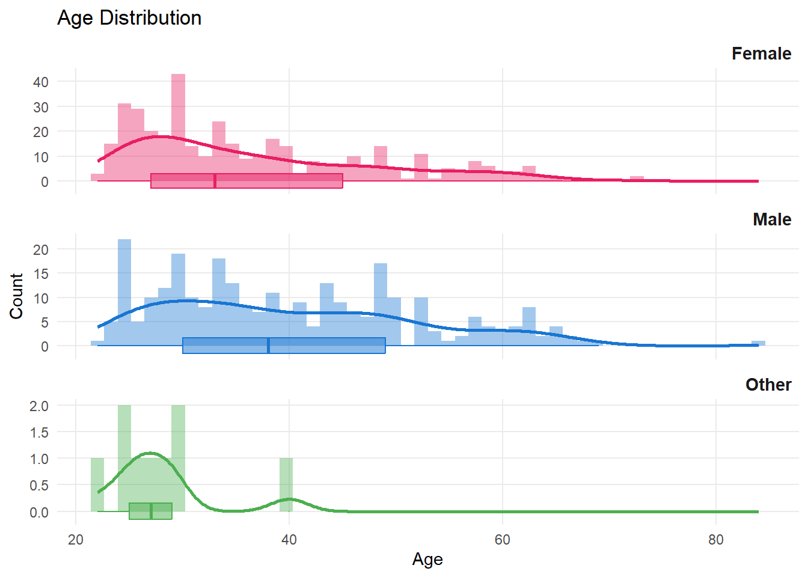{width=672}
:::
:::


#### Children


::: {.cell}

```{.r .cell-code}
# Number of children
p_children <- df |>
  filter(!is.na(Dem_Child_numb), Dem_Child_numb != "") |>
  count(Dem_Child_numb) |>
  mutate(Dem_Child_numb = factor(Dem_Child_numb,
    levels = c("I have no children", "1", "2", "3", "More than 3"))) |>
  ggplot(aes(x = Dem_Child_numb, y = n, fill = Dem_Child_numb)) +
  geom_bar(stat = "identity", show.legend = FALSE) +
  scale_fill_brewer(palette = "Greens") +
  theme_minimal() +
  labs(title = "Number of Children", x = "", y = "Count")

# Parental leave
leave_levels <- c("Less than 2 weeks", "Between 2 weeks and 1 month",
                  "Between 1 month and 3 months", "Between 3 months and 6 months",
                  "Between 6 months and 1 year", "Between 1 year and 2 years",
                  "More than 2 years", "I did not take any parental leave")
p_parental <- df |>
  filter(!is.na(Dem_Parental_leave), Dem_Parental_leave != "") |>
  count(Dem_Parental_leave) |>
  mutate(Dem_Parental_leave = factor(Dem_Parental_leave, levels = leave_levels)) |>
  ggplot(aes(x = Dem_Parental_leave, y = n, fill = Dem_Parental_leave)) +
  geom_bar(stat = "identity", show.legend = FALSE) +
  scale_fill_brewer(palette = "Blues") +
  coord_flip() +
  theme_minimal() +
  labs(title = "Parental Leave", x = "", y = "Count")

p_children + p_parental
```

::: {.cell-output-display}
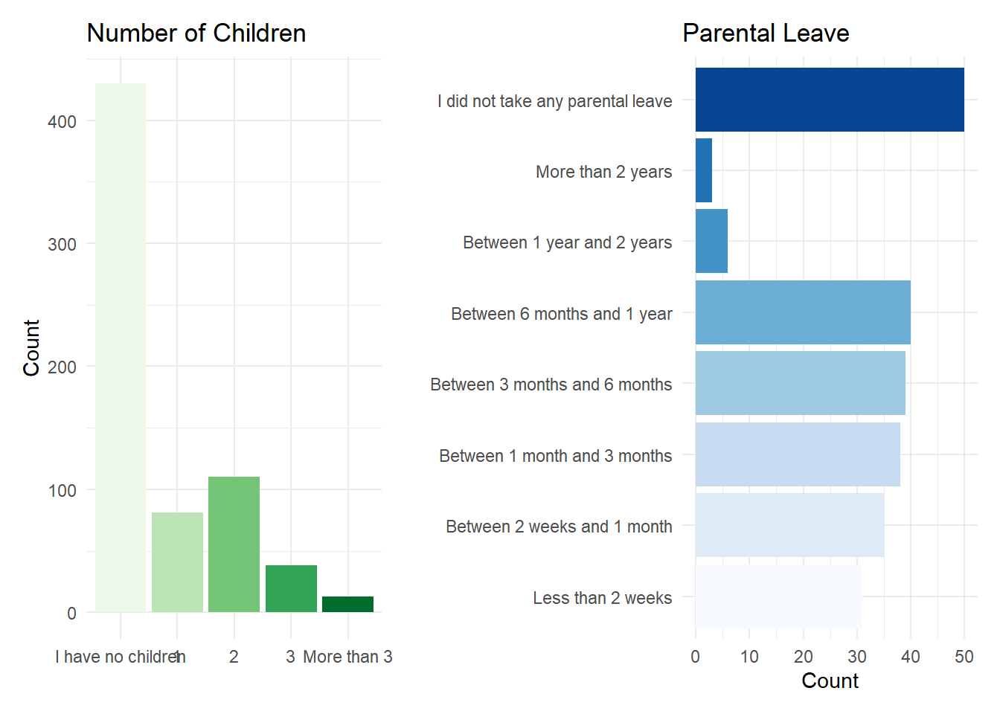{width=672}
:::
:::


#### Research Discipline


::: {.cell}

```{.r .cell-code}
# Research discipline — pie chart
p_discipline <- df |>
  filter(!is.na(Work_Discipline), Work_Discipline != "") |>
  count(Work_Discipline) |>
  mutate(pct = n / sum(n),
         label = str_replace(Work_Discipline, " & ", "\n&"),
         label = paste0(label, "\n\n", n, " (", round(pct * 100), "%)")) |>
  ggplot(aes(x = "", y = n, fill = Work_Discipline)) +
  geom_bar(stat = "identity", width = 1, color = "white") +
  coord_polar(theta = "y") +
  geom_text(aes(label = label), position = position_stack(vjust = 0.5),
            size = 2.5, color = "white", fontface = "bold") +
  scale_fill_brewer(palette = "Set2") +
  theme_void() +
  theme(legend.position = "none",
        plot.title = element_text(hjust = 0.5)) +
  labs(title = "Research Discipline")

# Highest diploma
p_diploma <- df |>
  filter(!is.na(Work_Diploma), Work_Diploma != "") |>
  count(Work_Diploma) |>
  mutate(Work_Diploma = factor(Work_Diploma,
    levels = c("Bachelor", "Master", "PhD", "Other"))) |>
  ggplot(aes(x = Work_Diploma, y = n, fill = Work_Diploma)) +
  geom_bar(stat = "identity", show.legend = FALSE) +
  scale_fill_brewer(palette = "Purples") +
  theme_minimal() +
  labs(title = "Highest Diploma", x = "", y = "Count")

p_discipline + p_diploma
```

::: {.cell-output-display}
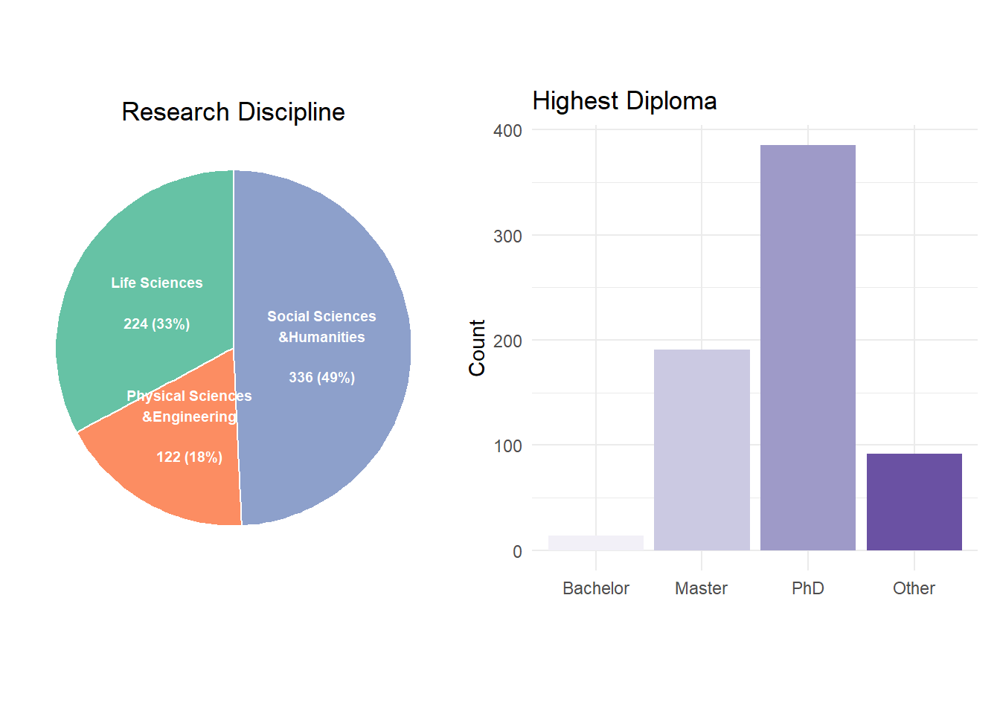{width=672}
:::
:::


#### Affiliation


::: {.cell}

```{.r .cell-code}
# Academic position
p_position <- df |>
  filter(!is.na(Work_Position), Work_Position != "") |>
  count(Work_Position) |>
  mutate(pct = n / sum(n) * 100) |>
  ggplot(aes(x = reorder(Work_Position, pct), y = n, fill = pct)) +
  geom_bar(stat = "identity", show.legend = FALSE) +
  geom_text(aes(label = sprintf("%.1f%%", pct)), hjust = -0.15, size = 3, color = "grey30") +
  scale_y_continuous(expand = expansion(add = c(0, 50))) +
  scale_fill_gradient(low = "#b3cde3", high = "#084594") +
  coord_flip() +
  theme_minimal() +
  theme(axis.text.y = element_text(size = 8)) +
  labs(title = "Academic Position", x = "", y = "Count")

# Country of work + specific affiliations (dodged)
clean_country <- function(x) {
  x <- str_to_title(str_trim(x))
  case_when(
    x %in% c("Uk", "United Kingdom", "England", "Wales (Uk)", "Uk - England") ~ "United Kingdom",
    x %in% c("Be", "Belgique", "Belgium") ~ "Belgium",
    x %in% c("Nl", "The Netherlands") ~ "Netherlands",
    x %in% c("Usa", "United States") ~ "United States",
    x %in% c("Italia") ~ "Italy",
    x %in% c("Suisse") ~ "Switzerland",
    x %in% c("Feance", "Frabce", "France ", "France/Canada",
             "Germany And France", "Dijon", "Grenoble") ~ "France",
    .default = x
  )
}

normalize_affil <- function(x) {
  x <- stringr::str_squish(x)

  dplyr::case_when(
    is.na(x) | x == "" ~ "Missing",

    # National research organisations
    stringr::str_detect(x, stringr::regex("^c\\.?n\\.?r\\.?s\\.?", ignore_case = TRUE)) ~ "CNRS",
    stringr::str_detect(x, stringr::regex("^inserm", ignore_case = TRUE)) ~ "INSERM",
    stringr::str_detect(x, stringr::regex("inrae", ignore_case = TRUE)) ~ "INRAE",
    stringr::str_detect(x, stringr::regex("^cea\\b", ignore_case = TRUE)) ~ "CEA",
    stringr::str_detect(x, stringr::regex("^inria\\b", ignore_case = TRUE)) ~ "Inria",
    stringr::str_detect(x, stringr::regex("^igbmc", ignore_case = TRUE)) ~ "IGBMC",

    # Grandes écoles / institutes
    stringr::str_detect(x, stringr::regex("^ens\\b|ecole normale sup|école normale sup", ignore_case = TRUE)) ~ "ENS",
    stringr::str_detect(x, stringr::regex("^psl\\b|psl research|psl univ", ignore_case = TRUE)) ~ "PSL",

    # UK
    stringr::str_detect(x, stringr::regex("^ucl$|university college london", ignore_case = TRUE)) ~ "UCL",
    stringr::str_detect(x, stringr::regex("university of sussex|^sussex$", ignore_case = TRUE)) ~ "Univ. of Sussex",

    # Belgium / Netherlands / Switzerland
    stringr::str_detect(x, stringr::regex("^ghent|universiteit gent", ignore_case = TRUE)) ~ "Ghent University",
    stringr::str_detect(x, stringr::regex("^ulb$|ulb,|libre de bruxelles", ignore_case = TRUE)) ~ "ULB",
    stringr::str_detect(x, stringr::regex("leiden", ignore_case = TRUE)) ~ "Leiden University",
    stringr::str_detect(x, stringr::regex("groningen", ignore_case = TRUE)) ~ "University of Groningen",
    stringr::str_detect(x, stringr::regex("eth zurich|eth zürich|^eth$", ignore_case = TRUE)) ~ "ETH Zurich",

    # France
    stringr::str_detect(x, stringr::regex("sorbonne univ|sorbonne universit|sorbone", ignore_case = TRUE)) ~ "Sorbonne Univ.",
    stringr::str_detect(x, stringr::regex("paris cit|upcit", ignore_case = TRUE)) ~ "Univ. Paris Cité",
    stringr::str_detect(x, stringr::regex("paris nanterre", ignore_case = TRUE)) ~ "Univ. Paris Nanterre",
    stringr::str_detect(x, stringr::regex("paris.?saclay", ignore_case = TRUE)) ~ "Univ. Paris-Saclay",
    stringr::str_detect(x, stringr::regex("paris 8", ignore_case = TRUE)) ~ "Univ. Paris 8",

    stringr::str_detect(x, stringr::regex("aix.?marseille|^amu$", ignore_case = TRUE)) ~ "Aix-Marseille Univ.",
    stringr::str_detect(x, stringr::regex("bordeaux", ignore_case = TRUE)) ~ "Univ. de Bordeaux",
    stringr::str_detect(x, stringr::regex("grenoble|^uga$", ignore_case = TRUE)) ~ "Univ. Grenoble Alpes",
    stringr::str_detect(x, stringr::regex("lyon", ignore_case = TRUE)) ~ "Univ. de Lyon",
    stringr::str_detect(x, stringr::regex("strasbourg|louis pasteur", ignore_case = TRUE)) ~ "Univ. de Strasbourg",
    stringr::str_detect(x, stringr::regex("toulouse", ignore_case = TRUE)) ~ "Univ. de Toulouse",
    stringr::str_detect(x, stringr::regex("lille", ignore_case = TRUE)) ~ "Univ. de Lille",
    stringr::str_detect(x, stringr::regex("clermont", ignore_case = TRUE)) ~ "Univ. Clermont",
    stringr::str_detect(x, stringr::regex("montpellier", ignore_case = TRUE)) ~ "Univ. de Montpellier",
    stringr::str_detect(x, stringr::regex("picardie|^upjv$", ignore_case = TRUE)) ~ "Univ. Picardie",
    stringr::str_detect(x, stringr::regex("côte d.?azur|cote d.?azur", ignore_case = TRUE)) ~ "Univ. Côte d'Azur",
    stringr::str_detect(x, stringr::regex("rennes", ignore_case = TRUE)) ~ "Univ. de Rennes",
    stringr::str_detect(x, stringr::regex("caen", ignore_case = TRUE)) ~ "Univ. de Caen",
    stringr::str_detect(x, stringr::regex("poitiers", ignore_case = TRUE)) ~ "Univ. de Poitiers",
    stringr::str_detect(x, stringr::regex("reims", ignore_case = TRUE)) ~ "Univ. de Reims",
    stringr::str_detect(x, stringr::regex("rouen", ignore_case = TRUE)) ~ "Univ. de Rouen",
    stringr::str_detect(x, stringr::regex("tours", ignore_case = TRUE)) ~ "Univ. de Tours",
    stringr::str_detect(x, stringr::regex("nantes", ignore_case = TRUE)) ~ "Université de Nantes",

    # Germany
    stringr::str_detect(x, stringr::regex("darmstadt|tuda", ignore_case = TRUE)) ~ "TU Darmstadt",
    stringr::str_detect(x, stringr::regex("jena", ignore_case = TRUE)) ~ "Friedrich Schiller University Jena",

    # Italy
    stringr::str_detect(x, stringr::regex("sapienza", ignore_case = TRUE)) ~ "La Sapienza",
    stringr::str_detect(x, stringr::regex("tor vergata", ignore_case = TRUE)) ~ "Tor Vergata",
    stringr::str_detect(x, stringr::regex("genoa|genova", ignore_case = TRUE)) ~ "University of Genoa",
    stringr::str_detect(x, stringr::regex("turin", ignore_case = TRUE)) ~ "University of Turin",
    stringr::str_detect(x, stringr::regex("milano.?bicocca", ignore_case = TRUE)) ~ "University of Milano-Bicocca",

    # Portugal
    stringr::str_detect(x, stringr::regex("minho", ignore_case = TRUE)) ~ "University of Minho",

    # Austria
    stringr::str_detect(x, stringr::regex("vienna", ignore_case = TRUE)) ~ "University of Vienna",

    # Spain
    stringr::str_detect(x, stringr::regex("^bcbl$|basque center on cognition", ignore_case = TRUE)) ~ "BCBL",

    .default = x
  )
}

# Include ALL rows; normalize_affil returns "Missing" for empty/NA
df_country_aff_all <- df |>
  filter(!is.na(Work_Country), Work_Country != "") |>
  mutate(
    Country = clean_country(Work_Country),
    Affiliation = normalize_affil(Work_Affiliation)
  )

country_palette_ext <- c(
  "France"         = "#1976D2",
  "United Kingdom" = "#E91E63",
  "Germany"        = "#FF9800",
  "Spain"          = "#8BC34A",
  "Belgium"        = "#9C27B0",
  "Italy"          = "#00BCD4",
  "Netherlands"    = "#F44336",
  "Switzerland"    = "#795548",
  "United States"  = "#607D8B",
  "Other country"  = "#C8E6C9",
  "—"              = "#BDBDBD"   # for Missing / Other affiliation buckets
)

# Named affiliations = those with n >= 3 after normalisation
named_affils <- df_country_aff_all |>
  filter(Affiliation != "Missing") |>
  count(Affiliation, sort = TRUE) |>
  filter(n >= 3) |>
  pull(Affiliation)

df_plot_affil <- df_country_aff_all |>
  mutate(
    Affiliation_cat = case_when(
      Affiliation == "Missing"          ~ "Missing",
      Affiliation %in% named_affils     ~ Affiliation,
      .default                          = "Other"
    ),
    Country_fill = case_when(
  Affiliation_cat == "Missing" ~ "—",
  Country %in% names(country_palette_ext) ~ Country,
  .default = "Other country"
)
  ) |>
  count(Affiliation_cat, Country_fill)

# Order: by total count, with Other/Missing pinned at the bottom
affil_totals <- df_plot_affil |>
  group_by(Affiliation_cat) |>
  summarise(total = sum(n), .groups = "drop") |>
  mutate(rank = case_when(
    Affiliation_cat == "Missing" ~ -2L,
    Affiliation_cat == "Other"   ~ -1L,
    .default = as.integer(total)
  )) |>
  arrange(rank)

affil_level_order <- affil_totals$Affiliation_cat

affil_label_df <- affil_totals |>
  mutate(Affiliation_cat = factor(Affiliation_cat, levels = rev(affil_level_order)))

p_country <- df_plot_affil |>
  mutate(Affiliation_cat = factor(Affiliation_cat, levels = affil_level_order)) |>
  ggplot(aes(x = Affiliation_cat, y = n, fill = Country_fill)) +
  geom_bar(stat = "identity", position = "stack", width = 0.7) +
  geom_text(data = affil_label_df,
            aes(x = Affiliation_cat, y = total, label = total),
            inherit.aes = FALSE,
            hjust = -0.2, size = 3, color = "grey30") +
  scale_fill_manual(values = country_palette_ext, name = "Country") +
  scale_y_continuous(expand = expansion(mult = c(0, 0.12))) +
  coord_flip() +
  theme_minimal() +
  theme(legend.position = "right",
        legend.text = element_text(size = 7.5),
        legend.key.size = unit(0.4, "cm"),
        axis.text.y = element_text(size = 8)) +
  labs(title = "Affiliations",
       x = "", y = "Count")

p_position + p_country
```

::: {.cell-output-display}
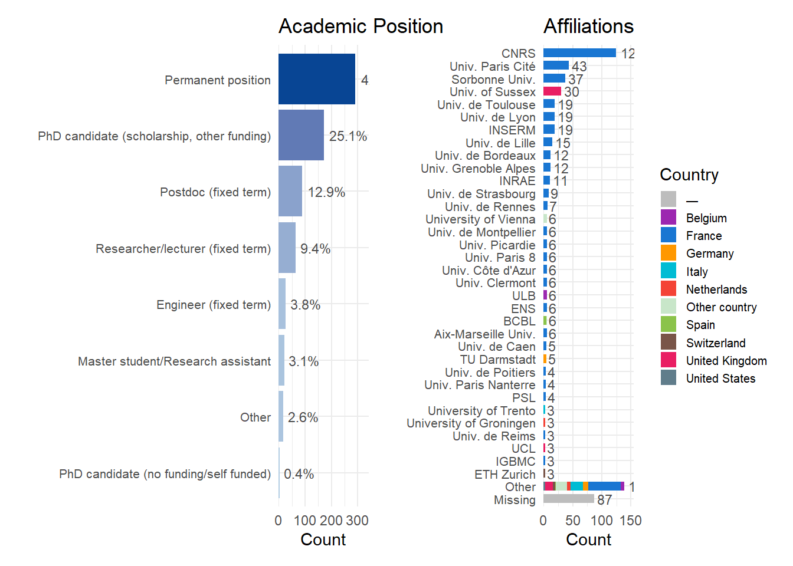{width=672}
:::
:::


::: {.cell}

```{.r .cell-code}
p_map <- df_plot_affil |>
  mutate(region = Country_fill) |>
  group_by(region) |>
  summarize(N = sum(n)) |>
  filter(!region %in% c("—", "Other country")) |>
  mutate(region = ifelse(region == "United Kingdom", "UK", region)) |>
  right_join(map_data("world"), by = "region") 

p_map |>
  # mutate(n = replace_na(n, 0)) |>
  ggplot(aes(long, lat)) +
  geom_polygon(aes(fill = N, group = group)) +
  geom_text(data = p_map |>
              summarize(lat = mean(lat, na.rm = TRUE),
                 long = mean(long, na.rm = TRUE),
                 label = paste0("N=", mean(N, na.rm = TRUE), " (", format_percent(mean(N, na.rm = TRUE) / nrow(df)), ")"), 
                 .by = "region") |> 
              mutate(label = str_replace(label, fixed("N=NaN ()"), "")), aes(label = label), size = 2) +
  scale_fill_gradientn(colors = c("#FFF8E1", "#FFB74D", "#FF9800", "#FF5722", "#F44336", "#E91E63", "#C2185B", "#cc66cc")) +
  labs(fill = "N") +
  theme_void() +
  labs(title = "Number of participants by country")  +
  theme(
    plot.title = element_text(size = rel(1.2), face = "bold", hjust = 0),
    plot.subtitle = element_text(size = rel(1.2))
  ) + 
  coord_fixed(xlim = c(-9, 60), ylim = c(35, 69)) # Focus on Europe
```

::: {.cell-output-display}
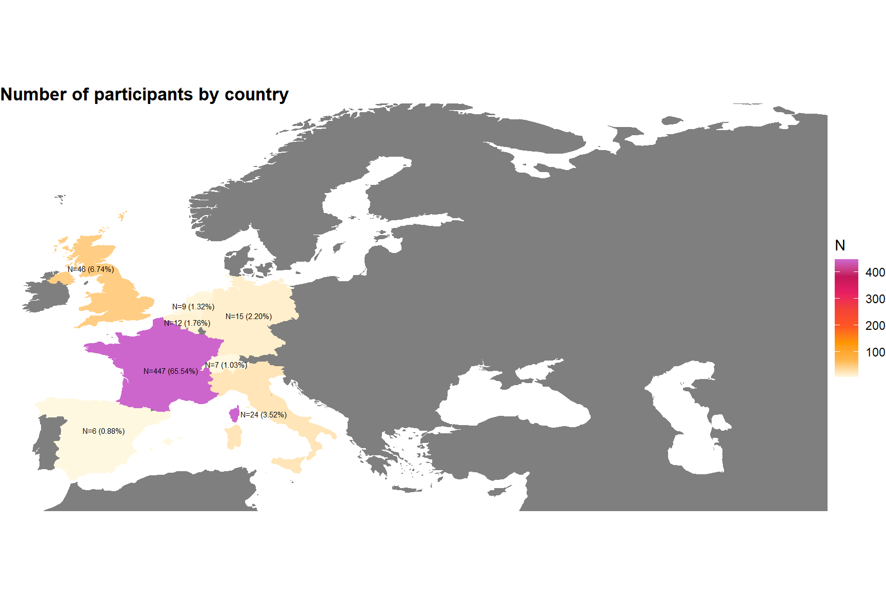{width=864}
:::
:::


#### Careers 


::: {.cell}

```{.r .cell-code}
# Time allocation across research activities
p_activities <- df |>
  select(Work_Time_Research, Work_Time_Teaching, Work_Time_Administration,
         Work_Time_Popularization, Work_Time_Other) |>
  rename(Research = Work_Time_Research,
         Teaching = Work_Time_Teaching,
         Administration = Work_Time_Administration,
         Popularization = Work_Time_Popularization,
         Other = Work_Time_Other) |>
  pivot_longer(everything(), names_to = "Activity", values_to = "Percentage") |>
  filter(!is.na(Percentage)) |>
  mutate(Activity = factor(Activity,
    levels = c("Research", "Teaching", "Administration", "Popularization", "Other"))) |>
  ggplot(aes(x = Activity, y = Percentage, fill = Activity)) +
  geom_violin(alpha = 0.6, trim = TRUE) +
  geom_boxplot(width = 0.1, fill = "white", outlier.size = 0.5) +
  scale_fill_brewer(palette = "Set1") +
  scale_y_continuous(labels = scales::percent_format()) +
  theme_minimal() +
  theme(legend.position = "none") +
  labs(title = "Time Allocation Across Activities", x = "", y = "Proportion of Work Time")
p_activities
```

::: {.cell-output-display}
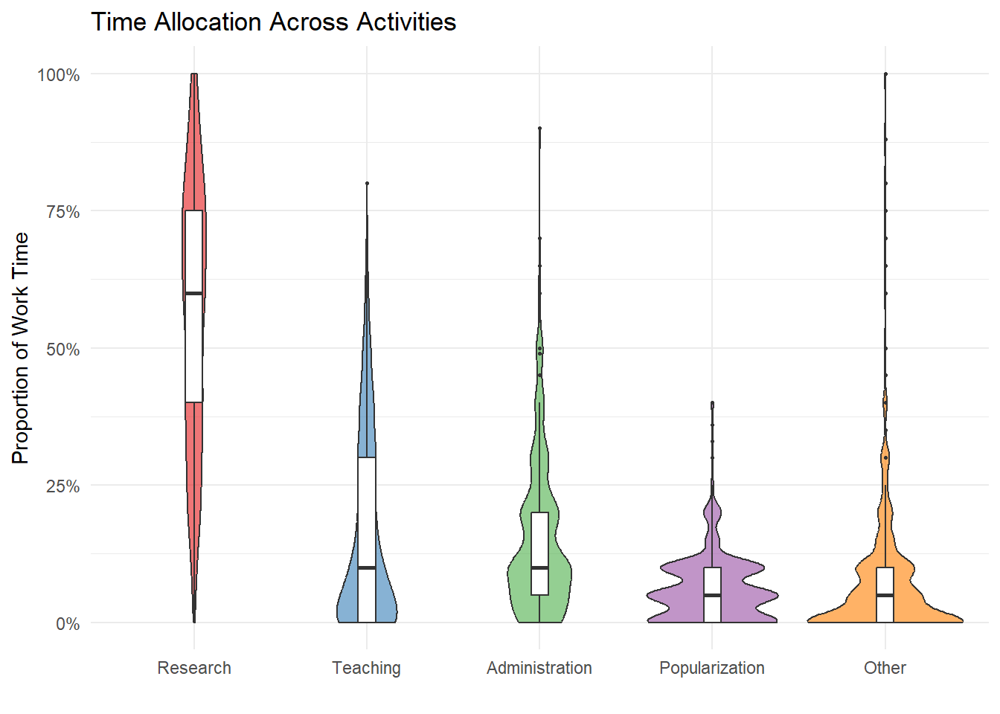{width=672}
:::
:::


::: {.cell}

```{.r .cell-code}
# Career perceptions: scatterplot matrix with ggside marginals
pub_colors <- c("Yes" = "#1976D2", "No" = "#E91E63")

df_career <- df |>
  filter(!is.na(Work_Publication)) |>
  transmute(
    Published = Work_Publication,
    Prob_Perm = Work_Probability_permanent_position,
    Sat_Numb  = Work_Satisfaction_numb_publications,
    Sat_Qual  = Work_Satisfaction_quality_publications
  )

make_scatter_side <- function(data, xv, yv, xl, yl) {
  ggplot(data |> filter(!is.na(.data[[xv]]), !is.na(.data[[yv]])),
         aes(x = .data[[xv]], y = .data[[yv]])) +
    geom_point(alpha = 0.3, size = 2, color = "#1976D2") +
    geom_smooth(method = "lm", se = TRUE, alpha = 0.12, linewidth = 0.8,
                color = "#1976D2", fill = "#1976D2") +
    geom_xsidehistogram(bins = 15, alpha = 0.5, fill = "#1976D2") +
    geom_ysidehistogram(bins = 15, alpha = 0.5, fill = "#1976D2") +
    scale_x_continuous(labels = scales::percent_format()) +
    scale_y_continuous(labels = scales::percent_format()) +
    theme_bw() +
    theme(ggside.panel.scale = 0.25,
          ggside.panel.border = element_blank(),
          ggside.panel.background = element_blank(),
          ggside.axis.ticks.x = element_blank(),
          ggside.axis.ticks.y = element_blank()) +
    labs(x = xl, y = yl)
}

p_ab <- make_scatter_side(df_career, "Prob_Perm", "Sat_Numb",
                          "P(Permanent Position)", "Sat. No. Publications")
p_ac <- make_scatter_side(df_career, "Prob_Perm", "Sat_Qual",
                          "P(Permanent Position)", "Sat. Quality Publications")
p_bc <- make_scatter_side(df_career, "Sat_Numb", "Sat_Qual",
                          "Sat. No. Publications", "Sat. Quality Publications")

p_pub_bar <- df |>
  filter(!is.na(Work_Publication), Work_Publication != "") |>
  count(Work_Publication) |>
  ggplot(aes(x = Work_Publication, y = n, fill = Work_Publication)) +
  geom_bar(stat = "identity", width = 0.5, show.legend = FALSE) +
  scale_fill_manual(values = pub_colors) +
  theme_bw() +
  labs(title = "Has Published?", x = "", y = "Count")

(p_ab | p_ac) / (p_bc | p_pub_bar) +
  plot_annotation(
    title = "Career Perceptions — Pairwise Relationships",
    theme = theme(plot.title = element_text(size = 13, face = "bold", hjust = 0.5))
  )
```

::: {.cell-output .cell-output-stderr}

```
`geom_smooth()` using formula = 'y ~ x'
`geom_smooth()` using formula = 'y ~ x'
`geom_smooth()` using formula = 'y ~ x'
```


:::

::: {.cell-output-display}
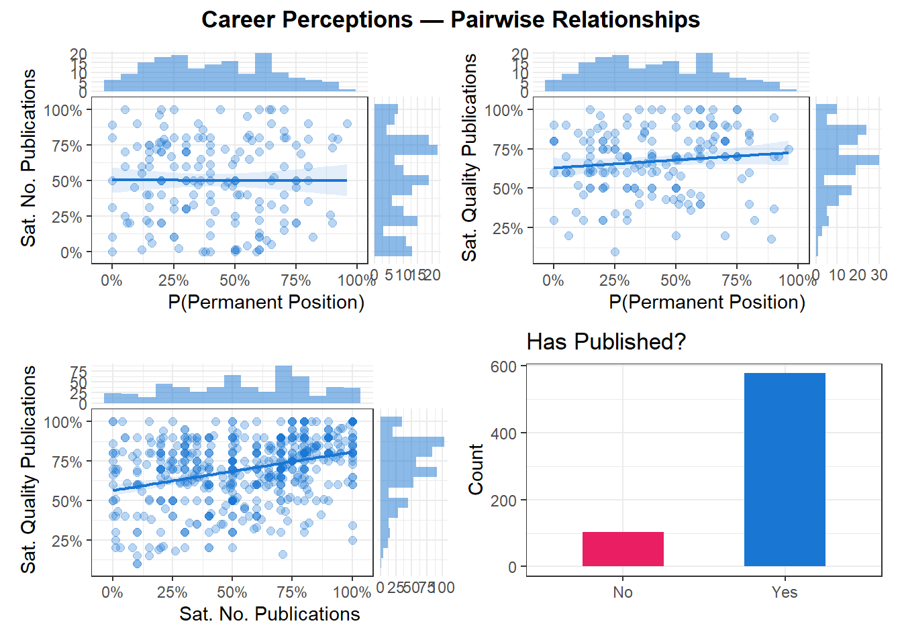{width=672}
:::
:::


::: {.cell}

```{.r .cell-code}
# Committee/service involvement and clinical activity
p_commit <- df |>
  filter(!is.na(Work_Committees), Work_Committees != "") |>
  count(Work_Committees) |>
  ggplot(aes(x = Work_Committees, y = n, fill = Work_Committees)) +
  geom_bar(stat = "identity", show.legend = FALSE) +
  scale_fill_manual(values = c("Yes" = "#4dac26", "No" = "#d01c8b")) +
  theme_minimal() +
  labs(title = "Member of Committees", x = "", y = "Count")

p_clinical <- df |>
  filter(!is.na(Work_Clinical_activity), Work_Clinical_activity != "") |>
  count(Work_Clinical_activity) |>
  ggplot(aes(x = Work_Clinical_activity, y = n, fill = Work_Clinical_activity)) +
  geom_bar(stat = "identity", show.legend = FALSE) +
  scale_fill_manual(values = c("Yes" = "#4dac26", "No" = "#d01c8b")) +
  theme_minimal() +
  labs(title = "Clinical Activity", x = "", y = "Count")


(p_commit + p_clinical)
```

::: {.cell-output-display}
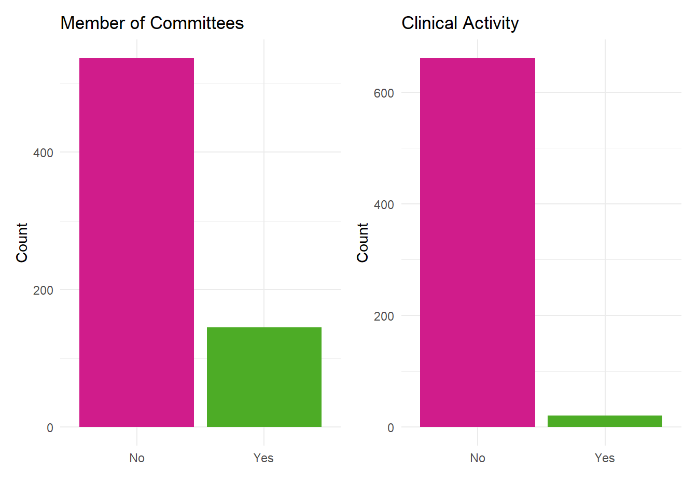{width=672}
:::
:::


::: {.cell}
::: {.cell-output-display}
::: {.callout-note collapse="true" title="Sample (Markdown table, for text readers)"}

Table: Categorical variables

|Variable |Level | N|Percentage |
|:----------------------|:------------------------------------------|---:|:----------|
|Dem_Gender |Female | 389|57.04% |
|Dem_Gender |Male | 283|41.50% |
|Dem_Gender |Other | 10|1.47% |
|Dem_Child_numb |I have no children | 438|64.22% |
|Dem_Child_numb |2 | 111|16.28% |
|Dem_Child_numb |1 | 81|11.88% |
|Dem_Child_numb |3 | 38|5.57% |
|Dem_Child_numb |More than 3 | 14|2.05% |
|Dem_Parental_leave |I did not take any parental leave | 51|20.90% |
|Dem_Parental_leave |Between 6 months and 1 year | 40|16.39% |
|Dem_Parental_leave |Between 3 months and 6 months | 39|15.98% |
|Dem_Parental_leave |Between 1 month and 3 months | 38|15.57% |
|Dem_Parental_leave |Between 2 weeks and 1 month | 36|14.75% |
|Dem_Parental_leave |Less than 2 weeks | 31|12.70% |
|Dem_Parental_leave |Between 1 year and 2 years | 6|2.46% |
|Dem_Parental_leave |More than 2 years | 3|1.23% |
|Work_Discipline |Social Sciences & Humanities | 336|49.27% |
|Work_Discipline |Life Sciences | 224|32.84% |
|Work_Discipline |Physical Sciences & Engineering | 122|17.89% |
|Work_Diploma |PhD | 385|56.45% |
|Work_Diploma |Master | 191|28.01% |
|Work_Diploma |Other | 92|13.49% |
|Work_Diploma |Bachelor | 14|2.05% |
|Work_Position |Permanent position | 291|42.67% |
|Work_Position |PhD candidate (scholarship, other funding) | 171|25.07% |
|Work_Position |Postdoc (fixed term) | 88|12.90% |
|Work_Position |Researcher/lecturer (fixed term) | 64|9.38% |
|Work_Position |Engineer (fixed term) | 26|3.81% |
|Work_Position |Master student/Research assistant | 21|3.08% |
|Work_Position |Other | 18|2.64% |
|Work_Position |PhD candidate (no funding/self funded) | 3|0.44% |
|Work_Career_Stage |Permanent | 291|44.02% |
|Work_Career_Stage |PhD / Student | 192|29.05% |
|Work_Career_Stage |Non-permanent | 178|26.93% |
|Work_Publication |Yes | 578|84.75% |
|Work_Publication |No | 104|15.25% |
|Work_Committees |No | 537|78.74% |
|Work_Committees |Yes | 145|21.26% |
|Work_Clinical_activity |No | 661|96.92% |
|Work_Clinical_activity |Yes | 21|3.08% |

Table: Age by gender

|Dem_Gender | n| Mean| SD| Median| Min| Max|
|:----------|---:|-----:|-----:|------:|---:|---:|
|Female | 388| 36.71| 11.46| 33| 22| 73|
|Male | 283| 40.24| 12.06| 38| 22| 84|
|Other | 9| 27.89| 5.06| 27| 22| 40|

Table: Country of workplace (fewer than 3 pooled into Other)

|Variable |Level | N|Percentage |
|:--------|:--------------|---:|:----------|
|Country |France | 488|71.55% |
|Country |United Kingdom | 57|8.36% |
|Country |Italy | 33|4.84% |
|Country |Germany | 21|3.08% |
|Country |Other | 18|2.64% |
|Country |Spain | 15|2.20% |
|Country |Belgium | 13|1.91% |
|Country |Switzerland | 11|1.61% |
|Country |Netherlands | 9|1.32% |
|Country |Austria | 7|1.03% |
|Country |Portugal | 4|0.59% |
|Country |Ireland | 3|0.44% |
|Country |United States | 3|0.44% |

Table: Affiliations

|Affiliation | N|
|:-----------------------|---:|
|CNRS | 124|
|Univ. Paris Cité | 43|
|Sorbonne Univ. | 37|
|Univ. of Sussex | 30|
|INSERM | 19|
|Univ. de Lyon | 19|
|Univ. de Toulouse | 19|
|Univ. de Lille | 15|
|Univ. Grenoble Alpes | 12|
|Univ. de Bordeaux | 12|
|INRAE | 11|
|Univ. de Strasbourg | 9|
|Univ. de Rennes | 7|
|Aix-Marseille Univ. | 6|
|BCBL | 6|
|ENS | 6|
|ULB | 6|
|Univ. Clermont | 6|
|Univ. Côte d'Azur | 6|
|Univ. Paris 8 | 6|
|Univ. Picardie | 6|
|Univ. de Montpellier | 6|
|University of Vienna | 6|
|TU Darmstadt | 5|
|Univ. de Caen | 5|
|PSL | 4|
|Univ. Paris Nanterre | 4|
|Univ. de Poitiers | 4|
|ETH Zurich | 3|
|IGBMC | 3|
|UCL | 3|
|Univ. de Reims | 3|
|University of Groningen | 3|
|University of Trento | 3|
|Other | 138|
|Missing | 87|

Table: Time allocation

|Activity | n| Mean| SD| Median|
|:--------------|---:|----:|----:|------:|
|Research | 682| 0.56| 0.24| 0.60|
|Teaching | 682| 0.16| 0.17| 0.10|
|Administration | 682| 0.15| 0.14| 0.10|
|Popularization | 682| 0.06| 0.06| 0.05|
|Other | 682| 0.07| 0.11| 0.05|

Table: Career perceptions

|Variable | Mean| SD| Min| Max| n| n_Missing|
|:---------|----:|----:|---:|----:|---:|---------:|
|Prob_Perm | 0.41| 0.24| 0.0| 0.96| 254| 428|
|Sat_Numb | 0.55| 0.28| 0.0| 1.00| 578| 104|
|Sat_Qual | 0.70| 0.20| 0.1| 1.00| 578| 104|

Table: Career perceptions: correlations

|Variable1 |Variable2 | r|95% CI |p | n|
|:---------|:---------|----:|:-------------|:---------|---:|
|Prob_Perm |Sat_Numb | 0.00|[-0.15, 0.15] |p = 0.996 | 167|
|Prob_Perm |Sat_Qual | 0.12|[-0.04, 0.26] |p = 0.267 | 167|
|Sat_Numb |Sat_Qual | 0.34|[0.26, 0.41] |p < .001 | 578|

:::

:::
:::


### Science Quality Criteria

#### Overview


::: {.cell}

```{.r .cell-code}
# Quality criteria importance (binary endorsement rates)
df_quality <- df |>
  select(starts_with("Work_Criteria_quality_science_")) |>
  rename_with(~str_remove(., "Work_Criteria_quality_science_")) |>
  rename_with(~recode(.,
    "Originality"               = "Originality / Innovation",
    "Significance"              = "Significance / Impact",
    "Rigorous_meth"             = "Rigorous Methodology",
    "Relevance-data-analyses"   = "Appropriate Statistics",
    "high-IF"                   = "High Impact Factor Journal",
    "Transparence"              = "Transparency / Open Science",
    "Replication"               = "Replication",
    "Environmental-impact"      = "Environmental Impact",
    "Inclusivity"               = "Inclusivity / Diversity"
  ))

p_criteria <- df_quality |>
  pivot_longer(everything(), names_to = "Criterion", values_to = "Endorsed") |>
  filter(!is.na(Endorsed)) |>
  group_by(Criterion) |>
  summarise(pct = mean(Endorsed == "Yes"), .groups = "drop") |>
  ggplot(aes(x = reorder(Criterion, pct), y = pct, fill = pct)) +
  geom_bar(stat = "identity") +
  scale_fill_gradient(low = "#fee8c8", high = "#b30000", guide = "none") +
  scale_y_continuous(labels = scales::percent_format()) +
  coord_flip() +
  theme_minimal() +
  labs(title = "Endorsement of Quality Criteria for Science",
       x = "", y = "% endorsing")

p_criteria
```

::: {.cell-output-display}
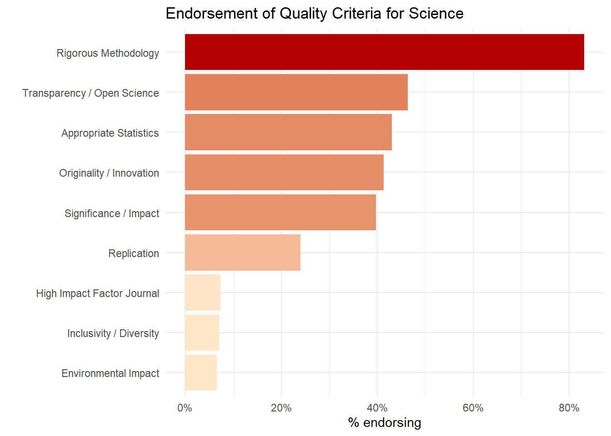{width=672}
:::
:::


::: {.cell}
::: {.cell-output-display}
::: {.callout-note collapse="true" title="Endorsement of quality criteria (Markdown table, for text readers)"}

|Criterion |Endorsed |
|:---------------------------|:--------|
|Rigorous Methodology |83.14% |
|Transparency / Open Science |46.33% |
|Appropriate Statistics |43.11% |
|Originality / Innovation |41.35% |
|Significance / Impact |39.74% |
|Replication |24.05% |
|High Impact Factor Journal |7.33% |
|Inclusivity / Diversity |7.04% |
|Environmental Impact |6.60% |

:::

:::
:::


::: {.cell}

```{.r .cell-code}
df_quality_num <- df_quality |>
  mutate(across(everything(), ~as.numeric(. == "Yes")))

p_criteria_cor <- correlation(df_quality_num, method = "pearson", redundant = TRUE) |>
  correlation::cor_sort() |>
  as.data.frame() |>
  mutate(label = ifelse(p < .001, format_value(r, digits = 2), "")) |>
  ggplot(aes(x = Parameter1, y = Parameter2, fill = r)) +
  geom_tile() +
  geom_text(aes(label = label), color = "black", size = 3) +
  scale_fill_gradientn(colours = c("darkblue", "blue", "#2196F3", "white", "#FFC107", "#F44336", "darkred"), limits = c(-1, 1)) +
  theme_minimal() +
  labs(title = "Co-endorsement of Science Quality Criteria",
       x = "", y = "") +
  theme(axis.text.x = element_text(angle = 45, hjust = 1),
        plot.title = element_text(size = 16, face = "bold", hjust = 0.5))
p_criteria_cor
```

::: {.cell-output-display}
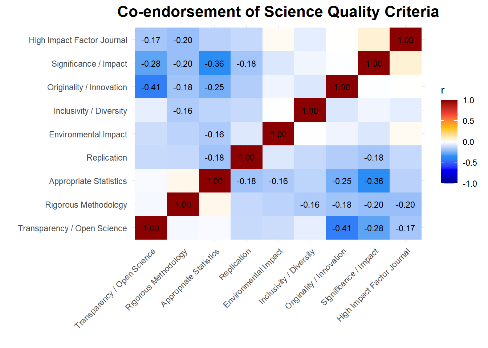{width=672}
:::

```{.r .cell-code}
rez_criteria <- n_components(df_quality_num)
plot(rez_criteria)
```

::: {.cell-output-display}
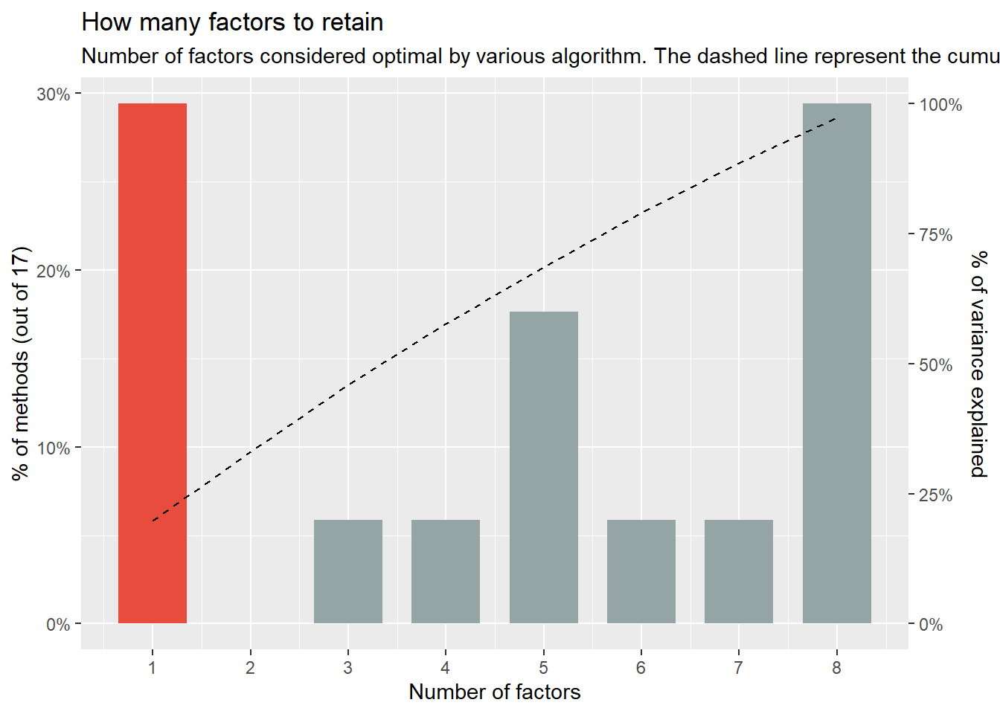{width=672}
:::

```{.r .cell-code}
pca_criteria <- principal_components(df_quality_num, n = 2)
plot(pca_criteria)
```

::: {.cell-output-display}
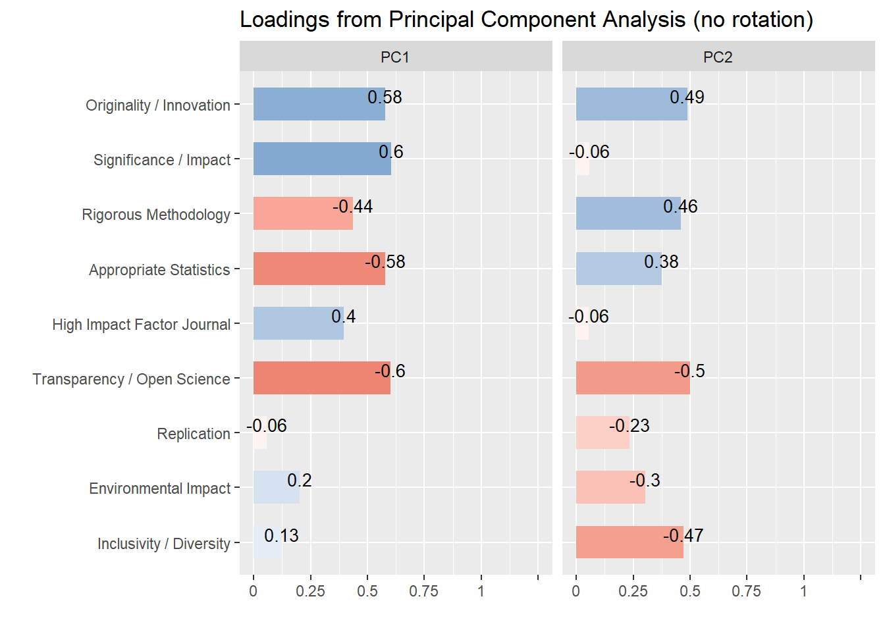{width=672}
:::

```{.r .cell-code}
# Extract loadings
as.data.frame(pca_criteria) |> 
  select(Variable, PC1, PC2) |> 
  data_rename(c("Novel and Impactful vs. Rigourous and Transparent" = "PC1", 
                "Rigorous and Innovative vs. Virtuous" = "PC2")) |> 
  pivot_longer(-Variable, names_to = "Component", values_to = "Loading") 
```

::: {.cell-output .cell-output-stdout}

```
# A tibble: 18 × 3
   Variable                    Component                                 Loading
   <chr>                       <chr>                                       <dbl>
 1 Originality / Innovation    Novel and Impactful vs. Rigourous and Tr…  0.571 
 2 Originality / Innovation    Rigorous and Innovative vs. Virtuous       0.517 
 3 Significance / Impact       Novel and Impactful vs. Rigourous and Tr…  0.607 
 4 Significance / Impact       Rigorous and Innovative vs. Virtuous      -0.0805
 5 Rigorous Methodology        Novel and Impactful vs. Rigourous and Tr… -0.441 
 6 Rigorous Methodology        Rigorous and Innovative vs. Virtuous       0.459 
 7 Appropriate Statistics      Novel and Impactful vs. Rigourous and Tr… -0.583 
 8 Appropriate Statistics      Rigorous and Innovative vs. Virtuous       0.366 
 9 High Impact Factor Journal  Novel and Impactful vs. Rigourous and Tr…  0.402 
10 High Impact Factor Journal  Rigorous and Innovative vs. Virtuous      -0.0740
11 Transparency / Open Science Novel and Impactful vs. Rigourous and Tr… -0.595 
12 Transparency / Open Science Rigorous and Innovative vs. Virtuous      -0.500 
13 Replication                 Novel and Impactful vs. Rigourous and Tr… -0.0572
14 Replication                 Rigorous and Innovative vs. Virtuous      -0.244 
15 Environmental Impact        Novel and Impactful vs. Rigourous and Tr…  0.203 
16 Environmental Impact        Rigorous and Innovative vs. Virtuous      -0.291 
17 Inclusivity / Diversity     Novel and Impactful vs. Rigourous and Tr…  0.122 
18 Inclusivity / Diversity     Rigorous and Innovative vs. Virtuous      -0.436 
```


:::

```{.r .cell-code}
 # TODO: Make loading plot
```
:::


::: {.cell}
::: {.cell-output-display}
::: {.callout-note collapse="true" title="Structure of quality criteria (Markdown table, for text readers)"}

Table: Co-endorsement (phi correlations)

|Variable1 |Variable2 | r|95% CI |
|:--------------------------|:---------------------------|-----:|:--------------|
|Originality / Innovation |Transparency / Open Science | -0.40|[-0.46, -0.34] |
|Significance / Impact |Appropriate Statistics | -0.36|[-0.43, -0.29] |
|Significance / Impact |Transparency / Open Science | -0.29|[-0.35, -0.22] |
|Originality / Innovation |Appropriate Statistics | -0.26|[-0.32, -0.18] |
|Rigorous Methodology |High Impact Factor Journal | -0.20|[-0.27, -0.13] |
|Significance / Impact |Rigorous Methodology | -0.20|[-0.27, -0.13] |
|Appropriate Statistics |Replication | -0.18|[-0.26, -0.11] |
|Originality / Innovation |Rigorous Methodology | -0.18|[-0.25, -0.10] |
|Significance / Impact |Replication | -0.18|[-0.25, -0.10] |
|High Impact Factor Journal |Transparency / Open Science | -0.17|[-0.24, -0.10] |
|Appropriate Statistics |Environmental Impact | -0.16|[-0.23, -0.09] |

Table: Number of components: agreement between methods

| n_Factors| n_Methods| Variance_Cumulative|
|---------:|---------:|-------------------:|
| 1| 5| 0.20|
| 3| 1| 0.46|
| 4| 1| 0.58|
| 5| 3| 0.69|
| 6| 1| 0.79|
| 7| 1| 0.89|
| 8| 5| 0.97|

Table: Loadings

|Variable | PC1| PC2| Complexity|
|:---------------------------|-----:|-----:|----------:|
|Originality / Innovation | 0.57| 0.52| 1.98|
|Significance / Impact | 0.61| -0.08| 1.04|
|Rigorous Methodology | -0.44| 0.46| 2.00|
|Appropriate Statistics | -0.58| 0.37| 1.68|
|High Impact Factor Journal | 0.40| -0.07| 1.07|
|Transparency / Open Science | -0.60| -0.50| 1.94|
|Replication | -0.06| -0.24| 1.11|
|Environmental Impact | 0.20| -0.29| 1.78|
|Inclusivity / Diversity | 0.12| -0.44| 1.16|

Table: Explained variance

|Parameter | PC1| PC2|
|:-------------------|---:|----:|
|Eigenvalues | 1.8| 1.21|
|Variance | 0.2| 0.13|
|Variance_Cumulative | 0.2| 0.33|
|Variance_Proportion | 0.2| 0.13|

:::

:::
:::


#### Predictors


::: {.cell}

```{.r .cell-code}
df_quality2 <- predict(pca_criteria, names = c("Criteria1", "Criteria2")) |> 
  cbind(df)


m_criteria1 <- brms::brm(Criteria1 ~ Dem_Gender * poly(Dem_Age, 2), 
                     data = df_quality2 |> 
                       mutate(Dem_Age = ifelse(is.na(Dem_Age), mean(df$Dem_Age, na.rm = TRUE), Dem_Age)) |> 
                       filter(Dem_Gender %in% c("Female", "Male"), Dem_Age <= 70),
                     backend = "cmdstanr",
                     algorithm = "pathfinder",
                     seed = 123)
```

::: {.cell-output .cell-output-stderr}

```
Start sampling
```


:::

::: {.cell-output .cell-output-stdout}

```
Path [1] :Initial log joint density = -9888.911865 
Path [1] : Iter      log prob        ||dx||      ||grad||     alpha      alpha0      # evals       ELBO    Best ELBO        Notes  
             73      -1.106e+03      6.665e-04   2.530e-02    8.420e-01  8.420e-01      5744 -1.106e+03 -1.107e+03                   
Path [1] :Best Iter: [67] ELBO (-1106.369712) evaluations: (5744) 
Path [2] :Initial log joint density = -1858.175176 
Path [2] : Iter      log prob        ||dx||      ||grad||     alpha      alpha0      # evals       ELBO    Best ELBO        Notes  
             99      -1.106e+03      1.494e-03   3.042e-02    1.000e+00  1.000e+00      8468 -1.106e+03 -1.106e+03                   
Path [2] : Iter      log prob        ||dx||      ||grad||     alpha      alpha0      # evals       ELBO    Best ELBO        Notes  
            117      -1.106e+03      2.436e-03   1.363e-02    1.000e+00  1.000e+00     11144 -1.106e+03 -1.107e+03                   
Path [2] :Best Iter: [85] ELBO (-1106.034568) evaluations: (11144) 
Path [3] :Initial log joint density = -1677.636884 
Path [3] : Iter      log prob        ||dx||      ||grad||     alpha      alpha0      # evals       ELBO    Best ELBO        Notes  
             73      -1.106e+03      4.042e-03   1.710e-02    1.000e+00  1.000e+00      4999 -1.106e+03 -1.106e+03                   
Path [3] :Best Iter: [61] ELBO (-1106.049435) evaluations: (4999) 
Path [4] :Initial log joint density = -1535.435103 
Path [4] : Iter      log prob        ||dx||      ||grad||     alpha      alpha0      # evals       ELBO    Best ELBO        Notes  
             90      -1.106e+03      5.909e-04   2.707e-02    4.748e-01  4.748e-01      6827 -1.106e+03 -1.108e+03                   
Path [4] :Best Iter: [73] ELBO (-1106.207307) evaluations: (6827) 
Finished in  0.1 seconds.
```


:::

::: {.cell-output .cell-output-stderr}

```
Loading required namespace: rstan
```


:::

```{.r .cell-code}
m_criteria2 <- brms::brm(Criteria2 ~ Dem_Gender * poly(Dem_Age, 2), 
                     data = df_quality2 |> 
                       mutate(Dem_Age = ifelse(is.na(Dem_Age), mean(df$Dem_Age, na.rm = TRUE), Dem_Age)) |> 
                       filter(Dem_Gender %in% c("Female", "Male"), Dem_Age <= 70),
                     backend = "cmdstanr",
                     algorithm = "pathfinder",
                     seed = 123)
```

::: {.cell-output .cell-output-stderr}

```
Start sampling
```


:::

::: {.cell-output .cell-output-stdout}

```
Path [1] :Initial log joint density = -9022.156470 
Path [1] : Iter      log prob        ||dx||      ||grad||     alpha      alpha0      # evals       ELBO    Best ELBO        Notes  
             76      -9.949e+02      2.303e-03   1.148e-02    1.000e+00  1.000e+00      5870 -9.961e+02 -9.969e+02                   
Path [1] :Best Iter: [58] ELBO (-996.081316) evaluations: (5870) 
Path [2] :Initial log joint density = -1855.404434 
Path [2] : Iter      log prob        ||dx||      ||grad||     alpha      alpha0      # evals       ELBO    Best ELBO        Notes  
             87      -9.949e+02      3.211e-03   2.097e-02    1.000e+00  1.000e+00      6714 -9.961e+02 -9.962e+02                   
Path [2] :Best Iter: [54] ELBO (-996.110553) evaluations: (6714) 
Path [3] :Initial log joint density = -1664.000442 
Path [3] : Iter      log prob        ||dx||      ||grad||     alpha      alpha0      # evals       ELBO    Best ELBO        Notes  
             71      -9.949e+02      6.766e-03   2.212e-02    1.000e+00  1.000e+00      4775 -9.961e+02 -9.967e+02                   
Path [3] :Best Iter: [61] ELBO (-996.088022) evaluations: (4775) 
Path [4] :Initial log joint density = -1519.000154 
Path [4] : Iter      log prob        ||dx||      ||grad||     alpha      alpha0      # evals       ELBO    Best ELBO        Notes  
             99      -9.949e+02      7.753e-04   1.766e-02    1.000e+00  1.000e+00      8057 -9.965e+02 -9.968e+02                   
Path [4] : Iter      log prob        ||dx||      ||grad||     alpha      alpha0      # evals       ELBO    Best ELBO        Notes  
            103      -9.949e+02      1.639e-03   2.190e-02    3.767e-01  1.000e+00      8616 -9.965e+02 -9.966e+02                   
Path [4] :Best Iter: [73] ELBO (-996.500628) evaluations: (8616) 
Finished in  0.1 seconds.
```


:::

```{.r .cell-code}
p_criteria_pred1 <- rbind(
  mutate(estimate_relation(m_criteria1, length = 40), Outcome = "Novel and Impactful vs. Rigourous and Transparent"),
  mutate(estimate_relation(m_criteria2, length = 40), Outcome = "Rigorous and Innovative vs. Virtuous")
) |>
  ggplot(aes(x = Dem_Age, y = Predicted)) +
  geom_ribbon(aes(ymin = CI_low, ymax = CI_high, fill=Outcome, 
                  group = interaction(Dem_Gender, Outcome)), alpha = 0.1) +
  geom_line(aes(color=Outcome, linetype = Dem_Gender), linewidth = 1) +
  scale_linetype_manual(values = c("longdash", "solid")) +
  scale_colour_discrete(palette="Set1") +
  scale_fill_discrete(palette="Set1") +
  guides(linetype = guide_legend(override.aes = list(linewidth = 0.3))) +
  labs(y = "Score", x = "Age",
       fill = "Outcome", color = "Outcome", linetype = "Gender",
       title = "Research Quality Criteria") +
  theme_minimal() +
  theme(plot.title = element_text(size = 16, face = "bold", hjust = 0.5))
p_criteria_pred1
```

::: {.cell-output-display}
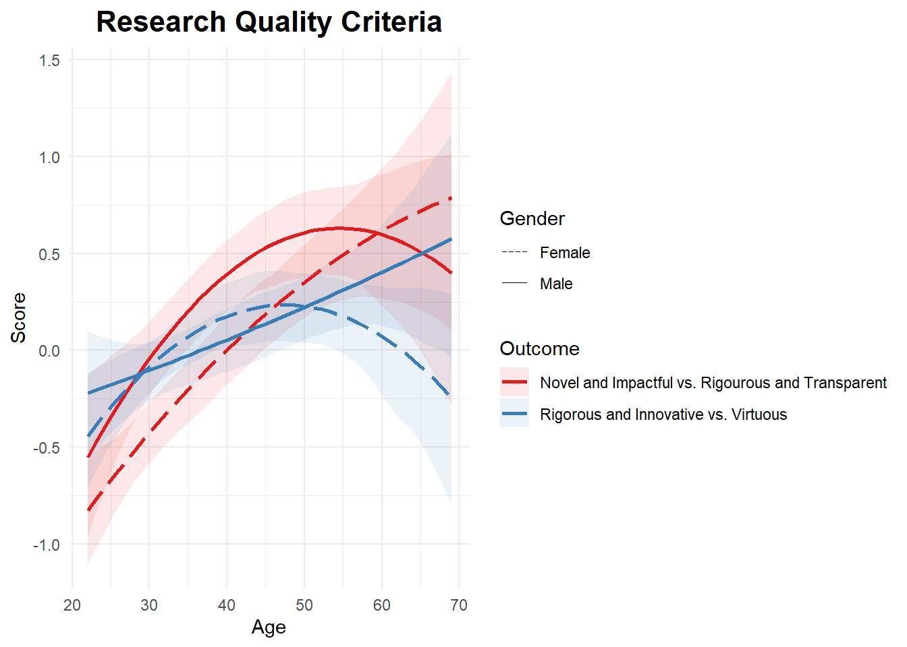{width=672}
:::
:::


::: {.cell}
::: {.cell-output .cell-output-stderr}

```
Loading required namespace: rstan
```


:::

::: {.cell-output-display}
::: {.callout-note collapse="true" title="Quality criteria by gender and age (Markdown table, for text readers)"}

Table: Posterior draws

|Outcome | Draws| Unique draws|
|:------------------------------------------------------------|-----:|------------:|
|Criteria1: Novel and Impactful vs. Rigourous and Transparent | 1000| 744|
|Criteria2: Rigorous and Innovative vs. Virtuous | 1000| 734|

Table: Marginal means (continuous predictor at its mean)

|Outcome |Dem_Gender |Median [95% CI] |pd |
|:------------------------------------------------------------|:----------|:-------------------|:-------|
|Criteria1: Novel and Impactful vs. Rigourous and Transparent |Female |-0.08 [-0.26, 0.10] |78.90% |
|Criteria1: Novel and Impactful vs. Rigourous and Transparent |Male |0.32 [0.13, 0.49] |100.00% |
|Criteria2: Rigorous and Innovative vs. Virtuous |Female |0.14 [-0.01, 0.31] |95.70% |
|Criteria2: Rigorous and Innovative vs. Virtuous |Male |0.02 [-0.13, 0.18] |60.90% |

Table: Contrasts between groups (continuous predictor at its mean)

|Outcome |Contrast |Median [95% CI] |pd |
|:------------------------------------------------------------|:-------------|:-------------------|:-------|
|Criteria1: Novel and Impactful vs. Rigourous and Transparent |Male - Female |0.40 [0.17, 0.68] |100.00% |
|Criteria2: Rigorous and Innovative vs. Virtuous |Male - Female |-0.11 [-0.33, 0.11] |85.50% |

Table: Predictions (Median [95% CI])

|Outcome |Dem_Gender |Dem_Age = 25 |Dem_Age = 35 |Dem_Age = 45 |Dem_Age = 55 |Dem_Age = 65 |
|:------------------------------------------------------------|:----------|:--------------------|:--------------------|:------------------|:------------------|:-------------------|
|Criteria1: Novel and Impactful vs. Rigourous and Transparent |Female |-0.67 [-0.88, -0.47] |-0.20 [-0.37, -0.05] |0.19 [0.01, 0.37] |0.49 [0.26, 0.73] |0.72 [0.21, 1.18] |
|Criteria1: Novel and Impactful vs. Rigourous and Transparent |Male |-0.35 [-0.64, -0.03] |0.20 [0.01, 0.37] |0.53 [0.32, 0.72] |0.63 [0.38, 0.85] |0.51 [0.00, 0.98] |
|Criteria2: Rigorous and Innovative vs. Virtuous |Female |-0.29 [-0.49, -0.05] |0.07 [-0.07, 0.21] |0.23 [0.04, 0.41] |0.18 [-0.02, 0.36] |-0.08 [-0.47, 0.32] |
|Criteria2: Rigorous and Innovative vs. Virtuous |Male |-0.18 [-0.42, 0.05] |-0.03 [-0.18, 0.11] |0.14 [-0.04, 0.30] |0.31 [0.12, 0.49] |0.50 [0.05, 0.88] |

Table: Parameters

|Outcome |Parameter |Median [95% CI] |pd |
|:------------------------------------------------------------|:----------------------------|:--------------------|:-------|
|Criteria1: Novel and Impactful vs. Rigourous and Transparent |Intercept |-0.13 [-0.26, 0.00] |98.70% |
|Criteria1: Novel and Impactful vs. Rigourous and Transparent |Dem_GenderMale |0.31 [0.11, 0.52] |100.00% |
|Criteria1: Novel and Impactful vs. Rigourous and Transparent |polyDem_Age21 |10.99 [7.88, 14.24] |100.00% |
|Criteria1: Novel and Impactful vs. Rigourous and Transparent |polyDem_Age22 |-1.33 [-4.55, 1.65] |82.20% |
|Criteria1: Novel and Impactful vs. Rigourous and Transparent |Dem_GenderMale:polyDem_Age21 |-2.71 [-7.89, 1.93] |84.90% |
|Criteria1: Novel and Impactful vs. Rigourous and Transparent |Dem_GenderMale:polyDem_Age22 |-2.53 [-6.29, 1.83] |85.60% |
|Criteria2: Rigorous and Innovative vs. Virtuous |Intercept |0.00 [-0.11, 0.11] |51.00% |
|Criteria2: Rigorous and Innovative vs. Virtuous |Dem_GenderMale |0.02 [-0.13, 0.20] |62.00% |
|Criteria2: Rigorous and Innovative vs. Virtuous |polyDem_Age21 |3.37 [0.96, 6.03] |98.80% |
|Criteria2: Rigorous and Innovative vs. Virtuous |polyDem_Age22 |-3.55 [-6.42, -1.00] |99.90% |
|Criteria2: Rigorous and Innovative vs. Virtuous |Dem_GenderMale:polyDem_Age21 |1.52 [-2.25, 4.93] |77.20% |
|Criteria2: Rigorous and Innovative vs. Virtuous |Dem_GenderMale:polyDem_Age22 |3.79 [-0.51, 7.95] |96.80% |

:::

:::
:::


### Open Science

TODO: If OS_Familiar == 0, Then NA to OS_Importance

#### Overview


::: {.cell}

```{.r .cell-code}
df_os_practices <- select(df, starts_with("OS_"), -starts_with("OS_Help")) |>
  rename(
    "OS Familiarity" = OS_Familiar,
    "OS Importance" = OS_Importance,
    "OS Training" = OS_Workshops,
    "View on Preregistration" = OS_Study_Preregistration,
    "View on Registered Reports" = OS_Registered_Reports,
    "View on Open Materials" = OS_Open_Materials,
    "View on Open Data" = OS_Open_Data,
    "View on Open Peer Review" = OS_Open_Peer_Review,
    "View on Open Access" = OS_Open_Access_Publication,
    "View on Replication Studies" = OS_Replication_Studies,
    "View on Participatory Research" = OS_Participatory_Research
  )

p_os_prac1 <- correlation(df_os_practices, redundant = TRUE) |>
  correlation::cor_sort() |>
  as.data.frame() |>
  mutate(label = ifelse(p < .001, format_value(r, digits = 2), "")) |>
  ggplot(aes(x=Parameter1, y=Parameter2, fill=r)) +
  geom_tile() +
  geom_text(aes(label=label), color="black", size=3) +
  scale_fill_gradientn(colours = c("darkblue", "blue", "#2196F3","white", "#FFC107", "#F44336", "darkred"), limits = c(-1, 1)) +
  theme_minimal() +
  labs(title = "Co-occurrence of Open Science Practice Engagement",
       x = "",
       y = "") +
  theme(axis.text.x = element_text(angle = 45, hjust = 1),
        plot.title = element_text(size = 12, face = "bold", hjust = 0.5))
p_os_prac1
```

::: {.cell-output-display}
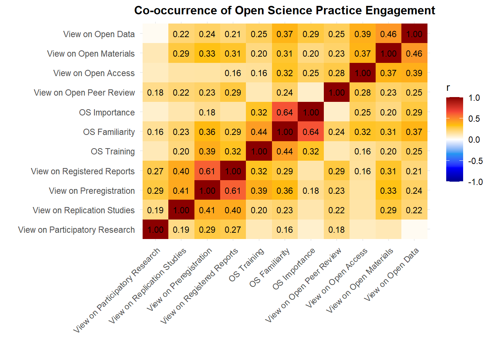{width=672}
:::

```{.r .cell-code}
rez <- n_factors(df_os_practices)
plot(rez)
```

::: {.cell-output-display}
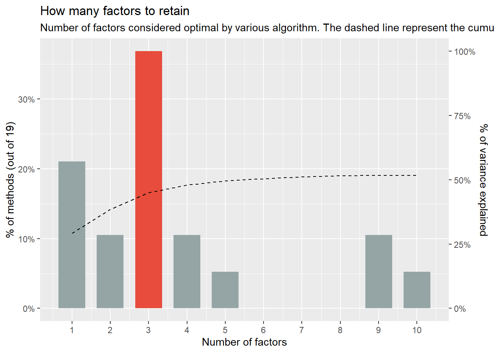{width=672}
:::

```{.r .cell-code}
f <- factor_analysis(df_os_practices, n=3)
```

::: {.cell-output .cell-output-stderr}

```
Loading required namespace: GPArotation
```


:::

```{.r .cell-code}
plot(f)
```

::: {.cell-output-display}
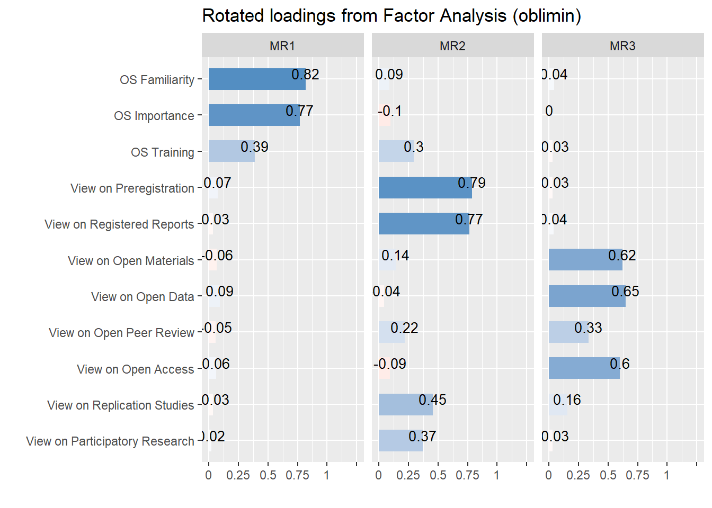{width=672}
:::

```{.r .cell-code}
p_os_prac2 <- plot_graph(f, threshold = 0.2, arrow_end_gap = 0.12, expand = c(1.5, 0.5))
p_os_prac2
```

::: {.cell-output-display}
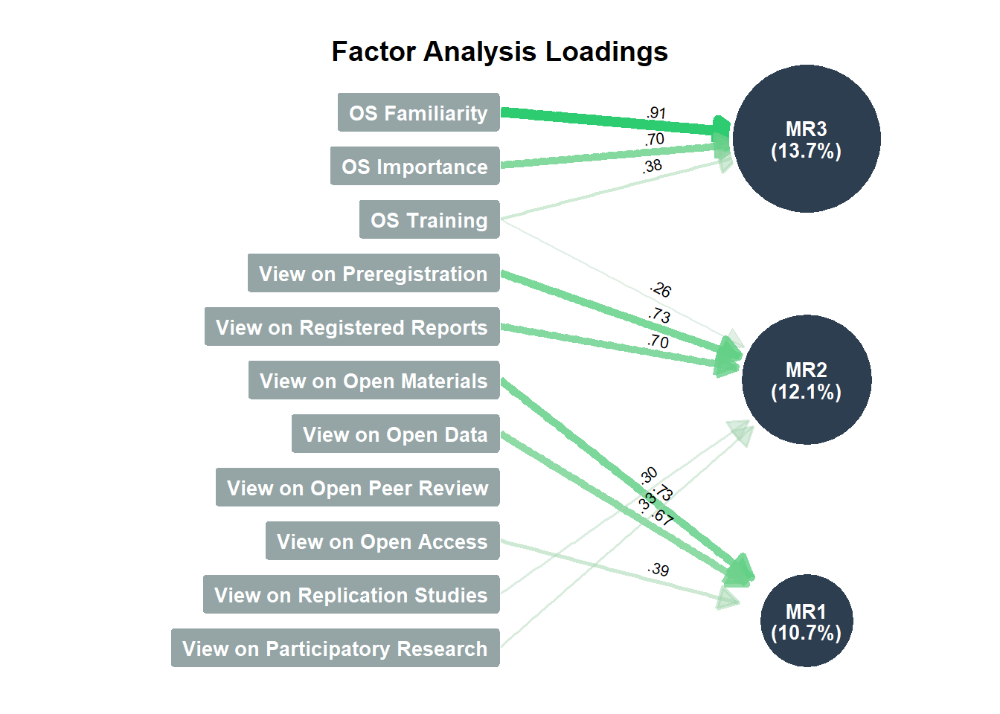{width=672}
:::
:::


::: {.cell}
::: {.cell-output-display}
::: {.callout-note collapse="true" title="Open science practices (Markdown table, for text readers)"}

Table: Descriptive statistics

|Variable | Mean| SD| Min| Max| n| n_Missing|
|:------------------------------|----:|----:|---:|---:|---:|---------:|
|OS Familiarity | 0.73| 0.24| 0| 1| 682| 0|
|OS Importance | 0.82| 0.23| 0| 1| 682| 0|
|OS Training | 0.53| 0.50| 0| 1| 682| 0|
|View on Preregistration | 0.57| 0.41| 0| 1| 682| 0|
|View on Registered Reports | 0.47| 0.36| 0| 1| 682| 0|
|View on Open Materials | 0.79| 0.30| 0| 1| 682| 0|
|View on Open Data | 0.80| 0.28| 0| 1| 682| 0|
|View on Open Peer Review | 0.59| 0.37| 0| 1| 682| 0|
|View on Open Access | 0.87| 0.23| 0| 1| 682| 0|
|View on Replication Studies | 0.60| 0.34| 0| 1| 682| 0|
|View on Participatory Research | 0.56| 0.38| 0| 1| 682| 0|

Table: Correlations

|Variable1 |Variable2 | r|95% CI |
|:---------------------------|:------------------------------|----:|:------------|
|OS Familiarity |OS Importance | 0.64|[0.59, 0.68] |
|View on Preregistration |View on Registered Reports | 0.61|[0.56, 0.66] |
|View on Open Materials |View on Open Data | 0.46|[0.40, 0.52] |
|OS Familiarity |OS Training | 0.44|[0.38, 0.50] |
|View on Preregistration |View on Replication Studies | 0.40|[0.34, 0.46] |
|View on Registered Reports |View on Replication Studies | 0.40|[0.34, 0.46] |
|OS Training |View on Preregistration | 0.40|[0.33, 0.46] |
|View on Open Data |View on Open Access | 0.39|[0.32, 0.45] |
|View on Open Materials |View on Open Access | 0.37|[0.31, 0.44] |
|OS Familiarity |View on Open Data | 0.36|[0.30, 0.43] |
|OS Familiarity |View on Preregistration | 0.36|[0.29, 0.42] |
|View on Preregistration |View on Open Materials | 0.33|[0.26, 0.39] |
|OS Training |View on Registered Reports | 0.32|[0.26, 0.39] |
|OS Importance |OS Training | 0.32|[0.25, 0.38] |
|View on Registered Reports |View on Open Materials | 0.31|[0.24, 0.38] |
|OS Familiarity |View on Open Access | 0.31|[0.24, 0.38] |
|OS Familiarity |View on Open Materials | 0.30|[0.23, 0.37] |
|View on Registered Reports |View on Open Peer Review | 0.29|[0.22, 0.36] |
|View on Open Materials |View on Replication Studies | 0.29|[0.22, 0.36] |
|View on Preregistration |View on Participatory Research | 0.29|[0.22, 0.36] |
|OS Familiarity |View on Registered Reports | 0.29|[0.22, 0.36] |
|OS Importance |View on Open Data | 0.28|[0.21, 0.35] |
|View on Open Peer Review |View on Open Access | 0.28|[0.21, 0.35] |
|View on Registered Reports |View on Participatory Research | 0.28|[0.20, 0.34] |
|View on Open Data |View on Open Peer Review | 0.26|[0.19, 0.33] |
|OS Training |View on Open Data | 0.25|[0.18, 0.32] |
|View on Preregistration |View on Open Data | 0.24|[0.17, 0.31] |
|OS Familiarity |View on Open Peer Review | 0.24|[0.17, 0.31] |
|OS Importance |View on Open Access | 0.24|[0.17, 0.31] |
|View on Preregistration |View on Open Peer Review | 0.24|[0.17, 0.31] |
|View on Open Materials |View on Open Peer Review | 0.23|[0.16, 0.30] |
|OS Familiarity |View on Replication Studies | 0.23|[0.15, 0.30] |
|View on Open Data |View on Replication Studies | 0.22|[0.14, 0.29] |
|View on Open Peer Review |View on Replication Studies | 0.22|[0.14, 0.29] |
|View on Registered Reports |View on Open Data | 0.21|[0.14, 0.28] |
|OS Training |View on Replication Studies | 0.21|[0.13, 0.28] |
|OS Training |View on Open Materials | 0.20|[0.13, 0.27] |
|OS Importance |View on Open Materials | 0.20|[0.12, 0.27] |
|View on Replication Studies |View on Participatory Research | 0.19|[0.12, 0.26] |
|View on Open Peer Review |View on Participatory Research | 0.19|[0.12, 0.26] |
|OS Importance |View on Preregistration | 0.17|[0.10, 0.25] |
|OS Familiarity |View on Participatory Research | 0.17|[0.09, 0.24] |
|OS Training |View on Open Access | 0.16|[0.09, 0.23] |
|View on Registered Reports |View on Open Access | 0.16|[0.08, 0.23] |

Table: Number of factors: agreement between methods

| n_Factors| n_Methods| Variance_Cumulative|
|---------:|---------:|-------------------:|
| 1| 4| 0.29|
| 2| 2| 0.39|
| 3| 7| 0.45|
| 4| 2| 0.48|
| 5| 1| 0.50|
| 9| 2| 0.52|
| 10| 1| 0.52|

Table: Loadings

|Variable | MR2| MR1| MR3| Complexity| Uniqueness|
|:------------------------------|-----:|-----:|-----:|----------:|----------:|
|OS Familiarity | 0.09| 0.82| 0.04| 1.03| 0.23|
|OS Importance | -0.10| 0.77| 0.00| 1.03| 0.45|
|OS Training | 0.30| 0.39| -0.03| 1.88| 0.70|
|View on Preregistration | 0.79| 0.07| -0.03| 1.02| 0.35|
|View on Registered Reports | 0.77| -0.03| 0.04| 1.01| 0.40|
|View on Open Materials | 0.14| -0.06| 0.62| 1.13| 0.55|
|View on Open Data | -0.04| 0.09| 0.65| 1.05| 0.53|
|View on Open Peer Review | 0.22| -0.05| 0.33| 1.77| 0.80|
|View on Open Access | -0.09| 0.06| 0.60| 1.07| 0.64|
|View on Replication Studies | 0.45| -0.03| 0.16| 1.24| 0.72|
|View on Participatory Research | 0.37| 0.02| -0.03| 1.02| 0.87|

Table: Explained variance

|Parameter | MR2| MR1| MR3|
|:-------------------|----:|----:|----:|
|Eigenvalues | 3.15| 0.96| 0.64|
|Variance | 0.17| 0.14| 0.13|
|Variance_Cumulative | 0.17| 0.30| 0.43|
|Variance_Proportion | 0.39| 0.32| 0.30|

Table: Factor correlations

|Factor | MR2| MR1| MR3|
|:------|----:|----:|----:|
|MR2 | 1.00| 0.36| 0.43|
|MR1 | 0.36| 1.00| 0.50|
|MR3 | 0.43| 0.50| 1.00|

:::

:::
:::


#### Adoption


::: {.cell}

```{.r .cell-code}
# The four answers, in the order of the 0-1 engagement score (format_use())
os_use_levels <- c("Used" = 3, "Plan to use" = 2, "Do not plan to use" = 1, "Not familiar" = 0)
os_use_colors <- c("Used" = "#1565C0", "Plan to use" = "#90CAF9", "Do not plan to use" = "#E57373", "Not familiar" = "#BDBDBD")

df_os_adoption <- df |>
  select(Preregistration = OS_Study_Preregistration, `Registered reports` = OS_Registered_Reports,
         `Open materials` = OS_Open_Materials, `Open data` = OS_Open_Data,
         `Open peer review` = OS_Open_Peer_Review, `Open access` = OS_Open_Access_Publication,
         `Replication studies` = OS_Replication_Studies, `Participatory research` = OS_Participatory_Research) |>
  pivot_longer(everything(), names_to = "Practice", values_to = "Use") |>
  filter(!is.na(Use)) |>
  mutate(Response = factor(names(os_use_levels)[match(round(Use * 3), os_use_levels)], levels = names(os_use_levels))) |>
  count(Practice, Response, .drop = FALSE) |>
  mutate(Proportion = n / sum(n), .by = Practice) |>
  mutate(Practice = fct_reorder(Practice, ifelse(Response == "Used", Proportion, 0), .fun = sum))

p_os_adoption <- df_os_adoption |>
  ggplot(aes(x = Proportion, y = Practice, fill = Response)) +
  geom_col(position = position_stack(reverse = TRUE), width = 0.75, color = "white", linewidth = 0.5) +
  geom_text(aes(label = ifelse(Proportion >= 0.08, scales::percent(Proportion, accuracy = 1), ""),
                color = Response == "Used", group = Response),
            position = position_stack(vjust = 0.5, reverse = TRUE), size = 2.8, show.legend = FALSE) +
  scale_x_continuous(labels = scales::percent_format(), expand = c(0, 0)) +
  scale_fill_manual(values = os_use_colors) +
  scale_color_manual(values = c("TRUE" = "white", "FALSE" = "grey15"), guide = "none") +
  theme_minimal() +
  theme(legend.position = "bottom", panel.grid = element_blank()) +
  labs(title = "Adoption of Open Science Practices", x = NULL, y = NULL, fill = NULL)
p_os_adoption
```

::: {.cell-output-display}
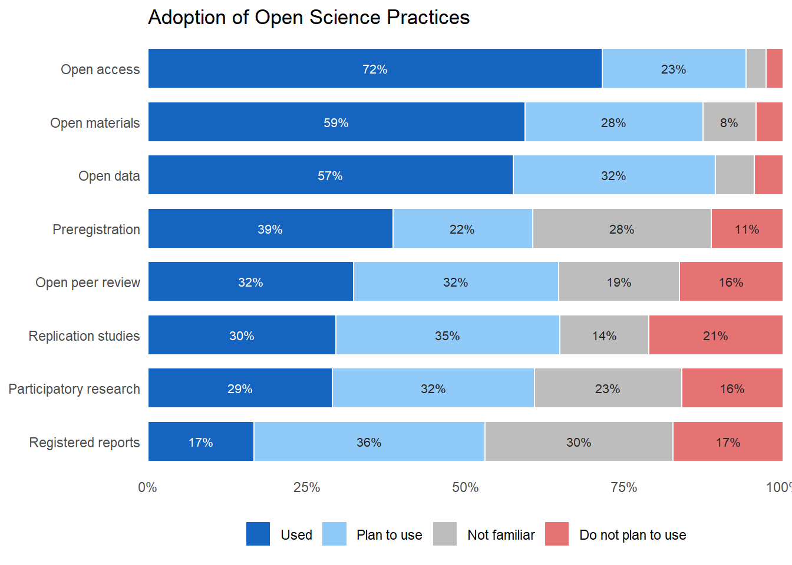{width=672}
:::
:::


::: {.cell}
::: {.cell-output-display}
::: {.callout-note collapse="true" title="Adoption of open science practices (Markdown table, for text readers)"}

|Practice |Used |Plan to use |Do not plan to use |Not familiar |
|:----------------------|:------|:-----------|:------------------|:------------|
|Open access |71.55% |22.58% |2.64% |3.23% |
|Open materials |59.38% |28.01% |4.25% |8.36% |
|Open data |57.48% |31.82% |4.55% |6.16% |
|Preregistration |38.56% |21.99% |11.29% |28.15% |
|Open peer review |32.40% |32.26% |16.28% |19.06% |
|Replication studies |29.62% |35.19% |21.11% |14.08% |
|Participatory research |29.03% |31.82% |15.98% |23.17% |
|Registered reports |16.72% |36.36% |17.30% |29.62% |

:::

:::
:::


#### Open Science Help


::: {.cell}

```{.r .cell-code}
# TODO: Add subtitlte "Select up to 5" 
df_os_help <- select(df, starts_with("OS_Help"), -OS_Help_Other)
names(df_os_help) <- str_replace(names(df_os_help), "OS_Help_", "") |>
  str_replace_all(fixed("_"), " ") |>
  recode(
    "Data sharing"                  = "Data sharing\nethics",   # Knowledge about ethical considerations
    "Workload"                         = "Dedicated OS\nworkload",
    "Infrastructure"                   = "Technical\ninfrastructure",
    "Funding"                          = "Dedicated\nfunding",
    "Incentives Fund Institutions"     = "Institutional\nincentives",  
    "Recognition Promotion Recruitment" = "Career\nrecognition",
    "Support Seniors"                  = "Senior researcher\nsupport",
    "Support Juniors"                  = "Junior researcher\nsupport",
    "Training"                         = "OS training"
  )

correlation(df_os_help, redundant = TRUE) |>
  correlation::cor_sort() |>
  as.data.frame() |>
  mutate(label = ifelse(p < .001, format_value(r, digits = 2), "")) |>
  ggplot(aes(x=Parameter1, y=Parameter2, fill=r)) +
  geom_tile() +
  geom_text(aes(label=label), color="black", size=3) +
  scale_fill_gradientn(colours = c("darkblue", "blue", "#2196F3","white", "#FFC107", "#F44336", "darkred"), limits = c(-1, 1)) +
  theme_minimal() +
  labs(title = "Correlation Matrix of Open Science Help Avenues",
       x = "",
       y = "") +
  theme(axis.text.x = element_text(angle = 45, hjust = 1))
```

::: {.cell-output-display}
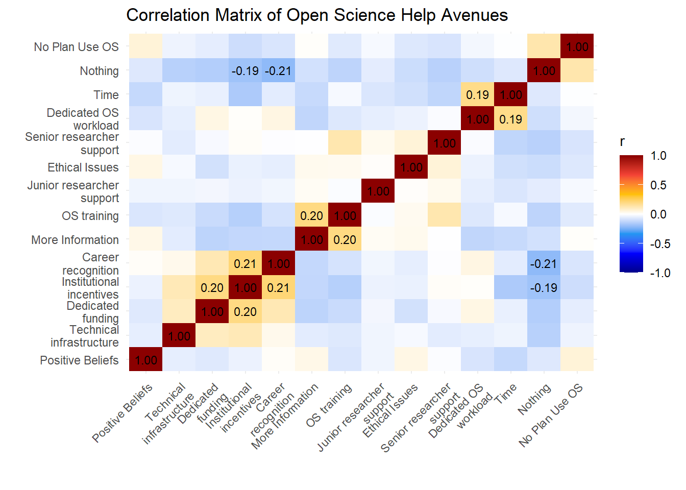{width=672}
:::

```{.r .cell-code}
p_os_help <- df_os_help |>
  mutate(participant = paste0("S", 1:nrow(df_os_help))) |>
  pivot_longer(-participant) |>
  summarize(Total = sum(value) / nrow(df_os_help), .by="name") |>
  mutate(Type = case_when(
           name %in% c("Career\nrecognition") ~ "Recognition",
           name %in% c("Institutional\nincentives", "Dedicated\nfunding") ~ "Money",
           name %in% c("Time", "Dedicated OS\nworkload") ~ "Time",
           name %in% c("Technical\ninfrastructure", "Senior researcher\nsupport", "OS training", "Junior researcher\nsupport", "More Information") ~ "Support",
           .default = "Other"),
         Type = fct_relevel(Type, "Recognition", "Money", "Time", "Support"),
         name = fct_reorder(name, desc(Total))) |>
  ggplot(aes(x = name, y = Total, fill = Type)) +
  geom_bar(stat = "identity") +
  scale_y_continuous(labels = scales::percent_format()) +
  scale_fill_manual(values = c("Recognition" = "#E91E63", "Money" = "gold", "Time" = "#4CAF50", "Support" = "#1E88E5", "Other" = "grey")) +
  theme_minimal() +
  labs(title = "What would you need to further adopt open science practices?",
       x = "",
       y = "") +
  theme(axis.text.x = element_text(angle = 50, hjust = 1),
        plot.title = element_text(size = 12, face = "bold", hjust = 0))
p_os_help
```

::: {.cell-output-display}
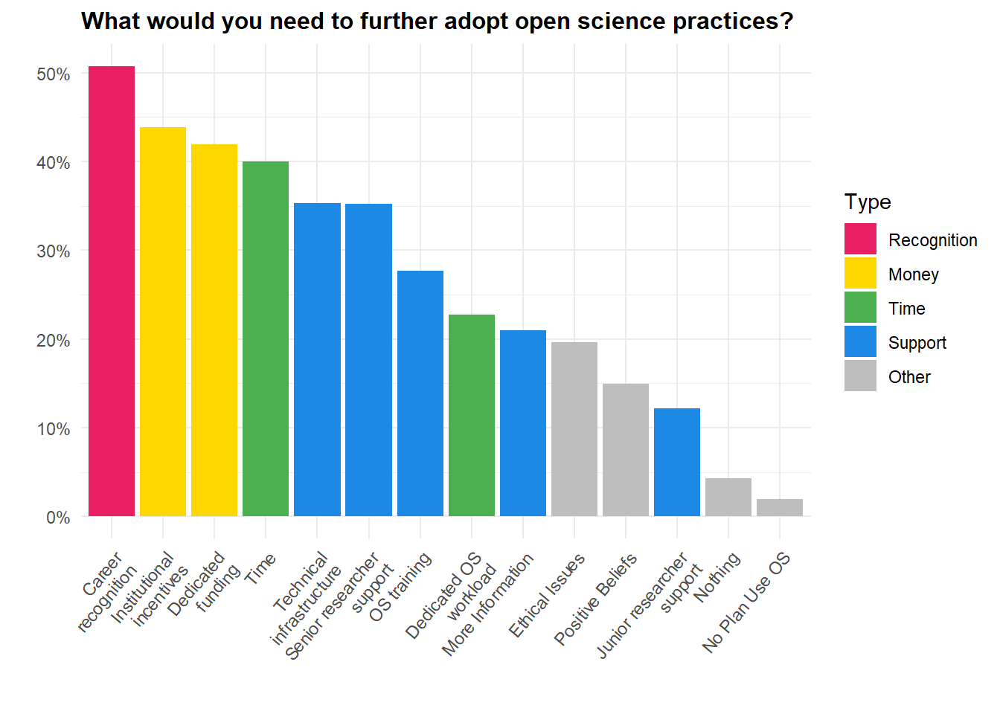{width=672}
:::
:::


::: {.cell}
::: {.cell-output-display}
::: {.callout-note collapse="true" title="Open science help (Markdown table, for text readers)"}

Table: Proportion selecting each avenue

|Avenue |Type |Selected |
|:-------------------------|:-----------|:--------|
|Career recognition |Recognition |50.73% |
|Institutional incentives |Money |43.84% |
|Dedicated funding |Money |41.94% |
|Time |Time |40.03% |
|Technical infrastructure |Support |35.34% |
|Senior researcher support |Support |35.19% |
|OS training |Support |27.71% |
|Dedicated OS workload |Time |22.73% |
|More Information |Support |20.97% |
|Ethical Issues |Other |19.65% |
|Positive Beliefs |Other |14.96% |
|Junior researcher support |Support |12.17% |
|Nothing |Other |4.25% |
|No Plan Use OS |Other |1.91% |

Table: Co-selection (phi correlations)

|Variable1 |Variable2 | r|95% CI |
|:------------------------|:------------------------|-----:|:--------------|
|Institutional incentives |Career recognition | 0.21|[0.14, 0.29] |
|Nothing |Career recognition | -0.21|[-0.28, -0.14] |
|More Information |OS training | 0.20|[0.12, 0.27] |
|Dedicated funding |Institutional incentives | 0.20|[0.12, 0.27] |
|Nothing |Institutional incentives | -0.19|[-0.26, -0.11] |
|Dedicated OS workload |Time | 0.19|[0.11, 0.26] |

:::

:::
:::


### Slow Science


::: {.cell}

```{.r .cell-code}
df_ss_scales <- select(df, SS_Familiar, SS_Importance, SS_Workshops)

df_ss_scales |>
  rename(
    "SS Familiarity" = SS_Familiar,
    "SS Importance" = SS_Importance,
    "SS Training\n(Workshops)" = SS_Workshops
  ) |>
  correlation(redundant = TRUE) |>
  correlation::cor_sort() |>
  as.data.frame() |>
  mutate(label = ifelse(p < .001, format_value(r, digits = 2), "")) |>
  ggplot(aes(x=Parameter1, y=Parameter2, fill=r)) +
  geom_tile() +
  geom_text(aes(label=label), color="black", size=3) +
  scale_fill_gradientn(colours = c("darkblue", "blue", "#2196F3","white", "#FFC107", "#F44336", "darkred"), limits = c(-1, 1)) +
  theme_minimal() +
  labs(title = "Correlation Matrix of Slow Science Scales",
       x = "",
       y = "") +
  theme(axis.text.x = element_text(angle = 45, hjust = 1))
```

::: {.cell-output-display}
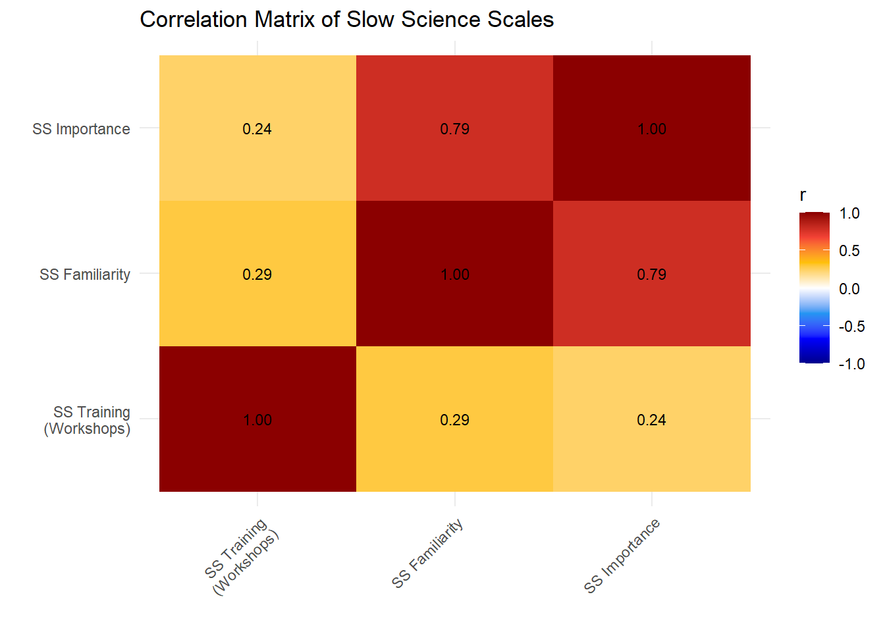{width=672}
:::
:::


::: {.cell}
::: {.cell-output-display}
::: {.callout-note collapse="true" title="Slow science scales (Markdown table, for text readers)"}

Table: Descriptive statistics

|Variable | Mean| SD| Min| Max| n| n_Missing|
|:-------------|----:|----:|---:|---:|---:|---------:|
|SS_Familiar | 0.34| 0.33| 0| 1| 682| 0|
|SS_Importance | 0.45| 0.39| 0| 1| 682| 0|
|SS_Workshops | 0.05| 0.23| 0| 1| 682| 0|

Table: Correlations

|Variable1 |Variable2 | r|95% CI |
|:-------------|:-------------|----:|:------------|
|SS_Familiar |SS_Importance | 0.79|[0.76, 0.81] |
|SS_Familiar |SS_Workshops | 0.29|[0.22, 0.36] |
|SS_Importance |SS_Workshops | 0.24|[0.17, 0.31] |

:::

:::
:::


### Slow Science Definition


::: {.cell}

```{.r .cell-code}
# TODO: Add subtitle: "Select up to 3" 
df_ss_def <- select(df, starts_with("SS_Definition_"), -SS_Definition_Other)
names(df_ss_def) <- str_replace(names(df_ss_def), "SS_Definition_", "") |>
  str_replace_all(fixed("_"), " ")

ss_def <- df_ss_def |>
  mutate(participant = paste0("S", 1:nrow(df_ss_def))) |>
  pivot_longer(-participant) |>
  mutate(name = recode(name,
    "Quality over quantity"    = "Quality over\nquantity",
    "Slow Process"             = "Slow process over\nshort-term goals",
    "Work Life Balance"        = "Better work/life\nbalance",
    "Changing Metrics"         = "Changing assessment\nmetrics",
    "Increase Research Time"   = "Increase time\nfor research",
    "Diminishing Publications" = "Fewer\npublications"
  )) |>
  summarize(Total = sum(value, na.rm = TRUE) / nrow(df_ss_def), .by = "name") |>
  mutate(name = fct_reorder(name, desc(Total))) |>
  ggplot(aes(x = name, y = Total, fill=Total)) +
  geom_bar(stat = "identity") +
  scale_y_continuous(labels = scales::percent_format()) +
  scale_fill_gradient(low = "lightblue", high = "steelblue", guide = "none") +
  theme_minimal() +
  labs(title = "Which of these best describes Slow Science for you?",
       x = "",
       y = "") +
  theme(axis.text.x = element_text(angle = 40, hjust = 1),
        plot.title = element_text(size = 12, face = "bold", hjust = 0))
ss_def
```

::: {.cell-output-display}
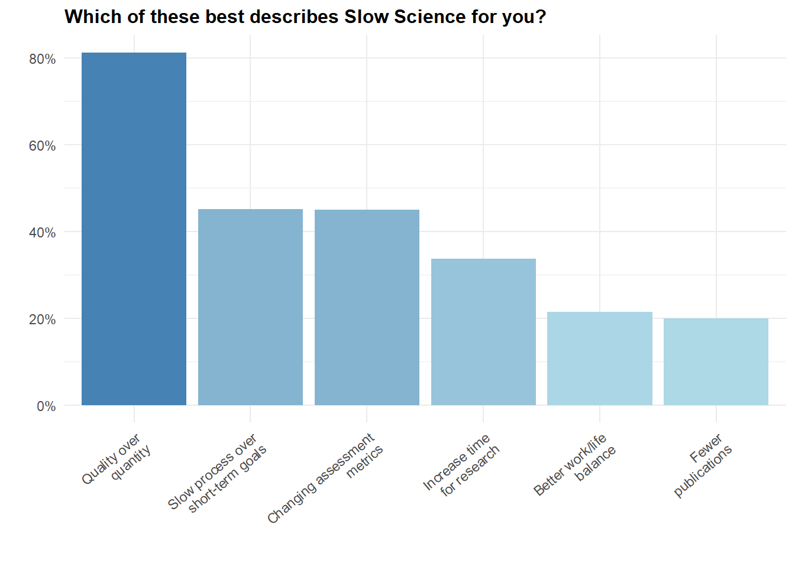{width=672}
:::
:::


::: {.cell}
::: {.cell-output-display}
::: {.callout-note collapse="true" title="Slow science definition (Markdown table, for text readers)"}

|Definition |Selected |
|:----------------------------------|:--------|
|Quality over quantity |81.23% |
|Slow process over short-term goals |45.16% |
|Changing assessment metrics |45.01% |
|Increase time for research |33.72% |
|Better work/life balance |21.41% |
|Fewer publications |19.94% |

:::

:::
:::


### Slow Science Feasibility


::: {.cell}

```{.r .cell-code}
# TODO: If Not_Feasible, then remove "Feasible_individual" and "Feasible_institution" for that practice for that participant
# TODO: Add "Both" column for joint Individual & Institutional
ss_feas <- select(df, matches("^SS_.*Feasible_individual$|^SS_.*Feasible_institution$|^SS_.*Not_Feasible$")) |>
  mutate(participant = paste0("S", seq_len(n()))) |>
  pivot_longer(-participant, names_to = "Variable", values_to = "value") |>
  mutate(
    Practice = case_when(
      str_detect(Variable, "_Limit_publication_") ~ "Limit nr. of articles\nsubmitted for publication",
      str_detect(Variable, "_Replicate_")         ~ "Replicate before\npublishing",
      str_detect(Variable, "_Longertime_")        ~ "Think in longer\ntimescales",
      str_detect(Variable, "_Models_")            ~ "Provide models for\nthe next generation",
      str_detect(Variable, "_Quality_")           ~ "Assess quality,\nnot quantity",
      str_detect(Variable, "_Teamwork_")          ~ "Value teamwork over\nindividual work",
      str_detect(Variable, "_Onepublication_")    ~ "Publish only 1\narticle per year",
      str_detect(Variable, "_Onegrant_")          ~ "Only 1 grant\nper year"
    ),
    Level = case_when(
      str_detect(Variable, "_Feasible_individual$") ~ "Individual",
      str_detect(Variable, "_Feasible_institution$") ~ "Institution",
      str_detect(Variable, "_Not_Feasible$") ~ "Not Feasible"
    ),
    Level = fct_relevel(Level, "Individual", "Institution", "Not Feasible")
  ) |>
  summarize(Proportion = sum(value, na.rm = TRUE) / n_distinct(participant),
            .by = c(Practice, Level)) |> 
  mutate(Practice = fct_reorder(Practice, ifelse(Level == "Institution", Proportion, 0), .fun = \(x) sum(x, na.rm = TRUE), .desc = TRUE)) |>
  ggplot(aes(x = Practice, y = Proportion, fill = Level)) +
  geom_bar(stat = "identity", position = "dodge") +
  scale_y_continuous(labels = scales::percent_format()) +
  scale_fill_manual(values = c("Individual" = "#4CAF50", "Institution" = "#1E88E5", "Not Feasible" = "#E53935")) +
  theme_minimal() +
  labs(title = "What Can Help Slow Science and Who's Responsability is it?",
       x = "", y = "", fill = NULL) +
  theme(axis.text.x = element_text(angle = 40, hjust = 1),
        plot.title = element_text(size = 12, face = "bold", hjust = 0))
ss_feas
```

::: {.cell-output-display}
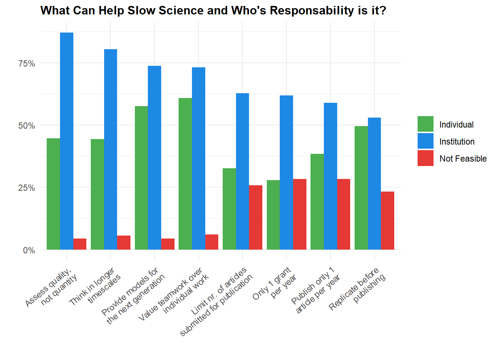{width=672}
:::
:::


::: {.cell}
::: {.cell-output-display}
::: {.callout-note collapse="true" title="Slow science feasibility (Markdown table, for text readers)"}

|Practice |Individual |Institution |Not Feasible |
|:-----------------------------------------------|:----------|:-----------|:------------|
|Assess quality, not quantity |44.57% |87.10% |4.40% |
|Think in longer timescales |44.28% |80.35% |5.57% |
|Provide models for the next generation |57.48% |73.75% |4.40% |
|Value teamwork over individual work |60.85% |73.17% |6.01% |
|Limit nr. of articles submitted for publication |32.55% |62.76% |25.81% |
|Only 1 grant per year |27.86% |61.88% |28.30% |
|Publish only 1 article per year |38.42% |58.94% |28.30% |
|Replicate before publishing |49.56% |52.93% |23.31% |

:::

:::
:::


### Ratings Across Movements


::: {.cell}

```{.r .cell-code}
domain_colors <- c("Open Science" = "#2196F3", "Slow Science" = "#FF9800",
                   "Green Science" = "#4CAF50", "Ethical Science" = "#9C27B0")
slider_items <- c(
  "OS_Familiar"                         = "Familiarity with the movement",
  "OS_Importance"                       = "Importance of the movement",
  "SS_Familiar"                         = "Familiarity with the movement",
  "SS_Importance"                       = "Importance of the movement",
  "GS_Importance_conducting"            = "Importance in conducting research",
  "GS_Importance_topic"                 = "Importance in choosing topics",
  "GS_Relation_Research_Sustainability" = "Link between research and environment",
  "GS_Change_practices_agreeing"        = "Willing to change practices",
  "GS_Changes_communication_practices"  = "Changed communication (e.g., travel)",
  "GS_Changes_practices"                = "Changed research practices",
  "ES_Consequences_society"             = "Care for societal consequences",
  "ES_Importance_research_team"         = "Importance of team diversity"
)

df_sliders <- df |>
  select(all_of(names(slider_items))) |>
  pivot_longer(everything(), names_to = "Variable", values_to = "Score") |>
  filter(!is.na(Score)) |>
  mutate(Domain = case_when(str_starts(Variable, "OS_") ~ "Open Science", str_starts(Variable, "SS_") ~ "Slow Science",
                            str_starts(Variable, "GS_") ~ "Green Science", str_starts(Variable, "ES_") ~ "Ethical Science"),
         Domain = factor(Domain, levels = names(domain_colors)),
         Domain_label = fct_relabel(Domain, \(x) str_replace(x, " ", "\n")),
         Item = factor(slider_items[Variable], levels = rev(unique(slider_items))))

p_sliders <- df_sliders |>
  ggplot(aes(x = Score, y = Item, fill = Domain)) +
  ggdist::stat_histinterval(breaks = ggdist::breaks_fixed(width = 0.05), align = ggdist::align_boundary(at = 0),
                            outline_bars = FALSE, slab_alpha = 0.6, height = 0.9, normalize = "xy",
                            point_interval = "mean_qi", .width = 0.5, point_size = 1.5,
                            interval_size_range = c(0.8, 0.8), justification = -0.05, show.legend = FALSE) +
  scale_x_continuous(limits = c(0, 1), labels = \(x) x * 100, expand = c(0.01, 0)) +
  scale_fill_manual(values = domain_colors) +
  facet_grid(Domain_label ~ ., scales = "free_y", space = "free_y", switch = "y") +
  theme_minimal() +
  theme(strip.placement = "outside", strip.text.y.left = element_text(angle = 0, face = "bold", hjust = 1),
        panel.grid.minor = element_blank(), panel.grid.major.y = element_blank()) +
  labs(title = "Familiarity, Importance and Engagement", x = "Rating (0-100)", y = NULL)
p_sliders
```

::: {.cell-output-display}
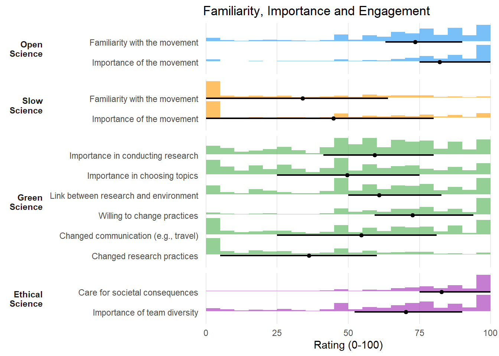{width=672}
:::
:::


::: {.cell}
::: {.cell-output-display}
::: {.callout-note collapse="true" title="Ratings across movements (0-100 sliders) (Markdown table, for text readers)"}

|Domain |Item | Mean| SD| Median|At 0 |At 100 | n|
|:---------------|:-------------------------------------|-----:|-----:|------:|:------|:------|---:|
|Open Science |Familiarity with the movement | 73.46| 24.23| 80.0|2.93% |13.93% | 682|
|Open Science |Importance of the movement | 82.15| 22.72| 90.0|3.52% |31.96% | 682|
|Slow Science |Familiarity with the movement | 33.99| 32.76| 25.5|32.55% |2.35% | 682|
|Slow Science |Importance of the movement | 44.81| 38.68| 50.0|36.22% |9.53% | 682|
|Green Science |Importance in conducting research | 59.22| 27.40| 60.0|4.11% |7.62% | 682|
|Green Science |Importance in choosing topics | 49.63| 30.37| 50.0|8.06% |6.60% | 682|
|Green Science |Link between research and environment | 60.82| 29.19| 65.0|5.87% |11.58% | 682|
|Green Science |Willing to change practices | 72.52| 25.00| 76.0|2.20% |21.99% | 682|
|Green Science |Changed communication (e.g., travel) | 54.64| 33.71| 60.0|12.32% |11.88% | 682|
|Green Science |Changed research practices | 36.23| 30.50| 30.0|22.29% |2.64% | 682|
|Ethical Science |Care for societal consequences | 82.73| 20.06| 90.0|0.59% |32.84% | 682|
|Ethical Science |Importance of team diversity | 70.21| 26.49| 75.0|3.08% |18.33% | 682|

:::

:::
:::


## Science Attitudes

Alternative names:
- Agathic Science
- Honest Science
- New Science

### Correlation


::: {.cell}

```{.r .cell-code}
df_resprac <- select(df, starts_with("OS_"), starts_with("GS_"), -starts_with("OS_Help"),
                     -OS_Workshops,
                     -OS_Familiar,
                     SS_Importance, SS_Familiar,
                     ES_Importance_research_team, ES_Consequences_society) |> 
  rename("Open Science - Importance" = OS_Importance,
         # "Open Science - Familiarity" = OS_Familiar,
         "Slow Science - Importance" = SS_Importance,
         "Slow Science - Familiarity" = SS_Familiar,
         # How important do you consider the diversity of the research team (in terms 
         # of neurodiversity, disability, ethnicity, gender, etc.)?
         "Ethical Science - Team Diversity" = ES_Importance_research_team,
         # How important is it to be careful regarding the direct consequences (e.g.
         # benefits or harms) for the participants or society of your research?
         "Ethical Science - Societal Consequences" = ES_Consequences_society,
         # Green Science
         # How important is environmental sustainability in how you conduct your research?
         "Green Science - Ecofriendly Practices" = GS_Importance_conducting,
         # How important is environmental sustainability in choosing research topics?
         "Green Science - Ecofriendly Topics" = GS_Importance_topic,
         # Have you changed your research practices (e.g., experimental design, topic, material)
         # for environmental sustainability reasons?
         "Green Science - Changed Practices" = GS_Changes_practices,
         # Have you changed your research communication practices (e.g., professional travels)
         # for environmental sustainability reasons?
         "Green Science - Changed Communication" = GS_Changes_communication_practices,
         # Do you think there is a link between scientific production and environmental sustainability? 
         "Green Science - Belief Relation" = GS_Relation_Research_Sustainability,
         # Would you agree to change your research practices for environmental reasons?
         "Green Science - Change Willingness" = GS_Change_practices_agreeing,
         "Endorsement - Participatory Research" = OS_Participatory_Research,
         "Endorsement - Replication Studies" = OS_Replication_Studies,
         "Endorsement - Open Access" = OS_Open_Access_Publication,
         "Endorsement - Open Peer Review" = OS_Open_Peer_Review,
         "Endorsement - Open Data" = OS_Open_Data,
         "Endorsement - Open Materials" = OS_Open_Materials,
         "Endorsement - Registered Reports" = OS_Registered_Reports,
         "Endorsement - Preregistration" = OS_Study_Preregistration)


p_cor <- df_resprac |>
  correlation(redundant = TRUE) |>
  correlation::cor_sort() |>
  as.data.frame() |>
  mutate(label = ifelse(p < .001, format_value(r, digits = 2), "")) |>
  ggplot(aes(x=Parameter1, y=Parameter2, fill=r)) +
  geom_tile() +
  geom_text(aes(label=label), color="black", size=1.5) +
  annotate(geom="rect", xmin=0.5, xmax=8.5, ymin=0.5, ymax=8.5, alpha=0, color="#9C27B0", linewidth = 2) +
  annotate(geom="rect", xmin=0.55, xmax=4.5, ymin=0.55, ymax=4.5, alpha=0, color="#4CAF50", linewidth = 2) +
  annotate(geom="rect", xmin=9.5, xmax=12.5, ymin=9.5, ymax=12.5, alpha=0, color="#3F51B5", linewidth = 2) +
  annotate(geom="rect", xmin=13.5, xmax=15.5, ymin=13.5, ymax=15.5, alpha=0, color="#FF9800", linewidth = 2) +
  annotate(geom="rect", xmin=12.5, xmax=19.5, ymin=12.5, ymax=19.5, alpha=0, color="#2196F3", linewidth = 2) +
  scale_fill_gradientn(colours = c("darkblue", "blue", "#2196F3","white", "#FFC107", "#F44336", "darkred"), limits = c(-1, 1)) +
  theme_minimal() +
  labs(title = "Correlation Matrix of Research Values",
       x = "",
       y = "") +
  theme(axis.text.x = element_text(angle = 35, hjust = 1),
        plot.title = element_text(size = 14, face = "bold", hjust = 0.5),
        legend.position = "none")
p_cor
```

::: {.cell-output-display}
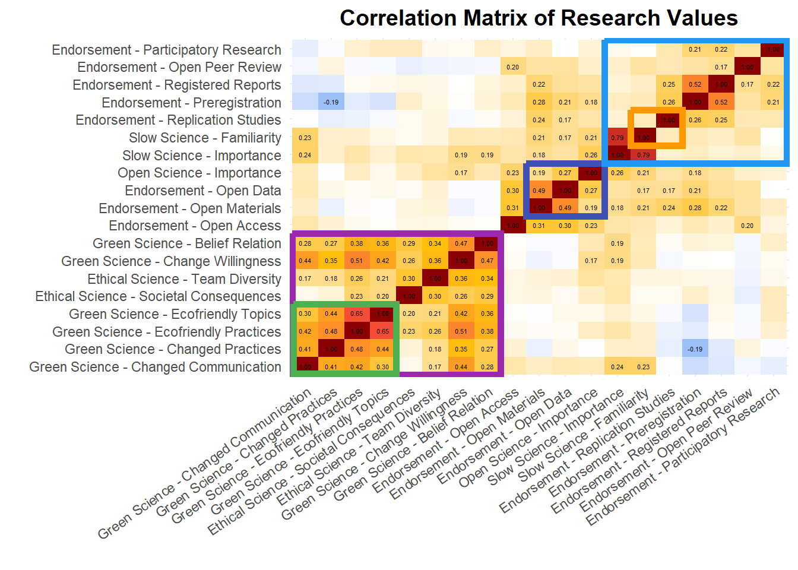{width=672}
:::
:::


::: {.cell}
::: {.cell-output-display}
::: {.callout-note collapse="true" title="Research values (Markdown table, for text readers)"}

Table: Descriptive statistics

|Variable | Mean| SD| Min| Max| n| n_Missing|
|:---------------------------------------|----:|----:|---:|---:|---:|---------:|
|Open Science - Importance | 0.82| 0.23| 0| 1| 682| 0|
|Endorsement - Preregistration | 0.57| 0.41| 0| 1| 682| 0|
|Endorsement - Registered Reports | 0.47| 0.36| 0| 1| 682| 0|
|Endorsement - Open Materials | 0.79| 0.30| 0| 1| 682| 0|
|Endorsement - Open Data | 0.80| 0.28| 0| 1| 682| 0|
|Endorsement - Open Peer Review | 0.59| 0.37| 0| 1| 682| 0|
|Endorsement - Open Access | 0.87| 0.23| 0| 1| 682| 0|
|Endorsement - Replication Studies | 0.60| 0.34| 0| 1| 682| 0|
|Endorsement - Participatory Research | 0.56| 0.38| 0| 1| 682| 0|
|Green Science - Ecofriendly Practices | 0.59| 0.27| 0| 1| 682| 0|
|Green Science - Ecofriendly Topics | 0.50| 0.30| 0| 1| 682| 0|
|Green Science - Changed Practices | 0.36| 0.30| 0| 1| 682| 0|
|Green Science - Changed Communication | 0.55| 0.34| 0| 1| 682| 0|
|Green Science - Change Willingness | 0.73| 0.25| 0| 1| 682| 0|
|Green Science - Belief Relation | 0.61| 0.29| 0| 1| 682| 0|
|Slow Science - Importance | 0.45| 0.39| 0| 1| 682| 0|
|Slow Science - Familiarity | 0.34| 0.33| 0| 1| 682| 0|
|Ethical Science - Team Diversity | 0.70| 0.26| 0| 1| 682| 0|
|Ethical Science - Societal Consequences | 0.83| 0.20| 0| 1| 682| 0|

Table: Correlations

|Variable1 |Variable2 | r|95% CI |
|:-------------------------------------|:---------------------------------------|-----:|:--------------|
|Slow Science - Importance |Slow Science - Familiarity | 0.79|[0.76, 0.81] |
|Green Science - Ecofriendly Practices |Green Science - Ecofriendly Topics | 0.65|[0.60, 0.69] |
|Endorsement - Preregistration |Endorsement - Registered Reports | 0.61|[0.56, 0.66] |
|Green Science - Ecofriendly Practices |Green Science - Change Willingness | 0.51|[0.46, 0.57] |
|Green Science - Ecofriendly Practices |Green Science - Changed Practices | 0.48|[0.42, 0.53] |
|Green Science - Change Willingness |Green Science - Belief Relation | 0.47|[0.41, 0.53] |
|Endorsement - Open Materials |Endorsement - Open Data | 0.46|[0.40, 0.52] |
|Green Science - Changed Communication |Green Science - Change Willingness | 0.44|[0.38, 0.50] |
|Green Science - Ecofriendly Topics |Green Science - Changed Practices | 0.44|[0.37, 0.49] |
|Green Science - Ecofriendly Practices |Green Science - Changed Communication | 0.42|[0.36, 0.48] |
|Green Science - Ecofriendly Topics |Green Science - Change Willingness | 0.42|[0.35, 0.48] |
|Green Science - Changed Practices |Green Science - Changed Communication | 0.41|[0.35, 0.47] |
|Endorsement - Preregistration |Endorsement - Replication Studies | 0.40|[0.34, 0.46] |
|Endorsement - Registered Reports |Endorsement - Replication Studies | 0.40|[0.34, 0.46] |
|Endorsement - Open Data |Endorsement - Open Access | 0.39|[0.32, 0.45] |
|Green Science - Ecofriendly Practices |Green Science - Belief Relation | 0.38|[0.31, 0.44] |
|Endorsement - Open Materials |Endorsement - Open Access | 0.37|[0.31, 0.44] |
|Green Science - Ecofriendly Topics |Green Science - Belief Relation | 0.36|[0.30, 0.43] |
|Green Science - Change Willingness |Ethical Science - Team Diversity | 0.36|[0.29, 0.42] |
|Green Science - Changed Practices |Green Science - Change Willingness | 0.35|[0.28, 0.41] |
|Green Science - Belief Relation |Ethical Science - Team Diversity | 0.34|[0.27, 0.40] |
|Endorsement - Preregistration |Endorsement - Open Materials | 0.33|[0.26, 0.39] |
|Endorsement - Registered Reports |Endorsement - Open Materials | 0.31|[0.24, 0.38] |
|Ethical Science - Team Diversity |Ethical Science - Societal Consequences | 0.30|[0.23, 0.37] |
|Green Science - Ecofriendly Topics |Green Science - Changed Communication | 0.30|[0.23, 0.37] |
|Green Science - Belief Relation |Ethical Science - Societal Consequences | 0.29|[0.22, 0.36] |
|Endorsement - Registered Reports |Endorsement - Open Peer Review | 0.29|[0.22, 0.36] |
|Endorsement - Open Materials |Endorsement - Replication Studies | 0.29|[0.22, 0.36] |
|Endorsement - Preregistration |Endorsement - Participatory Research | 0.29|[0.22, 0.36] |
|Open Science - Importance |Endorsement - Open Data | 0.28|[0.21, 0.35] |
|Endorsement - Open Peer Review |Endorsement - Open Access | 0.28|[0.21, 0.35] |
|Green Science - Changed Communication |Green Science - Belief Relation | 0.28|[0.21, 0.34] |
|Endorsement - Registered Reports |Endorsement - Participatory Research | 0.28|[0.20, 0.34] |
|Green Science - Changed Practices |Green Science - Belief Relation | 0.27|[0.20, 0.34] |
|Green Science - Change Willingness |Ethical Science - Societal Consequences | 0.26|[0.19, 0.33] |
|Green Science - Ecofriendly Practices |Ethical Science - Team Diversity | 0.26|[0.19, 0.33] |
|Open Science - Importance |Slow Science - Importance | 0.26|[0.19, 0.33] |
|Endorsement - Open Data |Endorsement - Open Peer Review | 0.26|[0.19, 0.33] |
|Endorsement - Preregistration |Endorsement - Open Data | 0.24|[0.17, 0.31] |
|Open Science - Importance |Endorsement - Open Access | 0.24|[0.17, 0.31] |
|Endorsement - Preregistration |Endorsement - Open Peer Review | 0.24|[0.17, 0.31] |
|Green Science - Changed Communication |Slow Science - Importance | 0.24|[0.17, 0.31] |
|Green Science - Changed Communication |Slow Science - Familiarity | 0.23|[0.16, 0.30] |
|Endorsement - Open Materials |Endorsement - Open Peer Review | 0.23|[0.16, 0.30] |
|Green Science - Ecofriendly Practices |Ethical Science - Societal Consequences | 0.23|[0.16, 0.30] |
|Endorsement - Open Data |Endorsement - Replication Studies | 0.22|[0.14, 0.29] |
|Endorsement - Open Peer Review |Endorsement - Replication Studies | 0.22|[0.14, 0.29] |
|Endorsement - Open Materials |Slow Science - Familiarity | 0.21|[0.14, 0.28] |
|Endorsement - Registered Reports |Endorsement - Open Data | 0.21|[0.14, 0.28] |
|Open Science - Importance |Slow Science - Familiarity | 0.21|[0.14, 0.28] |
|Green Science - Ecofriendly Topics |Ethical Science - Team Diversity | 0.21|[0.13, 0.28] |
|Green Science - Ecofriendly Topics |Ethical Science - Societal Consequences | 0.20|[0.13, 0.27] |
|Endorsement - Preregistration |Green Science - Changed Practices | -0.20|[-0.27, -0.12] |
|Open Science - Importance |Endorsement - Open Materials | 0.20|[0.12, 0.27] |
|Endorsement - Open Materials |Slow Science - Importance | 0.19|[0.12, 0.27] |
|Endorsement - Open Data |Slow Science - Familiarity | 0.19|[0.12, 0.26] |
|Endorsement - Replication Studies |Endorsement - Participatory Research | 0.19|[0.12, 0.26] |
|Endorsement - Open Peer Review |Endorsement - Participatory Research | 0.19|[0.12, 0.26] |
|Green Science - Change Willingness |Slow Science - Importance | 0.19|[0.11, 0.26] |
|Green Science - Belief Relation |Slow Science - Importance | 0.19|[0.11, 0.26] |
|Endorsement - Registered Reports |Slow Science - Familiarity | 0.18|[0.11, 0.25] |
|Green Science - Changed Practices |Ethical Science - Team Diversity | 0.18|[0.11, 0.25] |
|Endorsement - Open Peer Review |Slow Science - Familiarity | 0.18|[0.10, 0.25] |
|Open Science - Importance |Endorsement - Preregistration | 0.17|[0.10, 0.25] |
|Green Science - Changed Communication |Ethical Science - Team Diversity | 0.17|[0.10, 0.25] |
|Open Science - Importance |Green Science - Change Willingness | 0.17|[0.10, 0.25] |
|Endorsement - Open Data |Slow Science - Importance | 0.17|[0.10, 0.24] |

:::

:::
:::


### EFA


::: {.cell}

```{.r .cell-code}
rez_resprac <- n_factors(df_resprac)
plot(rez_resprac)
```

::: {.cell-output-display}
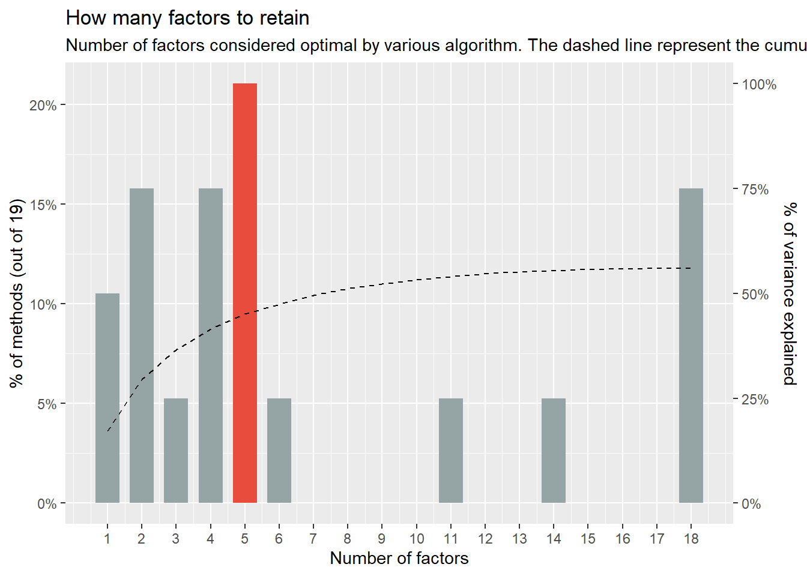{width=672}
:::

```{.r .cell-code}
f <- factor_analysis(df_resprac, n=5, rotation = "oblimin")
plot(f)
```

::: {.cell-output-display}
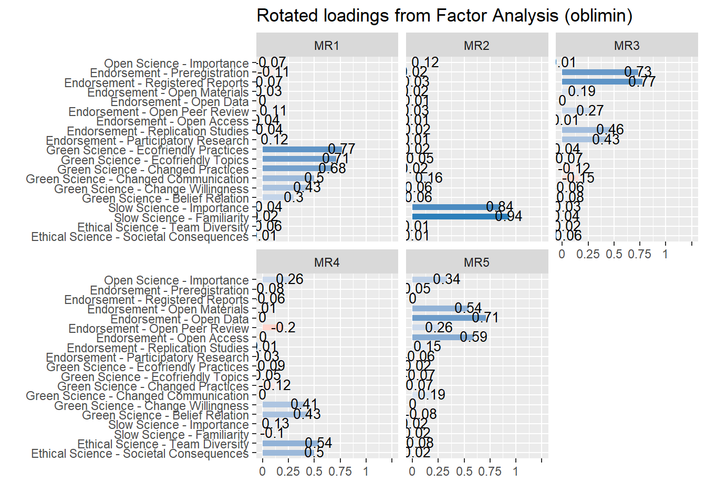{width=672}
:::

```{.r .cell-code}
color_vars_resprac <- c(
  # GS variables (green)
  "Green Science - Ecofriendly Practices"                  = "#4CAF50",
  "Green Science - Ecofriendly Practices" = "#4CAF50",
  "Green Science - Ecofriendly Topics" = "#4CAF50",
  "Green Science - Changed Practices" = "#4CAF50",
  "Green Science - Changed Communication" = "#4CAF50",
  "Green Science - Belief Relation" = "#4CAF50",
  "Green Science - Change Willingness" =  "#4CAF50",
  
  # ES variables (purple)
  "Ethical Science - Team Diversity"        = "#9C27B0",
  "Ethical Science - Societal Consequences" = "#9C27B0",
  
  # OS variables (blue)
  "Endorsement - Open Data"                 = "#2196F3",
  "Endorsement - Open Materials"            = "#2196F3",
  "Endorsement - Open Access"               = "#2196F3",
  "Open Science - Importance"               = "#2196F3",
  
  "Endorsement - Open Peer Review"          = "#3F51B5",
  "Endorsement - Preregistration"           = "#3F51B5",
  "Endorsement - Registered Reports"        = "#3F51B5",
  "Endorsement - Replication Studies"       = "#3F51B5",
  "Endorsement - Participatory Research"    = "#3F51B5",
  
  
  # SS variable (teal)
  "Slow Science - Importance"               = "#FF9800",
  "Slow Science - Familiarity"              = "#FF9800"
  
  
)

# Each factor is named after its marker item (psych's MR numbering changes with the data)
efa_markers <- c("Green Science" = "Green Science - Ecofriendly Practices",
                 "Ethical\nScience" = "Ethical Science - Team Diversity",
                 "Open\nScience" = "Endorsement - Open Data",
                 "Rigorous\nScience" = "Endorsement - Registered Reports",
                 "Slow Science" = "Slow Science - Familiarity")
efa_loadings <- as.data.frame(f) |> select(Variable, starts_with("MR"))
efa_ids <- sapply(efa_markers, \(v) {
  l <- unlist(efa_loadings[efa_loadings$Variable == v, -1])
  names(l)[which.max(abs(l))]
})
stopifnot(!anyDuplicated(efa_ids))  # One marker per factor

p_resprac <- plot_graph(f, threshold = 0.2, arrow_end_gap = 0.12, expand = c(1, 0.5),
                        names_factors = as.list(efa_ids),
                        color_factors = setNames(c("#4CAF50", "#9C27B0", "#2196F3", "#3F51B5", "#FF9800"), efa_ids),
                        color_variables = color_vars_resprac)
p_resprac
```

::: {.cell-output-display}
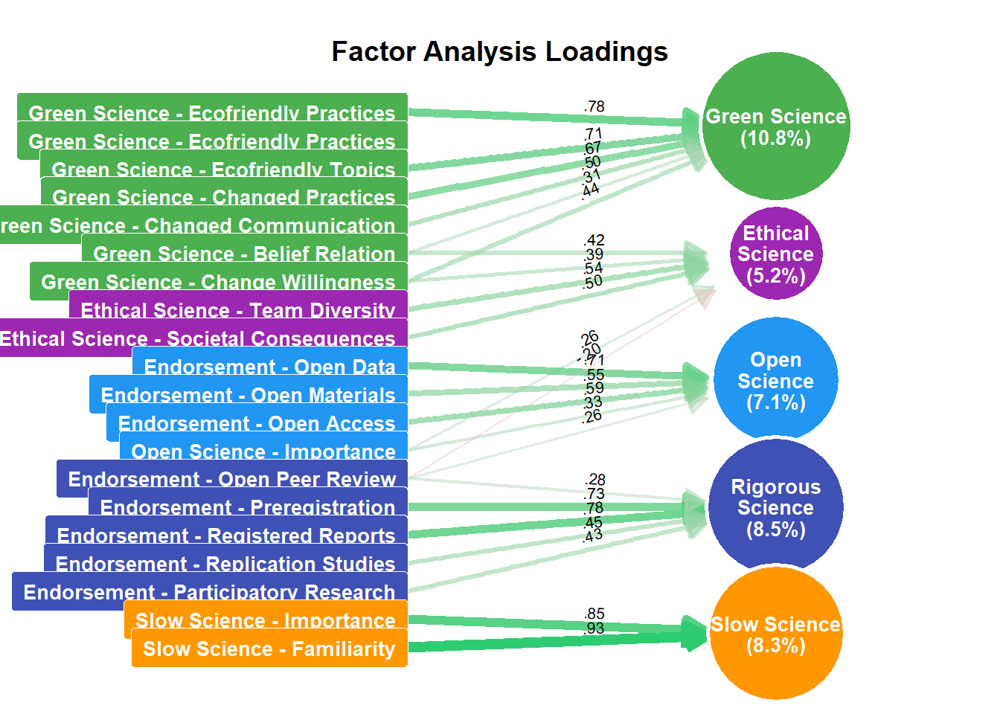{width=672}
:::
:::


::: {.cell}
::: {.cell-output-display}
::: {.callout-note collapse="true" title="EFA of research values (Markdown table, for text readers)"}

Table: Number of factors: agreement between methods

| n_Factors| n_Methods| Variance_Cumulative|
|---------:|---------:|-------------------:|
| 2| 3| 0.32|
| 3| 2| 0.39|
| 4| 3| 0.44|
| 5| 5| 0.48|
| 6| 1| 0.50|
| 9| 1| 0.54|
| 13| 1| 0.57|
| 18| 3| 0.58|

Table: Loadings

|Variable | Green Science| Rigorous Science| Slow Science| Open Science| Ethical Science| Complexity| Uniqueness|
|:---------------------------------------|-------------:|----------------:|------------:|------------:|---------------:|----------:|----------:|
|Open Science - Importance | -0.07| 0.01| 0.13| 0.33| 0.26| 2.33| 0.79|
|Endorsement - Preregistration | -0.10| 0.73| 0.02| 0.05| 0.07| 1.07| 0.39|
|Endorsement - Registered Reports | 0.06| 0.78| 0.03| 0.01| -0.06| 1.03| 0.40|
|Endorsement - Open Materials | -0.03| 0.19| 0.02| 0.55| 0.01| 1.24| 0.58|
|Endorsement - Open Data | 0.00| 0.00| -0.01| 0.71| 0.00| 1.00| 0.50|
|Endorsement - Open Peer Review | 0.10| 0.28| 0.04| 0.26| -0.20| 3.17| 0.77|
|Endorsement - Open Access | 0.04| -0.01| -0.01| 0.59| 0.00| 1.01| 0.65|
|Endorsement - Replication Studies | -0.04| 0.45| -0.02| 0.15| 0.01| 1.25| 0.72|
|Endorsement - Participatory Research | 0.12| 0.43| 0.00| -0.06| 0.03| 1.21| 0.82|
|Green Science - Ecofriendly Practices | 0.78| 0.04| -0.02| -0.02| 0.08| 1.03| 0.35|
|Green Science - Ecofriendly Topics | 0.71| 0.07| -0.05| -0.06| 0.04| 1.06| 0.49|
|Green Science - Changed Practices | 0.67| -0.12| 0.02| 0.07| -0.12| 1.15| 0.56|
|Green Science - Changed Communication | 0.50| -0.15| 0.17| 0.18| -0.01| 1.73| 0.62|
|Green Science - Change Willingness | 0.44| -0.05| 0.07| 0.00| 0.39| 2.06| 0.48|
|Green Science - Belief Relation | 0.31| 0.09| 0.06| -0.08| 0.42| 2.09| 0.59|
|Slow Science - Importance | -0.04| -0.02| 0.85| 0.02| 0.13| 1.05| 0.25|
|Slow Science - Familiarity | 0.02| 0.04| 0.93| -0.02| -0.10| 1.03| 0.14|
|Ethical Science - Team Diversity | 0.07| -0.03| -0.02| 0.08| 0.54| 1.09| 0.67|
|Ethical Science - Societal Consequences | 0.01| 0.06| -0.01| -0.01| 0.50| 1.03| 0.74|

Table: Explained variance

|Parameter | Green Science| Rigorous Science| Slow Science| Open Science| Ethical Science|
|:-------------------|-------------:|----------------:|------------:|------------:|---------------:|
|Eigenvalues | 3.16| 2.69| 1.22| 0.86| 0.56|
|Variance | 0.12| 0.09| 0.09| 0.08| 0.06|
|Variance_Cumulative | 0.12| 0.22| 0.31| 0.39| 0.45|
|Variance_Proportion | 0.27| 0.21| 0.20| 0.18| 0.14|

Table: Factor correlations

|Factor | Green Science| Rigorous Science| Slow Science| Open Science| Ethical Science|
|:----------------|-------------:|----------------:|------------:|------------:|---------------:|
|Green Science | 1.00| -0.13| 0.16| 0.04| 0.42|
|Rigorous Science | -0.13| 1.00| 0.18| 0.36| 0.06|
|Slow Science | 0.16| 0.18| 1.00| 0.30| 0.14|
|Open Science | 0.04| 0.36| 0.30| 1.00| 0.00|
|Ethical Science | 0.42| 0.06| 0.14| 0.00| 1.00|

:::

:::
:::


### CFA


::: {.cell}

```{.r .cell-code}
# Raw-name to display-name mapping (matches df_resprac rename calls)
cfa_labels <- c(
  "Open_Science"                  = "Open\nScience",
  "Rigorous_Science"              = "Rigorous\nScience",
  "Green_Science"                 = "Green\nScience",
  "Slow_Science"                  = "Slow\nScience",
  "Ethical_Science"               = "Ethical\nScience",
  "OS_Importance"                 = "OS\nImportance",
  "OS_Open_Data"                  = "Open\nData",
  "OS_Open_Materials"             = "Open\nMaterials",
  "OS_Open_Access_Publication"    = "Open\nAccess",
  "OS_Open_Peer_Review"           = "Open\nPeer Review",
  "OS_Study_Preregistration"      = "Prereg.",
  "OS_Registered_Reports"         = "Reg.\nReports",
  "OS_Replication_Studies"        = "Replication\nStudies",
  "OS_Participatory_Research"     = "Participatory\nResearch",
  "GS_Importance_conducting"       = "Importance\n(Conducting)",
  "GS_Importance_topic"            = "Importance\n(Topic)",
  "GS_Changes_practices"           = "Changed\nPractices",
  "GS_Changes_communication_practices" = "Changed\nCommunication",
  "GS_Relation_Research_Sustainability" = "Belief\nin Link",
  "GS_Change_practices_agreeing"  = "Change\nWillingness",
  "SS_Importance"                 = "SS\nImportance",
  "SS_Familiar"                   = "SS\nFamiliarity",
  "ES_Importance_research_team"   = "Team\nDiversity",
  "ES_Consequences_society"       = "Societal\nConseq."
)

cfa_node_colors <- c(
  "Open_Science"               = "#2196F3",
  "Rigorous_Science"           = "#3F51B5",
  "Green_Science"              = "#4CAF50",
  "Slow_Science"               = "#FF9800",
  "Ethical_Science"            = "#9C27B0",
  "OS_Importance"              = "#2196F3",
  "OS_Open_Data"               = "#2196F3",
  "OS_Open_Materials"          = "#2196F3",
  "OS_Open_Access_Publication" = "#2196F3",
  "OS_Open_Peer_Review"        = "#3F51B5",
  "OS_Study_Preregistration"   = "#3F51B5",
  "OS_Registered_Reports"      = "#3F51B5",
  "OS_Replication_Studies"     = "#3F51B5",
  "OS_Participatory_Research"  = "#3F51B5",
  "GS_Importance_conducting"   = "#4CAF50",
  "GS_Importance_topic"        = "#4CAF50",
  "GS_Changes_practices"       = "#4CAF50",
  "GS_Changes_communication_practices" = "#4CAF50",
  "GS_Relation_Research_Sustainability" = "#4CAF50",
  "GS_Change_practices_agreeing" = "#4CAF50",
  "SS_Importance"              = "#FF9800",
  "SS_Familiar"                = "#FF9800",
  "ES_Importance_research_team"= "#9C27B0",
  "ES_Consequences_society"    = "#9C27B0"
)

# Manual CFA model using raw df column names
cfa_model <- "
  Open_Science     =~ OS_Importance +
                      OS_Open_Data +
                      OS_Open_Materials +
                      OS_Open_Access_Publication 
  Rigorous_Science =~ OS_Study_Preregistration +
                      OS_Registered_Reports +
                      OS_Replication_Studies +
                      OS_Participatory_Research +
                      OS_Open_Peer_Review
  Green_Science    =~ GS_Importance_conducting +
                      GS_Importance_topic +
                      GS_Changes_practices +
                      GS_Changes_communication_practices +
                      GS_Relation_Research_Sustainability +
                      GS_Change_practices_agreeing
  Slow_Science     =~ SS_Importance +
                      SS_Familiar
  Ethical_Science  =~ ES_Importance_research_team +
                      ES_Consequences_society
"

library(lavaan)
```

::: {.cell-output .cell-output-stderr}

```
This is lavaan 0.6-21
lavaan is FREE software! Please report any bugs.
```


:::

```{.r .cell-code}
library(tidySEM)
```

::: {.cell-output .cell-output-stderr}

```

Attaching package: 'tidySEM'
```


:::

::: {.cell-output .cell-output-stderr}

```
The following objects are masked from 'package:ggraph':

    get_edges, get_nodes
```


:::

::: {.cell-output .cell-output-stderr}

```
The following object is masked from 'package:report':

    report
```


:::

::: {.cell-output .cell-output-stderr}

```
The following object is masked from 'package:insight':

    get_data
```


:::

```{.r .cell-code}
fit_cfa <- cfa(cfa_model, data = df, std.lv = TRUE)

# modificationIndices(fit_cfa, standardized = TRUE, sort = TRUE) |>
#   dplyr::filter(mi > 10) |>
#   dplyr::arrange(desc(mi))

model_parameters(fit_cfa, standardize = TRUE) 
```

::: {.cell-output .cell-output-stdout}

```
# Loading

Link                                                 | Coefficient |   SE
-------------------------------------------------------------------------
Open_Science =~ OS_Importance                        |        0.39 | 0.04
Open_Science =~ OS_Open_Data                         |        0.67 | 0.03
Open_Science =~ OS_Open_Materials                    |        0.69 | 0.03
Open_Science =~ OS_Open_Access_Publication           |        0.55 | 0.04
Rigorous_Science =~ OS_Study_Preregistration         |        0.78 | 0.02
Rigorous_Science =~ OS_Registered_Reports            |        0.77 | 0.03
Rigorous_Science =~ OS_Replication_Studies           |        0.53 | 0.03
Rigorous_Science =~ OS_Participatory_Research        |        0.36 | 0.04
Rigorous_Science =~ OS_Open_Peer_Review              |        0.38 | 0.04
Green_Science =~ GS_Importance_conducting            |        0.80 | 0.02
Green_Science =~ GS_Importance_topic                 |        0.71 | 0.02
Green_Science =~ GS_Changes_practices                |        0.58 | 0.03
Green_Science =~ GS_Changes_communication_practices  |        0.54 | 0.03
Green_Science =~ GS_Relation_Research_Sustainability |        0.54 | 0.03
Green_Science =~ GS_Change_practices_agreeing        |        0.68 | 0.03
Slow_Science =~ SS_Importance                        |        0.92 | 0.03
Slow_Science =~ SS_Familiar                          |        0.86 | 0.03
Ethical_Science =~ ES_Importance_research_team       |        0.63 | 0.05
Ethical_Science =~ ES_Consequences_society           |        0.49 | 0.05

Link                                                 |       95% CI |     z |      p
------------------------------------------------------------------------------------
Open_Science =~ OS_Importance                        | [0.32, 0.47] |  9.94 | < .001
Open_Science =~ OS_Open_Data                         | [0.60, 0.73] | 20.79 | < .001
Open_Science =~ OS_Open_Materials                    | [0.62, 0.75] | 21.63 | < .001
Open_Science =~ OS_Open_Access_Publication           | [0.48, 0.62] | 15.55 | < .001
Rigorous_Science =~ OS_Study_Preregistration         | [0.73, 0.82] | 31.16 | < .001
Rigorous_Science =~ OS_Registered_Reports            | [0.72, 0.82] | 30.53 | < .001
Rigorous_Science =~ OS_Replication_Studies           | [0.47, 0.60] | 16.33 | < .001
Rigorous_Science =~ OS_Participatory_Research        | [0.29, 0.44] |  9.47 | < .001
Rigorous_Science =~ OS_Open_Peer_Review              | [0.31, 0.46] | 10.16 | < .001
Green_Science =~ GS_Importance_conducting            | [0.77, 0.84] | 41.07 | < .001
Green_Science =~ GS_Importance_topic                 | [0.66, 0.76] | 29.90 | < .001
Green_Science =~ GS_Changes_practices                | [0.53, 0.64] | 19.99 | < .001
Green_Science =~ GS_Changes_communication_practices  | [0.48, 0.60] | 17.63 | < .001
Green_Science =~ GS_Relation_Research_Sustainability | [0.48, 0.60] | 17.62 | < .001
Green_Science =~ GS_Change_practices_agreeing        | [0.63, 0.73] | 26.95 | < .001
Slow_Science =~ SS_Importance                        | [0.85, 0.98] | 26.34 | < .001
Slow_Science =~ SS_Familiar                          | [0.79, 0.93] | 25.56 | < .001
Ethical_Science =~ ES_Importance_research_team       | [0.52, 0.73] | 11.89 | < .001
Ethical_Science =~ ES_Consequences_society           | [0.39, 0.58] | 10.35 | < .001

# Correlation

Link                                | Coefficient |   SE |         95% CI
-------------------------------------------------------------------------
Open_Science ~~ Rigorous_Science    |        0.53 | 0.04 | [ 0.45,  0.61]
Open_Science ~~ Green_Science       |        0.05 | 0.05 | [-0.04,  0.15]
Open_Science ~~ Slow_Science        |        0.35 | 0.04 | [ 0.26,  0.43]
Open_Science ~~ Ethical_Science     |        0.14 | 0.07 | [ 0.01,  0.27]
Rigorous_Science ~~ Green_Science   |       -0.10 | 0.05 | [-0.19, -0.01]
Rigorous_Science ~~ Slow_Science    |        0.22 | 0.04 | [ 0.13,  0.31]
Rigorous_Science ~~ Ethical_Science |        0.06 | 0.06 | [-0.06,  0.18]
Green_Science ~~ Slow_Science       |        0.21 | 0.04 | [ 0.12,  0.29]
Green_Science ~~ Ethical_Science    |        0.60 | 0.05 | [ 0.49,  0.70]
Slow_Science ~~ Ethical_Science     |        0.18 | 0.06 | [ 0.07,  0.29]

Link                                |     z |      p
----------------------------------------------------
Open_Science ~~ Rigorous_Science    | 12.60 | < .001
Open_Science ~~ Green_Science       |  1.09 | 0.275 
Open_Science ~~ Slow_Science        |  7.77 | < .001
Open_Science ~~ Ethical_Science     |  2.16 | 0.031 
Rigorous_Science ~~ Green_Science   | -2.14 | 0.032 
Rigorous_Science ~~ Slow_Science    |  5.01 | < .001
Rigorous_Science ~~ Ethical_Science |  1.00 | 0.316 
Green_Science ~~ Slow_Science       |  4.79 | < .001
Green_Science ~~ Ethical_Science    | 11.00 | < .001
Slow_Science ~~ Ethical_Science     |  3.17 | 0.002 
```


:::

```{.r .cell-code}
model_performance(fit_cfa)
```

::: {.cell-output .cell-output-stdout}

```
# Indices of model performance

Chi2(142) | p (Chi2) | Baseline(171) | p (Baseline) |   GFI |  AGFI |   NFI
---------------------------------------------------------------------------
526.210   |   < .001 |      3700.932 |       < .001 | 0.917 | 0.889 | 0.858

Chi2(142) |  NNFI |   CFI | RMSEA |      RMSEA  CI | p (RMSEA) |   RMR |  SRMR
------------------------------------------------------------------------------
526.210   | 0.869 | 0.891 | 0.063 | [0.057, 0.069] |    < .001 | 0.005 | 0.057

Chi2(142) |   RFI |  PNFI |   IFI |   RNI | Loglikelihood |    AIC |    BIC | BIC_adjusted
------------------------------------------------------------------------------------------
526.210   | 0.829 | 0.712 | 0.892 | 0.891 |     -1263.120 | 2622.2 | 2839.4 |     2687.035
```


:::

```{.r .cell-code}
# ── Manual ggraph/tidygraph CFA plot ─────────────────────────────────────────

# 1. Node positions (manual x/y grid matching the layout intent)
cfa_pos <- tribble(
  ~name,                        ~x,   ~y,
  # Rigorous Science factor + vars (left, top half)
  "OS_Study_Preregistration",    0,   9,
  "OS_Registered_Reports",       1,   10,
  "OS_Replication_Studies",      2,   10,
  "OS_Participatory_Research",   3,   9,
  "Rigorous_Science",            1,   8,
  "OS_Open_Peer_Review",         3.3,    8,
  # Open Science factor + vars (left, bottom half)
  "Open_Science",                1,    2.5,
  "OS_Open_Materials",           0,    1,
  "OS_Open_Data",                1,    0,
  "OS_Open_Access_Publication",  2,    0,
  "OS_Importance",               3,    1,
  # Slow Science factor + vars (centre)
  "SS_Importance",               6,   10,
  "Slow_Science",                6,    5,
  "SS_Familiar",                 6,    0,
  # Green Science factor + vars (right, top half)
  "Green_Science",              11,    7.5,
  "GS_Importance_conducting",              12,   9,
  "GS_Importance_topic",                  11.5,   10,
  "GS_Change_practices_agreeing",         10.5,   10,
  "GS_Changes_practices",                 9.65,    9.75,
  "GS_Changes_communication_practices",   9,   9,
  "GS_Relation_Research_Sustainability",  8.75,   7.75,
  
  # Ethical Science factor + vars (right, bottom half)
  "Ethical_Science",            11,    2.5,
  "ES_Importance_research_team",10,    0,
  "ES_Consequences_society",    12,    0
)

# 2. Extract edges from lavaan (loadings + significant factor correlations)
cfa_params <- lavaan::parameterEstimates(fit_cfa, standardized = TRUE) |>
  filter(op %in% c("=~", "~~"),
         !(op == "~~" & lhs == rhs),          # drop self-variances
         !(op == "~~" & pvalue >= 0.05)) |>   # drop non-sig correlations
  mutate(est_std = ifelse(is.na(std.all), est, std.all))

# 3. Build tidygraph object
all_nodes <- cfa_pos |>
  mutate(
    fill       = cfa_node_colors[name],
    node_label = cfa_labels[name],
    shape      = ifelse(name %in% c("Open_Science","Rigorous_Science",
                                    "Green_Science","Slow_Science","Ethical_Science"),
                        "factor", "indicator")
  )

edge_df <- cfa_params |>
  transmute(
    from      = lhs,
    to        = rhs,
    op        = op,
    est_std   = est_std,
    edge_col  = ifelse(op == "~~", "#4CAF50", "grey50"),
    edge_lwd  = ifelse(op == "~~", abs(est_std) * 3, 0.6),
    edge_type = ifelse(op == "~~", "dashed", "solid"),
    edge_label = sub("^0\\.", ".", sub("^-0\\.", "-.", sprintf("%.2f", est_std)))
  )

g_tidy <- tbl_graph(nodes = all_nodes, edges = edge_df, directed = TRUE,
                    node_key = "name")

# 4. Plot
p_cfa <- ggraph(g_tidy, layout = "manual", x = x, y = y) +
  # Loading arrows (=~)
  geom_edge_link(
    aes(filter = op == "=~", label = edge_label, edge_colour = edge_col, edge_width = edge_lwd),
    arrow = arrow(length = unit(2.5, "mm"), type = "closed"),
    label_size = 2.5, label_colour = "grey30", angle_calc = "along", label_dodge = unit(2, "mm"),
    end_cap = circle(5, "mm"),
    show.legend = FALSE
  ) +
  # Factor-correlation arcs (~~)
  geom_edge_bend(
    aes(filter = op == "~~", edge_colour = edge_col, edge_width = edge_lwd, label = edge_label),
    strength = 0.3,
    # arrow = arrow(length = unit(2.5, "mm"), ends = "both", type = "open"),
    label_size = 2.5, label_colour = "grey30", angle_calc = "along", label_dodge = unit(2.5, "mm"),
    show.legend = FALSE
  ) +
  scale_edge_colour_identity() +
  scale_edge_width_continuous(range = c(0.6, 2.5)) +
  # Indicator nodes (rectangles → points with shape 22)
  geom_node_point(
    aes(filter = shape == "indicator", fill = fill),
    shape = 22, size = 12, colour = "white", show.legend = FALSE, stroke = NA
  ) +
  # Factor nodes (circles)
  geom_node_point(
    aes(filter = shape == "factor", fill = fill),
    shape = 21, size = 30, show.legend = FALSE, stroke = NA
  ) +
  scale_fill_identity() +
  geom_node_text(aes(filter = shape == "factor", label = node_label), size = 3, lineheight = 0.85, color = "white", fontface = "bold") +
  geom_node_text(aes(filter = shape == "indicator", label = node_label), size = 2.8, lineheight = 0.85) +
  labs(title = "Structural Model") +
  theme_void() +
  theme(plot.title = element_text(size = 14, face = "bold", hjust = 0.5))

p_cfa
```

::: {.cell-output-display}
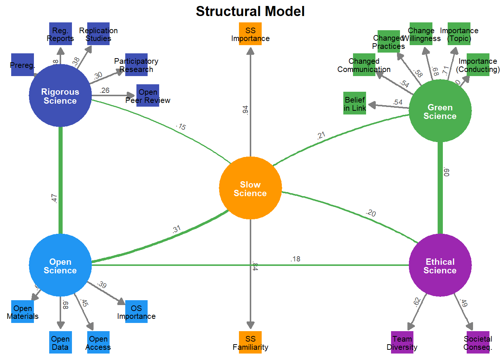{width=672}
:::
:::


::: {.cell}

```{.r .cell-code}
# The EFA puts two green items (link between research and sustainability,
# willingness to change) on the Ethical factor rather than the Green one: the
# model used above assigns them to Green (their movement); these alternatives
# move them to Ethical, or let them load on both (as in the EFA)
green_core <- "GS_Importance_conducting + GS_Importance_topic + GS_Changes_practices + GS_Changes_communication_practices"
green_beliefs <- "GS_Relation_Research_Sustainability + GS_Change_practices_agreeing"
# The Open, Rigorous and Slow factors of cfa_model (each factor's definition runs to the next one)
cfa_common <- str_extract_all(cfa_model, "(?s)(Open|Rigorous|Slow)_Science\\s*=~.*?(?=\\n\\s*\\w+_Science\\s*=~|\\s*$)")[[1]] |>
  paste(collapse = "\n") |>
  paste0("\n")
cfa_models <- list(
  "Movement-based (used)" = cfa_model,
  "Green beliefs on Ethical" = paste0(cfa_common, "Green_Science =~ ", green_core, "\n",
                       "Ethical_Science =~ ES_Importance_research_team + ES_Consequences_society + ", green_beliefs),
  "Cross-loadings" = paste0(cfa_common, "Green_Science =~ ", green_core, " + ", green_beliefs, "\n",
                            "Ethical_Science =~ ES_Importance_research_team + ES_Consequences_society + ", green_beliefs)
)
cfa_comparison <- imap_dfr(cfa_models, \(model, name) {
  fit <- cfa(model, data = df, std.lv = TRUE)
  tibble(Model = name, r_Green_Ethical = lavInspect(fit, "cor.lv")["Green_Science", "Ethical_Science"],
         !!!as.list(unclass(fitMeasures(fit, c("cfi", "tli", "rmsea", "srmr", "aic", "bic")))))
})
knitr::kable(cfa_comparison, format = "pipe", digits = 3, caption = "Alternative CFA specifications")
```

::: {.cell-output-display}


Table: Alternative CFA specifications

|Model                    | r_Green_Ethical|   cfi|   tli| rmsea|  srmr|      aic|      bic|
|:------------------------|---------------:|-----:|-----:|-----:|-----:|--------:|--------:|
|Movement-based (used)    |           0.595| 0.891| 0.869| 0.063| 0.057| 2622.239| 2839.441|
|Green beliefs on Ethical |           0.752| 0.912| 0.894| 0.057| 0.056| 2549.192| 2766.394|
|Cross-loadings           |           0.523| 0.919| 0.901| 0.055| 0.053| 2525.190| 2751.442|


:::
:::


### Clustering


::: {.cell}

```{.r .cell-code}
df_resprac_fac <- as.data.frame(predict(fit_cfa))

rez_nclust <- n_clusters(df_resprac_fac, package = c("NbClust"))
plot(rez_nclust)
```

::: {.cell-output-display}
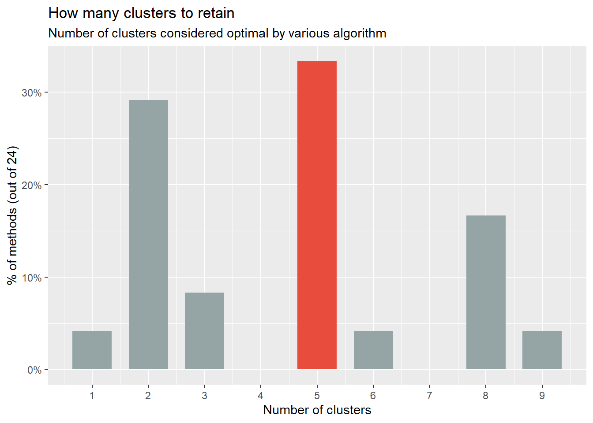{width=672}
:::

```{.r .cell-code}
rez <- cluster_analysis(df_resprac_fac, n=5, method="hkmeans")
plot(rez)
```

::: {.cell-output-display}
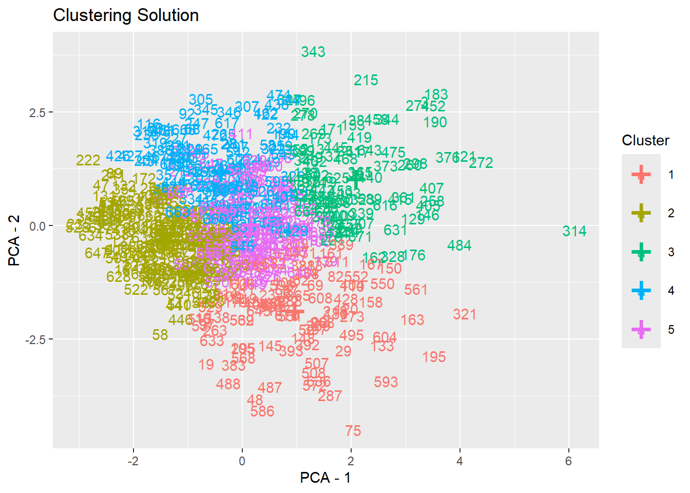{width=672}
:::

```{.r .cell-code}
rez
```

::: {.cell-output .cell-output-stdout}

```
# Clustering Solution

The 5 clusters accounted for 57.24% of the total variance of the original data.

Cluster | n_Obs | Sum_Squares | Open_Science | Rigorous_Science | Green_Science
-------------------------------------------------------------------------------
1       |   193 |      290.53 |         0.69 |             0.82 |          0.19
2       |   170 |      303.97 |         0.14 |             0.19 |          0.09
3       |   130 |      275.73 |        -0.05 |            -0.78 |          0.89
4       |    92 |      284.41 |         0.22 |             0.42 |         -1.53
5       |    97 |      301.29 |        -1.74 |            -1.33 |         -0.26

Cluster | Slow_Science | Ethical_Science
----------------------------------------
1       |         0.93 |            0.44
2       |        -0.95 |            0.26
3       |         0.68 |            0.57
4       |        -0.27 |           -1.61
5       |        -0.84 |           -0.56

# Indices of model performance

Sum_Squares_Total | Sum_Squares_Between | Sum_Squares_Within |    R2
--------------------------------------------------------------------
3405              |            1949.071 |           1455.929 | 0.572

# You can access the predicted clusters via `predict()`.
```


:::

```{.r .cell-code}
# Cluster numbers (and so hand-given names) change with the sample: profiles are
# lettered by size and labelled by the factors on which their mean is above (+)
# or below (-) 0.3 SD
profile_labels <- df_resprac_fac |>
  mutate(Cluster = predict(rez)) |>
  summarise(across(everything(), mean), n = n(), .by = Cluster) |>
  arrange(desc(n)) |>
  pivot_longer(-c(Cluster, n), names_to = "Factor", values_to = "Mean") |>
  mutate(Factor = str_remove(Factor, "_Science"),
         Sign = case_when(Mean > 0.3 ~ "+", Mean < -0.3 ~ "-", .default = NA)) |>
  summarise(Pattern = paste0(Sign[!is.na(Sign)], Factor[!is.na(Sign)], collapse = " "), .by = c(Cluster, n)) |>
  mutate(Label = paste0("Profile ", LETTERS[row_number()], "\n", ifelse(Pattern == "", "Average", Pattern)))
df_resprac_fac$Profile <- profile_labels$Label[match(predict(rez), profile_labels$Cluster)]
```
:::


::: {.cell}
::: {.cell-output-display}
::: {.callout-note collapse="true" title="Number of clusters: agreement between methods (Markdown table, for text readers)"}

| n_Clusters| n_Methods|
|----------:|---------:|
| 1| 1|
| 2| 6|
| 3| 7|
| 4| 1|
| 6| 4|
| 8| 1|
| 9| 2|
| 10| 2|

:::

:::
:::


::: {.cell}

```{.r .cell-code}
# cluster_vars <- names(as.data.frame(predict(fit_cfa)))
cluster_vars <- c("Rigorous_Science", "Open_Science", "Slow_Science", "Green_Science", "Ethical_Science")
labels <- tibble(Variable = cluster_vars, label = str_replace(cluster_vars, "_", "\n")) 


n_vars  <- length(cluster_vars)
angles  <- seq(0, 2 * pi, length.out = n_vars + 1)[seq_len(n_vars)]

# Cluster means, normalised to [0,1] using full-data range per variable
var_mins <- sapply(cluster_vars, \(v) min(df_resprac_fac[[v]], na.rm = TRUE))
var_maxs <- sapply(cluster_vars, \(v) max(df_resprac_fac[[v]], na.rm = TRUE))

radar_means <- df_resprac_fac |>
  group_by(Profile) |>
  summarise(across(all_of(cluster_vars), \(x) mean(x, na.rm = TRUE)), .groups = "drop")

for (v in cluster_vars) {
  radar_means[[v]] <- (radar_means[[v]] - var_mins[v]) / (var_maxs[v] - var_mins[v])
}

# Long format with (x, y) cartesian coords
radar_long <- radar_means |>
  pivot_longer(-Profile, names_to = "Variable", values_to = "r") |>
  left_join(tibble(Variable = cluster_vars, angle = angles), by = "Variable") |>
  mutate(x = r * sin(angle), y = r * cos(angle))

# Close each polygon by appending the first point again
radar_closed <- radar_long |>
  group_by(Profile) |>
  group_modify(\(d, .y) bind_rows(d, d[1, ])) |>
  ungroup()

# Background grid (concentric circles + spokes)
grid_circles <- expand.grid(r = c(.25, .5, .75, 1), theta = seq(0, 2 * pi, length.out = 200)) |>
  mutate(x = r * sin(theta), y = r * cos(theta), r = factor(r))

spokes <- tibble(Variable = cluster_vars, angle = angles) |>
  mutate(x1 = sin(angle), y1 = cos(angle))

# Use left_join instead of named-vector indexing to avoid NA from tibble column lookup
axis_labels <- spokes |>
  left_join(labels, by = "Variable") |>
  mutate(lx = 1.25 * sin(angle), ly = 1.25 * cos(angle))  

# Profile counts and percentages for annotation
profile_counts <- df_resprac_fac |>
  count(Profile) |>
  mutate(pct   = n / sum(n) * 100,
         label = paste0("N = ", n, " (", round(pct), "%)"))

all_profiles <- unique(radar_closed$Profile)

# Retrieve the Set1 colours for profile labelling
set1_cols <- RColorBrewer::brewer.pal(max(3, length(all_profiles)), "Set1")[seq_along(all_profiles)]
profile_col_map <- setNames(set1_cols, all_profiles)

# Build one radar panel per profile using facet_wrap on a "Facet" column
# Each panel: all profiles with their own colour; focal = bold+filled, others = thin+faint
radar_closed_facets <- purrr::map_dfr(all_profiles, \(focal) {
  radar_closed |>
    mutate(Facet     = focal,
           is_focal  = Profile == focal,
           lwd       = ifelse(is_focal, 1.2, 0.3),
           line_col  = profile_col_map[Profile],
           fill_col  = ifelse(is_focal, profile_col_map[Profile], NA_character_),
           poly_alpha = ifelse(is_focal, 0.18, 0.0))
})

radar_long_facets <- purrr::map_dfr(all_profiles, \(focal) {
  radar_long |>
    mutate(Facet    = focal,
           is_focal = Profile == focal,
           pt_col   = profile_col_map[Profile],
           pt_size  = ifelse(is_focal, 2.5, 0.8))
})

# Annotation label placed at centre-bottom of each facet
label_df <- profile_counts |>
  left_join(tibble(Profile = all_profiles, col = set1_cols), by = "Profile") |>
  rename(Facet = Profile)

p_radar <- ggplot() +
  # Grid circles
  geom_path(data = mutate(grid_circles, Facet = list(all_profiles)) |> tidyr::unnest(Facet),
            aes(x = x, y = y, group = r),
            colour = "grey88", linewidth = 0.25) +
  # Spokes
  geom_segment(data = mutate(spokes, Facet = list(all_profiles)) |> tidyr::unnest(Facet),
               aes(x = 0, y = 0, xend = x1, yend = y1),
               colour = "grey80", linewidth = 0.3) +
  # Axis labels
  geom_text(data = mutate(axis_labels, Facet = list(all_profiles)) |> tidyr::unnest(Facet),
            aes(x = lx, y = ly, label = label),
            size = 2.5, lineheight = 0.85, fontface = "bold", colour = "grey30") +
  # Background profiles (thin, own colour, no fill)
  geom_polygon(data = filter(radar_closed_facets, !is_focal),
               aes(x = x, y = y, group = Profile, colour = line_col),
               fill = NA, linewidth = 0.3, alpha = 0.5, show.legend = FALSE) +
  # Focal profile (coloured, filled)
  geom_polygon(data = filter(radar_closed_facets, is_focal),
               aes(x = x, y = y, group = Profile, colour = line_col, fill = fill_col),
               alpha = 0.18, linewidth = 1.2, show.legend = FALSE) +
  # Points — background
  geom_point(data = filter(radar_long_facets, !is_focal),
             aes(x = x, y = y, colour = pt_col), size = 0.8, alpha = 0.5, show.legend = FALSE) +
  # Points — focal
  geom_point(data = filter(radar_long_facets, is_focal),
             aes(x = x, y = y, colour = pt_col), size = 2.5, show.legend = FALSE) +
  # N (%) label per facet
  geom_text(data = label_df,
            aes(x = 0, y = -1.5, label = label, colour = col),
            size = 3, fontface = "bold", show.legend = FALSE) +
  scale_colour_identity() +
  scale_x_continuous(expand = expansion(mult = 0.15)) +
  scale_fill_identity() +
  facet_wrap(~Facet, ncol = 5) +
  # coord_equal(xlim = c(-1.75, 1.75), ylim = c(-1.75, 1.75)) +
  theme_void() +
  theme(plot.margin = margin(10, 10, 10, 10),
        plot.title  = element_text(size = 14, face = "bold", hjust = 0.5),
        strip.text  = element_text(face = "bold", size = 9, colour = "grey20")) +
  labs(title = "Researcher Profiles")

p_radar
```

::: {.cell-output-display}
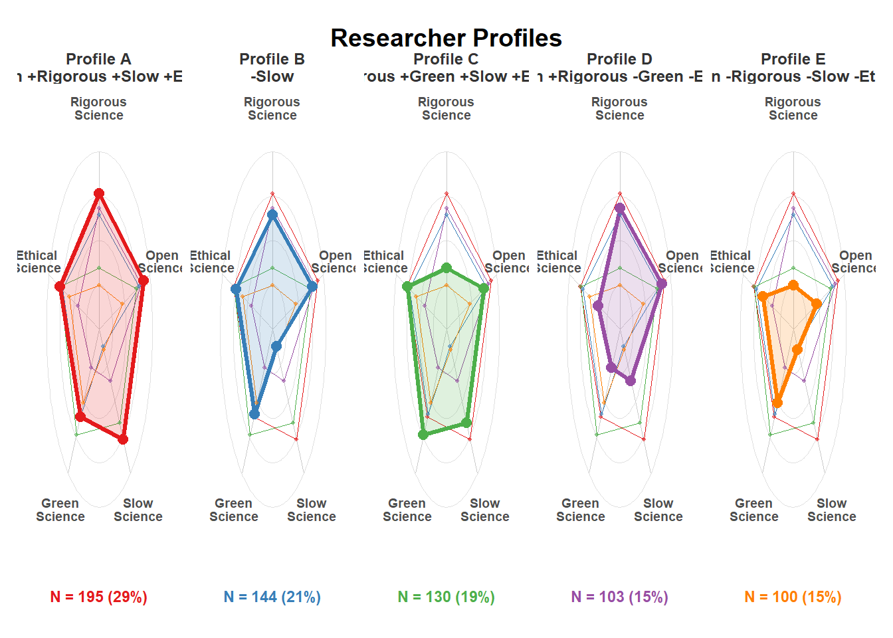{width=672}
:::
:::


::: {.cell}
::: {.cell-output-display}
::: {.callout-note collapse="true" title="Researcher profiles (Markdown table, for text readers)"}

Table: Mean CFA factor score per profile

|Profile | N|Percentage | Rigorous_Science| Open_Science| Slow_Science| Green_Science| Ethical_Science|
|:-----------------------------------------|---:|:----------|----------------:|------------:|------------:|-------------:|---------------:|
|Profile A +Open +Rigorous +Slow +Ethical | 193|28.30% | 0.74| 0.59| 0.88| 0.17| 0.34|
|Profile B -Slow | 170|24.93% | 0.17| 0.12| -0.90| 0.08| 0.20|
|Profile C -Rigorous +Green +Slow +Ethical | 130|19.06% | -0.70| -0.05| 0.64| 0.81| 0.43|
|Profile D -Open -Rigorous -Slow -Ethical | 97|14.22% | -1.19| -1.49| -0.79| -0.24| -0.43|
|Profile E +Rigorous -Green -Ethical | 92|13.49% | 0.37| 0.19| -0.26| -1.41| -1.24|

:::

:::
:::


#### Stability


::: {.cell}

```{.r .cell-code}
# Bootstrap: cluster resampled respondents, assign everyone to the nearest
# resampled centroid, and compare with the full-sample solution (adjusted Rand
# index; 1 = same partition)
cluster_data <- select(df_resprac_fac, -Profile)
z <- as.matrix(standardize(cluster_data))  # The space cluster_analysis() clusters in
nearest <- \(x, centers) apply(x, 1, \(r) which.min(colSums((t(centers) - r)^2)))

set.seed(123)
cluster_stability <- map_dfr(2:6, \(k) {
  full <- predict(cluster_analysis(cluster_data, n = k, method = "hkmeans"))
  ari <- replicate(100, {
    boot <- factoextra::hkmeans(z[sample(nrow(z), replace = TRUE), ], k, hc.method = "complete", iter.max = 100)
    mclust::adjustedRandIndex(full, nearest(z, boot$centers))
  })
  tibble(Clusters = k, `Median ARI` = median(ari), `2.5%` = quantile(ari, 0.025), `97.5%` = quantile(ari, 0.975))
})
knitr::kable(cluster_stability, format = "pipe", digits = 2,
             caption = "Bootstrap stability of the hkmeans solutions (100 resamples each)")
```

::: {.cell-output-display}


Table: Bootstrap stability of the hkmeans solutions (100 resamples each)

| Clusters| Median ARI| 2.5%| 97.5%|
|--------:|----------:|----:|-----:|
|        2|       0.85| 0.52|  0.99|
|        3|       0.85| 0.65|  0.95|
|        4|       0.54| 0.26|  0.86|
|        5|       0.56| 0.30|  0.89|
|        6|       0.55| 0.37|  0.88|


:::
:::


### Predictors


::: {.cell}

```{.r .cell-code}
data <- cbind(df, df_resprac_fac)

# Fitted with MCMC on the cluster (model "Profile" in server/models.R): this chunk
# writes its data; `./hpc push && ./hpc fit Profile`, then `./hpc pull`, in
# analysis/server/ bring back the fit
data_profile <- data |>
  mutate(Dem_Age = ifelse(is.na(Dem_Age), mean(df$Dem_Age, na.rm = TRUE), Dem_Age)) |>
  filter(Dem_Gender %in% c("Female", "Male"), Dem_Age <= 65) |>
  select(Profile, Dem_Age, Dem_Gender)
dir.create("models", showWarnings = FALSE)
write.csv(data_profile, "models/data_Profile.csv", row.names = FALSE)

m <- if (file.exists("models/Profile.rds")) readRDS("models/Profile.rds")
if (!is.null(m)) attr(m$data, "data_name") <- NULL  # Else insight takes this notebook's `data` for the fit's
as_compared <- \(d) mutate(as.data.frame(d)[names(data_profile)], across(!Dem_Age, as.character))
if (!is.null(m) && !isTRUE(all.equal(as_compared(m$data), as_compared(data_profile), check.attributes = FALSE))) {
  m <- NULL  # Fitted on other data
}

if (is.null(m)) {
  knitr::asis_output("**Profile model pending**: not fitted on the current data.")
} else {
p_archetypes_pred1 <- estimate_relation(m, length = 40) |>
  ggplot(aes(x = Dem_Age, y = Predicted)) +
  geom_ribbon(aes(ymin = CI_low, ymax = CI_high, fill=Response,
                  group = interaction(Dem_Gender, Response)), alpha = 0.1) +
  geom_line(aes(color=Response, linetype = Dem_Gender), linewidth = 1) +
  scale_y_continuous(labels = scales::percent_format()) +
  scale_linetype_manual(values = c("longdash", "solid")) +
  scale_colour_brewer(palette = "Set1") +
  scale_fill_brewer(palette = "Set1") +
  guides(linetype = guide_legend(override.aes = list(linewidth = 0.3))) +
  labs(y = "Probability of Belonging to Each Profile", x = "Age",
       fill = "Profile", color = "Profile", linetype = "Gender",
       title = "Proportion of Profiles as a function of Gender and Age") +
  theme_minimal() +
  theme(plot.title = element_text(size = 16, face = "bold", hjust = 0.5)) +
  facet_wrap(~Response)
p_archetypes_pred1
}
```

::: {.cell-output-display}
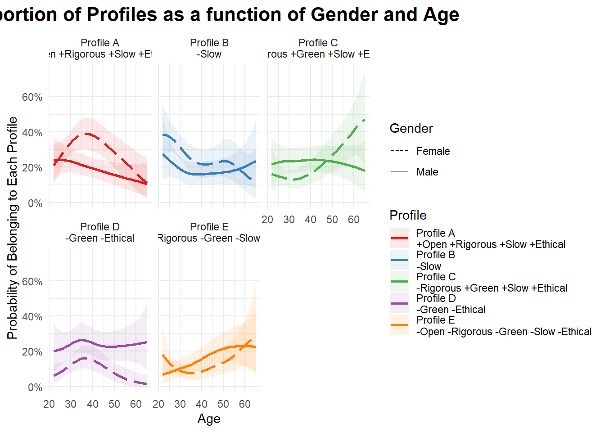{width=672}
:::
:::


::: {.cell}
::: {.cell-output-display}
::: {.callout-note collapse="true" title="Profiles by gender and age (Markdown table, for text readers)"}

Table: MCMC diagnostics

| Chains| Draws| Divergent|Max Rhat | Min ESS|
|------:|-----:|---------:|:--------|-------:|
| 4| 4000| 1|1.005 | 1085|

Table: Predicted probability (Median [95% CI])

|Profile |Dem_Gender |Dem_Age = 25 |Dem_Age = 35 |Dem_Age = 45 |Dem_Age = 55 |Dem_Age = 65 |
|:-----------------------------------------|:----------|:-----------------|:-----------------|:-----------------|:-----------------|:-----------------|
|Profile A +Open +Rigorous +Slow +Ethical |Female |0.28 [0.20, 0.37] |0.39 [0.31, 0.48] |0.34 [0.26, 0.43] |0.26 [0.16, 0.36] |0.16 [0.05, 0.33] |
|Profile A +Open +Rigorous +Slow +Ethical |Male |0.27 [0.18, 0.37] |0.24 [0.18, 0.30] |0.20 [0.15, 0.27] |0.17 [0.10, 0.25] |0.14 [0.05, 0.26] |
|Profile B -Slow |Female |0.39 [0.31, 0.49] |0.25 [0.17, 0.33] |0.20 [0.13, 0.29] |0.19 [0.10, 0.30] |0.13 [0.03, 0.33] |
|Profile B -Slow |Male |0.23 [0.14, 0.33] |0.20 [0.13, 0.27] |0.20 [0.14, 0.29] |0.17 [0.09, 0.27] |0.17 [0.05, 0.36] |
|Profile C -Rigorous +Green +Slow +Ethical |Female |0.11 [0.06, 0.17] |0.14 [0.09, 0.20] |0.23 [0.15, 0.32] |0.34 [0.23, 0.46] |0.40 [0.17, 0.67] |
|Profile C -Rigorous +Green +Slow +Ethical |Male |0.21 [0.12, 0.30] |0.22 [0.15, 0.28] |0.23 [0.16, 0.31] |0.23 [0.14, 0.33] |0.23 [0.09, 0.42] |
|Profile D -Open -Rigorous -Slow -Ethical |Female |0.17 [0.10, 0.24] |0.10 [0.06, 0.16] |0.13 [0.07, 0.22] |0.19 [0.11, 0.31] |0.29 [0.09, 0.58] |
|Profile D -Open -Rigorous -Slow -Ethical |Male |0.11 [0.05, 0.19] |0.11 [0.07, 0.17] |0.14 [0.09, 0.21] |0.17 [0.09, 0.27] |0.16 [0.05, 0.34] |
|Profile E +Rigorous -Green -Ethical |Female |0.05 [0.02, 0.10] |0.11 [0.07, 0.18] |0.09 [0.04, 0.16] |0.03 [0.00, 0.07] |0.01 [0.00, 0.05] |
|Profile E +Rigorous -Green -Ethical |Male |0.19 [0.11, 0.29] |0.23 [0.16, 0.31] |0.22 [0.14, 0.30] |0.27 [0.17, 0.38] |0.31 [0.13, 0.52] |

:::

:::
:::


#### Age and Gender


::: {.cell}

```{.r .cell-code}
# `at`: values of the continuous predictor for the Markdown tables (summarize_model())
run_models <- function(dat = data, f = "~ Dem_Gender * poly(Dem_Age, 2)", means="Dem_Gender",
                       at = "Dem_Age=c(25, 35, 45, 55, 65)") {
  models <- list()
  pred <- data.frame()
  mmeans <- data.frame()
  tables <- list()
  for(outcome in c("Open_Science", "Rigorous_Science", "Green_Science", "Slow_Science", "Ethical_Science")) {
    m_f <- brms::bf(as.formula(paste0(outcome, f)))
    dat_m <- drop_na(dat, all_of(all.vars(m_f$formula)))  # E.g., no career stage (brms would drop them with a warning)
    
    params <- get_prior(m_f, data = dat_m)$coef
    params <- params[str_ends(params, "22")]
    
    priors <- brms::set_prior("normal(0, 1)", class = "b", coef = params) |>
      brms::validate_prior(m_f, data = dat_m)
    
    m <- brms::brm(m_f,
                   data = dat_m,
                   refresh =  0,
                   prior = priors,
                   draws = 3000,
                   single_path_draws  = 3000,
                   backend = "cmdstanr",
                   algorithm = "pathfinder",
                   seed = 123)
    models[[outcome]] <- m
    
    pred <- rbind(pred, mutate(estimate_relation(m, length = 40), Outcome = str_replace(outcome, "_", " ")))
    mmeans <- rbind(mmeans, mutate(estimate_means(m, by=means), Outcome = str_replace(outcome, "_", " ")))
    tables[[outcome]] <- summarize_model(m, group = means, at = at, outcome = str_replace(outcome, "_", " "))
  }
  pred <- mutate(pred, Outcome = factor(Outcome, levels = c("Open Science", "Rigorous Science", "Slow Science", "Green Science", "Ethical Science")))
  mmeans <- mutate(mmeans, Outcome = factor(Outcome, levels = c("Open Science", "Rigorous Science", "Slow Science", "Green Science", "Ethical Science")))
  list(pred=pred, mmeans=mmeans, tables=tables)
}
 

rez <- data |>
  mutate(Dem_Age = ifelse(is.na(Dem_Age), mean(df$Dem_Age, na.rm = TRUE), Dem_Age)) |>
  filter(Dem_Gender %in% c("Female", "Male"), Dem_Age <= 65) |> 
  run_models(f = "~ Dem_Gender * poly(Dem_Age, 2)", means="Dem_Gender")
```

::: {.cell-output .cell-output-stdout}

```
Finished in  0.1 seconds.
```


:::

::: {.cell-output .cell-output-stdout}

```
Pareto k value (0.77) is greater than 0.7. Importance resampling was not able to improve the approximation, which may indicate that the approximation itself is poor. 
Finished in  0.1 seconds.
```


:::

::: {.cell-output .cell-output-stdout}

```
Finished in  0.1 seconds.
```


:::

::: {.cell-output .cell-output-stdout}

```
Pareto k value (0.75) is greater than 0.7. Importance resampling was not able to improve the approximation, which may indicate that the approximation itself is poor. 
Finished in  0.1 seconds.
```


:::

::: {.cell-output .cell-output-stdout}

```
Finished in  0.1 seconds.
```


:::

```{.r .cell-code}
p_resval_pred1 <- rez$pred |>
  ggplot(aes(x = Dem_Age, y = Predicted)) +
  geom_ribbon(aes(ymin = CI_low, ymax = CI_high, fill=Outcome,
                  group = interaction(Dem_Gender, Outcome)), alpha = 0.1) +
  geom_line(aes(color=Outcome, linetype = Dem_Gender), linewidth = 1) +
  ggside::geom_xsidedensity(data = data |>
    mutate(Dem_Age = ifelse(is.na(Dem_Age), mean(df$Dem_Age, na.rm = TRUE), Dem_Age)) |>
    filter(Dem_Gender %in% c("Female", "Male"), Dem_Age <= 65), aes(linetype = Dem_Gender),
    show.legend = FALSE) +
  ggside::geom_ysidesegment(data=rez$mmeans, aes(x = Dem_Gender, xend = Dem_Gender, 
                                                 y = CI_low, yend = CI_high, color = Outcome,
                                                 linetype = Dem_Gender), linewidth = 0.5) +
  ggside::geom_ysidepoint(data = rez$mmeans, 
                            aes(x = Dem_Gender, y = Median, color = Outcome)) +
  scale_linetype_manual(values = c("longdash", "solid")) +
  scale_colour_manual(values = c("Open Science" = "#2196F3", "Rigorous Science" = "#3F51B5", "Green Science" = "#4CAF50",
                      "Slow Science" = "#FF9800", "Ethical Science" = "#9C27B0"), guide = "none") +
  scale_fill_manual(values = c("Open Science" = "#2196F3", "Rigorous Science" = "#3F51B5", "Green Science" = "#4CAF50",
                      "Slow Science" = "#FF9800", "Ethical Science" = "#9C27B0"), guide = "none") +
  guides(linetype = guide_legend(override.aes = list(linewidth = 0.3))) +
  labs(y = "Research Value", x = "Age",
       fill = "Profile", color = "Profile", linetype = "Gender",
       title = "Age and Gender") +
  theme_minimal() +
  theme(plot.title = element_text(size = 12, face = "bold", hjust = 0)) +
  ggside::theme_ggside_void() +
  facet_wrap(~Outcome, ncol = 5) 
p_resval_pred1
```

::: {.cell-output-display}
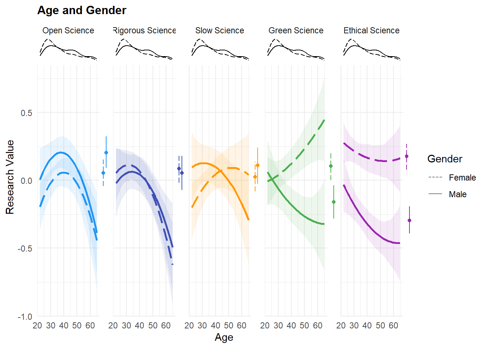{width=672}
:::
:::


::: {.cell}
::: {.cell-output-display}
::: {.callout-note collapse="true" title="Research values by gender and age (Markdown table, for text readers)"}

Table: Posterior draws

|Outcome | Draws| Unique draws|
|:----------------|-----:|------------:|
|Open Science | 3000| 2392|
|Rigorous Science | 3000| 2220|
|Green Science | 3000| 2495|
|Slow Science | 3000| 2362|
|Ethical Science | 3000| 2493|

Table: Marginal means (continuous predictor at its mean)

|Outcome |Dem_Gender |Median [95% CI] |pd |
|:----------------|:----------|:--------------------|:-------|
|Open Science |Female |0.05 [-0.04, 0.15] |86.60% |
|Open Science |Male |0.20 [0.09, 0.32] |100.00% |
|Rigorous Science |Female |0.09 [-0.02, 0.19] |94.83% |
|Rigorous Science |Male |0.05 [-0.07, 0.18] |79.10% |
|Green Science |Female |0.10 [0.00, 0.21] |97.57% |
|Green Science |Male |-0.16 [-0.28, -0.04] |99.33% |
|Slow Science |Female |0.02 [-0.08, 0.14] |68.10% |
|Slow Science |Male |0.11 [-0.03, 0.24] |94.27% |
|Ethical Science |Female |0.18 [0.08, 0.27] |100.00% |
|Ethical Science |Male |-0.29 [-0.39, -0.19] |100.00% |

Table: Contrasts between groups (continuous predictor at its mean)

|Outcome |Contrast |Median [95% CI] |pd |
|:----------------|:-------------|:--------------------|:-------|
|Open Science |Male - Female |0.15 [0.01, 0.30] |98.07% |
|Rigorous Science |Male - Female |-0.03 [-0.19, 0.12] |66.53% |
|Green Science |Male - Female |-0.26 [-0.42, -0.11] |99.97% |
|Slow Science |Male - Female |0.09 [-0.08, 0.25] |84.13% |
|Ethical Science |Male - Female |-0.47 [-0.60, -0.34] |100.00% |

Table: Predictions (Median [95% CI])

|Outcome |Dem_Gender |Dem_Age = 25 |Dem_Age = 35 |Dem_Age = 45 |Dem_Age = 55 |Dem_Age = 65 |
|:----------------|:----------|:-------------------|:--------------------|:--------------------|:--------------------|:--------------------|
|Open Science |Female |-0.12 [-0.25, 0.02] |0.04 [-0.05, 0.13] |0.04 [-0.08, 0.15] |-0.12 [-0.31, 0.04] |-0.44 [-0.81, -0.18] |
|Open Science |Male |0.08 [-0.10, 0.25] |0.20 [0.09, 0.31] |0.16 [0.04, 0.28] |-0.03 [-0.20, 0.13] |-0.39 [-0.69, -0.09] |
|Rigorous Science |Female |0.09 [-0.07, 0.23] |0.11 [0.00, 0.21] |-0.01 [-0.13, 0.11] |-0.25 [-0.41, -0.09] |-0.62 [-0.92, -0.32] |
|Rigorous Science |Male |0.02 [-0.17, 0.23] |0.06 [-0.06, 0.19] |-0.01 [-0.14, 0.14] |-0.19 [-0.37, -0.03] |-0.49 [-0.82, -0.17] |
|Green Science |Female |0.01 [-0.14, 0.15] |0.08 [-0.02, 0.18] |0.18 [0.06, 0.31] |0.30 [0.13, 0.48] |0.45 [0.14, 0.76] |
|Green Science |Male |0.01 [-0.18, 0.20] |-0.13 [-0.25, -0.01] |-0.23 [-0.36, -0.09] |-0.29 [-0.47, -0.12] |-0.32 [-0.66, 0.01] |
|Slow Science |Female |-0.15 [-0.33, 0.00] |0.00 [-0.11, 0.10] |0.08 [-0.05, 0.20] |0.09 [-0.10, 0.27] |0.04 [-0.29, 0.34] |
|Slow Science |Male |0.11 [-0.09, 0.30] |0.12 [-0.01, 0.25] |0.06 [-0.09, 0.20] |-0.08 [-0.26, 0.10] |-0.29 [-0.63, 0.03] |
|Ethical Science |Female |0.25 [0.14, 0.36] |0.19 [0.10, 0.27] |0.15 [0.05, 0.26] |0.14 [0.02, 0.29] |0.16 [-0.09, 0.40] |
|Ethical Science |Male |-0.09 [-0.25, 0.06] |-0.26 [-0.35, -0.16] |-0.37 [-0.49, -0.26] |-0.44 [-0.59, -0.30] |-0.46 [-0.74, -0.18] |

Table: Parameters

|Outcome |Parameter |Median [95% CI] |pd |
|:----------------|:----------------------------|:--------------------|:-------|
|Open Science |Intercept |-0.05 [-0.13, 0.04] |87.00% |
|Open Science |Dem_GenderMale |0.15 [0.02, 0.27] |98.50% |
|Open Science |polyDem_Age21 |-0.80 [-2.92, 1.43] |75.40% |
|Open Science |polyDem_Age22 |-2.56 [-3.85, -1.23] |100.00% |
|Open Science |Dem_GenderMale:polyDem_Age21 |-0.95 [-4.61, 2.70] |71.07% |
|Open Science |Dem_GenderMale:polyDem_Age22 |0.01 [-1.70, 1.57] |50.47% |
|Rigorous Science |Intercept |0.00 [-0.08, 0.09] |54.10% |
|Rigorous Science |Dem_GenderMale |-0.02 [-0.17, 0.11] |62.63% |
|Rigorous Science |polyDem_Age21 |-3.86 [-6.07, -1.32] |100.00% |
|Rigorous Science |polyDem_Age22 |-2.12 [-3.45, -0.73] |99.93% |
|Rigorous Science |Dem_GenderMale:polyDem_Age21 |1.33 [-2.34, 4.76] |76.47% |
|Rigorous Science |Dem_GenderMale:polyDem_Age22 |0.23 [-1.55, 1.85] |60.90% |
|Green Science |Intercept |0.12 [0.03, 0.21] |99.67% |
|Green Science |Dem_GenderMale |-0.26 [-0.40, -0.12] |100.00% |
|Green Science |polyDem_Age21 |2.95 [0.52, 5.29] |99.23% |
|Green Science |polyDem_Age22 |0.41 [-0.97, 1.83] |71.77% |
|Green Science |Dem_GenderMale:polyDem_Age21 |-5.76 [-9.52, -2.13] |99.80% |
|Green Science |Dem_GenderMale:polyDem_Age22 |0.21 [-1.49, 1.82] |59.47% |
|Slow Science |Intercept |-0.01 [-0.11, 0.08] |61.40% |
|Slow Science |Dem_GenderMale |0.08 [-0.07, 0.22] |84.83% |
|Slow Science |polyDem_Age21 |1.99 [-0.77, 4.90] |92.33% |
|Slow Science |polyDem_Age22 |-1.03 [-2.44, 0.29] |92.73% |
|Slow Science |Dem_GenderMale:polyDem_Age21 |-4.22 [-7.77, -0.23] |98.87% |
|Slow Science |Dem_GenderMale:polyDem_Age22 |-0.17 [-1.86, 1.44] |57.00% |
|Ethical Science |Intercept |0.19 [0.12, 0.27] |100.00% |
|Ethical Science |Dem_GenderMale |-0.46 [-0.57, -0.34] |100.00% |
|Ethical Science |polyDem_Age21 |-0.93 [-2.82, 0.81] |84.73% |
|Ethical Science |polyDem_Age22 |0.45 [-0.86, 1.77] |75.57% |
|Ethical Science |Dem_GenderMale:polyDem_Age21 |-2.26 [-5.08, 0.52] |94.47% |
|Ethical Science |Dem_GenderMale:polyDem_Age22 |0.35 [-1.18, 1.81] |66.80% |

:::

:::
:::


#### Carrer worry


::: {.cell}

```{.r .cell-code}
rez <- data |>
  run_models(f = "~ Work_Career_Stage * poly(WB_Carrer_worry, 2)", means="Work_Career_Stage",
             at = "WB_Carrer_worry=c(0, 0.25, 0.5, 0.75, 1)")
```

::: {.cell-output .cell-output-stderr}

```
Start sampling
```


:::

::: {.cell-output .cell-output-stdout}

```
Finished in  0.2 seconds.
```


:::

::: {.cell-output .cell-output-stderr}

```
Start sampling
```


:::

::: {.cell-output .cell-output-stdout}

```
Finished in  0.2 seconds.
```


:::

::: {.cell-output .cell-output-stderr}

```
Start sampling
```


:::

::: {.cell-output .cell-output-stdout}

```
Pareto k value (0.79) is greater than 0.7. Importance resampling was not able to improve the approximation, which may indicate that the approximation itself is poor. 
Finished in  0.1 seconds.
```


:::

::: {.cell-output .cell-output-stderr}

```
Start sampling
```


:::

::: {.cell-output .cell-output-stdout}

```
Pareto k value (0.83) is greater than 0.7. Importance resampling was not able to improve the approximation, which may indicate that the approximation itself is poor. 
Finished in  0.2 seconds.
```


:::

::: {.cell-output .cell-output-stderr}

```
Start sampling
```


:::

::: {.cell-output .cell-output-stdout}

```
Finished in  0.1 seconds.
```


:::

```{.r .cell-code}
p_resval_pred2 <- rez$pred |>
  ggplot(aes(x = WB_Carrer_worry, y = Predicted)) +
  geom_ribbon(aes(ymin = CI_low, ymax = CI_high, fill=Outcome,
                  group = interaction(Work_Career_Stage, Outcome)), alpha = 0.1) +
  geom_line(aes(color=Outcome, linetype = Work_Career_Stage), linewidth = 1) +
  ggside::geom_xsidedensity(data = filter(data, !is.na(Work_Career_Stage)), aes(linetype = Work_Career_Stage),
    show.legend = FALSE) +
  ggside::geom_ysidesegment(data=rez$mmeans, aes(x = Work_Career_Stage, xend = Work_Career_Stage, 
                                                 y = CI_low, yend = CI_high, color = Outcome,
                                                 linetype = Work_Career_Stage), linewidth = 0.5) +
  ggside::geom_ysidepoint(data = rez$mmeans, 
                            aes(x = Work_Career_Stage, y = Median, color = Outcome)) +
  scale_linetype_manual(values = c("dotted", "longdash", "solid")) +
  scale_colour_manual(values = c("Open Science" = "#2196F3", "Rigorous Science" = "#3F51B5", "Green Science" = "#4CAF50",
                      "Slow Science" = "#FF9800", "Ethical Science" = "#9C27B0"), guide = "none") +
  scale_fill_manual(values = c("Open Science" = "#2196F3", "Rigorous Science" = "#3F51B5", "Green Science" = "#4CAF50",
                      "Slow Science" = "#FF9800", "Ethical Science" = "#9C27B0"), guide = "none") +
  scale_x_continuous(labels = scales::percent_format()) +
  guides(linetype = guide_legend(override.aes = list(linewidth = 0.3))) +
  labs(y = "Research Value", x = "Career Worry",
       fill = "Profile", color = "Profile", linetype = "Career Stage",
       title = "Career Stage and Career Worry") +
  theme_minimal() +
  theme(plot.title = element_text(size = 12, face = "bold", hjust = 0)) +
  ggside::theme_ggside_void() + 
  facet_wrap(~Outcome, ncol = 5) 
p_resval_pred2
```

::: {.cell-output-display}
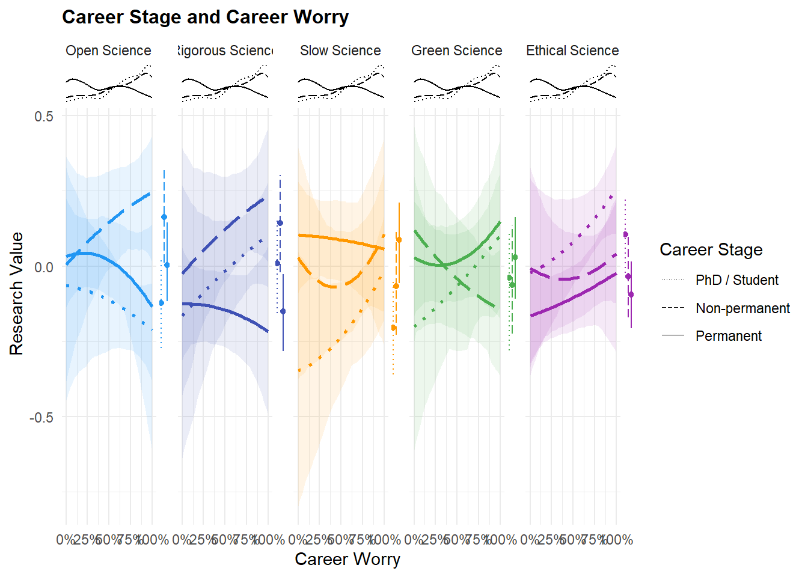{width=672}
:::
:::


::: {.cell}
::: {.cell-output-display}
::: {.callout-note collapse="true" title="Research values by career stage and career worry (Markdown table, for text readers)"}

Table: Posterior draws

|Outcome | Draws| Unique draws|
|:----------------|-----:|------------:|
|Open Science | 3000| 1879|
|Rigorous Science | 3000| 1976|
|Green Science | 3000| 1849|
|Slow Science | 3000| 1827|
|Ethical Science | 3000| 2050|

Table: Marginal means (continuous predictor at its mean)

|Outcome |Work_Career_Stage |Median [95% CI] |pd |
|:----------------|:-----------------|:--------------------|:------|
|Open Science |PhD / Student |-0.12 [-0.27, 0.02] |95.37% |
|Open Science |Non-permanent |0.16 [0.01, 0.33] |98.17% |
|Open Science |Permanent |0.00 [-0.12, 0.14] |51.90% |
|Rigorous Science |PhD / Student |0.01 [-0.16, 0.16] |53.23% |
|Rigorous Science |Non-permanent |0.14 [-0.02, 0.30] |95.83% |
|Rigorous Science |Permanent |-0.15 [-0.28, -0.03] |99.50% |
|Green Science |PhD / Student |-0.04 [-0.28, 0.11] |69.30% |
|Green Science |Non-permanent |-0.06 [-0.22, 0.14] |77.40% |
|Green Science |Permanent |0.03 [-0.11, 0.16] |62.77% |
|Slow Science |PhD / Student |-0.21 [-0.36, -0.05] |99.23% |
|Slow Science |Non-permanent |-0.07 [-0.23, 0.11] |74.53% |
|Slow Science |Permanent |0.09 [-0.06, 0.21] |87.30% |
|Ethical Science |PhD / Student |0.11 [-0.02, 0.23] |93.87% |
|Ethical Science |Non-permanent |-0.03 [-0.17, 0.11] |67.07% |
|Ethical Science |Permanent |-0.09 [-0.21, 0.02] |94.20% |

Table: Contrasts between groups (continuous predictor at its mean)

|Outcome |Contrast |Median [95% CI] |pd |
|:----------------|:-----------------------------|:--------------------|:------|
|Open Science |Non-permanent - PhD / Student |0.29 [0.08, 0.49] |99.97% |
|Open Science |Permanent - PhD / Student |0.13 [-0.04, 0.32] |92.17% |
|Open Science |Permanent - Non-permanent |-0.16 [-0.34, 0.04] |94.93% |
|Rigorous Science |Non-permanent - PhD / Student |0.13 [-0.07, 0.38] |89.83% |
|Rigorous Science |Permanent - PhD / Student |-0.16 [-0.36, 0.04] |92.73% |
|Rigorous Science |Permanent - Non-permanent |-0.30 [-0.49, -0.10] |99.90% |
|Green Science |Non-permanent - PhD / Student |-0.03 [-0.23, 0.20] |57.53% |
|Green Science |Permanent - PhD / Student |0.06 [-0.14, 0.37] |70.70% |
|Green Science |Permanent - Non-permanent |0.09 [-0.12, 0.30] |79.90% |
|Slow Science |Non-permanent - PhD / Student |0.15 [-0.08, 0.37] |90.07% |
|Slow Science |Permanent - PhD / Student |0.28 [0.08, 0.50] |99.43% |
|Slow Science |Permanent - Non-permanent |0.14 [-0.07, 0.36] |89.90% |
|Ethical Science |Non-permanent - PhD / Student |-0.14 [-0.31, 0.03] |93.37% |
|Ethical Science |Permanent - PhD / Student |-0.20 [-0.35, -0.03] |98.97% |
|Ethical Science |Permanent - Non-permanent |-0.06 [-0.23, 0.11] |75.60% |

Table: Predictions (Median [95% CI])

|Outcome |Work_Career_Stage |WB_Carrer_worry = 0 |WB_Carrer_worry = 0.25 |WB_Carrer_worry = 0.5 |WB_Carrer_worry = 0.75 |WB_Carrer_worry = 1 |
|:----------------|:-----------------|:--------------------|:----------------------|:---------------------|:----------------------|:--------------------|
|Open Science |PhD / Student |-0.06 [-0.45, 0.33] |-0.08 [-0.33, 0.16] |-0.11 [-0.28, 0.06] |-0.16 [-0.28, -0.04] |-0.21 [-0.38, -0.06] |
|Open Science |Non-permanent |0.01 [-0.38, 0.37] |0.08 [-0.14, 0.29] |0.15 [-0.01, 0.31] |0.20 [0.06, 0.34] |0.24 [0.02, 0.44] |
|Open Science |Permanent |0.03 [-0.14, 0.22] |0.04 [-0.07, 0.16] |0.02 [-0.10, 0.16] |-0.04 [-0.24, 0.12] |-0.13 [-0.62, 0.14] |
|Rigorous Science |PhD / Student |-0.17 [-0.64, 0.27] |-0.09 [-0.38, 0.17] |-0.02 [-0.20, 0.15] |0.05 [-0.08, 0.17] |0.10 [-0.07, 0.28] |
|Rigorous Science |Non-permanent |-0.03 [-0.43, 0.39] |0.05 [-0.19, 0.31] |0.12 [-0.05, 0.30] |0.18 [0.04, 0.33] |0.23 [0.02, 0.46] |
|Rigorous Science |Permanent |-0.13 [-0.31, 0.06] |-0.13 [-0.25, -0.01] |-0.15 [-0.27, -0.02] |-0.17 [-0.33, -0.03] |-0.22 [-0.49, 0.07] |
|Green Science |PhD / Student |-0.20 [-0.61, 0.30] |-0.14 [-0.38, 0.12] |-0.07 [-0.28, 0.11] |0.01 [-0.18, 0.15] |0.10 [-0.13, 0.31] |
|Green Science |Non-permanent |0.12 [-0.25, 0.46] |0.03 [-0.19, 0.25] |-0.04 [-0.21, 0.16] |-0.10 [-0.26, 0.07] |-0.14 [-0.36, 0.06] |
|Green Science |Permanent |0.03 [-0.16, 0.22] |0.00 [-0.12, 0.13] |0.02 [-0.12, 0.14] |0.06 [-0.10, 0.23] |0.15 [-0.17, 0.42] |
|Slow Science |PhD / Student |-0.35 [-0.80, 0.05] |-0.31 [-0.59, -0.04] |-0.24 [-0.41, -0.05] |-0.14 [-0.30, -0.01] |-0.02 [-0.18, 0.17] |
|Slow Science |Non-permanent |0.03 [-0.38, 0.39] |-0.05 [-0.31, 0.18] |-0.07 [-0.25, 0.12] |-0.01 [-0.16, 0.15] |0.11 [-0.15, 0.32] |
|Slow Science |Permanent |0.10 [-0.09, 0.28] |0.10 [-0.03, 0.22] |0.09 [-0.05, 0.21] |0.07 [-0.11, 0.24] |0.06 [-0.26, 0.42] |
|Ethical Science |PhD / Student |-0.02 [-0.36, 0.29] |0.02 [-0.19, 0.23] |0.08 [-0.06, 0.22] |0.16 [0.05, 0.26] |0.26 [0.11, 0.40] |
|Ethical Science |Non-permanent |-0.01 [-0.32, 0.33] |-0.04 [-0.22, 0.15] |-0.04 [-0.18, 0.11] |-0.01 [-0.13, 0.10] |0.04 [-0.12, 0.22] |
|Ethical Science |Permanent |-0.17 [-0.33, -0.01] |-0.14 [-0.24, -0.03] |-0.11 [-0.22, 0.00] |-0.07 [-0.20, 0.08] |-0.02 [-0.29, 0.23] |

Table: Parameters

|Outcome |Parameter |Median [95% CI] |pd |
|:----------------|:----------------------------------------------------|:--------------------|:------|
|Open Science |Intercept |-0.14 [-0.27, 0.01] |97.00% |
|Open Science |Work_Career_StageNonMpermanent |0.29 [0.10, 0.49] |99.97% |
|Open Science |Work_Career_StagePermanent |0.11 [-0.07, 0.30] |85.97% |
|Open Science |polyWB_Carrer_worry21 |-1.25 [-5.42, 2.16] |74.10% |
|Open Science |polyWB_Carrer_worry22 |-0.23 [-1.70, 1.29] |63.00% |
|Open Science |Work_Career_StageNonMpermanent:polyWB_Carrer_worry21 |3.45 [-2.57, 8.03] |89.33% |
|Open Science |Work_Career_StagePermanent:polyWB_Carrer_worry21 |-0.14 [-5.39, 4.32] |52.23% |
|Open Science |Work_Career_StageNonMpermanent:polyWB_Carrer_worry22 |0.06 [-1.55, 1.62] |52.23% |
|Open Science |Work_Career_StagePermanent:polyWB_Carrer_worry22 |-0.41 [-2.04, 1.12] |68.30% |
|Rigorous Science |Intercept |0.00 [-0.18, 0.15] |51.30% |
|Rigorous Science |Work_Career_StageNonMpermanent |0.13 [-0.06, 0.37] |89.63% |
|Rigorous Science |Work_Career_StagePermanent |-0.16 [-0.36, 0.04] |93.97% |
|Rigorous Science |polyWB_Carrer_worry21 |2.24 [-1.79, 6.46] |85.60% |
|Rigorous Science |polyWB_Carrer_worry22 |-0.10 [-1.80, 1.33] |55.70% |
|Rigorous Science |Work_Career_StageNonMpermanent:polyWB_Carrer_worry21 |0.04 [-7.12, 5.05] |50.60% |
|Rigorous Science |Work_Career_StagePermanent:polyWB_Carrer_worry21 |-3.20 [-8.34, 2.34] |87.23% |
|Rigorous Science |Work_Career_StageNonMpermanent:polyWB_Carrer_worry22 |-0.04 [-1.76, 1.65] |51.63% |
|Rigorous Science |Work_Career_StagePermanent:polyWB_Carrer_worry22 |-0.09 [-1.74, 1.55] |55.43% |
|Green Science |Intercept |-0.03 [-0.21, 0.11] |65.73% |
|Green Science |Work_Career_StageNonMpermanent |-0.02 [-0.22, 0.22] |56.60% |
|Green Science |Work_Career_StagePermanent |0.09 [-0.11, 0.38] |80.50% |
|Green Science |polyWB_Carrer_worry21 |2.63 [-1.16, 6.70] |87.60% |
|Green Science |polyWB_Carrer_worry22 |0.12 [-1.28, 2.28] |56.53% |
|Green Science |Work_Career_StageNonMpermanent:polyWB_Carrer_worry21 |-4.94 [-9.61, 0.22] |97.00% |
|Green Science |Work_Career_StagePermanent:polyWB_Carrer_worry21 |-1.63 [-7.05, 3.35] |70.80% |
|Green Science |Work_Career_StageNonMpermanent:polyWB_Carrer_worry22 |0.15 [-1.74, 1.90] |55.50% |
|Green Science |Work_Career_StagePermanent:polyWB_Carrer_worry22 |0.51 [-1.07, 2.19] |74.20% |
|Slow Science |Intercept |-0.18 [-0.34, -0.02] |99.07% |
|Slow Science |Work_Career_StageNonMpermanent |0.19 [-0.04, 0.39] |94.33% |
|Slow Science |Work_Career_StagePermanent |0.26 [0.05, 0.50] |99.37% |
|Slow Science |polyWB_Carrer_worry21 |2.86 [-0.90, 7.61] |88.53% |
|Slow Science |polyWB_Carrer_worry22 |0.46 [-0.94, 1.83] |72.03% |
|Slow Science |Work_Career_StageNonMpermanent:polyWB_Carrer_worry21 |-1.92 [-7.57, 3.15] |75.17% |
|Slow Science |Work_Career_StagePermanent:polyWB_Carrer_worry21 |-3.34 [-8.88, 1.95] |87.30% |
|Slow Science |Work_Career_StageNonMpermanent:polyWB_Carrer_worry22 |0.80 [-0.98, 2.41] |82.67% |
|Slow Science |Work_Career_StagePermanent:polyWB_Carrer_worry22 |-0.49 [-2.33, 1.46] |71.57% |
|Ethical Science |Intercept |0.12 [-0.01, 0.23] |97.10% |
|Ethical Science |Work_Career_StageNonMpermanent |-0.13 [-0.29, 0.04] |93.77% |
|Ethical Science |Work_Career_StagePermanent |-0.21 [-0.36, -0.06] |99.53% |
|Ethical Science |polyWB_Carrer_worry21 |2.46 [-0.77, 5.71] |90.73% |
|Ethical Science |polyWB_Carrer_worry22 |0.36 [-1.05, 1.76] |67.47% |
|Ethical Science |Work_Career_StageNonMpermanent:polyWB_Carrer_worry21 |-2.02 [-6.49, 2.20] |79.23% |
|Ethical Science |Work_Career_StagePermanent:polyWB_Carrer_worry21 |-1.14 [-5.65, 3.21] |70.80% |
|Ethical Science |Work_Career_StageNonMpermanent:polyWB_Carrer_worry22 |0.18 [-1.33, 1.88] |59.33% |
|Ethical Science |Work_Career_StagePermanent:polyWB_Carrer_worry22 |-0.23 [-1.82, 1.36] |58.77% |

:::

:::
:::


#### Research Time


::: {.cell}

```{.r .cell-code}
rez <- data |>
  run_models(f = "~ Work_Career_Stage * poly(WB_Time_research, 2)", means="Work_Career_Stage",
             at = "WB_Time_research=c(0, 0.25, 0.5, 0.75, 1)")
```

::: {.cell-output .cell-output-stderr}

```
Start sampling
```


:::

::: {.cell-output .cell-output-stdout}

```
Finished in  0.1 seconds.
```


:::

::: {.cell-output .cell-output-stderr}

```
Start sampling
```


:::

::: {.cell-output .cell-output-stdout}

```
Pareto k value (0.81) is greater than 0.7. Importance resampling was not able to improve the approximation, which may indicate that the approximation itself is poor. 
Finished in  0.1 seconds.
```


:::

::: {.cell-output .cell-output-stderr}

```
Start sampling
```


:::

::: {.cell-output .cell-output-stdout}

```
Finished in  0.1 seconds.
```


:::

::: {.cell-output .cell-output-stderr}

```
Start sampling
```


:::

::: {.cell-output .cell-output-stdout}

```
Finished in  0.1 seconds.
```


:::

::: {.cell-output .cell-output-stderr}

```
Start sampling
```


:::

::: {.cell-output .cell-output-stdout}

```
Finished in  0.1 seconds.
```


:::

```{.r .cell-code}
p_resval_pred3 <- rez$pred |>
  ggplot(aes(x = WB_Time_research, y = Predicted)) +
  geom_ribbon(aes(ymin = CI_low, ymax = CI_high, fill=Outcome,
                  group = interaction(Work_Career_Stage, Outcome)), alpha = 0.1) +
  geom_line(aes(color=Outcome, linetype = Work_Career_Stage), linewidth = 1) +
  ggside::geom_xsidedensity(data = filter(data, !is.na(Work_Career_Stage)), aes(linetype = Work_Career_Stage),
    show.legend = FALSE) +
  ggside::geom_ysidesegment(data=rez$mmeans, aes(x = Work_Career_Stage, xend = Work_Career_Stage, 
                                                 y = CI_low, yend = CI_high, color = Outcome,
                                                 linetype = Work_Career_Stage), linewidth = 0.5) +
  ggside::geom_ysidepoint(data = rez$mmeans, 
                            aes(x = Work_Career_Stage, y = Median, color = Outcome)) +
  scale_linetype_manual(values = c("dotted", "longdash", "solid")) +
  scale_colour_manual(values = c("Open Science" = "#2196F3", "Rigorous Science" = "#3F51B5", "Green Science" = "#4CAF50",
                      "Slow Science" = "#FF9800", "Ethical Science" = "#9C27B0"), guide = "none") +
  scale_fill_manual(values = c("Open Science" = "#2196F3", "Rigorous Science" = "#3F51B5", "Green Science" = "#4CAF50",
                      "Slow Science" = "#FF9800", "Ethical Science" = "#9C27B0"), guide = "none") +
  scale_x_continuous(labels = scales::percent_format()) +
  guides(linetype = guide_legend(override.aes = list(linewidth = 0.3))) +
  labs(y = "Research Value", x = "Research Time",
       fill = "Profile", color = "Profile", linetype = "Career Stage",
       title = "Career Stage and Research Time") +
  theme_minimal() +
  theme(plot.title = element_text(size = 12, face = "bold", hjust = 0)) +
  ggside::theme_ggside_void() + 
  facet_wrap(~Outcome, ncol = 5) 
p_resval_pred3
```

::: {.cell-output-display}
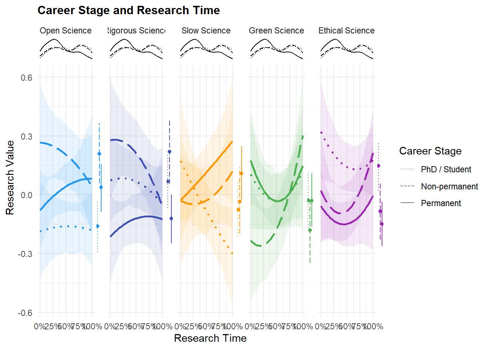{width=672}
:::
:::


::: {.cell}
::: {.cell-output-display}
::: {.callout-note collapse="true" title="Research values by career stage and research time (Markdown table, for text readers)"}

Table: Posterior draws

|Outcome | Draws| Unique draws|
|:----------------|-----:|------------:|
|Open Science | 3000| 2065|
|Rigorous Science | 3000| 2054|
|Green Science | 3000| 2146|
|Slow Science | 3000| 1991|
|Ethical Science | 3000| 2103|

Table: Marginal means (continuous predictor at its mean)

|Outcome |Work_Career_Stage |Median [95% CI] |pd |
|:----------------|:-----------------|:--------------------|:------|
|Open Science |PhD / Student |-0.16 [-0.30, -0.03] |99.40% |
|Open Science |Non-permanent |0.21 [0.06, 0.37] |99.80% |
|Open Science |Permanent |0.04 [-0.09, 0.16] |73.53% |
|Rigorous Science |PhD / Student |0.07 [-0.07, 0.21] |82.97% |
|Rigorous Science |Non-permanent |0.22 [0.05, 0.39] |99.80% |
|Rigorous Science |Permanent |-0.12 [-0.25, 0.00] |97.37% |
|Green Science |PhD / Student |-0.03 [-0.17, 0.12] |65.37% |
|Green Science |Non-permanent |-0.18 [-0.35, -0.02] |98.63% |
|Green Science |Permanent |-0.03 [-0.16, 0.11] |67.10% |
|Slow Science |PhD / Student |-0.08 [-0.21, 0.07] |85.77% |
|Slow Science |Non-permanent |-0.03 [-0.20, 0.14] |64.37% |
|Slow Science |Permanent |0.11 [-0.03, 0.25] |93.97% |
|Ethical Science |PhD / Student |0.15 [0.02, 0.27] |99.30% |
|Ethical Science |Non-permanent |-0.09 [-0.23, 0.06] |88.33% |
|Ethical Science |Permanent |-0.15 [-0.26, -0.04] |99.17% |

Table: Contrasts between groups (continuous predictor at its mean)

|Outcome |Contrast |Median [95% CI] |pd |
|:----------------|:-----------------------------|:--------------------|:-------|
|Open Science |Non-permanent - PhD / Student |0.37 [0.17, 0.56] |100.00% |
|Open Science |Permanent - PhD / Student |0.20 [0.03, 0.37] |99.20% |
|Open Science |Permanent - Non-permanent |-0.17 [-0.36, 0.03] |95.77% |
|Rigorous Science |Non-permanent - PhD / Student |0.15 [-0.05, 0.34] |92.90% |
|Rigorous Science |Permanent - PhD / Student |-0.19 [-0.38, -0.02] |98.83% |
|Rigorous Science |Permanent - Non-permanent |-0.34 [-0.54, -0.14] |100.00% |
|Green Science |Non-permanent - PhD / Student |-0.15 [-0.38, 0.05] |93.10% |
|Green Science |Permanent - PhD / Student |0.00 [-0.18, 0.18] |50.53% |
|Green Science |Permanent - Non-permanent |0.15 [-0.05, 0.35] |93.23% |
|Slow Science |Non-permanent - PhD / Student |0.04 [-0.15, 0.25] |64.03% |
|Slow Science |Permanent - PhD / Student |0.19 [0.00, 0.36] |97.43% |
|Slow Science |Permanent - Non-permanent |0.14 [-0.07, 0.34] |90.90% |
|Ethical Science |Non-permanent - PhD / Student |-0.23 [-0.40, -0.06] |99.70% |
|Ethical Science |Permanent - PhD / Student |-0.30 [-0.46, -0.14] |100.00% |
|Ethical Science |Permanent - Non-permanent |-0.06 [-0.23, 0.11] |76.40% |

Table: Predictions (Median [95% CI])

|Outcome |Work_Career_Stage |WB_Time_research = 0 |WB_Time_research = 0.25 |WB_Time_research = 0.5 |WB_Time_research = 0.75 |WB_Time_research = 1 |
|:----------------|:-----------------|:--------------------|:-----------------------|:----------------------|:-----------------------|:--------------------|
|Open Science |PhD / Student |-0.19 [-0.43, 0.07] |-0.17 [-0.33, -0.01] |-0.16 [-0.29, -0.03] |-0.17 [-0.30, -0.04] |-0.18 [-0.37, 0.01] |
|Open Science |Non-permanent |0.27 [-0.03, 0.57] |0.25 [0.09, 0.42] |0.20 [0.05, 0.36] |0.14 [-0.02, 0.29] |0.04 [-0.20, 0.31] |
|Open Science |Permanent |-0.08 [-0.29, 0.13] |-0.01 [-0.12, 0.10] |0.04 [-0.09, 0.16] |0.07 [-0.08, 0.23] |0.08 [-0.21, 0.41] |
|Rigorous Science |PhD / Student |0.07 [-0.14, 0.30] |0.08 [-0.07, 0.24] |0.07 [-0.07, 0.21] |0.02 [-0.11, 0.16] |-0.05 [-0.26, 0.15] |
|Rigorous Science |Non-permanent |0.28 [-0.02, 0.60] |0.27 [0.10, 0.45] |0.21 [0.05, 0.38] |0.10 [-0.06, 0.28] |-0.06 [-0.32, 0.23] |
|Rigorous Science |Permanent |-0.21 [-0.45, 0.01] |-0.15 [-0.27, -0.04] |-0.12 [-0.25, 0.00] |-0.11 [-0.27, 0.06] |-0.13 [-0.44, 0.20] |
|Green Science |PhD / Student |0.11 [-0.18, 0.42] |0.00 [-0.18, 0.19] |-0.03 [-0.16, 0.11] |0.01 [-0.14, 0.16] |0.12 [-0.12, 0.35] |
|Green Science |Non-permanent |-0.23 [-0.54, 0.09] |-0.26 [-0.44, -0.07] |-0.17 [-0.34, -0.01] |0.01 [-0.15, 0.17] |0.30 [0.04, 0.59] |
|Green Science |Permanent |0.17 [-0.05, 0.39] |0.02 [-0.10, 0.14] |-0.03 [-0.17, 0.11] |0.01 [-0.17, 0.17] |0.15 [-0.18, 0.46] |
|Slow Science |PhD / Student |0.17 [-0.13, 0.49] |0.04 [-0.16, 0.22] |-0.09 [-0.22, 0.06] |-0.20 [-0.35, -0.05] |-0.30 [-0.57, -0.06] |
|Slow Science |Non-permanent |-0.03 [-0.36, 0.31] |-0.05 [-0.22, 0.15] |-0.03 [-0.19, 0.14] |0.03 [-0.15, 0.21] |0.12 [-0.17, 0.44] |
|Slow Science |Permanent |-0.03 [-0.25, 0.22] |0.04 [-0.08, 0.17] |0.11 [-0.02, 0.26] |0.19 [0.01, 0.37] |0.27 [-0.05, 0.59] |
|Ethical Science |PhD / Student |0.32 [0.08, 0.58] |0.21 [0.06, 0.36] |0.14 [0.02, 0.27] |0.13 [0.02, 0.26] |0.18 [0.00, 0.36] |
|Ethical Science |Non-permanent |0.02 [-0.24, 0.30] |-0.08 [-0.23, 0.07] |-0.08 [-0.22, 0.06] |0.01 [-0.12, 0.16] |0.21 [-0.02, 0.44] |
|Ethical Science |Permanent |-0.06 [-0.25, 0.13] |-0.13 [-0.23, -0.03] |-0.15 [-0.26, -0.03] |-0.11 [-0.25, 0.03] |-0.01 [-0.28, 0.28] |

Table: Parameters

|Outcome |Parameter |Median [95% CI] |pd |
|:----------------|:-----------------------------------------------------|:--------------------|:-------|
|Open Science |Intercept |-0.17 [-0.30, -0.04] |99.87% |
|Open Science |Work_Career_StageNonMpermanent |0.37 [0.17, 0.54] |100.00% |
|Open Science |Work_Career_StagePermanent |0.19 [0.04, 0.36] |99.37% |
|Open Science |polyWB_Time_research21 |0.06 [-2.63, 2.43] |52.07% |
|Open Science |polyWB_Time_research22 |-0.19 [-1.53, 1.07] |61.83% |
|Open Science |Work_Career_StageNonMpermanent:polyWB_Time_research21 |-1.76 [-5.65, 1.73] |80.37% |
|Open Science |Work_Career_StagePermanent:polyWB_Time_research21 |1.16 [-2.01, 4.41] |74.10% |
|Open Science |Work_Career_StageNonMpermanent:polyWB_Time_research22 |-0.18 [-1.93, 1.46] |59.63% |
|Open Science |Work_Career_StagePermanent:polyWB_Time_research22 |-0.13 [-1.66, 1.49] |55.23% |
|Rigorous Science |Intercept |0.05 [-0.07, 0.18] |77.23% |
|Rigorous Science |Work_Career_StageNonMpermanent |0.13 [-0.06, 0.31] |92.40% |
|Rigorous Science |Work_Career_StagePermanent |-0.19 [-0.37, -0.03] |99.07% |
|Rigorous Science |polyWB_Time_research21 |-0.96 [-3.06, 1.08] |78.03% |
|Rigorous Science |polyWB_Time_research22 |-0.46 [-1.79, 0.90] |72.40% |
|Rigorous Science |Work_Career_StageNonMpermanent:polyWB_Time_research21 |-1.71 [-5.52, 2.17] |80.57% |
|Rigorous Science |Work_Career_StagePermanent:polyWB_Time_research21 |1.60 [-1.58, 4.85] |82.10% |
|Rigorous Science |Work_Career_StageNonMpermanent:polyWB_Time_research22 |-0.38 [-2.25, 1.28] |68.33% |
|Rigorous Science |Work_Career_StagePermanent:polyWB_Time_research22 |0.04 [-1.69, 1.66] |51.47% |
|Green Science |Intercept |0.02 [-0.11, 0.17] |61.23% |
|Green Science |Work_Career_StageNonMpermanent |-0.13 [-0.34, 0.06] |91.13% |
|Green Science |Work_Career_StagePermanent |0.02 [-0.15, 0.18] |58.50% |
|Green Science |polyWB_Time_research21 |0.22 [-2.86, 2.99] |55.30% |
|Green Science |polyWB_Time_research22 |1.16 [-0.26, 2.49] |94.73% |
|Green Science |Work_Career_StageNonMpermanent:polyWB_Time_research21 |4.02 [-0.19, 8.76] |97.00% |
|Green Science |Work_Career_StagePermanent:polyWB_Time_research21 |-0.30 [-4.47, 3.40] |56.07% |
|Green Science |Work_Career_StageNonMpermanent:polyWB_Time_research22 |0.53 [-1.20, 2.35] |74.53% |
|Green Science |Work_Career_StagePermanent:polyWB_Time_research22 |0.48 [-1.35, 2.04] |70.00% |
|Slow Science |Intercept |-0.07 [-0.19, 0.07] |84.50% |
|Slow Science |Work_Career_StageNonMpermanent |0.06 [-0.13, 0.25] |71.90% |
|Slow Science |Work_Career_StagePermanent |0.18 [0.00, 0.35] |98.23% |
|Slow Science |polyWB_Time_research21 |-3.65 [-6.87, -0.52] |99.13% |
|Slow Science |polyWB_Time_research22 |0.18 [-1.36, 1.80] |60.40% |
|Slow Science |Work_Career_StageNonMpermanent:polyWB_Time_research21 |4.88 [0.23, 9.12] |97.90% |
|Slow Science |Work_Career_StagePermanent:polyWB_Time_research21 |5.79 [1.54, 10.94] |99.67% |
|Slow Science |Work_Career_StageNonMpermanent:polyWB_Time_research22 |0.47 [-1.31, 2.13] |67.27% |
|Slow Science |Work_Career_StagePermanent:polyWB_Time_research22 |-0.14 [-2.03, 1.47] |55.47% |
|Ethical Science |Intercept |0.18 [0.07, 0.29] |99.97% |
|Ethical Science |Work_Career_StageNonMpermanent |-0.20 [-0.36, -0.05] |99.57% |
|Ethical Science |Work_Career_StagePermanent |-0.29 [-0.44, -0.15] |100.00% |
|Ethical Science |polyWB_Time_research21 |-1.08 [-3.36, 1.41] |80.77% |
|Ethical Science |polyWB_Time_research22 |0.86 [-0.48, 2.13] |90.93% |
|Ethical Science |Work_Career_StageNonMpermanent:polyWB_Time_research21 |2.66 [-0.89, 5.81] |92.43% |
|Ethical Science |Work_Career_StagePermanent:polyWB_Time_research21 |1.44 [-1.74, 4.78] |80.73% |
|Ethical Science |Work_Career_StageNonMpermanent:polyWB_Time_research22 |0.74 [-0.77, 2.46] |81.87% |
|Ethical Science |Work_Career_StagePermanent:polyWB_Time_research22 |0.07 [-1.47, 1.73] |53.87% |

:::

:::
:::


## Practices

TODO: People that answered Not Feasible for the slow science constraining practices ~ Status * Age


## Figures

### Sample


::: {.cell}

```{.r .cell-code}
(p_age + p_children) / 
  (p_discipline + p_position) / 
  patchwork::wrap_elements(p_country) +
  plot_layout(heights = c(0.25, 0.3, 0.45)) +
  plot_annotation(
    title = paste0("Sample (N = ", nrow(df), ")"),
    theme = theme(plot.title = element_text(size = 18, face = "bold.italic", hjust = 0.5))
  )
```

::: {.cell-output-display}
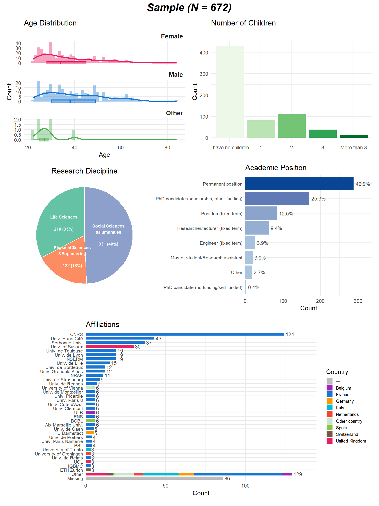{width=864}
:::

```{.r .cell-code}
# (p_position | p_country) / (p_time | p_career) +
#   plot_layout(heights = c(0.5, 0.5)) +
#   plot_annotation(title = "Demographics", theme = theme(plot.title = element_text(size = 18, face = "bold.italic", hjust = 0)))
```
:::


### Landscape


::: {.cell}

```{.r .cell-code}
# Panels redrawn from the data of the plots above as horizontal bars, with one
# style for the paper (Figure "landscape" of the manuscript)
theme_panel <- theme_minimal(base_size = 10) +
  theme(plot.title = element_text(face = "bold", size = 11),
        plot.subtitle = element_text(color = "grey40", size = 9),
        panel.grid.minor = element_blank(), panel.grid.major.y = element_blank(),
        plot.title.position = "plot")

bar_panel <- function(data, x, y, fill, title, subtitle = NULL) {
  ggplot(data, aes(x = {{ x }}, y = fct_reorder({{ y }}, {{ x }}))) +
    geom_col(fill = fill, width = 0.75) +
    geom_text(aes(label = scales::percent({{ x }}, accuracy = 1)), hjust = -0.15, size = 2.8, color = "grey25") +
    scale_x_continuous(labels = scales::percent_format(), expand = expansion(mult = c(0, 0.12))) +
    theme_panel +
    labs(title = title, subtitle = subtitle, x = NULL, y = NULL)
}

p1 <- bar_panel(p_criteria$data, pct, Criterion, "#546E7A",
                "Criteria of Scientific Quality", "Most important criteria to assess scientific work (3 choices)")

p2 <- p_sliders + theme_panel +
  theme(strip.placement = "outside", strip.text.y.left = element_text(angle = 0, face = "bold", hjust = 1)) +
  labs(title = "Familiarity, Importance and Engagement", subtitle = "Histograms, mean and interquartile range")

p3 <- p_os_adoption + theme_panel +
  theme(legend.position = "bottom", panel.grid.major.x = element_blank(),
        legend.key.size = unit(0.35, "cm")) +
  guides(fill = guide_legend(nrow = 2)) +
  labs(subtitle = "Knowledge and use of each practice")

p4 <- p_os_help$data |>
  mutate(name = str_replace_all(name, "\n", " "),
         Type = fct_recode(Type, "Funding" = "Money")) |>
  bar_panel(Total, name, domain_colors[["Open Science"]],
            "Levers for Open Science", "What would you need to further adopt open science practices? (up to 5)") +
  facet_grid(Type ~ ., scales = "free_y", space = "free_y", switch = "y") +
  theme(strip.placement = "outside", strip.text.y.left = element_text(angle = 0, face = "bold", hjust = 1))

p5 <- ss_def$data |>
  mutate(name = str_replace_all(name, "\n", " ")) |>
  bar_panel(Total, name, domain_colors[["Slow Science"]],
            "Meaning of Slow Science", "Which of these best describes slow science for you? (up to 3)")

p6 <- ss_feas$data |>
  mutate(Practice = fct_rev(fct_relabel(Practice, \(x) str_replace_all(x, "\n", " "))),
         Level = fct_recode(Level, "Individual level" = "Individual", "Institutional level" = "Institution",
                            "Not feasible" = "Not Feasible")) |>
  ggplot(aes(x = Proportion, y = Practice, fill = Level)) +
  geom_col(position = position_dodge2(reverse = TRUE, padding = 0.1), width = 0.8) +
  scale_x_continuous(labels = scales::percent_format(), expand = expansion(mult = c(0, 0.05))) +
  scale_fill_manual(values = c("Individual level" = "#FFB74D", "Institutional level" = "#E65100",
                               "Not feasible" = "#9E9E9E")) +
  theme_panel +
  theme(legend.position = "bottom", legend.key.size = unit(0.35, "cm")) +
  labs(title = "Feasibility of Slow Science Measures", subtitle = "At which level is each measure feasible? (several choices)",
       x = NULL, y = NULL, fill = NULL)

fig_landscape <- (p1 | p2) / (p3 | p4) / (p5 | p6) +
  plot_layout(heights = c(11, 14, 12)) +
  plot_annotation(tag_levels = "A") &
  theme(plot.tag = element_text(face = "bold", size = 14))
dir.create("../paper/figures", showWarnings = FALSE)
ggsave("../paper/figures/fig_landscape.png", fig_landscape, width = 10.5, height = 13.5, dpi = 300, bg = "white")
fig_landscape
```

::: {.cell-output-display}
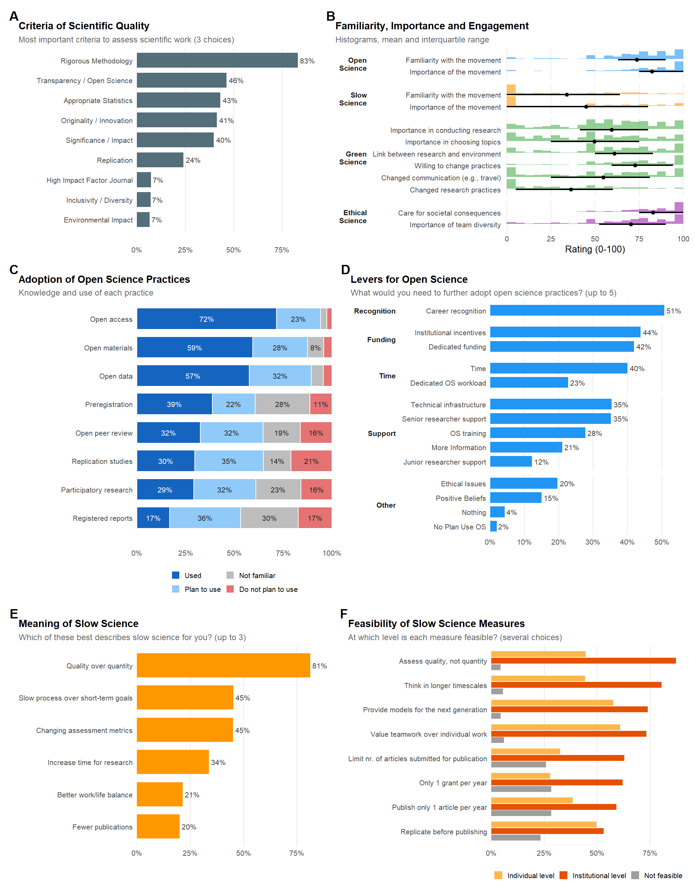{width=1008}
:::
:::


### Facets


::: {.cell}

```{.r .cell-code}
# Figure "facets" of the manuscript: EFA loadings next to the item correlations
# (same item order), facet correlations (CFA) and structure of quality criteria
movement_colors <- c("Open Science" = "#2196F3", "Slow Science" = "#FF9800",
                     "Green Science" = "#4CAF50", "Ethical Science" = "#9C27B0")
facet_colors <- c("Open Science" = "#2196F3", "Rigorous Science" = "#3F51B5", "Slow Science" = "#FF9800",
                  "Green Science" = "#4CAF50", "Ethical Science" = "#9C27B0")
item_labels <- c(
  "Open Science - Importance"               = "Importance of open science",
  "Endorsement - Open Data"                 = "Open data",
  "Endorsement - Open Materials"            = "Open materials",
  "Endorsement - Open Access"               = "Open access",
  "Endorsement - Preregistration"           = "Preregistration",
  "Endorsement - Registered Reports"        = "Registered reports",
  "Endorsement - Replication Studies"       = "Replication studies",
  "Endorsement - Participatory Research"    = "Participatory research",
  "Endorsement - Open Peer Review"          = "Open peer review",
  "Slow Science - Familiarity"              = "Familiarity with slow science",
  "Slow Science - Importance"               = "Importance of slow science",
  "Green Science - Ecofriendly Practices"   = "Importance in conducting research",
  "Green Science - Ecofriendly Topics"      = "Importance in choosing topics",
  "Green Science - Changed Practices"       = "Changed research practices",
  "Green Science - Changed Communication"   = "Changed communication (e.g., travel)",
  "Green Science - Change Willingness"      = "Willing to change practices",
  "Green Science - Belief Relation"         = "Link between research and environment",
  "Ethical Science - Team Diversity"        = "Importance of team diversity",
  "Ethical Science - Societal Consequences" = "Care for societal consequences"
)
stopifnot(setequal(names(item_labels), names(df_resprac)))
diverging <- scale_fill_gradient2(low = "#D6604D", mid = "white", high = "#4D4D4D", limits = c(-1, 1), na.value = "white",
                                  name = "Loading / r", breaks = c(-1, -0.5, 0, 0.5, 1))
theme_heat <- theme_minimal(base_size = 10) +
  theme(panel.grid = element_blank(), plot.title = element_text(face = "bold", size = 11),
        plot.subtitle = element_text(color = "grey40", size = 9), plot.title.position = "plot")

# Items ordered by the facet they load most on, then by loading
facet_names <- setNames(str_replace_all(names(efa_ids), "\n", " "), efa_ids)
efa_long <- as.data.frame(f) |>
  select(Variable, all_of(unname(efa_ids))) |>
  pivot_longer(-Variable, names_to = "Factor", values_to = "Loading") |>
  mutate(Facet = factor(facet_names[Factor], levels = names(facet_colors)))
efa_main <- slice_max(efa_long, abs(Loading), by = Variable, with_ties = FALSE) |>
  arrange(Facet, desc(abs(Loading)))
item_order <- efa_main$Variable
item_levels <- rev(unname(item_labels[item_order]))  # First item on top
efa_long <- mutate(efa_long, Item = factor(item_labels[Variable], levels = item_levels))

p_strip <- tibble(Variable = item_order) |>
  mutate(Item = factor(item_labels[Variable], levels = item_levels),
         Movement = case_when(str_starts(Variable, "Open Science|Endorsement") ~ "Open Science",
                              str_starts(Variable, "Slow") ~ "Slow Science",
                              str_starts(Variable, "Green") ~ "Green Science",
                              .default = "Ethical Science"),
         Movement = factor(Movement, levels = names(movement_colors))) |>
  ggplot(aes(x = 1, y = Item, fill = Movement)) +
  geom_tile(width = 0.9, height = 0.9) +
  scale_fill_manual(values = movement_colors, name = "Movement") +
  scale_x_continuous(expand = c(0, 0)) +
  theme_heat +
  theme(axis.text.x = element_blank()) +
  labs(x = NULL, y = NULL, tag = "A", title = "Facets (Exploratory Factor Analysis)",
       subtitle = "Loadings of each item, by the movement it was asked under")

p_loadings <- efa_long |>
  ggplot(aes(x = Facet, y = Item)) +
  geom_tile(aes(fill = Loading), color = "white", linewidth = 0.5) +
  geom_text(aes(label = str_replace(sprintf("%.2f", Loading), "^(-?)0", "\\1"),
                color = ifelse(abs(Loading) >= 0.5, "white", "grey20"), fontface = ifelse(abs(Loading) >= 0.3, "bold", "plain")),
            size = 2.6, show.legend = FALSE) +
  geom_point(data = tibble(Facet = factor(names(facet_colors), levels = names(facet_colors))),
             aes(x = Facet, y = length(item_levels) + 0.85, color = facet_colors[as.character(Facet)]), inherit.aes = FALSE,
             shape = 15, size = 3.5, show.legend = FALSE) +
  diverging +
  scale_color_identity() +
  scale_x_discrete(position = "top", labels = \(x) str_remove(x, " Science")) +
  coord_cartesian(clip = "off") +
  theme_heat +
  theme(axis.text.y = element_blank(), axis.text.x.top = element_text(size = 8, angle = 45, hjust = 0, vjust = 0, margin = margin(b = 10))) +
  labs(x = NULL, y = NULL)

# Item correlations, in the same order, with the items of each facet framed
cor_long <- as.data.frame(as.table(cor(df_resprac, use = "pairwise.complete.obs"))) |>
  transmute(Row = factor(item_labels[as.character(Var1)], levels = item_levels),
            Col = factor(item_labels[as.character(Var2)], levels = rev(item_levels)),
            r = ifelse(Var1 == Var2, NA, Freq))
n_items <- length(item_order)
facet_blocks <- efa_main |>
  mutate(k = row_number()) |>
  summarise(xmin = min(k) - 0.5, xmax = max(k) + 0.5, .by = Facet) |>
  mutate(ymin = n_items - xmax + 1, ymax = n_items - xmin + 1)
p_cor_items <- cor_long |>
  ggplot(aes(x = Col, y = Row)) +
  geom_tile(aes(fill = r), color = "white", linewidth = 0.3) +
  geom_text(aes(label = ifelse(!is.na(r) & abs(r) >= 0.3, str_replace(sprintf("%.2f", r), "^(-?)0", "\\1"), ""),
                color = ifelse(!is.na(r) & abs(r) >= 0.5, "white", "grey20")), size = 2.2, show.legend = FALSE) +
  geom_rect(data = facet_blocks, aes(xmin = xmin, xmax = xmax, ymin = ymin, ymax = ymax, color = facet_colors[as.character(Facet)]),
            inherit.aes = FALSE, fill = NA, linewidth = 1, show.legend = FALSE) +
  diverging +
  scale_color_identity() +
  theme_heat +
  theme(axis.text = element_blank()) +
  labs(x = NULL, y = NULL, tag = "B", title = "Item Correlations",
       subtitle = "Items in the same order as in A; |r| ≥ .30 labelled; facets framed")

# Facet correlations (CFA), significant ones only
facet_pos <- tibble(Facet = c("Slow Science", "Green Science", "Ethical Science", "Rigorous Science", "Open Science"),
                    angle = (90 - 72 * 0:4) * pi / 180) |>
  mutate(x = cos(angle), y = sin(angle), Latent = str_replace(Facet, " ", "_"))
cfa_cor <- lavaan::parameterEstimates(fit_cfa) |>
  filter(op == "~~", lhs != rhs) |>
  left_join(select(facet_pos, lhs = Latent, x, y), by = "lhs") |>
  left_join(select(facet_pos, rhs = Latent, xend = x, yend = y), by = "rhs")
p_cor_facets <- cfa_cor |>
  filter(ci.lower > 0 | ci.upper < 0) |>
  ggplot() +
  geom_segment(aes(x = x, y = y, xend = xend, yend = yend, linewidth = abs(est)), color = "grey55", alpha = 0.8) +
  geom_label(aes(x = (x + xend) / 2, y = (y + yend) / 2, label = str_replace(sprintf("%.2f", est), "^(-?)0", "\\1")),
             size = 3, fill = "white", label.size = 0, label.padding = unit(0.15, "lines"), color = "grey20") +
  geom_point(data = facet_pos, aes(x = x, y = y, color = Facet), size = 23) +
  geom_text(data = facet_pos, aes(x = x, y = y, label = str_replace(Facet, " ", "\n")),
            color = "white", fontface = "bold", size = 3, lineheight = 0.9) +
  scale_color_manual(values = facet_colors, guide = "none") +
  scale_linewidth_continuous(range = c(0.5, 4), guide = "none") +
  coord_equal(xlim = c(-1.25, 1.25), ylim = c(-1.1, 1.25)) +
  theme_void(base_size = 10) +
  theme(plot.title = element_text(face = "bold", size = 11), plot.subtitle = element_text(color = "grey40", size = 9),
        plot.title.position = "plot") +
  labs(tag = "C", title = "Correlations between Facets",
       subtitle = "Latent correlations (CFA) whose 95% CI excludes 0")

# Quality criteria: loadings on the two principal components
pca_var <- as.data.frame(summary(pca_criteria)) |> filter(Parameter == "Variance") |> select(-Parameter) |> unlist()
p_pca_criteria <- as.data.frame(pca_criteria) |>
  select(Variable, PC1, PC2) |>
  left_join(p_criteria$data, by = c("Variable" = "Criterion")) |>
  # Labels beside their point, on the side with room (neighbours on the other)
  mutate(side = case_when(Variable %in% c("Originality / Innovation", "High Impact Factor Journal", "Replication") ~ "left",
                          Variable == "Significance / Impact" ~ "below",
                          .default = "right"),
         offset = 0.04 + 0.08 * sqrt(pct),
         label_x = PC1 + case_when(side == "left" ~ -offset, side == "right" ~ offset, .default = 0),
         label_y = PC2 - ifelse(side == "below", offset, 0),
         hjust = case_when(side == "left" ~ 1, side == "right" ~ 0, .default = 0.5)) |>
  ggplot(aes(x = PC1, y = PC2)) +
  geom_hline(yintercept = 0, color = "grey80") +
  geom_vline(xintercept = 0, color = "grey80") +
  geom_point(aes(size = pct), color = "#546E7A", alpha = 0.8) +
  geom_text(aes(x = label_x, y = label_y, label = Variable, hjust = hjust), size = 2.9, color = "grey20") +
  scale_size_area(max_size = 9, guide = "none") +
  scale_x_continuous(limits = c(-0.8, 0.9), breaks = c(-0.5, 0, 0.5)) +
  scale_y_continuous(limits = c(-0.7, 0.7)) +
  theme_minimal(base_size = 10) +
  theme(panel.grid.minor = element_blank(), plot.title = element_text(face = "bold", size = 11),
        plot.subtitle = element_text(color = "grey40", size = 9), plot.title.position = "plot",
        axis.title = element_text(size = 8.5)) +
  labs(tag = "D", title = "Structure of Quality Criteria",
       subtitle = "Loadings on the principal components (point size: % selecting)",
       x = sprintf("PC1 (%.0f%%): rigour and transparency (−) vs. novelty and impact (+)", 100 * pca_var[1]),
       y = sprintf("PC2 (%.0f%%): transparency and inclusivity (−) vs. rigour and innovation (+)", 100 * pca_var[2]))

fig_facets <- ((p_strip | p_loadings | p_cor_items) + plot_layout(widths = c(0.35, 5, 19))) /
  ((p_cor_facets | p_pca_criteria) + plot_layout(widths = c(1, 1.25))) +
  plot_layout(heights = c(1.55, 1), guides = "collect") &
  theme(legend.position = "bottom", plot.tag = element_text(face = "bold", size = 14))
ggsave("../paper/figures/fig_facets.png", fig_facets, width = 10.5, height = 12.5, dpi = 300, bg = "white")
fig_facets
```

::: {.cell-output-display}
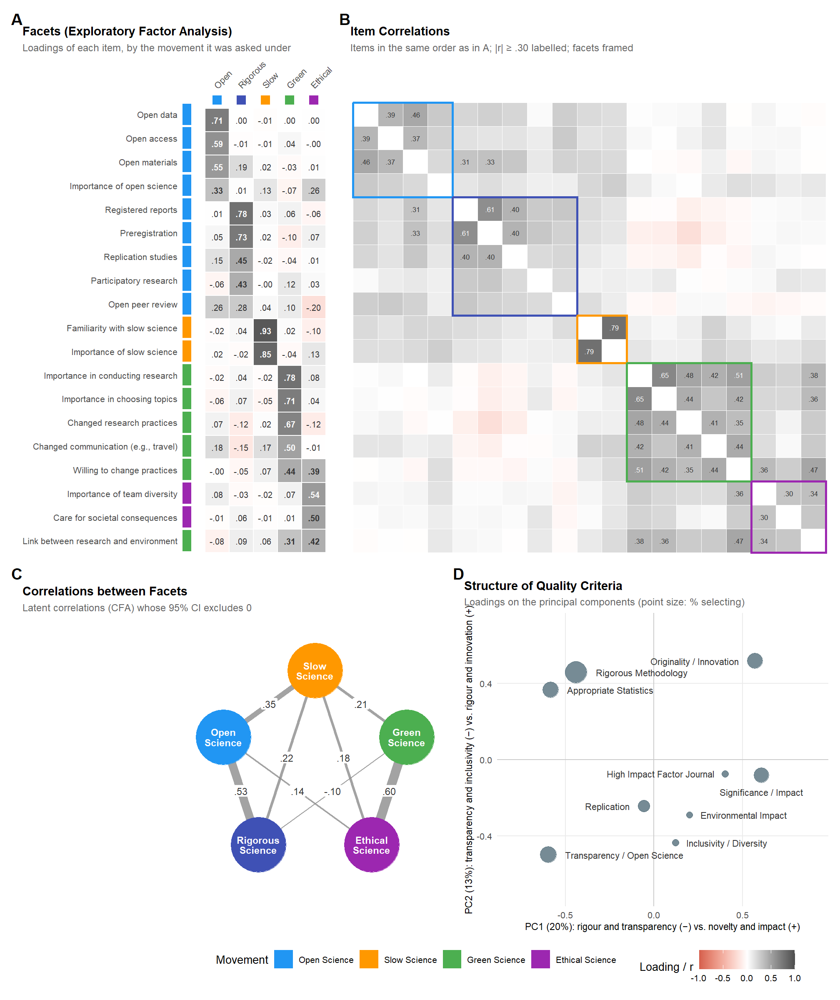{width=1008}
:::
:::


::: {.cell}

```{.r .cell-code}
# Numbers the manuscript reports on the facets (read by ../paper/manuscript.qmd)
cfa_params <- lavaan::parameterEstimates(fit_cfa, standardized = TRUE)
dir.create("../paper/results", showWarnings = FALSE)
saveRDS(list(
  n_factors = as.data.frame(summary(rez_resprac)),
  efa_loadings = efa_long |> select(Variable, Facet, Loading),
  efa_variance = as_tibble(as.data.frame(summary(f))) |> rename_with(\(n) coalesce(facet_names[n], n)),
  efa_cor = attributes(f)$model$Phi |> (\(m) `dimnames<-`(m, list(facet_names[rownames(m)], facet_names[colnames(m)])))(),
  cfa_fit = as.data.frame(performance::model_performance(fit_cfa)),
  cfa_loadings = filter(cfa_params, op == "=~") |> select(Facet = lhs, Item = rhs, est = std.all, ci.lower, ci.upper),
  cfa_cor = filter(cfa_params, op == "~~", lhs != rhs, lhs %in% facet_pos$Latent) |>
    select(Facet1 = lhs, Facet2 = rhs, r = est, ci.lower, ci.upper),
  item_cor = cor(df_resprac, use = "pairwise.complete.obs"),
  cfa_comparison = cfa_comparison,
  criteria_cor = as_tibble(cor_pairs(df_quality_num)),
  criteria_n_components = as.data.frame(summary(rez_criteria)),
  criteria_pca = as_tibble(as.data.frame(pca_criteria)) |> select(Variable, PC1, PC2),
  criteria_pca_variance = pca_var
), "../paper/results/facets.rds")
```
:::


::: {.cell}
::: {.cell-output-display}
::: {.callout-note collapse="true" title="Facets: confirmatory factor analysis (Markdown table, for text readers)"}

Table: CFA fit

| Chi2| Chi2_df| CFI| NNFI| RMSEA| RMSEA_CI_low| RMSEA_CI_high| SRMR|
|------:|-------:|----:|----:|-----:|------------:|-------------:|----:|
| 526.21| 142| 0.89| 0.87| 0.06| 0.06| 0.07| 0.06|

Table: CFA standardized loadings

|Facet |Item | est| ci.lower| ci.upper|
|:----------------|:-----------------------------------|----:|--------:|--------:|
|Open_Science |OS_Importance | 0.39| 0.07| 0.11|
|Open_Science |OS_Open_Data | 0.67| 0.16| 0.21|
|Open_Science |OS_Open_Materials | 0.69| 0.18| 0.23|
|Open_Science |OS_Open_Access_Publication | 0.55| 0.11| 0.15|
|Rigorous_Science |OS_Study_Preregistration | 0.78| 0.29| 0.35|
|Rigorous_Science |OS_Registered_Reports | 0.77| 0.25| 0.30|
|Rigorous_Science |OS_Replication_Studies | 0.53| 0.15| 0.21|
|Rigorous_Science |OS_Participatory_Research | 0.36| 0.11| 0.17|
|Rigorous_Science |OS_Open_Peer_Review | 0.38| 0.11| 0.17|
|Green_Science |GS_Importance_conducting | 0.80| 0.20| 0.24|
|Green_Science |GS_Importance_topic | 0.71| 0.19| 0.24|
|Green_Science |GS_Changes_practices | 0.58| 0.16| 0.20|
|Green_Science |GS_Changes_communication_practices | 0.54| 0.16| 0.21|
|Green_Science |GS_Relation_Research_Sustainability | 0.54| 0.14| 0.18|
|Green_Science |GS_Change_practices_agreeing | 0.68| 0.15| 0.19|
|Slow_Science |SS_Importance | 0.92| 0.32| 0.39|
|Slow_Science |SS_Familiar | 0.86| 0.25| 0.31|
|Ethical_Science |ES_Importance_research_team | 0.63| 0.14| 0.20|
|Ethical_Science |ES_Consequences_society | 0.49| 0.08| 0.12|

Table: CFA latent correlations

|Facet1 |Facet2 | r| ci.lower| ci.upper|
|:----------------|:----------------|-----:|--------:|--------:|
|Open_Science |Rigorous_Science | 0.53| 0.45| 0.61|
|Open_Science |Green_Science | 0.05| -0.04| 0.15|
|Open_Science |Slow_Science | 0.35| 0.26| 0.43|
|Open_Science |Ethical_Science | 0.14| 0.01| 0.27|
|Rigorous_Science |Green_Science | -0.10| -0.19| -0.01|
|Rigorous_Science |Slow_Science | 0.22| 0.13| 0.31|
|Rigorous_Science |Ethical_Science | 0.06| -0.06| 0.18|
|Green_Science |Slow_Science | 0.21| 0.12| 0.29|
|Green_Science |Ethical_Science | 0.60| 0.49| 0.70|
|Slow_Science |Ethical_Science | 0.18| 0.07| 0.29|

:::

:::
:::


### Structure of Research Values


::: {.cell}

```{.r .cell-code}
(wrap_elements(p_cor + 
                scale_x_discrete(expand = expansion(mult = c(0, 0.2))) +
                theme(panel.grid.major = element_blank())) | wrap_elements(p_resprac)) / 
  wrap_elements(p_cfa) /
  wrap_elements(p_radar) +
  plot_layout(heights = c(0.45, 0.3, 0.25)) +
  plot_annotation(title = "Researcher Profiles", theme = theme(plot.title = element_text(size = 18, face = "bold.italic", hjust = 0.5)))
```

::: {.cell-output-display}
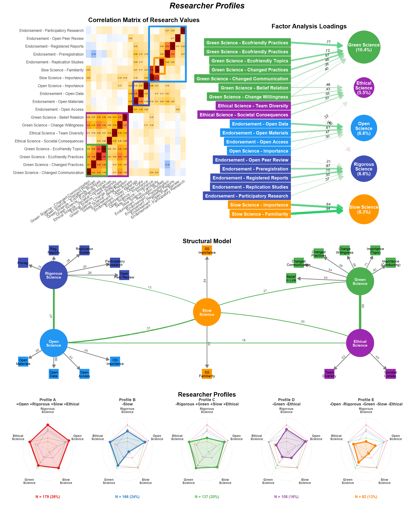{width=1248}
:::
:::


### Predictors of Research Values


::: {.cell}

```{.r .cell-code}
p_resval_pred1 /
  p_resval_pred2 / 
  p_resval_pred3 +
  # plot_layout(guides = "collect") +
  plot_annotation(title = "Research Values", theme = theme(plot.title = element_text(size = 18, face = "bold.italic", hjust = 0.5)))
```

::: {.cell-output-display}
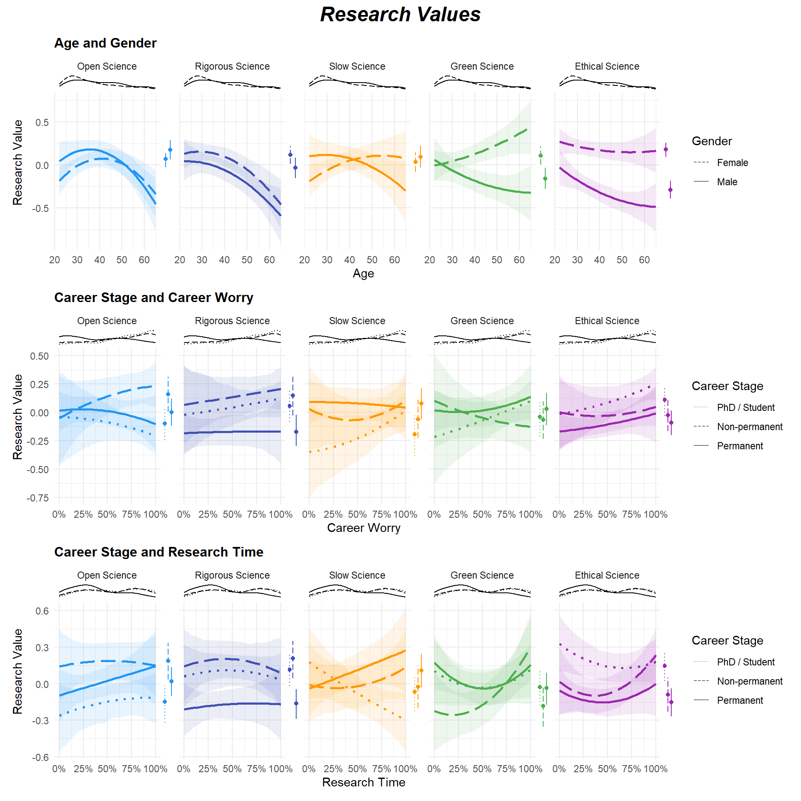{width=960}
:::
:::

