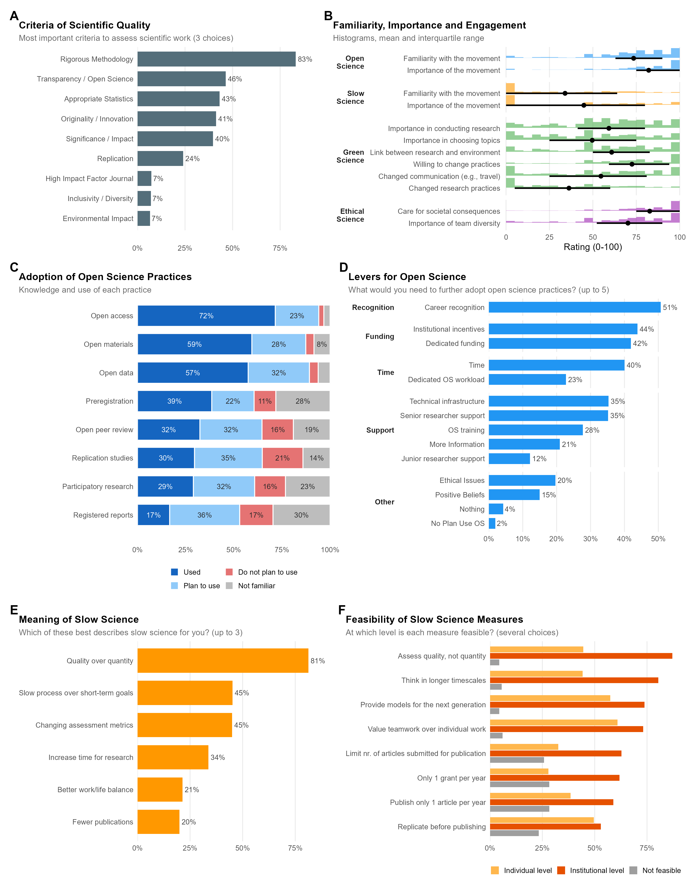
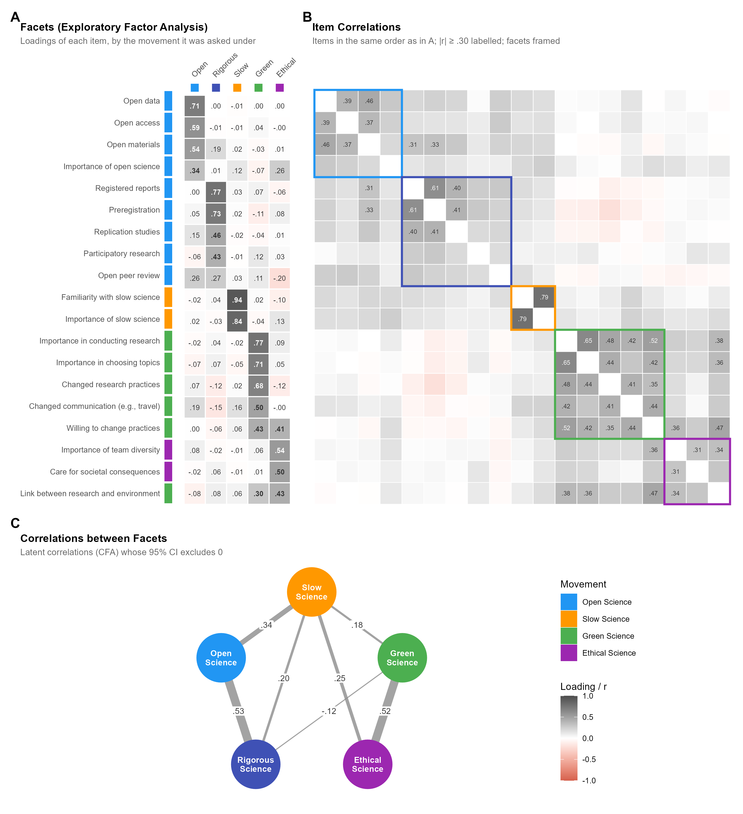
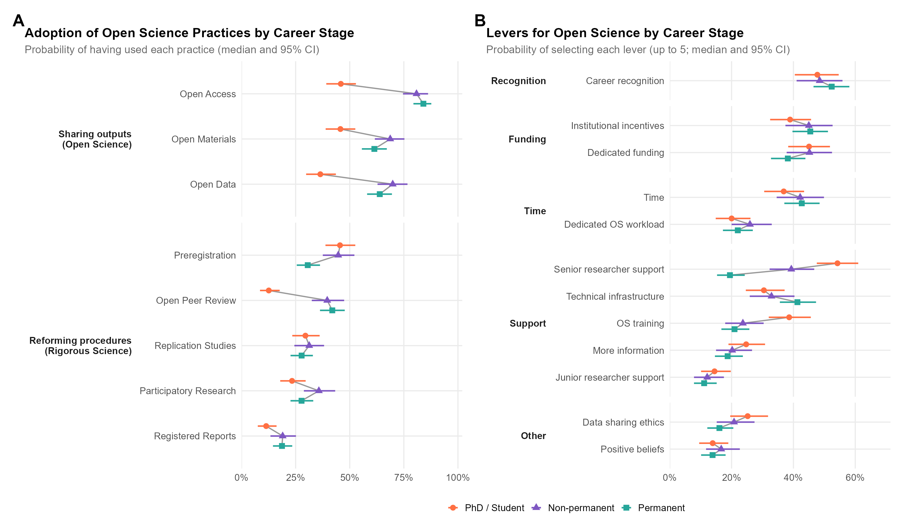
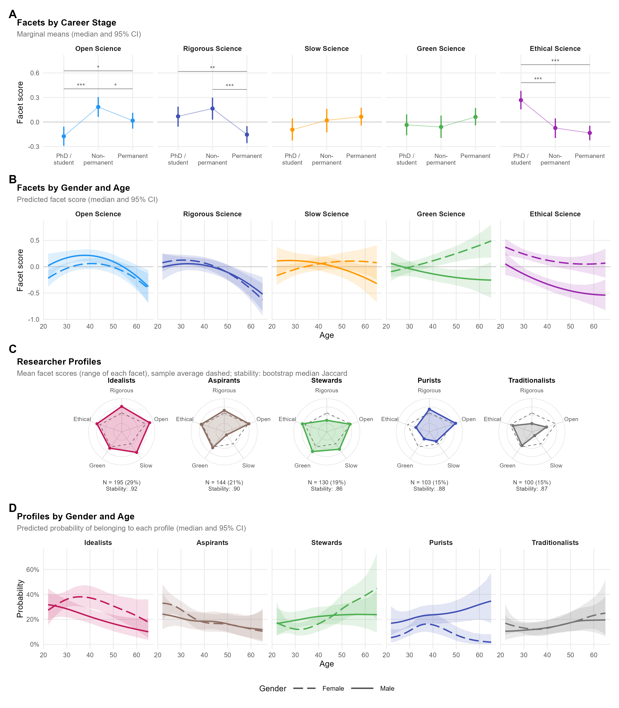

```{r}
#| label: setup
#| include: false

# Sample description, from the data used by ../analysis/analysis.qmd (same renaming)
library(tidyverse)

question_labels <- readxl::read_xlsx("../data/MapResPrac_correspondance.xlsx")
df <- read.csv("../data/MapResPrac-130726-N682.csv")
names(df) <- as.character(as.vector(question_labels[1,])) |>
  str_replace_all(fixed(".  "), "_") |>
  str_replace_all(fixed(". "), "_") |>
  str_replace_all(fixed("."), "_") |>
  str_replace_all(fixed(" "), "_") |>
  str_replace_all(fixed("/"), "_")

# Inclusion criterion: researchers working in Europe (free-text country of the
# workplace, rule shared with the analysis)
source("../analysis/inclusion.R")
n_raw <- nrow(df)
n_outside <- sum(works_outside_europe(df$Work_Country))
outside_countries <- sort(unique(clean_country(df$Work_Country)[works_outside_europe(df$Work_Country)]))
df <- filter(df, !works_outside_europe(Work_Country))

df <- mutate(df,
  Country = clean_country(Work_Country),
  Age = ifelse(Dem_Age < 18, NA, Dem_Age),
  Time = Time / 60
)

n <- nrow(df)
fmt <- function(x, digits = 1) sprintf(paste0("%.", digits, "f"), x)
pct <- function(x) fmt(100 * mean(x, na.rm = TRUE))
n_gender <- function(g) sum(df$Dem_Gender == g)
pct_position <- function(p) pct(df$Work_Position %in% p)
pct_discipline <- function(d) pct(df$Work_Discipline == d)
pct_country <- function(c) pct(df$Country[!is.na(df$Country)] == c)
countries <- unique(na.omit(df$Country))

# Results, landscape: percentages are of all respondents (unticked boxes of the
# slow science feasibility grid are empty); sliders are on their 0-100 scale
yes <- function(x) pct(x == "Yes")
ticked <- function(x) pct(replace_na(x, 0) == 1)
use_answers <- c(used = "I know it and I used it",
                 plan = "I haven't used it yet, but I plan to do it in the future",
                 unfamiliar = "I am not familiar with it",
                 no = "I haven't used it yet, and I don't plan to do it in the future")
pct_use <- function(x, answer) pct(x == use_answers[[answer]])
m_sd <- function(x) paste0("*M* = ", fmt(mean(x, na.rm = TRUE)), ", *SD* = ", fmt(sd(x, na.rm = TRUE)))
crit <- function(x) yes(df[[paste0("Work_Criteria_quality_science_", x)]])
# Slow science: the importance question and the definitions were mandatory, also
# for the participants not at all familiar with the movement, who nearly all rated
# its importance 0 (chunk slow_science_ratings of the analysis). Both are
# described among the familiar participants
ss_fam <- df$SS_Familiar > 0
yes_fam <- function(x) yes(x[ss_fam])
pct_at <- function(x, value) pct(x == value)

# Results, facets: computed by ../analysis/analysis.qmd (chunk export_facets)
facets <- readRDS("results/facets.rds")
fmt_r <- function(x, digits = 2) sub("^(-?)0\\.", "\\1.", sprintf(paste0("%.", digits, "f"), x))  # No leading zero (APA)
# EFA loading of an item (as named in the analysis) on a facet
efa_l <- function(item, facet) {
  fmt_r(with(facets$efa_loadings, Loading[Variable == item & Facet == facet]))
}
cfa_row <- function(a, b) {
  a <- str_replace(a, " ", "_"); b <- str_replace(b, " ", "_")
  filter(facets$cfa_cor, (Facet1 == a & Facet2 == b) | (Facet1 == b & Facet2 == a))
}
cfa_r <- function(a, b) with(cfa_row(a, b), paste0(fmt_r(r), " [", fmt_r(ci.lower), ", ", fmt_r(ci.upper), "]"))
cfa_fit <- function(index, digits = 2) fmt_r(facets$cfa_fit[[index]], digits)
nf <- facets$n_factors
cfa_alt <- function(model, index, digits = 3) fmt_r(facets$cfa_comparison[[index]][facets$cfa_comparison$Model == model], digits)
# Likelihood ratio test of a model nested in the retained (cross-loadings) one
cfa_lrt <- function(model) {
  with(filter(facets$cfa_lrt, Model == model),
       paste0("$\\Delta\\chi^2$(", Df_diff, ") = ", fmt(Chisq_diff), ", *p* ", ifelse(p < .001, "< .001", paste("=", fmt_r(p, 3)))))
}

# Results, profiles: computed by ../analysis/analysis.qmd (chunk export_profiles)
profiles <- readRDS("results/profiles.rds")
# "Median [95% CI]" of the one row of `tab` selected by `...`, times `scale`
est <- function(tab, ..., scale = 1, digits = 2, unit = "") {
  row <- filter(as.data.frame(tab), ...)
  stopifnot(nrow(row) == 1)
  x <- scale * c(if ("Median" %in% names(row)) row$Median else row$Predicted, row$CI_low, row$CI_high)
  x[round(x, digits) == 0] <- 0  # No "-0.00"
  sprintf(paste0("%.", digits, "f%s [%.", digits, "f, %.", digits, "f]"), x[1], unit, x[2], x[3])
}
# Men - women, at the mean age or at a given age
gender_gap <- function(facet, age = NULL) {
  if (is.null(age)) return(est(profiles$age_contrasts, Outcome == facet))
  est(profiles$age_contrasts_at, Outcome == facet, Dem_Age == age)
}
age_slope <- function(facet, gender) est(profiles$age_slopes, Outcome == facet, Dem_Gender == gender, scale = 10)  # Per decade
# Profiles are referred to by their descriptive name (chunk profile_names of the analysis)
prof_pct <- function(name) with(profiles$profiles, fmt(100 * N[Name == name] / sum(N), 0))
prof_mean <- function(name, facet) fmt(profiles$profiles[[str_replace(facet, " ", "_")]][profiles$profiles$Name == name], 2)
prof_stab_range <- function(names, what) {
  x <- profiles$profile_stability[[what]][profiles$profile_stability$Name %in% names]
  if (what == "Median Jaccard") paste0(fmt_r(min(x)), "--", fmt_r(max(x))) else paste0(fmt(min(x), 0), "--", fmt(max(x), 0))
}
# Characteristics not used to define the profiles (chunk profile_correlates of the
# analysis): value in a profile, and range over the other four
prof_char <- function(name, what, digits = 0) fmt(with(profiles$profile_correlates, Value[Name == name & Characteristic == what]), digits)
prof_char_others <- function(name, what, digits = 0) {
  x <- with(profiles$profile_correlates, Value[Name != name & Characteristic == what])
  paste0(fmt(min(x), digits), "--", fmt(max(x), digits))
}
# Number of clusters, observed vs. 10 datasets simulated without groups (chunk
# cluster_null of the analysis)
null_votes <- function(k, what = "Without groups (mean)", digits = 1) fmt(with(profiles$cluster_null_votes, get(what)[Clusters == k]), digits)
null_fit <- function(k, what) fmt_r(with(profiles$cluster_null_fit, get(what)[Clusters == k]))
ss_stage_range <- function(name) {  # Unfamiliarity with slow science, range over the career stages
  x <- with(profiles$profile_ss_stage, `Not familiar with slow science (%)`[Name == name])
  paste0(fmt(min(x), 0), "--", fmt(max(x), 0))
}
ari <- function(k) with(profiles$cluster_stability, paste0(fmt_r(`Median ARI`[Clusters == k]), " [", fmt_r(`2.5%`[Clusters == k]), ", ", fmt_r(`97.5%`[Clusters == k]), "]"))
# Differences in profile probability, in percentage points: men - women at an age, and 55 - 25 years in a gender
prof_gender <- function(name, age) est(profiles$profile_gender, Name == name, Dem_Age == age, scale = 100, digits = 0)
prof_age <- function(name, gender) est(profiles$profile_age, Name == name, Dem_Gender == gender, scale = 100, digits = 0)
nc <- profiles$n_clusters

# Results, career stage, training, discipline, country and robustness checks:
# computed by ../analysis/analysis.qmd (chunk export_career). Contrasts are
# Level1 - Level2 (e.g., "Permanent" - "PhD / Student")
career <- readRDS("results/career.rds")
stage_est <- function(tab, outcome, level1, level2, ...) est(tab, Outcome == outcome, Level1 == level1, Level2 == level2, ...)
h1_pct <- function(var, stage) fmt(career$h1_desc[[var]][career$h1_desc$Work_Career_Stage == stage], 0)
h2_pct <- function(practice, stage, var = "Used (%)") fmt(with(career$h2_desc, get(var)[Practice == practice & Work_Career_Stage == stage]), 0)
h3_pct <- function(lever, stage) fmt(career$h3_desc[[stage]][career$h3_desc$Lever == lever], 0)
train_gap <- function(facet, level1, level2, model) est(career$training_contrasts, Facet == facet, Model == model, Level1 == level1, Level2 == level2)
train_eff <- function(facet, training) est(career$training_effects, Facet == facet, Training == training)
disc_gap <- function(facet, level1, level2) est(career$disc_contrasts, Facet == facet, Level1 == level1, Level2 == level2)
disc_pct <- function(var, discipline) fmt(career$discipline_desc[[var]][career$discipline_desc$Work_Discipline == discipline], 0)
gender_gap_disc <- function(facet) est(career$gender_gap_disc, Facet == facet)
# Well-being: slopes per unit of facet score on 0-1 ratings, expressed as points on
# the 0-100 scale per SD of the facet score
wb_eff <- function(outcome, facet) est(career$wb_effects, Outcome == outcome, Facet == facet, scale = 100 * career$facet_sd[[facet]], digits = 1)
region_gap <- function(facet, adjusted = FALSE) est(if (adjusted) career$region_contrasts_adj else career$region_contrasts, Facet == facet)
region_val <- function(indicator, region, digits = 0) fmt(career$region_desc[[indicator]][career$region_desc$Region == region], digits)
slow_r <- function(variant, facet) fmt_r(career$slow_sensitivity[[facet]][str_detect(career$slow_sensitivity$Variant, fixed(variant))])
# Slow Science with the importance of unfamiliar participants missing (chunks
# slow_science_ratings and slow_science_profiles of the analysis)
slow_miss_r <- function(col, digits = 2) fmt_r(career$slow_missing[[col]], digits)
# Limitations: career stage (rule of the analysis) by country and discipline
df$Stage <- case_when(
  df$Work_Position %in% c("Master student/Research assistant", "PhD candidate (scholarship, other funding)",
                          "PhD candidate (no funding/self funded)") ~ "PhD / Student",
  df$Work_Position %in% c("Postdoc (fixed term)", "Researcher/lecturer (fixed term)", "Engineer (fixed term)") ~ "Non-permanent",
  df$Work_Position == "Permanent position" ~ "Permanent")
stage_share <- function(stage, x) fmt(100 * mean(x[df$Stage %in% stage], na.rm = TRUE), 0)
in_france <- str_detect(df$Country, "France")
in_physical <- df$Work_Discipline == "Physical Sciences & Engineering"
# Limitations: Rigorous Science when unfamiliarity is treated as missing (chunk scoring_sensitivity)
scoring_r <- function(participants, facet = "Rigorous_Science") {
  fmt_r(with(facets$scoring_agreement, get(facet)[Scoring == "Unfamiliarity missing" & Participants == participants]))
}
# Limitations: item format. The importance of open science is the only 0-100 rating on the epistemic side
ic <- facets$item_cor
practice_rows <- str_subset(rownames(ic), "^Endorsement - ")
societal_rows <- str_subset(rownames(ic), "^(Green|Ethical) Science - ")
r_range <- function(x) paste0(fmt_r(min(x)), " to ", fmt_r(max(x)))
os_imp_societal <- r_range(ic["Open Science - Importance", societal_rows])
os_imp_practices <- r_range(ic["Open Science - Importance", practice_rows])
practice_societal_abs <- fmt_r(mean(abs(ic[practice_rows, societal_rows])))
slow_prof <- function(variant, k, col) with(career$slow_profiles, get(col)[Variant == variant & Clusters == k])
# Profiles by discipline and country (multinomial models), Gaussian mixtures, and
# preregistration within disciplines (chunks profile_composition, profile_gmm and
# prereg_discipline of the analysis). Differences in percentage points
pc_test <- function(test) with(filter(career$profile_comp_tests, Test == test),
  paste0("$\\chi^2$(", df, ") = ", fmt(Chi2), ", *p* ", ifelse(p < .001, "< .001", paste("=", fmt_r(p, 3)))))
pc_eff <- function(model, contrast, name) {
  est(career$profile_comp_effects, Model == model, Contrast == contrast, Name == name, scale = 100, digits = 0)
}
pc_adj <- function(contrast, name) pc_eff("Adjusted for discipline and region", contrast, name)
gmm <- career$gmm_summary
num_word <- function(n) c("one", "two", "three", "four", "five", "six", "seven", "eight", "nine")[n]
prereg_d <- function(subset, level2 = "PhD / Student") {
  est(career$prereg_disc_diff, Subset == subset, Level1 == "Permanent", Level2 == level2, scale = 100, digits = 0)
}
prereg_pct <- function(discipline, stage) {
  fmt(with(career$prereg_disc_desc, `Preregistration used (%)`[Work_Discipline == discipline & Region == "All" & Work_Career_Stage == stage]), 0)
}
rig_ssh <- function(level1) est(career$rigorous_ssh, Level1 == level1)
# Primary career-stage model of the facets: facet ~ career stage (chunk training_facets);
# the models with career worry or time for research are sensitivity analyses
stage_main <- function(facet, level1, level2) train_gap(facet, level1, level2, "Career stage")
# Robustness to knowledge and opportunity (chunk knowledge_robustness)
unfam_d <- function(practice, level2 = "PhD / Student") {
  est(career$h1_unfamiliar_contrasts, Outcome == practice, Level1 == "Permanent", Level2 == level2, scale = 100, digits = 0)
}
pub_d <- function(practice, level1, level2 = "PhD / Student") {
  est(career$h2_pub_contrasts, Outcome == practice, Level1 == level1, Level2 == level2, scale = 100, digits = 0)
}
pub_mean <- function(practice, stage) fmt(100 * with(career$h2_pub_means, Median[Outcome == practice & Work_Career_Stage == stage]), 0)
slow_fam_d <- function(outcome) est(career$slow_stage_familiar, Outcome == outcome, Level1 == "Permanent", Level2 == "PhD / Student")
know_d <- function(facet, comparison, level1, level2, sample = "Knows all practices") {
  est(career$knowers_robustness, Facet == facet, Sample == sample, Comparison == comparison, Level1 == level1, Level2 == level2)
}
inv_delta <- function(grouping, level, index = "Delta CFI") fmt_r(with(career$invariance, get(index)[Grouping == grouping & Level == level]), 3)
crit_d <- function(criterion, facet) fmt_r(career$criteria_facets[[facet]][career$criteria_facets$Criterion == criterion])
# Differences in probability, in percentage points
pp <- function(tab, outcome, level1, level2) stage_est(tab, outcome, level1, level2, scale = 100, digits = 0)
h3_range <- function(levers) {  # Range over the career stages (and levers)
  x <- unlist(career$h3_desc[career$h3_desc$Lever %in% levers, c("PhD / Student", "Non-permanent", "Permanent")])
  paste0(fmt(min(x), 0), "--", fmt(max(x), 0))
}
prec_mean <- with(career$precarious_desc, fmt(sum(N * `P(permanent) mean`) / sum(N), 2))
```

\clearpage

# Introduction

Over the past two decades, the reliability of published findings has become a central concern in several empirical disciplines, especially psychology, the social sciences and biomedicine [@ioannidis2005why; @opensciencecollaboration2015estimating]. Large-scale replication projects and surveys on questionable research practices [@john2012measuring] showed that part of the published evidence is less robust than assumed. Beyond methodological issues, this "replication crisis" opened a broader reflection on how research is organised: publication systems, evaluation criteria and career incentives [@ioannidis2015metaresearch; @lilienfeld2017replication].

The most visible response has been open science, an umbrella term for practices that make the research process more transparent and accessible to anyone, in academia and beyond, such as preregistration, the sharing of data, materials and code, and open access publication [@fecher2014open; @pontika2015fostering]. Open science is supported at the institutional level in many countries. The San Francisco Declaration on Research Assessment calls for evaluating research on its content rather than on journal metrics [@dora2012], and the European Commission has made open access a condition of funding [@guedj2015european], so that open science practices are increasingly valued in research careers [@cabellovaldes2017evaluation]. In France, the national plans for open science and the open archive HAL encourage, and sometimes require, the deposit of scientific publications [@mesri2021plan]. Despite this support, adoption remains heterogeneous, and open science can also be perceived as an additional, time-consuming task. Most European researchers surveyed in 2017 were not familiar with the concept of open science [@cabellovaldes2017evaluation]. Awareness has increased since then [@christensen2019open], but practices are adopted at very different rates, open access for instance much more than preregistration [@norris2022development], a practice that has to be performed before the data are collected or analysed.

Open science is not the only reform-oriented framework, and several other concerns have emerged in the scientific community. The slow science movement criticises the pressure to publish fast and argues that a slower pace favours deeper and more reliable work, at the cost of publishing less [@stengers2018another; @frith2020fast]; @frith2020fast even proposed to limit the number of publications per researcher per year. In a similar vein, sustainable (or green) science addresses the environmental and societal costs of research, such as the carbon footprint of travel and computing [@mariette2022open]. Finally, ethical and inclusive science focuses on equity, diversity and representation in research teams and samples, for instance the participation of under-represented groups in the scientific process, such as persons with disabilities, or women in the disciplines where men still predominate [@fox2021open]. These frameworks are mostly discussed separately, although they share concerns about research quality and responsibility.

Their compatibility is not trivial. Some open science practices fit well with slow science: preregistration and replication require time and favour quality over quantity, as they require anticipating the hypotheses and analyses. Other practices might be questioned. Preprints increase the number of shared articles, and open science takes no explicit position on publication volume, with consequences for the amount of information available and for the environmental footprint of research. Similarly, article processing charges for open access may exclude researchers with fewer resources, in tension with inclusivity goals [@fox2021open], and international collaboration and conference attendance conflict with the carbon reduction called for by sustainable science. Whether researchers perceive these frameworks as one coherent reform or as competing demands has, to our knowledge, not been investigated.

In this article, we refer to open, slow, sustainable, and ethical and inclusive science as reform *movements*, i.e., the frameworks under which reform-oriented practices are promoted and discussed. We refer to the dimensions along which researchers' attitudes and practices actually vary as the *facets* of reform-oriented science. Facets and movements need not coincide: a movement may split into several facets if its practices are adopted independently of one another, and several movements may merge into a single facet if the same researchers endorse them together. Whether reform-oriented science is one project with several facets, or a set of separate movements, is thus an empirical question.

Career stage and employment conditions are likely central in these dynamics. Early-career researchers are often presented as drivers of open science [@farnham2017early; @nicholas2019so] and receive more training in it during their PhD or early career. Yet they are less involved in decision making at the institutional level, from the laboratory to the university, in grant applications and in publication strategy [@allen2019open], and are more exposed to precarious contracts and to the "publish or perish" pressure [@enright2017developing; @herschberg2018precarious]. Surveys consistently report that early-career researchers value open science but apply it only partly, and that lack of time and lack of institutional support are the main barriers [@zecevic2020exploring; @toribioflorez2021where; @pownall2023uk]. These studies, however, share several limits: they focus mainly or only on open science, they sample early-career researchers without comparison to later career stages, they are often restricted to one institution or country, and they do not distinguish career stage from precariousness. It therefore remains unclear which barriers are specific to career stage, which are specific to precarious employment, and how attitudes towards open science relate to the other movements.

## The present study

The present study addresses these questions with an online survey of researchers at all career stages, from PhD students to emeritus researchers, involved in experimental research in the social sciences, life sciences and physical sciences. The survey targeted researchers working in Europe, with a particular focus on France, where most of the authors are based. We measured knowledge of, attitudes towards and self-reported adoption of the practices promoted by four reform movements, open, slow, sustainable and ethical and inclusive science, as well as the perceived barriers to open science. We tested four preregistered hypotheses: (i) early-career researchers report more knowledge of and training in open science than senior researchers; (ii) this difference does not extend to adoption, because adoption also depends on autonomy; (iii) lack of time and lack of institutional support are the most reported barriers to open science, replicating previous findings; and (iv) barriers related to time and evaluation pressure are more reported by non-permanent researchers. We expected attitudes towards the four movements to be positively correlated, and complemented this test with exploratory analyses of the relationships between practices, to identify the facets that structure them and to reveal potential contradictions, and of how these facets relate to career stage, employment status and perceived precariousness. In addition, we explored the role of meta-scientific training and the differences between disciplines, and compared the respondents working in France with those working in other European countries, the second objective of the preregistration.

# Methods

## Participants

A total of `r n_raw` participants completed the survey. As the survey targeted researchers working in Europe, the `r n_outside` participants (`r fmt(100 * n_outside / n_raw)`%) who reported a workplace in another continent (`r paste(outside_countries, collapse = ", ")`) were excluded, which left `r n` participants. Participants had a mean age of `r fmt(mean(df$Age, na.rm = TRUE))` years (*SD* = `r fmt(sd(df$Age, na.rm = TRUE))`; `r sum(df$Dem_Age < 18, na.rm = TRUE)` implausible ages, below 18, were set to missing) and included `r n_gender("Female")` women, `r n_gender("Male")` men, `r n_gender("Non-binary")` non-binary participants and `r n_gender("Other")` participant who reported another gender. Due to the small sample of non binary participants, analyses on gender were carried on only male and female participants. Participants worked in `r length(countries)` European countries, mostly in France (`r pct_country("France")`%), followed by the United Kingdom (`r pct_country("United Kingdom")`%), Italy (`r pct_country("Italy")`%) and Germany (`r pct_country("Germany")`%). They worked across the three research domains (Social Sciences & Humanities: `r pct_discipline("Social Sciences & Humanities")`%; Physical Sciences & Engineering: `r pct_discipline("Physical Sciences & Engineering")`%; Life Sciences: `r pct_discipline("Life Sciences")`%). Regarding career stage, `r pct_position("Permanent position")`% held a permanent position, `r pct_position(c("PhD candidate (scholarship, other funding)", "PhD candidate (no funding/self funded)"))`% were PhD students (funded or self-funded), `r pct_position("Postdoc (fixed term)")`% were postdoctoral researchers, `r pct_position("Researcher/lecturer (fixed term)")`% were researchers or lecturers on fixed-term contracts, `r pct_position("Engineer (fixed term)")`% were engineers on fixed-term contracts, `r pct_position("Master student/Research assistant")`% were master students or research assistants, and `r pct_position("Other")`% reported another position. Completion times and response patterns gave no sign of careless responding: `r fmt(career$careless[["< 5 min (%)"]])`% of participants completed the survey in less than five minutes, and none gave the same rating to all the sliders of the four movements. No participant was excluded on these grounds.

## Survey

Data were collected using an online survey (LimeSurvey from Sorbonne Université) targeting researchers currently involved in experimental research, either in permanent or non-permanent positions. The survey took a median of `r fmt(median(df$Time))` minutes to complete and was distributed anonymously; data were collected with the intention of open sharing with the scientific community. Ethical approval was obtained from Université Paris Cité (IRB: 00012024-29). The study and analyses plan were pre-registered on OSF platform (<https://osf.io/2es9b>), and the data and analysis code are available at <https://github.com/DominiqueMakowski/OpenScienceArchetypes>.

The questionnaire included 39 questions, some of them grids of several items, of which each participant answered 35 to 37 depending on their position and previous answers (e.g., the questions on career prospects differed between permanent and non-permanent researchers). They were organized into the following sections: i) *Demographics and career information*: age, gender, country of workplace, academic affiliation, discipline (i.e., Social Sciences & Humanities, Physical Sciences & Engineering, Life Sciences) and subdiscipline (not mandatory), highest diploma obtained, PhD starting year, current contract type (e.g., PhD student, postdoc, permanent position), additional professional activities (e.g., clinical, committees), and the approximate distribution of working time across research, teaching, administration, popularization, and other activities. ii) *Career perceptions*: intention to pursue an academic career (for non-permanent researchers only), estimated probability of obtaining a permanent position within an acceptable timeframe, publication number, job title (for permanent researchers), estimated likelihood of career progression, and satisfaction with the number and quality of one's publications. iii) *Criteria for research quality*: participants selected up to three criteria they considered most important for assessing the quality of scientific work (e.g., innovation, methodological rigor, transparency, replication, environmental impact, inclusivity).

Then, three randomized blocks were presented, on open, slow and sustainable science, followed by the items on ethical and inclusive science **[TO CONFIRM: the text mentions three randomized blocks and lists ethical/inclusive science as a fourth part; was it randomized with the others?]**.

#### Open science

Participants rated their familiarity with the open science movement and its perceived importance, and indicated whether they had taken part in a related training. They then reported their knowledge and use of specific practices (preregistration, registered reports, open materials, open data, open peer review, open access, replication studies, participatory research), choosing between "I am not familiar with it", "I haven't used it yet, and I don't plan to do it in the future", "I haven't used it yet, but I plan to do it in the future" and "I know it and I used it". Finally, they selected up to five factors that would facilitate their further adoption of open research practices.

#### Slow science

Participants rated their familiarity with the slow science movement and its perceived importance, indicated whether they had taken part in a related training, and selected up to three statements that best define slow science for them (e.g., quality over quantity, longer timescales, fewer publications). They then rated the feasibility (at the individual level, at the institutional level, or not feasible) of specific measures (e.g., limiting the number of submitted articles, replicating before publishing, valuing teamwork over individual output).

#### Sustainable science

Participants rated the importance of environmental sustainability in how they conduct their research and in how they choose their topics, the extent to which they had changed their research practices (e.g., experimental design, material) and their communication practices (e.g., professional travel) for environmental reasons, the link they perceive between scientific production and environmental sustainability, and their willingness to change their practices for environmental reasons.

#### Ethical and inclusive science

Participants rated the importance they attribute to the diversity of the research team (e.g., in terms of neurodiversity, disability, ethnicity or gender), and to being careful about the direct consequences (e.g., benefits or harms) of their research for participants and society.

As a conclusion, general wellbeing and alignment questions were presented: overall agreement with statements regarding job fulfillment, alignment between research practices and personal principles, sufficiency of time for research, work/life balance satisfaction, and career-related worry.

Most attitudinal items were rated on continuous sliders ranging from 0 ("not at all") to 100 ("extremely"), while categorical items used single- or multiple-choice formats. Depending on hypotheses and research questions, some questions were presented as one choice questions, while others as multi-answers (but with constraints, e.g., selecting up to 3 choices).

## Procedure

The survey was shared through multiple channels to reach a broad and diverse sample of researchers. First, it was distributed within the universities and research institutes affiliated with the authors. Second, it was shared through several academic mailing lists and domain groups. Third, European researchers working in the fields under investigation (open science, environmental research, slow science...) were directly contacted and asked to relay the survey within their own professional networks.

The initial target sample size was set at 3,000 participants. However, after one year of active dissemination, the research team encountered substantial recruitment difficulties and was unable to reach this target. The team therefore decided to proceed with the planned analyses after verifying that the collected sample met three minimal criteria: a sufficient number of participants across the three research domains (Social Sciences & Humanities, Physical Sciences & Engineering, and Life Sciences), a satisfactory balance between permanent and non-permanent researchers, and a satisfactory balance between men and women, allowing to test most hypotheses.

## Data analysis

The analysis followed four steps, reported in this order. First, we described the landscape of research practices (percentage of participants selecting each option; mean, *M*, and standard deviation, *SD*, of the 0--100 sliders). Second, we examined the structure of the 19 rating items of the four movements, all scaled to 0--1: the importance of open science and the knowledge and use of eight open science practices, the familiarity with and importance of slow science, the six items on environmental sustainability and the two items on ethical and inclusive science. The knowledge and use of each practice was scored as a level of engagement ("I am not familiar with it": 0; "I haven't used it yet, and I don't plan to do it in the future": 1/3; "I haven't used it yet, but I plan to do it in the future": 2/3; "I know it and I used it": 1), unfamiliarity being placed below deliberate non-use because participants who did not know a practice were less familiar with, and less often trained in, open science than those who knew it but did not plan to use it. The number of factors was chosen by the agreement between `r sum(nf$n_Methods)` methods [@ludecke2020parameters], the structure was explored with an exploratory factor analysis [EFA; oblimin rotation; @revelle2026psych] and tested with confirmatory factor analyses (CFA) [@rosseel2012lavaan], the retained one providing the facet scores, which were compared between the participants who did and did not select each criterion of scientific quality (Cohen's *d*). The facet structure held under alternative scorings of the practices and when the practice items were treated as ordinal, and its measurement invariance across gender, career stage and discipline was tested [@chen2007sensitivity]; these analyses, and a principal component analysis of the criteria of scientific quality, are reported in the supplementary materials.

Third, we examined how the adoption of the practices and the facets differed between researchers. Hypotheses (i) to (iv) were tested by modelling each indicator of knowledge, training, adoption and barrier on career stage, in three levels: PhD students (with master students and research assistants), non-permanent positions (postdocs, and researchers, lecturers and engineers on fixed-term contracts) and permanent positions (`r career$n_stage` participants). In what follows, *early-career researchers* refers to the first two levels and *senior researchers* to the third. The facet scores were modelled with Bayesian regressions [@burkner2017brms] on career stage (and, as sensitivity analyses, on career stage in interaction with career worry or with the time available for research), and, to examine what lies behind these effects, on career stage with training in open and in slow science as covariates, and on the perceived probability of obtaining a permanent position (among the `r career$n_precarious` non-permanent researchers). The seven ratings of career perceptions and well-being were modelled on the five facets and career stage. The facet scores were then modelled on gender and age (second-degree polynomial, in interaction; `r profiles$n_age` women and men aged 65 or less), also with discipline as a covariate, on discipline, and on region (France vs. other European countries, with and without career stage and discipline as covariates).

Fourth, researcher profiles were identified by k-means clustering of the standardised facet scores [@hartigan1979algorithm], retaining the partition with the lowest within-cluster sum of squares over 200 random starts, the number of clusters being examined with the agreement between `r sum(nc$n_Methods)` methods [@charrad2014nbclust] and the stability of the solution by bootstrap, as a whole [adjusted Rand index, @hubert1985comparing] and profile by profile [Jaccard similarity, @hennig2007cluster]. To tell groups from a continuum, these diagnostics and the average silhouette width [@rousseeuw1987silhouettes] were compared with those of ten datasets simulated without groups, from a Gaussian copula with the marginal distributions and rank correlations of the facet scores. Profile membership was modelled with a Bayesian categorical regression on gender and age, and with multinomial models adding discipline and region. We report posterior medians and 95% credible intervals (CI) of marginal means, contrasts and average slopes [@makowski2025modelbased], in units of facet score unless stated otherwise. Priors, diagnostics and all intermediate results are given in the analysis notebook (see the supplementary materials).

# Results

## The Landscape of Research Practices

{#fig-landscape apa-twocolumn="true" apa-note="**A**: Percentage of participants selecting each criterion among the three most important to assess the quality of scientific work. **B**: Distribution of the 0--100 slider ratings (histograms), with their mean (point) and interquartile range (line); the importance of slow science is shown among the participants familiar with the movement. **C**: Knowledge and use of open science practices. **D**: Percentage of participants selecting each avenue (up to five) that would help them further adopt open science practices. **E**: Percentage of the participants familiar with slow science selecting each of its definitions (up to three). **F**: Percentage of participants judging each slow science measure feasible at the individual level, at the institutional level (both could be selected), or not feasible. Percentages are of all participants, except in E."}

### What makes good science?

Asked to select the three most important criteria to assess the quality of scientific work (@fig-landscape A), participants overwhelmingly chose a rigorous methodology (`r crit("Rigorous_meth")`%), well ahead of transparency and open science (`r crit("Transparence")`%), appropriate statistical analyses (`r crit("Relevance-data-analyses")`%), originality and innovation (`r crit("Originality")`%), and significance and impact (`r crit("Significance")`%). Publication in high impact factor journals was chosen by only `r crit("high-IF")`% of participants, as rarely as inclusivity and diversity (`r crit("Inclusivity")`%) or environmental impact (`r crit("Environmental-impact")`%). Participants thus located the quality of science in the soundness of its process rather than in the prestige of its outlets, and rarely in its social and environmental aspects, although these were highly rated elsewhere in the survey.

### Four movements, unequally known and practised

The four movements differed first in how well they were known (@fig-landscape B). Open science was familiar to most participants (`r m_sd(df$OS_Familiar)`) and rated as important (`r m_sd(df$OS_Importance)`), and `r yes(df$OS_Workshops)`% had attended a training or workshop on it. Slow science was much less known (`r m_sd(df$SS_Familiar)`): `r pct(df$SS_Familiar == 0)`% of participants reported no familiarity at all with the movement, and only `r yes(df$SS_Workshops)`% had been trained in it. As the question on its importance was mandatory, nearly all the participants who did not know the movement answered 0 (`r pct_at(df$SS_Importance[!ss_fam], 0)`%, vs. `r pct_at(df$SS_Importance[ss_fam], 0)`% of the familiar participants). We read these answers as an inability to rate the movement, and describe its importance among the `r sum(ss_fam)` familiar participants, who rated it as fairly important (`r m_sd(df$SS_Importance[ss_fam])`).

Environmental sustainability was endorsed in principle more than in practice. Participants were willing to change their research practices for environmental reasons (`r m_sd(df$GS_Change_practices_agreeing)`), saw a link between scientific production and environmental sustainability (`r m_sd(df$GS_Relation_research_sustanability)`), and considered sustainability important in how they conduct research (`r m_sd(df$GS_Importance_conducting)`), less so in how they choose their topics (`r m_sd(df$GS_Importance_topic)`). The changes they reported having made were more modest, especially to research practices such as experimental design or material (`r m_sd(df$GS_Changes_practices)`; `r pct(df$GS_Changes_practices == 0)`% reported no change at all) compared with communication practices such as professional travel (`r m_sd(df$GS_Changes_communication_practices)`). Finally, ethical considerations were highly rated, in particular being careful about the consequences of one's research for participants and society (`r m_sd(df$ES_Consequences_society)`), and to a lesser extent the diversity of the research team (`r m_sd(df$ES_Importance_research_team)`).

### Open science: sharing outputs is mainstream, reforming procedures is not

The adoption of open science practices depended on whether they concern the outputs or the process of research (@fig-landscape C). Sharing outputs was widespread: `r pct_use(df$OS_Open_Access_Publication, "used")`% of participants had published in open access, `r pct_use(df$OS_Open_Materials, "used")`% had shared their materials and `r pct_use(df$OS_Open_Data, "used")`% their data. Practices that change how research is conducted and evaluated were less common: preregistration (`r pct_use(df$OS_Study_Preregistration, "used")`%), open peer review (`r pct_use(df$OS_Open_Peer_Review, "used")`%), replication studies (`r pct_use(df$OS_Replication_Studies, "used")`%), participatory research (`r pct_use(df$OS_Participatory_Research, "used")`%) and registered reports (`r pct_use(df$OS_Registered_Reports, "used")`%). This gap reflected unfamiliarity and unrealised intentions more than rejection: registered reports and preregistration were unknown to `r pct_use(df$OS_Registered_Reports, "unfamiliar")`% and `r pct_use(df$OS_Study_Preregistration, "unfamiliar")`% of participants respectively, `r pct_use(df$OS_Registered_Reports, "plan")`% planned to use registered reports, and few participants did not plan to use a practice they knew (at most `r pct_use(df$OS_Replication_Studies, "no")`%, for replication studies).

When asked what would help them adopt open science practices further (@fig-landscape D), participants mostly pointed to structural levers: career recognition in recruitment and promotion (`r yes(df$OS_Help_Recognition_promotion_recruitment)`%), incentives from funders and institutions (`r yes(df$OS_Help_Incentives_fund_institutions)`%), dedicated funding (`r yes(df$OS_Help_Funding)`%) and time (`r yes(df$OS_Help_time)`%), followed by technical infrastructure (`r yes(df$OS_Help_infrastructure)`%) and the support of senior researchers (`r yes(df$OS_Help_Support_seniors)`%). Training (`r yes(df$OS_Help__training)`%) and information (`r yes(df$OS_Help_More_information)`%) were selected less often, and only `r yes(df$OS_Help_Nothing)`% of participants reported that nothing would help. The barriers to open science are thus perceived as lying in the incentive structure of research rather than in a lack of knowledge or motivation, even though a sizeable minority of participants did not know procedural practices such as preregistration.

### Slow science: quality over quantity, a task for institutions

Asked what best describes slow science (@fig-landscape E), most of the participants familiar with the movement chose "quality over quantity" (`r yes_fam(df$SS_Definition_Quality_over_quantity)`%), followed by favouring slow processes over short-term goals (`r yes_fam(df[["SS_Definition__slow_process_over_short-term"]])`%) and changing assessment metrics (`r yes_fam(df$SS_Definition_Changing_metrics)`%); fewer associated it with more time for research (`r yes_fam(df$SS_Definition_Increase_research_time)`%), a better work/life balance (`r yes_fam(df[["SS_Definition_work-life_balance"]])`%) or publishing less (`r yes_fam(df$SS_Definition_Diminishing_publications)`%).

Every slow science measure was more often judged feasible at the institutional than at the individual level (@fig-landscape F), most of all assessing the quality rather than the quantity of research (institutional: `r ticked(df$SS_Quality_Feasible_institution)`%, individual: `r ticked(df$SS_Quality_Feasible_individual)`%) and thinking in longer timescales (`r ticked(df$SS_Longertime_Feasible_institution)`% vs. `r ticked(df$SS_Longertime_Feasible_individual)`%). Measures that cap research output were the most contested: limiting the number of submitted articles, publishing only one article per year and applying for only one grant per year were judged not feasible by `r ticked(df$SS_Limit_publication_Not_Feasible)`%, `r ticked(df$SS_Onepublication_Not_Feasible)`% and `r ticked(df$SS_Onegrant_Not_Feasible)`% of participants respectively, as was replicating one's results before publishing them (`r ticked(df$SS_Replicate_Not_Feasible)`%), against `r ticked(df$SS_Models_Not_Feasible)`--`r ticked(df$SS_Teamwork_Not_Feasible)`% for the other measures. Slow science is thus understood as a change in how research is valued, to be carried by institutions, rather than as a reduction of output to be achieved by individuals.

## The Facets of Reform-Oriented Science

{#fig-facets apa-twocolumn="true" apa-note="**A**: Loadings of the 19 rating items on the five factors of the exploratory factor analysis (oblimin rotation), with the movement under which each item was asked (left strip). Items are ordered by the facet on which they load most, and loadings of at least .30 are in bold. **B**: Correlations between the same items, in the same order, with the items loading most on each facet framed; correlations of at least .30 in absolute value are labelled. **C**: Correlations between the facets estimated by the confirmatory factor analysis, shown when their 95% confidence interval excludes 0."}

### Four movements, five facets

The agreement between methods favoured five factors (supported by `r nf$n_Methods[nf$n_Factors == 5]` of the `r sum(nf$n_Methods)` methods, the largest number), which together explained `r fmt(100 * facets$efa_variance[["Ethical Science"]][facets$efa_variance$Parameter == "Variance_Cumulative"], 0)`% of the variance of the items and did not map one-to-one onto the four movements (@fig-facets A). Facet names are capitalised hereafter (e.g., Open Science) to distinguish them from the movements (e.g., open science).

First, the open science movement split into two facets. *Open Science* gathered the sharing of research outputs: open data (`r efa_l("Endorsement - Open Data", "Open Science")`), open access (`r efa_l("Endorsement - Open Access", "Open Science")`) and open materials (`r efa_l("Endorsement - Open Materials", "Open Science")`), together with the importance attributed to the movement (`r efa_l("Open Science - Importance", "Open Science")`). *Rigorous Science* gathered practices that reform how research is designed and evaluated: registered reports (`r efa_l("Endorsement - Registered Reports", "Rigorous Science")`), preregistration (`r efa_l("Endorsement - Preregistration", "Rigorous Science")`) and, more weakly, replication studies (`r efa_l("Endorsement - Replication Studies", "Rigorous Science")`) and participatory research (`r efa_l("Endorsement - Participatory Research", "Rigorous Science")`). Open peer review loaded weakly on all factors (at most `r fmt_r(max(abs(filter(facets$efa_loadings, Variable == "Endorsement - Open Peer Review")$Loading)))`). Sharing one's outputs and changing one's procedures are thus distinct commitments, in line with their very different rates of adoption (@fig-landscape C).

Second, the slow science movement formed a single facet, *Slow Science*, defined by the familiarity with the movement (`r efa_l("Slow Science - Familiarity", "Slow Science")`) and its perceived importance (`r efa_l("Slow Science - Importance", "Slow Science")`). As the participants who did not know the movement could not rate its importance, this facet measures *engagement* with slow science, i.e., knowing and valuing it, just as the open science facets combine knowing and using each practice. Treating the importance ratings of the unfamiliar participants as missing barely changed the scores (*r* = `r slow_miss_r("r with retained scores")` with the retained ones), as their familiarity rating stays at 0.

Third, the environmental and ethical movements partly merged. *Green Science* gathered the importance of sustainability in how research is conducted (`r efa_l("Green Science - Ecofriendly Practices", "Green Science")`) and in the choice of topics (`r efa_l("Green Science - Ecofriendly Topics", "Green Science")`), and the changes made to research (`r efa_l("Green Science - Changed Practices", "Green Science")`) and communication practices (`r efa_l("Green Science - Changed Communication", "Green Science")`). *Ethical Science* gathered the importance of team diversity (`r efa_l("Ethical Science - Team Diversity", "Ethical Science")`) and the care for the societal consequences of research (`r efa_l("Ethical Science - Societal Consequences", "Ethical Science")`), and two environmental items loaded on both facets: the perceived link between research and environmental sustainability (Ethical Science: `r efa_l("Green Science - Belief Relation", "Ethical Science")`; Green Science: `r efa_l("Green Science - Belief Relation", "Green Science")`) and the willingness to change one's practices for environmental reasons (Ethical Science: `r efa_l("Green Science - Change Willingness", "Ethical Science")`; Green Science: `r efa_l("Green Science - Change Willingness", "Green Science")`). Ethical Science thus describes a *responsible* science more broadly, extending to the consequences of research, including environmental ones, whereas Green Science is anchored in sustainability as it is put into practice.

A CFA assigning the items to the facets by movement (with open science split as above, and open peer review on Rigorous Science) fitted the data only moderately (CFI = `r cfa_alt("Movement-based", "cfi")`, TLI = `r cfa_alt("Movement-based", "tli")`, RMSEA = `r cfa_alt("Movement-based", "rmsea")`). Letting the two environmental beliefs also load on Ethical Science, as in the EFA, improved the fit (`r cfa_lrt("Movement-based")`), more than moving them to Ethical Science only (`r cfa_lrt("Green beliefs on Ethical")`). This model fitted acceptably (CFI = `r cfa_fit("CFI", 3)`, TLI = `r cfa_fit("NNFI", 3)`, RMSEA = `r cfa_fit("RMSEA", 3)` [`r cfa_fit("RMSEA_CI_low", 3)`, `r cfa_fit("RMSEA_CI_high", 3)`], SRMR = `r cfa_fit("SRMR", 3)`) and provided the facet scores. As its cross-loadings were suggested by the EFA of the same data, it describes the structure of the facets rather than confirming it independently. The facet scores converged with the criteria of quality chosen by the participants (@fig-landscape A): those who chose environmental impact scored higher on Green (Cohen's *d* = `r crit_d("Environmental impact", "Green Science")`) and Ethical Science (*d* = `r crit_d("Environmental impact", "Ethical Science")`), and those who chose publication in high impact factor journals lower on Open Science (*d* = `r crit_d("High impact factor journal", "Open Science")`).

### Epistemic and societal sides, loosely bridged by slow science

The correlations between the facets (@fig-facets C) revealed two pairs. The two open science facets were correlated (*r* = `r cfa_r("Open Science", "Rigorous Science")`), forming an epistemic side concerned with how research is conducted and shared, and Green and Ethical Science were correlated to the same extent (*r* = `r cfa_r("Green Science", "Ethical Science")`), forming a societal side concerned with the consequences of research. The two sides were nearly independent: Green Science was unrelated to Open Science (*r* = `r cfa_r("Open Science", "Green Science")`) and slightly negatively related to Rigorous Science (*r* = `r cfa_r("Rigorous Science", "Green Science")`), and Ethical Science was unrelated to both (*r* = `r cfa_r("Open Science", "Ethical Science")` and `r cfa_r("Rigorous Science", "Ethical Science")`). Slow Science stood between them, related to Open (*r* = `r cfa_r("Open Science", "Slow Science")`) and Rigorous Science (*r* = `r cfa_r("Rigorous Science", "Slow Science")`) as well as to Green (*r* = `r cfa_r("Green Science", "Slow Science")`) and Ethical Science (*r* = `r cfa_r("Slow Science", "Ethical Science")`). This bridge, however, rests partly on knowing the movement. Among the `r career$n_ss_familiar` participants at least somewhat familiar with slow science, its correlation with Rigorous Science vanished (*r* = `r slow_r("familiar with slow science only", "Rigorous_Science")`) and that with Open Science halved (*r* = `r slow_r("familiar with slow science only", "Open_Science")`), whereas those with Ethical (*r* = `r slow_r("familiar with slow science only", "Ethical_Science")`) and Green Science (*r* = `r slow_r("familiar with slow science only", "Green_Science")`) held. Endorsing the reform of research practices is thus largely independent of endorsing their environmental and ethical responsibility. Slow science connects the two sides, but its link with the epistemic side mostly reflects exposure to the debates on research practices, whereas its link with the societal side reflects the endorsement of its values.

## Reform Across Career Stages

{#fig-career apa-twocolumn="true" apa-note="**A**: Probability of having used each open science practice, by career stage, from Bayesian logistic regressions. Practices are grouped by the facet on which they load (Figure 2 A). **B**: Probability of selecting each lever that would help adopting open science practices (up to five), by career stage, grouped as in Figure 1 D. **C**: Facet scores by career stage (Bayesian linear regressions, marginal means); brackets mark the differences between stages whose 95% (\\*), 99% (\\*\\*) or 99.9% (\\*\\*\\*) credible interval excludes 0. Points are posterior medians and bars 95% credible intervals."}

### Preregistered hypotheses: training and preregistration decline, sharing rises

Career stage separated knowledge from training and adoption, only partly as hypothesised. Contrary to hypothesis (i), familiarity with open science did not differ between career stages (permanent staff vs. PhD students: `r stage_est(career$h1_contrasts, "OS familiarity", "Permanent", "PhD / Student")` on the 0--1 scale), and its perceived importance was only slightly higher among PhD students (`r stage_est(career$h1_contrasts, "OS importance", "Permanent", "PhD / Student")`). Training, however, was graded: `r h1_pct("OS training (%)", "PhD / Student")`% of PhD students, `r h1_pct("OS training (%)", "Non-permanent")`% of non-permanent and `r h1_pct("OS training (%)", "Permanent")`% of permanent researchers had attended a training in open science (permanent staff vs. PhD students: `r pp(career$h1_contrasts, "OS training", "Permanent", "PhD / Student")` percentage points). Familiarity with slow science went the other way, being higher among permanent staff (`r stage_est(career$h1_contrasts, "SS familiarity", "Permanent", "PhD / Student")`).

Adoption depended on the practice (hypothesis ii; @fig-career A). Sharing outputs was far more common beyond the PhD: open access had been used by `r h2_pct("Open Access", "PhD / Student")`% of PhD students against `r h2_pct("Open Access", "Non-permanent")`% of non-permanent and `r h2_pct("Open Access", "Permanent")`% of permanent researchers (non-permanent vs. PhD students: `r pp(career$h2_contrasts, "Open Access", "Non-permanent", "PhD / Student")` percentage points), with similar gaps for open data (`r pp(career$h2_contrasts, "Open Data", "Non-permanent", "PhD / Student")`) and open materials (`r pp(career$h2_contrasts, "Open Materials", "Non-permanent", "PhD / Student")`), and for open peer review (`r pp(career$h2_contrasts, "Open Peer Review", "Non-permanent", "PhD / Student")`), which also presupposes taking part in publication. This gap was not only a matter of having something to share: among the participants with at least one publication, PhD students still used open access less often than permanent staff (`r pub_mean("Open Access", "PhD / Student")`% vs. `r pub_mean("Open Access", "Permanent")`%; difference: `r pub_d("Open Access", "Permanent")` points).

Preregistration followed the opposite gradient: it had been used by `r h2_pct("Preregistration", "PhD / Student")`% of PhD students and `r h2_pct("Preregistration", "Non-permanent")`% of non-permanent researchers, but by `r h2_pct("Preregistration", "Permanent")`% of permanent staff (permanent staff vs. PhD students: `r pp(career$h2_contrasts, "Preregistration", "Permanent", "PhD / Student")` points), a third of whom did not know it (`r h2_pct("Preregistration", "Permanent", "Unfamiliar (%)")`%, vs. `r h2_pct("Preregistration", "PhD / Student", "Unfamiliar (%)")`% of PhD students; difference: `r unfam_d("Preregistration")` points). As permanent staff more often worked in France and in the physical sciences, where preregistration was rare, we examined this gradient within disciplines. It held among social scientists, where preregistration was most common (PhD students: `r prereg_pct("Social Sciences & Humanities", "PhD / Student")`%; permanent staff: `r prereg_pct("Social Sciences & Humanities", "Permanent")`%; difference: `r prereg_d("Social Sciences & Humanities")` points), including those working in France (`r prereg_d("Social Sciences & Humanities, France")`), but not in the life sciences (`r prereg_d("Life Sciences")`), and was too imprecise to judge in the physical sciences. Early-career researchers thus do not adopt less open science than their seniors, but a different one: PhD students share fewer outputs, and preregistration is more common before than after obtaining a permanent position.

The levers of adoption (hypotheses iii and iv; @fig-career B) were structural at every career stage: career recognition was selected by `r h3_range("Recognition (promotion, recruitment)")`% of each group, and incentives, funding and time by `r h3_range(c("Incentives (funders, institutions)", "Funding", "Time"))`%. Contrary to hypothesis (iv), non-permanent researchers did not select time (`r h3_pct("Time", "Non-permanent")`%, vs. `r h3_pct("Time", "Permanent")`% of permanent staff; difference: `r pp(career$h3_contrasts, "Time", "Permanent", "Non-permanent")` points), a reduced workload (`r pp(career$h3_contrasts, "Reduced workload", "Permanent", "Non-permanent")`) or career recognition (`r pp(career$h3_contrasts, "Recognition (promotion, recruitment)", "Permanent", "Non-permanent")`) more often than permanent staff. What varied with career stage was the demand for support. The support of senior researchers, the lever most often selected by PhD students, was selected by `r h3_pct("Support from seniors", "PhD / Student")`% of them, `r h3_pct("Support from seniors", "Non-permanent")`% of non-permanent and `r h3_pct("Support from seniors", "Permanent")`% of permanent researchers (permanent staff vs. PhD students: `r pp(career$h3_contrasts, "Support from seniors", "Permanent", "PhD / Student")` points), and training by `r h3_pct("Training", "PhD / Student")`% of PhD students vs. `r h3_pct("Training", "Permanent")`% of permanent staff (`r pp(career$h3_contrasts, "Training", "Permanent", "PhD / Student")`). The pressure of time and evaluation is thus felt at every career stage, and what early-career researchers specifically lack is the support of their seniors.

### Facets: procedural reform before a permanent position, ethical concern at entry

The facets mirrored these differences in adoption (@fig-career C). Non-permanent researchers scored highest on both open science facets: on Open Science, higher than PhD students (`r stage_main("Open Science", "Non-permanent", "PhD / Student")`) and than permanent staff (permanent staff vs. non-permanent: `r stage_main("Open Science", "Permanent", "Non-permanent")`), and on Rigorous Science, higher than permanent staff (`r stage_main("Rigorous Science", "Permanent", "Non-permanent")`). Ethical Science was highest among PhD students (non-permanent vs. PhD students: `r stage_main("Ethical Science", "Non-permanent", "PhD / Student")`; permanent staff vs. PhD students: `r stage_main("Ethical Science", "Permanent", "PhD / Student")`). Green Science did not differ between career stages, and Slow Science was only slightly higher among permanent staff than among PhD students (`r stage_main("Slow Science", "Permanent", "PhD / Student")`); among the participants familiar with slow science, neither the facet (`r slow_fam_d("Slow Science")`) nor the importance attributed to the movement (`r slow_fam_d("Importance of slow science")` on the 0--1 scale) differed between them. The reform of how research is conducted and shared is thus endorsed most by researchers on fixed-term contracts, whereas ethical concerns are held most strongly at the entry point of research.

Training and knowledge accounted for part of these differences. Having attended a training in open science (`r fmt(career$pct_trained[["Open science"]], 0)`% of participants) went with higher scores on Open (`r train_eff("Open Science", "Open science")`), Rigorous (`r train_eff("Rigorous Science", "Open science")`) and Slow Science (`r train_eff("Slow Science", "Open science")`), adjusting for career stage, and the rarer training in slow science (`r fmt(career$pct_trained[["Slow science"]], 0)`%) with higher scores on Slow (`r train_eff("Slow Science", "Slow science")`), Green (`r train_eff("Green Science", "Slow science")`) and Ethical Science (`r train_eff("Ethical Science", "Slow science")`). As PhD students were the most often trained, adjusting for training shrank the Rigorous Science gap between permanent staff and PhD students (from `r train_gap("Rigorous Science", "Permanent", "PhD / Student", "Career stage")` to `r train_gap("Rigorous Science", "Permanent", "PhD / Student", "Career stage + training")`) more than that between permanent and non-permanent researchers (from `r train_gap("Rigorous Science", "Permanent", "Non-permanent", "Career stage")` to `r train_gap("Rigorous Science", "Permanent", "Non-permanent", "Career stage + training")`), and left the stage differences on Open and Ethical Science unchanged. Similarly, among the participants who knew all eight practices, permanent staff no longer differed from PhD students on Rigorous Science (`r know_d("Rigorous Science", "Career stage", "Permanent", "PhD / Student")`) but still scored lower than non-permanent researchers (`r know_d("Rigorous Science", "Career stage", "Permanent", "Non-permanent")`), whereas the higher Ethical Science of PhD students was unchanged (permanent staff vs. PhD students: `r know_d("Ethical Science", "Career stage", "Permanent", "PhD / Student")`; linear models). The lower Rigorous Science of permanent staff thus partly reflects that they were less often trained in, and less often knew, the procedural practices, which is consistent with a cohort effect, although attending a training is also a matter of interest.

### Precariousness and well-being: no sign of a cost

Precariousness proper showed no clear relationship with the facets: among the `r career$n_precarious` non-permanent researchers, the perceived probability of obtaining a permanent position (`r prec_mean` on average) was not clearly related to any facet (all 95% CIs included 0), and models adjusting for career worry or for the time available for research gave similar stage differences, neither variable being consistently related to the facets (supplementary materials). Nor did endorsing the reforms come at a visible cost to well-being. Of the seven ratings of career perceptions and well-being, adjusting for career stage and for the other facets, only two were clearly related to a facet: Rigorous Science went with feeling more aligned with one's principles (`r wb_eff("Alignment of practices with principles", "Rigorous Science")` points on the 0--100 scale per *SD* of facet score), and Open Science with a higher satisfaction with the quality of one's publications (`r wb_eff("Satisfaction with publication quality", "Open Science")`). No facet went with more career worry or with less time for research.

## Gender, Discipline and Country

{#fig-profiles apa-twocolumn="true" apa-note="**A**: Facet scores predicted by gender and age (Bayesian linear regressions, second-degree polynomial of age), for women (dashed) and men (solid). **B**: Mean facet scores of the five researcher profiles (k-means), each axis spanning the range of the facet scores; the dashed polygon is the sample average. The Stewards and the Purists take the colour of the facet on which they score highest (Green and Rigorous Science); the three other profiles, which no single facet characterises, take colours outside the facets' palette. Stability is the median Jaccard similarity between the profile and its most similar cluster over 100 bootstrap resamples. **C**: Probability of belonging to each profile predicted by gender and age (Bayesian categorical regression), for women (dashed) and men (solid). Ribbons and bars are 95% credible intervals."}

### Gender divides the societal facets, increasingly with age

At the average age, men scored lower than women on Ethical Science (`r gender_gap("Ethical Science")`) and Green Science (`r gender_gap("Green Science")`), slightly higher on Open Science (`r gender_gap("Open Science")`), and similarly on Rigorous Science (`r gender_gap("Rigorous Science")`) and Slow Science (`r gender_gap("Slow Science")`) (@fig-profiles A). The gaps on the societal side widened with age. Green Science increased with age among women (`r age_slope("Green Science", "Female")` per decade) but not among men (`r age_slope("Green Science", "Male")`), so that the genders did not differ at 25 (`r gender_gap("Green Science", 25)`) but did at 55 (`r gender_gap("Green Science", 55)`), and Ethical Science declined more steeply among men than among women (`r age_slope("Ethical Science", "Male")` vs. `r age_slope("Ethical Science", "Female")` per decade), the gap growing from `r gender_gap("Ethical Science", 25)` at 25 to `r gender_gap("Ethical Science", 55)` at 55. The open science facets, by contrast, followed the same course in both genders, Open Science peaking in mid-career and Rigorous Science declining from mid-career onwards, in line with the differences between career stages. As the data are cross-sectional, these age trends may reflect differences between generations as much as changes over careers. The gender gaps on the societal facets held among the participants who knew all eight practices (Ethical Science: `r know_d("Ethical Science", "Gender", "Male", "Female")`; Green Science: `r know_d("Green Science", "Gender", "Male", "Female")`; linear models).

### Discipline shapes the epistemic facets

Researchers in the social sciences and humanities scored far higher on Rigorous Science than those in the life sciences (`r disc_gap("Rigorous Science", "Social Sciences & Humanities", "Life Sciences")`) and in the physical sciences and engineering (`r disc_gap("Rigorous Science", "Social Sciences & Humanities", "Physical Sciences & Engineering")`), in line with their use of preregistration (`r disc_pct("Preregistration used (%)", "Social Sciences & Humanities")`%, `r disc_pct("Preregistration used (%)", "Life Sciences")`% and `r disc_pct("Preregistration used (%)", "Physical Sciences & Engineering")`% respectively), and, compared with the physical sciences, higher on Open Science (`r disc_gap("Open Science", "Social Sciences & Humanities", "Physical Sciences & Engineering")`) but slightly lower on Green Science (`r disc_gap("Green Science", "Social Sciences & Humanities", "Physical Sciences & Engineering")`). As women were concentrated in the social sciences (`r disc_pct("Women (%)", "Social Sciences & Humanities")`% of these participants, against `r disc_pct("Women (%)", "Physical Sciences & Engineering")`% in the physical sciences), we refitted the gender and age models with discipline as a covariate: the gender gaps on Ethical Science (men vs. women: `r gender_gap_disc("Ethical Science")`) and Green Science (`r gender_gap_disc("Green Science")`) were unchanged.

### France and other European countries

The `r region_val("N", "France")` respondents working in France differed from the `r region_val("N", "Other European")` working in other European countries. They had less often attended a training in open science (`r region_val("OS training (%)", "France")`% vs. `r region_val("OS training (%)", "Other European")`%) and far less often preregistered a study (`r region_val("Preregistration used (%)", "France")`% vs. `r region_val("Preregistration used (%)", "Other European")`%), whereas open access was as widespread (`r region_val("Open Access used (%)", "France")`% vs. `r region_val("Open Access used (%)", "Other European")`%). Accordingly, they scored lower on Open Science (other European countries vs. France: `r region_gap("Open Science")`) and Rigorous Science (`r region_gap("Rigorous Science")`), higher on Green Science (`r region_gap("Green Science")`), and similarly on Slow and Ethical Science. The respondents from other European countries were mostly non-permanent (`r region_val("Permanent (%)", "Other European")`% in permanent positions, vs. `r region_val("Permanent (%)", "France")`%) and more often in the social sciences (`r region_val("Social sciences (%)", "Other European")`% vs. `r region_val("Social sciences (%)", "France")`%), but the differences held when adjusting for career stage and discipline (Open Science: `r region_gap("Open Science", TRUE)`; Rigorous Science: `r region_gap("Rigorous Science", TRUE)`; Green Science: `r region_gap("Green Science", TRUE)`). As they were reached through the authors' networks, this comparison describes these respondents rather than their countries.

## Five Researcher Profiles

### Four combinations of the two sides, and a centre

The methods for choosing the number of clusters favoured two or three clusters (`r with(nc, if (n_Methods[n_Clusters == 2] == n_Methods[n_Clusters == 3]) paste(n_Methods[n_Clusters == 2], "methods each") else paste(n_Methods[n_Clusters == 2], "and", n_Methods[n_Clusters == 3], "methods respectively"))`), but did so as often in data simulated without groups (on average `r null_votes(2)` and `r null_votes(3)` methods over the ten datasets), whereas five clusters were supported by more methods in the observed data (`r nc$n_Methods[nc$n_Clusters == 5]` of `r sum(nc$n_Methods)`) than in any simulated dataset (at most `r null_votes(5, "Without groups (max)", 0)`). The facet scores were nevertheless no more clustered than the simulated data (average silhouette width with five clusters: `r null_fit(5, "Silhouette (observed)")`, vs. `r null_fit(5, "Silhouette (without groups, mean)")`): the profiles summarise a continuum rather than separate groups. We retained five profiles, the smallest number of clusters at which each combination of the two nearly independent sides formed a profile of its own (with four clusters, the Stewards described below were split between two clusters), and named them after their pattern of facet scores (@fig-profiles B). The *Idealists* (`r prof_pct("Idealists")`% of participants) scored above average on all five facets, most of all on Slow Science (*M* = `r prof_mean("Idealists", "Slow Science")`) and Rigorous Science (*M* = `r prof_mean("Idealists", "Rigorous Science")`), and least on Green Science (*M* = `r prof_mean("Idealists", "Green Science")`): they endorse the reform of research on every front. The *Aspirants* (`r prof_pct("Aspirants")`%) were close to average except on Slow Science (*M* = `r prof_mean("Aspirants", "Slow Science")`). The *Stewards* (`r prof_pct("Stewards")`%) combined the societal facets (Green Science: *M* = `r prof_mean("Stewards", "Green Science")`; Ethical Science: *M* = `r prof_mean("Stewards", "Ethical Science")`) and Slow Science (*M* = `r prof_mean("Stewards", "Slow Science")`) with a low score on Rigorous Science (*M* = `r prof_mean("Stewards", "Rigorous Science")`), Open Science being average (*M* = `r prof_mean("Stewards", "Open Science")`), whereas the *Purists* (`r prof_pct("Purists")`%) were nearly their mirror image, above average on both open science facets (Rigorous Science: *M* = `r prof_mean("Purists", "Rigorous Science")`; Open Science: *M* = `r prof_mean("Purists", "Open Science")`) and well below on Green (*M* = `r prof_mean("Purists", "Green Science")`) and Ethical Science (*M* = `r prof_mean("Purists", "Ethical Science")`). Finally, the *Traditionalists* (`r prof_pct("Traditionalists")`%) scored below average on all facets, most of all on Open (*M* = `r prof_mean("Traditionalists", "Open Science")`) and Rigorous Science (*M* = `r prof_mean("Traditionalists", "Rigorous Science")`), and least on Green Science (*M* = `r prof_mean("Traditionalists", "Green Science")`).

These profiles were reproducible. Over bootstrap resamples, the partition was recovered with a median ARI of `r ari(5)`, above the median of the data simulated without groups (`r null_fit(5, "Bootstrap ARI (without groups, median)")`, range: `r null_fit(5, "Bootstrap ARI (without groups, min)")`--`r null_fit(5, "Bootstrap ARI (without groups, max)")`), and each profile with a median Jaccard similarity of `r prof_stab_range(profiles$profile_key$Name, "Median Jaccard")`. The partition changed little when the importance ratings of the participants unfamiliar with slow science were treated as missing (ARI = `r fmt_r(slow_prof("Importance of unfamiliar participants missing", 5, "ARI with retained profiles"))`). Gaussian mixture models did not offer a better-supported alternative: the best by BIC had `r num_word(gmm[["Best G"]])` components, one of which was defined by unfamiliarity with slow science, and agreed little with the five profiles (ARI = `r fmt_r(gmm[["ARI best with profiles"]])`). Coarser partitions are described in the supplementary materials.

### The profiles track training, discipline and country

Beyond the facets that define them, the profiles differed in characteristics that were not used in the clustering (@tbl-profiles). The Idealists were the most often trained in open science (`r prof_char("Idealists", "OS training (%)")`%, vs. `r prof_char_others("Idealists", "OS training (%)")`% in the other profiles) and had most often preregistered a study (`r prof_char("Idealists", "Preregistration used (%)")`% vs. `r prof_char_others("Idealists", "Preregistration used (%)")`%), and most worked in the social sciences (`r prof_char("Idealists", "Social sciences (%)")`%). The Aspirants were the youngest profile (median age `r prof_char("Aspirants", "Median age")` years; `r prof_char("Aspirants", "PhD / Student (%)")`% PhD students), most often planned to preregister (`r prof_char("Aspirants", "Preregistration planned (%)")`% vs. `r prof_char_others("Aspirants", "Preregistration planned (%)")`%) and most often asked for the support of senior researchers (`r prof_char("Aspirants", "Lever: support from seniors (%)")`% vs. `r prof_char_others("Aspirants", "Lever: support from seniors (%)")`%); `r prof_char("Aspirants", "Not familiar with slow science (%)")`% had never heard of slow science, at every career stage (`r ss_stage_range("Aspirants")`% from PhD students to permanent staff). The Stewards were mostly permanent staff (`r prof_char("Stewards", "Permanent (%)")`%) working in France (`r prof_char("Stewards", "France (%)")`%). They reported the most changes to their research practices for environmental reasons (`r prof_char("Stewards", "Changed research practices (green)")` vs. `r prof_char_others("Stewards", "Changed research practices (green)")` on 0--100) and least often judged limiting the number of publications not feasible (`r prof_char("Stewards", "Limiting publications not feasible (%)")`% vs. `r prof_char_others("Stewards", "Limiting publications not feasible (%)")`%), but `r prof_char("Stewards", "Preregistration or registered reports unknown (%)")`% did not know preregistration or registered reports. The Purists were the only profile with a majority of men (`r prof_char("Purists", "Men (%)")`%), the least willing to change their practices for environmental reasons (`r prof_char("Purists", "Willing to change practices (green)")` vs. `r prof_char_others("Purists", "Willing to change practices (green)")`), and the most often opposed to limiting the number of publications (`r prof_char("Purists", "Limiting publications not feasible (%)")`%). The Traditionalists were the least trained in open science (`r prof_char("Traditionalists", "OS training (%)")`%), mostly worked in France (`r prof_char("Traditionalists", "France (%)")`%), and most often chose publication in high impact factor journals as a criterion of quality (`r prof_char("Traditionalists", "Criterion: high impact factor (%)")`% vs. `r prof_char_others("Traditionalists", "Criterion: high impact factor (%)")`%). These characteristics are described one at a time, without adjustment for one another; discipline and country, in particular, predicted profile membership strongly (`r pc_test("Discipline and region, given gender x age")`, for adding both to a multinomial model with gender and age).

```{r}
#| label: tbl-profiles
#| tbl-cap: "Characteristics of the Five Researcher Profiles"
#| apa-twocolumn: true
#| apa-note: "Characteristics not used to define the profiles, among all participants and in each profile. Percentages are of the participants of each profile; ratings are means on the 0--100 scale. In each row, cells are shaded from white (the lowest of the five profiles) to the darkest shade (the highest), in the colour of the corresponding facet (Figure 2), in brown for the characteristics of the participants, and in grey-blue for the criteria of quality (as in Figure 1 A). Levers are those selected among the (up to five) avenues that would help adopting open science practices, and criteria those selected among the three most important criteria of scientific quality."
#| echo: false

# Rows by group, each group shaded in one colour: the facet's (fig_facets of the
# analysis), brown for the participants and grey-blue for the criteria (as in
# fig_landscape). Rows: name in the analysis = label in the table
tbl_groups <- list(
  list(label = "Participants", colour = "#8D6E63", rows = c(
    "N" = "N",
    "Median age" = "Median age (years)",
    "Women (%)" = "Women (%)",
    "PhD / Student (%)" = "PhD students (%)",
    "Permanent (%)" = "Permanent position (%)",
    "No publication (%)" = "No publication (%)",
    "Social sciences (%)" = "Social sciences and humanities (%)",
    "France (%)" = "Working in France (%)")),
  list(label = "Open science (%)", colour = "#2196F3", rows = c(
    "OS training (%)" = "Trained in open science",
    "Lever: support from seniors (%)" = "Lever: support from senior researchers",
    "Lever: training (%)" = "Lever: training")),
  list(label = "Preregistration and registered reports (%)", colour = "#3F51B5", rows = c(
    "Preregistration used (%)" = "Preregistration used",
    "Preregistration planned (%)" = "Preregistration planned",
    "Registered reports planned (%)" = "Registered reports planned",
    "Preregistration or registered reports unknown (%)" = "Preregistration or registered reports unknown")),
  list(label = "Slow science (%)", colour = "#FF9800", rows = c(
    "SS training (%)" = "Trained in slow science",
    "Not familiar with slow science (%)" = "Not at all familiar with slow science",
    "Limiting publications not feasible (%)" = "Limiting publications judged not feasible")),
  list(label = "Green science (0--100)", colour = "#4CAF50", rows = c(
    "Changed research practices (green)" = "Changed research practices for the environment",
    "Willing to change practices (green)" = "Willing to change practices for the environment")),
  list(label = "Ethical science (0--100)", colour = "#9C27B0", rows = c(
    "Importance of team diversity" = "Importance of team diversity")),
  list(label = "Criteria of scientific quality (%)", colour = "#546E7A", rows = c(
    "Criterion: high impact factor (%)" = "High impact factor journals",
    "Criterion: originality (%)" = "Originality",
    "Criterion: significance (%)" = "Significance",
    "Criterion: environmental impact (%)" = "Environmental impact"))
)
tbl_rows <- unlist(lapply(tbl_groups, `[[`, "rows"))
row_colour <- rep(sapply(tbl_groups, `[[`, "colour"), lengths(lapply(tbl_groups, `[[`, "rows")))
prof_names <- profiles$profile_key$Name
tbl <- profiles$profile_correlates |>
  filter(Characteristic %in% names(tbl_rows)) |>
  mutate(Name = factor(Name, levels = prof_names)) |>
  pivot_wider(names_from = Name, values_from = Value) |>
  left_join(rename(profiles$sample_characteristics, All = Value), by = "Characteristic") |>
  slice(match(names(tbl_rows), Characteristic)) |>
  select(Characteristic, All, all_of(prof_names))

# Shading: in each row, from white (lowest profile) to 80% of the group's
# colour (highest profile); text in white where it reads better than black
shade <- as.matrix(tbl[prof_names])
shade <- (shade - apply(shade, 1, min)) / (apply(shade, 1, max) - apply(shade, 1, min))
shade[tbl$Characteristic == "N", ] <- 0
luminance <- function(col) {
  rgb_val <- grDevices::col2rgb(col)[, 1] / 255
  rgb_val <- ifelse(rgb_val <= 0.04045, rgb_val / 12.92, ((rgb_val + 0.055) / 1.055)^2.4)
  sum(c(0.2126, 0.7152, 0.0722) * rgb_val)
}
white_text <- function(col) (1.05 / (luminance(col) + 0.05)) > ((luminance(col) + 0.05) / 0.05)

# Group label rows are inserted above each group: data row r of group g is
# table row r + g
group_starts <- cumsum(c(1, head(lengths(lapply(tbl_groups, `[[`, "rows")), -1)))
row_in_table <- seq_len(nrow(tbl)) + findInterval(seq_len(nrow(tbl)), group_starts)
tbl$Characteristic <- unname(tbl_rows)
out <- tinytable::tt(tbl, theme = "empty") |>
  tinytable::format_tt(j = 2:ncol(tbl), digits = 0, num_fmt = "decimal") |>
  tinytable::group_tt(i = setNames(as.list(group_starts), sapply(tbl_groups, `[[`, "label"))) |>
  tinytable::format_tt(escape = TRUE)  # "%" is a comment in LaTeX
for (r in seq_len(nrow(shade))) {
  ramp <- grDevices::colorRamp(c("white", row_colour[r]), space = "Lab")
  for (k in which(shade[r, ] > 0)) {
    bg <- grDevices::rgb(ramp(0.8 * shade[r, k]), maxColorValue = 255)
    out <- tinytable::style_tt(out, i = row_in_table[r], j = 2 + k, background = bg,
                               color = if (white_text(bg)) "white" else "black")
  }
}
out |>
  tinytable::style_tt(j = 2:ncol(tbl), align = "c") |>
  tinytable::style_tt(i = "groupi", italic = TRUE) |>
  tinytable::style_tt(i = row_in_table[tbl_rows == "N"], j = 1, italic = TRUE) |>
  tinytable::style_tt(i = 0, line = "tb", line_width = 0.06) |>
  tinytable::style_tt(i = nrow(tbl) + length(tbl_groups), line = "b", line_width = 0.06) |>
  tinytable::theme_latex(inner = "rowsep=0.8pt")
```

### Men are more often Purists, at every age

Profile membership also varied with gender and age (@fig-profiles C). Men were more likely than women to be Purists (at 25: `r prof_gender("Purists", 25)` percentage points; at 55: `r prof_gender("Purists", 55)`), and between 25 and 55, women became more likely to be Stewards (`r prof_age("Stewards", "Female")`) and less likely to be Aspirants (`r prof_age("Aspirants", "Female")`), whereas men became less likely to be Idealists (`r prof_age("Idealists", "Male")`). In multinomial models adjusted for discipline and country, the gender gap on the Purists (at 55: `r pc_adj("Men - women, at 55", "Purists")`) and the decline of the Aspirants among women (`r pc_adj("55 - 25, women", "Aspirants")`) remained, whereas the rise of the Stewards among women (`r pc_adj("55 - 25, women", "Stewards")`) and the decline of the Idealists among men (`r pc_adj("55 - 25, men", "Idealists")`) became uncertain.

# Discussion

This study is, to our knowledge, the first to survey open, slow, green and ethical science together, among researchers at all career stages working in Europe, mostly in France. Three findings stand out. First, the four movements do not correspond to four dimensions of researchers' attitudes and practices, but to five facets organised in two nearly independent sides: an epistemic side, concerned with how research is conducted and shared (Open and Rigorous Science), and a societal side, concerned with its consequences (Green and Ethical Science), loosely bridged by Slow Science. Second, career stage goes with *which* reforms researchers carry more than with how much they endorse reform, and the barriers to open science are structural at every stage. Third, gender divides the societal side, increasingly with age, and five researcher profiles summarise the ways in which the two sides are combined.

Of the four preregistered hypotheses, the first was supported for training and for the knowledge of specific practices, but not for familiarity with the movement: early-career researchers had more often been trained in open science and were less often unfamiliar with preregistration, but knew the movement no better than their seniors. The second predicted that this advantage would not extend to adoption; adoption, rather, differed by practice in opposite directions, PhD students sharing fewer outputs and preregistration being more common before than after obtaining a permanent position. The third was supported for institutional support but only partly for time, in the form of levers rather than barriers: institutional levers (career recognition, and incentives from funders and institutions) were the most selected, whereas time came fourth, close behind dedicated funding. The fourth was not: the levers related to time and evaluation were selected as often by permanent as by non-permanent researchers.

## Two sides of reform-oriented science

The movements did not map onto the facets. Open science split into the sharing of outputs (Open Science) and the reform of procedures (Rigorous Science), and the green and ethical movements partly merged, the beliefs about the environmental responsibility of research going with the care for its societal consequences and for the diversity of its teams. Movements are frameworks of advocacy, which bundle practices under a common label. Researchers organise their commitments differently, according to what the practices demand of them and to the diagnosis they share.

We expected the attitudes towards the four movements to be positively correlated. They were, but only within each side: across sides, the facets were nearly independent. The two sides correspond to two diagnoses of what is wrong with research: its reliability, which is the concern of the replication crisis, and its responsibility towards society, the planet and the people who do research. The same divide runs through the literature on reform. Within open science itself, some schools of thought seek to make research more efficient and measurable, others to make knowledge accessible and democratic [@fecher2014open], and responsible research and innovation defines responsibility by the purposes and consequences of research rather than by its reliability [@owen2012responsible]. Our results suggest that researchers, too, respond to one diagnosis or the other more than to both.

The two sides were independent rather than opposed. The conflicts anticipated in the Introduction (between preprints and publication volume, article processing charges and inclusion, or international collaboration and carbon footprint) could not be tested, as no item measured these trade-offs, and independent attitudes are compatible with conflicting decisions. More telling is that for about a third of the participants, the Purists and the Stewards, the two sides are held apart: one can reform one's procedures and set the societal side aside, or embrace the responsibility of research without reforming its procedures.

The criteria of scientific quality tell the same story. Rigour was the consensus criterion and journal prestige was not, which suggests that the critique of journal metrics has reached the researchers themselves [@dora2012]. Environmental impact and inclusivity, although rated as important elsewhere in the survey, were rarely chosen as criteria of *quality*: the societal concerns are seen as the ethics of research rather than as part of its quality.

These results have an implication for the reform of research assessment. The current reforms [@dora2012; @coara2022agreement] focus on how research is evaluated, through the quality of its process rather than the prestige of its outlets. They may carry the epistemic side of reform-oriented science, but there is no reason to expect them to carry the societal side with it. Integrated frameworks, such as responsible research and innovation [@owen2012responsible], need to make the link between the two sides explicit rather than assume it.

## Slow science: a bridge built partly on knowledge

Slow science was the least known of the four movements, so that the Slow Science facet measures engagement with it, knowing it as much as valuing it. Among the participants who knew it, its link with the epistemic side shrank or vanished, whereas its link with the societal side held. As researchers understand it, slow science is thus closer to the societal side than its origin in the debates on research quality would suggest [@stengers2018another; @frith2020fast], and closer to the critiques of the accelerated academy, which tie the pace of research to the conditions of those who do it [@berg2016slow; @mountz2015slow].

Researchers understand slow science as quality over quantity, and as a change in how research is valued, to be carried by institutions rather than by individuals: every measure was judged more feasible at the institutional than at the individual level, and the measures that cap output, such as limiting the number of publications per year [@frith2020fast], were the most contested. Policies inspired by slow science may thus find more support if they act on assessment metrics and timescales than if they ask individuals to publish less.

Slow academia has been criticised as a privilege of tenured academics, whose careers no longer depend on their output [@berg2016slow], a criticism that its proponents have answered by framing slowing down as a collective rather than an individual act [@mountz2015slow]. Our data do not support the privilege reading. Slow Science was only slightly higher among permanent staff, it was unrelated to perceived precariousness and career worry, and among the participants familiar with the movement, career stage made no difference to it. What sets researchers apart on slow science is exposure rather than security, as the Aspirants illustrate: they differ from the Idealists mainly by not knowing slow science, at every career stage. Making the movement known may thus do more for its support than securing positions would.

## Open science across career stages

Sharing research outputs is now mainstream among the researchers surveyed, whereas the reforms of procedures (preregistration, registered reports, replication and open peer review) are much rarer, a gap that reflects unfamiliarity and unrealised intentions more than rejection. The two kinds of practices differ in their institutional backing. Open access and data sharing are supported by mandates from funders and national policies [@guedj2015european; @mesri2021plan]; the reforms of procedures are not, and remain bound to disciplines. Which practices spread may thus depend on which are mandated [@norris2022development]. The comparison between France and other European countries points the same way: open access was as widespread in France, where national policy centres on publications and their deposit in the open archive HAL [@mesri2021plan], whereas preregistration was far rarer. Participants, for their part, asked for structural levers (career recognition, incentives, funding and time) more than for information and training, as in previous surveys [@zecevic2020exploring; @toribioflorez2021where; @pownall2023uk]. Yet a sizeable minority did not know preregistration or registered reports, more often among permanent staff: information about the procedural practices is still needed, even if it is not asked for.

Early-career researchers know the movement no better than their seniors, but have more often been trained in it and know its procedures better, possibly because training has only recently entered doctoral programmes. Nor do they adopt less open science: they adopt a different one. PhD students share fewer outputs, even among those with a publication, which suggests that the decision to share rests with their seniors [@allen2019open]. Preregistration, conversely, was more common before than after obtaining a permanent position, also within the social sciences and among those working in France, which is consistent with a cohort effect: the researchers who entered research after preregistration became common in their field preregister more. These differences coincide with differences in discipline and country (see the Limitations), but they nuance the portrayal of early-career researchers as the drivers of open science [@farnham2017early; @nicholas2019so]: they are ahead in the reform of procedures rather than in the sharing of outputs. Ethical Science, finally, was highest among PhD students, a generational shift or an effect of socialisation into academia that cross-sectional data cannot tell apart.

The levers related to time and career recognition were selected as often by permanent as by non-permanent researchers, and neither perceived precariousness nor career worry was related to the facets: the pressure of time and evaluation is system-wide rather than specific to precarious positions. Nor did endorsing the reforms show any sign of a cost to well-being, although cross-sectional data cannot show that it improves it. What early-career researchers specifically lack is the support of their seniors, which half of the PhD students asked for. Yet permanent staff were the least trained in open science and the least engaged in the reform of procedures, so that this support may have to come from those least equipped to give it. As supervisors who practise open science are more likely to have PhD candidates who do [@haven2023biomedical], training and recognising supervisors could be a direct lever for the adoption of procedural reforms, a suggestion that follows from these requests rather than from a test.

## Gender and the societal side of reform

Women scored higher than men on Ethical and Green Science, whereas the genders differed little on the open science facets: the gender divide lies on the societal side of reform-oriented science, not on the epistemic one. The gaps widened with age, and were explained neither by discipline, although women were concentrated in the social sciences, nor by the knowledge of the practices, consistent with the gender differences reported in environmental concern [e.g., @zelezny2000elaborating]. Among the profiles, men were more often Purists, who pursue the reform of procedures without the societal side, at every age and with or without adjustment for discipline and country, whereas the greater share of Stewards among older women partly reflected the disciplines and countries in which they worked. As with career stage, ageing and cohort cannot be told apart in these data, and the comparison between genders rests on a measurement model whose invariance across genders was only borderline (see the Limitations). One implication is that defining good research by its reliability alone, as the procedural reforms tend to do, would leave aside commitments that are more often held by women.

## Five researcher profiles

The profiles summarise a continuum rather than separate groups: the facet scores were no more clustered than data simulated without groups, and mixture models preferred a solution organised around familiarity with slow science. Five is a choice of resolution, the smallest at which every combination of the two nearly independent sides forms a profile of its own: both sides (the Idealists), the epistemic side only (the Purists), the societal side only (the Stewards) and neither (the Traditionalists), around a centre that differs mainly by not knowing slow science (the Aspirants). The profiles are thus a vocabulary for combinations of facets, not types of researchers. Their names describe attitudes, not age or gender, and they partly reflect the national and disciplinary make-up of the sample, the Stewards and the Traditionalists mostly working in France, and the Idealists mostly in the social sciences.

Their other characteristics (@tbl-profiles), described one at a time, suggest hypotheses rather than conclusions. The Idealists, the most often trained and mostly social scientists, may owe their integrated view of reform to training and to the disciplines at the centre of the replication crisis; they are natural allies for integrated reform agendas. The Aspirants, the youngest profile, reported more intentions than practices and asked most for the support of senior researchers, so that whether their plans become practice may depend on their supervisors. The Stewards were the most accepting of caps on output, in line with a sufficiency conception of academic work [@kostakis2025degrowth], but most did not know preregistration or registered reports, so that their low Rigorous Science may reflect their disciplines and national context more than a rejection of procedural reform; for them, the reform of procedures could be framed as part of a responsible science, transparency being owed to participants and to society. The Purists may hold a value-free ideal of science [e.g., @douglas2009science], in which reform serves the reliability of research and remains compatible with an evaluation based on output and impact; for them, sustainability and inclusion could be framed as part of rigour, through the diversity of samples and the generalisability of findings. The Traditionalists combined unfamiliarity with the procedural reforms and an attachment to journal prestige as a criterion of quality, so that training alone may not be enough to reach them.

To our knowledge, no previous study has grouped researchers by their combination of reform-oriented attitudes, even within open science: surveys have described how widely each practice is used and endorsed [@christensen2019open; @ferguson2023survey], not how researchers combine them. The profiles offer a first vocabulary, to be tested in other samples and with longitudinal data.

## Limitations

Several aspects of the study departed from the preregistration. The sample fell short of the preregistered target of 3,000 participants. The barriers to open science, the object of hypotheses (iii) and (iv), were measured as the levers that would help participants adopt it. The analyses of the facets, of the profiles and of well-being were exploratory, and the preregistered comparison with published estimates from other countries remains to be done. Recruitment through networks and mailing lists, and through researchers working on these movements, likely over-represented researchers interested in reform, as the importance given to open science suggests (`r m_sd(df$OS_Importance)` on 0--100). Most participants worked in France. The percentages reported here describe the respondents, not the population of European researchers, and the adoption of the practices is self-reported, with the social desirability and recall biases this entails. The sample included too few non-binary participants (*n* = `r n_gender("Non-binary")`) to analyse them separately.

The structure of the facets rests on few items and on a single sample. Ethical Science rests on two items, plus the two environmental beliefs that also load on it, and Slow Science on two, and the cross-loadings of the retained CFA were suggested by the EFA of the same data, so that this structure needs replication in an independent sample. It also partly coincides with the format of the items, the epistemic side resting mainly on the knowledge and use of practices and the societal side on 0--100 ratings. However, the importance of open science, the only such rating on the epistemic side, correlated with the green and ethical ratings (*r* = `r os_imp_societal`) about as much as with the practices (*r* = `r os_imp_practices`), whereas the practices and the green and ethical ratings were nearly unrelated (mean absolute *r* = `r practice_societal_abs`), which argues against a mere artefact of format.

Two facets mix knowledge and endorsement. Slow Science rests on the familiarity with the movement and its importance, two strongly correlated items (*r* = `r fmt_r(facets$item_cor["Slow Science - Familiarity", "Slow Science - Importance"])`), the second of which nearly all unfamiliar participants rated 0. Rigorous Science, as unfamiliarity was scored below deliberate non-use, partly reflects not knowing preregistration and registered reports: its scores correlated only `r scoring_r("All")` with those obtained when unfamiliarity was treated as missing, against `r scoring_r("Familiar with all practices")` among the participants who knew all eight practices. Group differences on these facets, and the profiles that rest on them, therefore combine knowing and endorsing the reforms. The analyses restricted to familiar participants suggest that this matters for the links of Slow Science with the epistemic side and for the Rigorous Science gap between permanent staff and PhD students, but not for the societal facets or for the gender gaps.

Career stage and age are largely confounded, as in any cross-sectional survey of researchers, so that the models on age and on career stage describe the same gradient from two angles, and the data cannot tell apart what is due to age or generation from what is due to position and employment. Career stage was also confounded with discipline and country. Permanent staff more often worked in France (`r stage_share("Permanent", in_france)`%, vs. `r stage_share("PhD / Student", in_france)`% of PhD students and `r stage_share("Non-permanent", in_france)`% of non-permanent researchers) and in the physical sciences and engineering (`r stage_share("Permanent", in_physical)`%, vs. `r stage_share("PhD / Student", in_physical)`% and `r stage_share("Non-permanent", in_physical)`%), both of which were strongly related to Rigorous Science and to preregistration, and the sample was too small to separate career stage from them with useful precision. The preregistration gradient held within the social sciences, including in France, but the Rigorous Science gap between permanent staff and PhD students was not clear among social scientists (`r rig_ssh("Permanent")`), and may partly reflect the disciplinary and national make-up of each stage. The profiles, similarly, partly reflect discipline and country.

The comparisons of facet scores between groups assume that the items measure the facets in the same way in each group. Metric invariance (equal loadings) held across career stages ($\Delta$CFI = `r inv_delta("Career stage", "Metric")`) but was borderline across genders (`r inv_delta("Gender", "Metric")`) and disciplines (`r inv_delta("Discipline", "Metric")`), and scalar invariance (equal intercepts) held for none of the groupings ($\Delta$CFI from `r inv_delta("Gender", "Scalar")` to `r inv_delta("Career stage", "Scalar")`). The mean differences between genders and between disciplines should therefore be read as differences in facet scores computed from a common model, and part of them may reflect differences in how the items were understood rather than in the facets themselves.

Finally, the respondents working outside France were reached through the authors' networks, so that the comparison between France and other European countries describes these respondents rather than their countries; discipline was measured in three broad domains only; and most analyses beyond the four hypotheses were exploratory and not corrected for multiple comparisons, so that patterns that recur across models deserve more weight than any single interval.

## Conclusion

Reform-oriented science is plural. Researchers commit to the reliability of research and to its responsibility separately, and the boundaries of the movements do not match the way researchers organise their values: open science splits into the sharing of outputs and the reform of procedures, and the green and ethical concerns merge into a sense of the responsibility of research. The barriers to open science are structural at every career stage, and early-career researchers ask for the support of their seniors, so that reforming research assessment, and possibly training supervisors, appear as the main levers. Integrated reform agendas, finally, need to build the bridge between reliability and responsibility rather than assume it; the Idealists, `r prof_pct("Idealists")`% of the participants, show that the two can be held together.

# References

::: {#refs}
:::
